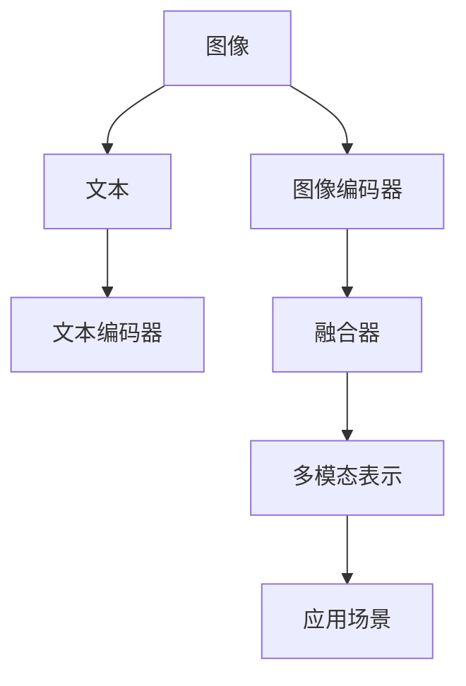

                 

# 多模态深度学习：图像和文本的融合

多模态深度学习(Multimodal Deep Learning)是将图像、文本、语音等多种不同类型的数据进行融合，构建能够同时处理多模态信息的高效模型。本文将系统探讨图像和文本融合的原理、技术细节、实现方法及其在实际应用中的体现。通过深入分析，希望能为读者提供多模态深度学习的全面理解与实践指导。

## 1. 背景介绍

### 1.1 问题由来
随着人工智能技术的不断进步，多模态深度学习已成为跨学科研究的热点领域。图像和文本作为人类交流的基本元素，具有各自独特的特征和优势。图像提供直观的视觉信息，而文本则承载了抽象的语言表达。将这两种模态数据进行融合，能够进一步提升人工智能系统的智能化水平。

近年来，多模态深度学习在多个应用场景中取得了显著成果，例如：

- 医疗影像分析：结合影像和病历文本，进行疾病诊断和治疗方案推荐。
- 智能翻译：将文字和语音进行融合，实现跨语言自动翻译。
- 安防监控：通过图像和文字结合的方式，提高视频内容的自动化识别和处理。
- 智能推荐系统：分析用户的浏览行为和反馈，生成个性化推荐结果。

多模态深度学习的实践，不仅拓展了人工智能应用的范围，也提高了系统的实用性和智能化程度。因此，深入理解图像和文本融合的技术细节，对于推动人工智能技术的发展具有重要意义。

### 1.2 问题核心关键点
为了更好地探索图像和文本的融合方法，本文将聚焦于以下几个核心关键点：

1. **多模态融合算法**：探讨如何将图像和文本信息有效地结合，提升融合效果。
2. **多模态编码器**：介绍用于图像和文本编码的深度学习模型及其原理。
3. **融合后的应用场景**：分析多模态深度学习在实际应用中的具体体现。
4. **技术挑战与未来方向**：评估当前研究面临的挑战，展望未来的发展趋势。

通过深入分析这些关键点，本文旨在为读者提供系统全面的多模态深度学习知识体系。

## 2. 核心概念与联系

### 2.1 核心概念概述

为了更清晰地理解图像和文本融合的过程，我们先简要介绍几个核心概念：

- **多模态深度学习**：结合多种类型数据（如图像、文本、音频）的深度学习模型。
- **图像编码器**：将图像信息转换为机器可理解的高维表示，常用的模型包括CNN、ResNet等。
- **文本编码器**：将文本信息转换为机器可理解的高维表示，常用的模型包括RNN、LSTM、Transformer等。
- **多模态融合**：将图像和文本信息进行有效结合，构建出综合多模态信息的模型。

这些概念之间的逻辑关系可以通过以下Mermaid流程图来展示：



这个流程图展示了图像和文本融合的核心流程：

1. 图像和文本分别经过独立的编码器，转换成高维表示。
2. 融合器将图像和文本表示进行有效结合，形成多模态表示。
3. 多模态表示可以应用于各种实际场景，提升系统的智能化水平。

## 3. 核心算法原理 & 具体操作步骤
### 3.1 算法原理概述

图像和文本的融合主要通过以下步骤实现：

1. **图像编码**：将图像信息转换为高维向量表示。
2. **文本编码**：将文本信息转换为高维向量表示。
3. **融合操作**：将图像和文本向量进行融合，得到多模态向量表示。
4. **下游任务**：在多模态向量表示上进行下游任务的预测或分类。

### 3.2 算法步骤详解

以下是图像和文本融合的核心算法步骤：

1. **数据预处理**：对图像和文本数据进行归一化、截断、填充等预处理操作。
2. **图像编码**：使用卷积神经网络(CNN)对图像进行编码，提取图像的视觉特征。
3. **文本编码**：使用循环神经网络(RNN)或Transformer对文本进行编码，提取文本的语言特征。
4. **融合操作**：通过注意力机制或拼接操作，将图像和文本表示进行融合，得到多模态表示。
5. **下游任务**：在多模态表示上进行下游任务的预测或分类，如图像分类、文本分类、图像-文本匹配等。

### 3.3 算法优缺点

图像和文本融合的算法具有以下优点：

1. **信息互补**：图像提供丰富的视觉信息，文本提供详细的语言描述，两者结合可以更好地理解复杂场景。
2. **提升性能**：融合后的多模态表示能够提供更全面的信息，提升模型的预测准确性和泛化能力。
3. **模型多样性**：融合算法的多样性使得可以在不同场景下选择最合适的融合方式，适应性更强。

同时，该算法也存在以下局限性：

1. **计算成本高**：图像和文本的独立编码和融合操作需要大量的计算资源。
2. **数据获取困难**：获取高质图像和文本数据需要大量的标注成本。
3. **融合效果不佳**：如何有效融合图像和文本表示是一个技术难题，存在多种融合方法之间的选择问题。

### 3.4 算法应用领域

图像和文本融合的多模态深度学习模型，在多个应用领域展现了广泛的应用前景，包括但不限于：

1. **医疗影像分析**：结合图像和电子病历，辅助医生进行疾病诊断和治疗方案推荐。
2. **智能翻译**：融合图像中的文字信息和语音识别结果，提升自动翻译的准确性。
3. **安防监控**：通过分析视频中的图像和文字信息，提升异常行为检测和分析能力。
4. **智能推荐系统**：结合用户浏览行为和反馈的文本信息，生成个性化推荐结果。
5. **社交媒体分析**：融合文本信息和图像内容，进行情感分析和舆情监测。

## 4. 数学模型和公式 & 详细讲解  
### 4.1 数学模型构建

假设图像和文本数据分别通过独立编码器得到高维表示 $f(x)$ 和 $g(y)$。多模态融合的目标是将两者有效结合，得到一个综合表示 $h(x, y)$。常用的融合方法包括拼接、注意力机制等。

**拼接融合**：最简单的方法是将图像和文本表示直接拼接，得到多模态表示：

$$ h(x, y) = [f(x); g(y)] $$

**注意力机制融合**：更复杂的方法是使用注意力机制，动态调整图像和文本的权重，进行融合：

$$ h(x, y) = \sum_{i,j} \alpha_{ij} f_i(x) g_j(y) $$

其中 $\alpha_{ij}$ 表示图像和文本表示之间的注意力权重。

### 4.2 公式推导过程

以注意力机制为例，假设图像编码器输出的特征表示为 $f(x) = \{f_i(x)\}_{i=1}^I$，文本编码器输出的特征表示为 $g(y) = \{g_j(y)\}_{j=1}^J$。注意力机制可以表示为：

$$ \alpha_{ij} = \text{softmax}(a_i(x) b_j(y)) $$

其中 $a_i(x)$ 和 $b_j(y)$ 分别为图像和文本表示的注意力得分函数。

注意力得分的计算可以基于点积、核函数等方法，常用的模型包括CNN-LSTM、CNN-Transformer等。

### 4.3 案例分析与讲解

假设有一个包含图像和文本的图像分类任务。图像表示 $f(x)$ 和文本表示 $g(y)$ 经过拼接融合得到多模态表示 $h(x, y) = [f(x); g(y)]$。在多模态表示上应用线性分类器，得到分类结果 $y'$：

$$ y' = W h(x, y) + b $$

其中 $W$ 和 $b$ 为分类器的权重和偏置。

## 5. 项目实践：代码实例和详细解释说明
### 5.1 开发环境搭建

为了实现图像和文本的融合，需要安装以下Python库：

- TensorFlow
- Keras
- OpenCV
- NLTK

首先，安装TensorFlow：

```bash
pip install tensorflow
```

接着，安装Keras：

```bash
pip install keras
```

然后，安装OpenCV：

```bash
pip install opencv-python
```

最后，安装NLTK：

```bash
pip install nltk
```

### 5.2 源代码详细实现

以下是一个简单的图像和文本融合示例，用于图像分类任务：

```python
import tensorflow as tf
from keras.applications import ResNet50
from keras.layers import Input, Dense, Embedding, Concatenate
from keras.models import Model
from nltk.corpus import stopwords
import cv2

# 定义图像编码器
def image_encoder():
    model = ResNet50(include_top=False, weights='imagenet')
    input_img = Input(shape=(224, 224, 3))
    x = model(input_img)
    return x

# 定义文本编码器
def text_encoder(text):
    stop_words = set(stopwords.words('english'))
    word_vectors = ...
    # 转换为向量表示
    vectorized_text = [word_vectors[word] if word not in stop_words else 0 for word in text]
    return vectorized_text

# 定义融合器
def fusion_layer(image, text):
    image = image_encoder()
    text = text_encoder(text)
    return Concatenate()([image, text])

# 定义多模态模型
def multimodal_model():
    image_input = Input(shape=(224, 224, 3))
    text_input = Input(shape=(None,))
    fusion_output = fusion_layer(image_input, text_input)
    class_output = Dense(1, activation='sigmoid')(fusion_output)
    model = Model(inputs=[image_input, text_input], outputs=[class_output])
    return model

# 加载模型
model = multimodal_model()

# 编译模型
model.compile(optimizer='adam', loss='binary_crossentropy', metrics=['accuracy'])

# 训练模型
# ...
```

### 5.3 代码解读与分析

以下是关键代码的详细解读：

- `image_encoder` 函数：使用ResNet50模型对图像进行编码，返回特征表示。
- `text_encoder` 函数：使用NLTK库对文本进行预处理，转换为向量表示。
- `fusion_layer` 函数：使用拼接方法将图像和文本表示进行融合。
- `multimodal_model` 函数：构建多模态模型，包含输入层、融合层和输出层。
- `model.compile` 方法：定义优化器、损失函数和评估指标。
- `model.fit` 方法：进行模型训练。

## 6. 实际应用场景
### 6.1 医疗影像分析

在医疗影像分析中，图像和文本的融合能够提供更全面的诊断信息。例如，结合医学影像和病历文本，可以辅助医生进行疾病诊断和治疗方案推荐。

具体实现可以采用CNN对医学影像进行编码，使用Transformer对病历文本进行编码，通过注意力机制将两者融合，得到多模态表示。在多模态表示上应用分类器，进行疾病诊断。

### 6.2 智能翻译

在智能翻译中，融合图像和文本信息可以提升翻译的准确性。例如，结合图片中的文字信息和翻译后的文本信息，进行双向校验，进一步提升翻译结果的可靠性。

具体实现可以采用CNN对图像进行编码，使用Transformer对文本进行编码，通过拼接方法将两者融合，得到多模态表示。在多模态表示上应用翻译模型，生成翻译结果。

### 6.3 安防监控

在安防监控中，融合图像和文本信息可以提升异常行为检测和分析能力。例如，结合视频中的图像信息和报警文本信息，进行综合判断，提高监控系统的智能化水平。

具体实现可以采用CNN对图像进行编码，使用RNN对文本进行编码，通过注意力机制将两者融合，得到多模态表示。在多模态表示上应用分类器，进行异常行为检测。

### 6.4 智能推荐系统

在智能推荐系统中，融合用户浏览行为和反馈的文本信息，可以生成更个性化的推荐结果。例如，结合用户的浏览记录和评论文本，进行综合分析，生成推荐列表。

具体实现可以采用CNN对用户浏览记录进行编码，使用LSTM对评论文本进行编码，通过拼接方法将两者融合，得到多模态表示。在多模态表示上应用推荐模型，生成推荐结果。

### 6.5 社交媒体分析

在社交媒体分析中，融合文本信息和图像内容，可以进行情感分析和舆情监测。例如，结合用户的评论文本和图片内容，进行综合判断，分析用户的情绪和观点。

具体实现可以采用Transformer对评论文本进行编码，使用CNN对图片进行编码，通过注意力机制将两者融合，得到多模态表示。在多模态表示上应用情感分析模型，分析用户的情绪。

## 7. 工具和资源推荐
### 7.1 学习资源推荐

为了帮助开发者掌握多模态深度学习技术，推荐以下学习资源：

1. 《深度学习》（周志华）：该书全面介绍了深度学习的基本原理和应用，包括多模态深度学习等内容。
2. Coursera《Multimodal Machine Learning》课程：由斯坦福大学开设，讲解多模态深度学习的基本概念和技术细节。
3. Google AI Blog：Google AI团队定期发布多模态深度学习的最新研究成果和实践经验。
4. arXiv：arXiv上有关多模态深度学习的论文和代码资源丰富，可快速获取最新的研究成果。

### 7.2 开发工具推荐

以下是一些常用的多模态深度学习开发工具：

1. TensorFlow：由Google开发的深度学习框架，支持多模态数据处理和融合。
2. PyTorch：由Facebook开发的深度学习框架，提供灵活的动态计算图，适合多模态模型的构建和训练。
3. Keras：基于TensorFlow和Theano的高级深度学习库，提供简洁的API接口，方便多模态模型的开发。
4. OpenCV：开源计算机视觉库，支持图像处理和分析。
5. NLTK：自然语言处理工具包，支持文本预处理和向量化。

### 7.3 相关论文推荐

以下是几篇具有代表性的多模态深度学习论文，推荐阅读：

1. "Look, Think and Learn" by Parmar et al.：提出视觉-语言融合的多模态深度学习框架，利用Transformer进行图像和文本的编码和融合。
2. "Show and Tell: A Neural Image Caption Generator" by Vinyals et al.：提出基于CNN-LSTM的图像描述生成模型，将图像和文本信息结合生成描述文本。
3. "FusionNet: Joint Image-Text Representation Learning" by Gao et al.：提出基于注意力机制的图像-文本融合模型，通过优化融合权重提升融合效果。
4. "Harnessing Pretrained Transformers for Multimodal Text-Image-Matching" by Wan et al.：提出基于Transformer的文本-图像匹配模型，结合图像和文本信息进行匹配任务。
5. "Vision-and-Language Navigation" by Paul et al.：提出基于多模态深度学习的导航任务，结合视觉信息和自然语言进行路径规划。

## 8. 总结：未来发展趋势与挑战

### 8.1 总结

本文系统介绍了图像和文本融合的多模态深度学习技术，从原理、步骤、优缺点、应用场景等多个方面进行了详细阐述。通过实例分析和案例讲解，展示了多模态深度学习在实际应用中的具体体现。

## 8.2 未来发展趋势

展望未来，多模态深度学习将呈现以下几个发展趋势：

1. **计算效率提升**：随着计算资源的发展，多模态深度学习模型的训练和推理效率将显著提升，更适用于实际应用。
2. **融合方法多样化**：随着融合算法的不断发展，更多高效、灵活的融合方法将被提出，提升多模态表示的质量。
3. **跨模态迁移学习**：通过跨模态迁移学习，使得不同模态的数据能够更有效地结合，提升模型的泛化能力。
4. **多模态增强现实**：将图像、文本、语音等多模态信息结合，构建增强现实系统，提升用户交互体验。

### 8.3 面临的挑战

尽管多模态深度学习技术取得了显著进展，但仍面临诸多挑战：

1. **数据获取困难**：获取高质图像和文本数据需要大量标注成本。
2. **融合效果不佳**：如何有效融合图像和文本表示是一个技术难题。
3. **计算资源需求高**：多模态深度学习模型需要大量的计算资源支持。
4. **模型复杂度高**：多模态模型的复杂度较高，不易解释和优化。

### 8.4 研究展望

未来多模态深度学习的研究需要从以下几个方面进行探索：

1. **跨模态迁移学习**：通过迁移学习，使得不同模态的数据能够更有效地结合。
2. **高效融合算法**：探索更高效、更灵活的融合算法，提升多模态表示的质量。
3. **跨模态增强现实**：将图像、文本、语音等多模态信息结合，构建增强现实系统。
4. **多模态智能交互**：研究多模态智能交互系统，提升人机交互的效率和自然度。

## 9. 附录：常见问题与解答

### Q1: 多模态深度学习和传统的深度学习有什么区别？

A: 多模态深度学习融合了多种类型的数据（如图像、文本、语音），而传统的深度学习仅关注单一模态的数据。多模态深度学习能够提供更全面的信息，提升模型的泛化能力和预测准确性。

### Q2: 多模态深度学习的计算成本高，如何解决？

A: 可以通过模型压缩、模型剪枝、参数共享等方法，减小模型的大小和计算量。此外，利用GPU、TPU等高性能计算资源，可以加速多模态深度学习的训练和推理过程。

### Q3: 多模态深度学习模型的解释性差，如何解决？

A: 可以通过可解释性技术，如LIME、SHAP等，对模型的决策过程进行可视化，增强模型的可解释性。同时，可以设计更简单、更易解释的多模态模型，如简单融合、拼接融合等。

### Q4: 多模态深度学习在实际应用中存在哪些挑战？

A: 数据获取困难、融合效果不佳、计算资源需求高等是主要挑战。需要结合实际应用场景，灵活选择融合算法，并优化模型结构，提升计算效率。

### Q5: 未来多模态深度学习的发展趋势是什么？

A: 计算效率提升、融合方法多样化、跨模态迁移学习、多模态增强现实等是主要发展趋势。需要结合实际需求，不断探索和优化多模态深度学习技术。

---

作者：禅与计算机程序设计艺术 / Zen and the Art of Computer Programming

