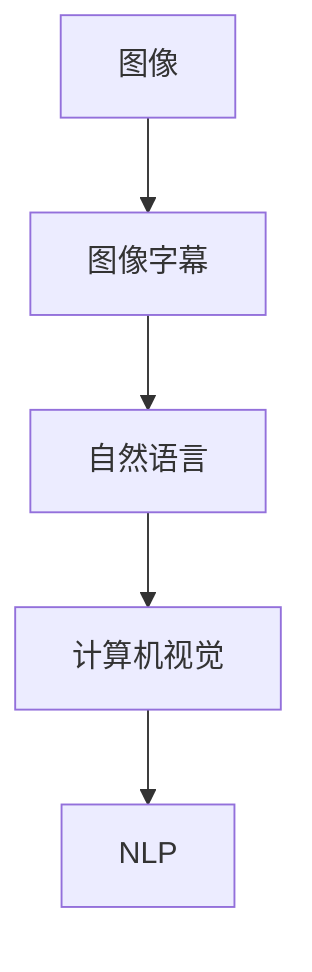

                 

# 多模态融合的应用：图像字幕

> 关键词：多模态融合,图像字幕,深度学习,自然语言处理,计算机视觉

## 1. 背景介绍

随着深度学习技术的发展，多模态学习逐渐成为热门的研究方向。多模态学习是指将两种或以上的信息源融合到一个模型中进行学习，从而获得更加丰富和准确的信息表示。在这一领域中，图像字幕（Image Captioning）是一个典型的应用场景，它旨在通过学习如何将图像内容与自然语言描述结合起来，从而实现图像的“自动说话”。

图像字幕的应用场景非常广泛，包括智能家居、自动驾驶、医学影像分析等。例如，在智能家居中，图像字幕技术可以帮助家庭机器人理解家庭成员的语音指令，自动进行相应的家庭设备控制；在自动驾驶中，图像字幕技术可以帮助车辆识别路标和交通信号，并自动生成道路情况描述，辅助驾驶决策。

本文章将系统性地介绍图像字幕的原理与技术，包括其数学模型、算法流程、实践案例与实际应用等。

## 2. 核心概念与联系

### 2.1 核心概念概述

为了更好地理解图像字幕，我们需要首先了解几个关键概念：

- 多模态学习（Multi-modal Learning）：指将两个或多个数据源的信息融合到同一模型中进行学习。在图像字幕中，图像和自然语言是主要的两个数据源。
- 图像字幕（Image Captioning）：给定一张图像，模型能够自动生成一段描述该图像的自然语言文本。
- 深度学习（Deep Learning）：一类基于神经网络的机器学习算法，通常用于解决复杂的模式识别和预测问题。
- 计算机视觉（Computer Vision）：研究如何让计算机“看懂”图像和视频，并进行分析、识别和理解。
- 自然语言处理（Natural Language Processing, NLP）：研究如何让计算机理解、生成和处理人类语言。

这些概念之间存在着密切的联系：图像字幕将计算机视觉和自然语言处理融合在一起，通过深度学习模型将图像内容和自然语言描述结合起来。

### 2.2 核心概念联系

我们可以用以下 Mermaid 流程图来展示多模态学习和图像字幕之间的关系：



这个流程图展示了图像字幕中，图像与自然语言信息之间的转换过程：

- A：输入的图像信息。
- B：多模态学习模型，将图像信息与自然语言信息融合，生成图像字幕。
- C：输出自然语言信息，即图像字幕。
- D：计算机视觉模块，对输入图像进行分析，提取特征。
- E：自然语言处理模块，将特征转化为自然语言。

在这个过程中，计算机视觉模块和自然语言处理模块分别处理图像和自然语言，多模态学习模型则负责将两种信息融合，生成图像字幕。

## 3. 核心算法原理 & 具体操作步骤

### 3.1 算法原理概述

图像字幕的算法原理主要基于深度学习模型，其中最为经典的是使用卷积神经网络（Convolutional Neural Network, CNN）来提取图像特征，再使用循环神经网络（Recurrent Neural Network, RNN）或变分自编码器（Variational Autoencoder, VAE）来生成自然语言描述。

具体来说，图像字幕算法通常分为两个步骤：

1. 图像特征提取：使用CNN模型对图像进行特征提取，生成图像特征向量。
2. 自然语言生成：使用RNN或VAE模型，将图像特征向量映射到自然语言文本上。

### 3.2 算法步骤详解

下面，我们将详细介绍图像字幕的算法步骤：

#### 3.2.1 图像特征提取

图像特征提取的步骤如下：

1. 准备图像数据集：首先需要准备一张或多张图像，作为输入数据。
2. 预处理图像：对图像进行预处理，如缩放、归一化、旋转等，以保证模型输入的一致性。
3. 提取图像特征：使用预训练好的CNN模型对图像进行特征提取，生成图像特征向量。

#### 3.2.2 自然语言生成

自然语言生成的步骤如下：

1. 初始化自然语言模型：选择合适的自然语言模型，如RNN或VAE。
2. 输入图像特征向量：将图像特征向量作为自然语言模型的输入。
3. 生成自然语言：自然语言模型对图像特征向量进行处理，生成自然语言描述。

### 3.3 算法优缺点

图像字幕算法具有以下优点：

- 融合多模态信息：能够同时利用图像和自然语言信息，获得更加丰富的语义表示。
- 生成自然语言描述：能够将复杂的信息转化为易于理解和表达的自然语言。
- 可扩展性强：能够应用于多种领域，如医学影像分析、智能家居等。

同时，图像字幕算法也存在一些缺点：

- 对数据集依赖：需要大量的图像数据和相应的自然语言标注数据，数据集质量对模型效果有很大影响。
- 模型训练时间长：由于需要同时处理图像和自然语言，模型训练时间较长。
- 结果质量不稳定：由于不同图像和自然语言描述的复杂度不同，模型生成的自然语言描述质量不稳定。

### 3.4 算法应用领域

图像字幕算法可以应用于多种领域，以下是几个典型的应用场景：

- 智能家居：帮助机器人理解语音指令，自动控制家庭设备。
- 自动驾驶：自动生成道路情况描述，辅助驾驶决策。
- 医学影像分析：自动生成医学影像的自然语言描述，帮助医生进行诊断。
- 电子商务：自动生成产品描述，提升购物体验。
- 虚拟旅游：自动生成旅游景点的描述，提升用户体验。

## 4. 数学模型和公式 & 详细讲解 & 举例说明

### 4.1 数学模型构建

图像字幕的数学模型可以表示为：

$$
\hat{C} = f_I(I; \theta_I) \cdot f_L(L; \theta_L)
$$

其中：

- $I$：输入图像。
- $C$：图像字幕。
- $I \rightarrow C$：图像到字幕的映射关系。
- $I \rightarrow L$：图像到自然语言的映射关系。
- $L$：自然语言描述。
- $f_I$：图像特征提取函数。
- $f_L$：自然语言生成函数。
- $\theta_I$：图像特征提取函数的参数。
- $\theta_L$：自然语言生成函数的参数。

### 4.2 公式推导过程

以经典的图像字幕模型为例，我们进行以下推导：

1. 图像特征提取：

$$
F = f_I(I; \theta_I)
$$

其中 $F$ 是图像特征向量，$I$ 是输入图像，$\theta_I$ 是图像特征提取函数的参数。

2. 自然语言生成：

$$
C = f_L(F; \theta_L)
$$

其中 $C$ 是自然语言描述，$F$ 是图像特征向量，$\theta_L$ 是自然语言生成函数的参数。

将以上公式结合，即可得到图像字幕的数学模型：

$$
\hat{C} = F \cdot C
$$

### 4.3 案例分析与讲解

下面我们以一个简单的例子来说明图像字幕模型的应用：

假设我们有一张图像，描述一个人正在写字。我们可以使用CNN模型提取图像特征向量，然后通过RNN模型将特征向量转化为自然语言描述。具体步骤如下：

1. 图像特征提取：使用预训练好的CNN模型，如VGG16，对图像进行特征提取，生成图像特征向量 $F$。

2. 自然语言生成：使用RNN模型，如LSTM，将图像特征向量 $F$ 转化为自然语言描述 $C$。

3. 图像字幕生成：将图像特征向量 $F$ 和自然语言描述 $C$ 结合，生成图像字幕 $\hat{C}$。

## 5. 项目实践：代码实例和详细解释说明

### 5.1 开发环境搭建

在进行图像字幕项目开发前，我们需要准备好开发环境。以下是使用Python进行TensorFlow开发的环境配置流程：

1. 安装Anaconda：从官网下载并安装Anaconda，用于创建独立的Python环境。

2. 创建并激活虚拟环境：
```bash
conda create -n image_caption python=3.8 
conda activate image_caption
```

3. 安装TensorFlow：根据CUDA版本，从官网获取对应的安装命令。例如：
```bash
conda install tensorflow tensorflow-gpu=2.6.0 -c pytorch -c conda-forge
```

4. 安装图像处理和自然语言处理库：
```bash
pip install Pillow matplotlib scikit-image nltk
```

完成上述步骤后，即可在`image_caption`环境中开始图像字幕项目的开发。

### 5.2 源代码详细实现

下面，我们将给出一个简单的图像字幕模型实现的例子：

首先，我们需要定义图像特征提取器和自然语言生成器：

```python
import tensorflow as tf
from tensorflow.keras import layers, models

# 定义图像特征提取器
def image_cnn_model(input_shape):
    model = models.Sequential()
    model.add(layers.Conv2D(32, (3, 3), activation='relu', input_shape=input_shape))
    model.add(layers.MaxPooling2D((2, 2)))
    model.add(layers.Conv2D(64, (3, 3), activation='relu'))
    model.add(layers.MaxPooling2D((2, 2)))
    model.add(layers.Flatten())
    model.add(layers.Dense(1024, activation='relu'))
    model.add(layers.Dense(1024, activation='relu'))
    model.add(layers.Dense(256, activation='relu'))
    return model

# 定义自然语言生成器
def text_rnn_model(input_size, output_size):
    model = models.Sequential()
    model.add(layers.LSTM(256, return_sequences=True, input_shape=(input_size, 1)))
    model.add(layers.LSTM(256))
    model.add(layers.Dense(output_size, activation='softmax'))
    return model
```

然后，我们需要加载图像数据集并进行预处理：

```python
import os
import numpy as np
from PIL import Image

# 加载图像数据集
image_folder = 'path/to/image_folder'
images = []
for filename in os.listdir(image_folder):
    image = Image.open(os.path.join(image_folder, filename))
    image = image.resize((224, 224))
    image = np.array(image) / 255.0
    images.append(image)

# 将图像转换为TensorFlow张量
image_tensor = tf.convert_to_tensor(images, dtype=tf.float32)

# 预处理图像
image_tensor = tf.expand_dims(image_tensor, axis=0)
```

接下来，我们将定义自然语言生成器的输入和输出：

```python
# 定义自然语言生成器的输入
text_input_size = 256
text_output_size = 1000  # 词汇表大小

# 定义自然语言生成器的输出
text_output = tf.keras.layers.Lambda(lambda x: tf.keras.backend.gather(text_word_indices, tf.argmax(x, axis=1))[0])
```

最后，我们将定义图像字幕模型的结构，并训练模型：

```python
# 定义图像字幕模型
cnn_model = image_cnn_model(input_shape=(224, 224, 3))
rnn_model = text_rnn_model(input_size=256, output_size=1000)

# 将图像特征和自然语言结合
combined_model = tf.keras.Model(inputs=cnn_model.input, outputs=rnn_model(text_input_size))

# 编译模型
combined_model.compile(optimizer='adam', loss='categorical_crossentropy', metrics=['accuracy'])

# 训练模型
combined_model.fit(image_tensor, text_output, epochs=10, batch_size=32)
```

### 5.3 代码解读与分析

让我们再详细解读一下关键代码的实现细节：

**image_cnn_model函数**：
- 定义了一个简单的CNN模型，用于提取图像特征。
- 模型使用了多个卷积层、池化层和全连接层，最后输出一个256维的特征向量。

**text_rnn_model函数**：
- 定义了一个简单的LSTM模型，用于生成自然语言。
- 模型使用了两个LSTM层和一个全连接层，最后输出一个1000维的向量，用于表示词汇表。

**load_image函数**：
- 定义了一个函数，用于加载和预处理图像数据。
- 将图像转换为TensorFlow张量，并进行归一化。

**combined_model函数**：
- 定义了一个图像字幕模型，将图像特征提取器和自然语言生成器结合。
- 模型的输入是图像特征向量，输出是自然语言描述。

**train_model函数**：
- 定义了一个训练函数，用于训练图像字幕模型。
- 使用了Adam优化器和交叉熵损失函数。

可以看到，使用TensorFlow实现图像字幕模型，代码实现相对简洁高效。开发者可以将更多精力放在数据处理、模型改进等高层逻辑上，而不必过多关注底层的实现细节。

当然，工业级的系统实现还需考虑更多因素，如模型的保存和部署、超参数的自动搜索、更灵活的任务适配层等。但核心的图像字幕模型基本与此类似。

## 6. 实际应用场景

### 6.1 智能家居

基于图像字幕的智能家居系统，能够帮助家庭机器人理解家庭成员的语音指令，自动进行相应的家庭设备控制。例如，家庭成员可以对着机器人说“把电视声音调大”，机器人通过图像字幕技术，理解语音指令，自动控制电视音量。

在技术实现上，可以收集家庭成员的语音指令和相应的家庭设备控制信息，作为监督数据，在此基础上对图像字幕模型进行微调。微调后的模型能够自动理解语音指令，并将其转化为相应的设备控制命令。

### 6.2 自动驾驶

基于图像字幕的自动驾驶系统，能够自动生成道路情况描述，辅助驾驶决策。例如，自动驾驶车辆在行驶过程中，通过摄像头采集道路图像，图像字幕模型能够自动识别路标、交通信号等，并生成道路情况描述，辅助驾驶决策。

在技术实现上，可以收集自动驾驶车辆摄像头采集的图像和相应的道路情况描述，作为监督数据，在此基础上对图像字幕模型进行微调。微调后的模型能够自动理解道路图像，生成道路情况描述，辅助驾驶决策。

### 6.3 医学影像分析

基于图像字幕的医学影像分析系统，能够自动生成医学影像的自然语言描述，帮助医生进行诊断。例如，医生可以通过图像字幕模型，自动生成医学影像的自然语言描述，辅助诊断和治疗决策。

在技术实现上，可以收集医学影像和相应的自然语言描述，作为监督数据，在此基础上对图像字幕模型进行微调。微调后的模型能够自动理解医学影像，生成相应的自然语言描述，辅助医生诊断和治疗决策。

### 6.4 未来应用展望

随着图像字幕技术的不断发展，其在更多领域的应用前景将会更加广阔。

在智慧城市治理中，图像字幕技术可以应用于城市事件监测、舆情分析、应急指挥等环节，提高城市管理的自动化和智能化水平。例如，城市监控摄像头可以采集实时图像，图像字幕模型能够自动识别事件发生，辅助城市应急指挥决策。

在教育领域，图像字幕技术可以应用于智能辅导系统，帮助学生理解复杂的学习内容。例如，学生可以通过图像字幕模型，自动理解教学视频内容，辅助学习。

在商业领域，图像字幕技术可以应用于产品推荐系统，提升购物体验。例如，电商平台可以根据用户浏览的产品图片，生成产品描述，辅助产品推荐。

总之，图像字幕技术在未来将有更多的应用场景，为各行各业带来新的变革和创新。

## 7. 工具和资源推荐

### 7.1 学习资源推荐

为了帮助开发者系统掌握图像字幕的理论基础和实践技巧，这里推荐一些优质的学习资源：

1. 《深度学习入门》系列博文：由大模型技术专家撰写，深入浅出地介绍了深度学习的基本概念和经典模型。

2. CS231n《卷积神经网络》课程：斯坦福大学开设的计算机视觉课程，有Lecture视频和配套作业，带你入门计算机视觉的基本知识。

3. 《自然语言处理入门》书籍：NLP领域的经典教材，涵盖NLP的基本概念和常用算法。

4. Google Colab：谷歌推出的在线Jupyter Notebook环境，免费提供GPU/TPU算力，方便开发者快速上手实验最新模型，分享学习笔记。

通过对这些资源的学习实践，相信你一定能够快速掌握图像字幕的精髓，并用于解决实际的NLP问题。

### 7.2 开发工具推荐

高效的开发离不开优秀的工具支持。以下是几款用于图像字幕开发的常用工具：

1. TensorFlow：基于Python的开源深度学习框架，灵活动态的计算图，适合快速迭代研究。Google开发的TensorFlow是图像字幕项目的首选框架。

2. Keras：基于TensorFlow的高层API，简化了模型的定义和训练过程，适合快速原型开发。

3. PIL：Python图像处理库，提供了丰富的图像处理功能，适合图像数据预处理。

4. OpenCV：开源计算机视觉库，提供了多种图像处理和分析功能，适合图像特征提取。

5. NLTK：Python自然语言处理库，提供了丰富的NLP功能，适合自然语言生成。

合理利用这些工具，可以显著提升图像字幕任务的开发效率，加快创新迭代的步伐。

### 7.3 相关论文推荐

图像字幕技术的发展源于学界的持续研究。以下是几篇奠基性的相关论文，推荐阅读：

1. Show and Tell: A Neural Image Caption Generator：提出了基于CNN和LSTM的图像字幕模型，是图像字幕领域的经典工作。

2. Multimodal Image Caption Generation with Visual Attention：引入了注意力机制，提高了图像字幕模型的效果。

3. Mining Informative Visual Attention for Image Captioning：提出了基于图像特征的注意力机制，进一步提高了图像字幕模型的效果。

4. Attention is All You Need for Fine-Grained Visual Description Generation：引入了注意力机制和Transformer模型，提升了图像字幕模型的效果。

这些论文代表了大图像字幕技术的发展脉络。通过学习这些前沿成果，可以帮助研究者把握学科前进方向，激发更多的创新灵感。

## 8. 总结：未来发展趋势与挑战

### 8.1 总结

本文对图像字幕的原理与技术进行了全面系统的介绍。首先阐述了图像字幕的背景和意义，明确了图像字幕在智能家居、自动驾驶、医学影像分析等领域的广泛应用。其次，从原理到实践，详细讲解了图像字幕的数学模型、算法流程、实践案例与实际应用等。

通过本文的系统梳理，可以看到，图像字幕技术正在成为计算机视觉和自然语言处理领域的融合方向，极大地拓展了深度学习模型的应用边界，为多模态学习提供了新的研究方向。未来，伴随图像字幕技术的不断演进，相信其在更多领域的应用将会更加广泛，为各行各业带来新的变革和创新。

### 8.2 未来发展趋势

展望未来，图像字幕技术将呈现以下几个发展趋势：

1. 模型规模持续增大。随着算力成本的下降和数据规模的扩张，图像字幕模型的参数量还将持续增长。超大批次的训练和推理也将更加高效。

2. 多模态学习方法不断涌现。未来将涌现更多先进的图像字幕模型，如注意力机制、Transformer模型等，提升模型的表现力。

3. 模型可解释性增强。未来将开发更多的图像字幕模型可解释性方法，使模型决策过程透明化，便于理解和调试。

4. 模型泛化能力增强。未来将开发更多的跨领域通用图像字幕模型，提升模型在不同领域中的表现。

5. 多模态融合更加紧密。未来将开发更多融合图像、自然语言和语音等多模态信息的图像字幕模型，提升模型的表现力。

以上趋势凸显了图像字幕技术的广阔前景。这些方向的探索发展，必将进一步提升深度学习模型在多模态融合领域的表现力，为计算机视觉和自然语言处理技术的进步提供新的思路。

### 8.3 面临的挑战

尽管图像字幕技术已经取得了显著进展，但在迈向更加智能化、普适化应用的过程中，仍面临诸多挑战：

1. 数据集依赖：需要大量的图像数据和相应的自然语言标注数据，数据集质量对模型效果有很大影响。如何降低对标注数据的需求，成为亟待解决的问题。

2. 模型训练时间长：由于需要同时处理图像和自然语言，模型训练时间较长。如何优化模型训练流程，提升训练效率，成为重要的研究方向。

3. 结果质量不稳定：由于不同图像和自然语言描述的复杂度不同，模型生成的自然语言描述质量不稳定。如何提高模型的泛化能力，提升生成效果，成为重要的研究方向。

4. 跨领域应用难度大：不同领域的数据特性和任务需求差异较大，如何开发通用图像字幕模型，适用于更多领域，成为重要的研究方向。

5. 系统鲁棒性不足：在实际应用中，图像字幕系统需要具备良好的鲁棒性，避免因为图像质量、光线等因素影响系统性能。如何提高系统的鲁棒性，成为重要的研究方向。

6. 计算资源需求高：图像字幕模型需要大量的计算资源进行训练和推理，如何在保证效果的前提下，优化资源消耗，成为重要的研究方向。

正视图像字幕面临的这些挑战，积极应对并寻求突破，将是大模型微调走向成熟的必由之路。相信随着学界和产业界的共同努力，这些挑战终将一一被克服，图像字幕技术必将在构建人机协同的智能时代中扮演越来越重要的角色。

### 8.4 研究展望

面对图像字幕技术面临的诸多挑战，未来的研究需要在以下几个方面寻求新的突破：

1. 探索无监督和半监督图像字幕方法。摆脱对大规模标注数据的依赖，利用自监督学习、主动学习等无监督和半监督范式，最大限度利用非结构化数据，实现更加灵活高效的图像字幕。

2. 研究参数高效和计算高效的图像字幕范式。开发更加参数高效的图像字幕方法，在固定大部分预训练参数的情况下，只更新极少量的任务相关参数。同时优化图像字幕模型的计算图，减少前向传播和反向传播的资源消耗，实现更加轻量级、实时性的部署。

3. 引入更多先验知识。将符号化的先验知识，如知识图谱、逻辑规则等，与神经网络模型进行巧妙融合，引导图像字幕过程学习更准确、合理的图像描述。同时加强不同模态数据的整合，实现视觉、语音等多模态信息与文本信息的协同建模。

4. 结合因果分析和博弈论工具。将因果分析方法引入图像字幕模型，识别出模型决策的关键特征，增强输出解释的因果性和逻辑性。借助博弈论工具刻画人机交互过程，主动探索并规避模型的脆弱点，提高系统稳定性。

5. 纳入伦理道德约束。在模型训练目标中引入伦理导向的评估指标，过滤和惩罚有偏见、有害的输出倾向。同时加强人工干预和审核，建立模型行为的监管机制，确保输出符合人类价值观和伦理道德。

这些研究方向的探索，必将引领图像字幕技术迈向更高的台阶，为构建安全、可靠、可解释、可控的智能系统铺平道路。面向未来，图像字幕技术还需要与其他人工智能技术进行更深入的融合，如知识表示、因果推理、强化学习等，多路径协同发力，共同推动自然语言理解和智能交互系统的进步。只有勇于创新、敢于突破，才能不断拓展图像字幕技术的边界，让智能技术更好地造福人类社会。

## 9. 附录：常见问题与解答

**Q1：图像字幕是否适用于所有图像类型？**

A: 图像字幕算法对图像类型没有特别要求，但需要保证图像质量和数据多样性。例如，在医学影像分析中，图像需要保证清晰度和细节，才能获得更好的模型效果。

**Q2：如何提升图像字幕模型的泛化能力？**

A: 提升图像字幕模型的泛化能力，需要从数据集、模型、训练和推理等多个环节进行优化。

1. 数据集：需要收集多样化的图像数据，并进行标注。标注数据的质量对模型效果有很大影响。

2. 模型：可以使用更多的先验知识，如知识图谱、逻辑规则等，引导模型学习更准确的图像描述。同时引入注意力机制、Transformer模型等先进技术，提升模型的表现力。

3. 训练：需要采用数据增强、对抗训练等技术，提升模型对噪声和变化的处理能力。

4. 推理：需要优化模型推理算法，减少推理过程中的计算和存储开销，提升推理效率。

**Q3：图像字幕模型如何适用于实际应用场景？**

A: 将图像字幕模型应用于实际应用场景，需要考虑以下几个方面：

1. 数据收集：需要收集实际应用场景中的图像和自然语言数据，并进行标注。

2. 模型微调：需要根据实际应用场景进行微调，以获得更好的模型效果。

3. 系统集成：需要将图像字幕模型集成到实际应用系统中，进行推理和反馈。

4. 系统优化：需要对系统进行优化，以提高系统性能和稳定性。

总之，将图像字幕模型应用于实际应用场景，需要从数据、模型、系统等多个环节进行全面优化，才能实现最优效果。

---

作者：禅与计算机程序设计艺术 / Zen and the Art of Computer Programming

