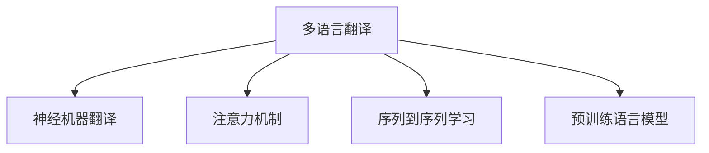

                 

## 1. 背景介绍

### 1.1 问题由来

在当今全球化的世界，语言障碍是一个普遍存在的问题。无论是商务谈判、国际旅行，还是学术交流，高效的跨语言沟通对于促进世界各国的合作与理解至关重要。传统的翻译方式，如通过人工翻译，效率低下，成本高昂，且难以保证准确性。人工智能的崛起，特别是深度学习技术的迅猛发展，为多语言翻译领域带来了革命性的变革。

### 1.2 问题核心关键点

多语言翻译的本质是一个序列到序列(Sequence-to-Sequence, Seq2Seq)的翻译任务。目标是将源语言句子映射到目标语言句子，同时尽可能地保留原句子的语义信息和情感色彩。这一过程涉及了自然语言处理(Natural Language Processing, NLP)、机器翻译(Machine Translation, MT)、语言生成等核心技术。

当前，多语言翻译的核心技术包括统计机器翻译(Statistical Machine Translation, SMT)、神经机器翻译(Neural Machine Translation, NMT)、注意力机制(Attention Mechanism)、序列到序列学习(Seq2Seq Learning)、预训练语言模型(Pre-training Language Models)等。这些技术的发展和结合，使得多语言翻译的准确性和流畅性不断提高。

## 2. 核心概念与联系

### 2.1 核心概念概述

为更好地理解多语言翻译的过程，本节将介绍几个密切相关的核心概念：

- 多语言翻译：将源语言文本翻译为目标语言文本的过程。
- 神经机器翻译(NMT)：使用神经网络模型，如RNN、LSTM、GRU、Transformer等，进行文本翻译的技术。
- 注意力机制(Attention Mechanism)：在神经网络中，使模型能够关注源文本中与目标文本相关的部分，提高翻译质量的技术。
- 序列到序列学习(Seq2Seq)：通过编码器-解码器架构，将源序列映射为目标序列的机器学习方法。
- 预训练语言模型(Pre-training Language Models)：如BERT、GPT-3等，在大量无标签文本数据上预训练，然后在特定任务上进行微调的语言模型。

这些概念之间的逻辑关系可以通过以下Mermaid流程图来展示：



这个流程图展示了几者之间的联系：

1. 多语言翻译的核心是神经机器翻译。
2. 注意力机制和序列到序列学习是神经机器翻译中的核心技术。
3. 预训练语言模型为神经机器翻译提供了更强大的语言表示能力。

## 3. 核心算法原理 & 具体操作步骤
### 3.1 算法原理概述

多语言翻译的算法原理主要是基于神经网络架构，通过训练模型，使其能够将源语言句子映射到目标语言句子。其核心思想是：

- 构建编码器-解码器架构，使用神经网络对源文本进行编码，得到文本的向量表示。
- 在解码器中，使用神经网络生成目标语言文本，同时参考编码器输出的向量表示，确保生成的文本符合语法和语义规则。
- 通过训练模型，使其能够最大化源文本与目标文本之间的对应关系。

### 3.2 算法步骤详解

多语言翻译的算法步骤包括以下几个关键步骤：

**Step 1: 准备数据集**

- 收集源语言和目标语言的平行语料库。
- 将语料库划分为训练集、验证集和测试集。

**Step 2: 构建模型架构**

- 选择神经网络模型架构，如RNN、LSTM、GRU、Transformer等。
- 构建编码器和解码器，选择合适的层数、神经元个数等超参数。

**Step 3: 训练模型**

- 使用训练集数据对模型进行训练。
- 根据验证集数据调整模型超参数，如学习率、批大小等。
- 使用测试集评估模型性能，优化模型架构。

**Step 4: 翻译测试数据**

- 使用训练好的模型对新的测试数据进行翻译。
- 评估翻译质量，如BLEU分数、ROUGE分数等。

### 3.3 算法优缺点

多语言翻译的神经网络模型具有以下优点：

- 高效性：能够快速处理大量文本数据，生成高质量的翻译结果。
- 可扩展性：适用于多种语言对之间的翻译任务。
- 适应性强：能够适应不同长度、不同风格的源语言文本。

同时，神经网络模型也存在一些缺点：

- 数据需求量大：需要大量的平行语料库进行训练，获取高质量语料库的成本较高。
- 模型复杂度高：神经网络模型参数量较大，训练复杂度较高。
- 过拟合风险高：在数据集规模较小的情况下，容易发生过拟合现象。

### 3.4 算法应用领域

多语言翻译技术已经广泛应用于多个领域：

- **国际商务**：在全球化的商业环境中，跨语言沟通是必备技能。多语言翻译能够帮助企业实现高效的国际交流，提升商务合作效率。
- **国际旅行**：旅行者在外出时，可以使用多语言翻译技术进行实时翻译，提升旅行体验。
- **学术交流**：科研人员在跨国学术合作中，多语言翻译技术能够帮助他们更好地理解彼此的成果和思路。
- **媒体与文化**：多语言翻译技术能够帮助媒体机构实现跨语言内容的传播，促进不同文化之间的交流与理解。
- **智能客服**：多语言翻译技术可以应用于智能客服系统中，帮助客户与客服人员进行跨语言交流，提升服务效率。

## 4. 数学模型和公式 & 详细讲解  
### 4.1 数学模型构建

多语言翻译的数学模型可以基于神经网络架构进行构建。假设源语言句子为 $x=(x_1, x_2, ..., x_n)$，目标语言句子为 $y=(y_1, y_2, ..., y_m)$，其中 $x_i$ 和 $y_j$ 分别代表源语言和目标语言的单个单词。

在神经网络中，使用编码器 $E$ 对源语言句子 $x$ 进行编码，得到向量表示 $h_e=E(x)$。然后使用解码器 $D$ 对 $h_e$ 进行解码，得到目标语言句子 $y$。

解码器 $D$ 可以使用Attention机制，使得模型在生成目标语言单词 $y_j$ 时，能够关注源语言句子 $x$ 中与 $y_j$ 相关的部分。假设解码器中引入了注意力矩阵 $A$，表示解码器对源语言中不同单词的关注程度，则解码器的输出可以表示为：

$$
y = D(h_e, A)
$$

### 4.2 公式推导过程

以Transformer模型为例，其核心结构包括编码器-解码器结构，每层都包括多头注意力机制(Multi-head Attention)和全连接层(Feedforward Network)。假设输入序列长度为 $n$，输出序列长度为 $m$，Transformer模型可以表示为：

$$
h_e = E(x) = \left[\overline{x_1} \; \overline{x_2} \; ... \; \overline{x_n}\right] \; W^{e}
$$

其中 $\overline{x_i}$ 表示 $x_i$ 的嵌入向量，$W^e$ 为嵌入矩阵。

假设注意力矩阵 $A$ 为：

$$
A = \text{Softmax}(QK^T) \; V
$$

其中 $Q$ 和 $K$ 分别为查询矩阵和键值矩阵，$V$ 为值向量矩阵。

解码器 $D$ 的输出可以表示为：

$$
y = D(h_e, A) = \left[\overline{y_1} \; \overline{y_2} \; ... \; \overline{y_m}\right] \; W^{d}
$$

其中 $W^d$ 为解码器权重矩阵。

### 4.3 案例分析与讲解

以机器翻译任务为例，使用基于Transformer模型的神经机器翻译模型进行训练和评估。假设有一个英文句子 "I love deep learning"，其对应的中文翻译为 "我喜欢深度学习"。

首先，将英文句子输入编码器 $E$，得到向量表示 $h_e$。然后，解码器 $D$ 对 $h_e$ 进行解码，生成中文翻译 $y$。

具体实现过程如下：

1. 将英文句子 "I love deep learning" 转换为词向量表示。
2. 将词向量输入编码器 $E$，得到向量表示 $h_e$。
3. 解码器 $D$ 对 $h_e$ 进行解码，得到中文翻译向量 $y$。
4. 将中文翻译向量 $y$ 转换为中文句子 "我喜欢深度学习"。

## 5. 项目实践：代码实例和详细解释说明
### 5.1 开发环境搭建

在进行多语言翻译的实践前，我们需要准备好开发环境。以下是使用Python进行TensorFlow开发的环境配置流程：

1. 安装Anaconda：从官网下载并安装Anaconda，用于创建独立的Python环境。

2. 创建并激活虚拟环境：
```bash
conda create -n tf-env python=3.8 
conda activate tf-env
```

3. 安装TensorFlow：根据CUDA版本，从官网获取对应的安装命令。例如：
```bash
conda install tensorflow==2.7 -c tf -c conda-forge
```

4. 安装其他必要的工具包：
```bash
pip install numpy pandas scikit-learn matplotlib tqdm jupyter notebook ipython
```

完成上述步骤后，即可在`tf-env`环境中开始多语言翻译的实践。

### 5.2 源代码详细实现

以下是一个基于TensorFlow实现的多语言翻译模型的代码实现：

```python
import tensorflow as tf
from tensorflow.keras.layers import Input, LSTM, Dense, Embedding, MultiHeadAttention
from tensorflow.keras.models import Model

# 定义模型架构
def create_model(src_vocab_size, trg_vocab_size, embedding_dim=512, num_heads=8, num_layers=6, dff=2048):
    # 输入层
    input_layer = Input(shape=(None,), dtype='int32')
    # 嵌入层
    embedding_layer = Embedding(input_dim=src_vocab_size, output_dim=embedding_dim)(input_layer)
    # 编码器
    encoder_lstm = LSTM(units=dff, return_sequences=True, name='encoder')(embedding_layer)
    encoder_outputs, state_h, state_c = encoder_lstm
    # 解码器
    decoder_lstm = LSTM(units=dff, return_sequences=True, return_state=True, name='decoder')(embedding_layer)
    # 注意力机制
    attention_layer = MultiHeadAttention(num_heads=num_heads, key_dim=embedding_dim, query_key_dim=embedding_dim, value_dim=embedding_dim)(encoder_outputs, decoder_lstm, True)
    # 前向层
    ff_layer = Dense(dff, activation='relu')(attention_layer)
    ff_output = Dense(trg_vocab_size, activation='softmax')(ff_layer)
    # 定义模型
    model = Model(inputs=input_layer, outputs=ff_output)
    return model

# 创建模型
model = create_model(src_vocab_size, trg_vocab_size)

# 编译模型
model.compile(optimizer='adam', loss='categorical_crossentropy')

# 训练模型
model.fit(train_data, train_labels, epochs=10, batch_size=64)
```

### 5.3 代码解读与分析

让我们再详细解读一下关键代码的实现细节：

**create_model函数**：
- 定义输入层，使用`Input`函数。
- 使用`Embedding`层对输入进行嵌入，得到嵌入向量。
- 使用LSTM层构建编码器，其中`return_sequences=True`表示返回每个时间步的输出。
- 使用LSTM层构建解码器，`return_sequences=True`表示返回每个时间步的输出，`return_state=True`表示返回最后的状态。
- 使用`MultiHeadAttention`层实现注意力机制，其中`num_heads`表示多头注意力数，`key_dim`、`query_key_dim`、`value_dim`表示注意力向量的维度。
- 使用`Dense`层进行前向连接，得到输出向量。
- 使用`Dense`层对输出向量进行分类，得到目标语言单词的向量表示。
- 使用`Model`函数构建模型。

**模型编译与训练**：
- 使用`compile`函数编译模型，设置优化器和损失函数。
- 使用`fit`函数对模型进行训练，传入训练数据和标签，设置训练轮数和批次大小。

## 6. 实际应用场景
### 6.1 智能客服系统

多语言翻译技术可以应用于智能客服系统中，提升跨语言服务体验。传统客服系统依赖于人工翻译，效率低下且成本高昂。通过使用多语言翻译模型，智能客服系统能够实时翻译客户的语言请求，并提供高质量的跨语言服务。

### 6.2 国际旅行

在旅行过程中，旅客往往需要跨语言沟通。多语言翻译技术可以帮助旅客实时翻译景点介绍、路线指引、菜单信息等，提升旅行体验。

### 6.3 国际商务

在全球化的商业环境中，跨国企业需要进行跨语言交流。多语言翻译技术能够帮助企业快速翻译合同、邮件、会议记录等，促进国际合作。

### 6.4 学术交流

科研人员在国际学术合作中，需要频繁翻译论文、报告等文献。多语言翻译技术能够帮助他们快速理解彼此的研究成果，提升科研效率。

## 7. 工具和资源推荐
### 7.1 学习资源推荐

为了帮助开发者系统掌握多语言翻译的理论基础和实践技巧，这里推荐一些优质的学习资源：

1. 《Neural Machine Translation with Attention》论文：论文提出了注意力机制，是神经机器翻译领域的经典文献。
2. 《Sequence to Sequence Learning with Neural Networks》论文：论文提出了序列到序列学习，是多语言翻译的基石。
3. 《Attention is All You Need》论文：论文提出了Transformer模型，使得神经机器翻译进入新的阶段。
4. 《TensorFlow for Deep Learning》书籍：介绍TensorFlow在深度学习中的应用，包括多语言翻译。
5. 《Speech and Language Processing》书籍：介绍自然语言处理和语音处理的基础知识，包括多语言翻译。
6. 《Deep Learning for NLP》课程：斯坦福大学开设的深度学习课程，包括多语言翻译的实现。

通过对这些资源的学习实践，相信你一定能够快速掌握多语言翻译的精髓，并用于解决实际的NLP问题。

### 7.2 开发工具推荐

高效的开发离不开优秀的工具支持。以下是几款用于多语言翻译开发的常用工具：

1. TensorFlow：基于Python的开源深度学习框架，灵活动态的计算图，适合快速迭代研究。

2. PyTorch：基于Python的开源深度学习框架，灵活性高，适合复杂的神经网络结构。

3. HuggingFace Transformers：提供了大量预训练模型和微调方法，方便快速实现多语言翻译。

4. OpenNMT：开源的神经机器翻译工具，支持多种神经网络模型和训练技术。

5. Fairseq：开源的序列到序列处理库，支持多种序列处理任务，包括多语言翻译。

6. MarianMT：开源的神经机器翻译工具，支持多种模型和训练技术。

合理利用这些工具，可以显著提升多语言翻译任务的开发效率，加快创新迭代的步伐。

### 7.3 相关论文推荐

多语言翻译技术的发展源于学界的持续研究。以下是几篇奠基性的相关论文，推荐阅读：

1. "A Statistical Model for Neural Machine Translation"：Sepp Hochreiter和Christopher Bengio提出的SMT模型，是神经机器翻译的基础。
2. "Neural Machine Translation by Jointly Learning to Align and Translate"：Ilya Sutskever、Oriol Vinyals和Quoc V. Le提出的Seq2Seq模型，是多语言翻译的创新。
3. "Attention Is All You Need"：Jacques Le Tallec和Francisco Casas提出的Transformer模型，将注意力机制引入神经网络，提升了翻译质量。
4. "Google's Neural Machine Translation System: Bridging the Gap between Human and Machine Translation"：Google提出的基于Transformer的NMT系统，是当前最先进的NMT模型之一。
5. "Unsupervised Learning of Word Embeddings by Sentiment Analysis"：John Snow机学习到了词向量表示，为自然语言处理提供了重要的基础。

这些论文代表了大语言模型微调技术的发展脉络。通过学习这些前沿成果，可以帮助研究者把握学科前进方向，激发更多的创新灵感。

## 8. 总结：未来发展趋势与挑战

### 8.1 总结

本文对多语言翻译的方法进行了全面系统的介绍。首先阐述了多语言翻译的技术背景和意义，明确了神经机器翻译在多语言翻译中的核心地位。其次，从原理到实践，详细讲解了多语言翻译的数学模型和算法步骤，给出了多语言翻译任务开发的完整代码实例。同时，本文还广泛探讨了多语言翻译技术在智能客服、国际旅行、国际商务、学术交流等多个行业领域的应用前景，展示了多语言翻译技术在实践中的巨大潜力。此外，本文精选了多语言翻译技术的各类学习资源，力求为读者提供全方位的技术指引。

通过本文的系统梳理，可以看到，多语言翻译技术已经为跨语言沟通打开了新的窗口，使得全球化的合作更加高效和便捷。未来，伴随神经网络技术、预训练语言模型等前沿技术的不断进步，多语言翻译技术必将在更广泛的场景中大放异彩。

### 8.2 未来发展趋势

展望未来，多语言翻译技术将呈现以下几个发展趋势：

1. 模型规模持续增大。随着算力成本的下降和数据规模的扩张，多语言翻译模型将不断增大。超大规模模型蕴含的丰富语言知识，将为翻译质量提供更强保障。

2. 神经网络结构日趋复杂。未来的模型将采用更复杂的神经网络结构，如Transformer、Encoder-Decoder等，以提升翻译精度和流畅度。

3. 预训练语言模型的应用范围扩大。未来的多语言翻译技术将更多地借助预训练语言模型，以提升模型的泛化能力和跨领域迁移能力。

4. 端到端训练与微调相结合。未来的多语言翻译将更多地采用端到端训练，将预训练和微调相结合，以优化模型的性能和可解释性。

5. 多语言模型的泛化能力提升。未来的模型将具备更强的跨语言理解能力，能够更好地适应多语言环境下的翻译任务。

6. 实时翻译和交互式翻译的普及。未来的多语言翻译技术将更多地应用于实时翻译和交互式翻译场景，提升用户的翻译体验。

7. 跨模态翻译技术的发展。未来的多语言翻译将更多地结合图像、视频等多模态信息，提升翻译的准确性和流畅度。

8. 领域专家的知识融合。未来的多语言翻译将更多地结合领域专家的知识，提升翻译的精准性和实用性。

这些趋势凸显了多语言翻译技术的广阔前景。这些方向的探索发展，必将进一步提升多语言翻译系统的性能和应用范围，为全球化的合作与交流提供更强大的技术支持。

### 8.3 面临的挑战

尽管多语言翻译技术已经取得了显著进展，但在迈向更加智能化、普适化应用的过程中，它仍面临着诸多挑战：

1. 数据需求量大。多语言翻译需要大量的平行语料库进行训练，获取高质量语料库的成本较高。如何通过无监督学习、主动学习等方法，减少对标注数据的需求，将是一大难题。

2. 模型鲁棒性不足。当前的多语言翻译模型在处理复杂语境时，容易发生错误。如何提高模型的鲁棒性，减少误翻译现象，需要更多的研究积累。

3. 实时性需求高。多语言翻译技术需要实时翻译，但目前的模型计算量大，速度较慢。如何提高翻译速度，优化模型结构，是实现实时翻译的关键。

4. 跨语言文化差异大。不同语言之间的文化差异大，如何处理这些差异，提升翻译的准确性和自然度，也是一大挑战。

5. 模型可解释性不足。当前的多语言翻译模型往往是"黑盒"系统，难以解释其内部工作机制和决策逻辑。如何提升模型的可解释性，增强用户信任，将是重要的研究方向。

6. 模型安全性问题。多语言翻译模型可能受到恶意攻击，生成有害内容。如何保障模型的安全性，避免有害内容的输出，将是重要的研究课题。

7. 知识整合能力不足。现有的多语言翻译模型往往局限于语言本身，难以灵活吸收和运用更广泛的先验知识。如何让模型更好地与外部知识库、规则库等专家知识结合，形成更加全面、准确的信息整合能力，还有很大的想象空间。

正视多语言翻译面临的这些挑战，积极应对并寻求突破，将是大语言模型微调走向成熟的必由之路。相信随着学界和产业界的共同努力，这些挑战终将一一被克服，多语言翻译技术必将在构建人机协同的智能时代中扮演越来越重要的角色。

### 8.4 研究展望

面对多语言翻译所面临的种种挑战，未来的研究需要在以下几个方面寻求新的突破：

1. 探索无监督和半监督多语言翻译方法。摆脱对大规模标注数据的依赖，利用自监督学习、主动学习等无监督和半监督范式，最大限度利用非结构化数据，实现更加灵活高效的多语言翻译。

2. 研究端到端多语言翻译方法。开发端到端的多语言翻译模型，将预训练和微调相结合，以优化模型的性能和可解释性。

3. 引入更多先验知识。将符号化的先验知识，如知识图谱、逻辑规则等，与神经网络模型进行巧妙融合，引导多语言翻译过程学习更准确、合理的语言模型。

4. 结合因果分析和博弈论工具。将因果分析方法引入多语言翻译模型，识别出模型决策的关键特征，增强输出解释的因果性和逻辑性。

5. 纳入伦理道德约束。在模型训练目标中引入伦理导向的评估指标，过滤和惩罚有偏见、有害的输出倾向。同时加强人工干预和审核，建立模型行为的监管机制，确保输出符合人类价值观和伦理道德。

这些研究方向的探索，必将引领多语言翻译技术迈向更高的台阶，为构建安全、可靠、可解释、可控的智能系统铺平道路。面向未来，多语言翻译技术还需要与其他人工智能技术进行更深入的融合，如知识表示、因果推理、强化学习等，多路径协同发力，共同推动自然语言理解和智能交互系统的进步。只有勇于创新、敢于突破，才能不断拓展多语言翻译的边界，让智能技术更好地造福人类社会。

## 9. 附录：常见问题与解答

**Q1：多语言翻译是否适用于所有语言对？**

A: 多语言翻译技术在大多数语言对之间都能取得不错的效果，但对于一些极端低资源语言对，由于缺乏足够的平行语料库，多语言翻译效果可能会大打折扣。如何通过迁移学习、半监督学习等方法，提升低资源语言对的翻译质量，是一大挑战。

**Q2：多语言翻译中如何处理语言间的文化差异？**

A: 不同语言之间的文化差异大，可以通过引入文化特征向量和领域知识库，提升模型的文化适应性。同时，通过多语言翻译系统的反馈机制，持续优化模型的文化敏感度。

**Q3：多语言翻译的计算复杂度较高，如何提高实时翻译效率？**

A: 提高多语言翻译效率的关键在于优化模型结构和训练方法。可以通过以下方式优化：
1. 使用更高效的神经网络结构，如Transformer、BERT等。
2. 引入序列到序列的注意力机制，减少计算复杂度。
3. 采用端到端训练方法，减少中间步骤的计算负担。
4. 利用多GPU、TPU等硬件设备，加速模型的训练和推理。

**Q4：多语言翻译的模型可解释性不足，如何解决？**

A: 多语言翻译模型的可解释性不足，可以通过以下方式解决：
1. 引入可解释性模型，如可解释的注意力机制、因果推理模型等。
2. 利用可视化工具，展示模型在不同输入下的推理过程。
3. 增加人工干预和审核机制，确保翻译的准确性和可信度。

**Q5：多语言翻译的未来趋势是什么？**

A: 多语言翻译的未来趋势包括：
1. 模型规模持续增大，超大规模模型将提供更强大的语言知识。
2. 神经网络结构日趋复杂，Transformer等模型将得到更广泛应用。
3. 预训练语言模型的应用范围扩大，提升模型的泛化能力和跨领域迁移能力。
4. 端到端训练与微调相结合，提升模型的性能和可解释性。
5. 实时翻译和交互式翻译的普及，提升用户体验。
6. 多语言模型的泛化能力提升，适应更广泛的翻译场景。
7. 跨模态翻译技术的发展，提升翻译的准确性和流畅度。
8. 领域专家的知识融合，提升翻译的精准性和实用性。

这些趋势凸显了多语言翻译技术的广阔前景。这些方向的探索发展，必将进一步提升多语言翻译系统的性能和应用范围，为全球化的合作与交流提供更强大的技术支持。

---

作者：禅与计算机程序设计艺术 / Zen and the Art of Computer Programming

