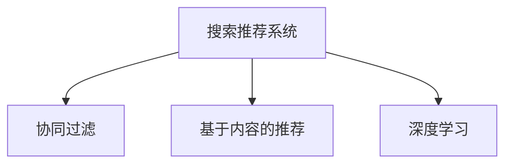

                 

# 大数据与AI 驱动的电商平台转型：搜索推荐系统是核心，用户体验是关键

在大数据与人工智能(AI)技术飞速发展的背景下，电商平台正在经历一场深刻的转型。传统的电商平台更多依赖人工运营、手工干预来处理用户需求，而新兴的电商平台则通过大数据分析、AI算法来优化用户体验，提升转化率。搜索推荐系统作为电商平台的“大脑”，在这一过程中扮演了核心角色。本文将深入探讨搜索推荐系统的原理、架构与实践，以及未来发展的趋势与挑战，以期为电商平台转型提供有益的参考。

## 1. 背景介绍

### 1.1 问题由来
随着消费者需求的日益个性化、多样化，传统电商平台的运营模式逐渐显现出局限性。人工推荐缺乏系统性和科学性，难以满足海量用户的多样化需求。在这样的背景下，电商平台亟需一种能够自动化、智能化的推荐方式，即搜索推荐系统。

### 1.2 问题核心关键点
搜索推荐系统是指通过分析用户的历史行为、兴趣偏好等数据，自动为用户推荐可能感兴趣的物品的系统。其核心在于如何精准捕捉用户需求，匹配合适的商品，提升用户体验和平台转化率。

搜索推荐系统通常包括用户画像构建、物品特征提取、模型训练、推荐结果生成等环节。其中，核心算法包括协同过滤、基于内容的推荐、深度学习等，广泛应用于电商、视频、新闻等业务领域。

## 2. 核心概念与联系

### 2.1 核心概念概述

为更好地理解搜索推荐系统的工作原理，本文将介绍几个密切相关的核心概念：

- **搜索推荐系统(Recommendation System)**：通过分析用户的历史行为数据和兴趣偏好，自动为用户推荐可能感兴趣的商品的系统。
- **协同过滤(Collaborative Filtering)**：一种基于用户行为数据或物品特征的推荐方法，通过找到与目标用户或物品相似的用户或物品，来预测目标用户或物品的兴趣。
- **基于内容的推荐(Content-based Recommendation)**：通过分析物品的特征，找到与用户兴趣相似的物品，进行推荐。
- **深度学习(Deep Learning)**：一种模仿人脑神经网络的机器学习方法，适用于处理高维、复杂的数据结构。

这些核心概念之间的逻辑关系可以通过以下Mermaid流程图来展示：



这个流程图展示了一系列推荐的范式及其之间的联系：

1. 搜索推荐系统是协同过滤、基于内容的推荐、深度学习等方法的综合应用。
2. 协同过滤和基于内容的推荐侧重于用户的显性或隐性反馈，深度学习则能处理更为复杂的用户行为数据。
3. 深度学习中的神经网络模型能够自动学习特征表示，适用于大规模、高维度的数据处理。

## 3. 核心算法原理 & 具体操作步骤

### 3.1 算法原理概述

搜索推荐系统的核心原理是通过建立用户与物品之间的关联关系，预测用户对物品的兴趣，从而实现个性化推荐。其基本流程包括：

1. **用户画像构建**：收集用户的历史行为数据，构建用户兴趣模型，描述用户的偏好。
2. **物品特征提取**：提取物品的属性、类别、评价等信息，描述物品的特征。
3. **模型训练**：利用用户画像和物品特征，训练推荐模型，生成预测结果。
4. **推荐结果生成**：根据预测结果，生成推荐列表，提供给用户选择。

核心算法包括：

- **协同过滤**：基于用户或物品的相似性，预测用户对物品的兴趣。
- **基于内容的推荐**：分析物品特征，找到与用户兴趣相似的物品。
- **深度学习**：通过神经网络模型，自动学习用户和物品的特征表示。

### 3.2 算法步骤详解

#### 3.2.1 协同过滤

协同过滤算法主要包括基于用户的协同过滤和基于物品的协同过滤。

1. **基于用户的协同过滤(User-Based Collaborative Filtering)**：
   - 收集用户的历史行为数据，构建用户兴趣模型。
   - 找到与目标用户兴趣相似的用户，推荐这些用户感兴趣的物品。
   
2. **基于物品的协同过滤(Item-Based Collaborative Filtering)**：
   - 收集物品的历史评分数据，构建物品特征模型。
   - 找到与目标物品相似的物品，推荐这些物品。

**步骤：**

1. **数据收集**：收集用户的行为数据，包括浏览、购买、评分等。
   
2. **数据预处理**：对原始数据进行清洗、归一化等预处理，生成用户和物品的特征向量。
   
3. **相似度计算**：计算用户或物品之间的相似度，常用方法包括余弦相似度、皮尔逊相关系数等。
   
4. **预测生成**：利用相似度计算结果，生成目标用户或物品的兴趣预测。
   
5. **推荐结果**：根据兴趣预测，生成推荐列表。

**代码实现**：

```python
import numpy as np

def cosine_similarity(a, b):
    return np.dot(a, b) / (np.linalg.norm(a) * np.linalg.norm(b))

def user_based_recommendation(user, data, n=10):
    similar_users = [user for user in range(len(data)) if user != user and data[user] > 0 and data[user] > 0]
    similar_items = data[similar_users].T
    similarity_matrix = np.zeros((len(similar_users), len(similar_items[0])))
    for i in range(len(similar_users)):
        for j in range(len(similar_items[0])):
            similarity_matrix[i, j] = cosine_similarity(similar_items[i], similar_items[j])
    recommendation = np.argsort(similarity_matrix.sum(axis=1))[:n][::-1]
    return [data[user] for user in recommendation]
```

#### 3.2.2 基于内容的推荐

基于内容的推荐算法主要利用物品的特征，找到与用户兴趣相似的物品。

1. **特征提取**：提取物品的特征向量，如价格、品牌、类别等。
   
2. **特征匹配**：计算用户兴趣向量与物品特征向量之间的相似度。
   
3. **推荐结果生成**：根据相似度，生成推荐列表。

**代码实现**：

```python
import numpy as np

def content_based_recommendation(user, items, n=10):
    user_interest = np.zeros(len(items[0]))
    for item in user_behaviors:
        item_features = np.array(items[item])
        user_interest += item_features
    similarity_matrix = np.dot(user_interest.reshape(1, -1), items) / (np.linalg.norm(user_interest) * np.linalg.norm(items))
    recommendation = np.argsort(similarity_matrix)[:n][::-1]
    return [items[item] for item in recommendation]
```

#### 3.2.3 深度学习

深度学习算法通常使用神经网络模型，自动学习用户和物品的特征表示。

1. **模型设计**：设计神经网络模型，包括输入层、隐藏层、输出层等。
   
2. **模型训练**：利用用户和物品的数据，训练神经网络模型。
   
3. **预测生成**：使用训练好的模型，生成目标用户或物品的兴趣预测。
   
4. **推荐结果**：根据预测结果，生成推荐列表。

**代码实现**：

```python
import tensorflow as tf

def neural_network_recommendation(user, items, n=10):
    model = tf.keras.Sequential([
        tf.keras.layers.Dense(128, activation='relu'),
        tf.keras.layers.Dense(64, activation='relu'),
        tf.keras.layers.Dense(32, activation='relu'),
        tf.keras.layers.Dense(n, activation='softmax')
    ])
    model.compile(optimizer='adam', loss='categorical_crossentropy', metrics=['accuracy'])
    model.fit(user, items, epochs=10)
    prediction = model.predict(user)
    recommendation = np.argsort(prediction)[:n][::-1]
    return [items[item] for item in recommendation]
```

### 3.3 算法优缺点

#### 3.3.1 协同过滤

**优点：**
- 不需要物品的特征信息，可以处理大量物品。
- 能够捕捉用户之间的隐性关联，推荐个性化商品。

**缺点：**
- 冷启动问题：新用户或物品缺乏足够的历史数据，难以推荐。
- 数据稀疏性：用户或物品的评分数据较少，推荐效果有限。
- 可扩展性差：需要存储和处理大量的用户行为数据。

#### 3.3.2 基于内容的推荐

**优点：**
- 不需要用户的行为数据，适合新用户。
- 能够捕捉物品之间的特征关联，推荐相似物品。

**缺点：**
- 需要大量物品的特征信息，难以处理海量物品。
- 特征提取过程较为复杂，需要人工设计特征。

#### 3.3.3 深度学习

**优点：**
- 能够自动学习复杂的特征表示，处理高维数据。
- 具有泛化能力，适合大规模数据和复杂场景。

**缺点：**
- 需要大量的训练数据，训练过程耗时。
- 模型复杂，训练和推理效率较低。

### 3.4 算法应用领域

搜索推荐系统已经被广泛应用于电商、视频、新闻等多个领域，以下是几个典型应用场景：

1. **电商平台**：用户通过搜索、浏览等行为，平台自动推荐可能感兴趣的商品。例如淘宝、京东等。

2. **视频平台**：根据用户的观看历史、评分等信息，推荐相关视频内容。例如Netflix、爱奇艺等。

3. **新闻平台**：根据用户的阅读历史、兴趣标签等，推荐相关新闻资讯。例如今日头条、腾讯新闻等。

## 4. 数学模型和公式 & 详细讲解  
### 4.1 数学模型构建

搜索推荐系统的数学模型包括用户画像、物品特征、模型训练等部分。

假设用户数为 $U$，物品数为 $I$，用户行为数据矩阵为 $D \in \mathbb{R}^{U \times I}$，物品特征矩阵为 $F \in \mathbb{R}^{I \times d}$，其中 $d$ 为特征维度。

1. **用户画像构建**：用户兴趣模型 $P \in \mathbb{R}^{U \times d}$，通过用户行为数据 $D$ 和物品特征 $F$ 计算得到。
   
2. **物品特征提取**：物品特征模型 $Q \in \mathbb{R}^{I \times d}$，通过物品评分数据 $R \in \mathbb{R}^{U \times I}$ 和用户画像 $P$ 计算得到。

3. **模型训练**：推荐模型 $M \in \mathbb{R}^{U \times I}$，通过用户画像 $P$ 和物品特征 $Q$ 训练得到。

### 4.2 公式推导过程

#### 4.2.1 协同过滤

**基于用户的协同过滤**：

$$
\hat{P} = \sum_{i=1}^{U} D_{iu} \cdot D_{iu}
$$

**基于物品的协同过滤**：

$$
\hat{Q} = \sum_{j=1}^{I} R_{uj} \cdot R_{uj}
$$

**用户兴趣预测**：

$$
\hat{R}_{ui} = \frac{\sum_{j=1}^{I} \hat{Q}_{ji} \cdot D_{uj}}{\sqrt{\hat{P}_{ui} \cdot \hat{Q}_{ui}}}
$$

**推荐结果生成**：

$$
R_{ui} \sim N(\hat{R}_{ui}, \sigma^2)
$$

其中 $\sigma$ 为噪声方差。

#### 4.2.2 基于内容的推荐

**特征提取**：

$$
\hat{P} = \sum_{i=1}^{I} F_{ij} \cdot F_{ij}
$$

**特征匹配**：

$$
\hat{R}_{ui} = \sum_{j=1}^{I} \alpha_j \cdot P_{ui} \cdot F_{uj}
$$

**推荐结果生成**：

$$
R_{ui} \sim N(\hat{R}_{ui}, \sigma^2)
$$

其中 $\alpha_j$ 为特征权重。

#### 4.2.3 深度学习

**神经网络模型**：

$$
M_{ui} = \sigma \left( \sum_{j=1}^{d} W_{uj} \cdot P_{ui} \cdot F_{uj} + b_{ui} \right)
$$

**推荐结果生成**：

$$
R_{ui} \sim M_{ui}
$$

其中 $\sigma$ 为激活函数，$W_{uj}$ 和 $b_{uj}$ 为模型参数。

### 4.3 案例分析与讲解

**案例：电商平台用户推荐系统**

假设某电商平台的推荐系统，收集了用户的浏览、购买、评分等行为数据，物品的类别、价格、品牌等属性数据。用户画像 $P$ 和物品特征 $Q$ 可以通过协同过滤和基于内容的推荐方法计算得到。推荐模型 $M$ 可以采用深度学习模型进行训练，生成推荐列表。

1. **数据准备**：收集用户行为数据 $D$ 和物品属性数据 $F$。
   
2. **用户画像计算**：计算用户兴趣模型 $P = D \cdot F$。
   
3. **物品特征计算**：计算物品特征模型 $Q = R \cdot P$。
   
4. **模型训练**：使用用户画像 $P$ 和物品特征 $Q$，训练深度学习模型 $M$。
   
5. **推荐结果生成**：根据用户画像和物品特征，生成推荐列表。

## 5. 项目实践：代码实例和详细解释说明

### 5.1 开发环境搭建

在进行搜索推荐系统开发前，我们需要准备好开发环境。以下是使用Python进行PyTorch开发的环境配置流程：

1. 安装Anaconda：从官网下载并安装Anaconda，用于创建独立的Python环境。

2. 创建并激活虚拟环境：
```bash
conda create -n pytorch-env python=3.8 
conda activate pytorch-env
```

3. 安装PyTorch：根据CUDA版本，从官网获取对应的安装命令。例如：
```bash
conda install pytorch torchvision torchaudio cudatoolkit=11.1 -c pytorch -c conda-forge
```

4. 安装TensorFlow：
```bash
pip install tensorflow
```

5. 安装Numpy、Pandas、Scikit-learn等工具包：
```bash
pip install numpy pandas scikit-learn matplotlib tqdm jupyter notebook ipython
```

完成上述步骤后，即可在`pytorch-env`环境中开始搜索推荐系统的开发。

### 5.2 源代码详细实现

下面我们以协同过滤为例，给出使用PyTorch实现用户推荐系统的代码实现。

首先，定义用户行为数据矩阵和物品特征矩阵：

```python
import numpy as np
import torch

# 用户行为数据
D = np.array([[1, 0, 0, 0, 0],
              [0, 1, 1, 0, 0],
              [1, 0, 0, 1, 1],
              [0, 0, 1, 0, 0],
              [0, 0, 0, 0, 1]])

# 物品特征
F = np.array([[0, 1, 0, 1, 0],
              [1, 0, 1, 0, 1],
              [0, 1, 0, 0, 1],
              [1, 1, 1, 0, 1],
              [0, 0, 0, 1, 0]])
```

然后，定义协同过滤推荐函数：

```python
def collaborative_filtering(D, F, n=5):
    # 计算用户画像
    P = torch.from_numpy(D).float() @ torch.from_numpy(F).float()
    
    # 计算物品特征
    Q = torch.from_numpy(D.T @ P).float() @ F
    
    # 计算用户兴趣预测
    R = P @ Q / (P * Q)**0.5
    
    # 生成推荐列表
    recommendation = torch.topk(torch.mul(R, P), n, dim=1)[1]
    return [D[i] for i in recommendation.numpy()]
```

最后，调用函数进行推荐：

```python
recommendation = collaborative_filtering(D, F, n=5)
print(recommendation)
```

### 5.3 代码解读与分析

让我们再详细解读一下关键代码的实现细节：

**用户行为数据矩阵D和物品特征矩阵F**：
- D和F分别为用户行为数据和物品特征的二维矩阵，用于计算用户画像和物品特征。

**协同过滤推荐函数**：
- 首先通过矩阵乘法计算用户画像P和物品特征Q。
- 然后计算用户兴趣预测R，使用用户画像P和物品特征Q，并考虑相似度。
- 最后通过topk函数生成推荐列表。

**推荐结果生成**：
- 输出推荐列表，其中每个元素对应一个用户推荐物品。

## 6. 实际应用场景

### 6.1 智能推荐系统

智能推荐系统已经成为电商平台的核心功能之一，通过分析用户历史行为数据，为用户推荐可能感兴趣的商品，提升用户体验和平台转化率。

在技术实现上，推荐系统可以采用协同过滤、基于内容的推荐、深度学习等多种方法。结合多模态数据，如用户画像、行为数据、物品属性等，构建更加精准、个性化的推荐模型。

### 6.2 个性化推荐系统

个性化推荐系统通过分析用户的行为数据，为用户推荐个性化的商品，提高用户满意度和忠诚度。

在推荐系统中，可以使用协同过滤、基于内容的推荐、深度学习等方法，构建用户画像和物品特征模型。结合多模态数据，如用户画像、行为数据、物品属性等，构建更加精准、个性化的推荐模型。

### 6.3 实时推荐系统

实时推荐系统通过分析用户当前行为数据，实时推荐可能感兴趣的商品，提升用户体验和平台转化率。

在推荐系统中，可以使用协同过滤、基于内容的推荐、深度学习等方法，构建用户画像和物品特征模型。结合多模态数据，如用户画像、行为数据、物品属性等，构建更加精准、个性化的推荐模型。

## 7. 工具和资源推荐

### 7.1 学习资源推荐

为了帮助开发者系统掌握搜索推荐系统的理论基础和实践技巧，这里推荐一些优质的学习资源：

1. 《推荐系统实战》系列博文：由搜索引擎技术专家撰写，深入浅出地介绍了推荐系统的原理、算法和实践，涵盖协同过滤、基于内容的推荐、深度学习等前沿技术。

2. CS229《机器学习》课程：斯坦福大学开设的经典机器学习课程，涵盖多种推荐算法，适合深入学习推荐系统的理论基础。

3. 《深度学习入门》书籍：DeepLearning.ai推出的深度学习入门教材，详细介绍了深度学习在推荐系统中的应用。

4. Kaggle平台：世界知名的数据科学竞赛平台，提供丰富的推荐系统竞赛数据集和代码实现，适合实践学习。

5. RecSys社区：推荐系统研究的在线社区，提供最新的研究论文、代码实现和实践案例，适合深入研究推荐系统的最新进展。

通过对这些资源的学习实践，相信你一定能够快速掌握推荐系统的精髓，并用于解决实际的电商推荐问题。

### 7.2 开发工具推荐

高效的开发离不开优秀的工具支持。以下是几款用于搜索推荐系统开发的常用工具：

1. PyTorch：基于Python的开源深度学习框架，灵活动态的计算图，适合快速迭代研究。支持多GPU训练，适合大规模数据处理。

2. TensorFlow：由Google主导开发的开源深度学习框架，生产部署方便，适合大规模工程应用。支持多GPU训练，适合大规模数据处理。

3. NumPy：Python科学计算库，提供高效的数组操作和数学函数，适合数据处理和模型计算。

4. Pandas：Python数据分析库，提供高效的数据处理和分析功能，适合数据清洗和特征工程。

5. Scikit-learn：Python机器学习库，提供多种机器学习算法和工具，适合模型训练和评估。

6. Jupyter Notebook：Python交互式编程环境，支持代码块的输入和输出，适合快速迭代实验。

合理利用这些工具，可以显著提升搜索推荐系统的开发效率，加快创新迭代的步伐。

### 7.3 相关论文推荐

推荐系统的发展源于学界的持续研究。以下是几篇奠基性的相关论文，推荐阅读：

1. "Collaborative Filtering for Implicit Feedback Datasets"（共现矩阵分解算法）：提出矩阵分解方法，解决协同过滤算法中的数据稀疏性问题。

2. "BPR: Bayesian Personalized Ranking from Implicit Feedback"（隐式反馈的贝叶斯个性化排序）：提出基于用户-物品关联的排序算法，解决协同过滤算法中的数据稀疏性问题。

3. "Wide & Deep Learning for Recommender Systems"（宽而深的推荐系统）：结合宽模型和深模型，解决协同过滤算法中的数据稀疏性问题。

4. "Deep Neural Networks for News Recommendation Based on Contextual Latent Features"（基于上下文特征的深度神经网络新闻推荐系统）：提出深度神经网络模型，解决基于内容的推荐算法中的特征提取问题。

5. "Attention is All You Need"（注意力机制是所有你需要的一切）：提出Transformer模型，解决深度学习算法中的特征提取问题。

这些论文代表了大推荐系统的理论进展，通过学习这些前沿成果，可以帮助研究者把握学科前进方向，激发更多的创新灵感。

## 8. 总结：未来发展趋势与挑战

### 8.1 研究成果总结

本文对基于协同过滤、基于内容的推荐和深度学习等搜索推荐系统的原理、架构与实践进行了全面系统的介绍。首先阐述了搜索推荐系统在电商平台中的核心地位，以及其如何通过分析用户历史行为数据和物品属性，实现个性化推荐。其次，介绍了协同过滤、基于内容的推荐和深度学习等核心算法，以及其实现原理和操作步骤。最后，结合实际应用场景，探讨了搜索推荐系统的未来发展趋势和面临的挑战。

通过本文的系统梳理，可以看到，搜索推荐系统已经成为电商平台的重要功能之一，通过自动化、智能化的推荐，显著提升了用户满意度和平台转化率。随着大数据和AI技术的不断发展，搜索推荐系统的精度和性能将不断提升，为电商平台带来更加精准、个性化的推荐服务。

### 8.2 未来发展趋势

展望未来，搜索推荐系统将呈现以下几个发展趋势：

1. **多模态融合**：结合用户画像、行为数据、物品属性等多种数据源，构建多模态推荐系统，提高推荐精度和用户满意度。

2. **跨领域推荐**：结合不同领域的推荐系统，实现跨领域的推荐服务，提升推荐多样性和用户覆盖率。

3. **实时推荐**：利用实时数据，实现动态、实时推荐，提高用户互动性和平台转化率。

4. **个性化推荐**：结合用户兴趣模型和行为数据，实现更加精准、个性化的推荐服务，提升用户体验。

5. **深度学习**：采用深度神经网络模型，提高推荐系统的精度和泛化能力，适用于大规模数据和复杂场景。

6. **联邦学习**：通过联邦学习技术，实现用户数据隐私保护和跨平台推荐，提高推荐系统的用户覆盖率和安全性。

以上趋势凸显了搜索推荐系统的广阔前景。这些方向的探索发展，必将进一步提升推荐系统的精度和性能，为电商平台带来更加精准、个性化的推荐服务。

### 8.3 面临的挑战

尽管搜索推荐系统已经取得了瞩目成就，但在迈向更加智能化、普适化应用的过程中，它仍面临着诸多挑战：

1. **数据隐私保护**：用户数据隐私保护成为搜索推荐系统的重要挑战，需要结合联邦学习等技术，实现数据隐私保护和跨平台推荐。

2. **推荐鲁棒性**：推荐系统面对域外数据时，泛化性能往往大打折扣，需要在模型设计和数据处理上进一步提升推荐系统的鲁棒性。

3. **推荐多样性**：推荐系统容易陷入过拟合和同质化问题，需要引入多样化推荐策略，避免推荐结果的单一性。

4. **推荐实时性**：推荐系统需要实时处理用户行为数据，推荐精度和响应速度的平衡成为重要挑战。

5. **推荐安全性**：推荐系统需要抵御恶意攻击和信息误导，确保推荐结果的安全性和可靠性。

6. **推荐模型复杂度**：深度学习等复杂模型需要大量的训练数据和计算资源，如何在保证模型性能的同时，优化模型结构，提高计算效率，是重要的优化方向。

这些挑战凸显了搜索推荐系统未来的发展方向，需要通过技术创新和算法优化，不断提升推荐系统的精度和性能，满足用户的多样化需求。

### 8.4 研究展望

面对搜索推荐系统面临的种种挑战，未来的研究需要在以下几个方面寻求新的突破：

1. **数据隐私保护**：引入联邦学习等技术，保护用户数据隐私，同时实现跨平台推荐，提升推荐系统的用户覆盖率。

2. **推荐鲁棒性**：引入多样化的推荐策略，提高推荐系统的泛化能力和鲁棒性，减少推荐结果的同质化和过拟合问题。

3. **推荐实时性**：优化数据处理和模型训练过程，提升推荐系统的实时性和响应速度，满足用户实时互动的需求。

4. **推荐安全性**：引入安全性保障机制，如对抗样本检测、推荐结果校验等，确保推荐结果的安全性和可靠性。

5. **推荐模型复杂度**：结合模型压缩和稀疏化存储等技术，优化推荐系统的模型结构，提高计算效率，降低计算成本。

这些研究方向的探索，必将引领搜索推荐系统迈向更高的台阶，为电商平台带来更加精准、个性化的推荐服务，提升用户体验和平台转化率。面向未来，搜索推荐系统还需要与其他人工智能技术进行更深入的融合，如知识表示、因果推理、强化学习等，多路径协同发力，共同推动电商平台的发展。只有勇于创新、敢于突破，才能不断拓展搜索推荐系统的边界，让智能推荐技术更好地造福电商平台。

## 9. 附录：常见问题与解答

**Q1：为什么需要搜索推荐系统？**

A: 传统的电商平台更多依赖人工运营、手工干预来处理用户需求，效率低下且难以满足海量用户的多样化需求。搜索推荐系统通过分析用户历史行为数据，自动化、智能化的推荐，提升用户体验和平台转化率。

**Q2：如何选择合适的推荐算法？**

A: 推荐算法的选择需要根据具体业务场景和数据特点进行。通常情况下，可以选择协同过滤、基于内容的推荐、深度学习等方法。在实际应用中，可以结合多模态数据，构建更加精准、个性化的推荐模型。

**Q3：推荐系统如何处理冷启动问题？**

A: 冷启动问题可以通过引入新用户或物品的静态特征，如人口属性、物品类别等，进行初始化。或者利用协同过滤、基于内容的推荐等方法，结合用户已有行为数据进行推荐。

**Q4：推荐系统如何处理数据稀疏性问题？**

A: 数据稀疏性问题可以通过矩阵分解方法、隐式反馈的贝叶斯排序等方法解决。这些方法可以在少量评分数据的基础上，构建用户画像和物品特征，提高推荐精度。

**Q5：推荐系统如何提升推荐效果？**

A: 推荐系统可以通过以下方式提升推荐效果：
1. 多模态数据融合：结合用户画像、行为数据、物品属性等多种数据源，构建多模态推荐系统。
2. 实时数据处理：利用实时数据，实现动态、实时推荐，提高用户互动性和平台转化率。
3. 深度学习技术：采用深度神经网络模型，提高推荐系统的精度和泛化能力，适用于大规模数据和复杂场景。

通过合理运用以上方法，可以显著提升推荐系统的推荐精度和效果，满足用户的多样化需求。

---

作者：禅与计算机程序设计艺术 / Zen and the Art of Computer Programming

