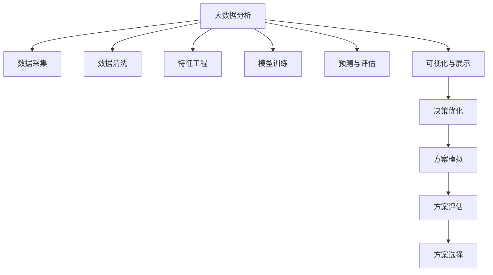

                 

# 大数据分析在城市规划中的应用：智能化决策支持

> 关键词：城市规划, 数据驱动, 决策支持, 智能算法, 案例分析

## 1. 背景介绍

### 1.1 问题由来
随着城市化进程的不断加快，城市规划的重要性愈发凸显。如何科学、高效地进行城市规划，提升城市资源配置效率，优化公共服务供给，改善居民生活质量，成为各国政府和研究机构共同关注的焦点。传统城市规划方法依赖人工经验和专家知识，周期长、成本高、决策效果参差不齐。而基于大数据分析的智能决策支持系统，有望改变这一局面，提供更精确、快速的规划方案，辅助城市管理者作出科学决策。

### 1.2 问题核心关键点
大数据分析在城市规划中的应用，主要依赖于以下几个关键技术：
1. **数据收集与预处理**：通过物联网、GPS、传感器等技术，实时收集城市基础设施、交通、人口、环境等各类数据，并通过数据清洗、特征提取等技术进行预处理。
2. **数据建模与分析**：利用机器学习、深度学习、时间序列分析等算法，建立预测模型，分析城市运行状态和趋势。
3. **决策优化与模拟**：结合GIS技术，对规划方案进行模拟、评估和优化，确保方案的科学性和可行性。
4. **可视化与展示**：使用可视化工具，将分析结果直观展示给决策者，辅助其理解和选择最佳方案。

这些技术相互配合，形成了基于大数据分析的城市规划智能化决策支持系统，为城市管理者提供科学决策的依据，推动城市治理现代化。

### 1.3 问题研究意义
研究大数据分析在城市规划中的应用，对于提升城市管理效率、优化资源配置、改善居民生活质量具有重要意义：
1. **提高规划效率**：通过数据驱动的智能分析，大大缩短规划周期，降低成本，提升决策速度和质量。
2. **优化资源配置**：利用数据建模技术，预测各类资源需求，优化城市基础设施建设，提高资源使用效率。
3. **改善公共服务**：通过分析居民行为和需求，优化公共服务布局和配置，提升居民生活质量。
4. **促进科学决策**：提供多角度、多层次的决策支持，辅助决策者制定更合理的规划方案，减少人为偏差和主观误判。

## 2. 核心概念与联系

### 2.1 核心概念概述

为更好地理解大数据分析在城市规划中的应用，本节将介绍几个密切相关的核心概念：

- **大数据分析(Big Data Analytics)**：通过对海量数据进行收集、存储、处理和分析，提取有用信息和知识的过程。包括数据清洗、特征工程、模型训练、预测与评估等多个环节。

- **城市规划(Urban Planning)**：通过科学的规划和管理，合理配置城市资源，优化城市空间布局，提升城市整体运行效率和居民生活质量。

- **决策支持系统(Decision Support System, DSS)**：借助信息技术，辅助决策者制定科学决策的系统。包括数据采集、模型构建、方案评估、结果展示等多个模块。

- **智能算法(Intelligent Algorithm)**：利用机器学习和深度学习等技术，从数据中自动发现规律、预测趋势，支持复杂问题的解决。

- **GIS技术(Geographic Information System)**：通过地图、数据和软件技术，对地理空间数据进行收集、存储、处理和分析。

这些核心概念之间的逻辑关系可以通过以下Mermaid流程图来展示：



这个流程图展示了大数据分析在城市规划中的应用流程：

1. 从城市各处采集数据。
2. 对数据进行清洗和特征工程处理。
3. 训练模型进行预测和评估。
4. 利用GIS技术进行方案模拟和评估。
5. 将结果可视化展示，辅助决策优化。
6. 选择最佳方案进行实施。

## 3. 核心算法原理 & 具体操作步骤
### 3.1 算法原理概述

大数据分析在城市规划中的应用，核心在于利用机器学习和深度学习等智能算法，从大规模数据中提取有价值的知识和模式，辅助决策者制定科学合理的规划方案。主要算法流程如下：

1. **数据采集与预处理**：通过传感器、摄像头、GPS等技术，收集城市运行数据，并进行数据清洗和特征提取。
2. **数据建模与分析**：利用回归分析、时间序列预测、聚类分析等算法，建立预测模型，分析城市运行状态和趋势。
3. **决策优化与模拟**：结合GIS技术，对规划方案进行模拟、评估和优化，确保方案的科学性和可行性。
4. **可视化与展示**：使用可视化工具，将分析结果直观展示给决策者，辅助其理解和选择最佳方案。

### 3.2 算法步骤详解

具体步骤如下：

**Step 1: 数据收集与预处理**
- 通过传感器、摄像头、GPS等技术，收集城市运行数据，如交通流量、空气质量、电力消耗等。
- 对收集的数据进行清洗和预处理，包括去除噪声、填补缺失值、标准化处理等。

**Step 2: 特征工程**
- 从清洗后的数据中提取特征，如时间、地点、季节、天气等，用于构建预测模型。
- 利用特征选择算法，选择对目标变量影响最大的特征，避免过拟合。

**Step 3: 模型训练与评估**
- 使用机器学习算法，如回归分析、随机森林、支持向量机等，训练预测模型。
- 利用历史数据对模型进行评估，选择最优模型。

**Step 4: 预测与分析**
- 使用训练好的模型，对未来数据进行预测，如交通流量、空气质量、人口增长等。
- 分析预测结果，识别出潜在的风险和挑战。

**Step 5: 方案优化与模拟**
- 利用GIS技术，对城市规划方案进行模拟和评估，如交通网络优化、公共服务布局调整等。
- 对模拟结果进行优化，选择最优方案。

**Step 6: 结果展示与决策支持**
- 将优化后的方案通过可视化工具展示给决策者。
- 辅助决策者进行科学决策，选择最佳方案。

### 3.3 算法优缺点

大数据分析在城市规划中的应用，具有以下优点：
1. **数据驱动**：依托数据收集和分析技术，提供科学决策的依据。
2. **实时动态**：利用实时数据，提升决策的及时性和准确性。
3. **成本效益**：减少人工干预和专家意见的主观性，提高决策的客观性和效率。
4. **广泛适用**：适用于城市规划的各个环节，如基础设施建设、公共服务优化、环境治理等。

同时，该方法也存在一定的局限性：
1. **数据质量问题**：数据采集和预处理过程中可能存在噪声、缺失值等问题，影响模型效果。
2. **模型复杂性**：大规模数据和高维度特征增加了模型的复杂性，需要更多的计算资源。
3. **决策依赖**：数据分析结果仍然需要人工干预和判断，依赖决策者的理解和选择。
4. **隐私安全**：大量数据涉及个人隐私，数据收集和处理过程中需要注意隐私保护。

尽管存在这些局限性，但就目前而言，大数据分析在城市规划中的应用仍是大数据技术落地应用的重要方向。未来相关研究的重点在于如何进一步提高数据质量，降低模型复杂度，增强决策支持的智能化水平。

### 3.4 算法应用领域

大数据分析在城市规划中的应用，广泛涵盖了以下几个领域：

- **交通规划**：通过分析交通流量、拥堵情况、交通事故等数据，优化交通网络布局，提升交通效率。
- **公共服务优化**：利用人口分布、服务需求等数据，优化公共服务设施布局，提高服务质量。
- **环境保护**：分析空气质量、水质、噪声等数据，评估环境质量，提出改善建议。
- **灾害应对**：监测自然灾害（如洪水、地震）预警数据，及时采取应对措施，减少灾害损失。
- **城市安全**：利用视频监控、传感器数据，监测和预防各类城市安全事件。

以上应用领域展示了大数据分析在城市规划中的广阔前景，通过科学的数据分析，可以有效提升城市管理的智能化水平。

## 4. 数学模型和公式 & 详细讲解 & 举例说明
### 4.1 数学模型构建

本节将使用数学语言对大数据分析在城市规划中的应用进行更加严格的刻画。

设城市规划数据集为 $D=\{(x_i,y_i)\}_{i=1}^N$，其中 $x_i$ 为输入特征， $y_i$ 为输出标签，如交通流量、空气质量等。假设模型为线性回归模型，即：

$$
y_i = \theta_0 + \sum_{j=1}^{p} \theta_j x_{ij}
$$

其中 $\theta=(\theta_0,\theta_1,\ldots,\theta_p)$ 为模型参数， $p$ 为特征数量。线性回归的目标是最小化均方误差：

$$
\mathcal{L}(\theta) = \frac{1}{N} \sum_{i=1}^N (y_i - \hat{y}_i)^2
$$

其中 $\hat{y}_i$ 为模型预测值， $y_i$ 为真实值。利用梯度下降等优化算法，求解目标函数的最小值，得到最优参数：

$$
\theta^* = \mathop{\arg\min}_{\theta} \mathcal{L}(\theta)
$$

### 4.2 公式推导过程

以线性回归为例，推导目标函数的梯度计算公式：

$$
\nabla_{\theta}\mathcal{L}(\theta) = -\frac{2}{N}(X^T X)^{-1} X^T (y - \hat{y})
$$

其中 $X$ 为特征矩阵， $y$ 为真实标签向量， $\hat{y}$ 为模型预测向量。通过计算梯度，可以利用优化算法不断更新模型参数，最小化损失函数。

### 4.3 案例分析与讲解

以交通流量预测为例，具体步骤如下：

**数据集**：
- 收集城市主要道路的交通流量数据，包括时间、星期几、节假日、天气等信息。
- 将数据划分为训练集和测试集。

**模型构建**：
- 选择线性回归模型，输入特征为时间、星期几、节假日、天气等。
- 利用训练集数据，通过梯度下降算法训练模型，最小化均方误差。

**模型评估**：
- 利用测试集数据，评估模型预测效果，计算均方误差、R平方等指标。
- 根据评估结果，调整模型参数，优化预测性能。

**方案优化**：
- 利用GIS技术，将交通网络进行可视化。
- 根据预测结果，对交通网络进行优化，如调整红绿灯时间、道路施工等。
- 模拟优化后的交通网络，评估效果。

## 5. 项目实践：代码实例和详细解释说明
### 5.1 开发环境搭建

在进行项目实践前，我们需要准备好开发环境。以下是使用Python进行项目实践的环境配置流程：

1. 安装Anaconda：从官网下载并安装Anaconda，用于创建独立的Python环境。

2. 创建并激活虚拟环境：
```bash
conda create -n urban-planning python=3.8 
conda activate urban-planning
```

3. 安装PyTorch、TensorFlow、Pandas等库：
```bash
conda install pytorch torchvision torchtext tensorboard pandas
```

4. 安装GeoPandas、Fiona、Shapely等GIS库：
```bash
conda install geopandas fiona shapely
```

5. 安装可视化工具：
```bash
conda install matplotlib seaborn plotly
```

完成上述步骤后，即可在`urban-planning`环境中开始项目实践。

### 5.2 源代码详细实现

下面以交通流量预测为例，给出使用Python进行项目开发的代码实现。

**数据准备**：
- 收集城市交通流量数据，并进行清洗和预处理。

```python
import pandas as pd
import numpy as np

# 数据清洗和预处理
data = pd.read_csv('traffic_flow.csv')
data.fillna(method='ffill', inplace=True)
```

**模型训练**：
- 选择线性回归模型，使用梯度下降算法训练模型。

```python
from sklearn.linear_model import LinearRegression

# 特征工程
X = data[['time', 'day', 'holiday', 'weather']]
y = data['flow']

# 模型训练
model = LinearRegression()
model.fit(X, y)
```

**模型评估**：
- 使用测试集数据评估模型预测效果。

```python
# 评估模型
test_data = pd.read_csv('traffic_flow_test.csv')
test_X = test_data[['time', 'day', 'holiday', 'weather']]
test_y = test_data['flow']
test_pred = model.predict(test_X)
mse = np.mean((test_pred - test_y)**2)
r2 = np.corrcoef(test_pred, test_y)[0,1]**2
print('MSE:', mse, 'R^2:', r2)
```

**方案优化**：
- 利用GIS技术，对交通网络进行可视化。

```python
import geopandas as gpd

# 加载交通网络数据
network = gpd.read_file('traffic_network.shp')

# 可视化交通网络
network.plot()
```

**结果展示**：
- 将优化后的交通网络方案展示给决策者。

```python
# 展示优化后的方案
fig = plt.figure(figsize=(10, 6))
network.plot(ax=fig, color='red')
plt.title('Optimized Traffic Network')
plt.show()
```

以上就是使用Python进行城市规划中的交通流量预测项目的完整代码实现。可以看到，Python的强大库支持使得项目开发变得简洁高效。

### 5.3 代码解读与分析

让我们再详细解读一下关键代码的实现细节：

**数据准备**：
- 使用Pandas库读取数据，并对数据进行清洗和预处理，包括填充缺失值。

**模型训练**：
- 选择线性回归模型，使用sklearn库的LinearRegression类进行训练。

**模型评估**：
- 使用测试集数据评估模型预测效果，计算均方误差和R平方。

**方案优化**：
- 使用GeoPandas库加载交通网络数据，利用Matplotlib库进行可视化。

**结果展示**：
- 使用Matplotlib库展示优化后的交通网络方案，辅助决策者理解。

## 6. 实际应用场景
### 6.1 智能交通规划

基于大数据分析的城市规划智能化决策支持系统，可以广泛应用于智能交通规划。传统的交通规划依赖人工经验，周期长、成本高，难以应对快速变化的交通需求。而利用大数据分析，可以实现实时动态的交通预测和优化。

在具体应用中，可以收集城市交通流量、拥堵情况、事故记录等数据，利用时间序列分析、回归分析等算法，预测未来交通流量，优化交通网络布局。例如，可以通过分析特定时间段的流量数据，识别出交通瓶颈，调整红绿灯时间、增加车道数量等，从而提升交通效率，减少拥堵。

### 6.2 公共服务优化

大数据分析还可以应用于公共服务优化，提升公共服务设施的布局和配置。传统的公共服务布局依赖人工决策，无法及时响应居民需求的变化。而利用大数据分析，可以实时监测居民需求，优化公共服务设施的分布，提高服务质量。

具体而言，可以收集居民对公共服务的使用情况、满意度评价等数据，利用聚类分析、关联规则挖掘等算法，识别出居民的集中区域和需求热点，优化公共服务设施的布局。例如，可以根据居民的消费习惯和人口密度，优化超市、医院、学校等公共服务设施的分布，提升居民的便利度和满意度。

### 6.3 环境保护

环境保护是大数据分析在城市规划中的重要应用方向。传统的环保治理依赖人工监测，无法实时获取环境数据，难以及时应对环境变化。而利用大数据分析，可以实现实时动态的环境监测和预测，提出环境改善建议。

具体而言，可以收集空气质量、水质、噪声等环境数据，利用回归分析、时间序列预测等算法，监测环境质量，评估环境变化趋势。例如，可以根据空气质量监测数据，预测未来空气污染程度，提出减排建议。

### 6.4 未来应用展望

随着大数据分析技术的不断进步，其在城市规划中的应用前景广阔。未来可能的趋势包括：

1. **多模态数据融合**：结合图像、视频、声音等多模态数据，提升数据分析的全面性和准确性。
2. **实时动态分析**：利用实时数据进行动态分析，及时发现问题，快速调整规划方案。
3. **智能化决策支持**：结合人工智能技术，如深度学习、自然语言处理等，提升决策的智能化水平。
4. **跨领域知识整合**：将跨领域知识（如城市规划、环境科学、经济学等）与数据分析结合，提出更加全面、科学的规划方案。

这些趋势将推动城市规划的智能化水平，提升城市治理的科学性和效率。

## 7. 工具和资源推荐
### 7.1 学习资源推荐

为了帮助开发者系统掌握大数据分析在城市规划中的应用，这里推荐一些优质的学习资源：

1. 《城市规划与大数据分析》课程：开设于Coursera平台，涵盖大数据分析在城市规划中的应用案例。
2. 《城市管理与数据科学》书籍：系统介绍大数据技术在城市管理中的应用，包括城市规划、环境治理等。
3. 《机器学习实战》书籍：介绍机器学习算法及其在大数据应用中的实现方法，包括交通预测、环境监测等。

通过对这些资源的学习实践，相信你一定能够快速掌握大数据分析在城市规划中的应用精髓，并用于解决实际的城市管理问题。

### 7.2 开发工具推荐

高效的开发离不开优秀的工具支持。以下是几款用于大数据分析在城市规划中开发应用的常用工具：

1. PyTorch、TensorFlow：开源深度学习框架，适合快速迭代研究，广泛应用于机器学习、深度学习等领域。
2. GeoPandas、Fiona、Shapely：用于地理空间数据的处理和分析，支持GIS技术。
3. Matplotlib、Seaborn、Plotly：数据可视化工具，支持复杂图形的绘制和展示。
4. Jupyter Notebook：交互式编程环境，适合进行数据探索和算法实验。
5. Google Colab：免费的在线Jupyter Notebook环境，适合进行大规模实验和数据处理。

合理利用这些工具，可以显著提升大数据分析在城市规划中应用的开发效率，加快创新迭代的步伐。

### 7.3 相关论文推荐

大数据分析在城市规划中的应用，源于学界的持续研究。以下是几篇奠基性的相关论文，推荐阅读：

1. "Smart Cities Through Data Mining and Statistical Learning"（智慧城市的数据挖掘与统计学习）：探讨大数据技术在智慧城市中的应用，包括城市规划、公共服务优化等。
2. "Big Data for Smart Urban Planning"（大数据与智能城市规划）：总结大数据分析在城市规划中的应用，包括交通规划、公共服务优化等。
3. "Predictive Analytics for Urban Planning"（城市规划的预测分析）：介绍利用预测分析技术，进行城市规划的优化和决策支持。

这些论文代表了大数据分析在城市规划中的研究进展，通过学习这些前沿成果，可以帮助研究者把握学科前进方向，激发更多的创新灵感。

## 8. 总结：未来发展趋势与挑战
### 8.1 研究成果总结

本文对大数据分析在城市规划中的应用进行了全面系统的介绍。首先阐述了大数据分析在城市规划中的重要性和应用前景，明确了其在大数据技术落地应用中的关键作用。其次，从原理到实践，详细讲解了大数据分析在城市规划中的数学模型和算法流程，给出了项目实践的完整代码实例。同时，本文还广泛探讨了大数据分析在城市规划中的实际应用场景，展示了其广阔的应用前景。

通过本文的系统梳理，可以看到，大数据分析在城市规划中的应用前景广阔，通过科学的数据分析，可以有效提升城市管理的智能化水平。未来，伴随大数据分析技术的不断进步，城市规划的智能化水平将进一步提升，为城市治理现代化提供有力支撑。

### 8.2 未来发展趋势

展望未来，大数据分析在城市规划中的应用将呈现以下几个发展趋势：

1. **技术成熟度提升**：大数据分析技术将不断成熟，应用门槛逐步降低，更多城市管理者将采用大数据技术进行城市规划。
2. **应用场景拓展**：大数据分析将逐步拓展到更多城市管理场景，如智能交通、环境保护、公共服务优化等，提升城市治理的全面性和智能化水平。
3. **跨领域融合**：大数据分析将与其他学科的知识和方法进行深度融合，提升规划方案的科学性和可行性。
4. **数据资源丰富**：随着物联网、传感器等技术的普及，城市数据的种类和数量将不断增加，为大数据分析提供了更多数据支持。
5. **模型算法优化**：大数据分析算法将不断优化，提升模型性能，降低模型复杂度，提高应用效果。

以上趋势将推动大数据分析在城市规划中的广泛应用，提升城市治理的科学性和效率。

### 8.3 面临的挑战

尽管大数据分析在城市规划中的应用前景广阔，但在具体应用过程中，仍面临诸多挑战：

1. **数据隐私问题**：大数据分析涉及大量个人隐私数据，如何在保障隐私的同时，进行有效分析，成为一大难题。
2. **数据质量问题**：数据采集和预处理过程中可能存在噪声、缺失值等问题，影响分析结果的准确性。
3. **模型复杂性**：大数据分析算法复杂，需要较高的计算资源和专业知识，对城市管理者的技术要求较高。
4. **政策法规问题**：大数据分析涉及多个领域，需要制定相关的政策和法规，保障数据安全、公平使用等。

这些挑战需要多方面共同努力，才能有效推动大数据分析在城市规划中的应用。

### 8.4 研究展望

面对大数据分析在城市规划中面临的挑战，未来的研究需要在以下几个方面寻求新的突破：

1. **数据隐私保护**：研究隐私保护技术，如差分隐私、联邦学习等，确保数据使用的安全性。
2. **数据质量提升**：开发数据清洗和预处理技术，提高数据质量，降低噪声和缺失值的影响。
3. **模型算法优化**：研究轻量级模型，如稀疏模型、低秩模型等，降低模型复杂度，提升计算效率。
4. **政策法规制定**：制定相关的政策和法规，保障数据安全、公平使用，推动大数据分析的规范化应用。

这些研究方向的探索，必将引领大数据分析在城市规划中的应用走向成熟，为城市治理提供更科学、高效、智能的支持。

## 9. 附录：常见问题与解答

**Q1: 大数据分析在城市规划中的应用需要哪些数据？**

A: 大数据分析在城市规划中的应用，需要收集以下几类数据：
1. 交通流量数据：包括道路交通流量、公交车流量、自行车流量等。
2. 环境质量数据：包括空气质量、水质、噪声等。
3. 居民行为数据：包括居民出行轨迹、消费行为、投诉记录等。
4. 公共服务数据：包括医院、学校、图书馆等公共服务设施的使用情况和评价数据。
5. 基础设施数据：包括道路、桥梁、停车场等基础设施的建设和使用情况。

这些数据有助于全面分析城市运行状态和趋势，提供科学决策的依据。

**Q2: 数据采集和预处理过程中需要注意哪些问题？**

A: 数据采集和预处理过程中需要注意以下问题：
1. 数据来源的合法性和可靠性，确保数据的准确性和完整性。
2. 数据清洗和预处理过程中的噪声、缺失值、异常值等问题，保障数据质量。
3. 数据的时效性和一致性，确保分析结果的实时性和可靠性。
4. 数据的隐私保护，确保数据使用的安全性，避免泄露个人隐私。

通过合理的数据采集和预处理，可以有效提升大数据分析的准确性和可靠性。

**Q3: 如何选择适合的数据分析模型？**

A: 选择适合的数据分析模型，需要考虑以下因素：
1. 数据类型：根据数据的类型（如数值型、分类型、时序型等），选择相应的分析模型。
2. 数据特征：根据数据的特征（如分布、方差、相关性等），选择最适合的模型。
3. 分析目的：根据分析目的（如预测、分类、聚类等），选择相应的模型。
4. 数据量和计算资源：根据数据量和计算资源的限制，选择计算复杂度适中的模型。

在实际应用中，可以采用模型选择算法（如交叉验证、AIC、BIC等），评估不同模型的性能，选择最优模型。

**Q4: 如何评估数据分析模型的性能？**

A: 评估数据分析模型的性能，需要考虑以下指标：
1. 均方误差(MSE)：评估模型预测值与真实值之间的差异。
2. 决定系数(R^2)：评估模型对数据的拟合程度，R^2越接近1，表示模型拟合效果越好。
3. 准确率、召回率、F1值：评估分类模型的性能，适用于预测结果为分类问题的场景。
4. 平均绝对误差(MAE)：评估回归模型的性能，适用于预测结果为数值问题的场景。
5. 混淆矩阵、ROC曲线、AUC值：评估分类模型的性能，适用于多类别分类的场景。

在实际应用中，可以采用交叉验证等方法，评估模型的性能，并根据评估结果优化模型。

**Q5: 如何利用大数据分析进行城市规划的智能化决策支持？**

A: 利用大数据分析进行城市规划的智能化决策支持，主要包括以下步骤：
1. 数据采集与预处理：收集城市各类数据，并进行清洗和预处理。
2. 特征工程：从预处理后的数据中提取特征，用于构建预测模型。
3. 模型训练与评估：选择适合的机器学习或深度学习模型，使用历史数据训练模型，并评估模型性能。
4. 预测与分析：利用训练好的模型，对未来数据进行预测，分析城市运行状态和趋势。
5. 方案优化与模拟：结合GIS技术，对规划方案进行模拟和优化，选择最优方案。
6. 结果展示与决策支持：将优化后的方案展示给决策者，辅助其进行科学决策。

通过以上步骤，可以有效利用大数据分析技术，进行城市规划的智能化决策支持，提升城市管理的科学性和效率。

---

作者：禅与计算机程序设计艺术 / Zen and the Art of Computer Programming

