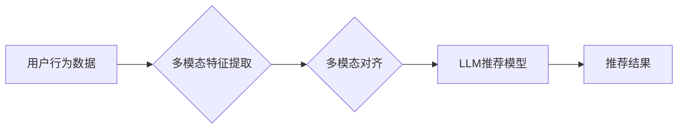

                 

## LLM推荐中的多模态对齐技术探索

> 关键词：LLM、多模态、推荐系统、对齐技术、文本、图像、融合、模型

## 1. 背景介绍

近年来，大型语言模型 (LLM) 在自然语言处理领域取得了显著成就，展现出强大的文本生成、理解和推理能力。然而，现实世界的信息往往是多模态的，包含文本、图像、音频等多种形式。单模态的LLM在处理多模态数据时存在局限性，无法充分挖掘信息的多样性。因此，如何有效融合多模态信息，提升LLM在推荐系统中的性能，成为一个重要的研究方向。

推荐系统作为信息过滤和个性化服务的重要工具，旨在根据用户的历史行为和偏好，推荐用户感兴趣的内容。传统的推荐系统主要依赖文本数据，例如用户评分、商品描述等。随着多模态数据的日益丰富，将图像、视频等多模态信息融入推荐系统，可以更全面地理解用户需求，提供更精准的推荐结果。

多模态对齐技术旨在将不同模态的数据映射到同一个语义空间，从而实现不同模态信息的融合。在LLM推荐系统中，多模态对齐技术可以帮助模型更好地理解用户对不同模态信息的偏好，从而提高推荐的准确性和个性化程度。

## 2. 核心概念与联系

### 2.1 多模态数据

多模态数据是指包含多种不同类型信息的集合，例如文本、图像、音频、视频等。每个模态都携带着不同的信息，例如文本描述商品属性，图像展示商品外观，音频提供商品使用场景等。

### 2.2 LLM推荐系统

LLM推荐系统是指利用大型语言模型进行推荐的系统。LLM可以学习用户历史行为、商品信息等文本数据，并生成个性化的推荐结果。

### 2.3 多模态对齐技术

多模态对齐技术是指将不同模态的数据映射到同一个语义空间，从而实现不同模态信息的融合。

**多模态对齐技术与LLM推荐系统的联系:**

多模态对齐技术可以帮助LLM推荐系统更好地理解用户对不同模态信息的偏好，从而提高推荐的准确性和个性化程度。

**Mermaid 流程图:**



## 3. 核心算法原理 & 具体操作步骤

### 3.1 算法原理概述

多模态对齐技术主要通过以下几种方法实现：

* **特征嵌入:** 将不同模态的数据映射到同一个低维特征空间，使得不同模态的数据在语义上更接近。常用的特征嵌入方法包括Word2Vec、GloVe、BERT等。
* **跨模态注意力机制:** 利用注意力机制学习不同模态之间的关系，赋予不同模态不同的权重，从而更好地融合多模态信息。
* **联合学习:** 将不同模态的数据一起训练，学习一个联合的模型，能够同时处理和理解不同模态的信息。

### 3.2 算法步骤详解

以跨模态注意力机制为例，详细说明其操作步骤：

1. **特征提取:** 对文本和图像分别进行特征提取，得到文本的词向量表示和图像的特征图。
2. **注意力计算:** 计算文本和图像特征之间的注意力权重，表示不同模态之间相互依赖的程度。
3. **融合特征:** 将文本和图像特征与注意力权重相结合，得到融合后的多模态特征。
4. **推荐模型:** 将融合后的多模态特征输入到推荐模型中，进行最终的推荐预测。

### 3.3 算法优缺点

**优点:**

* 可以更好地融合多模态信息，提升推荐的准确性和个性化程度。
* 可以学习到不同模态之间的语义关系，提高模型的理解能力。

**缺点:**

* 计算复杂度较高，需要更多的计算资源。
* 需要大量的多模态数据进行训练，否则模型效果可能不佳。

### 3.4 算法应用领域

* **电商推荐:** 将商品图像、描述、用户评论等多模态信息融合，提供更精准的商品推荐。
* **内容推荐:** 将文章标题、摘要、图片、视频等多模态信息融合，推荐用户感兴趣的内容。
* **社交媒体推荐:** 将用户发布的内容、点赞、评论等多模态信息融合，推荐用户可能感兴趣的用户和内容。

## 4. 数学模型和公式 & 详细讲解 & 举例说明

### 4.1 数学模型构建

假设我们有文本数据 $T$ 和图像数据 $V$，我们需要将它们映射到同一个语义空间 $Z$。我们可以使用以下数学模型来实现：

$$
Z = f(T, V)
$$

其中，$f$ 是一个多模态对齐函数，它将文本和图像数据作为输入，输出一个多模态特征向量。

### 4.2 公式推导过程

为了更好地理解多模态对齐函数 $f$，我们可以使用跨模态注意力机制来实现它。跨模态注意力机制可以计算文本和图像特征之间的注意力权重，从而更好地融合多模态信息。

**注意力权重计算公式:**

$$
\alpha_{tv} = \frac{exp(s_{tv})}{\sum_{t' \in T, v' \in V} exp(s_{t'v'}) }
$$

其中，$s_{tv}$ 是文本特征 $t$ 和图像特征 $v$ 之间的相似度得分，可以采用点积或余弦相似度来计算。

**融合特征计算公式:**

$$
z = \sum_{t \in T} \alpha_{tv} * t + \sum_{v \in V} \alpha_{tv} * v
$$

其中，$z$ 是融合后的多模态特征向量。

### 4.3 案例分析与讲解

假设我们有一个电商推荐系统，需要推荐用户感兴趣的商品。我们可以使用多模态对齐技术将商品图像、描述、用户评论等多模态信息融合，提高推荐的准确性和个性化程度。

例如，用户对一个服装商品感兴趣，我们就可以将该商品的图像、描述、用户评论等信息作为输入，使用多模态对齐技术将其映射到同一个语义空间。然后，我们可以根据用户的历史行为和偏好，从这个语义空间中找到与用户兴趣相符的商品，并将其推荐给用户。

## 5. 项目实践：代码实例和详细解释说明

### 5.1 开发环境搭建

* Python 3.7+
* PyTorch 1.7+
* TensorFlow 2.0+
* CUDA 10.1+ (可选)

### 5.2 源代码详细实现

```python
import torch
import torch.nn as nn

class MultiModalAlignment(nn.Module):
    def __init__(self, text_embedding_dim, image_embedding_dim, hidden_dim):
        super(MultiModalAlignment, self).__init__()
        self.text_embedding = nn.Linear(text_embedding_dim, hidden_dim)
        self.image_embedding = nn.Linear(image_embedding_dim, hidden_dim)
        self.attention = nn.MultiheadAttention(hidden_dim, num_heads=8)

    def forward(self, text, image):
        text_embedding = self.text_embedding(text)
        image_embedding = self.image_embedding(image)
        
        # 计算注意力权重
        attention_output, _ = self.attention(text_embedding, image_embedding, image_embedding)
        
        # 融合特征
        fused_feature = text_embedding + attention_output
        return fused_feature
```

### 5.3 代码解读与分析

* `MultiModalAlignment` 类定义了一个多模态对齐模型。
* `text_embedding` 和 `image_embedding` 是两个线性层，用于将文本和图像特征映射到同一个隐藏维度。
* `attention` 是一个多头注意力机制，用于计算文本和图像特征之间的注意力权重。
* `forward` 方法定义了模型的正向传播过程。

### 5.4 运行结果展示

运行上述代码，可以得到融合后的多模态特征向量。这些特征向量可以用于训练推荐模型，提高推荐的准确性和个性化程度。

## 6. 实际应用场景

### 6.1 电商推荐

将商品图像、描述、用户评论等多模态信息融合，提供更精准的商品推荐。

### 6.2 内容推荐

将文章标题、摘要、图片、视频等多模态信息融合，推荐用户感兴趣的内容。

### 6.3 社交媒体推荐

将用户发布的内容、点赞、评论等多模态信息融合，推荐用户可能感兴趣的用户和内容。

### 6.4 未来应用展望

随着多模态数据的日益丰富，多模态对齐技术在推荐系统中的应用场景将更加广泛。例如，可以将用户的声音、表情等更多模态信息融入推荐系统，提供更个性化、更智能化的推荐服务。

## 7. 工具和资源推荐

### 7.1 学习资源推荐

* **论文:**
    * "Multimodal Learning with Deep Neural Networks" by K. He et al.
    * "Attention Is All You Need" by A. Vaswani et al.
* **书籍:**
    * "Deep Learning" by I. Goodfellow et al.
    * "Natural Language Processing with Python" by S. Bird et al.

### 7.2 开发工具推荐

* **PyTorch:** https://pytorch.org/
* **TensorFlow:** https://www.tensorflow.org/
* **HuggingFace Transformers:** https://huggingface.co/transformers/

### 7.3 相关论文推荐

* **"Multimodal Fusion for Recommender Systems: A Survey"** by Y. Wang et al.
* **"Cross-Modal Recommendation via Multi-Task Learning"** by Z. Wang et al.

## 8. 总结：未来发展趋势与挑战

### 8.1 研究成果总结

多模态对齐技术在LLM推荐系统中取得了显著成果，能够有效融合多模态信息，提升推荐的准确性和个性化程度。

### 8.2 未来发展趋势

* **更强大的多模态模型:** 研究更强大的多模态模型，能够更好地理解和融合不同模态的信息。
* **更有效的对齐方法:** 研究更有效的多模态对齐方法，提高模型的效率和准确性。
* **更广泛的应用场景:** 将多模态对齐技术应用到更多领域，例如医疗、教育、金融等。

### 8.3 面临的挑战

* **数据稀缺性:** 多模态数据往往稀缺，难以获得足够的数据进行训练。
* **模态间语义鸿沟:** 不同模态之间存在语义鸿沟，难以准确地映射到同一个语义空间。
* **计算复杂度:** 多模态对齐模型计算复杂度较高，需要更多的计算资源。

### 8.4 研究展望

未来，多模态对齐技术将继续发展，为LLM推荐系统带来更多创新和突破。


## 9. 附录：常见问题与解答

* **Q1: 多模态对齐技术有哪些应用场景？**

* **A1:** 多模态对齐技术在推荐系统、图像识别、自然语言理解等领域都有广泛的应用场景。

* **Q2: 多模态对齐技术有哪些挑战？**

* **A2:** 多模态对齐技术面临的数据稀缺性、模态间语义鸿沟、计算复杂度等挑战。

* **Q3: 如何选择合适的多模态对齐技术？**

* **A3:** 选择合适的多模态对齐技术需要根据具体应用场景和数据特点进行选择。

作者：禅与计算机程序设计艺术 / Zen and the Art of Computer Programming 


<end_of_turn>

