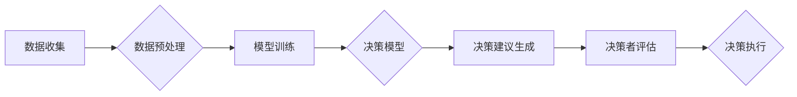

                 

## LLM辅助决策：商业战略和政策制定的新工具

> 关键词：LLM、决策支持、商业战略、政策制定、人工智能、自然语言处理、机器学习

## 1. 背景介绍

在当今数据爆炸的时代，企业和政府机构面临着越来越多的复杂决策问题。传统的决策方法往往依赖于经验和直觉，难以有效处理海量数据和多变的市场环境。近年来，大型语言模型（LLM）的快速发展为决策支持提供了全新的可能性。LLM 拥有强大的文本理解和生成能力，能够从海量文本数据中提取关键信息，识别模式和趋势，并生成有价值的决策建议。

LLM辅助决策是指利用大型语言模型的强大能力，辅助企业和政府机构进行商业战略和政策制定。它可以帮助决策者：

* **深入理解市场趋势和客户需求:** LLM 可以分析海量市场数据、新闻报道、社交媒体评论等文本信息，识别潜在的市场机会和风险，并洞察客户需求和偏好。
* **评估不同战略方案的优劣:** LLM 可以根据历史数据和市场分析结果，模拟不同战略方案的潜在影响，帮助决策者评估方案的风险和收益。
* **生成可行的决策方案:** LLM 可以根据决策者的目标和约束条件，生成多套可行的决策方案，并提供方案的详细分析和评估。
* **优化决策执行流程:** LLM 可以帮助决策者制定更有效的执行计划，并跟踪执行进度，确保决策方案的顺利实施。

## 2. 核心概念与联系

LLM辅助决策的核心概念包括：

* **大型语言模型 (LLM):** 训练于海量文本数据，具备强大的文本理解、生成和推理能力的深度学习模型。
* **自然语言处理 (NLP):** 使计算机能够理解、处理和生成人类语言的技术领域。
* **机器学习 (ML):** 算法能够从数据中学习并改进的机器智能技术。
* **决策支持系统 (DSS):** 利用数据分析和模型预测，帮助决策者做出更明智决策的系统。

LLM辅助决策的架构可以概括为以下流程：



## 3. 核心算法原理 & 具体操作步骤

### 3.1  算法原理概述

LLM辅助决策的核心算法通常基于Transformer架构，例如GPT-3、BERT等。这些模型通过学习大量的文本数据，能够捕捉语言的复杂结构和语义关系。在决策支持场景中，LLM可以被训练为以下几种类型的模型：

* **文本分类模型:** 用于识别文本的类别，例如市场趋势、客户情绪等。
* **文本生成模型:** 用于生成文本内容，例如决策建议、报告摘要等。
* **文本问答模型:** 用于回答关于特定主题的问题，例如市场分析、竞争对手情报等。

### 3.2  算法步骤详解

LLM辅助决策的具体操作步骤如下：

1. **数据收集:** 收集与决策相关的文本数据，例如市场报告、新闻文章、客户评论、财务报表等。
2. **数据预处理:** 对收集到的数据进行清洗、格式化和标记，使其适合LLM的训练。
3. **模型训练:** 使用预处理后的数据训练LLM模型，并根据具体的决策任务进行模型调优。
4. **决策模型部署:** 将训练好的模型部署到生产环境中，以便用于实际决策支持。
5. **决策建议生成:** 当决策者提出问题或提供决策目标时，LLM模型会根据其训练数据和模型参数，生成相应的决策建议。
6. **决策者评估:** 决策者会根据LLM生成的建议，结合自身经验和专业知识，进行评估和决策。
7. **决策执行:** 决策者根据评估结果，制定并执行最终的决策方案。

### 3.3  算法优缺点

**优点:**

* **强大的文本理解能力:** LLM能够理解复杂的文本信息，识别模式和趋势。
* **高效的数据分析:** LLM可以快速分析海量文本数据，提取关键信息。
* **个性化决策建议:** LLM可以根据决策者的具体需求和目标，生成个性化的决策建议。
* **自动化决策流程:** LLM可以自动化部分决策流程，提高决策效率。

**缺点:**

* **数据依赖性:** LLM的性能取决于训练数据的质量和数量。
* **解释性不足:** LLM的决策过程往往难以解释，难以获得决策背后的逻辑推理。
* **伦理风险:** LLM可能存在偏见和歧视，需要谨慎使用。

### 3.4  算法应用领域

LLM辅助决策的应用领域非常广泛，包括：

* **商业战略:** 市场分析、竞争对手情报、产品开发、营销策略制定等。
* **政策制定:** 政策评估、风险预测、公共服务优化等。
* **金融投资:** 风险管理、投资组合优化、欺诈检测等。
* **医疗保健:** 疾病诊断、药物研发、患者管理等。

## 4. 数学模型和公式 & 详细讲解 & 举例说明

LLM的训练过程本质上是一个优化问题，目标是找到模型参数，使得模型在训练数据上的预测性能达到最大。常用的优化算法包括梯度下降法和其变种算法。

### 4.1  数学模型构建

LLM通常使用Transformer架构，其核心组件是注意力机制和多头注意力机制。注意力机制允许模型关注输入序列中与当前任务相关的部分，提高模型的理解能力。多头注意力机制则使用多个注意力头，从不同的角度捕捉文本信息，进一步提升模型的表达能力。

### 4.2  公式推导过程

Transformer模型的训练目标是最大化模型在训练数据上的似然概率。假设训练数据为{(x1, y1), (x2, y2), ..., (xn, yn)}，其中xi为输入文本序列，yi为对应的目标文本序列。模型的似然概率可以表示为：

$$P(y_1, y_2, ..., y_n | x_1, x_2, ..., x_n)$$

为了简化计算，通常使用对数似然函数作为优化目标：

$$L = log P(y_1, y_2, ..., y_n | x_1, x_2, ..., x_n)$$

模型参数通过反向传播算法进行更新，目标是找到使对数似然函数最大化的参数值。

### 4.3  案例分析与讲解

例如，在文本分类任务中，LLM可以被训练为识别新闻文章的主题类别。训练数据包含大量新闻文章及其对应的主题标签。模型通过学习这些数据，能够识别新闻文章中包含的关键词和语义特征，并将其映射到不同的主题类别。

## 5. 项目实践：代码实例和详细解释说明

### 5.1  开发环境搭建

LLM辅助决策的开发环境通常需要包含以下软件：

* Python编程语言
* 深度学习框架，例如TensorFlow或PyTorch
* 自然语言处理库，例如NLTK或spaCy
* 数据存储和处理工具，例如MongoDB或Redis

### 5.2  源代码详细实现

以下是一个简单的LLM文本分类代码示例，使用TensorFlow框架和BERT模型：

```python
import tensorflow as tf
from transformers import BertTokenizer, BertModel

# 加载预训练模型和词典
tokenizer = BertTokenizer.from_pretrained('bert-base-uncased')
model = BertModel.from_pretrained('bert-base-uncased')

# 定义文本分类模型
class TextClassifier(tf.keras.Model):
    def __init__(self, num_classes):
        super(TextClassifier, self).__init__()
        self.bert = model
        self.classifier = tf.keras.layers.Dense(num_classes, activation='softmax')

    def call(self, inputs):
        outputs = self.bert(inputs)
        pooled_output = outputs[1][:, 0, :]
        logits = self.classifier(pooled_output)
        return logits

# 训练模型
model = TextClassifier(num_classes=2)  # 2个类别
model.compile(optimizer='adam', loss='sparse_categorical_crossentropy', metrics=['accuracy'])
model.fit(train_data, train_labels, epochs=3)

# 预测文本类别
text = "This is a sample text."
inputs = tokenizer(text, return_tensors='tf')
logits = model(inputs)
predicted_class = tf.argmax(logits, axis=1).numpy()[0]
print(f"Predicted class: {predicted_class}")
```

### 5.3  代码解读与分析

这段代码首先加载预训练的BERT模型和词典。然后定义了一个文本分类模型，该模型使用BERT模型提取文本特征，并使用全连接层进行分类。最后，代码展示了如何训练和使用该模型进行文本分类预测。

### 5.4  运行结果展示

运行该代码后，会输出预测的文本类别。例如，如果训练数据包含“正面”和“负面”两个类别，则代码会输出预测文本属于“正面”或“负面”的类别。

## 6. 实际应用场景

LLM辅助决策在各个领域都有着广泛的应用场景。

### 6.1  商业战略

* **市场分析:** LLM可以分析市场报告、新闻报道、社交媒体评论等文本数据，识别市场趋势、客户需求和竞争对手动向，为企业制定更精准的市场策略。
* **产品开发:** LLM可以帮助企业分析客户反馈、市场需求和竞争产品信息，识别潜在的产品机会，并生成产品概念和功能设计方案。
* **营销策略制定:** LLM可以分析客户画像、消费行为和市场营销活动效果，为企业制定更有效的营销策略，提高营销转化率。

### 6.2  政策制定

* **政策评估:** LLM可以分析政策文本、相关研究报告和公众舆情，评估政策的潜在影响和风险，为政策制定者提供更科学的决策依据。
* **风险预测:** LLM可以分析历史数据、新闻报道和社会事件，识别潜在的社会风险和政策风险，帮助政府提前预警和应对。
* **公共服务优化:** LLM可以分析公众需求、服务流程和服务效果，识别公共服务中的痛点和改进空间，帮助政府优化公共服务体系。

### 6.3  金融投资

* **风险管理:** LLM可以分析市场数据、公司财务报表和新闻报道，识别投资风险，帮助金融机构进行风险控制和资产配置。
* **投资组合优化:** LLM可以分析投资者的风险偏好、投资目标和市场趋势，生成个性化的投资组合建议，帮助投资者实现投资目标。
* **欺诈检测:** LLM可以分析交易数据、客户行为和网络活动，识别潜在的欺诈行为，帮助金融机构防范欺诈风险。

### 6.4  未来应用展望

随着LLM技术的不断发展，其在决策支持领域的应用前景更加广阔。未来，LLM可能能够：

* **提供更深入的决策洞察:** LLM能够分析更复杂的数据，识别更细微的模式和趋势，为决策者提供更深入的决策洞察。
* **生成更个性化的决策建议:** LLM能够根据决策者的具体需求和目标，生成更个性化的决策建议，提高决策的针对性和有效性。
* **实现更智能的决策自动化:** LLM能够自动完成部分决策流程，例如数据分析、方案评估和执行计划制定，提高决策效率和准确性。

## 7. 工具和资源推荐

### 7.1  学习资源推荐

* **书籍:**
    * 《深度学习》 by Ian Goodfellow, Yoshua Bengio, and Aaron Courville
    * 《自然语言处理》 by Dan Jurafsky and James H. Martin
* **在线课程:**
    * Coursera: Natural Language Processing Specialization
    * edX: Deep Learning
* **博客和网站:**
    * The Gradient
    * Towards Data Science
    * OpenAI Blog

### 7.2  开发工具推荐

* **深度学习框架:** TensorFlow, PyTorch
* **自然语言处理库:** NLTK, spaCy, Hugging Face Transformers
* **数据存储和处理工具:** MongoDB, Redis

### 7.3  相关论文推荐

* **Attention Is All You Need** by Vaswani et al. (2017)
* **BERT: Pre-training of Deep Bidirectional Transformers for Language Understanding** by Devlin et al. (2018)
* **GPT-3: Language Models are Few-Shot Learners** by Brown et al. (2020)

## 8. 总结：未来发展趋势与挑战

### 8.1  研究成果总结

LLM辅助决策技术取得了显著进展，能够有效地帮助企业和政府机构进行决策支持。

### 8.2  未来发展趋势

未来，LLM辅助决策技术将朝着以下方向发展：

* **模型规模和能力提升:** LLM模型将继续朝着更大规模和更强大的方向发展，能够处理更复杂的数据，提供更深入的决策洞察。
* **解释性增强:** 研究者将致力于提高LLM模型的解释性，使决策者能够更好地理解模型的决策过程。
* **多模态决策支持:** LLM将与其他人工智能技术，例如计算机视觉和语音识别技术，融合在一起，实现多模态决策支持。

### 8.3  面临的挑战

LLM辅助决策技术也面临着一些挑战：

* **数据质量和偏见:** LLM模型的性能取决于训练数据的质量和代表性。数据中的偏见可能会导致模型生成不公平或不准确的决策建议。
* **计算资源需求:** 训练大型LLM模型需要大量的计算资源，这对于一些资源有限的机构来说是一个挑战。
* **伦理风险:** LLM模型的决策过程可能难以解释，这可能会导致决策的透明度和可信度问题。

### 8.4  研究展望

未来，研究者将继续探索LLM辅助决策技术的应用场景，并致力于解决其面临的挑战，使其能够更好地服务于人类社会。


## 9. 附录：常见问题与解答

**Q1: LLM辅助决策是否会取代人类决策者？**

A1: LLM辅助决策技术可以帮助决策者提高效率和准确性，但不会完全取代人类决策者。人类决策者仍然需要根据自身经验和专业知识，对LLM生成的建议进行评估和最终决策。

**Q2: 如何确保LLM模型的决策结果公平公正？**

A2: 确保LLM模型的决策结果公平公正需要从多个方面入手，例如：

* 使用高质量、代表性强的训练数据。
* 对训练数据进行去偏见处理。
* 开发可解释的LLM模型，以便更好地理解模型的决策过程。
* 建立伦理规范和监督机制，确保LLM模型的应用符合伦理道德。

**Q3: 如何评估LLM辅助决策系统的性能？**

A3: LLM辅助决策系统的性能可以从以下几个方面进行评估：

* **准确率:** 模型预测结果的准确性。
* **效率:** 模型处理决策任务的速度和效率。
* **解释性:** 模型决策过程的透明度和可解释性。
* **鲁棒性:** 模型对噪声数据和异常情况的抵抗能力。


作者：禅与计算机程序设计艺术 / Zen and the Art of Computer Programming 
<end_of_turn>

