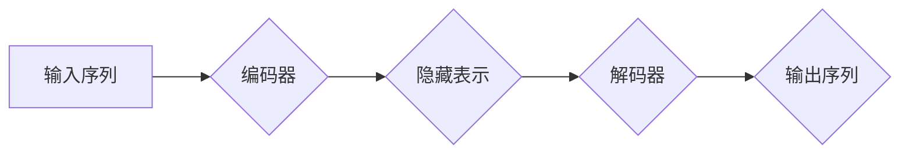

                 

## Transformer架构解析：编码器与解码器的双重奏

> 关键词：Transformer, 编码器, 解码器, 自注意力机制, 多头注意力, 位置编码,  BERT, GPT

## 1. 背景介绍

自然语言处理 (NLP) 领域近年来取得了飞速发展，深度学习模型在文本理解、生成和翻译等任务上展现出强大的能力。其中，Transformer 架构作为一种突破性的创新，彻底改变了 NLP 的发展方向。 

传统的循环神经网络 (RNN) 模型在处理长文本序列时存在梯度消失和计算效率低的问题。Transformer 架构巧妙地利用自注意力机制，有效地解决了这些问题，并展现出远超 RNN 的性能。自注意力机制能够捕捉文本序列中词语之间的长距离依赖关系，使得 Transformer 模型能够更深入地理解文本语义。

自 2017 年 Google 发布了基于 Transformer 架构的机器翻译模型后，该架构迅速在 NLP 领域流行开来，并催生了一系列强大的预训练语言模型，如 BERT、GPT 等，这些模型在各种 NLP 任务上取得了突破性的成果。

## 2. 核心概念与联系

Transformer 架构的核心是编码器-解码器结构，它将输入序列编码成一个隐藏表示，然后解码成输出序列。

**2.1 编码器**

编码器由多个相同的编码层组成，每个编码层包含以下组件：

* **多头自注意力机制 (Multi-Head Self-Attention)**： 捕捉文本序列中词语之间的关系，学习每个词语在句子中的语义贡献。
* **前馈神经网络 (Feed-Forward Network)**： 对每个词语的隐藏表示进行非线性变换，进一步提取语义特征。
* **残差连接 (Residual Connection)**： 缓解梯度消失问题，提高模型训练的稳定性。
* **层归一化 (Layer Normalization)**： 规范化每个层的输出，加速模型训练。

**2.2 解码器**

解码器也由多个相同的解码层组成，每个解码层包含以下组件：

* **多头自注意力机制**: 捕捉解码序列中词语之间的关系。
* **编码器-解码器注意力机制 (Encoder-Decoder Attention)**： 捕捉编码器输出和解码器输入之间的关系，帮助解码器理解输入序列的语义。
* **前馈神经网络**: 对每个词语的隐藏表示进行非线性变换。
* **残差连接和层归一化**: 与编码器类似，用于提高模型训练的稳定性和效率。

**2.3 流程图**



## 3. 核心算法原理 & 具体操作步骤

### 3.1 算法原理概述

Transformer 架构的核心算法是自注意力机制，它能够捕捉文本序列中词语之间的关系，学习每个词语在句子中的语义贡献。

自注意力机制通过计算每个词语与其他词语之间的“注意力权重”，来确定每个词语对其他词语的影响程度。注意力权重越高，表示两个词语之间的关系越密切。

### 3.2 算法步骤详解

1. **计算词嵌入**: 将每个词语转换为一个低维向量，称为词嵌入。
2. **计算查询 (Query)、键 (Key) 和值 (Value) 向量**: 对每个词语的词嵌入进行线性变换，得到查询、键和值向量。
3. **计算注意力权重**: 使用查询向量和键向量计算注意力权重，注意力权重矩阵的每个元素表示两个词语之间的注意力程度。
4. **加权求和**: 使用注意力权重对值向量进行加权求和，得到每个词语的上下文表示。
5. **拼接**: 将所有词语的上下文表示拼接在一起，得到编码器的输出。

### 3.3 算法优缺点

**优点**:

* 能够捕捉文本序列中词语之间的长距离依赖关系。
* 计算效率高，可以并行处理多个词语。
* 训练效果好，在各种 NLP 任务上取得了突破性的成果。

**缺点**:

* 参数量大，需要大量的计算资源进行训练。
* 对训练数据要求较高，需要大量的标注数据。

### 3.4 算法应用领域

* 机器翻译
* 文本摘要
* 问答系统
* 情感分析
* 代码生成

## 4. 数学模型和公式 & 详细讲解 & 举例说明

### 4.1 数学模型构建

自注意力机制的数学模型可以表示为以下公式：

$$
Attention(Q, K, V) = softmax(\frac{QK^T}{\sqrt{d_k}})V
$$

其中：

* $Q$：查询矩阵
* $K$：键矩阵
* $V$：值矩阵
* $d_k$：键向量的维度
* $softmax$：softmax 函数，用于归一化注意力权重

### 4.2 公式推导过程

1. **计算查询向量和键向量的点积**: $QK^T$ 计算每个查询向量与每个键向量的点积，得到一个注意力权重矩阵。
2. **缩放**: 将点积结果除以 $\sqrt{d_k}$，可以防止梯度爆炸。
3. **应用 softmax 函数**: 对注意力权重矩阵应用 softmax 函数，得到每个词语对其他词语的注意力权重。
4. **加权求和**: 使用注意力权重对值向量进行加权求和，得到每个词语的上下文表示。

### 4.3 案例分析与讲解

假设我们有一个句子 "The cat sat on the mat"，每个词语的词嵌入向量分别为 $q_1, q_2, ..., q_7$。

1. 计算查询向量和键向量的点积，得到一个 7x7 的注意力权重矩阵。
2. 将点积结果除以 $\sqrt{d_k}$，得到一个缩放后的注意力权重矩阵。
3. 应用 softmax 函数，得到每个词语对其他词语的注意力权重。例如，"cat" 的注意力权重可能较高，因为它与 "sat" 和 "on" 相关。
4. 使用注意力权重对值向量进行加权求和，得到每个词语的上下文表示。

## 5. 项目实践：代码实例和详细解释说明

### 5.1 开发环境搭建

* Python 3.6+
* TensorFlow 或 PyTorch

### 5.2 源代码详细实现

```python
import tensorflow as tf

class MultiHeadAttention(tf.keras.layers.Layer):
    def __init__(self, num_heads, key_dim):
        super(MultiHeadAttention, self).__init__()
        self.num_heads = num_heads
        self.key_dim = key_dim

        self.W_q = tf.keras.layers.Dense(key_dim)
        self.W_k = tf.keras.layers.Dense(key_dim)
        self.W_v = tf.keras.layers.Dense(key_dim)
        self.W_o = tf.keras.layers.Dense(key_dim)

    def call(self, queries, keys, values, mask=None):
        batch_size = tf.shape(queries)[0]

        # Linear transformations
        q = self.W_q(queries)
        k = self.W_k(keys)
        v = self.W_v(values)

        # Split into multiple heads
        q = tf.reshape(q, (batch_size, -1, self.num_heads, self.key_dim // self.num_heads))
        k = tf.reshape(k, (batch_size, -1, self.num_heads, self.key_dim // self.num_heads))
        v = tf.reshape(v, (batch_size, -1, self.num_heads, self.key_dim // self.num_heads))

        # Scaled dot-product attention
        scores = tf.matmul(q, k, transpose_b=True) / tf.math.sqrt(tf.cast(self.key_dim // self.num_heads, tf.float32))

        if mask is not None:
            scores += (mask * -1e9)

        attention_weights = tf.nn.softmax(scores, axis=-1)

        # Weighted sum of values
        context = tf.matmul(attention_weights, v)

        # Concatenate heads
        context = tf.reshape(context, (batch_size, -1, self.key_dim))

        # Output linear transformation
        output = self.W_o(context)

        return output, attention_weights
```

### 5.3 代码解读与分析

* `MultiHeadAttention` 类定义了多头注意力机制。
* `__init__` 方法初始化模型参数，包括头数 `num_heads` 和键向量的维度 `key_dim`。
* `call` 方法实现多头注意力机制的计算过程，包括线性变换、头分割、缩放点积注意力、加权求和和拼接操作。
* `mask` 参数用于屏蔽某些词语之间的关系，例如在机器翻译中，屏蔽已经翻译过的词语。

### 5.4 运行结果展示

运行上述代码，可以得到每个词语的上下文表示和注意力权重矩阵。

## 6. 实际应用场景

Transformer 架构在 NLP 领域有着广泛的应用场景，例如：

* **机器翻译**: Transformer 模型能够捕捉文本序列中词语之间的长距离依赖关系，从而实现更准确的机器翻译。
* **文本摘要**: Transformer 模型能够学习文本的语义结构，并生成简洁准确的文本摘要。
* **问答系统**: Transformer 模型能够理解自然语言问题，并从文本中找到相应的答案。
* **情感分析**: Transformer 模型能够学习文本的情感表达，并进行情感分类。
* **代码生成**: Transformer 模型能够学习代码的语法结构和语义，并生成新的代码。

### 6.4 未来应用展望

Transformer 架构在未来将继续推动 NLP 领域的发展，并应用于更多领域，例如：

* **对话系统**: Transformer 模型能够进行更自然流畅的对话。
* **文本生成**: Transformer 模型能够生成更逼真的文本，例如小说、诗歌等。
* **知识图谱构建**: Transformer 模型能够帮助构建更完整的知识图谱。

## 7. 工具和资源推荐

### 7.1 学习资源推荐

* **论文**: "Attention Is All You Need"
* **博客**: Jay Alammar's Blog
* **课程**: Stanford CS224N: Natural Language Processing with Deep Learning

### 7.2 开发工具推荐

* **TensorFlow**: 开源深度学习框架
* **PyTorch**: 开源深度学习框架
* **Hugging Face Transformers**: Transformer 模型库

### 7.3 相关论文推荐

* BERT: Pre-training of Deep Bidirectional Transformers for Language Understanding
* GPT: Generative Pre-trained Transformer
* T5: Text-to-Text Transfer Transformer

## 8. 总结：未来发展趋势与挑战

### 8.1 研究成果总结

Transformer 架构在 NLP 领域取得了显著的成果，例如：

* 提升了机器翻译、文本摘要、问答系统等任务的性能。
* 推动了预训练语言模型的发展，例如 BERT、GPT 等。

### 8.2 未来发展趋势

* **效率提升**: 研究更轻量级的 Transformer 模型，降低训练和推理成本。
* **跨模态理解**: 将 Transformer 架构应用于跨模态理解任务，例如图像和文本的联合理解。
* **可解释性增强**: 研究 Transformer 模型的内部机制，提高模型的可解释性。

### 8.3 面临的挑战

* **数据依赖**: Transformer 模型对大量训练数据依赖，数据获取和标注成本高。
* **计算资源**: 训练大型 Transformer 模型需要大量的计算资源。
* **泛化能力**: Transformer 模型在某些特定任务上表现出色，但泛化能力仍有待提高。

### 8.4 研究展望

未来研究将继续探索 Transformer 架构的潜力，解决其面临的挑战，并将其应用于更多领域，推动人工智能技术的进步。

## 9. 附录：常见问题与解答

* **Transformer 和 RNN 的区别**: Transformer 不依赖于循环结构，可以并行处理文本序列，而 RNN 则需要逐个处理词语，效率较低。
* **Transformer 的注意力机制**: 注意力机制能够捕捉文本序列中词语之间的关系，学习每个词语在句子中的语义贡献。
* **Transformer 的参数量**: Transformer 模型的参数量较大，需要大量的计算资源进行训练。


作者：禅与计算机程序设计艺术 / Zen and the Art of Computer Programming 
<end_of_turn>

