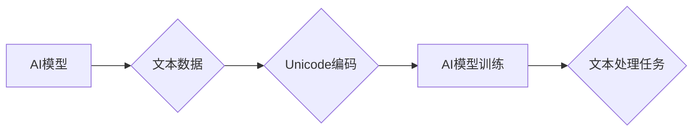

                 

## Unicode与AI：文本处理的国际化挑战

> 关键词：Unicode, AI, 文本处理, 国际化, 字符编码, 自然语言处理, 多语言支持

### 1. 背景介绍

人工智能（AI）正在各个领域迅速发展，其中自然语言处理（NLP）作为AI的重要分支，在文本理解、生成、翻译等方面取得了显著进展。然而，随着AI技术的应用范围不断扩大，处理不同语言的文本挑战也日益凸显。Unicode作为全球通用的字符编码标准，为解决这一挑战提供了基础保障。

文本处理的核心在于对字符的识别、分类和操作。传统的文本处理方法往往依赖于特定语言的编码标准，难以处理多语言文本。Unicode的出现打破了这种局限性，它定义了一套涵盖全球所有语言的字符编码体系，为跨语言文本处理提供了统一的标准。

随着AI技术的进步，NLP模型的规模和复杂度不断提高，对字符编码的精度和效率提出了更高的要求。Unicode标准也在不断完善，以满足AI时代对文本处理的新的需求。

### 2. 核心概念与联系

#### 2.1 Unicode标准

Unicode是一个国际标准，由Unicode Consortium维护和发展。它定义了一套字符编码体系，涵盖了世界上几乎所有语言的字符，包括字母、数字、符号、表情符号等。Unicode标准采用UTF-8编码格式，它是一种变长编码格式，可以表示所有Unicode字符，并且与ASCII兼容。

#### 2.2 自然语言处理（NLP）

NLP是人工智能的一个分支，致力于使计算机能够理解、处理和生成人类语言。NLP任务包括文本分类、情感分析、机器翻译、文本摘要等。

#### 2.3 AI与Unicode的联系

AI模型的训练和应用都需要大量文本数据。Unicode标准为AI模型提供了统一的字符编码体系，使得AI模型能够处理来自不同语言的文本数据。

**Mermaid 流程图**



### 3. 核心算法原理 & 具体操作步骤

#### 3.1 算法原理概述

Unicode标准为AI模型提供了字符编码的基础，但AI模型本身需要使用特定的算法来处理文本数据。常见的文本处理算法包括：

* **词法分析：** 将文本分割成单词或词组。
* **语法分析：** 分析文本的语法结构。
* **语义分析：** 理解文本的含义。
* **情感分析：** 分析文本的情感倾向。

#### 3.2 算法步骤详解

以词法分析为例，其具体步骤如下：

1. **输入文本：** 将需要处理的文本作为输入。
2. **识别单词边界：** 根据Unicode字符属性和语言规则，识别单词的边界。
3. **标记词性：** 为每个单词标记其词性，例如名词、动词、形容词等。
4. **输出词列表：** 将识别出的单词列表作为输出。

#### 3.3 算法优缺点

**优点：**

* 能够有效地分割文本，为后续的文本处理任务提供基础。
* 能够识别单词的词性，为语义分析提供信息。

**缺点：**

* 对某些特殊符号和标点符号的处理可能存在困难。
* 对于某些语言，词语边界可能难以识别。

#### 3.4 算法应用领域

词法分析广泛应用于以下领域：

* **机器翻译：** 将文本从一种语言翻译成另一种语言。
* **文本摘要：** 生成文本的简短摘要。
* **搜索引擎：** 理解用户搜索的意图。
* **聊天机器人：** 理解用户的对话内容。

### 4. 数学模型和公式 & 详细讲解 & 举例说明

#### 4.1 数学模型构建

在文本处理中，可以使用概率模型来描述单词出现的概率。例如，可以使用n元语法模型来预测下一个单词的出现概率，该模型基于前n个单词的上下文信息。

#### 4.2 公式推导过程

n元语法模型的概率公式如下：

$$P(w_i|w_{i-n+1}, w_{i-n+2}, ..., w_{i-1})$$

其中：

* $w_i$ 是第i个单词。
* $w_{i-n+1}, w_{i-n+2}, ..., w_{i-1}$ 是前n-1个单词。

#### 4.3 案例分析与讲解

例如，如果n=2，则模型会根据前一个单词来预测下一个单词的出现概率。

假设训练语料库中，“the”后面经常跟着“cat”，则模型会学习到“the”和“cat”是高概率的词语组合。

当输入文本为“the”，则模型会预测下一个单词为“cat”的概率较高。

### 5. 项目实践：代码实例和详细解释说明

#### 5.1 开发环境搭建

可以使用Python语言和NLTK库来实现文本处理任务。

#### 5.2 源代码详细实现

```python
import nltk

# 下载词法分析器
nltk.download('punkt')

# 输入文本
text = "This is a sample text."

# 词法分析
tokens = nltk.word_tokenize(text)

# 打印词列表
print(tokens)
```

#### 5.3 代码解读与分析

* `nltk.download('punkt')` 下载了词法分析器。
* `nltk.word_tokenize(text)` 使用词法分析器将文本分割成单词列表。
* `print(tokens)` 打印了分割后的单词列表。

#### 5.4 运行结果展示

```
['This', 'is', 'a', 'sample', 'text', '.']
```

### 6. 实际应用场景

#### 6.1 机器翻译

Unicode标准使得AI模型能够处理来自不同语言的文本数据，从而实现机器翻译。

#### 6.2 文本分类

Unicode标准可以帮助AI模型识别不同语言的文本，从而实现文本分类任务。

#### 6.3 情感分析

Unicode标准可以帮助AI模型识别不同语言的文本中的情感倾向，从而实现情感分析任务。

#### 6.4 未来应用展望

随着AI技术的不断发展，Unicode标准在文本处理中的应用场景将更加广泛。例如，可以利用Unicode标准来实现跨语言对话系统、个性化推荐系统等。

### 7. 工具和资源推荐

#### 7.1 学习资源推荐

* Unicode Consortium官方网站：https://www.unicode.org/
* NLTK库文档：https://www.nltk.org/

#### 7.2 开发工具推荐

* Python语言
* NLTK库

#### 7.3 相关论文推荐

* Unicode and Natural Language Processing
* A Survey of Text Processing Techniques for Machine Translation

### 8. 总结：未来发展趋势与挑战

#### 8.1 研究成果总结

Unicode标准为AI模型提供了统一的字符编码体系，使得AI模型能够处理来自不同语言的文本数据。

#### 8.2 未来发展趋势

* Unicode标准将继续完善，以满足AI时代对文本处理的新需求。
* AI模型的文本处理能力将不断提高，能够处理更加复杂和多样化的文本数据。

#### 8.3 面临的挑战

* 不同语言的文本结构和语法差异较大，需要开发更加智能的文本处理算法。
* 随着语言的不断演变，Unicode标准需要不断更新，以适应新的语言和字符。

#### 8.4 研究展望

* 研究更加高效和准确的文本处理算法。
* 开发能够处理多模态文本数据的AI模型。

### 9. 附录：常见问题与解答

#### 9.1 什么是Unicode？

Unicode是一个国际标准，定义了一套涵盖全球所有语言的字符编码体系。

#### 9.2 Unicode与ASCII有什么区别？

ASCII是一个较早的字符编码标准，只能表示英文字母、数字和一些符号。Unicode则涵盖了世界上几乎所有语言的字符。

#### 9.3 如何使用Unicode编码文本？

可以使用UTF-8编码格式来表示Unicode字符。

#### 9.4 Unicode标准如何帮助AI模型处理文本？

Unicode标准为AI模型提供了统一的字符编码体系，使得AI模型能够处理来自不同语言的文本数据。


作者：禅与计算机程序设计艺术 / Zen and the Art of Computer Programming 
<end_of_turn>

