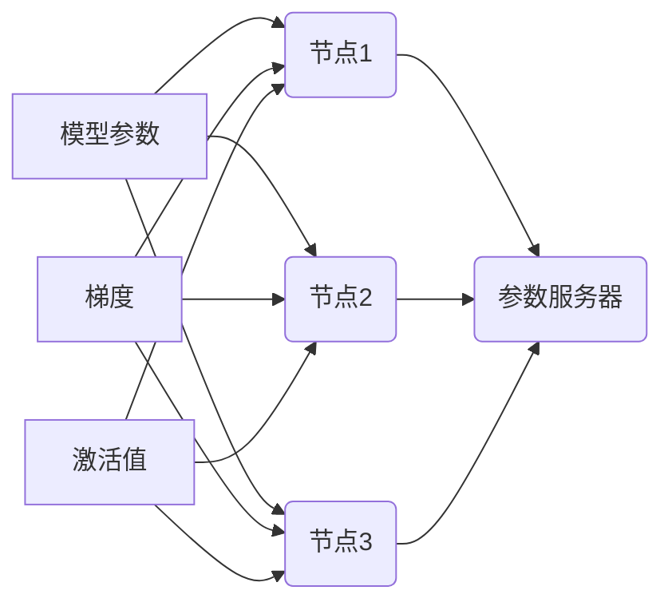

                 

## ZeRO 技术：内存优化分布式训练

> 关键词：分布式训练，ZeRO，内存优化，模型并行，参数服务器，梯度累积，模型压缩

## 1. 背景介绍

深度学习模型的规模不断增长，训练这些庞大模型需要海量内存资源。随着模型规模的扩大，单机内存的限制成为训练大型模型的瓶颈。分布式训练 emerged as a solution to overcome this challenge by distributing the model and data across multiple machines. However, even with distributed training, memory constraints can still hinder the training process, especially for very large models.

传统的分布式训练方法通常采用参数服务器架构，其中参数服务器负责存储和更新模型参数。这种架构在训练过程中需要频繁地将梯度数据传输到参数服务器，这会导致通信开销巨大，并且对内存带宽的需求很高。

为了解决这些问题，Facebook AI Research (FAIR) 提出了 ZeRO (Zero Redundancy Optimizer) 技术，它通过将模型参数、梯度和激活值分布在多个节点上，并采用梯度累积和模型压缩等技术，有效地降低了内存占用，从而提高了分布式训练的效率。

## 2. 核心概念与联系

ZeRO 技术的核心思想是将模型参数、梯度和激活值分布在多个节点上，并通过梯度累积和模型压缩等技术，减少内存占用。

**ZeRO 架构**



**ZeRO 的核心概念：**

* **模型并行 (Model Parallelism):** 将模型参数分布在多个节点上，每个节点负责训练模型的一部分。
* **数据并行 (Data Parallelism):** 将训练数据分布在多个节点上，每个节点对一部分数据进行训练。
* **梯度累积 (Gradient Accumulation):** 在每个训练步骤中，将梯度累积到本地节点，然后在一定步数后将累积的梯度发送到参数服务器进行更新。
* **模型压缩 (Model Compression):** 使用量化、剪枝等技术压缩模型参数，减少内存占用。

## 3. 核心算法原理 & 具体操作步骤

### 3.1  算法原理概述

ZeRO 技术的核心算法原理是通过梯度累积和模型压缩来减少内存占用。

* **梯度累积:** 

在每个训练步骤中，每个节点计算模型梯度，并将梯度累积到本地节点。在一定步数后，将累积的梯度发送到参数服务器进行更新。梯度累积可以有效地减少通信开销，因为每个节点只需要将累积的梯度发送到参数服务器一次。

* **模型压缩:** 

使用量化、剪枝等技术压缩模型参数，减少内存占用。量化将模型参数的精度降低，例如将32位浮点数转换为16位浮点数或8位整数。剪枝删除模型中不重要的参数，例如权重较小的参数。

### 3.2  算法步骤详解

1. **模型并行化:** 将模型参数分布在多个节点上。
2. **数据并行化:** 将训练数据分布在多个节点上。
3. **梯度累积:** 每个节点在每个训练步骤中计算模型梯度，并将梯度累积到本地节点。
4. **模型压缩:** 使用量化、剪枝等技术压缩模型参数。
5. **参数更新:** 在一定步数后，每个节点将累积的梯度发送到参数服务器进行更新。参数服务器更新所有节点的模型参数。
6. **重复步骤3-5:** 直到模型训练完成。

### 3.3  算法优缺点

**优点:**

* **内存效率:** 通过梯度累积和模型压缩，有效地减少了内存占用。
* **训练速度:** 减少了通信开销，提高了训练速度。
* **可扩展性:** 可以轻松扩展到多个节点，训练更大的模型。

**缺点:**

* **复杂性:** 相比于传统的分布式训练方法，ZeRO 技术更加复杂。
* **实现难度:** 需要对分布式系统和模型压缩技术有深入的了解。

### 3.4  算法应用领域

ZeRO 技术主要应用于大型模型的训练，例如自然语言处理、计算机视觉等领域。

## 4. 数学模型和公式 & 详细讲解 & 举例说明

### 4.1  数学模型构建

假设我们有一个深度学习模型 $f(x; \theta)$，其中 $x$ 是输入数据， $\theta$ 是模型参数。模型的目标是最小化损失函数 $L(f(x; \theta), y)$，其中 $y$ 是真实标签。

在 ZeRO 技术中，模型参数 $\theta$ 分布在多个节点上，每个节点负责训练模型的一部分。梯度累积是指在每个训练步骤中，每个节点计算模型梯度，并将梯度累积到本地节点。

### 4.2  公式推导过程

设模型参数 $\theta$ 分布在 $N$ 个节点上，每个节点的模型参数为 $\theta_i$，其中 $i = 1, 2, ..., N$。

在每个训练步骤中，每个节点计算模型梯度 $\nabla_{\theta_i} L(f(x; \theta_i), y)$。

梯度累积过程可以表示为：

$$\theta_i^{t+1} = \theta_i^t - \alpha \sum_{k=1}^{K} \nabla_{\theta_i} L(f(x^{(k)}; \theta_i^t), y^{(k)})$$

其中：

* $\theta_i^t$ 是第 $t$ 个训练步骤时节点 $i$ 的模型参数。
* $\theta_i^{t+1}$ 是第 $t+1$ 个训练步骤时节点 $i$ 的模型参数。
* $\alpha$ 是学习率。
* $K$ 是梯度累积步数。
* $x^{(k)}$ 是第 $k$ 个训练样本。
* $y^{(k)}$ 是第 $k$ 个训练样本的真实标签。

### 4.3  案例分析与讲解

假设我们有一个包含 100 万个参数的深度学习模型，需要在 4 个节点上进行分布式训练。

如果使用传统的分布式训练方法，每个节点需要存储模型参数的 1/4，即 25 万个参数。

如果使用 ZeRO 技术，我们可以将模型参数分布在 4 个节点上，每个节点存储模型参数的 1/4，即 25 万个参数。

但是，在 ZeRO 技术中，我们使用梯度累积，可以将梯度累积到本地节点，然后在一定步数后将累积的梯度发送到参数服务器进行更新。

因此，每个节点只需要存储梯度累积后的梯度，而不是完整的模型参数。

这可以有效地减少内存占用，从而提高训练效率。

## 5. 项目实践：代码实例和详细解释说明

### 5.1  开发环境搭建

* **操作系统:** Linux
* **深度学习框架:** PyTorch
* **分布式框架:** Horovod

### 5.2  源代码详细实现

```python
import torch
import torch.nn as nn
from torch.utils.data import DataLoader
from horovod.torch.nn.parallel import DistributedDataParallel as DDP

# 定义模型
class MyModel(nn.Module):
    def __init__(self):
        super(MyModel, self).__init__()
        # 模型结构

    def forward(self, x):
        # 模型前向传播

# 初始化模型和数据加载器
model = MyModel()
train_loader = DataLoader(dataset, batch_size=batch_size)

# 使用 Horovod 进行分布式训练
model = DDP(model)
optimizer = torch.optim.Adam(model.parameters(), lr=learning_rate)

# 训练循环
for epoch in range(num_epochs):
    for batch_idx, (data, target) in enumerate(train_loader):
        # 前向传播
        output = model(data)
        # 计算损失
        loss = criterion(output, target)
        # 反向传播
        optimizer.zero_grad()
        loss.backward()
        # 更新参数
        optimizer.step()

```

### 5.3  代码解读与分析

* **模型并行化:** 使用 Horovod 的 `DistributedDataParallel` 将模型参数分布在多个节点上。
* **数据并行化:** 使用 PyTorch 的 `DataLoader` 将训练数据分布在多个节点上。
* **梯度累积:** 在每个训练步骤中，每个节点计算模型梯度，并将梯度累积到本地节点。
* **参数更新:** 在一定步数后，每个节点将累积的梯度发送到参数服务器进行更新。

### 5.4  运行结果展示

运行上述代码后，可以观察到训练过程中的损失值随迭代次数的变化趋势。

## 6. 实际应用场景

ZeRO 技术在实际应用场景中可以显著提高训练效率，例如：

* **自然语言处理:** 训练大型语言模型，例如 BERT、GPT-3 等。
* **计算机视觉:** 训练大型图像识别模型，例如 ResNet、EfficientNet 等。
* **推荐系统:** 训练大型推荐模型，例如 Transformer-based recommender systems。

### 6.4  未来应用展望

随着模型规模的不断增长，ZeRO 技术将发挥越来越重要的作用。未来，ZeRO 技术可能会进一步发展，例如：

* **更有效的梯度累积策略:** 研究更有效的梯度累积策略，例如异步梯度累积、混合梯度累积等。
* **更先进的模型压缩技术:** 研究更先进的模型压缩技术，例如知识蒸馏、量化感知训练等。
* **更广泛的应用场景:** 将 ZeRO 技术应用于更多领域，例如药物发现、材料科学等。

## 7. 工具和资源推荐

### 7.1  学习资源推荐

* **ZeRO 官方文档:** https://ai.facebook.com/blog/zero-memory-optimization-for-large-scale-distributed-deep-learning/
* **Horovod 官方文档:** https://horovod.ai/
* **PyTorch 官方文档:** https://pytorch.org/

### 7.2  开发工具推荐

* **PyTorch:** https://pytorch.org/
* **Horovod:** https://horovod.ai/
* **TensorBoard:** https://www.tensorflow.org/tensorboard

### 7.3  相关论文推荐

* **ZeRO: Memory Optimization for Large-Scale Distributed Deep Learning:** https://arxiv.org/abs/1908.09290

## 8. 总结：未来发展趋势与挑战

### 8.1  研究成果总结

ZeRO 技术为分布式训练带来了新的突破，有效地解决了内存占用问题，提高了训练效率。

### 8.2  未来发展趋势

未来，ZeRO 技术将继续发展，朝着更高效、更灵活的方向发展。

### 8.3  面临的挑战

ZeRO 技术仍然面临一些挑战，例如：

* **复杂性:** ZeRO 技术的实现较为复杂，需要对分布式系统和模型压缩技术有深入的了解。
* **性能优化:** 

需要进一步优化 ZeRO 技术的性能，例如减少通信开销、提高梯度累积效率等。

### 8.4  研究展望

未来，我们将继续研究 ZeRO 技术，探索更有效的内存优化策略，并将其应用于更多领域。

## 9. 附录：常见问题与解答

**Q1: ZeRO 技术与传统的分布式训练方法相比有什么优势？**

**A1:** ZeRO 技术通过梯度累积和模型压缩，有效地减少了内存占用，提高了训练效率。

**Q2: ZeRO 技术有哪些局限性？**

**A2:** ZeRO 技术的实现较为复杂，需要对分布式系统和模型压缩技术有深入的了解。

**Q3: ZeRO 技术适用于哪些场景？**

**A3:** ZeRO 技术主要应用于大型模型的训练，例如自然语言处理、计算机视觉等领域。

**Q4: 如何学习和使用 ZeRO 技术？**

**A4:** 可以参考 ZeRO 官方文档、Horovod 官方文档和 PyTorch 官方文档。

作者：禅与计算机程序设计艺术 / Zen and the Art of Computer Programming


<end_of_turn>

