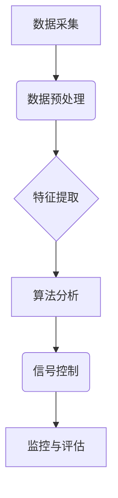

                 

## 人工智能在城市交通管理中的应用：智能信号控制

> 关键词：人工智能、智能交通、信号控制、机器学习、深度学习、交通流量、优化算法

## 1. 背景介绍

城市交通拥堵已成为全球性难题，给人们的生活和经济发展带来了巨大负担。传统的交通信号控制系统通常采用固定时序或简单的检测机制，难以适应实时变化的交通流量，导致信号灯红绿灯的切换效率低下，交通拥堵现象加剧。

近年来，人工智能（AI）技术发展迅速，为解决城市交通拥堵问题提供了新的思路。智能信号控制系统利用AI算法对交通流量进行实时分析和预测，并根据实际情况动态调整信号灯的切换时间，从而提高交通流量的通行效率，缓解交通拥堵。

## 2. 核心概念与联系

### 2.1 智能信号控制系统架构

智能信号控制系统主要由以下几个模块组成：

* **数据采集模块：** 利用摄像头、雷达、传感器等设备采集交通流量、车辆速度、行人流量等实时数据。
* **数据处理模块：** 对采集到的数据进行预处理、清洗、特征提取等操作，生成可供算法分析的特征数据。
* **算法模块：** 利用机器学习、深度学习等AI算法对交通流量进行分析和预测，并根据预测结果生成信号灯切换策略。
* **控制模块：** 将算法模块生成的信号灯切换策略发送到信号灯控制器，实现信号灯的动态调整。
* **监控模块：** 对系统运行状态进行实时监控，并进行故障诊断和处理。



### 2.2 核心概念原理

* **机器学习：**  智能信号控制系统通常利用机器学习算法对历史交通流量数据进行训练，学习交通流量的规律和模式，并根据学习到的知识对未来交通流量进行预测。
* **深度学习：** 深度学习算法能够学习更复杂的特征，对交通流量进行更精准的预测。
* **强化学习：** 强化学习算法可以使智能信号控制系统在不断与环境交互的过程中不断优化信号灯切换策略，提高交通流量的通行效率。

## 3. 核心算法原理 & 具体操作步骤

### 3.1 算法原理概述

智能信号控制系统常用的算法包括：

* **回归算法：** 用于预测未来交通流量，例如线性回归、支持向量回归等。
* **分类算法：** 用于判断车辆是否需要通行，例如逻辑回归、决策树、随机森林等。
* **预测算法：** 用于预测未来交通流量的趋势，例如ARIMA模型、LSTM模型等。

### 3.2 算法步骤详解

以预测交通流量为例，详细说明算法步骤：

1. **数据收集：** 收集历史交通流量数据，包括时间、流量、天气、事件等信息。
2. **数据预处理：** 对数据进行清洗、缺失值处理、特征工程等操作，生成可供算法分析的特征数据。
3. **模型选择：** 根据实际需求选择合适的预测算法，例如ARIMA模型、LSTM模型等。
4. **模型训练：** 利用历史数据对模型进行训练，学习交通流量的规律和模式。
5. **模型评估：** 利用测试数据对模型进行评估，评估模型的预测精度。
6. **模型部署：** 将训练好的模型部署到智能信号控制系统中，用于实时预测交通流量。

### 3.3 算法优缺点

* **回归算法：** 优点：易于理解和实现，计算效率高。缺点：对非线性关系的拟合能力较弱。
* **分类算法：** 优点：能够处理分类问题，例如判断车辆是否需要通行。缺点：对数据质量要求较高，容易受到过拟合的影响。
* **预测算法：** 优点：能够预测未来交通流量的趋势，提高信号灯切换策略的准确性。缺点：对数据量和数据质量要求较高，计算复杂度较高。

### 3.4 算法应用领域

智能信号控制系统广泛应用于以下领域：

* **城市道路交通管理：** 优化信号灯切换策略，缓解交通拥堵，提高交通流量通行效率。
* **交通事故预防：** 通过预测交通流量和车辆速度，及时预警潜在的交通事故风险。
* **公共交通优化：** 为公交车、地铁等公共交通工具提供实时信号灯预警和优先通行服务，提高公共交通效率。
* **智能停车管理：** 利用传感器和AI算法，实时监测停车场车位情况，引导车辆驶入空闲车位，提高停车场利用率。

## 4. 数学模型和公式 & 详细讲解 & 举例说明

### 4.1 数学模型构建

智能信号控制系统通常采用以下数学模型来描述交通流量和信号灯切换策略：

* **交通流量模型：**  描述交通流量随时间变化的规律，例如泊松分布、指数分布等。
* **信号灯切换策略模型：**  描述信号灯切换时间与交通流量的关系，例如最短等待时间算法、最大流量算法等。

### 4.2 公式推导过程

以最短等待时间算法为例，推导其公式：

假设当前路口车辆等待时间为 $t_w$，目标是使所有车辆的等待时间最小化。

最短等待时间算法的公式为：

$$t_{w,new} = \min(t_{w,current} + \Delta t, T)$$

其中：

* $t_{w,new}$：新的等待时间
* $t_{w,current}$：当前等待时间
* $\Delta t$：信号灯切换时间间隔
* $T$：最大等待时间

### 4.3 案例分析与讲解

假设当前路口车辆等待时间为 30 秒，信号灯切换时间间隔为 10 秒，最大等待时间为 60 秒。

根据公式，新的等待时间为：

$$t_{w,new} = \min(30 + 10, 60) = 40$$

因此，信号灯将切换，新的等待时间为 40 秒。

## 5. 项目实践：代码实例和详细解释说明

### 5.1 开发环境搭建

智能信号控制系统开发环境通常包括：

* **操作系统：** Linux、Windows 等
* **编程语言：** Python、C++ 等
* **机器学习框架：** TensorFlow、PyTorch 等
* **数据库：** MySQL、MongoDB 等

### 5.2 源代码详细实现

以下是一个使用 Python 和 TensorFlow 实现简单交通流量预测模型的代码示例：

```python
import tensorflow as tf

# 定义模型结构
model = tf.keras.models.Sequential([
  tf.keras.layers.Dense(64, activation='relu', input_shape=(10,)),
  tf.keras.layers.Dense(32, activation='relu'),
  tf.keras.layers.Dense(1)
])

# 编译模型
model.compile(optimizer='adam', loss='mse')

# 训练模型
model.fit(X_train, y_train, epochs=10)

# 预测交通流量
predictions = model.predict(X_test)
```

### 5.3 代码解读与分析

* **模型结构：** 代码定义了一个简单的多层感知机模型，包含三个全连接层，激活函数为ReLU。
* **模型编译：** 使用Adam优化器和均方误差损失函数对模型进行编译。
* **模型训练：** 使用训练数据对模型进行训练，训练10个 epochs。
* **模型预测：** 使用测试数据对模型进行预测，得到交通流量预测结果。

### 5.4 运行结果展示

训练完成后，可以将模型预测结果与实际交通流量进行比较，评估模型的预测精度。

## 6. 实际应用场景

智能信号控制系统已在许多城市道路交通管理中得到应用，取得了显著的成果：

* **交通流量优化：** 智能信号控制系统能够根据实时交通流量情况动态调整信号灯切换时间，提高交通流量通行效率，减少交通拥堵。
* **交通事故预防：** 通过预测交通流量和车辆速度，智能信号控制系统能够及时预警潜在的交通事故风险，提高道路交通安全。
* **公共交通优化：** 智能信号控制系统能够为公交车、地铁等公共交通工具提供实时信号灯预警和优先通行服务，提高公共交通效率。

### 6.4 未来应用展望

未来，智能信号控制系统将朝着以下方向发展：

* **更精准的预测：** 利用更先进的机器学习算法和传感器技术，提高交通流量预测的精准度。
* **更智能的控制：** 利用强化学习算法，使智能信号控制系统能够自主学习和优化信号灯切换策略。
* **更广泛的应用：** 将智能信号控制系统应用于更广泛的场景，例如智能停车管理、智能物流配送等。

## 7. 工具和资源推荐

### 7.1 学习资源推荐

* **书籍：**
    * 《深度学习》
    * 《机器学习实战》
* **在线课程：**
    * Coursera
    * edX
    * Udacity

### 7.2 开发工具推荐

* **编程语言：** Python
* **机器学习框架：** TensorFlow、PyTorch
* **数据库：** MySQL、MongoDB

### 7.3 相关论文推荐

* **交通流量预测：**
    * "Traffic Flow Prediction Using Deep Learning"
    * "A Survey of Traffic Flow Prediction Methods"
* **智能信号控制：**
    * "Adaptive Signal Control Using Machine Learning"
    * "A Reinforcement Learning Approach to Adaptive Signal Control"

## 8. 总结：未来发展趋势与挑战

### 8.1 研究成果总结

智能信号控制系统是人工智能技术在城市交通管理领域的典型应用，能够有效缓解交通拥堵问题，提高道路交通安全和效率。

### 8.2 未来发展趋势

未来，智能信号控制系统将朝着更精准的预测、更智能的控制、更广泛的应用方向发展。

### 8.3 面临的挑战

智能信号控制系统面临的挑战包括：

* **数据质量问题：** 交通流量数据往往存在噪声、缺失值等问题，需要进行有效的数据清洗和处理。
* **模型复杂度问题：** 交通流量预测模型往往需要考虑多种因素，模型复杂度较高，训练和部署难度较大。
* **安全性和可靠性问题：** 智能信号控制系统需要保证其安全性和可靠性，避免因系统故障导致交通事故发生。

### 8.4 研究展望

未来研究方向包括：

* **开发更鲁棒的交通流量预测模型：** 提高模型对噪声和缺失值等异常数据的鲁棒性。
* **研究更有效的信号灯切换策略：** 利用强化学习算法，使智能信号控制系统能够自主学习和优化信号灯切换策略。
* **探索智能信号控制系统与其他交通管理系统之间的协同控制：** 例如与自动驾驶系统、智能交通信号灯网络等协同控制，实现更智能、更高效的交通管理。

## 9. 附录：常见问题与解答

### 9.1  智能信号控制系统是否会增加交通拥堵？

智能信号控制系统通过动态调整信号灯切换时间，能够根据实时交通流量情况优化信号灯控制策略，从而提高交通流量通行效率，缓解交通拥堵。

### 9.2  智能信号控制系统是否会影响行人通行？

智能信号控制系统会根据行人流量情况调整信号灯切换时间，确保行人能够安全、便捷地通行。

### 9.3  智能信号控制系统是否需要大量的数据支持？

是的，智能信号控制系统需要大量的数据支持进行训练和预测。数据质量对模型性能有重要影响。

### 9.4  智能信号控制系统是否会受到网络攻击？

智能信号控制系统需要采取相应的安全措施，防止网络攻击。例如，使用加密技术保护数据传输，定期进行安全漏洞扫描和修复。


作者：禅与计算机程序设计艺术 / Zen and the Art of Computer Programming 
<end_of_turn>

