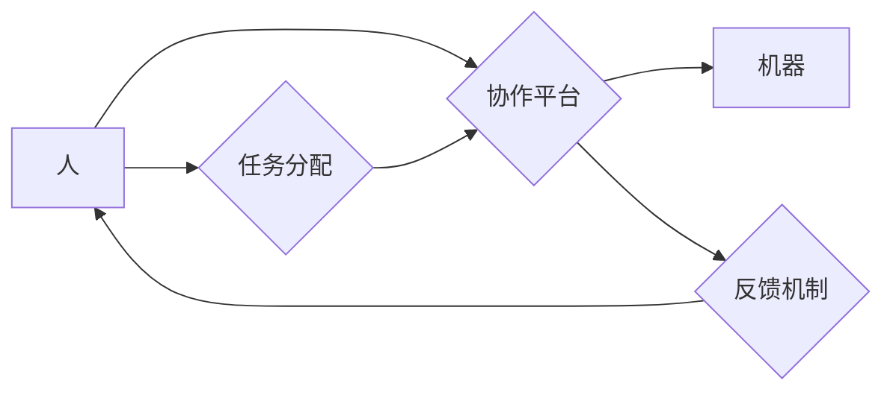

                 

## 人机协作管理：在自动化时代重新定义工作

> 关键词： 人机协作、自动化、工作流程、人工智能、协作平台、未来工作、效率提升、伦理问题

### 1. 背景介绍

自动化技术近年来发展迅速，人工智能（AI）的应用日益广泛，正在深刻地改变着人类的工作方式。从制造业的智能机器人到金融行业的自动交易系统，自动化正在取代越来越多的传统工作岗位。然而，自动化也带来了新的挑战，例如工作岗位的减少、技能结构的改变以及人机协作的新模式的探索。

面对这一新形势，我们需要重新思考人与机器的关系，以及如何在自动化时代重新定义工作。人机协作管理应运而生，它旨在通过优化人与机器的协作关系，提升工作效率，创造新的价值。

### 2. 核心概念与联系

**2.1 人机协作管理的概念**

人机协作管理是指在工作流程中，将人与机器的优势有机结合，共同完成任务的一种管理模式。它强调人与机器的协同作用，而不是简单的替代关系。

**2.2 人机协作管理的架构**



**2.3 人机协作管理的优势**

* **提高工作效率:** 人工智能可以自动化重复性、高强度的工作，释放人力资源，专注于更具创造性和战略性的工作。
* **提升工作质量:** 人工智能可以辅助人类进行数据分析、决策支持等，提高工作准确性和效率。
* **创造新的价值:** 人机协作可以激发新的创意和创新，开拓新的工作领域和商业模式。

### 3. 核心算法原理 & 具体操作步骤

**3.1 算法原理概述**

人机协作管理的核心算法通常基于机器学习、自然语言处理和知识图谱等技术。

* **机器学习:** 用于训练机器模型，使其能够理解和响应人类指令，并自动完成任务。
* **自然语言处理:** 用于使机器能够理解和处理人类语言，例如语音识别、文本分析等。
* **知识图谱:** 用于构建机器对知识的理解和表示，帮助机器进行更智能的决策和推理。

**3.2 算法步骤详解**

1. **数据收集和预处理:** 收集相关数据，并进行清洗、转换和格式化等预处理工作。
2. **模型训练:** 使用机器学习算法训练模型，使其能够完成特定的任务，例如预测客户需求、识别异常情况等。
3. **模型评估和优化:** 对训练好的模型进行评估，并根据评估结果进行调整和优化，提高模型的准确性和效率。
4. **部署和监控:** 将训练好的模型部署到实际应用场景中，并进行持续监控，及时发现问题并进行调整。

**3.3 算法优缺点**

* **优点:** 能够自动化完成重复性工作，提高工作效率和准确性。
* **缺点:** 需要大量的数据进行训练，模型的训练和部署成本较高，且模型的解释性和透明度较低。

**3.4 算法应用领域**

* **制造业:** 自动化生产线、智能机器人、 predictive maintenance
* **金融业:** 自动化交易、风险管理、客户服务
* **医疗保健:** 疾病诊断、药物研发、患者管理
* **教育:** 个性化学习、智能辅导、自动批改

### 4. 数学模型和公式 & 详细讲解 & 举例说明

**4.1 数学模型构建**

人机协作管理的数学模型通常基于优化理论，目标是找到最佳的人机协作策略，以最大化工作效率和效益。

**4.2 公式推导过程**

假设一个任务需要完成时间为 T，人完成时间为 T_h，机器完成时间为 T_m，则人机协作完成时间为：

$$T_{hc} = \frac{T_h \cdot T_m}{T_h + T_m}$$

**4.3 案例分析与讲解**

例如，一个任务需要 10 小时才能完成，一个人需要 20 小时才能完成，机器需要 5 小时才能完成。

则人机协作完成时间为：

$$T_{hc} = \frac{20 \cdot 5}{20 + 5} = 4 \text{ 小时}$$

可见，人机协作可以显著缩短任务完成时间。

### 5. 项目实践：代码实例和详细解释说明

**5.1 开发环境搭建**

* 操作系统: Ubuntu 20.04
* 编程语言: Python 3.8
* 框架: Flask
* 数据库: PostgreSQL

**5.2 源代码详细实现**

```python
from flask import Flask, request, jsonify

app = Flask(__name__)

# 模拟任务分配逻辑
@app.route('/task', methods=['POST'])
def task():
    data = request.get_json()
    task_type = data['task_type']
    # 根据任务类型分配给合适的人或机器
    if task_type == 'A':
        # 分配给机器
        return jsonify({'status': 'success', 'message': '任务已分配给机器'})
    elif task_type == 'B':
        # 分配给人工
        return jsonify({'status': 'success', 'message': '任务已分配给人工'})
    else:
        return jsonify({'status': 'error', 'message': '任务类型错误'})

if __name__ == '__main__':
    app.run(debug=True)
```

**5.3 代码解读与分析**

* 该代码实现了一个简单的任务分配接口。
* 接收来自前端的 POST 请求，包含任务类型信息。
* 根据任务类型，模拟分配给机器或人工。
* 返回 JSON 格式的响应，指示任务分配结果。

**5.4 运行结果展示**

* 启动 Flask 应用，访问 http://127.0.0.1:5000/task 接口。
* 发送 POST 请求，包含任务类型信息，例如：

```json
{
  "task_type": "A"
}
```

* 服务器将返回 JSON 格式的响应，例如：

```json
{
  "status": "success",
  "message": "任务已分配给机器"
}
```

### 6. 实际应用场景

**6.1 制造业**

* 智能机器人协作：机器人可以执行重复性、高强度的工作，例如焊接、装配等，释放人力资源，提高生产效率。
* 人机协作式设计：设计师和工程师可以与机器人协作，进行产品设计和原型制作，加速产品开发周期。

**6.2 金融业**

* 自动化交易：AI 算法可以分析市场数据，自动执行交易，提高交易效率和准确性。
* 风险管理：AI 可以识别潜在的风险，并提供风险评估和控制建议，帮助金融机构降低风险。

**6.3 医疗保健**

* 疾病诊断：AI 可以辅助医生进行疾病诊断，提高诊断准确率和效率。
* 药物研发：AI 可以加速药物研发过程，例如预测药物的有效性和安全性。

**6.4 未来应用展望**

* 人机协作将更加智能化、个性化和自动化。
* 人机协作将扩展到更多领域，例如教育、娱乐、交通等。
* 人机协作将带来新的工作机会和挑战，需要不断探索新的工作模式和技能。

### 7. 工具和资源推荐

**7.1 学习资源推荐**

* **书籍:**
    * 《人机协作》
    * 《人工智能：一种现代方法》
* **在线课程:**
    * Coursera 人工智能课程
    * edX 人工智能课程

**7.2 开发工具推荐**

* **机器学习框架:** TensorFlow, PyTorch
* **自然语言处理库:** NLTK, spaCy
* **知识图谱工具:** Neo4j, RDF4J

**7.3 相关论文推荐**

* **人机协作的最新研究进展:**
    * ACM Transactions on Computer-Human Interaction (TOCHI)
    * IEEE Transactions on Human-Machine Systems

### 8. 总结：未来发展趋势与挑战

**8.1 研究成果总结**

人机协作管理已经取得了显著的成果，在多个领域实现了应用，并带来了巨大的经济和社会效益。

**8.2 未来发展趋势**

* 人机协作将更加智能化、个性化和自动化。
* 人机协作将扩展到更多领域，例如教育、娱乐、交通等。
* 人机协作将带来新的工作机会和挑战，需要不断探索新的工作模式和技能。

**8.3 面临的挑战**

* 如何确保人机协作的安全性、可靠性和可解释性。
* 如何解决人机协作带来的伦理问题，例如工作岗位的减少和数据隐私问题。
* 如何培养适应未来工作环境的人才，提升他们的数字素养和协作能力。

**8.4 研究展望**

未来，我们需要继续深入研究人机协作的原理和方法，探索更智能、更安全、更可持续的人机协作模式，为人类社会创造更大的价值。

### 9. 附录：常见问题与解答

* **Q1: 人机协作管理会取代人类的工作吗？**

* **A1:** 人机协作管理的目标不是取代人类的工作，而是与人类协作，提升工作效率和效益。

* **Q2: 人机协作管理会带来哪些伦理问题？**

* **A2:** 人机协作管理可能会带来一些伦理问题，例如工作岗位的减少、数据隐私问题等，需要我们认真思考和解决。

* **Q3: 如何学习人机协作管理相关知识？**

* **A3:** 可以通过阅读相关书籍、参加在线课程、学习相关技术等方式学习人机协作管理相关知识。


作者：禅与计算机程序设计艺术 / Zen and the Art of Computer Programming 
<end_of_turn>

