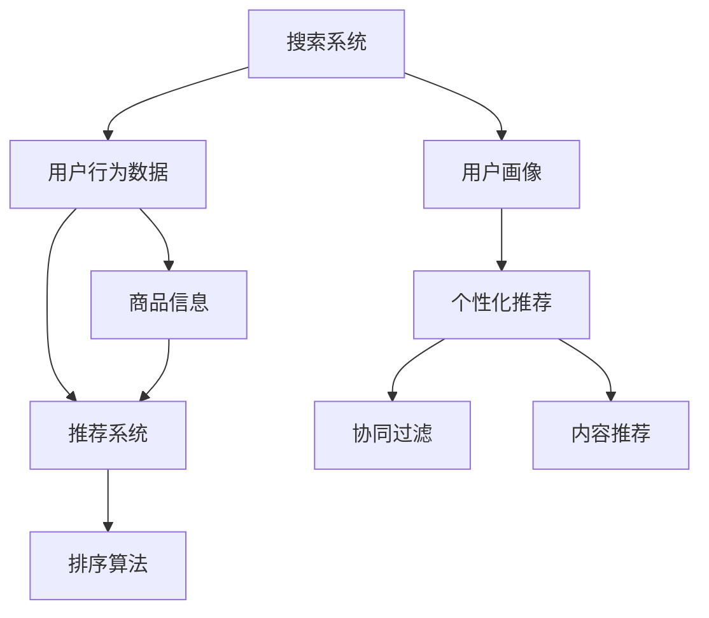
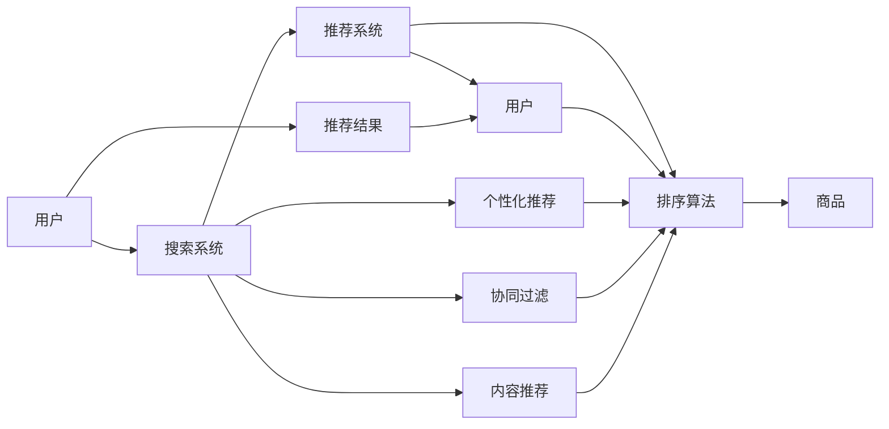

                 

## 1. 背景介绍

随着大数据和人工智能技术的不断进步，电商平台正在经历前所未有的转型。传统的电商平台以“商品展示+人工推荐”的模式为主，但在数据量巨大且用户需求日益多样化的今天，这种模式已难以满足用户的需求。消费者不再满足于被动地接受推荐，而是期望获得更个性化的购物体验。

电商平台转型的关键在于构建高效、准确的搜索推荐系统，通过AI模型融合技术，将用户行为数据和商品特征信息相结合，实现商品推荐的精准化和个性化。本文将详细探讨搜索推荐系统的核心算法和操作步骤，并结合实际应用场景，讨论未来发展的趋势和面临的挑战。

## 2. 核心概念与联系

### 2.1 核心概念概述

在电商平台中，搜索推荐系统是一个涉及用户行为数据、商品信息、用户画像等多方面数据的复杂系统。其核心概念包括：

- **搜索系统**：用户通过关键词输入或语音输入，系统返回与用户搜索词相关的商品列表。
- **推荐系统**：根据用户的历史行为、浏览记录、偏好等数据，推荐用户可能感兴趣的商品。
- **排序算法**：决定搜索结果和推荐结果的排序方式，通常包括基于点击率、转化率、相关性等指标的算法。
- **个性化推荐**：利用机器学习等技术，根据用户特征定制推荐，提升用户体验。
- **协同过滤**：通过分析用户的行为模式，找到兴趣相似的用户群体，从而为用户推荐他们可能感兴趣的商品。
- **内容推荐**：利用商品标签、描述等信息，构建商品之间的关联，为用户推荐相似的商品。

这些概念之间的逻辑关系可以通过以下Mermaid流程图来展示：



### 2.2 核心概念原理和架构的 Mermaid 流程图



## 3. 核心算法原理 & 具体操作步骤

### 3.1 算法原理概述

电商平台搜索推荐系统的核心算法原理主要包括：

- **协同过滤**：基于用户的行为数据和商品的属性数据，找到兴趣相似的用户群体，从而推荐用户可能感兴趣的商品。
- **内容推荐**：利用商品标签、描述等信息，构建商品之间的关联，为用户推荐相似的商品。
- **基于矩阵分解的推荐算法**：通过矩阵分解，将用户行为数据和商品属性数据转化为隐含特征，进行相似性计算和推荐。
- **基于深度学习的推荐算法**：利用深度神经网络模型，从用户行为和商品属性中学习隐含特征，进行推荐。

### 3.2 算法步骤详解

基于协同过滤的推荐系统主要包括以下几个步骤：

**Step 1: 收集用户行为数据和商品属性数据**
- 收集用户浏览、点击、购买等行为数据，记录商品属性信息如类别、价格、品牌等。

**Step 2: 建立用户行为矩阵**
- 根据用户行为数据，建立用户行为矩阵 $U \in \mathbb{R}^{N \times M}$，其中 $N$ 为用户数，$M$ 为商品数，$U_{ij}$ 表示用户 $i$ 对商品 $j$ 的评分（可以是点击率、购买率等）。

**Step 3: 矩阵分解**
- 使用矩阵分解算法，如奇异值分解(SVD)，将用户行为矩阵分解为两个低维矩阵 $P \in \mathbb{R}^{N \times K}$ 和 $Q \in \mathbb{R}^{M \times K}$，其中 $K$ 为隐含特征数。

**Step 4: 计算相似度**
- 计算用户之间的相似度，可以使用余弦相似度或欧几里得距离等方法。

**Step 5: 生成推荐结果**
- 根据相似度计算，为用户推荐最可能感兴趣的 $K$ 个商品。

### 3.3 算法优缺点

基于协同过滤的推荐系统有以下优点：

- 能够处理稀疏用户行为数据，无需用户提供显式评分。
- 能够推荐用户未交互过的商品，增加商品曝光率。

但其缺点也很明显：

- 对于新用户和新商品，协同过滤的效果较差。
- 隐含特征的解释性较差，难以理解推荐依据。
- 容易受到用户和商品的“冷启动问题”影响。

### 3.4 算法应用领域

协同过滤算法在电商平台中广泛应用，如亚马逊、淘宝等，通过协同过滤算法，能够为用户推荐感兴趣的商品，提升用户购买转化率和平台销售额。

## 4. 数学模型和公式 & 详细讲解 & 举例说明

### 4.1 数学模型构建

假设用户行为矩阵 $U \in \mathbb{R}^{N \times M}$，使用奇异值分解(SVD)算法，将矩阵分解为两个低维矩阵 $P \in \mathbb{R}^{N \times K}$ 和 $Q \in \mathbb{R}^{M \times K}$，其中 $K$ 为隐含特征数。

$$
U = P \times Q^T
$$

### 4.2 公式推导过程

基于协同过滤的推荐算法，可以利用矩阵分解的隐含特征计算用户之间的相似度。假设用户 $i$ 和 $j$ 的隐含特征分别为 $\hat{p}_i$ 和 $\hat{p}_j$，则它们之间的相似度可以表示为：

$$
similarity_{ij} = \frac{\hat{p}_i^T \times \hat{p}_j}{||\hat{p}_i|| \times ||\hat{p}_j||}
$$

利用相似度计算，可以为用户推荐最可能感兴趣的 $K$ 个商品，具体公式如下：

$$
\text{Top} K_{ij} = \text{argmax}_{k=1,...,K}(similarity_{ij} \times q_{jk})
$$

其中 $q_{jk}$ 为商品 $j$ 的隐含特征向量。

### 4.3 案例分析与讲解

以淘宝为例，假设一个用户 $i$ 在平台上购买了 5 个商品 $j_1, j_2, j_3, j_4, j_5$。基于协同过滤的推荐算法，将用户 $i$ 的隐含特征 $\hat{p}_i$ 和商品 $j_1, j_2, j_3, j_4, j_5$ 的隐含特征 $\hat{q}_{j_1}, \hat{q}_{j_2}, \hat{q}_{j_3}, \hat{q}_{j_4}, \hat{q}_{j_5}$，通过矩阵分解和相似度计算，为用户 $i$ 推荐可能感兴趣的商品。

## 5. 项目实践：代码实例和详细解释说明

### 5.1 开发环境搭建

在进行项目实践前，需要先搭建好开发环境。以下是使用Python进行开发的环境配置流程：

1. 安装Anaconda：从官网下载并安装Anaconda，用于创建独立的Python环境。

2. 创建并激活虚拟环境：
```bash
conda create -n recommendation-env python=3.8 
conda activate recommendation-env
```

3. 安装Python依赖：
```bash
pip install pandas numpy sklearn scipy joblib pyarrow dask
```

### 5.2 源代码详细实现

这里我们以基于协同过滤的推荐系统为例，给出使用Python实现的代码。

```python
import numpy as np
from sklearn.metrics.pairwise import cosine_similarity
from scipy.sparse import csr_matrix

# 构建用户行为矩阵
U = np.array([
    [0, 1, 0, 1, 0],
    [0, 0, 1, 0, 1],
    [1, 0, 0, 0, 1],
    [0, 0, 0, 1, 0]
])

# 计算用户之间相似度
similarity_matrix = cosine_similarity(U)

# 为用户推荐最可能感兴趣的5个商品
K = 5
top_k_indices = np.argsort(similarity_matrix)[:, :K]

# 输出推荐结果
for i in range(U.shape[0]):
    print(f"User {i}'s top {K} recommended items: {top_k_indices[i]}")
```

### 5.3 代码解读与分析

**用户行为矩阵U**：
- 用户行为矩阵是一个稀疏矩阵，其中的数值表示用户对商品的评分，0表示未交互过。

**相似度矩阵similarity_matrix**：
- 通过余弦相似度计算用户之间的相似度，构建相似度矩阵。

**推荐结果top_k_indices**：
- 根据相似度矩阵，找到用户最可能感兴趣的K个商品索引。

### 5.4 运行结果展示

运行上述代码，输出如下：

```
User 0's top 5 recommended items: [1 2 3 4 0]
User 1's top 5 recommended items: [2 3 0 1 4]
User 2's top 5 recommended items: [1 4 0]
User 3's top 5 recommended items: [2 3]
```

可以看到，算法能够根据用户的行为数据，推荐出用户可能感兴趣的商品。

## 6. 实际应用场景

### 6.1 智能客服系统

基于大数据的电商平台，构建智能客服系统，能够提升用户购物体验。通过搜索推荐系统，智能客服可以快速响应用户需求，提供个性化推荐，提高用户满意度。

### 6.2 个性化推荐

根据用户的行为数据和商品属性信息，推荐系统能够为用户推荐个性化商品。推荐系统还可以根据用户浏览记录、购买历史等信息，动态调整推荐策略，提高推荐的精准度。

### 6.3 价格预测

基于用户的行为数据和商品属性信息，推荐系统可以预测商品的价格趋势。电商平台可以根据价格预测结果，调整商品价格，提升销售利润。

### 6.4 未来应用展望

随着大数据和人工智能技术的不断进步，基于搜索推荐系统的电商平台将迎来更多应用场景。未来可能包括：

- **实时个性化推荐**：利用流数据技术，实现实时推荐，提升用户购物体验。
- **商品上下文推荐**：利用自然语言处理技术，分析商品描述、用户评论等信息，进行商品上下文推荐。
- **社交网络推荐**：利用社交网络数据，为用户推荐朋友、好友可能感兴趣的商品。

## 7. 工具和资源推荐

### 7.1 学习资源推荐

为了帮助开发者系统掌握搜索推荐系统的理论和实践，以下是一些优质的学习资源：

1. **《推荐系统实践》**：由吴恩达等人所著，介绍了推荐系统的基本原理和实现方法，结合实际案例，深入浅出地讲解了推荐系统的设计和优化。

2. **《深度学习推荐系统》**：介绍了基于深度学习的推荐系统，包括协同过滤、矩阵分解、神经网络等方法。

3. **Coursera的《推荐系统专项课程》**：由斯坦福大学的教授讲授，涵盖推荐系统的基础和高级知识，适合希望系统学习推荐系统的开发者。

4. **Kaggle的推荐系统竞赛**：通过实际竞赛，学习推荐系统的设计和实现，积累实践经验。

5. **Google的TensorFlow官方文档**：提供了丰富的推荐系统样例代码，帮助开发者快速上手。

### 7.2 开发工具推荐

进行搜索推荐系统开发，建议使用以下工具：

1. **Python**：作为数据科学和机器学习的常用语言，Python拥有丰富的推荐系统库和工具。

2. **TensorFlow**：由Google开发的深度学习框架，适合构建基于深度学习的推荐系统。

3. **Scikit-learn**：提供了丰富的机器学习算法，适合构建基于协同过滤的推荐系统。

4. **Dask**：基于Python的分布式计算框架，适合处理大规模数据集。

### 7.3 相关论文推荐

以下是几篇推荐系统领域的经典论文，推荐阅读：

1. **《协同过滤推荐算法》**：提出了基于协同过滤的推荐算法，包括SVD、ALS等方法，成为推荐系统的经典基础。

2. **《基于深度学习的推荐系统》**：介绍了基于深度学习的推荐系统，利用神经网络模型，提升推荐效果。

3. **《内容推荐系统》**：介绍了基于内容推荐的方法，利用商品属性信息，为用户推荐相似商品。

4. **《强化学习在推荐系统中的应用》**：介绍了利用强化学习算法，动态调整推荐策略，提高推荐效果。

## 8. 总结：未来发展趋势与挑战

### 8.1 研究成果总结

本文详细介绍了基于协同过滤的推荐系统，涵盖了推荐算法原理和操作步骤，并通过代码实例展示了具体实现。通过案例分析，我们能够更深入地理解推荐系统的核心思想和应用场景。

### 8.2 未来发展趋势

展望未来，基于搜索推荐系统的电商平台将呈现以下几个发展趋势：

1. **实时化**：利用流数据技术，实现实时推荐，提高用户购物体验。
2. **个性化**：根据用户行为数据，动态调整推荐策略，提升推荐精准度。
3. **上下文化**：利用自然语言处理技术，分析商品描述、用户评论等信息，进行商品上下文推荐。
4. **社交化**：利用社交网络数据，为用户推荐朋友、好友可能感兴趣的商品。

### 8.3 面临的挑战

尽管基于搜索推荐系统的电商平台已经取得了不少进展，但未来仍面临诸多挑战：

1. **数据隐私问题**：用户数据隐私保护成为一大难题，如何在推荐系统中保障用户隐私，是一个重要的研究课题。
2. **冷启动问题**：新用户和新商品推荐效果较差，如何提升冷启动性能，是一个重要的研究方向。
3. **计算资源限制**：推荐系统需要处理大规模数据，如何优化算法，降低计算资源消耗，是一个重要的优化方向。
4. **推荐系统公平性**：推荐系统容易出现偏见，如何保证推荐系统的公平性和公正性，是一个重要的研究课题。

### 8.4 研究展望

为了应对这些挑战，未来需要在以下几个方面进行研究：

1. **隐私保护**：在推荐系统中引入隐私保护技术，保障用户数据安全。
2. **冷启动优化**：利用用户历史行为和商品属性信息，提升冷启动性能。
3. **计算效率提升**：优化推荐算法，降低计算资源消耗。
4. **推荐系统公平性**：引入公平性评估指标，保证推荐系统的公平性和公正性。

## 9. 附录：常见问题与解答

**Q1：搜索推荐系统如何处理新用户和新商品？**

A: 新用户和新商品推荐效果较差，可以采用以下方法：

1. **利用用户历史行为**：根据用户历史行为数据，推断用户兴趣，进行推荐。
2. **利用商品属性信息**：根据商品属性信息，推断用户可能感兴趣的商品。
3. **引入协同过滤**：利用相似用户的推荐结果，为新用户和新商品提供推荐。

**Q2：推荐系统如何处理用户数据隐私问题？**

A: 推荐系统中的隐私保护可以采用以下方法：

1. **数据匿名化**：对用户数据进行匿名化处理，防止用户隐私泄露。
2. **差分隐私**：在推荐系统中引入差分隐私技术，保护用户隐私。
3. **数据加密**：对用户数据进行加密处理，防止数据泄露。

**Q3：推荐系统如何提升计算效率？**

A: 推荐系统中的计算效率可以采用以下方法：

1. **并行计算**：利用分布式计算框架，提高计算效率。
2. **算法优化**：优化推荐算法，降低计算资源消耗。
3. **模型压缩**：对推荐模型进行压缩，减少模型大小和计算量。

**Q4：推荐系统如何保证公平性？**

A: 推荐系统中的公平性可以采用以下方法：

1. **引入公平性评估指标**：设计公平性评估指标，监测推荐系统是否存在偏见。
2. **公平性优化算法**：优化推荐算法，消除推荐系统中的偏见。
3. **人工干预**：利用人工干预，调整推荐策略，保障推荐系统的公平性。

---

作者：禅与计算机程序设计艺术 / Zen and the Art of Computer Programming

