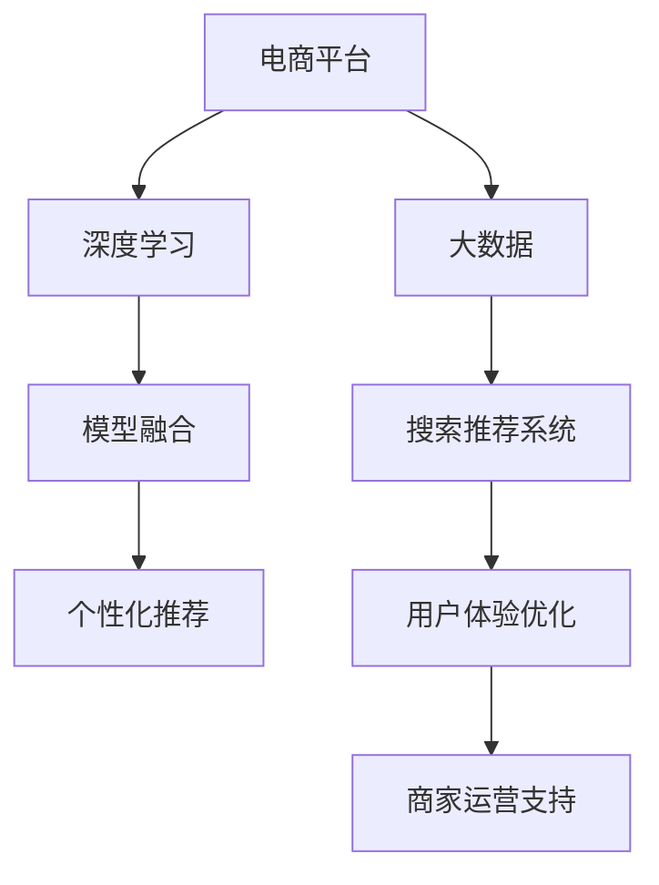

                 

# 大数据驱动的电商平台转型：搜索推荐系统是核心，AI 模型融合是关键

> 关键词：大数据, 电商, 搜索推荐系统, 深度学习, 人工智能, 模型融合

## 1. 背景介绍

### 1.1 问题由来

在当今数字化、智能化的时代，电商平台已成为连接消费者与商家、商家与商品的重要桥梁。随着用户需求的日益复杂化和个性化，传统的电商平台已无法满足用户的多样化需求，用户体验和商家满意度不断下降。为了更好地服务用户，提升电商平台的核心竞争力，转型升级已迫在眉睫。

为了提升电商平台的用户体验和商家运营效率，必须借助先进的技术手段，特别是大数据驱动的搜索推荐系统。搜索推荐系统能够根据用户的历史行为和偏好，提供个性化、精准的商品推荐，优化购物体验，提升销售转化率。同时，通过分析海量数据，挖掘用户行为和市场趋势，可帮助商家进行库存管理和促销策略制定，实现更精准的运营决策。

### 1.2 问题核心关键点

要构建一个高效、精准、实时的搜索推荐系统，需要考虑以下核心关键点：

- **大数据处理与分析**：海量用户数据和商品数据的收集、存储、分析和应用。
- **深度学习与模型融合**：使用深度学习模型捕捉用户行为和商品特征，实现高质量的推荐。
- **算法优化与性能提升**：通过算法优化和模型训练，提升搜索推荐系统的响应速度和精准度。
- **用户体验优化**：确保推荐结果符合用户心理预期，提升用户的购物体验。
- **商家运营支持**：帮助商家进行智能决策，提升运营效率和销售转化率。

### 1.3 问题研究意义

构建基于大数据驱动的搜索推荐系统，具有重要意义：

1. **提升用户体验**：个性化推荐能够满足用户多样化、个性化需求，提升用户购物体验，提高用户满意度和忠诚度。
2. **优化商家运营**：精准的市场分析、库存管理和促销策略，帮助商家优化库存结构、降低运营成本，提升销售转化率。
3. **推动电商发展**：通过技术手段提升电商平台的竞争力，促进电商行业健康、可持续发展。
4. **数据驱动决策**：充分利用大数据，帮助企业进行科学决策，规避市场风险，抓住市场机遇。

## 2. 核心概念与联系

### 2.1 核心概念概述

为更好地理解大数据驱动的电商平台搜索推荐系统，本节将介绍几个密切相关的核心概念：

- **电商平台**：指通过互联网提供商品或服务交易的平台，如淘宝、京东、亚马逊等。
- **搜索推荐系统**：通过分析用户行为和商品特征，实时提供个性化、精准的商品推荐，提升用户购物体验的系统。
- **深度学习**：利用多层次的神经网络结构，对数据进行非线性建模和特征学习，提取高层次的抽象特征。
- **模型融合**：通过组合多个模型，发挥各自优势，提升整体性能的技术。
- **大数据**：指海量的数据集合，通过对数据的有效处理和分析，获取有价值的知识。

这些核心概念之间的逻辑关系可以通过以下Mermaid流程图来展示：



这个流程图展示了大数据驱动的电商平台搜索推荐系统的核心概念及其之间的关系：

1. 电商平台通过大数据获取用户和商品信息。
2. 利用深度学习对用户行为和商品特征进行建模。
3. 通过模型融合提升推荐系统的精度和响应速度。
4. 实时提供个性化推荐，优化用户体验。
5. 支持商家运营决策，提升运营效率。

## 3. 核心算法原理 & 具体操作步骤

### 3.1 算法原理概述

基于大数据驱动的电商平台搜索推荐系统，其核心思想是通过深度学习模型，对用户行为和商品特征进行建模，实现个性化、精准的商品推荐。主要算法包括：

- **协同过滤算法**：通过分析用户历史行为和相似用户的行为，推荐相似商品。
- **基于内容的推荐算法**：根据商品的属性和特征，推荐用户可能感兴趣的商品。
- **混合推荐算法**：将协同过滤和基于内容的推荐算法进行组合，发挥各自优势，提升推荐效果。
- **深度学习推荐算法**：使用深度神经网络，对用户行为和商品特征进行建模，推荐相似商品。

### 3.2 算法步骤详解

基于大数据驱动的电商平台搜索推荐系统，通常包括以下关键步骤：

**Step 1: 数据收集与预处理**
- 收集电商平台的交易数据、用户行为数据、商品属性数据等，构建数据仓库。
- 对数据进行清洗、归一化、分词等预处理，构建训练数据集。

**Step 2: 深度学习模型构建**
- 选择合适的深度学习模型，如卷积神经网络(CNN)、循环神经网络(RNN)、长短期记忆网络(LSTM)等。
- 设计模型的输入层、隐藏层和输出层，定义损失函数和优化器。

**Step 3: 模型训练与评估**
- 将数据集分为训练集和测试集，使用训练集训练模型，优化模型参数。
- 在测试集上评估模型效果，使用指标如精确度、召回率、F1值等进行评价。
- 根据评估结果，调整模型参数或选择更合适的算法。

**Step 4: 推荐系统集成**
- 将训练好的模型集成到推荐系统中，实时处理用户请求。
- 根据用户历史行为、商品属性等特征，输出推荐结果。

**Step 5: 用户体验优化**
- 实时监控推荐效果，收集用户反馈，优化推荐算法和模型。
- 利用A/B测试等方法，不断改进推荐系统，提升用户体验。

**Step 6: 商家运营支持**
- 提供市场分析报告，帮助商家优化商品结构和促销策略。
- 实时监控商品库存，提供库存预警和补货建议。

### 3.3 算法优缺点

基于大数据驱动的电商平台搜索推荐系统，具有以下优点：

1. **个性化推荐**：通过深度学习模型，实现精准、个性化的商品推荐，提升用户购物体验。
2. **数据驱动决策**：利用大数据分析，提供科学的运营决策支持，提升运营效率。
3. **实时响应**：通过实时处理用户请求，提供快速响应，提升用户满意度。
4. **易于扩展**：可以根据业务需求，快速扩展模型和算法，适应新场景。

同时，该系统也存在一些局限性：

1. **数据隐私问题**：收集和处理用户数据可能涉及隐私问题，需要严格遵守数据保护法规。
2. **模型复杂度高**：深度学习模型通常需要大量计算资源，训练和推理成本较高。
3. **冷启动问题**：新用户或新商品没有足够的历史数据，导致推荐效果不佳。
4. **模型泛化能力不足**：模型可能对新的数据或场景适应性较差。
5. **过拟合风险**：模型参数过多，容易导致过拟合，影响推荐效果。

尽管存在这些局限性，但就目前而言，基于大数据驱动的搜索推荐系统仍是大电商平台的核心技术之一，具有显著的竞争优势。

### 3.4 算法应用领域

基于大数据驱动的搜索推荐系统，在电商、金融、旅游等多个领域都得到了广泛应用，如：

- **电商行业**：淘宝、京东、亚马逊等电商平台，通过推荐系统提升用户购物体验，优化商家运营。
- **金融行业**：银行、保险公司等金融机构，通过推荐系统进行精准理财、风险控制。
- **旅游行业**：携程、去哪儿等旅游平台，通过推荐系统提升用户出行体验，优化服务。
- **新闻媒体**：今日头条、新浪等媒体平台，通过推荐系统提供个性化新闻推荐，提升用户粘性。
- **社交媒体**：微信、微博等社交平台，通过推荐系统优化用户内容消费体验，提升平台活跃度。

## 4. 数学模型和公式 & 详细讲解 & 举例说明（备注：数学公式请使用latex格式，latex嵌入文中独立段落使用 $$，段落内使用 $)
### 4.1 数学模型构建

假设电商平台有 $M$ 个商品，$U$ 个用户，用户对商品的评分数据为 $R_{iu} \in [0, 5]$。定义深度学习模型 $f_{\theta}(\cdot)$，其输入为 $x_i$，输出为 $y_i$，其中 $x_i$ 表示商品 $i$ 的属性特征向量，$y_i$ 表示用户 $u$ 对商品 $i$ 的评分。

模型的输入层为 $x_i$，隐藏层为 $h_{\theta}(x_i)$，输出层为 $y_i$，其数学模型可以表示为：

$$
y_i = f_{\theta}(x_i)
$$

其中，$f_{\theta}(\cdot)$ 为深度学习模型，$\theta$ 为模型参数。

### 4.2 公式推导过程

设模型的损失函数为 $\mathcal{L}(\theta)$，通常使用均方误差损失，则：

$$
\mathcal{L}(\theta) = \frac{1}{N}\sum_{i=1}^N \frac{1}{m}\sum_{u=1}^m (y_{iu} - f_{\theta}(x_i))^2
$$

其中 $N$ 为样本数量，$m$ 为用户数量。

模型的梯度更新公式为：

$$
\theta \leftarrow \theta - \eta \nabla_{\theta} \mathcal{L}(\theta)
$$

其中 $\eta$ 为学习率。

以一个简单的三层神经网络为例，假设输入层 $x_i$ 有 $d$ 个特征，隐藏层 $h_{\theta}(x_i)$ 有 $n$ 个神经元，输出层 $y_i$ 为 $m$ 维向量，则模型可以表示为：

$$
h_{\theta}(x_i) = \sigma(W_2 h_{\theta}(x_i) + b_2)
$$

$$
y_i = \sigma(W_3 h_{\theta}(x_i) + b_3)
$$

其中 $W_2, b_2, W_3, b_3$ 为模型参数，$\sigma$ 为激活函数。

### 4.3 案例分析与讲解

以下以协同过滤算法为例，进行详细讲解。

协同过滤算法包括用户-物品协同过滤和物品-物品协同过滤两种方法。其中，用户-物品协同过滤算法通过分析用户历史行为和相似用户的行为，推荐相似商品。具体实现步骤如下：

**Step 1: 数据预处理**
- 收集用户历史行为数据 $R_{iu}$，构建用户-商品评分矩阵。
- 对评分矩阵进行归一化，使其值在 $[0, 1]$ 之间。

**Step 2: 计算相似度**
- 计算用户 $u$ 和用户 $u'$ 的相似度 $sim(u,u')$，可以使用余弦相似度或皮尔逊相关系数。
- 计算商品 $i$ 和商品 $i'$ 的相似度 $sim(i,i')$，可以使用余弦相似度或皮尔逊相关系数。

**Step 3: 推荐商品**
- 对每个用户 $u$，根据其历史评分和相似用户的评分，计算出相似商品的评分，得到推荐商品列表。
- 对每个商品 $i$，根据其历史评分和相似商品的评分，计算出相似用户的评分，得到推荐用户列表。

## 5. 项目实践：代码实例和详细解释说明

### 5.1 开发环境搭建

在进行搜索推荐系统开发前，我们需要准备好开发环境。以下是使用Python进行TensorFlow开发的环境配置流程：

1. 安装Anaconda：从官网下载并安装Anaconda，用于创建独立的Python环境。

2. 创建并激活虚拟环境：
```bash
conda create -n tf-env python=3.8 
conda activate tf-env
```

3. 安装TensorFlow：根据CUDA版本，从官网获取对应的安装命令。例如：
```bash
conda install tensorflow tensorflow-gpu -c conda-forge -c pypi
```

4. 安装各类工具包：
```bash
pip install numpy pandas scikit-learn matplotlib tqdm jupyter notebook ipython
```

完成上述步骤后，即可在`tf-env`环境中开始搜索推荐系统开发。

### 5.2 源代码详细实现

下面我们以协同过滤算法为例，给出使用TensorFlow对推荐系统进行开发的PyTorch代码实现。

首先，定义协同过滤算法的函数：

```python
import tensorflow as tf
import numpy as np

def collaborative_filtering(train_data, user_num, item_num, embedding_dim, num_epochs):
    # 构建用户-商品评分矩阵
    R = train_data.copy()
    R = (R - R.min()) / (R.max() - R.min())

    # 构建用户-商品嵌入矩阵
    user_embedding = tf.Variable(tf.random.normal([user_num, embedding_dim]))
    item_embedding = tf.Variable(tf.random.normal([item_num, embedding_dim]))

    # 定义损失函数
    loss = tf.keras.losses.MeanSquaredError()

    # 定义优化器
    optimizer = tf.keras.optimizers.Adam()

    # 定义模型函数
    def model_fn(x):
        x = tf.reshape(x, [1, -1])
        return tf.matmul(x, user_embedding) + tf.matmul(x, item_embedding)

    # 定义评估函数
    def evaluate_fn(x):
        x = tf.reshape(x, [1, -1])
        return tf.matmul(x, user_embedding) + tf.matmul(x, item_embedding)

    # 训练模型
    for epoch in range(num_epochs):
        for i in range(len(train_data)):
            x = train_data[i, :]
            y = R[i, :]
            with tf.GradientTape() as tape:
                y_pred = model_fn(x)
                loss_value = loss(y_pred, y)
            grads = tape.gradient(loss_value, [user_embedding, item_embedding])
            optimizer.apply_gradients(zip(grads, [user_embedding, item_embedding]))

    # 推荐商品
    user_idx = 0
    item_idx = 0
    for i in range(user_num):
        x = train_data[i, :]
        y_pred = model_fn(x)
        y_pred = y_pred.numpy()
        recommendations = np.argsort(y_pred)[-10:]
        print(f"User {i+1} recommendations: {item_idx + recommendations}")
```

然后，定义协同过滤算法的训练数据集：

```python
# 定义训练数据集
train_data = np.array([[1, 2, 3, 4, 5],
                      [2, 3, 4, 5, 6],
                      [3, 4, 5, 6, 7],
                      [4, 5, 6, 7, 8],
                      [5, 6, 7, 8, 9]])

# 用户数和商品数
user_num = 5
item_num = 5

# 嵌入维度
embedding_dim = 5

# 训练轮数
num_epochs = 50

# 调用协同过滤算法
collaborative_filtering(train_data, user_num, item_num, embedding_dim, num_epochs)
```

以上就是使用TensorFlow对协同过滤算法进行开发的完整代码实现。可以看到，TensorFlow提供了简单易用的API，可以轻松搭建推荐系统模型，并进行训练和评估。

### 5.3 代码解读与分析

让我们再详细解读一下关键代码的实现细节：

**Collaborative Filtering函数**：
- `train_data`参数：训练数据集，每个样本包含用户和商品的评分数据。
- `user_num`和`item_num`参数：用户数和商品数。
- `embedding_dim`参数：用户和商品的嵌入维度。
- `num_epochs`参数：训练轮数。
- 首先，将评分矩阵进行归一化处理。
- 定义用户和商品的嵌入矩阵。
- 定义损失函数和优化器。
- 定义模型函数和评估函数。
- 在每个epoch内，遍历训练数据集，计算模型预测值与真实值的损失，并使用优化器更新模型参数。
- 在训练结束后，对每个用户推荐商品列表。

**协同过滤算法代码**：
- `user_idx`和`item_idx`变量：用于追踪当前用户和商品。
- 对于每个用户，计算模型预测值，并按预测值降序排列，取出推荐商品列表。
- 打印推荐商品列表。

## 6. 实际应用场景

### 6.1 智能推荐系统

智能推荐系统是大数据驱动的电商平台搜索推荐系统的重要应用场景。通过智能推荐系统，电商平台能够根据用户的历史行为和偏好，提供个性化、精准的商品推荐，提升用户购物体验，提高销售转化率。

在技术实现上，可以收集用户浏览、点击、购买等行为数据，提取和商品相关的特征，如价格、品牌、类别等，进行深度学习建模，实时生成个性化推荐列表。智能推荐系统还可以利用用户画像、群体行为分析等，进一步提升推荐效果。

### 6.2 营销活动优化

营销活动是大数据驱动的电商平台搜索推荐系统的重要应用场景。电商平台可以根据用户的兴趣爱好、购买历史等数据，精准投放广告，提升营销活动效果。

在技术实现上，可以构建用户画像，将用户分成不同的细分群体，针对不同群体制定不同的营销策略，提高广告投放效果。还可以利用实时数据监测和分析，及时调整营销策略，优化广告投放效果。

### 6.3 库存管理

库存管理是大数据驱动的电商平台搜索推荐系统的重要应用场景。电商平台可以通过智能推荐系统，优化商品库存结构，降低库存成本，提升销售转化率。

在技术实现上，可以构建库存预测模型，根据销售数据和推荐数据，预测商品的未来需求，优化库存结构。还可以利用推荐数据，实时监控商品库存，提供库存预警和补货建议。

### 6.4 未来应用展望

随着大数据驱动的电商平台搜索推荐系统的不断发展，未来将在更多领域得到应用，为传统行业带来变革性影响。

在智慧城市治理中，搜索推荐系统可应用于城市事件监测、舆情分析、应急指挥等环节，提高城市管理的自动化和智能化水平，构建更安全、高效的未来城市。

在智能交通系统中，推荐系统可应用于交通流量预测、路线规划、车辆调度等，优化交通资源配置，提升交通效率。

在智能医疗领域，推荐系统可应用于疾病诊断、治疗方案推荐、药物推荐等，提升医疗服务的智能化水平，辅助医生诊疗，加速新药研发。

除此之外，在教育、金融、旅游等多个领域，基于大数据驱动的搜索推荐系统也将不断涌现，为各行各业带来新的技术突破和应用创新。相信随着技术的日益成熟，搜索推荐系统必将在更广阔的应用领域大放异彩。

## 7. 工具和资源推荐
### 7.1 学习资源推荐

为了帮助开发者系统掌握大数据驱动的电商平台搜索推荐技术，这里推荐一些优质的学习资源：

1. 《深度学习》系列课程：斯坦福大学、吴恩达等知名学者推出的深度学习课程，涵盖深度学习的基础理论和实践技能。

2. TensorFlow官方文档：TensorFlow的官方文档，提供了丰富的API文档和代码示例，是学习TensorFlow的重要资料。

3. PyTorch官方文档：PyTorch的官方文档，提供了简单易用的API和代码示例，是学习深度学习的优秀资料。

4. 《深度学习框架TensorFlow和PyTorch》书籍：详细介绍TensorFlow和PyTorch的原理、实践和应用，适合入门和进阶学习。

5. Kaggle数据集：Kaggle平台提供了大量高质量的NLP数据集，可用于模型训练和评估，是实践深度学习的理想场所。

通过对这些资源的学习实践，相信你一定能够快速掌握大数据驱动的电商平台搜索推荐技术，并用于解决实际的NLP问题。
### 7.2 开发工具推荐

高效的开发离不开优秀的工具支持。以下是几款用于大数据驱动的电商平台搜索推荐系统开发的常用工具：

1. TensorFlow：由Google主导开发的开源深度学习框架，生产部署方便，适合大规模工程应用。

2. PyTorch：由Facebook主导开发的开源深度学习框架，灵活性高，适合快速迭代研究。

3. Scikit-learn：Python机器学习库，提供了丰富的机器学习算法和数据处理工具，适合模型训练和评估。

4. Pandas：Python数据处理库，提供了高效的数据读写、清洗和分析工具，适合大数据处理。

5. Numpy：Python数学计算库，提供了高效的矩阵计算和线性代数工具，适合数学建模和模型训练。

合理利用这些工具，可以显著提升大数据驱动的电商平台搜索推荐系统的开发效率，加快创新迭代的步伐。

### 7.3 相关论文推荐

大数据驱动的电商平台搜索推荐技术的发展源于学界的持续研究。以下是几篇奠基性的相关论文，推荐阅读：

1. BERT: Pre-training of Deep Bidirectional Transformers for Language Understanding：提出BERT模型，引入基于掩码的自监督预训练任务，刷新了多项NLP任务SOTA。

2. Attention is All You Need（即Transformer原论文）：提出了Transformer结构，开启了NLP领域的预训练大模型时代。

3. Deep Learning for Recommender Systems：系统介绍了深度学习在推荐系统中的应用，提出了多种深度学习推荐算法。

4. Generative Adversarial Nets：提出生成对抗网络（GAN），可用于生成假数据和训练模型，提升推荐系统效果。

5. TensorFlow Recommenders：介绍了TensorFlow Recommenders库，提供了多种推荐算法和模型训练接口，适合大规模推荐系统开发。

这些论文代表了大数据驱动的电商平台搜索推荐技术的发展脉络。通过学习这些前沿成果，可以帮助研究者把握学科前进方向，激发更多的创新灵感。

## 8. 总结：未来发展趋势与挑战

### 8.1 总结

本文对大数据驱动的电商平台搜索推荐系统进行了全面系统的介绍。首先阐述了搜索推荐系统在大电商平台转型中的重要地位和核心技术点，明确了推荐系统在提升用户体验、优化商家运营、推动电商平台发展方面的独特价值。其次，从原理到实践，详细讲解了深度学习模型和算法优化的方法，给出了搜索推荐系统开发的完整代码实例。同时，本文还广泛探讨了搜索推荐系统在智能推荐、营销活动优化、库存管理等领域的实际应用，展示了搜索推荐系统的广泛应用前景。此外，本文精选了推荐系统的各类学习资源，力求为读者提供全方位的技术指引。

通过本文的系统梳理，可以看到，大数据驱动的电商平台搜索推荐系统正成为电商平台的核心技术之一，极大地提升了用户的购物体验和商家的运营效率，推动了电商行业的健康、可持续发展。未来，伴随深度学习、大数据、人工智能等技术的不断演进，搜索推荐系统将进一步优化算法、提升性能、拓展应用，带来更多的业务价值。

### 8.2 未来发展趋势

展望未来，大数据驱动的电商平台搜索推荐系统将呈现以下几个发展趋势：

1. **智能化水平提升**：深度学习模型和算法不断优化，推荐系统将更加智能化，能够实时处理海量数据，实现实时推荐和动态调整。

2. **个性化程度加深**：利用大数据和人工智能技术，推荐系统将更好地理解用户需求，提供更加精准、个性化的推荐结果。

3. **跨领域融合**：推荐系统将与其他智能技术，如知识图谱、因果推理、强化学习等进行深度融合，实现更加全面、可靠的应用。

4. **数据安全保护**：在数据收集和处理过程中，将更加注重用户隐私和数据安全，构建安全、可信的推荐系统。

5. **模型可解释性增强**：推荐系统的决策过程将更加透明、可解释，用户可以更好地理解推荐结果，提升系统信任度。

6. **技术标准化**：推荐系统的开发和应用将逐步走向标准化，构建开放、协作、共享的技术生态。

这些趋势凸显了大数据驱动的电商平台搜索推荐系统的广阔前景。这些方向的探索发展，必将进一步提升推荐系统的性能和应用范围，为电商平台带来更多的业务价值。

### 8.3 面临的挑战

尽管大数据驱动的电商平台搜索推荐系统已经取得了显著成效，但在迈向更加智能化、普适化应用的过程中，仍面临诸多挑战：

1. **数据质量问题**：推荐系统依赖于高质量的数据，数据的真实性、完整性、一致性等质量问题可能导致推荐效果不佳。

2. **计算资源消耗高**：深度学习模型通常需要大量计算资源，训练和推理成本较高，如何降低计算资源消耗是未来研究的重点。

3. **算法复杂度高**：推荐系统的算法复杂度较高，如何优化算法，提升推荐效果，是未来研究的难点。

4. **模型泛化能力不足**：推荐系统可能对新的数据或场景适应性较差，如何提升模型的泛化能力，是未来研究的挑战。

5. **隐私保护问题**：推荐系统涉及用户隐私，如何保护用户数据隐私，构建安全、可信的推荐系统，是未来研究的重要课题。

6. **模型可解释性问题**：推荐系统的决策过程不够透明，用户难以理解推荐结果，如何增强模型的可解释性，提升用户信任度，是未来研究的重点。

7. **跨领域融合难度大**：推荐系统与其他智能技术融合难度较大，如何构建跨领域的智能推荐系统，是未来研究的难点。

这些挑战需要研究者不断探索和突破，才能构建高效、精准、可靠的大数据驱动的电商平台搜索推荐系统，推动电商平台的智能化转型。

### 8.4 研究展望

面对大数据驱动的电商平台搜索推荐系统所面临的挑战，未来的研究需要在以下几个方面寻求新的突破：

1. **数据质量提升**：构建数据清洗、验证、标注等工具和流程，提升数据质量，确保推荐系统的准确性和可靠性。

2. **计算资源优化**：研究高效的模型压缩、稀疏化存储等技术，降低计算资源消耗，实现轻量化部署。

3. **算法优化与创新**：研究更加高效、简洁的算法模型，提升推荐效果，降低算法复杂度。

4. **跨领域融合探索**：研究推荐系统与其他智能技术的融合方法，实现跨领域的智能推荐。

5. **数据隐私保护**：研究隐私保护技术，如差分隐私、联邦学习等，保护用户数据隐私，构建安全、可信的推荐系统。

6. **模型可解释性增强**：研究推荐系统的可解释性方法，如可视化、解释性模型等，提升用户信任度。

7. **数据标准化与共享**：研究推荐系统数据标准化与共享方法，构建开放、协作、共享的技术生态。

这些研究方向将推动大数据驱动的电商平台搜索推荐系统的不断进步，为电商平台带来更多业务价值，促进电商行业的健康、可持续发展。

## 9. 附录：常见问题与解答

**Q1：大数据驱动的电商平台搜索推荐系统如何降低计算资源消耗？**

A: 为了降低大数据驱动的电商平台搜索推荐系统的计算资源消耗，可以采取以下措施：

1. **模型压缩**：采用模型压缩技术，如剪枝、量化、蒸馏等，减小模型参数量和计算量，提高计算效率。

2. **稀疏化存储**：使用稀疏矩阵存储数据，减少数据存储量，降低存储成本。

3. **混合精度训练**：使用混合精度训练，如16位浮点数代替32位浮点数，提升计算效率。

4. **模型并行优化**：使用模型并行技术，如数据并行、模型并行、混合并行等，提高训练和推理效率。

5. **算法优化**：优化推荐算法，如使用近似算法、贪心算法等，减少计算量。

6. **硬件加速**：使用GPU、TPU等高性能硬件设备，加速模型训练和推理。

通过以上措施，可以有效降低大数据驱动的电商平台搜索推荐系统的计算资源消耗，实现高效、低成本的部署。

**Q2：如何提升大数据驱动的电商平台搜索推荐系统的推荐效果？**

A: 为了提升大数据驱动的电商平台搜索推荐系统的推荐效果，可以采取以下措施：

1. **数据质量提升**：收集高质量的训练数据，确保数据真实、完整、一致。

2. **算法优化**：优化推荐算法，如使用深度学习算法、协同过滤算法、混合推荐算法等，提升推荐效果。

3. **模型融合**：将多种推荐模型进行融合，发挥各自优势，提升推荐效果。

4. **用户画像构建**：构建详细的用户画像，将用户分成不同的细分群体，制定个性化的推荐策略。

5. **实时数据处理**：实时处理用户行为数据，动态调整推荐策略，提升推荐效果。

6. **个性化推荐**：利用用户行为数据和商品属性数据，提供个性化的推荐结果。

7. **多模态融合**：结合文本、图像、音频等多模态数据，提升推荐效果。

通过以上措施，可以显著提升大数据驱动的电商平台搜索推荐系统的推荐效果，满足用户多样化、个性化的需求，提升用户购物体验。

**Q3：大数据驱动的电商平台搜索推荐系统如何处理冷启动问题？**

A: 大数据驱动的电商平台搜索推荐系统处理冷启动问题，可以采取以下措施：

1. **用户画像构建**：收集新用户的兴趣数据，构建详细的用户画像，根据用户画像进行推荐。

2. **商品画像构建**：收集新商品的特征数据，构建详细的商品画像，根据商品画像进行推荐。

3. **相似用户推荐**：根据新用户的相似用户的行为数据，推荐相似用户的兴趣商品。

4. **热门商品推荐**：根据热门商品的特征数据，推荐热门商品。

5. **混合推荐算法**：使用混合推荐算法，结合协同过滤和基于内容的推荐方法，提升推荐效果。

6. **个性化推荐**：利用用户行为数据和商品属性数据，提供个性化的推荐结果。

通过以上措施，可以有效地处理大数据驱动的电商平台搜索推荐系统的冷启动问题，确保新用户和商品的推荐效果。

**Q4：大数据驱动的电商平台搜索推荐系统如何提升模型的泛化能力？**

A: 为了提升大数据驱动的电商平台搜索推荐系统的模型泛化能力，可以采取以下措施：

1. **数据多样化**：收集多样化的数据，确保模型能够处理不同场景和不同用户群体。

2. **模型多样性**：使用多种模型进行融合，确保模型具有较强的泛化能力。

3. **算法优化**：优化算法，如使用深度学习算法、协同过滤算法、混合推荐算法等，提升模型的泛化能力。

4. **数据增强**：使用数据增强技术，如数据扩充、数据增强等，提升模型的泛化能力。

5. **跨领域融合**：结合知识图谱、因果推理、强化学习等技术，提升模型的泛化能力。

6. **模型验证**：在多个数据集上验证模型，确保模型具有良好的泛化能力。

通过以上措施，可以显著提升大数据驱动的电商平台搜索推荐系统的模型泛化能力，确保模型在新的数据和场景中表现良好。

**Q5：大数据驱动的电商平台搜索推荐系统如何提升模型的可解释性？**

A: 为了提升大数据驱动的电商平台搜索推荐系统的模型可解释性，可以采取以下措施：

1. **可视化方法**：使用可视化方法，如热力图、分布图、树状图等，展示模型的预测结果和决策过程，提升模型的可解释性。

2. **解释性模型**：使用解释性模型，如LIME、SHAP等，解释模型的决策过程，提升模型的可解释性。

3. **特征重要性分析**：分析特征的重要性，展示影响推荐结果的关键特征，提升模型的可解释性。

4. **用户反馈机制**：建立用户反馈机制，收集用户的反馈意见，调整模型参数，提升模型的可解释性。

5. **模型透明性**：保持模型的透明性，确保模型决策过程公开透明，提升模型的可解释性。

通过以上措施，可以显著提升大数据驱动的电商平台搜索推荐系统的模型可解释性，确保用户理解和信任推荐结果。

**Q6：大数据驱动的电商平台搜索推荐系统如何处理数据隐私问题？**

A: 为了处理大数据驱动的电商平台搜索推荐系统的数据隐私问题，可以采取以下措施：

1. **数据加密**：对用户数据进行加密，保护用户隐私。

2. **差分隐私**：使用差分隐私技术，对用户数据进行扰动，保护用户隐私。

3. **联邦学习**：使用联邦学习技术，在本地设备上进行模型训练，保护用户数据隐私。

4. **数据匿名化**：对用户数据进行匿名化处理，保护用户隐私。

5. **隐私保护算法**：使用隐私保护算法，如隐私敏感学习、安全多方计算等，保护用户数据隐私。

6. **用户授权机制**：建立用户授权机制，确保用户数据使用透明、合法。

通过以上措施，可以有效地处理大数据驱动的电商平台搜索推荐系统的数据隐私问题，确保用户数据安全和隐私保护。

---

作者：禅与计算机程序设计艺术 / Zen and the Art of Computer Programming

