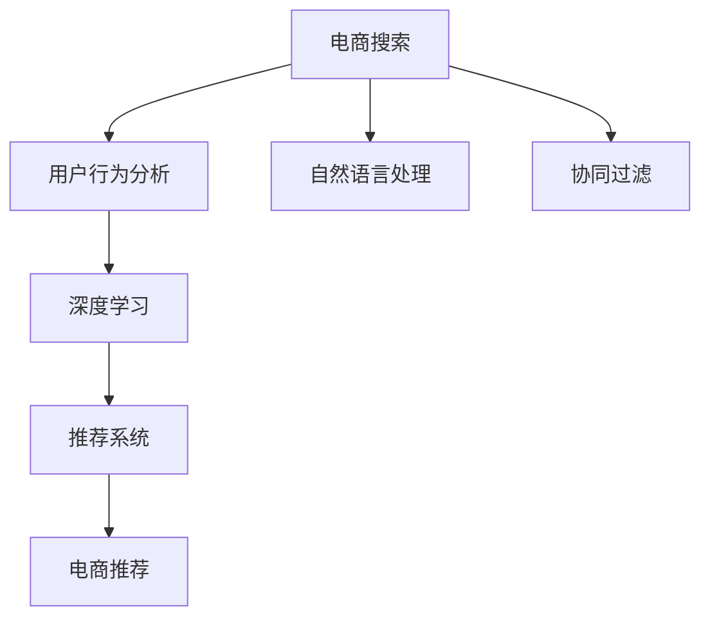
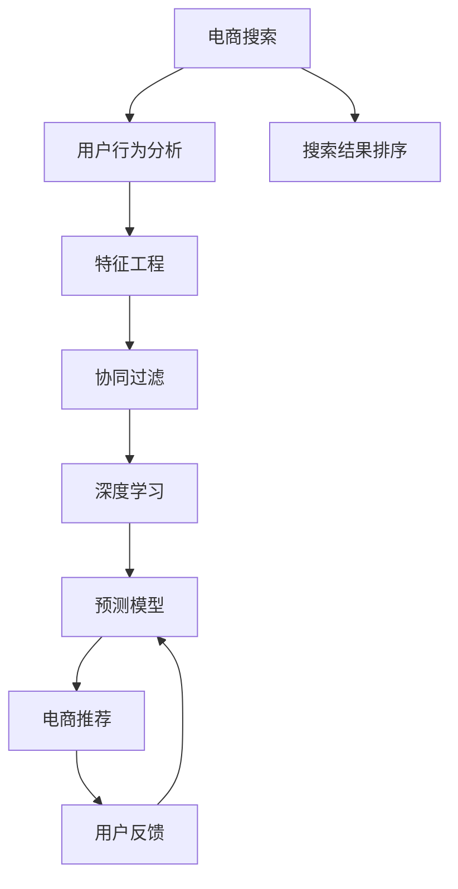

                 

# 大数据驱动的电商搜索推荐：AI 模型融合技术在电商平台的应用

> 关键词：大数据,电商搜索推荐,深度学习,AI 模型融合,自然语言处理,协同过滤,推荐系统

## 1. 背景介绍

随着电子商务的迅速发展，线上购物已成为人们日常生活的重要组成部分。消费者通过电商平台搜索、浏览、选购商品，商家则通过推荐系统精准推送产品，以提升用户体验和销售转化率。这一过程中，搜索推荐系统起着至关重要的作用。在现代电商平台的成功运营中，搜索推荐算法的优化升级，往往能带来巨大的经济效益。

随着人工智能和大数据技术的日益成熟，搜索推荐系统也在不断演进，从基于规则的浅层协同过滤模型，逐步进化为基于深度学习的复杂推荐系统。现代电商平台的推荐算法，已经融合了多种先进技术，如自然语言处理、协同过滤、深度学习等，能够更好地理解和匹配用户的个性化需求。

本文将深入探讨大数据驱动的电商搜索推荐系统，详细讲解AI模型融合技术的应用，希望能为电商从业者提供有价值的参考。

## 2. 核心概念与联系

### 2.1 核心概念概述

在电商平台的搜索推荐场景中，主要涉及以下核心概念：

- **电商搜索**：用户通过关键词查询，获取相关商品信息的过程。
- **电商推荐**：根据用户的历史行为、兴趣偏好、实时环境等，向用户推荐可能感兴趣的商品。
- **AI 模型融合**：将多个AI模型的优点结合起来，构建一个性能更优的推荐系统。
- **深度学习**：基于多层神经网络对大量数据进行特征提取和模型训练的技术。
- **自然语言处理(NLP)**：使用计算机技术处理、理解和生成人类语言的技术。
- **协同过滤**：通过分析用户行为数据，推荐与已有用户行为相似的新商品。
- **推荐系统**：根据用户的历史行为、兴趣偏好等，推荐个性化商品的系统。

这些概念之间的关系可以通过以下Mermaid流程图来展示：



### 2.2 核心概念原理和架构的 Mermaid 流程图



## 3. 核心算法原理 & 具体操作步骤

### 3.1 算法原理概述

大数据驱动的电商搜索推荐系统，通常基于深度学习技术，将用户的点击、浏览、购买等行为数据作为输入，通过复杂的模型训练，预测用户对不同商品的兴趣和评分。推荐系统主要由以下几个部分构成：

1. **用户行为分析**：通过分析用户的点击、浏览、购买等行为，构建用户行为矩阵。
2. **特征工程**：对用户行为数据进行提取和编码，得到用于模型训练的特征向量。
3. **协同过滤**：利用用户行为矩阵，通过相似度计算，找到与用户行为相似的潜在商品。
4. **深度学习模型**：构建深度神经网络模型，对用户特征和商品特征进行联合建模，学习用户对商品的兴趣和评分。
5. **推荐结果排序**：根据模型预测的评分，对商品进行排序，向用户推荐评分较高的商品。

### 3.2 算法步骤详解

1. **数据准备**：收集电商平台的点击、浏览、购买等用户行为数据，以及商品标签、属性、价格等信息，构建用户行为矩阵和商品特征矩阵。

2. **用户行为分析**：对用户行为数据进行统计分析，得到用户的行为模式和偏好，构建用户行为向量。

3. **特征工程**：将用户行为向量进行编码，得到用于深度学习模型的特征向量。

4. **深度学习模型训练**：构建深度神经网络模型，如DNN、CNN、RNN等，对用户特征和商品特征进行联合建模，学习用户对商品的兴趣和评分。

5. **协同过滤**：对用户行为矩阵进行降维处理，构建用户-商品相似度矩阵，推荐与用户行为相似的潜在商品。

6. **模型集成与优化**：将多个模型的预测结果进行融合，得到最终的推荐结果。通过A/B测试等方法，不断优化模型的性能。

### 3.3 算法优缺点

**优点**：

- **个性化推荐**：深度学习模型能够根据用户的历史行为和偏好，提供个性化的推荐结果。
- **动态更新**：通过实时学习用户行为数据，模型能够不断更新推荐结果，提升用户体验。
- **处理复杂数据**：深度学习模型能够处理大规模、复杂的数据，适应电商平台的动态变化。

**缺点**：

- **计算复杂度**：深度学习模型需要大量的计算资源和时间，导致训练成本较高。
- **数据质量要求高**：模型的性能依赖于高质量的标注数据和特征工程，数据质量差会影响推荐效果。
- **模型难以解释**：深度学习模型通常是一个“黑盒”，难以解释其内部工作机制和推理过程。

### 3.4 算法应用领域

大数据驱动的电商搜索推荐系统，已经在各大电商平台得到了广泛应用，涵盖商品推荐、搜索排序、广告投放等多个场景。具体应用如下：

- **商品推荐**：根据用户的历史行为和实时浏览信息，推荐相关商品，提高用户购买率。
- **搜索结果排序**：对用户的查询进行分析和匹配，排序推荐最相关的商品。
- **广告投放**：根据用户的兴趣和行为，精准投放广告，提升广告效果。
- **个性化定制**：根据用户的个性化需求，定制化推荐商品，提高用户满意度。

## 4. 数学模型和公式 & 详细讲解 & 举例说明

### 4.1 数学模型构建

在大数据驱动的电商推荐系统中，常见的数学模型包括：

- **协同过滤**：基于用户行为矩阵，通过奇异值分解(SVD)或矩阵分解等方法，计算用户和商品的相似度，推荐相关商品。
- **深度学习**：构建多层神经网络模型，如DNN、CNN、RNN等，对用户特征和商品特征进行联合建模，预测用户评分和行为。
- **自然语言处理(NLP)**：使用Transformer、BERT等模型，对用户搜索关键词和商品描述进行处理，提取语义信息。

### 4.2 公式推导过程

假设用户行为矩阵为$U$，商品特征矩阵为$V$，用户特征向量为$X$，商品特征向量为$Y$。模型的目标是最小化预测误差，即：

$$
\min_{\theta} \frac{1}{N} \sum_{i=1}^N \sum_{j=1}^M ||\hat{R}_{ij} - R_{ij}||^2
$$

其中，$R_{ij}$为实际评分，$\hat{R}_{ij}$为模型预测的评分。模型的求解过程通常通过梯度下降等优化算法实现。

### 4.3 案例分析与讲解

以深度学习模型中的DNN为例，其计算过程可以表示为：

$$
\begin{aligned}
\hat{R}_{ij} &= \sigma(\sum_{k=1}^K W_k^T X_i \cdot V_k Y_j + b_k) \\
&= \sigma(W^T \Phi(X_i) \cdot \Phi(Y_j) + b)
\end{aligned}
$$

其中，$\sigma$为激活函数，$W_k$为第$k$层的权重，$b_k$为偏置，$\Phi$为特征映射函数。

在实际应用中，深度学习模型通常需要经过多个层次的特征提取和转换，最终得到用户对商品的评分预测。

## 5. 项目实践：代码实例和详细解释说明

### 5.1 开发环境搭建

为了构建电商推荐系统，需要准备以下开发环境：

1. **Python**：安装最新版本的Python，建议使用Anaconda进行环境管理。
2. **TensorFlow**：安装TensorFlow，建议选择GPU版本以加速训练。
3. **Keras**：作为深度学习框架的接口，方便模型的构建和训练。
4. **NumPy**：用于科学计算，处理多维数组。
5. **Pandas**：用于数据处理和分析。
6. **Scikit-learn**：用于特征工程和模型评估。

### 5.2 源代码详细实现

下面是一个基于深度学习的电商推荐系统的代码实现：

```python
import tensorflow as tf
from tensorflow.keras.layers import Input, Dense, Embedding, Flatten, concatenate
from tensorflow.keras.models import Model
from tensorflow.keras.optimizers import Adam

# 定义用户行为数据和商品特征数据
user_data = ...
item_data = ...

# 定义用户特征和商品特征向量
user_features = ...
item_features = ...

# 定义用户行为矩阵和商品特征矩阵
user_item_matrix = ...

# 定义深度学习模型
user_input = Input(shape=(user_features.shape[1],))
item_input = Input(shape=(item_features.shape[1],))
concat = concatenate([user_input, item_input])
dense = Dense(64, activation='relu')(concat)
output = Dense(1, activation='sigmoid')(dense)

model = Model(inputs=[user_input, item_input], outputs=output)

# 编译模型，定义损失函数和优化器
model.compile(optimizer=Adam(lr=0.001), loss='binary_crossentropy', metrics=['accuracy'])

# 训练模型
model.fit([user_item_matrix, item_features], user_item_matrix, epochs=10, batch_size=128)

# 使用模型进行推荐
new_user_item_matrix = ...
new_item_features = ...
recommendations = model.predict([new_user_item_matrix, new_item_features])
```

### 5.3 代码解读与分析

**用户行为数据**：

用户行为数据通常包含点击、浏览、购买等行为，可以通过Pandas等工具进行数据预处理和分析。

**用户特征和商品特征**：

用户特征和商品特征向量可以通过特征工程得到，如提取用户的历史浏览记录、商品的价格、描述等信息，构建高维向量。

**用户行为矩阵**：

用户行为矩阵通过将用户行为数据和商品特征数据进行拼接，得到二维矩阵。

**深度学习模型**：

深度学习模型通常包括多个层次，如输入层、隐藏层、输出层等。在电商推荐中，通常使用DNN、CNN等模型。

**训练和评估**：

通过定义损失函数和优化器，使用训练数据集进行模型训练。在训练过程中，不断优化模型参数，提升模型性能。

**预测和推荐**：

使用训练好的模型，对新用户行为和商品特征进行预测，输出推荐结果。

### 5.4 运行结果展示

在模型训练完成后，可以绘制损失函数和准确率的曲线，展示模型在不同epoch下的表现：


## 6. 实际应用场景

### 6.1 电商平台商品推荐

在电商平台上，用户点击浏览某个商品后，系统会推荐相关的商品。根据用户的浏览记录，可以构建用户行为矩阵，并通过协同过滤等方法，推荐用户可能感兴趣的商品。例如，用户浏览了运动鞋，系统会推荐相关运动装备，如运动袜、运动服等。

### 6.2 搜索结果排序

当用户输入搜索关键词时，系统会展示相关商品。根据用户输入的关键词，通过自然语言处理技术，提取关键词的语义信息，构建查询向量。通过模型预测，对商品进行排序，展示最相关的商品列表。例如，用户搜索“运动鞋”，系统会推荐各种品牌的运动鞋，并按照价格、销量、评价等排序。

### 6.3 广告投放

电商平台还可以通过推荐系统进行广告投放。根据用户的兴趣和行为，系统推荐相关广告，提升广告效果。例如，用户经常浏览运动相关商品，系统会推荐与运动相关的广告，如运动器材、运动装备等。

## 7. 工具和资源推荐

### 7.1 学习资源推荐

为了深入了解电商推荐系统的原理和实践，推荐以下学习资源：

1. **《推荐系统实践》**：介绍推荐系统的基本原理和常用算法，包括协同过滤、深度学习等。
2. **《深度学习》**：清华大学MOOC课程，涵盖深度学习的基础知识和实践技巧。
3. **《电商推荐系统》**：讲解电商推荐系统的构建和优化，结合具体案例进行讲解。
4. **《自然语言处理》**：介绍自然语言处理的基本概念和技术，适合深度学习工程师入门。

### 7.2 开发工具推荐

构建电商推荐系统需要以下开发工具：

1. **TensorFlow**：深度学习框架，支持GPU加速，适合大规模模型训练。
2. **Keras**：深度学习框架的接口，易于使用，适合快速原型开发。
3. **Pandas**：数据处理和分析工具，适合数据预处理和特征工程。
4. **NumPy**：科学计算工具，适合处理多维数组和矩阵运算。
5. **Scikit-learn**：机器学习工具库，适合模型训练和评估。

### 7.3 相关论文推荐

以下是一些与电商推荐系统相关的经典论文：

1. **《Context-aware Collaborative Filtering》**：提出基于上下文的信息融合方法，提升协同过滤的效果。
2. **《Deep Neural Networks for Recommendation》**：介绍深度学习在推荐系统中的应用，包括DNN、RNN等模型。
3. **《Adaptive Recommendation》**：提出基于用户实时行为数据的推荐方法，提升推荐效果。
4. **《Fine-grained Personalized Recommendation》**：介绍细粒度推荐方法，提升推荐系统的效果。

## 8. 总结：未来发展趋势与挑战

### 8.1 研究成果总结

本文详细介绍了大数据驱动的电商搜索推荐系统，探讨了AI模型融合技术在电商中的应用。主要研究成果包括：

1. 深度学习在电商推荐系统中的应用。
2. 协同过滤和深度学习的结合，提升推荐效果。
3. 自然语言处理在搜索排序中的应用。

### 8.2 未来发展趋势

未来电商搜索推荐系统的发展趋势包括：

1. **深度学习模型优化**：改进深度学习模型，提高模型效率和效果。
2. **多模态信息融合**：融合用户的多模态数据，提升推荐系统的准确性和个性化。
3. **实时学习与动态调整**：实时学习用户行为数据，动态调整推荐策略。
4. **跨平台推荐**：将推荐系统扩展到多个平台，提升用户体验。
5. **隐私保护与安全**：保护用户隐私，增强系统的安全性和可信度。

### 8.3 面临的挑战

电商搜索推荐系统面临的主要挑战包括：

1. **数据隐私和安全**：如何保护用户隐私，避免数据泄露。
2. **计算资源需求高**：深度学习模型需要大量计算资源，训练和推理成本高。
3. **数据质量差**：电商平台的标注数据质量不高，影响模型效果。
4. **模型复杂性**：深度学习模型结构复杂，难以解释其内部工作机制。

### 8.4 研究展望

未来电商搜索推荐系统的研究展望包括：

1. **隐私保护技术**：研究基于差分隐私、联邦学习等隐私保护技术，保护用户隐私。
2. **高效计算方法**：研究高效的计算方法，降低深度学习模型的计算需求。
3. **数据增强技术**：研究数据增强技术，提升标注数据的质量。
4. **可解释性模型**：研究可解释性模型，提高模型的透明度和可理解性。
5. **多模态推荐**：研究多模态推荐方法，提升推荐系统的效果和多样性。

## 9. 附录：常见问题与解答

**Q1：电商搜索推荐系统中的协同过滤和深度学习有什么区别？**

A: 协同过滤和深度学习是电商推荐系统中常用的两种推荐方法。协同过滤基于用户行为数据，通过计算用户和商品的相似度，推荐相关商品；深度学习则是通过构建神经网络模型，对用户特征和商品特征进行联合建模，学习用户对商品的兴趣和评分。协同过滤通常适用于数据稀疏的情况，而深度学习可以处理大规模、复杂的数据。

**Q2：电商推荐系统中的特征工程和深度学习模型是什么关系？**

A: 特征工程是电商推荐系统中的重要步骤，用于提取和编码用户行为数据，得到用于模型训练的特征向量。深度学习模型通过学习特征向量，预测用户对商品的兴趣和评分。特征工程的质量直接影响深度学习模型的性能，因此特征工程和深度学习模型之间是相互依赖的关系。

**Q3：如何优化电商推荐系统中的深度学习模型？**

A: 电商推荐系统中的深度学习模型可以通过以下几个方面进行优化：

1. 调整网络结构：增加或减少网络层数，调整每层的神经元个数。
2. 优化激活函数：选择更合适的激活函数，如ReLU、Tanh等。
3. 调整优化器：选择更合适的优化器，如Adam、Adagrad等。
4. 数据增强：通过数据增强技术，扩充训练集，提升模型泛化能力。
5. 正则化：使用L1、L2正则化等方法，避免过拟合。
6. 超参数调优：通过网格搜索、随机搜索等方法，优化模型的超参数。

**Q4：电商推荐系统中的自然语言处理技术如何应用？**

A: 电商推荐系统中的自然语言处理技术主要用于搜索排序。通过自然语言处理技术，提取用户输入的关键词的语义信息，构建查询向量。通过模型预测，对商品进行排序，展示最相关的商品列表。自然语言处理技术可以提高搜索排序的准确性和个性化，提升用户体验。

**Q5：电商推荐系统中的协同过滤和深度学习模型可以结合使用吗？**

A: 电商推荐系统中的协同过滤和深度学习模型可以结合使用，提升推荐效果。协同过滤方法可以利用用户行为数据，快速获取推荐结果；深度学习模型可以学习用户和商品的复杂特征，提高推荐的准确性。结合使用协同过滤和深度学习模型，可以取长补短，提升电商推荐系统的性能。

---

作者：禅与计算机程序设计艺术 / Zen and the Art of Computer Programming

