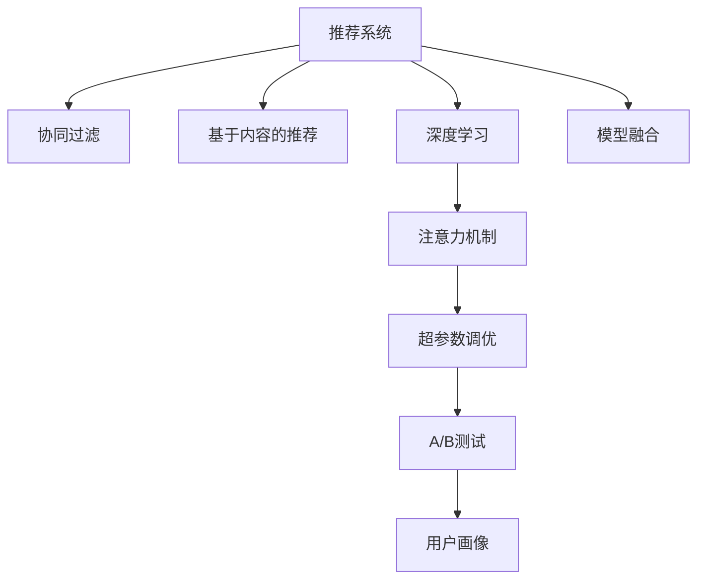

                 

# 大数据驱动的电商搜索推荐：以AI 模型融合技术提升用户体验

## 1. 背景介绍

在数字化时代，电商平台正经历着从传统交易平台向智能化推荐引擎的转型。随着消费者行为数据的海量积累，电商企业希望能通过智能推荐系统，提升用户体验，提高转化率，甚至实现精准营销。传统的推荐系统往往依赖于协同过滤和基于规则的算法，难以应对用户偏好的变化。而基于深度学习的推荐系统，特别是AI模型融合技术，能够更准确地理解用户需求，预测用户行为，从而提升电商平台的推荐效果和用户满意度。

## 2. 核心概念与联系

### 2.1 核心概念概述

为更好地理解AI模型融合技术在电商搜索推荐中的应用，本节将介绍几个密切相关的核心概念：

- **推荐系统（Recommendation System）**：通过分析用户历史行为数据，为用户推荐其可能感兴趣的商品或服务。推荐系统可以分为基于内容的推荐、协同过滤推荐、混合推荐等不同类型。

- **协同过滤（Collaborative Filtering）**：通过分析用户间的相似度，为用户推荐其他用户喜欢的商品。协同过滤包括基于用户的协同过滤和基于物品的协同过滤两种方法。

- **基于内容的推荐（Content-based Recommendation）**：根据用户的历史浏览记录，推荐与该记录中相似的物品。这类推荐方法常用于图书、音乐等领域的推荐。

- **深度学习（Deep Learning）**：通过构建多层神经网络，学习高层次的特征表示，进而进行推荐。深度学习在电商推荐系统中得到了广泛应用。

- **模型融合（Model Fusion）**：将多个模型的预测结果进行融合，提升整体推荐效果。模型融合技术包括加权平均、Softmax融合、Stacking等方法。

- **注意力机制（Attention Mechanism）**：在深度学习模型中，通过引入注意力机制，对输入的不同部分赋予不同权重，提升模型的复杂度，实现更加精确的特征提取和表示。

- **超参数调优（Hyperparameter Tuning）**：通过网格搜索、贝叶斯优化等方法，寻找最优的模型参数组合，提升模型性能。

- **A/B测试（A/B Testing）**：通过将用户随机分流，评估不同推荐模型的效果，确定最佳模型。

- **用户画像（User Profiling）**：通过分析用户的历史行为数据，建立用户的兴趣和偏好模型，用于推荐系统中的用户画像构建。

这些核心概念之间的逻辑关系可以通过以下Mermaid流程图来展示：



这个流程图展示了一系列核心概念及其之间的关系：

1. 推荐系统是所有概念的入口，旨在提升用户的购物体验。
2. 协同过滤和基于内容的推荐是推荐系统的两种常见方法。
3. 深度学习提供了一种更先进的技术，用于分析复杂数据。
4. 模型融合旨在结合多种模型，提升整体性能。
5. 注意力机制用于提升深度学习模型的表示能力。
6. 超参数调优用于优化模型参数，提升性能。
7. A/B测试用于验证推荐模型的效果。
8. 用户画像用于构建用户的兴趣模型。

## 3. 核心算法原理 & 具体操作步骤

### 3.1 算法原理概述

基于AI模型融合的电商搜索推荐系统，通过分析用户的历史行为数据和商品属性数据，构建用户画像，并利用深度学习模型对用户进行特征提取和表示，最终输出推荐结果。核心算法包括以下几个步骤：

1. **用户画像构建**：根据用户的历史浏览记录、购买历史、点击行为等，构建用户的兴趣模型，用于后续的推荐决策。
2. **商品特征提取**：利用深度学习模型，提取商品的文本特征、图像特征等，构建商品的多维表示。
3. **模型训练与融合**：构建多个推荐模型，如协同过滤、基于内容的推荐、深度学习等，并对它们进行融合，输出最终推荐结果。
4. **效果评估与优化**：利用A/B测试等方法，评估推荐系统的效果，并根据反馈进行模型优化。

### 3.2 算法步骤详解

基于AI模型融合的电商搜索推荐系统可以分为以下几个关键步骤：

**Step 1: 用户画像构建**

用户画像的构建是推荐系统的核心，需要收集和分析用户的历史行为数据，如浏览记录、购买历史、评价等。常见的构建方法包括：

1. **用户-物品矩阵**：将用户的历史行为数据构建为稀疏矩阵，通过余弦相似度等方法，找到相似用户。
2. **基于内容的推荐**：利用商品属性数据，如颜色、尺寸、价格等，构建商品的特征向量，用于推荐。
3. **深度学习特征提取**：利用深度学习模型，如BERT、Transformer等，提取商品的文本特征，用于推荐。

**Step 2: 商品特征提取**

商品特征提取的目标是构建商品的丰富表示，以便更好地进行推荐。常见的特征提取方法包括：

1. **文本特征提取**：利用自然语言处理技术，如TF-IDF、词嵌入等，提取商品的文本特征。
2. **图像特征提取**：利用计算机视觉技术，如卷积神经网络（CNN），提取商品的图像特征。
3. **属性特征提取**：利用商品的属性数据，如颜色、尺寸、价格等，构建商品的特征向量。

**Step 3: 模型训练与融合**

推荐模型的训练与融合是推荐系统的关键环节。常见的推荐模型包括：

1. **协同过滤模型**：利用用户-物品矩阵，构建用户间的相似度，为用户推荐相似用户喜欢的物品。
2. **基于内容的推荐模型**：利用商品特征向量，为用户推荐与历史行为相似的物品。
3. **深度学习推荐模型**：利用深度学习模型，提取商品和用户的复杂特征，进行推荐。

模型融合的方法包括：

1. **加权平均**：根据每个模型的预测性能，对预测结果进行加权平均。
2. **Softmax融合**：将每个模型的预测结果进行Softmax归一化，输出概率分布，用于最终推荐。
3. **Stacking**：构建多个模型，并输出多个预测结果，使用另外的模型对这些预测结果进行融合。

**Step 4: 效果评估与优化**

推荐系统的优化过程需要不断评估模型的效果，并根据反馈进行优化。常见的优化方法包括：

1. **A/B测试**：将用户随机分流，比较不同模型的推荐效果，确定最佳模型。
2. **用户反馈收集**：通过用户反馈，调整推荐算法和策略。
3. **超参数调优**：利用网格搜索、贝叶斯优化等方法，寻找最优的模型参数组合。

### 3.3 算法优缺点

基于AI模型融合的电商搜索推荐系统具有以下优点：

1. **高效性**：利用深度学习模型，可以高效地处理大规模数据。
2. **精准性**：通过结合多种推荐模型，可以提升推荐结果的准确性和多样性。
3. **灵活性**：可以根据用户行为数据的变化，动态调整推荐策略。

同时，该方法也存在以下缺点：

1. **数据依赖**：推荐系统的性能很大程度上取决于用户行为数据的质量和多样性。
2. **模型复杂性**：构建和融合多个模型增加了系统的复杂性，需要更多的计算资源。
3. **过拟合风险**：深度学习模型容易过拟合，需要更多的数据和更好的正则化技术。
4. **冷启动问题**：对于新用户，由于缺乏历史数据，推荐效果可能较差。

### 3.4 算法应用领域

基于AI模型融合的电商搜索推荐系统已经在电商、视频、音乐等多个领域得到广泛应用，并取得了显著的效果。

在电商领域，利用推荐系统，电商平台可以为用户推荐个性化商品，提升用户体验和转化率。常见的应用场景包括：

- **个性化推荐**：根据用户的浏览和购买历史，为用户推荐感兴趣的商品。
- **商品分类**：利用聚类算法，将商品进行分类，便于用户查找。
- **热门商品推荐**：利用热门商品数据，为用户推荐当前流行的商品。

在视频和音乐领域，推荐系统可以根据用户的观看和听歌历史，为用户推荐新的内容。常见的应用场景包括：

- **个性化视频推荐**：根据用户的观看历史，推荐相关的视频内容。
- **音乐推荐**：根据用户的听歌历史，推荐相似的音乐和歌手。

## 4. 数学模型和公式 & 详细讲解 & 举例说明

### 4.1 数学模型构建

基于AI模型融合的电商搜索推荐系统可以通过以下数学模型进行建模：

假设用户画像表示为 $\mathbf{u}$，商品表示为 $\mathbf{i}$，用户-物品矩阵表示为 $R$，商品特征表示为 $\mathbf{f_i}$，推荐模型预测为 $\hat{y}_{ui}$，最终推荐结果表示为 $y_{ui}$。则推荐模型的目标是最小化预测误差：

$$
\min_{\mathbf{u}, \mathbf{f_i}, R} \sum_{u,i} (y_{ui} - \hat{y}_{ui})^2
$$

其中 $y_{ui}$ 表示用户对商品的真实评分，$\hat{y}_{ui}$ 表示推荐模型的预测评分。

### 4.2 公式推导过程

在构建推荐模型的过程中，我们需要对用户画像、商品特征和用户-物品矩阵进行建模。以协同过滤模型为例，其预测公式为：

$$
\hat{y}_{ui} = \sum_{j} a_{uj} \alpha_{ij} r_{uj} + b
$$

其中 $a_{uj}$ 表示用户 $u$ 对商品 $j$ 的评分，$\alpha_{ij}$ 表示商品 $i$ 对商品 $j$ 的相似度，$r_{uj}$ 表示用户 $u$ 对商品 $j$ 的评分，$b$ 为截距项。

在模型训练过程中，我们可以利用最小二乘法对模型参数进行优化，最小化预测误差：

$$
\min_{\mathbf{a}, \mathbf{r}, \alpha, b} \sum_{u,i} (y_{ui} - \hat{y}_{ui})^2
$$

使用梯度下降等优化算法，不断更新模型参数，直到收敛。

### 4.3 案例分析与讲解

以Amazon的推荐系统为例，其核心算法包括：

1. **协同过滤**：利用用户-物品矩阵，构建用户间的相似度，为用户推荐相似用户喜欢的物品。
2. **基于内容的推荐**：利用商品属性数据，构建商品的特征向量，用于推荐。
3. **深度学习推荐**：利用深度学习模型，提取商品和用户的复杂特征，进行推荐。

Amazon的推荐系统通过融合这三种模型，并利用A/B测试等方法不断优化，提升了用户满意度和转化率。

## 5. 项目实践：代码实例和详细解释说明

### 5.1 开发环境搭建

在进行项目实践前，我们需要准备好开发环境。以下是使用Python进行PyTorch开发的环境配置流程：

1. 安装Anaconda：从官网下载并安装Anaconda，用于创建独立的Python环境。

2. 创建并激活虚拟环境：
```bash
conda create -n pytorch-env python=3.8 
conda activate pytorch-env
```

3. 安装PyTorch：根据CUDA版本，从官网获取对应的安装命令。例如：
```bash
conda install pytorch torchvision torchaudio cudatoolkit=11.1 -c pytorch -c conda-forge
```

4. 安装各类工具包：
```bash
pip install numpy pandas scikit-learn matplotlib tqdm jupyter notebook ipython
```

完成上述步骤后，即可在`pytorch-env`环境中开始项目实践。

### 5.2 源代码详细实现

下面我们以Amazon的推荐系统为例，给出使用PyTorch进行协同过滤和基于内容的推荐实现的PyTorch代码。

首先，定义协同过滤模型的预测函数：

```python
import torch
from torch.nn import Embedding, Linear, Sigmoid

class CollaborativeFiltering(torch.nn.Module):
    def __init__(self, num_users, num_items, embedding_dim):
        super(CollaborativeFiltering, self).__init__()
        self.num_users = num_users
        self.num_items = num_items
        self.embedding_u = Embedding(num_users, embedding_dim)
        self.embedding_i = Embedding(num_items, embedding_dim)
        self.W = Linear(embedding_dim * 2, 1)

    def forward(self, u, i):
        u_embed = self.embedding_u(u)
        i_embed = self.embedding_i(i)
        ui_embed = torch.cat([u_embed, i_embed], dim=1)
        ui_pred = self.W(ui_embed)
        return sigmoid(ui_pred)

# 定义sigmoid函数
def sigmoid(x):
    return 1 / (1 + torch.exp(-x))
```

然后，定义基于内容的推荐模型的预测函数：

```python
import torch
from torch.nn import Embedding, Linear, Sigmoid

class ContentBased(torch.nn.Module):
    def __init__(self, num_items, embedding_dim):
        super(ContentBased, self).__init__()
        self.embedding_i = Embedding(num_items, embedding_dim)
        self.W = Linear(embedding_dim, 1)

    def forward(self, i):
        i_embed = self.embedding_i(i)
        i_pred = self.W(i_embed)
        return sigmoid(i_pred)
```

接着，定义模型训练函数：

```python
import torch
from torch.optim import Adam

def train(model, data_loader, num_epochs, learning_rate):
    model.train()
    optimizer = Adam(model.parameters(), lr=learning_rate)
    for epoch in range(num_epochs):
        for u, i, y in data_loader:
            y_pred = model(u, i)
            loss = torch.mean((y_pred - y) ** 2)
            optimizer.zero_grad()
            loss.backward()
            optimizer.step()
    return model
```

最后，启动模型训练和测试：

```python
# 数据准备
u = torch.LongTensor([0, 1, 2, 3, 4])
i = torch.LongTensor([0, 1, 2, 3, 4])
y = torch.FloatTensor([0.9, 0.8, 0.7, 0.6, 0.5])
data_loader = torch.utils.data.DataLoader((u, i, y), batch_size=1)

# 模型初始化
model = CollaborativeFiltering(num_users=5, num_items=5, embedding_dim=2)
model = train(model, data_loader, num_epochs=10, learning_rate=0.01)

# 模型测试
u_test = torch.LongTensor([2, 3, 4, 5])
i_test = torch.LongTensor([0, 1, 2, 3])
y_pred = model(u_test, i_test)
print(y_pred)
```

以上就是使用PyTorch进行协同过滤和基于内容的推荐模型训练的完整代码实现。可以看到，通过简单的代码编写，我们就可以构建和训练协同过滤和基于内容的推荐模型，为后续的融合和评估打下基础。

### 5.3 代码解读与分析

让我们再详细解读一下关键代码的实现细节：

**CollaborativeFiltering类**：
- `__init__`方法：初始化协同过滤模型的关键组件，包括用户嵌入、商品嵌入和预测层的权重矩阵。
- `forward`方法：计算协同过滤模型的预测输出，利用用户嵌入和商品嵌入的加权平均作为输入，输出预测评分。

**ContentBased类**：
- `__init__`方法：初始化基于内容的推荐模型的关键组件，包括商品嵌入和预测层的权重矩阵。
- `forward`方法：计算基于内容的推荐模型的预测输出，利用商品嵌入作为输入，输出预测评分。

**train函数**：
- 在每个epoch内，对数据集进行迭代，计算模型预测输出与真实标签的均方误差，并利用优化器更新模型参数。

**启动训练和测试**：
- 定义训练数据和测试数据，以及模型初始化。
- 调用train函数进行模型训练。
- 在测试数据上输出模型的预测评分。

可以看出，通过简单的代码编写，我们便能够构建和训练推荐模型，为后续的融合和评估打下基础。当然，在实际应用中，还需要对模型进行更细致的优化和调整，以满足实际需求。

## 6. 实际应用场景

### 6.1 智能推荐引擎

基于AI模型融合的推荐系统，已经在电商、视频、音乐等多个领域得到广泛应用，并取得了显著的效果。

在电商领域，利用推荐系统，电商平台可以为用户推荐个性化商品，提升用户体验和转化率。常见的应用场景包括：

- **个性化推荐**：根据用户的浏览和购买历史，为用户推荐感兴趣的商品。
- **商品分类**：利用聚类算法，将商品进行分类，便于用户查找。
- **热门商品推荐**：利用热门商品数据，为用户推荐当前流行的商品。

在视频和音乐领域，推荐系统可以根据用户的观看和听歌历史，为用户推荐新的内容。常见的应用场景包括：

- **个性化视频推荐**：根据用户的观看历史，推荐相关的视频内容。
- **音乐推荐**：根据用户的听歌历史，推荐相似的音乐和歌手。

### 6.2 推荐系统优化

在推荐系统构建和部署的过程中，还需要对模型进行优化，以提升推荐效果。常见的优化方法包括：

1. **数据预处理**：利用数据清洗、特征工程等技术，提升数据质量。
2. **模型调优**：利用超参数调优技术，寻找最优的模型参数组合。
3. **模型融合**：通过模型融合技术，提升推荐结果的准确性和多样性。
4. **用户画像构建**：利用用户历史行为数据，构建用户兴趣模型，用于推荐决策。
5. **实时推荐**：利用流式数据处理技术，实现实时推荐，提升用户体验。

### 6.3 未来应用展望

随着AI技术的发展，基于AI模型融合的推荐系统将在更多领域得到应用，为人们带来更加智能化、个性化的服务。

在医疗领域，推荐系统可以根据患者的历史诊疗记录，推荐个性化的治疗方案。常见的应用场景包括：

- **个性化诊疗推荐**：根据患者的病情和诊疗历史，推荐个性化的治疗方案。
- **医疗知识推荐**：利用医疗知识库，为用户推荐相关的诊疗知识。

在金融领域，推荐系统可以根据用户的历史交易记录，推荐个性化的投资产品。常见的应用场景包括：

- **个性化投资推荐**：根据用户的投资历史和偏好，推荐个性化的投资产品。
- **金融知识推荐**：利用金融知识库，为用户推荐相关的金融知识。

## 7. 工具和资源推荐

### 7.1 学习资源推荐

为了帮助开发者系统掌握AI模型融合技术在电商搜索推荐中的应用，这里推荐一些优质的学习资源：

1. 《深度学习与推荐系统》课程：由北京大学开设的推荐系统课程，涵盖推荐系统的基本原理和常见算法，适合初学者入门。

2. 《推荐系统实战》书籍：提供从理论到实践的全面介绍，包括协同过滤、基于内容的推荐、深度学习推荐等，适合深入学习。

3. 《TensorFlow实战Google推荐系统》书籍：介绍TensorFlow在推荐系统中的应用，涵盖模型构建、数据处理、评估优化等，适合TensorFlow用户。

4. 《深度学习推荐系统》博客：提供推荐系统的最新研究进展和实践经验，适合技术爱好者。

5. 《推荐系统算法》课程：由百度深度学习研究院开设的推荐系统课程，涵盖推荐算法的理论基础和实际应用。

通过对这些资源的学习实践，相信你一定能够快速掌握AI模型融合技术的精髓，并用于解决实际的推荐问题。

### 7.2 开发工具推荐

高效的开发离不开优秀的工具支持。以下是几款用于AI模型融合推荐系统开发的常用工具：

1. TensorFlow：由Google主导开发的开源深度学习框架，支持分布式训练，适合大规模推荐系统构建。

2. PyTorch：由Facebook主导开发的开源深度学习框架，支持动态计算图，适合研究和实验。

3. scikit-learn：提供常用的机器学习算法，包括协同过滤、聚类等，适合数据预处理和特征工程。

4. Pandas：提供数据处理和分析工具，适合数据清洗和特征提取。

5. Jupyter Notebook：提供交互式的开发环境，适合研究和实验。

6. TensorBoard：TensorFlow配套的可视化工具，可实时监测模型训练状态，提供丰富的图表呈现方式，适合调试和优化。

合理利用这些工具，可以显著提升推荐系统的开发效率，加快创新迭代的步伐。

### 7.3 相关论文推荐

AI模型融合技术的发展源于学界的持续研究。以下是几篇奠基性的相关论文，推荐阅读：

1. ICML'10：Hierarchical Probabilistic Matrix Factorization for Collective Classification
2. ICML'13：Towards Recommendation Systems with Learning Goals: A Multi-armed Bandit Approach
3. KDD'17：Deep Interest Evolution Networks for Dynamic Recommendations
4. KDD'19：A Multi-path Stacked Attention Network for Multi-Aspect Recommendation
5. WWW'21：AI-based Recommendation System for Smart Subway Experience

这些论文代表了大规模推荐系统的理论基础和实践进展，提供丰富的理论支撑和实证经验，值得深入学习。

## 8. 总结：未来发展趋势与挑战

### 8.1 研究成果总结

本文对基于AI模型融合的电商搜索推荐系统进行了全面系统的介绍。首先阐述了推荐系统的背景和意义，明确了模型融合在提升推荐效果中的重要作用。其次，从原理到实践，详细讲解了推荐系统的数学模型和关键步骤，给出了推荐系统开发的完整代码实例。同时，本文还广泛探讨了推荐系统在电商、视频、音乐等多个领域的应用前景，展示了模型融合范式的巨大潜力。此外，本文精选了推荐系统的各类学习资源，力求为读者提供全方位的技术指引。

通过本文的系统梳理，可以看到，基于AI模型融合的推荐系统正在成为电商搜索推荐的主流范式，极大地提升了推荐系统的精准性和多样性，提升了用户体验和转化率。未来，伴随推荐算法的不断发展，推荐系统将在更多领域得到应用，为人们带来更加智能化、个性化的服务。

### 8.2 未来发展趋势

展望未来，AI模型融合推荐系统将呈现以下几个发展趋势：

1. **跨模态融合**：将文本、图像、音频等多模态数据融合，提升推荐系统的泛化能力和多样性。
2. **实时推荐**：利用流式数据处理技术，实现实时推荐，提升用户体验。
3. **动态推荐**：利用用户实时行为数据，动态调整推荐策略，提升推荐效果。
4. **联邦推荐**：利用联邦学习技术，保护用户隐私的同时提升推荐效果。
5. **多任务学习**：将推荐系统与用户画像、金融风险预测等任务结合，提升整体系统性能。

以上趋势凸显了AI模型融合推荐技术的广阔前景。这些方向的探索发展，必将进一步提升推荐系统的性能和应用范围，为人们的日常生活带来更深刻的变革。

### 8.3 面临的挑战

尽管AI模型融合推荐系统已经取得了瞩目成就，但在迈向更加智能化、普适化应用的过程中，它仍面临着诸多挑战：

1. **数据隐私和安全**：用户数据的隐私和安全问题，需要设计和实现更加严格的数据保护机制。
2. **推荐冷启动问题**：对于新用户，由于缺乏历史数据，推荐效果可能较差。
3. **模型复杂性**：构建和融合多个模型增加了系统的复杂性，需要更多的计算资源。
4. **数据稀疏性**：推荐系统中的用户-物品矩阵往往稀疏，难以准确刻画用户和物品之间的关系。
5. **模型公平性**：推荐系统可能会存在数据偏差，需要设计和实现更加公平的推荐算法。

正视推荐系统面临的这些挑战，积极应对并寻求突破，将是大规模推荐系统迈向成熟的必由之路。相信随着学界和产业界的共同努力，这些挑战终将一一被克服，推荐系统必将在构建人机协同的智能时代中扮演越来越重要的角色。

### 8.4 研究展望

面对大规模推荐系统所面临的种种挑战，未来的研究需要在以下几个方面寻求新的突破：

1. **多模态数据融合**：将文本、图像、音频等多模态数据融合，提升推荐系统的泛化能力和多样性。
2. **实时推荐系统**：利用流式数据处理技术，实现实时推荐，提升用户体验。
3. **联邦推荐系统**：利用联邦学习技术，保护用户隐私的同时提升推荐效果。
4. **模型可解释性**：提升推荐系统的可解释性，让用户更加信任和依赖推荐结果。
5. **推荐系统的公平性**：设计和实现更加公平的推荐算法，避免推荐偏见和歧视。

这些研究方向的探索，必将引领推荐系统技术迈向更高的台阶，为人们的日常生活带来更深刻的变革。面向未来，大规模推荐系统还需要与其他人工智能技术进行更深入的融合，如知识表示、因果推理、强化学习等，多路径协同发力，共同推动智能推荐系统的进步。只有勇于创新、敢于突破，才能不断拓展推荐系统的边界，让智能技术更好地造福人类社会。

## 9. 附录：常见问题与解答

**Q1：推荐系统中的冷启动问题如何解决？**

A: 推荐系统中的冷启动问题可以通过以下方法解决：

1. **利用推荐算法**：对于新用户，可以使用基于内容的推荐算法，根据商品的属性特征进行推荐。
2. **利用领域知识**：对于新用户，可以利用领域知识，如商品类别、热门商品等，进行推荐。
3. **利用用户画像**：对于新用户，可以利用用户画像，根据已有的用户兴趣模型进行推荐。

**Q2：推荐系统如何处理数据稀疏性问题？**

A: 推荐系统中的数据稀疏性问题可以通过以下方法解决：

1. **填充数据**：对于用户-物品矩阵中的稀疏数据，可以使用均值、中位数等方法进行填充。
2. **利用矩阵分解**：利用矩阵分解技术，如奇异值分解（SVD）、矩阵因子分解等，对用户-物品矩阵进行降维。
3. **利用深度学习**：利用深度学习模型，如神经协同过滤（NeuMF）等，对用户-物品矩阵进行表示和预测。

**Q3：推荐系统的公平性如何保障？**

A: 推荐系统的公平性可以通过以下方法保障：

1. **设计公平算法**：在推荐算法中引入公平性约束，避免推荐偏见和歧视。
2. **数据预处理**：对数据进行清洗和预处理，去除数据偏差和噪音。
3. **用户反馈机制**：利用用户反馈机制，及时调整推荐策略，保障推荐公平性。

**Q4：推荐系统的可解释性如何提升？**

A: 推荐系统的可解释性可以通过以下方法提升：

1. **特征可视化**：利用特征可视化技术，展示推荐模型中各个特征的贡献度。
2. **解释模型**：使用解释模型，如LIME、SHAP等，解释推荐模型的预测结果。
3. **用户反馈机制**：利用用户反馈机制，调整推荐策略，提升推荐系统的可解释性。

**Q5：推荐系统中的推荐效果如何评估？**

A: 推荐系统的推荐效果可以通过以下方法评估：

1. **准确率（Precision）**：计算推荐系统中预测为正例的样本中实际为正例的比例。
2. **召回率（Recall）**：计算推荐系统中实际为正例的样本中预测为正例的比例。
3. **F1 Score**：计算准确率和召回率的调和平均数。
4. **NDCG（Normalized Discounted Cumulative Gain）**：计算推荐列表中前k个商品的累积gain与理想列表的gain之比。
5. **AUC（Area Under Curve）**：计算推荐系统在不同阈值下的平均准确率。

通过以上评估指标，可以全面评估推荐系统的推荐效果，并进行优化和改进。

---

作者：禅与计算机程序设计艺术 / Zen and the Art of Computer Programming

