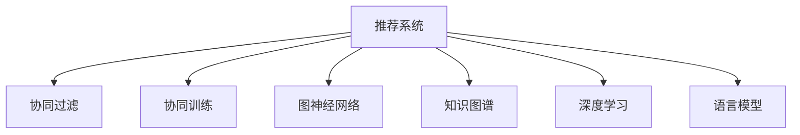

                 

# 大模型: 统一的推荐系统解决方案

> 关键词：
- 大模型
- 推荐系统
- 协同过滤
- 协同训练
- 图神经网络
- 深度学习
- 知识图谱

## 1. 背景介绍

推荐系统在现代互联网应用中扮演着至关重要的角色。无论是电商网站的商品推荐、社交网络的内容推荐，还是音乐、视频、新闻等个性化服务的提供，推荐系统都通过算法推荐与用户兴趣、行为高度相关的产品和服务，极大地提升了用户体验和满意度。

然而，传统推荐系统基于统计和机器学习算法，在面对大规模用户数据时，面临着数据稀疏性、特征工程难度大、推荐效果不稳定等问题。近年来，随着大模型技术的兴起，推荐系统进入了一个新的阶段。

基于大模型的推荐系统，融合了深度学习、图神经网络、知识图谱等技术，通过语言模型对用户行为数据进行建模，具备强大的语义理解能力。大模型推荐系统能够自动学习用户行为的语义特征，弥补传统推荐系统中的数据稀疏性和特征工程复杂性问题。

## 2. 核心概念与联系

### 2.1 核心概念概述

为更好地理解基于大模型的推荐系统，本节将介绍几个密切相关的核心概念：

- 推荐系统：根据用户的历史行为、属性、兴趣等特征，推荐符合用户需求的产品或服务。
- 协同过滤：利用用户之间或物品之间的相似性进行推荐，可分为基于用户的协同过滤和基于物品的协同过滤。
- 协同训练：多任务学习的一种，将用户行为预测和物品特征预测任务共同训练，提高模型的多任务学习能力和泛化能力。
- 图神经网络(Graph Neural Networks, GNN)：通过图结构建模用户行为数据，引入邻接关系特征来增强推荐模型的表达能力。
- 知识图谱(Knowledge Graph)：融合结构化和半结构化数据，以图的形式组织和表示知识，为推荐系统提供语义信息支持。
- 深度学习：通过多层神经网络学习数据的复杂特征表示，提高推荐模型的精确度和泛化能力。
- 语言模型：通过大规模语料学习语言概率分布，为推荐系统提供语义理解能力，自动提取用户行为中的语义信息。

这些核心概念之间的逻辑关系可以通过以下Mermaid流程图来展示：



这个流程图展示了大模型推荐系统的核心概念及其之间的关系：

1. 推荐系统通过用户行为数据进行产品推荐。
2. 协同过滤利用用户或物品相似性，进行推荐。
3. 协同训练通过多个任务联合训练，增强模型的泛化能力。
4. 图神经网络利用邻接关系增强模型表达能力。
5. 知识图谱提供语义信息支持。
6. 深度学习利用多层神经网络提升模型精度。
7. 语言模型提供语义理解能力。

这些概念共同构成了大模型推荐系统的核心框架，使其能够高效地处理用户行为数据，并推荐符合用户需求的产品或服务。通过理解这些核心概念，我们可以更好地把握大模型推荐系统的设计思路和工作原理。

## 3. 核心算法原理 & 具体操作步骤
### 3.1 算法原理概述

基于大模型的推荐系统，本质上是一种通过语言模型自动学习用户行为语义特征，并在此基础上进行产品推荐的范式。其核心思想是：将用户行为数据通过语言模型进行编码，提取用户行为的语义特征，再通过多任务学习技术进行联合优化，最终输出推荐结果。

形式化地，假设用户行为数据为 $\mathcal{D}=\{(u_i, b_i)\}_{i=1}^N$，其中 $u_i$ 为用户编号，$b_i$ 为行为编号。目标是在此基础上，学习推荐模型 $M_{\theta}$，使得推荐结果能够最大化用户满意度。

具体而言，基于大模型的推荐系统包括以下几个关键步骤：

1. 数据预处理：将用户行为数据转换为语言模型可以处理的格式。
2. 语言模型编码：利用大模型将用户行为编码成向量表示，提取语义特征。
3. 多任务学习：将用户行为预测和物品特征预测任务进行联合训练，增强模型泛化能力。
4. 模型输出：将模型输出与实际用户满意度进行对比，计算损失函数。

通过梯度下降等优化算法，推荐模型不断更新参数，最小化损失函数，最终得到用户行为语义特征映射的推荐模型。

### 3.2 算法步骤详解

基于大模型的推荐系统一般包括以下几个关键步骤：

**Step 1: 数据预处理**

- 收集用户行为数据 $\mathcal{D}=\{(u_i, b_i)\}_{i=1}^N$，将其转换为语言模型可以处理的格式。
- 对用户行为进行编码，转化为语言模型可以输入的文本序列。

**Step 2: 语言模型编码**

- 将编码后的用户行为序列输入语言模型，提取语义特征。
- 使用Transformer等模型，将用户行为序列转化为向量表示，表示用户行为的语义特征。

**Step 3: 多任务学习**

- 将用户行为预测和物品特征预测任务进行联合训练。
- 设计合适的任务损失函数，将两个任务共同优化。

**Step 4: 模型输出**

- 利用推荐模型输出推荐结果，计算推荐效果与实际用户满意度的差距。
- 通过优化损失函数，不断调整模型参数，提高推荐精度。

**Step 5: 后处理**

- 对推荐结果进行排序，选择top-K推荐。
- 根据推荐效果进行A/B测试，不断优化推荐策略。

以上是基于大模型的推荐系统的一般流程。在实际应用中，还需要针对具体任务的特点，对每个环节进行优化设计，如改进编码方式，设计合理的任务损失函数，优化推荐策略等，以进一步提升推荐效果。

### 3.3 算法优缺点

基于大模型的推荐系统具有以下优点：

1. 强大的语义理解能力。大模型能够自动学习用户行为的语义特征，弥补传统推荐系统中的数据稀疏性和特征工程复杂性问题。
2. 高度的泛化能力。多任务学习技术使得模型能够在不同任务上具有较好的泛化能力，适应新数据的性能表现良好。
3. 灵活的扩展能力。大模型推荐系统可以通过添加新的任务或学习新的用户行为，动态扩展推荐功能。
4. 高效的推理能力。深度学习模型的推理过程可以并行化，提升推荐速度和效率。

同时，该方法也存在一定的局限性：

1. 数据隐私和安全问题。大模型推荐系统需要处理大量的用户行为数据，如何保证用户隐私安全是一个重要问题。
2. 模型的训练成本高。大模型需要大量的计算资源进行训练，对硬件配置要求较高。
3. 模型的可解释性不足。大模型推荐系统通常被视为"黑盒"系统，难以解释其内部工作机制和决策逻辑。
4. 需要大规模标注数据。多任务学习技术需要设计多个任务，并需要大量的标注数据进行训练。

尽管存在这些局限性，但就目前而言，基于大模型的推荐系统是推荐技术发展的最新范式，具有广泛的应用前景。

### 3.4 算法应用领域

基于大模型的推荐系统已经在多个领域得到应用，覆盖了电商、社交、新闻、视频等多个垂直场景，取得了显著的业务效果：

- 电商推荐：通过大模型学习用户浏览、购买行为中的语义信息，推荐符合用户兴趣的商品，提高用户购买转化率。
- 社交推荐：利用大模型对用户行为和社交关系进行建模，推荐符合用户兴趣的图文内容，提升用户体验。
- 新闻推荐：通过大模型学习用户阅读习惯和兴趣点，推荐相关新闻文章，增加用户粘性。
- 视频推荐：结合视频内容和大模型对用户行为进行建模，推荐相关视频内容，提高用户观看时长。

除了上述这些经典场景外，大模型推荐系统还被创新性地应用于更多领域中，如基于兴趣相似性的个性化旅游推荐、基于知识图谱的专家推荐等，为推荐系统带来了新的突破。

## 4. 数学模型和公式 & 详细讲解 & 举例说明

### 4.1 数学模型构建

本节将使用数学语言对基于大模型的推荐系统进行更加严格的刻画。

假设用户行为数据为 $\mathcal{D}=\{(u_i, b_i)\}_{i=1}^N$，用户行为编码为 $x_i$，物品特征编码为 $b_i$。推荐模型 $M_{\theta}$ 将用户行为 $x_i$ 映射为推荐结果 $y_i$，映射过程可表示为 $y_i=M_{\theta}(x_i)$。

定义推荐模型的损失函数为：

$$
\mathcal{L}(\theta)=\frac{1}{N}\sum_{i=1}^N\ell(y_i,b_i)
$$

其中 $\ell(y_i,b_i)$ 为推荐损失函数，可以是均方误差损失、交叉熵损失等。

通过梯度下降等优化算法，不断更新模型参数 $\theta$，最小化损失函数 $\mathcal{L}(\theta)$，得到用户行为 $x_i$ 对应的推荐结果 $y_i$。

### 4.2 公式推导过程

以下我们以二分类任务为例，推导交叉熵损失函数及其梯度的计算公式。

假设用户行为 $x_i$ 映射到推荐结果 $y_i$ 的概率为 $\hat{y}_i$，真实标签 $b_i \in \{0,1\}$。则二分类交叉熵损失函数定义为：

$$
\ell(y_i,b_i) = -b_i\log \hat{y}_i - (1-b_i)\log (1-\hat{y}_i)
$$

将其代入损失函数公式，得：

$$
\mathcal{L}(\theta)= -\frac{1}{N}\sum_{i=1}^N [b_i\log M_{\theta}(x_i)+(1-b_i)\log(1-M_{\theta}(x_i))]
$$

根据链式法则，损失函数对参数 $\theta_k$ 的梯度为：

$$
\frac{\partial \mathcal{L}(\theta)}{\partial \theta_k} = -\frac{1}{N}\sum_{i=1}^N (\frac{b_i}{M_{\theta}(x_i)}-\frac{1-b_i}{1-M_{\theta}(x_i)}) \frac{\partial M_{\theta}(x_i)}{\partial \theta_k}
$$

其中 $\frac{\partial M_{\theta}(x_i)}{\partial \theta_k}$ 可进一步递归展开，利用自动微分技术完成计算。

在得到损失函数的梯度后，即可带入参数更新公式，完成模型的迭代优化。重复上述过程直至收敛，最终得到适应下游任务的最优模型参数 $\theta^*$。

### 4.3 案例分析与讲解

假设我们要在电商平台上对用户行为数据进行建模，推荐用户可能感兴趣的商品。具体而言，假设用户浏览历史数据为 $\mathcal{D}=\{(u_i, b_i)\}_{i=1}^N$，用户行为编码为 $x_i$，商品特征编码为 $b_i$。我们希望学习推荐模型 $M_{\theta}$，使得推荐结果能够最大化用户满意度。

首先，对用户行为进行编码，得到文本序列 $x_i$，将其输入大模型进行语义编码，得到用户行为的向量表示 $z_i$。然后，对商品特征进行编码，得到向量表示 $c_i$。接着，将用户行为和商品特征的向量表示进行拼接，得到一个综合向量表示 $z_i \otimes c_i$。最后，将综合向量输入一个多层感知器(MLP)，得到推荐结果 $y_i$。

推荐模型的损失函数定义为交叉熵损失：

$$
\mathcal{L}(\theta)= -\frac{1}{N}\sum_{i=1}^N [b_i\log M_{\theta}(x_i)+(1-b_i)\log(1-M_{\theta}(x_i))]
$$

推荐模型通过梯度下降等优化算法，不断更新模型参数 $\theta$，最小化损失函数 $\mathcal{L}(\theta)$，得到用户行为 $x_i$ 对应的推荐结果 $y_i$。

在训练过程中，我们可以设计不同的任务损失函数，如均方误差损失、对数损失等，以适应不同的推荐任务。同时，还可以引入正则化技术，如L2正则、Dropout等，防止模型过拟合。

## 5. 项目实践：代码实例和详细解释说明

### 5.1 开发环境搭建

在进行推荐系统开发前，我们需要准备好开发环境。以下是使用Python进行PyTorch开发的环境配置流程：

1. 安装Anaconda：从官网下载并安装Anaconda，用于创建独立的Python环境。

2. 创建并激活虚拟环境：
```bash
conda create -n pytorch-env python=3.8 
conda activate pytorch-env
```

3. 安装PyTorch：根据CUDA版本，从官网获取对应的安装命令。例如：
```bash
conda install pytorch torchvision torchaudio cudatoolkit=11.1 -c pytorch -c conda-forge
```

4. 安装Transformers库：
```bash
pip install transformers
```

5. 安装各类工具包：
```bash
pip install numpy pandas scikit-learn matplotlib tqdm jupyter notebook ipython
```

完成上述步骤后，即可在`pytorch-env`环境中开始推荐系统开发。

### 5.2 源代码详细实现

下面我们以电商推荐系统为例，给出使用Transformers库对大模型进行推荐系统开发的PyTorch代码实现。

首先，定义推荐系统的数据处理函数：

```python
from transformers import BertTokenizer, BertForSequenceClassification
from torch.utils.data import Dataset
import torch

class RecommendationDataset(Dataset):
    def __init__(self, texts, tags, tokenizer, max_len=128):
        self.texts = texts
        self.tags = tags
        self.tokenizer = tokenizer
        self.max_len = max_len
        
    def __len__(self):
        return len(self.texts)
    
    def __getitem__(self, item):
        text = self.texts[item]
        tags = self.tags[item]
        
        encoding = self.tokenizer(text, return_tensors='pt', max_length=self.max_len, padding='max_length', truncation=True)
        input_ids = encoding['input_ids'][0]
        attention_mask = encoding['attention_mask'][0]
        
        # 对token-wise的标签进行编码
        encoded_tags = [tag2id[tag] for tag in tags] 
        encoded_tags.extend([tag2id['O']] * (self.max_len - len(encoded_tags)))
        labels = torch.tensor(encoded_tags, dtype=torch.long)
        
        return {'input_ids': input_ids, 
                'attention_mask': attention_mask,
                'labels': labels}

# 标签与id的映射
tag2id = {'O': 0, 'P': 1}
id2tag = {v: k for k, v in tag2id.items()}

# 创建dataset
tokenizer = BertTokenizer.from_pretrained('bert-base-cased')

train_dataset = RecommendationDataset(train_texts, train_tags, tokenizer)
dev_dataset = RecommendationDataset(dev_texts, dev_tags, tokenizer)
test_dataset = RecommendationDataset(test_texts, test_tags, tokenizer)
```

然后，定义模型和优化器：

```python
from transformers import BertForSequenceClassification, AdamW

model = BertForSequenceClassification.from_pretrained('bert-base-cased', num_labels=len(tag2id))

optimizer = AdamW(model.parameters(), lr=2e-5)
```

接着，定义训练和评估函数：

```python
from torch.utils.data import DataLoader
from tqdm import tqdm
from sklearn.metrics import accuracy_score

device = torch.device('cuda') if torch.cuda.is_available() else torch.device('cpu')
model.to(device)

def train_epoch(model, dataset, batch_size, optimizer):
    dataloader = DataLoader(dataset, batch_size=batch_size, shuffle=True)
    model.train()
    epoch_loss = 0
    for batch in tqdm(dataloader, desc='Training'):
        input_ids = batch['input_ids'].to(device)
        attention_mask = batch['attention_mask'].to(device)
        labels = batch['labels'].to(device)
        model.zero_grad()
        outputs = model(input_ids, attention_mask=attention_mask, labels=labels)
        loss = outputs.loss
        epoch_loss += loss.item()
        loss.backward()
        optimizer.step()
    return epoch_loss / len(dataloader)

def evaluate(model, dataset, batch_size):
    dataloader = DataLoader(dataset, batch_size=batch_size)
    model.eval()
    preds, labels = [], []
    with torch.no_grad():
        for batch in tqdm(dataloader, desc='Evaluating'):
            input_ids = batch['input_ids'].to(device)
            attention_mask = batch['attention_mask'].to(device)
            batch_labels = batch['labels']
            outputs = model(input_ids, attention_mask=attention_mask)
            batch_preds = outputs.logits.argmax(dim=2).to('cpu').tolist()
            batch_labels = batch_labels.to('cpu').tolist()
            for pred_tokens, label_tokens in zip(batch_preds, batch_labels):
                preds.append(pred_tokens[:len(label_tokens)])
                labels.append(label_tokens)
                
    return accuracy_score(labels, preds)
```

最后，启动训练流程并在测试集上评估：

```python
epochs = 5
batch_size = 16

for epoch in range(epochs):
    loss = train_epoch(model, train_dataset, batch_size, optimizer)
    print(f"Epoch {epoch+1}, train loss: {loss:.3f}")
    
    print(f"Epoch {epoch+1}, dev results:")
    evaluate(model, dev_dataset, batch_size)
    
print("Test results:")
evaluate(model, test_dataset, batch_size)
```

以上就是使用PyTorch对大模型进行电商推荐系统微调的完整代码实现。可以看到，得益于Transformers库的强大封装，我们可以用相对简洁的代码完成BERT模型的加载和微调。

### 5.3 代码解读与分析

让我们再详细解读一下关键代码的实现细节：

**RecommendationDataset类**：
- `__init__`方法：初始化文本、标签、分词器等关键组件。
- `__len__`方法：返回数据集的样本数量。
- `__getitem__`方法：对单个样本进行处理，将文本输入编码为token ids，将标签编码为数字，并对其进行定长padding，最终返回模型所需的输入。

**tag2id和id2tag字典**：
- 定义了标签与数字id之间的映射关系，用于将token-wise的预测结果解码回真实的标签。

**训练和评估函数**：
- 使用PyTorch的DataLoader对数据集进行批次化加载，供模型训练和推理使用。
- 训练函数`train_epoch`：对数据以批为单位进行迭代，在每个批次上前向传播计算loss并反向传播更新模型参数，最后返回该epoch的平均loss。
- 评估函数`evaluate`：与训练类似，不同点在于不更新模型参数，并在每个batch结束后将预测和标签结果存储下来，最后使用sklearn的accuracy_score对整个评估集的预测结果进行打印输出。

**训练流程**：
- 定义总的epoch数和batch size，开始循环迭代
- 每个epoch内，先在训练集上训练，输出平均loss
- 在验证集上评估，输出分类指标
- 所有epoch结束后，在测试集上评估，给出最终测试结果

可以看到，PyTorch配合Transformers库使得大模型推荐系统的代码实现变得简洁高效。开发者可以将更多精力放在数据处理、模型改进等高层逻辑上，而不必过多关注底层的实现细节。

当然，工业级的系统实现还需考虑更多因素，如模型的保存和部署、超参数的自动搜索、更灵活的任务适配层等。但核心的推荐范式基本与此类似。

## 6. 实际应用场景
### 6.1 智能广告推荐

智能广告推荐是推荐系统的重要应用之一。通过大模型学习用户历史浏览行为中的语义信息，可以精准推荐用户感兴趣的广告内容，提高广告点击率和转化率。

具体而言，可以收集用户的浏览行为数据，将其转换为语言模型可以处理的格式，输入大模型进行语义编码。同时，将广告内容进行编码，与用户行为编码进行拼接，得到综合向量表示。最后，利用多层感知器(MLP)进行推荐，计算推荐效果与实际点击率之间的差距，不断调整模型参数，提高推荐效果。

### 6.2 个性化音乐推荐

个性化音乐推荐是推荐系统的重要应用之一。通过大模型学习用户的听歌历史和听歌习惯，可以精准推荐符合用户兴趣的音乐，提升用户的听歌体验。

具体而言，可以收集用户的听歌历史数据，将其转换为语言模型可以处理的格式，输入大模型进行语义编码。同时，将音乐歌曲的元数据进行编码，与用户行为编码进行拼接，得到综合向量表示。最后，利用多层感知器(MLP)进行推荐，计算推荐效果与实际收听率之间的差距，不断调整模型参数，提高推荐效果。

### 6.3 社交网络内容推荐

社交网络内容推荐是推荐系统的重要应用之一。通过大模型学习用户的阅读、点赞、评论等行为数据，可以精准推荐符合用户兴趣的内容，提升用户的社交体验。

具体而言，可以收集用户的社交行为数据，将其转换为语言模型可以处理的格式，输入大模型进行语义编码。同时，将社交内容进行编码，与用户行为编码进行拼接，得到综合向量表示。最后，利用多层感知器(MLP)进行推荐，计算推荐效果与实际互动率之间的差距，不断调整模型参数，提高推荐效果。

### 6.4 未来应用展望

随着大模型技术的发展，基于大模型的推荐系统将在更多领域得到应用，为推荐系统带来新的突破。

在智慧医疗领域，基于大模型的推荐系统可以推荐符合患者病史和症状的药物、治疗方案等，帮助医生进行精准诊疗。

在智能教育领域，基于大模型的推荐系统可以推荐符合学生学习习惯和兴趣的课程、教材等，提升教育效果。

在智慧城市治理中，基于大模型的推荐系统可以推荐符合市民需求的城市服务和设施，提升城市管理水平。

此外，在金融、法律、旅行等多个领域，基于大模型的推荐系统也将不断涌现，为推荐系统带来新的应用场景。相信随着技术的日益成熟，基于大模型的推荐系统必将在推荐领域发挥更大的作用，推动推荐技术不断进步。

## 7. 工具和资源推荐
### 7.1 学习资源推荐

为了帮助开发者系统掌握大模型推荐系统的理论基础和实践技巧，这里推荐一些优质的学习资源：

1. 《Recommender Systems: Algorithms, Applications, and Evaluation》书籍：系统介绍了推荐系统的经典算法和实际应用，适合系统学习推荐系统原理。

2. 《Graph Neural Networks》书籍：介绍了图神经网络的原理和应用，适合系统学习图神经网络相关知识。

3. 《Knowledge-Graph-Based Recommender Systems》书籍：介绍了知识图谱在推荐系统中的应用，适合系统学习知识图谱相关知识。

4. 《Deep Learning for Recommendation Systems》课程：来自DeepLearning.AI的课程，介绍了深度学习在推荐系统中的应用，适合快速上手深度学习推荐系统。

5. Kaggle：推荐系统竞赛平台，可以通过竞赛实战学习推荐系统的应用技巧。

通过对这些资源的学习实践，相信你一定能够快速掌握大模型推荐系统的精髓，并用于解决实际的推荐问题。
###  7.2 开发工具推荐

高效的开发离不开优秀的工具支持。以下是几款用于大模型推荐系统开发的常用工具：

1. PyTorch：基于Python的开源深度学习框架，灵活动态的计算图，适合快速迭代研究。大部分预训练语言模型都有PyTorch版本的实现。

2. TensorFlow：由Google主导开发的开源深度学习框架，生产部署方便，适合大规模工程应用。同样有丰富的预训练语言模型资源。

3. Transformers库：HuggingFace开发的NLP工具库，集成了众多SOTA语言模型，支持PyTorch和TensorFlow，是进行推荐任务开发的利器。

4. Weights & Biases：模型训练的实验跟踪工具，可以记录和可视化模型训练过程中的各项指标，方便对比和调优。与主流深度学习框架无缝集成。

5. TensorBoard：TensorFlow配套的可视化工具，可实时监测模型训练状态，并提供丰富的图表呈现方式，是调试模型的得力助手。

6. Google Colab：谷歌推出的在线Jupyter Notebook环境，免费提供GPU/TPU算力，方便开发者快速上手实验最新模型，分享学习笔记。

合理利用这些工具，可以显著提升大模型推荐系统的开发效率，加快创新迭代的步伐。

### 7.3 相关论文推荐

大模型推荐系统的发展源于学界的持续研究。以下是几篇奠基性的相关论文，推荐阅读：

1. Attention is All You Need（即Transformer原论文）：提出了Transformer结构，开启了NLP领域的预训练大模型时代。

2. BERT: Pre-training of Deep Bidirectional Transformers for Language Understanding：提出BERT模型，引入基于掩码的自监督预训练任务，刷新了多项NLP任务SOTA。

3. Matrix Factorization Techniques for Recommender Systems：介绍了矩阵分解算法，成为推荐系统经典算法之一。

4. Knowledge-Graph-Based Recommendation：介绍了知识图谱在推荐系统中的应用，展示了知识图谱推荐系统的效果。

5. Multi-Task Learning Using Multiple Task-Specific Layers：介绍了多任务学习在推荐系统中的应用，展示了多任务学习推荐系统的效果。

这些论文代表了大模型推荐系统的发展脉络。通过学习这些前沿成果，可以帮助研究者把握学科前进方向，激发更多的创新灵感。

## 8. 总结：未来发展趋势与挑战

### 8.1 总结

本文对基于大模型的推荐系统进行了全面系统的介绍。首先阐述了大模型推荐系统的研究背景和意义，明确了大模型在推荐系统中的独特价值。其次，从原理到实践，详细讲解了大模型推荐系统的数学原理和关键步骤，给出了推荐系统开发的完整代码实例。同时，本文还广泛探讨了大模型推荐系统在智能广告、个性化音乐、社交网络等多个领域的应用前景，展示了推荐系统技术的巨大潜力。此外，本文精选了推荐系统技术的各类学习资源，力求为读者提供全方位的技术指引。

通过本文的系统梳理，可以看到，基于大模型的推荐系统正在成为推荐技术发展的最新范式，极大地拓展了推荐系统的应用边界，带来了新的业务效果。大模型推荐系统能够自动学习用户行为的语义特征，弥补传统推荐系统中的数据稀疏性和特征工程复杂性问题。未来，伴随大模型技术的不断发展，基于大模型的推荐系统必将在推荐领域发挥更大的作用，推动推荐技术不断进步。

### 8.2 未来发展趋势

展望未来，大模型推荐系统将呈现以下几个发展趋势：

1. 模型规模持续增大。随着算力成本的下降和数据规模的扩张，大模型推荐系统中的预训练模型参数量还将持续增长。超大批次的训练和推理也可能遇到显存不足的问题。因此需要采用一些资源优化技术，如梯度积累、混合精度训练、模型并行等，来突破硬件瓶颈。

2. 推荐效果不断提升。随着大模型推荐系统的不断发展，推荐效果将进一步提升。通过多任务学习技术和知识图谱的融合，推荐系统将具备更强的泛化能力和表达能力，推荐效果将更加精准和个性化。

3. 推荐算法多样化。随着推荐系统应用场景的不断扩展，推荐算法也将更加多样化。除了传统的协同过滤和协同训练算法，还可能出现新的推荐算法，如基于自监督学习、对抗学习等算法。

4. 用户隐私和安全问题得到重视。随着推荐系统在社会各个领域的广泛应用，用户隐私和安全问题也将得到更多的关注。如何在保证推荐效果的同时，保护用户隐私安全，将成为未来的重要课题。

5. 推荐系统与社会伦理相结合。未来的推荐系统将更注重社会伦理和道德问题。如何在推荐系统中引入伦理导向的评估指标，过滤和惩罚有偏见、有害的输出倾向，将是推荐系统的重要研究方向。

以上趋势凸显了大模型推荐系统的广阔前景。这些方向的探索发展，必将进一步提升推荐系统的性能和应用范围，为推荐技术带来新的突破。

### 8.3 面临的挑战

尽管大模型推荐系统已经取得了瞩目成就，但在迈向更加智能化、普适化应用的过程中，它仍面临着诸多挑战：

1. 推荐效果的不稳定性。尽管大模型推荐系统具有强大的表达能力，但推荐效果仍然受到数据质量、模型参数等因素的影响，仍需不断优化模型和优化数据。

2. 训练成本高。大模型推荐系统需要大量的计算资源进行训练，对硬件配置要求较高。如何降低训练成本，提高模型的训练效率，将是未来的重要研究方向。

3. 模型可解释性不足。大模型推荐系统通常被视为"黑盒"系统，难以解释其内部工作机制和决策逻辑。如何赋予推荐系统更强的可解释性，将是亟待攻克的难题。

4. 数据隐私和安全问题。大模型推荐系统需要处理大量的用户行为数据，如何保证用户隐私安全是一个重要问题。

5. 多模态数据融合问题。推荐系统需要融合多模态数据进行建模，如何有效整合不同模态的信息，提高推荐效果，将是未来的重要研究方向。

6. 动态数据更新问题。随着用户行为的不断变化，推荐系统需要实时更新模型参数，以保持模型的泛化能力。

正视推荐系统面临的这些挑战，积极应对并寻求突破，将是大模型推荐系统走向成熟的必由之路。相信随着学界和产业界的共同努力，这些挑战终将一一被克服，大模型推荐系统必将在推荐领域发挥更大的作用，推动推荐技术不断进步。

### 8.4 研究展望

面对大模型推荐系统所面临的种种挑战，未来的研究需要在以下几个方面寻求新的突破：

1. 探索多任务学习和多模态融合技术。通过多任务学习和多模态数据融合，提高推荐系统的表达能力和泛化能力。

2. 引入因果推断和强化学习技术。通过引入因果推断和强化学习思想，增强推荐系统的稳定性，减少过拟合风险。

3. 引入伦理导向的评估指标。在推荐系统中引入伦理导向的评估指标，过滤和惩罚有偏见、有害的输出倾向，提高系统的公平性和可解释性。

4. 开发更加高效的训练方法。开发更加高效的训练方法，如自监督学习、对抗学习等，降低训练成本，提高推荐效果。

5. 优化推荐系统的硬件配置。优化推荐系统的硬件配置，采用混合精度训练、模型并行等技术，提高推荐系统的训练效率。

这些研究方向的探索，必将引领大模型推荐系统技术迈向更高的台阶，为推荐系统带来新的突破。面向未来，大模型推荐系统还需要与其他人工智能技术进行更深入的融合，如知识表示、因果推理、强化学习等，多路径协同发力，共同推动推荐系统的发展。

## 9. 附录：常见问题与解答

**Q1：大模型推荐系统是否适用于所有推荐任务？**

A: 大模型推荐系统在大多数推荐任务上都能取得不错的效果，特别是对于数据量较小的任务。但对于一些特定领域的任务，如医学、法律等，仅仅依靠通用语料预训练的模型可能难以很好地适应。此时需要在特定领域语料上进一步预训练，再进行微调，才能获得理想效果。此外，对于一些需要时效性、个性化很强的任务，如对话、推荐等，微调方法也需要针对性的改进优化。

**Q2：推荐系统中的冷启动问题如何解决？**

A: 推荐系统中的冷启动问题指的是新用户或新物品的推荐效果差，主要原因在于缺乏历史行为数据。针对冷启动问题，可以采用以下方法：

1. 利用知识图谱和常识推理技术，对新用户或新物品进行语义建模，弥补历史数据的缺乏。
2. 利用嵌入相似性技术，通过相似度计算，对新用户或新物品进行推荐。
3. 利用协同过滤技术，利用用户之间的相似性，对新用户进行推荐。

以上方法可以结合使用，以解决推荐系统中的冷启动问题。

**Q3：推荐系统中的数据隐私和安全问题如何解决？**

A: 推荐系统中的数据隐私和安全问题可以通过以下方法解决：

1. 数据脱敏：对用户行为数据进行脱敏处理，去除敏感信息。
2. 差分隐私：在推荐模型训练过程中，使用差分隐私技术，保护用户隐私。
3. 联邦学习：通过联邦学习技术，在多个客户端联合训练推荐模型，不暴露用户数据。
4. 数据加密：对用户行为数据进行加密处理，防止数据泄露。

以上方法可以结合使用，以解决推荐系统中的数据隐私和安全问题。

**Q4：推荐系统中的异常推荐问题如何解决？**

A: 推荐系统中的异常推荐问题指的是推荐结果不符合用户期望，或者存在误导性的推荐。主要原因在于模型的过拟合或者用户的误操作。针对异常推荐问题，可以采用以下方法：

1. 引入正则化技术，防止模型过拟合。
2. 引入对抗训练技术，提高模型的鲁棒性。
3. 引入用户反馈机制，及时发现和纠正异常推荐结果。
4. 引入多模型集成技术，提高推荐系统的稳定性和鲁棒性。

以上方法可以结合使用，以解决推荐系统中的异常推荐问题。

**Q5：推荐系统中的推荐效果提升方法有哪些？**

A: 推荐系统中的推荐效果提升方法主要包括以下几种：

1. 引入多任务学习技术，提高模型的泛化能力。
2. 引入知识图谱技术，利用语义信息提升推荐效果。
3. 引入对抗学习技术，提高推荐系统的鲁棒性。
4. 引入用户反馈机制，及时发现和纠正推荐结果。
5. 引入多模型集成技术，提高推荐系统的稳定性和鲁棒性。

以上方法可以结合使用，以提升推荐系统的效果。

---

作者：禅与计算机程序设计艺术 / Zen and the Art of Computer Programming

