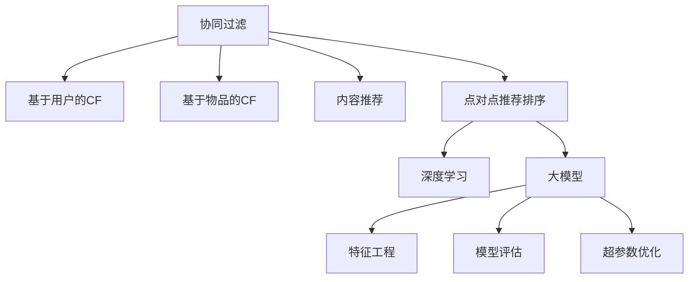

                 

# 大模型在point-wise推荐排序中的表现

> 关键词：推荐系统, 深度学习, 大模型, point-wise排序, 推荐排序, 协同过滤, 召回率, 精度, 矩阵分解, 特征工程, 模型评估, 超参数优化

## 1. 背景介绍

### 1.1 问题由来
在当前的互联网时代，推荐系统已经成为了各行各业提升用户体验和业务收益的重要手段。无论是电商平台、视频网站还是社交网络，都离不开高效的推荐算法。推荐系统通过分析用户行为数据，为用户推荐感兴趣的商品、内容或服务，从而增加用户停留时间和消费转化率。然而，构建一个高质量的推荐系统，需要处理大规模数据，同时需要高精度的推荐结果。

推荐系统通常分为两大类：协同过滤(Collaborative Filtering, CF)和内容推荐(Content-Based Filtering, CB)。协同过滤又细分为基于用户的协同过滤(User-Based CF)和基于物品的协同过滤(Item-Based CF)。其中，基于用户的协同过滤主要根据用户之间的相似度，为用户推荐其他用户喜欢的商品；基于物品的协同过滤则通过分析物品之间的相似度，为用户推荐与历史喜好相似的物品。

随着深度学习技术的兴起，推荐系统开始引入大模型进行点对点(Point-Wise)推荐排序，这种技术能够更好地捕捉用户和物品的隐式特征，从而实现更精准的推荐。本文将深入探讨大模型在point-wise推荐排序中的应用，以及如何通过有效的特征工程和模型评估，提升推荐系统的性能。

### 1.2 问题核心关键点
基于深度学习的大模型推荐排序技术，是近年来推荐系统领域的一个热门方向。其核心思想是将推荐问题转化为一个点对点排序问题，即给定用户和物品的特征向量，通过大模型预测物品与用户之间的相关性，从而实现推荐排序。

具体来说，大模型在point-wise推荐排序中的表现，主要取决于以下几个关键因素：
- 数据质量和特征工程：高质量的特征数据和有效的特征工程是构建优秀推荐模型的基础。
- 模型的深度和复杂度：大模型的深度和复杂度决定了其对隐式特征的捕捉能力。
- 模型训练和调参：合适的模型训练策略和超参数优化方法，能够提升模型的性能和泛化能力。
- 模型的评估和优化：通过合理的模型评估和优化方法，能够客观地衡量模型性能，指导后续调优工作。

## 2. 核心概念与联系

### 2.1 核心概念概述

为更好地理解基于大模型的point-wise推荐排序方法，本节将介绍几个密切相关的核心概念：

- 协同过滤(CF)：推荐系统中的一种重要技术，通过分析用户或物品之间的相似度，为用户推荐其他用户喜欢的物品或与历史喜好相似的物品。
- 基于用户的协同过滤(User-Based CF)：根据用户的历史行为数据，推断其喜好，再推荐其他用户喜欢的物品。
- 基于物品的协同过滤(Item-Based CF)：根据物品之间的相似度，推断用户对新物品的喜好。
- 内容推荐(Content-Based Filtering, CB)：通过分析物品的特征，为用户推荐与已有喜好相似的物品。
- 点对点推荐排序(Point-Wise Recommendation Sorting)：将推荐问题转化为点对点排序问题，通过大模型预测用户和物品之间的相关性，从而实现推荐排序。
- 深度学习(DL)：一种基于神经网络的技术，能够自动学习复杂特征表示，广泛应用于推荐系统、计算机视觉、自然语言处理等领域。
- 大模型(Large Model)：指具有数十亿甚至百亿参数的深度学习模型，如BERT、GPT、XLM等，能够在复杂的推荐排序任务中取得优异的性能。
- 特征工程(Feature Engineering)：通过设计有效的特征，提升模型的表现。特征工程在推荐系统中至关重要。
- 模型评估(Model Evaluation)：通过合理的评估指标，衡量模型的性能和泛化能力。
- 超参数优化(Hyperparameter Optimization)：通过调整模型超参数，提升模型性能。

这些核心概念之间的逻辑关系可以通过以下Mermaid流程图来展示：



这个流程图展示了大模型的点对点推荐排序方法的核心概念及其之间的关系：

1. 协同过滤是推荐系统的基础。
2. 基于用户和物品的协同过滤，通过相似度计算实现推荐。
3. 内容推荐通过分析物品特征实现推荐。
4. 点对点推荐排序将推荐问题转化为排序问题，通过大模型预测用户和物品的相关性。
5. 深度学习和大模型是实现点对点推荐排序的关键技术。
6. 特征工程和模型评估，是提升推荐系统性能的重要手段。
7. 超参数优化，通过调整模型参数，进一步提升模型性能。

这些概念共同构成了大模型在point-wise推荐排序的推荐系统框架，使其能够在复杂的推荐场景中发挥强大的作用。通过理解这些核心概念，我们可以更好地把握点对点推荐排序的原理和应用方向。

## 3. 核心算法原理 & 具体操作步骤
### 3.1 算法原理概述

基于大模型的point-wise推荐排序，本质上是一个点对点排序问题，即给定用户和物品的特征向量，通过大模型预测物品与用户之间的相关性，从而实现推荐排序。其核心思想是将推荐问题转化为一个分类任务，即判断物品是否为用户感兴趣的，从而实现排序。

形式化地，假设用户 $u$ 的历史行为数据为 $\mathbf{x}_u$，物品 $i$ 的特征为 $\mathbf{x}_i$，目标是为用户 $u$ 推荐物品 $i$，预测物品与用户的相关性 $y_{ui}$。推荐排序的目标是最小化预测值与真实值之间的差异，即：

$$
\min_{\theta} \mathcal{L}(y_{ui},\hat{y}_{ui})
$$

其中 $\hat{y}_{ui}$ 为模型预测的用户和物品之间的相关性，$\mathcal{L}$ 为损失函数，通常使用交叉熵损失函数。

### 3.2 算法步骤详解

基于大模型的point-wise推荐排序一般包括以下几个关键步骤：

**Step 1: 数据预处理**

1. 收集用户行为数据，构建用户和物品的特征向量。通常将用户历史点击、浏览、评分等行为数据转换为高维稀疏向量。
2. 设计有效的特征工程方法，提取和构造特征。特征工程是点对点推荐排序的关键步骤，通过有效的特征设计，能够提升模型的性能。

**Step 2: 模型训练**

1. 选择合适的深度学习框架，如TensorFlow、PyTorch等。
2. 选择合适的深度学习模型，如BERT、XLM等。
3. 设计模型架构，通常使用两个线性层和softmax函数作为预测层。
4. 设置模型超参数，如学习率、批大小、迭代轮数等。
5. 使用标注数据对模型进行训练，最小化交叉熵损失函数。

**Step 3: 模型评估**

1. 选择合适的评估指标，如召回率、精度、F1-score等。
2. 在验证集上评估模型性能，记录各项指标。
3. 根据评估结果调整模型超参数，进行模型优化。

**Step 4: 模型部署**

1. 将训练好的模型保存为模型文件，便于后续部署使用。
2. 部署模型到生产环境，进行实时推荐预测。
3. 持续收集用户行为数据，定期重新训练模型，以适应数据分布的变化。

### 3.3 算法优缺点

基于大模型的point-wise推荐排序方法具有以下优点：
1. 能够捕捉复杂的隐式特征，提升推荐精度。大模型具有强大的特征表示能力，能够学习到用户和物品之间的隐式关联。
2. 能够处理高维稀疏数据，适应复杂的推荐场景。大模型能够高效处理大规模高维数据，适应推荐系统的数据特性。
3. 可以结合其他推荐技术，提升推荐效果。点对点推荐排序可以与协同过滤、内容推荐等技术结合，实现更精准的推荐。

同时，该方法也存在一定的局限性：
1. 对标注数据的需求较高。点对点推荐排序需要大量的标注数据，标注成本较高。
2. 对特征工程的要求较高。特征工程的设计和选择直接影响模型的性能，需要较强的专业知识和经验。
3. 对计算资源的要求较高。大模型训练和推理需要大量的计算资源，对硬件条件要求较高。
4. 过拟合风险较高。大模型参数量庞大，容易发生过拟合现象，需要合理的正则化方法。

尽管存在这些局限性，但就目前而言，基于大模型的point-wise推荐排序方法仍然是最主流和有效的推荐技术之一。未来相关研究的重点在于如何进一步降低标注数据的需求，提高特征工程的自动化程度，同时兼顾模型的可解释性和计算效率。

### 3.4 算法应用领域

基于大模型的point-wise推荐排序技术，已经在电商推荐、视频推荐、新闻推荐等多个领域得到了广泛的应用，提升了推荐系统的性能和用户体验。

在电商推荐领域，大模型能够分析用户的购物行为，预测用户可能感兴趣的商品，从而实现个性化的推荐排序。大模型的预测能力和特征表示能力，使得电商推荐系统能够覆盖更广泛的商品类别，提供更精准的推荐结果。

在视频推荐领域，大模型能够分析用户的历史观看记录，预测用户可能喜欢的视频内容，从而实现视频内容的个性化推荐。大模型能够处理高维的特征向量，适应视频推荐的多样性和复杂性。

在新闻推荐领域，大模型能够分析用户的阅读行为，预测用户可能感兴趣的新闻主题，从而实现新闻的个性化推荐。大模型能够学习到不同新闻主题之间的语义关联，提供更符合用户兴趣的新闻推荐。

除了这些典型应用外，大模型还可以用于社交网络推荐、音乐推荐、游戏推荐等多个场景，为推荐系统的智能化转型提供强有力的技术支撑。

## 4. 数学模型和公式 & 详细讲解 & 举例说明
### 4.1 数学模型构建

本节将使用数学语言对基于大模型的point-wise推荐排序过程进行更加严格的刻画。

记用户 $u$ 的历史行为数据为 $\mathbf{x}_u$，物品 $i$ 的特征为 $\mathbf{x}_i$，目标是为用户 $u$ 推荐物品 $i$，预测物品与用户的相关性 $y_{ui}$。

定义模型 $M_{\theta}$ 在用户和物品的特征向量上的预测函数为 $\hat{y}_{ui}=M_{\theta}(\mathbf{x}_u,\mathbf{x}_i)$，其中 $\theta$ 为模型参数。

定义损失函数为交叉熵损失函数：

$$
\mathcal{L}(\theta) = -\frac{1}{N}\sum_{i=1}^N\sum_{u=1}^N \ell(y_{ui},\hat{y}_{ui})
$$

其中 $\ell(y_{ui},\hat{y}_{ui})$ 为交叉熵损失函数：

$$
\ell(y_{ui},\hat{y}_{ui}) = y_{ui}\log\hat{y}_{ui}+(1-y_{ui})\log(1-\hat{y}_{ui})
$$

### 4.2 公式推导过程

以下我们以二分类任务为例，推导交叉熵损失函数及其梯度的计算公式。

假设模型 $M_{\theta}$ 在用户和物品的特征向量上的预测函数为 $\hat{y}_{ui}=M_{\theta}(\mathbf{x}_u,\mathbf{x}_i) \in [0,1]$，表示物品与用户的相关性预测。真实标签 $y_{ui} \in \{0,1\}$。则二分类交叉熵损失函数定义为：

$$
\ell(y_{ui},\hat{y}_{ui}) = -[y_{ui}\log \hat{y}_{ui} + (1-y_{ui})\log (1-\hat{y}_{ui})]
$$

将其代入经验风险公式，得：

$$
\mathcal{L}(\theta) = -\frac{1}{N}\sum_{i=1}^N\sum_{u=1}^N [y_{ui}\log M_{\theta}(\mathbf{x}_u,\mathbf{x}_i)+(1-y_{ui})\log(1-M_{\theta}(\mathbf{x}_u,\mathbf{x}_i))]
$$

根据链式法则，损失函数对参数 $\theta$ 的梯度为：

$$
\frac{\partial \mathcal{L}(\theta)}{\partial \theta} = -\frac{1}{N}\sum_{i=1}^N\sum_{u=1}^N \frac{y_{ui}}{M_{\theta}(\mathbf{x}_u,\mathbf{x}_i)}-\frac{1-y_{ui}}{1-M_{\theta}(\mathbf{x}_u,\mathbf{x}_i)} \frac{\partial M_{\theta}(\mathbf{x}_u,\mathbf{x}_i)}{\partial \theta}
$$

其中 $\frac{\partial M_{\theta}(\mathbf{x}_u,\mathbf{x}_i)}{\partial \theta}$ 可进一步递归展开，利用自动微分技术完成计算。

在得到损失函数的梯度后，即可带入参数更新公式，完成模型的迭代优化。重复上述过程直至收敛，最终得到适应推荐任务的最优模型参数 $\theta^*$。

## 5. 项目实践：代码实例和详细解释说明
### 5.1 开发环境搭建

在进行point-wise推荐排序实践前，我们需要准备好开发环境。以下是使用Python进行PyTorch开发的环境配置流程：

1. 安装Anaconda：从官网下载并安装Anaconda，用于创建独立的Python环境。

2. 创建并激活虚拟环境：
```bash
conda create -n pytorch-env python=3.8 
conda activate pytorch-env
```

3. 安装PyTorch：根据CUDA版本，从官网获取对应的安装命令。例如：
```bash
conda install pytorch torchvision torchaudio cudatoolkit=11.1 -c pytorch -c conda-forge
```

4. 安装Transformers库：
```bash
pip install transformers
```

5. 安装各类工具包：
```bash
pip install numpy pandas scikit-learn matplotlib tqdm jupyter notebook ipython
```

完成上述步骤后，即可在`pytorch-env`环境中开始point-wise推荐排序实践。

### 5.2 源代码详细实现

下面我们以电商推荐系统为例，给出使用Transformers库对大模型进行point-wise推荐排序的PyTorch代码实现。

首先，定义推荐系统的数据处理函数：

```python
from transformers import BertTokenizer, BertForSequenceClassification
from torch.utils.data import Dataset, DataLoader
import torch

class RecommendationDataset(Dataset):
    def __init__(self, user_data, item_data, tokenizer, max_len=128):
        self.user_data = user_data
        self.item_data = item_data
        self.tokenizer = tokenizer
        self.max_len = max_len
        
    def __len__(self):
        return len(self.user_data)
    
    def __getitem__(self, item):
        user_ids = [self.user_data[item]]
        item_ids = [self.item_data[item]]
        
        encoding = self.tokenizer(user_ids, item_ids, return_tensors='pt', max_length=self.max_len, padding='max_length', truncation=True)
        user_ids = encoding['input_ids'][:, 0]
        item_ids = encoding['input_ids'][:, 1]
        
        return {'user_ids': user_ids,
                'item_ids': item_ids,
                'labels': torch.tensor([1.0] if user_ids[0] == item_ids[0] else 0.0, dtype=torch.float)}
```

然后，定义模型和优化器：

```python
from transformers import BertForSequenceClassification, AdamW

model = BertForSequenceClassification.from_pretrained('bert-base-cased', num_labels=2)

optimizer = AdamW(model.parameters(), lr=2e-5)
```

接着，定义训练和评估函数：

```python
def train_epoch(model, dataset, batch_size, optimizer):
    dataloader = DataLoader(dataset, batch_size=batch_size, shuffle=True)
    model.train()
    epoch_loss = 0
    for batch in dataloader:
        user_ids = batch['user_ids'].to(device)
        item_ids = batch['item_ids'].to(device)
        labels = batch['labels'].to(device)
        model.zero_grad()
        outputs = model(user_ids, item_ids)
        loss = outputs.loss
        epoch_loss += loss.item()
        loss.backward()
        optimizer.step()
    return epoch_loss / len(dataloader)

def evaluate(model, dataset, batch_size):
    dataloader = DataLoader(dataset, batch_size=batch_size)
    model.eval()
    preds, labels = [], []
    with torch.no_grad():
        for batch in dataloader:
            user_ids = batch['user_ids'].to(device)
            item_ids = batch['item_ids'].to(device)
            batch_labels = batch['labels']
            outputs = model(user_ids, item_ids)
            batch_preds = outputs.logits.argmax(dim=2).to('cpu').tolist()
            batch_labels = batch_labels.to('cpu').tolist()
            for pred, label in zip(batch_preds, batch_labels):
                preds.append(pred)
                labels.append(label)
    print(classification_report(labels, preds))
```

最后，启动训练流程并在测试集上评估：

```python
epochs = 5
batch_size = 16

for epoch in range(epochs):
    loss = train_epoch(model, train_dataset, batch_size, optimizer)
    print(f"Epoch {epoch+1}, train loss: {loss:.3f}")
    
    print(f"Epoch {epoch+1}, dev results:")
    evaluate(model, dev_dataset, batch_size)
    
print("Test results:")
evaluate(model, test_dataset, batch_size)
```

以上就是使用PyTorch对大模型进行point-wise推荐排序的完整代码实现。可以看到，得益于Transformers库的强大封装，我们可以用相对简洁的代码完成大模型的加载和推荐排序训练。

### 5.3 代码解读与分析

让我们再详细解读一下关键代码的实现细节：

**RecommendationDataset类**：
- `__init__`方法：初始化用户行为数据、物品特征数据、分词器等关键组件。
- `__len__`方法：返回数据集的样本数量。
- `__getitem__`方法：对单个样本进行处理，将用户和物品特征输入转换为token ids，并对其进行定长padding，最终返回模型所需的输入。

**模型和优化器**：
- 使用BERT模型作为特征提取器，并通过两个线性层和softmax函数实现点对点排序。
- 使用AdamW优化器进行模型参数更新，设置适当的学习率。

**训练和评估函数**：
- 使用PyTorch的DataLoader对数据集进行批次化加载，供模型训练和推理使用。
- 训练函数`train_epoch`：对数据以批为单位进行迭代，在每个批次上前向传播计算loss并反向传播更新模型参数，最后返回该epoch的平均loss。
- 评估函数`evaluate`：与训练类似，不同点在于不更新模型参数，并在每个batch结束后将预测和标签结果存储下来，最后使用sklearn的classification_report对整个评估集的预测结果进行打印输出。

**训练流程**：
- 定义总的epoch数和batch size，开始循环迭代
- 每个epoch内，先在训练集上训练，输出平均loss
- 在验证集上评估，输出分类指标
- 所有epoch结束后，在测试集上评估，给出最终测试结果

可以看到，PyTorch配合Transformers库使得point-wise推荐排序的代码实现变得简洁高效。开发者可以将更多精力放在数据处理、模型改进等高层逻辑上，而不必过多关注底层的实现细节。

当然，工业级的系统实现还需考虑更多因素，如模型的保存和部署、超参数的自动搜索、更灵活的任务适配层等。但核心的point-wise推荐排序范式基本与此类似。

## 6. 实际应用场景
### 6.1 电商推荐

基于大模型的point-wise推荐排序技术，已经在电商推荐系统中得到了广泛的应用。电商推荐系统需要处理大规模的购物数据，同时需要高效预测用户可能感兴趣的商品。

在实践中，可以收集用户的历史点击、浏览、评分等行为数据，构建用户和物品的特征向量。使用大模型对这些特征向量进行训练，预测物品与用户的相关性，从而实现推荐排序。电商推荐系统通过点对点推荐排序技术，能够更准确地预测用户兴趣，提供更精准的商品推荐。

### 6.2 视频推荐

视频推荐系统需要处理高维的特征向量，同时需要高效预测用户可能喜欢的视频内容。点对点推荐排序技术能够处理高维稀疏数据，适应视频推荐的多样性和复杂性。

在实践中，可以收集用户的历史观看记录，构建用户和视频的特征向量。使用大模型对这些特征向量进行训练，预测视频与用户的相关性，从而实现推荐排序。视频推荐系统通过点对点推荐排序技术，能够更准确地预测用户兴趣，提供更个性化的视频推荐。

### 6.3 新闻推荐

新闻推荐系统需要处理大量的新闻数据，同时需要高效预测用户可能感兴趣的新闻主题。点对点推荐排序技术能够处理高维的文本特征，适应新闻推荐的复杂性。

在实践中，可以收集用户的历史阅读记录，构建用户和新闻的特征向量。使用大模型对这些特征向量进行训练，预测新闻与用户的相关性，从而实现推荐排序。新闻推荐系统通过点对点推荐排序技术，能够更准确地预测用户兴趣，提供更个性化的新闻推荐。

除了这些典型应用外，点对点推荐排序技术还可以用于社交网络推荐、音乐推荐、游戏推荐等多个场景，为推荐系统的智能化转型提供强有力的技术支撑。

### 6.4 未来应用展望

随着深度学习技术的不断发展，点对点推荐排序技术必将在更多领域得到应用，为传统行业带来变革性影响。

在智慧医疗领域，基于点对点推荐排序的医疗推荐系统，可以辅助医生诊疗，推荐相关治疗方案和药物，提升医疗服务的智能化水平。

在智能教育领域，基于点对点推荐排序的个性化推荐系统，可以因材施教，推荐适合学生的学习内容和资源，促进教育公平，提高教学质量。

在智慧城市治理中，基于点对点推荐排序的城市事件监测系统，可以实时监测不同主题下的舆情变化趋势，及时预警异常情况，提高城市管理的自动化和智能化水平，构建更安全、高效的未来城市。

此外，在企业生产、社会治理、文娱传媒等众多领域，基于大模型的点对点推荐排序技术也将不断涌现，为经济社会发展注入新的动力。相信随着技术的日益成熟，点对点推荐排序技术将成为推荐系统的重要范式，推动人工智能技术在各行各业的落地应用。

## 7. 工具和资源推荐
### 7.1 学习资源推荐

为了帮助开发者系统掌握点对点推荐排序的理论基础和实践技巧，这里推荐一些优质的学习资源：

1. 《Deep Learning for Recommender Systems》书籍：全面介绍了深度学习在推荐系统中的应用，包括协同过滤、内容推荐、点对点推荐排序等。

2. CS231n《Convolutional Neural Networks for Visual Recognition》课程：斯坦福大学开设的视觉识别课程，有Lecture视频和配套作业，涵盖深度学习在计算机视觉中的应用。

3. KDD Cup 2017推荐系统竞赛数据集和解决方案：KDD Cup 2017推荐系统竞赛的数据集和优秀解决方案，有助于理解推荐系统的实际应用。

4. PyTorch官方文档：PyTorch的官方文档，提供了详细的教程和样例代码，适合上手实践。

5. Weights & Biases：模型训练的实验跟踪工具，可以记录和可视化模型训练过程中的各项指标，方便对比和调优。与主流深度学习框架无缝集成。

通过这些资源的学习实践，相信你一定能够快速掌握点对点推荐排序的精髓，并用于解决实际的推荐系统问题。
###  7.2 开发工具推荐

高效的开发离不开优秀的工具支持。以下是几款用于point-wise推荐排序开发的常用工具：

1. PyTorch：基于Python的开源深度学习框架，灵活动态的计算图，适合快速迭代研究。大部分深度学习模型都有PyTorch版本的实现。

2. TensorFlow：由Google主导开发的开源深度学习框架，生产部署方便，适合大规模工程应用。同样有丰富的深度学习模型资源。

3. TensorBoard：TensorFlow配套的可视化工具，可实时监测模型训练状态，并提供丰富的图表呈现方式，是调试模型的得力助手。

4. Weights & Biases：模型训练的实验跟踪工具，可以记录和可视化模型训练过程中的各项指标，方便对比和调优。与主流深度学习框架无缝集成。

5. Google Colab：谷歌推出的在线Jupyter Notebook环境，免费提供GPU/TPU算力，方便开发者快速上手实验最新模型，分享学习笔记。

合理利用这些工具，可以显著提升point-wise推荐排序任务的开发效率，加快创新迭代的步伐。

### 7.3 相关论文推荐

点对点推荐排序技术的发展源于学界的持续研究。以下是几篇奠基性的相关论文，推荐阅读：

1. Matrix Factorization Techniques for Recommender Systems：介绍了矩阵分解技术在推荐系统中的应用，是推荐系统早期的重要技术。

2. Deep Neural Networks for Recommender Systems：介绍了深度学习在推荐系统中的应用，展示了点对点推荐排序的初步效果。

3. Attention is All You Need：提出了Transformer结构，开启了深度学习在推荐系统中的新篇章。

4. BERT: Pre-training of Deep Bidirectional Transformers for Language Understanding：提出BERT模型，引入基于掩码的自监督预训练任务，刷新了推荐系统中的SOTA。

5. Bidirectional Transformers are Better at Machine Translation：展示了BERT在推荐系统中的优异表现，推动了深度学习在推荐系统中的应用。

这些论文代表了点对点推荐排序技术的发展脉络。通过学习这些前沿成果，可以帮助研究者把握学科前进方向，激发更多的创新灵感。

## 8. 总结：未来发展趋势与挑战

### 8.1 总结

本文对基于大模型的point-wise推荐排序方法进行了全面系统的介绍。首先阐述了点对点推荐排序和深度学习在推荐系统中的应用背景，明确了其在提升推荐系统性能方面的独特价值。其次，从原理到实践，详细讲解了点对点推荐排序的数学原理和关键步骤，给出了推荐系统开发的完整代码实例。同时，本文还广泛探讨了点对点推荐排序方法在电商推荐、视频推荐、新闻推荐等多个领域的应用前景，展示了其巨大潜力。此外，本文精选了点对点推荐排序技术的各类学习资源，力求为读者提供全方位的技术指引。

通过本文的系统梳理，可以看到，基于大模型的point-wise推荐排序技术正在成为推荐系统的重要范式，极大地拓展了推荐系统的应用边界，催生了更多的落地场景。受益于深度学习技术的发展，point对点推荐排序能够更准确地捕捉用户和物品的隐式特征，提升推荐系统的性能。未来，伴随深度学习技术的持续演进，点对点推荐排序技术必将在更多领域得到应用，为推荐系统的智能化转型提供强有力的技术支撑。

### 8.2 未来发展趋势

展望未来，点对点推荐排序技术将呈现以下几个发展趋势：

1. 模型规模持续增大。随着算力成本的下降和数据规模的扩张，点对点推荐排序模型将具有更大的参数量，能够捕捉更丰富的用户和物品特征。

2. 特征工程自动化程度提高。特征工程在点对点推荐排序中至关重要，未来的研究将更多关注自动化特征生成方法，如自监督学习、预训练等。

3. 模型训练和调参方法改进。合适的模型训练策略和超参数优化方法，能够提升模型的性能和泛化能力。未来的研究将更多关注模型训练的效率和效果。

4. 推荐系统实时性和个性化提升。实时推荐排序能够更准确地预测用户兴趣，提升推荐系统的个性化和用户体验。未来的研究将更多关注模型的实时性和个性化。

5. 推荐系统的社会效益和经济效益提升。推荐系统不仅能提升用户体验，还能带来显著的社会效益和经济效益。未来的研究将更多关注推荐系统的社会效益和经济效益。

以上趋势凸显了点对点推荐排序技术的广阔前景。这些方向的探索发展，必将进一步提升推荐系统的性能和应用范围，为经济社会发展注入新的动力。

### 8.3 面临的挑战

尽管点对点推荐排序技术已经取得了瞩目成就，但在迈向更加智能化、普适化应用的过程中，它仍面临着诸多挑战：

1. 标注数据需求较高。点对点推荐排序需要大量的标注数据，标注成本较高。如何进一步降低标注数据的需求，将是未来的一个重要研究方向。

2. 模型复杂度和计算资源消耗较大。点对点推荐排序模型具有较大的参数量和计算复杂度，对硬件条件要求较高。如何优化模型结构和训练过程，降低计算资源消耗，也是未来的一个重要研究方向。

3. 过拟合风险较高。点对点推荐排序模型具有较大的参数量和计算复杂度，容易发生过拟合现象。如何设计合理的正则化方法，降低过拟合风险，将是未来的一个重要研究方向。

4. 可解释性不足。点对点推荐排序模型通常被视为"黑盒"系统，难以解释其内部工作机制和决策逻辑。如何赋予推荐系统更强的可解释性，将是未来的一个重要研究方向。

5. 安全性有待保障。推荐系统中的数据和模型可能包含敏感信息，如何保护用户隐私和数据安全，也是未来的一个重要研究方向。

6. 伦理道德约束。推荐系统中的模型可能存在偏见和歧视，如何确保模型的伦理道德，也是未来的一个重要研究方向。

这些挑战凸显了点对点推荐排序技术的发展瓶颈，未来需要更多研究解决这些难题，推动点对点推荐排序技术的进一步发展。相信通过学术界和产业界的共同努力，这些挑战终将一一被克服，点对点推荐排序必将在推荐系统的智能化转型中扮演越来越重要的角色。

### 8.4 研究展望

面对点对点推荐排序技术所面临的种种挑战，未来的研究需要在以下几个方面寻求新的突破：

1. 探索无监督和半监督推荐方法。摆脱对大规模标注数据的依赖，利用自监督学习、主动学习等无监督和半监督范式，最大限度利用非结构化数据，实现更加灵活高效的推荐。

2. 研究参数高效和计算高效的推荐方法。开发更加参数高效的推荐方法，在固定大部分预训练参数的情况下，只更新极少量的任务相关参数。同时优化推荐模型的计算图，减少前向传播和反向传播的资源消耗，实现更加轻量级、实时性的部署。

3. 融合因果和对比学习范式。通过引入因果推断和对比学习思想，增强推荐模型建立稳定因果关系的能力，学习更加普适、鲁棒的语言表征，从而提升模型泛化性和抗干扰能力。

4. 引入更多先验知识。将符号化的先验知识，如知识图谱、逻辑规则等，与神经网络模型进行巧妙融合，引导推荐过程学习更准确、合理的推荐模型。同时加强不同模态数据的整合，实现视觉、语音等多模态信息与文本信息的协同建模。

5. 结合因果分析和博弈论工具。将因果分析方法引入推荐模型，识别出模型决策的关键特征，增强推荐结果的因果性和逻辑性。借助博弈论工具刻画人机交互过程，主动探索并规避推荐模型的脆弱点，提高系统稳定性。

6. 纳入伦理道德约束。在推荐模型训练目标中引入伦理导向的评估指标，过滤和惩罚有偏见、有害的输出倾向。同时加强人工干预和审核，建立推荐行为的监管机制，确保输出的社会效益和伦理道德。

这些研究方向的探索，必将引领点对点推荐排序技术迈向更高的台阶，为构建安全、可靠、可解释、可控的推荐系统铺平道路。面向未来，点对点推荐排序技术还需要与其他人工智能技术进行更深入的融合，如知识表示、因果推理、强化学习等，多路径协同发力，共同推动推荐系统的进步。只有勇于创新、敢于突破，才能不断拓展推荐系统的边界，让智能技术更好地造福人类社会。

## 9. 附录：常见问题与解答

**Q1：点对点推荐排序是否适用于所有推荐任务？**

A: 点对点推荐排序在大多数推荐任务上都能取得不错的效果，特别是对于数据量较小的任务。但对于一些特定领域的任务，如医学、法律等，仅仅依靠通用语料预训练的模型可能难以很好地适应。此时需要在特定领域语料上进一步预训练，再进行微调，才能获得理想效果。此外，对于一些需要时效性、个性化很强的任务，如对话、推荐等，推荐排序方法也需要针对性的改进优化。

**Q2：如何选择适合的推荐模型？**

A: 选择合适的推荐模型需要考虑多个因素，包括数据规模、特征多样性、推荐场景等。一般来说，数据规模较小、特征维度较低的情况下，可以使用基于内容的推荐模型，如KNN、CF等。数据规模较大、特征维度较高的情况下，可以使用基于深度学习的推荐模型，如BERT、XLM等。对于复杂的推荐场景，可以考虑将多种推荐模型结合，实现更全面的推荐。

**Q3：如何提高推荐系统的实时性？**

A: 提高推荐系统的实时性需要从多个方面入手，包括模型压缩、特征选择、模型优化等。模型压缩可以将模型转化为轻量级模型，减少推理时间。特征选择可以筛选出对推荐结果有重要影响的特征，减少特征维度。模型优化可以使用更加高效的模型训练方法，如分布式训练、量化加速等。

**Q4：如何提升推荐系统的可解释性？**

A: 提升推荐系统的可解释性需要从模型设计、特征工程、模型评估等多个方面入手。模型设计可以引入可解释性强的模型结构，如线性模型、决策树等。特征工程可以设计可解释性强的特征，如基于规则的特征、可视化特征等。模型评估可以使用可解释性强的评估指标，如ROC曲线、AUC等。

**Q5：如何确保推荐系统的安全性？**

A: 确保推荐系统的安全性需要从数据安全、模型安全和行为安全等多个方面入手。数据安全可以采用数据加密、匿名化等方法，保护用户隐私。模型安全可以采用对抗训练、正则化等方法，减少模型的攻击风险。行为安全可以采用行为监控、异常检测等方法，确保推荐系统的行为符合伦理道德。

**Q6：如何平衡推荐系统的个性化和泛化能力？**

A: 平衡推荐系统的个性化和泛化能力需要从模型设计、特征工程、超参数优化等多个方面入手。模型设计可以引入更加普适的特征，减少模型的过拟合风险。特征工程可以设计通用的特征，提高模型的泛化能力。超参数优化可以调整模型的复杂度，平衡个性化和泛化能力。

通过这些问题的解答，相信你对点对点推荐排序有了更深入的理解，并能更好地应用于实际的推荐系统开发中。

---

作者：禅与计算机程序设计艺术 / Zen and the Art of Computer Programming

