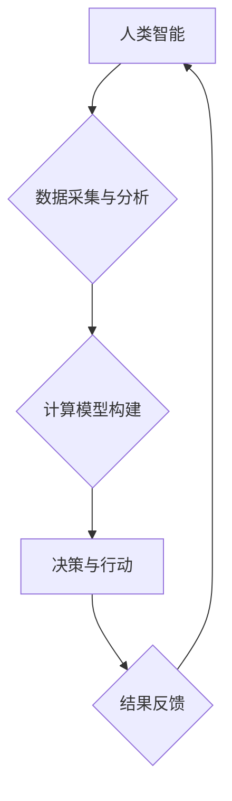

                 

## 人类计算：可持续发展的推动力

> 关键词： 人类计算、可持续发展、人工智能、计算模型、算法优化、数据驱动、伦理考量、未来趋势

### 1. 背景介绍

在当今数据爆炸和计算能力飞速发展的时代，人类面临着前所未有的机遇和挑战。传统计算模式已经难以满足日益增长的需求，而人类计算作为一种新兴的计算范式，正逐渐成为推动可持续发展的重要力量。

人类计算是指将人类的智慧、创造力和决策能力与计算机技术相结合，共同完成复杂的任务。它打破了传统计算模式的局限性，充分利用了人类的认知优势和灵活适应能力，从而能够解决传统计算难以处理的复杂问题。

可持续发展是人类社会面临的重大课题，它要求我们平衡经济发展、社会进步和环境保护之间的关系。人类计算在可持续发展中扮演着越来越重要的角色，它能够帮助我们：

* **优化资源分配:** 通过数据分析和预测模型，人类计算可以帮助我们更有效地分配资源，减少浪费和提高效率。
* **促进创新发展:** 人类计算可以激发人类的创造力和创新能力，推动科技进步和产业升级。
* **应对环境挑战:** 人类计算可以帮助我们监测环境变化、预测自然灾害和开发可持续能源技术。

### 2. 核心概念与联系

人类计算的核心概念包括：

* **人类智能:** 指人类的认知能力、决策能力、创造能力和社会交互能力等。
* **计算技术:** 指计算机硬件、软件、算法和网络等技术手段。
* **数据驱动:** 指利用海量数据进行分析和决策，以提高计算效率和准确性。
* **协同合作:** 指人类和计算机之间进行协同合作，共同完成复杂任务。

**Mermaid 流程图:**



### 3. 核心算法原理 & 具体操作步骤

#### 3.1  算法原理概述

人类计算的核心算法原理是将人类的认知过程模拟成计算机程序，并通过数据驱动和协同合作的方式，实现智能决策和问题解决。常见的算法包括：

* **机器学习:** 通过训练数据，让计算机学习并预测未来结果。
* **深度学习:** 利用多层神经网络，模拟人类大脑的学习过程。
* **自然语言处理:** 帮助计算机理解和处理人类语言。
* **计算机视觉:** 帮助计算机识别和理解图像和视频。

#### 3.2  算法步骤详解

以机器学习为例，其基本步骤包括：

1. **数据收集:** 收集与目标任务相关的海量数据。
2. **数据预处理:** 对数据进行清洗、转换和特征提取。
3. **模型选择:** 选择合适的机器学习算法模型。
4. **模型训练:** 利用训练数据训练模型参数，使其能够学习数据中的规律。
5. **模型评估:** 使用测试数据评估模型的性能，并进行调优。
6. **模型部署:** 将训练好的模型部署到实际应用场景中。

#### 3.3  算法优缺点

**优点:**

* **自动化决策:** 可以自动完成重复性任务，提高效率。
* **数据驱动:** 基于数据分析，决策更加客观和准确。
* **持续学习:** 可以不断学习新的数据，提高模型性能。

**缺点:**

* **数据依赖:** 需要大量高质量数据进行训练。
* **黑盒效应:** 模型内部决策机制难以解释。
* **伦理风险:** 可能存在算法偏见和歧视问题。

#### 3.4  算法应用领域

人类计算算法广泛应用于各个领域，例如：

* **医疗保健:** 疾病诊断、药物研发、个性化治疗。
* **金融服务:** 风险评估、欺诈检测、投资决策。
* **教育:** 个性化学习、智能辅导、教育资源推荐。
* **交通运输:** 智能驾驶、交通流量预测、物流优化。

### 4. 数学模型和公式 & 详细讲解 & 举例说明

#### 4.1  数学模型构建

人类计算中的数学模型通常用于描述人类智能和计算过程。例如，神经网络模型可以模拟人类大脑的神经元连接和信息传递过程。

#### 4.2  公式推导过程

以神经网络为例，其核心公式是激活函数。激活函数用于将神经元的输入信号转换为输出信号，并决定神经元是否被激活。常见的激活函数包括 sigmoid 函数、ReLU 函数和 tanh 函数。

**公式:**

$$
f(x) = \frac{1}{1 + e^{-x}}
$$

**解释:**

sigmoid 函数将输入信号映射到 0 到 1 之间，常用于二分类问题。

#### 4.3  案例分析与讲解

假设我们训练一个神经网络模型来识别猫和狗的图片。模型的输入是图片像素数据，输出是猫和狗的概率。

通过训练数据，模型会学习到猫和狗的特征，并调整神经网络参数，使得模型能够准确识别猫和狗。

### 5. 项目实践：代码实例和详细解释说明

#### 5.1  开发环境搭建

人类计算项目通常需要使用 Python 语言和相关的机器学习库，例如 TensorFlow 或 PyTorch。

#### 5.2  源代码详细实现

以下是一个简单的机器学习代码实例，用于识别手写数字：

```python
import tensorflow as tf

# 定义模型结构
model = tf.keras.models.Sequential([
  tf.keras.layers.Flatten(input_shape=(28, 28)),
  tf.keras.layers.Dense(128, activation='relu'),
  tf.keras.layers.Dense(10, activation='softmax')
])

# 编译模型
model.compile(optimizer='adam',
              loss='sparse_categorical_crossentropy',
              metrics=['accuracy'])

# 训练模型
model.fit(x_train, y_train, epochs=5)

# 评估模型
loss, accuracy = model.evaluate(x_test, y_test)
print('Accuracy:', accuracy)
```

#### 5.3  代码解读与分析

这段代码定义了一个简单的深度学习模型，用于识别手写数字。

* `tf.keras.models.Sequential` 创建了一个顺序模型，其中层级依次连接。
* `tf.keras.layers.Flatten` 将输入图像数据转换为一维向量。
* `tf.keras.layers.Dense` 定义了全连接层，用于学习特征。
* `activation='relu'` 使用 ReLU 激活函数。
* `optimizer='adam'` 使用 Adam 优化器进行模型训练。
* `loss='sparse_categorical_crossentropy'` 使用交叉熵损失函数。
* `metrics=['accuracy']` 使用准确率作为评估指标。

#### 5.4  运行结果展示

训练完成后，模型可以用来预测新的手写数字。

### 6. 实际应用场景

#### 6.1  医疗保健

* **疾病诊断:** 人工智能可以分析患者的医疗影像、病历和基因信息，辅助医生进行疾病诊断。
* **药物研发:** 人工智能可以加速药物研发过程，例如预测药物的有效性和安全性。
* **个性化治疗:** 人工智能可以根据患者的个体特征，制定个性化的治疗方案。

#### 6.2  金融服务

* **风险评估:** 人工智能可以分析客户的财务数据，评估其信用风险和投资风险。
* **欺诈检测:** 人工智能可以识别异常交易行为，防止金融欺诈。
* **投资决策:** 人工智能可以分析市场数据，提供投资建议。

#### 6.3  教育

* **个性化学习:** 人工智能可以根据学生的学习进度和能力，提供个性化的学习内容和辅导。
* **智能辅导:** 人工智能可以解答学生的疑问，提供学习指导。
* **教育资源推荐:** 人工智能可以推荐相关的学习资源，帮助学生更好地学习。

#### 6.4  未来应用展望

人类计算在未来将发挥更加重要的作用，例如：

* **智能城市:** 人工智能可以帮助构建智慧城市，提高城市管理效率和居民生活质量。
* **自动驾驶:** 人工智能可以推动自动驾驶技术的发展，提高交通安全和效率。
* **个性化体验:** 人工智能可以提供更加个性化的产品和服务，满足用户的个性化需求。

### 7. 工具和资源推荐

#### 7.1  学习资源推荐

* **在线课程:** Coursera、edX、Udacity 等平台提供丰富的机器学习和人工智能课程。
* **书籍:** 《深度学习》、《机器学习实战》等书籍是学习人工智能的经典教材。
* **开源项目:** TensorFlow、PyTorch 等开源项目提供了丰富的代码示例和学习资源。

#### 7.2  开发工具推荐

* **Python:** 人工智能开发的常用编程语言。
* **TensorFlow:** 深度学习框架。
* **PyTorch:** 深度学习框架。
* **Jupyter Notebook:** 用于代码编写和可视化分析的工具。

#### 7.3  相关论文推荐

* **《ImageNet Classification with Deep Convolutional Neural Networks》:** 提出了 AlexNet 模型，标志着深度学习的兴起。
* **《Attention Is All You Need》:** 提出了 Transformer 模型， revolutionized natural language processing.
* **《BERT: Pre-training of Deep Bidirectional Transformers for Language Understanding》:** 提出了 BERT 模型，在自然语言理解任务中取得了突破性进展。

### 8. 总结：未来发展趋势与挑战

#### 8.1  研究成果总结

人类计算在过去几年取得了显著进展，例如：

* **算法性能提升:** 人工智能算法的性能不断提升，在许多领域取得了超越人类水平的成果。
* **应用场景拓展:** 人工智能应用场景不断拓展，覆盖医疗、金融、教育等多个领域。
* **技术融合:** 人工智能与其他技术，例如物联网、云计算和区块链，融合发展，催生新的应用场景。

#### 8.2  未来发展趋势

未来人类计算的发展趋势包括：

* **更智能的算法:** 研究更智能、更鲁棒、更可解释的算法。
* **更广泛的应用:** 将人工智能应用到更多领域，例如科学研究、艺术创作和社会治理。
* **更安全的系统:** 确保人工智能系统安全可靠，防止算法偏见和恶意攻击。

#### 8.3  面临的挑战

人类计算也面临着一些挑战，例如：

* **数据隐私:** 人工智能算法依赖大量数据，如何保护数据隐私是一个重要问题。
* **算法偏见:** 人工智能算法可能存在偏见，导致不公平的结果。
* **伦理风险:** 人工智能的快速发展引发了伦理问题，例如人工智能的责任和义务。

#### 8.4  研究展望

未来研究需要关注以下方面：

* **开发更安全、更可靠的人工智能算法。**
* **解决人工智能算法的偏见问题。**
* **制定人工智能的伦理规范和法律法规。**
* **促进人工智能与人类和谐共处。**

### 9. 附录：常见问题与解答

**Q1: 人类计算与传统计算有什么区别？**

**A1:** 传统计算依赖于预先定义的算法和规则，而人类计算则更加灵活，能够学习和适应新的情况。

**Q2: 人类计算有哪些应用场景？**

**A2:** 人类计算应用场景广泛，例如医疗保健、金融服务、教育、交通运输等。

**Q3: 人类计算有哪些伦理风险？**

**A3:** 人类计算可能存在算法偏见、数据隐私泄露和人工智能失控等伦理风险。

**Q4: 如何学习人类计算？**

**A4:** 可以通过在线课程、书籍和开源项目学习人类计算相关知识。


作者：禅与计算机程序设计艺术 / Zen and the Art of Computer Programming 
<end_of_turn>

