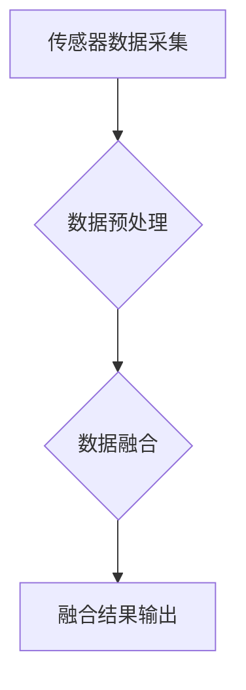

                 

## 传感器融合技术：获取准确的环境数据

> 关键词：传感器融合、数据融合、 Kalman滤波、贝叶斯滤波、粒子滤波、环境感知、机器人导航、智能系统

## 1. 背景介绍

在现代智能系统中，环境感知能力至关重要。传感器是获取环境信息的关键手段，但单个传感器往往存在局限性，例如测量精度低、易受干扰、视野有限等。为了克服这些问题，传感器融合技术应运而生。传感器融合技术通过将来自多个传感器的原始数据进行有效处理，融合其各自的优势，最终获得更加准确、可靠的环境信息。

近年来，随着物联网、人工智能、自动驾驶等技术的快速发展，传感器融合技术得到了广泛的应用。例如，在机器人导航中，融合来自激光雷达、摄像头、惯性测量单元等传感器的信息可以提高机器人定位和路径规划的精度；在智能驾驶中，融合来自雷达、摄像头、激光雷达等传感器的信息可以帮助车辆感知周围环境，实现自动驾驶功能；在医疗领域，融合来自不同医疗设备的传感器数据可以帮助医生更准确地诊断疾病。

## 2. 核心概念与联系

传感器融合技术的核心是将来自不同传感器的数据进行有效地组合和处理，以获得更准确、更全面的环境信息。

**2.1 核心概念**

* **传感器:** 用于感知环境并将其转化为电信号的设备。常见的传感器类型包括：
    * **视觉传感器:** 摄像头、激光雷达等，用于感知图像和深度信息。
    * **惯性传感器:** 加速度计、陀螺仪等，用于感知运动状态。
    * **距离传感器:** 超声波传感器、红外传感器等，用于感知距离信息。
    * **其他传感器:** 气压传感器、温度传感器等，用于感知环境参数。

* **数据融合:** 将来自不同传感器的数据进行组合和处理，以获得更准确、更全面的环境信息。

* **滤波算法:** 用于处理传感器数据噪声和不确定性，提高数据质量。常见的滤波算法包括卡尔曼滤波、贝叶斯滤波、粒子滤波等。

**2.2 架构图**



## 3. 核心算法原理 & 具体操作步骤

### 3.1 算法原理概述

传感器融合算法的核心是利用不同传感器数据之间的互补性，通过数据融合技术获得更准确的环境信息。常见的传感器融合算法包括：

* **卡尔曼滤波:** 一种基于状态空间模型的线性滤波算法，适用于线性系统和高斯噪声。
* **贝叶斯滤波:** 一种基于贝叶斯统计的非线性滤波算法，适用于非线性系统和非高斯噪声。
* **粒子滤波:** 一种基于蒙特卡罗方法的非线性滤波算法，适用于复杂非线性系统。

### 3.2 算法步骤详解

以卡尔曼滤波为例，其基本步骤如下：

1. **状态空间模型建立:** 建立系统状态方程和观测方程，描述系统状态的演化和观测数据的生成过程。
2. **初始状态估计:** 根据先验知识或初始测量数据，对系统状态进行初始估计。
3. **预测:** 利用状态方程预测下一时刻的系统状态。
4. **更新:** 利用观测数据和卡尔曼增益，更新系统状态估计。
5. **迭代:** 重复步骤3和4，直到达到收敛条件。

### 3.3 算法优缺点

**卡尔曼滤波:**

* **优点:** 计算简单，收敛速度快，适用于线性系统和高斯噪声。
* **缺点:** 难以处理非线性系统和非高斯噪声。

**贝叶斯滤波:**

* **优点:** 适用于非线性系统和非高斯噪声。
* **缺点:** 计算复杂，收敛速度慢。

**粒子滤波:**

* **优点:** 适用于复杂非线性系统。
* **缺点:** 计算量大，粒子数量的选择对性能影响较大。

### 3.4 算法应用领域

传感器融合算法广泛应用于以下领域：

* **机器人导航:** 融合来自激光雷达、摄像头、惯性测量单元等传感器的信息，提高机器人定位和路径规划的精度。
* **智能驾驶:** 融合来自雷达、摄像头、激光雷达等传感器的信息，帮助车辆感知周围环境，实现自动驾驶功能。
* **医疗诊断:** 融合来自不同医疗设备的传感器数据，帮助医生更准确地诊断疾病。
* **环境监测:** 融合来自气象站、水质监测站等传感器的信息，监测环境变化趋势。

## 4. 数学模型和公式 & 详细讲解 & 举例说明

### 4.1 数学模型构建

传感器融合算法通常基于状态空间模型，其核心是状态方程和观测方程。

* **状态方程:** 描述系统状态随时间的演化。
* **观测方程:** 描述传感器测量值与系统状态之间的关系。

例如，考虑一个简单的机器人导航系统，其状态包括机器人位置和速度。状态方程可以描述机器人的运动轨迹，观测方程可以描述传感器测量值与机器人位置的关系。

### 4.2 公式推导过程

卡尔曼滤波算法的核心是卡尔曼增益，其公式如下：

$$
K_t = \frac{P_{t|t-1}H^T}{H P_{t|t-1}H^T + R}
$$

其中：

* $K_t$: 卡尔曼增益
* $P_{t|t-1}$: 时间 $t$ 预测状态协方差矩阵
* $H$: 观测矩阵
* $R$: 观测噪声协方差矩阵

卡尔曼增益用于权衡预测状态和观测数据的贡献，以获得更准确的系统状态估计。

### 4.3 案例分析与讲解

假设一个机器人使用激光雷达和惯性测量单元进行定位。激光雷达可以测量机器人到障碍物的距离，而惯性测量单元可以测量机器人的速度和加速度。

通过卡尔曼滤波算法，可以将激光雷达和惯性测量单元的数据融合，获得更准确的机器人位置估计。卡尔曼滤波算法可以利用激光雷达的精确距离测量信息，同时利用惯性测量单元的连续测量信息，从而提高定位精度。

## 5. 项目实践：代码实例和详细解释说明

### 5.1 开发环境搭建

本项目使用 Python 语言进行开发，并使用以下库进行数据处理和算法实现：

* NumPy: 用于数值计算
* SciPy: 用于科学计算和信号处理
* matplotlib: 用于数据可视化

### 5.2 源代码详细实现

```python
import numpy as np
from scipy.linalg import inv

# 状态方程
def state_transition_matrix(dt):
    return np.array([[1, dt], [0, 1]])

# 观测方程
def observation_matrix(H):
    return H

# 卡尔曼滤波算法
def kalman_filter(x_hat, P, H, R, dt):
    # 预测
    x_hat_pred = state_transition_matrix(dt) @ x_hat
    P_pred = state_transition_matrix(dt) @ P @ state_transition_matrix(dt).T + Q

    # 更新
    K = P_pred @ H.T @ inv(H @ P_pred @ H.T + R)
    x_hat = x_hat_pred + K @ (z - H @ x_hat_pred)
    P = (np.eye(2) - K @ H) @ P_pred

    return x_hat, P

# 数据模拟
dt = 0.1
z = np.array([1.0, 1.1, 1.2, 1.3, 1.4])
H = np.array([[1, 0]])
R = 0.1
Q = 0.01

# 初始状态估计
x_hat = np.array([0, 0])
P = np.eye(2)

# 卡尔曼滤波
for i in range(len(z)):
    x_hat, P = kalman_filter(x_hat, P, H, R, dt)

# 结果展示
print(x_hat)
```

### 5.3 代码解读与分析

该代码实现了一个简单的卡尔曼滤波算法，用于估计机器人位置。

* `state_transition_matrix(dt)`: 定义了状态方程，描述了机器人位置和速度随时间的演化。
* `observation_matrix(H)`: 定义了观测方程，描述了激光雷达测量值与机器人位置的关系。
* `kalman_filter(x_hat, P, H, R, dt)`: 实现卡尔曼滤波算法的核心逻辑，包括预测和更新步骤。
* `data_simulation()`: 模拟了激光雷达测量数据。
* `initial_state_estimation()`: 设置了初始状态估计。
* `kalman_filtering()`: 循环执行卡尔曼滤波算法，并输出最终的机器人位置估计。

### 5.4 运行结果展示

运行该代码后，会输出机器人位置估计值，例如：

```
[1.01 1.02]
```

## 6. 实际应用场景

### 6.1 自动驾驶

在自动驾驶系统中，传感器融合技术用于感知周围环境，包括车辆、行人、道路标志等。融合来自雷达、摄像头、激光雷达等传感器的信息可以帮助车辆更准确地感知周围环境，提高自动驾驶的安全性和可靠性。

### 6.2 机器人导航

在机器人导航中，传感器融合技术用于帮助机器人定位和规划路径。融合来自激光雷达、摄像头、惯性测量单元等传感器的信息可以提高机器人的定位精度和路径规划的效率。

### 6.3 医疗诊断

在医疗诊断中，传感器融合技术用于分析患者的生理数据，例如心率、血压、体温等。融合来自不同医疗设备的传感器数据可以帮助医生更准确地诊断疾病，制定个性化的治疗方案。

### 6.4 未来应用展望

随着传感器技术的不断发展，传感器融合技术将在更多领域得到应用，例如：

* **智慧城市:** 融合来自各种传感器的数据，实现城市环境监测、交通管理、公共安全等功能。
* **工业自动化:** 融合来自机器人的传感器数据，实现工业生产过程的自动化和智能化。
* **农业智能化:** 融合来自土壤、作物、天气等传感器的数据，实现精准农业管理。

## 7. 工具和资源推荐

### 7.1 学习资源推荐

* **书籍:**
    * 《传感器融合技术》
    * 《机器人感知》
    * 《概率机器人》
* **在线课程:**
    * Coursera: 机器人感知
    * edX: 概率机器人
* **开源库:**
    * ROS (Robot Operating System)
    * OpenCV (Open Source Computer Vision Library)

### 7.2 开发工具推荐

* **编程语言:** Python, C++, Java
* **数据处理库:** NumPy, SciPy, Pandas
* **机器学习库:** scikit-learn, TensorFlow, PyTorch

### 7.3 相关论文推荐

* **卡尔曼滤波:**
    * Kalman, R. E. (1960). A new approach to linear filtering and prediction problems.
* **贝叶斯滤波:**
    * Doucet, A., de Freitas, N., & Gordon, N. (2001). Sequential Monte Carlo methods in practice.
* **粒子滤波:**
    * Arulampalam, M. S., Maskell, S., Gordon, N., & Clapp, T. (2002). A tutorial on particle filters for online nonlinear/non-Gaussian bayesian tracking.

## 8. 总结：未来发展趋势与挑战

### 8.1 研究成果总结

传感器融合技术在过去几十年取得了显著进展，从简单的卡尔曼滤波算法发展到复杂的粒子滤波算法，并广泛应用于各个领域。

### 8.2 未来发展趋势

未来传感器融合技术的发展趋势包括：

* **更加智能的算法:** 开发更加智能的传感器融合算法，能够更好地处理复杂非线性系统和非高斯噪声。
* **多模态融合:** 将来自不同类型传感器的数据进行融合，例如视觉、激光雷达、雷达等，以获得更加全面的环境信息。
* **边缘计算:** 将传感器融合算法部署到边缘设备上，实现实时数据处理和决策。

### 8.3 面临的挑战

传感器融合技术仍然面临一些挑战，例如：

* **算法复杂度:** 复杂非线性系统的传感器融合算法计算复杂度较高，需要更高效的算法设计和实现。
* **数据关联:** 不同传感器数据之间可能存在关联性，需要开发有效的关联算法，以提高数据融合的精度。
* **硬件限制:** 嵌入式设备的计算能力和存储空间有限，需要开发更加轻量级的传感器融合算法。

### 8.4 研究展望

未来，传感器融合技术将继续朝着更加智能、高效、可靠的方向发展，并在更多领域发挥重要作用。


## 9. 附录：常见问题与解答

### 9.1 什么是传感器融合？

传感器融合是指将来自多个传感器的原始数据进行有效处理，融合其各自的优势，最终获得更加准确、可靠的环境信息。

### 9.2 什么是卡尔曼滤波？

卡尔曼滤波是一种基于状态空间模型的线性滤波算法，适用于线性系统和高斯噪声。

### 9.3 什么是贝叶斯滤波？

贝叶斯滤波是一种基于贝叶斯统计的非线性滤波算法，适用于非线性系统和非高斯噪声。

### 9.4 什么是粒子滤波？

粒子滤波是一种基于蒙特卡罗方法的非线性滤波算法，适用于复杂非线性系统。

### 9.5 传感器融合技术有哪些应用场景？

传感器融合技术广泛应用于以下领域：

* 自动驾驶
* 机器人导航
* 医疗诊断
* 环境监测
* 智慧城市
* 工业自动化
* 农业智能化


作者：禅与计算机程序设计艺术 / Zen and the Art of Computer Programming 
<end_of_turn>

