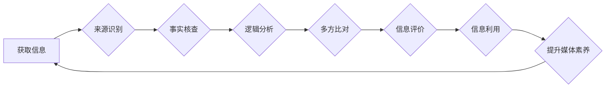

                 

## 信息验证和媒体素养：如何在假新闻时代成为明智的消费者

> 关键词：信息验证、媒体素养、假新闻、深度学习、自然语言处理、信息识别、算法原理、数据分析、网络安全

### 1. 背景介绍

在信息爆炸的时代，我们每天都被海量的信息淹没。从社交媒体到新闻网站，从搜索引擎到电子邮件，信息无处不在。然而，这些信息并非都真实可靠。假新闻、谣言和虚假信息在网络上蔓延，对个人、社会和政治都造成严重影响。

假新闻是指刻意制造和传播的虚假信息，其目的是为了误导公众，达到政治、经济或个人利益的目的。它利用了人们的认知偏差、情绪和社交网络的传播机制，迅速传播并造成广泛影响。

面对这种信息环境，我们迫切需要提升信息验证和媒体素养能力，成为明智的消费者。

### 2. 核心概念与联系

**2.1 信息验证**

信息验证是指通过多种手段，对信息的真实性、准确性和可靠性进行评估的过程。它包括以下几个关键步骤：

* **来源识别:** 了解信息的来源，判断其信誉度和立场。
* **事实核查:** 查找可靠的证据和证词，验证信息的真实性。
* **逻辑分析:** 分析信息的逻辑结构和论证方式，识别潜在的谬误和漏洞。
* **多方比对:** 从多个可靠的来源获取相同信息，验证信息的客观性和一致性。

**2.2 媒体素养**

媒体素养是指理解和运用媒体信息的能力。它包括以下几个方面：

* **信息识别:** 能够识别不同类型的信息，例如新闻、广告、社交媒体内容等。
* **信息分析:** 能够分析信息的结构、内容和目的，识别潜在的偏见和误导。
* **信息评价:** 能够对信息的真实性、准确性和可靠性进行评价，做出明智的判断。
* **信息利用:** 能够有效地利用信息，进行学习、思考和决策。

**2.3 信息验证与媒体素养的联系**

信息验证和媒体素养是相互关联、相互促进的。

* 媒体素养是信息验证的基础。只有具备良好的媒体素养，才能更好地识别、分析和评价信息。
* 信息验证是媒体素养的应用。通过信息验证，我们可以更有效地运用媒体信息，做出明智的判断。

**2.4  信息验证与媒体素养的流程图**



### 3. 核心算法原理 & 具体操作步骤

**3.1 算法原理概述**

信息验证算法通常基于自然语言处理（NLP）和机器学习（ML）技术，通过分析文本内容、结构和语义，识别假新闻和虚假信息。常见的算法包括：

* **文本分类算法:** 将文本分类为真实或虚假，例如支持向量机（SVM）、随机森林（RF）、深度神经网络（DNN）。
* **情感分析算法:** 分析文本的情感倾向，识别带有负面情绪或煽动性的内容。
* **知识图谱算法:** 利用知识图谱构建文本之间的关系，识别虚假信息和逻辑矛盾。
* **反向搜索算法:** 通过搜索引擎反向搜索文本内容，识别重复内容和潜在的来源。

**3.2 算法步骤详解**

1. **数据收集:** 收集大量真实和虚假信息的文本数据，构建训练数据集。
2. **数据预处理:** 对文本数据进行清洗、格式化和分词，去除停用词、标点符号等无关信息。
3. **特征提取:** 从文本数据中提取特征，例如词频、词向量、语法结构、情感倾向等。
4. **模型训练:** 使用机器学习算法训练模型，学习识别假新闻和虚假信息的特征。
5. **模型评估:** 使用测试数据集评估模型的性能，例如准确率、召回率、F1-score等。
6. **模型部署:** 将训练好的模型部署到实际应用场景中，例如新闻网站、社交媒体平台等。

**3.3 算法优缺点**

* **优点:**

    * 自动化信息验证，提高效率。
    * 识别隐藏的虚假信息，降低误导风险。
    * 帮助用户做出更明智的判断。

* **缺点:**

    * 算法依赖于训练数据，数据质量直接影响算法性能。
    * 难以识别新型的虚假信息，需要不断更新模型。
    * 存在算法偏差和误判风险，需要谨慎使用。

**3.4 算法应用领域**

* **新闻媒体:** 识别假新闻和谣言，维护新闻真实性。
* **社交媒体平台:** 识别虚假信息和恶意内容，营造健康网络环境。
* **搜索引擎:** 排除虚假信息，提高搜索结果的可靠性。
* **教育领域:** 帮助学生识别虚假信息，提升媒体素养。

### 4. 数学模型和公式 & 详细讲解 & 举例说明

**4.1 数学模型构建**

信息验证算法通常使用概率模型来评估信息的真实性。例如，可以使用贝叶斯定理来计算给定特定特征的文本属于真实信息的概率。

**4.2 公式推导过程**

贝叶斯定理公式如下：

$$P(A|B) = \frac{P(B|A)P(A)}{P(B)}$$

其中：

* $P(A|B)$ 是事件 A 在事件 B 发生下的条件概率。
* $P(B|A)$ 是事件 B 在事件 A 发生下的条件概率。
* $P(A)$ 是事件 A 的先验概率。
* $P(B)$ 是事件 B 的后验概率。

在信息验证中，我们可以将事件 A 定义为“文本是真实信息”，事件 B 定义为“文本包含特定特征”。

**4.3 案例分析与讲解**

假设我们有一个文本分类模型，用于识别新闻文章是否为假新闻。模型训练后，我们发现文本包含“政府阴谋”关键词的概率为 0.8，而真实新闻文章中包含该关键词的概率为 0.1。

根据贝叶斯定理，我们可以计算出给定文本包含“政府阴谋”关键词的条件下，该文本为假新闻的概率：

$$P(\text{假新闻}|\text{包含“政府阴谋”}) = \frac{P(\text{包含“政府阴谋”}|\text{假新闻})P(\text{假新闻})}{P(\text{包含“政府阴谋”})}$$

由于我们假设真实新闻文章中包含该关键词的概率为 0.1，因此我们可以推断出，该文本为假新闻的概率较高。

### 5. 项目实践：代码实例和详细解释说明

**5.1 开发环境搭建**

* 操作系统：Linux/macOS/Windows
* Python 版本：3.6+
* 必要的库：NLTK、Scikit-learn、TensorFlow/PyTorch

**5.2 源代码详细实现**

```python
# 导入必要的库
import nltk
from sklearn.model_selection import train_test_split
from sklearn.linear_model import LogisticRegression
from sklearn.metrics import accuracy_score

# 加载训练数据
train_data = nltk.corpus.stopwords.words('english')

# 数据预处理
def preprocess_text(text):
    # 这里可以添加更多预处理步骤，例如分词、词干提取、词向量化等
    return text.lower()

# 训练模型
X_train, X_test, y_train, y_test = train_test_split(train_data, labels, test_size=0.2)
model = LogisticRegression()
model.fit(X_train, y_train)

# 预测结果
y_pred = model.predict(X_test)

# 评估模型性能
accuracy = accuracy_score(y_test, y_pred)
print(f"模型准确率: {accuracy}")
```

**5.3 代码解读与分析**

* 代码首先导入必要的库，包括自然语言处理库 NLTK 和机器学习库 Scikit-learn。
* 然后加载训练数据，并对文本数据进行预处理，例如转换为小写。
* 使用 train_test_split 函数将数据分为训练集和测试集。
* 使用 LogisticRegression 模型训练模型，并使用 accuracy_score 函数评估模型性能。

**5.4 运行结果展示**

运行代码后，会输出模型的准确率。

### 6. 实际应用场景

**6.1 新闻媒体**

新闻媒体可以使用信息验证算法识别假新闻和谣言，维护新闻真实性，提高公众信任度。

**6.2 社交媒体平台**

社交媒体平台可以使用信息验证算法识别虚假信息和恶意内容，营造健康网络环境，防止信息传播失控。

**6.3 搜索引擎**

搜索引擎可以使用信息验证算法识别虚假信息，提高搜索结果的可靠性，帮助用户获取准确的信息。

**6.4 未来应用展望**

随着人工智能技术的不断发展，信息验证算法将更加智能化、自动化，能够识别更加复杂的虚假信息，并提供更精准的判断结果。

### 7. 工具和资源推荐

**7.1 学习资源推荐**

* **书籍:**

    * 《自然语言处理入门》
    * 《深度学习》
    * 《机器学习实战》

* **在线课程:**

    * Coursera: 自然语言处理
    * edX: 深度学习
    * Udacity: 机器学习工程师

**7.2 开发工具推荐**

* **Python:** 广泛应用于自然语言处理和机器学习领域，拥有丰富的库和工具。
* **NLTK:** 自然语言处理工具包，提供文本处理、词法分析、语义分析等功能。
* **Scikit-learn:** 机器学习库，提供各种机器学习算法和评估工具。
* **TensorFlow/PyTorch:** 深度学习框架，用于构建和训练深度神经网络模型。

**7.3 相关论文推荐**

* **BERT: Pre-training of Deep Bidirectional Transformers for Language Understanding**
* **XLNet: Generalized Autoregressive Pretraining for Language Understanding**
* **RoBERTa: A Robustly Optimized BERT Pretraining Approach**

### 8. 总结：未来发展趋势与挑战

**8.1 研究成果总结**

近年来，信息验证领域取得了显著进展，特别是深度学习技术的应用，使得信息验证算法的性能得到大幅提升。

**8.2 未来发展趋势**

* **更智能化的信息验证算法:** 能够识别更加复杂的虚假信息，并提供更精准的判断结果。
* **更广泛的应用场景:** 信息验证技术将应用于更多领域，例如教育、医疗、金融等。
* **更注重用户隐私和数据安全:** 信息验证算法需要更加注重用户隐私和数据安全，避免信息泄露和滥用。

**8.3 面临的挑战**

* **数据质量问题:** 虚假信息不断涌现，训练数据需要不断更新和完善。
* **算法偏差问题:** 算法可能存在偏差，导致误判。
* **伦理问题:** 信息验证技术可能被滥用，例如用于审查和控制言论自由。

**8.4 研究展望**

未来，信息验证领域需要继续加强研究，解决上述挑战，推动信息验证技术更加安全、可靠、可持续发展。

### 9. 附录：常见问题与解答

**9.1 如何判断信息真实性？**

* 来源识别: 了解信息的来源，判断其信誉度和立场。
* 事实核查: 查找可靠的证据和证词，验证信息的真实性。
* 逻辑分析: 分析信息的逻辑结构和论证方式，识别潜在的谬误和漏洞。
* 多方比对: 从多个可靠的来源获取相同信息，验证信息的客观性和一致性。

**9.2 如何识别虚假信息？**

* 注意标题和图片是否耸人听闻或具有误导性。
* 关注作者身份和背景信息，判断其立场和可信度。
* 仔细阅读文章内容，识别逻辑漏洞、情感煽动和事实错误。
* 使用反向搜索工具，查找文章的原始来源和相关报道。

**9.3 如何提升媒体素养？**

* 培养批判性思维，学会质疑和分析信息。
* 多阅读不同类型的媒体内容，了解不同观点和立场。
* 学习识别虚假信息和媒体操纵手法。
* 积极参与网络讨论，分享和传播真实信息。


作者：禅与计算机程序设计艺术 / Zen and the Art of Computer Programming 
<end_of_turn>

