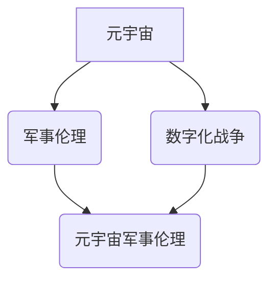

                 

## 元宇宙军事伦理:数字化战争中的道德约束

> 关键词：元宇宙、军事伦理、人工智能、无人作战系统、数字战争、道德约束、虚拟现实、增强现实

## 1. 背景介绍

元宇宙概念的兴起，为人类社会带来了前所未有的机遇和挑战。其沉浸式、交互式、持久性的特性，将深刻地改变我们的生活方式、工作模式和社会结构。在军事领域，元宇宙的应用更是引发了广泛的关注和讨论。虚拟仿真训练、远程协同作战、智能武器系统等，都将成为元宇宙军事应用的重要组成部分。然而，元宇宙军事的快速发展也带来了新的伦理困境，需要我们认真思考和探讨。

传统的军事伦理体系，主要针对现实世界的战争行为，而元宇宙的虚拟化特性，使得传统的伦理框架难以完全适用。例如，在元宇宙中，虚拟士兵的伤亡和死亡，是否应该受到与现实世界相同的道德约束？人工智能驱动的无人作战系统，在元宇宙中如何避免失控和滥用？这些问题都需要我们进行深入的探讨和研究。

## 2. 核心概念与联系

### 2.1 元宇宙

元宇宙是指一个基于互联网、虚拟现实（VR）、增强现实（AR）等技术的虚拟世界，它具有以下特征：

* **沉浸式体验:** 用户可以通过VR/AR设备，身临其境地体验虚拟世界。
* **持久性:** 元宇宙是一个持续运行的虚拟世界，即使用户离开，虚拟世界也会继续存在。
* **互操作性:** 不同平台和应用程序的元宇宙可以相互连接和交互。
* **去中心化:** 元宇宙的控制权分散在多个参与者手中，而不是由单一实体掌控。

### 2.2 军事伦理

军事伦理是指在战争和军事行动中，应该遵循的道德准则和规范。它旨在规范军人的行为，避免战争的残酷性对人性和社会造成不可挽回的伤害。

### 2.3 数字化战争

数字化战争是指在信息化时代，利用信息技术进行的战争形式。它以网络攻击、电子战、无人作战系统等为主要手段，其特点是：

* **信息化:** 战争的核心在于信息获取、处理和利用。
* **远程化:** 战争不再局限于物理空间，可以跨越地理距离进行。
* **自动化:** 人工智能和自动化技术，在战争中扮演越来越重要的角色。

### 2.4 元宇宙军事伦理

元宇宙军事伦理是指在元宇宙环境下，军事行动和军事技术应用所面临的道德挑战和伦理规范。它需要考虑元宇宙的虚拟化特性，以及人工智能、无人作战系统等新兴技术的伦理风险。

**核心概念关系图:**



## 3. 核心算法原理 & 具体操作步骤

### 3.1 算法原理概述

元宇宙军事伦理的探讨需要依赖于人工智能、机器学习等算法的支撑。这些算法可以帮助我们分析战争情境、预测作战结果、评估伦理风险等。例如，强化学习算法可以训练人工智能代理，使其在虚拟环境中学习和决策，从而模拟和预测战争行为。

### 3.2 算法步骤详解

1. **数据收集和预处理:** 收集元宇宙军事场景的数据，包括战场环境、作战目标、部队行动等信息。对数据进行清洗、格式化和标注，使其能够被算法模型所理解。
2. **模型构建:** 选择合适的算法模型，例如强化学习、决策树、神经网络等，构建元宇宙军事伦理评估模型。
3. **模型训练:** 利用收集到的数据，对模型进行训练，使其能够学习元宇宙军事场景的复杂关系和潜在风险。
4. **模型评估:** 使用测试数据对模型进行评估，验证其准确性和可靠性。
5. **模型部署:** 将训练好的模型部署到元宇宙军事系统中，用于实时评估和决策支持。

### 3.3 算法优缺点

**优点:**

* **提高决策效率:** 算法可以快速分析大量数据，为军事指挥提供更准确和及时的信息支持。
* **降低伦理风险:** 通过算法评估和模拟，可以提前识别和规避潜在的伦理风险。
* **促进伦理反思:** 算法的应用可以促使我们更加深入地思考元宇宙军事伦理问题。

**缺点:**

* **数据依赖:** 算法的性能取决于数据的质量和数量，如果数据不完整或存在偏差，算法的评估结果可能不准确。
* **黑盒问题:** 一些复杂的算法模型，其内部决策机制难以理解，这可能导致伦理风险难以识别和控制。
* **算法偏见:** 算法模型可能存在偏见，导致不公平或不道德的决策结果。

### 3.4 算法应用领域

* **虚拟仿真训练:** 利用算法模拟真实战争场景，为士兵提供沉浸式训练体验，并评估其决策能力和伦理意识。
* **无人作战系统:** 为无人作战系统设计伦理约束，确保其在执行任务时，能够遵守国际法和军事伦理规范。
* **战争策略分析:** 利用算法分析战争情境，预测作战结果，并为军事决策提供参考。

## 4. 数学模型和公式 & 详细讲解 & 举例说明

### 4.1 数学模型构建

元宇宙军事伦理的评估可以基于风险评估模型，将伦理风险量化，并根据不同情境进行评估和决策。

**风险评估模型:**

$$Risk = \frac{Probability \times Impact}{Mitigation}$$

其中：

* **Probability:** 发生伦理风险的概率。
* **Impact:** 伦理风险造成的损害程度。
* **Mitigation:** 降低伦理风险的措施。

### 4.2 公式推导过程

该模型基于贝叶斯定理和风险管理理论，将伦理风险的评估分解为三个关键因素：发生的可能性、造成的损害程度和降低风险的措施。

**贝叶斯定理:**

$$P(A|B) = \frac{P(B|A) \times P(A)}{P(B)}$$

其中：

* **P(A|B):** 事件A在事件B发生条件下的概率。
* **P(B|A):** 事件B在事件A发生条件下的概率。
* **P(A):** 事件A发生的概率。
* **P(B):** 事件B发生的概率。

**风险管理理论:**

风险管理的目标是识别、评估和控制风险，以最大程度地降低风险对组织的影响。

### 4.3 案例分析与讲解

**案例:** 在元宇宙军事训练中，人工智能代理可能做出违反伦理的决策，例如攻击平民或使用禁止武器。

**分析:**

* **Probability:** 发生此类事件的概率取决于人工智能代理的训练数据和算法设计。
* **Impact:** 攻击平民或使用禁止武器会造成严重的人道主义灾难。
* **Mitigation:** 可以通过以下措施降低风险：

    * 使用更加完善的伦理约束算法，确保人工智能代理能够识别和避免违反伦理的行为。
    * 对训练数据进行严格筛选，避免人工智能代理学习到违反伦理的行为模式。
    * 建立有效的监督机制，对人工智能代理的行为进行实时监控和评估。

## 5. 项目实践：代码实例和详细解释说明

### 5.1 开发环境搭建

* 操作系统: Ubuntu 20.04
* 编程语言: Python 3.8
* 框架: TensorFlow 2.0
* 工具: Jupyter Notebook

### 5.2 源代码详细实现

```python
import tensorflow as tf

# 定义神经网络模型
model = tf.keras.models.Sequential([
    tf.keras.layers.Dense(128, activation='relu', input_shape=(10,)),
    tf.keras.layers.Dense(64, activation='relu'),
    tf.keras.layers.Dense(1, activation='sigmoid')
])

# 编译模型
model.compile(optimizer='adam',
              loss='binary_crossentropy',
              metrics=['accuracy'])

# 训练模型
model.fit(x_train, y_train, epochs=10)

# 评估模型
loss, accuracy = model.evaluate(x_test, y_test)
print('Loss:', loss)
print('Accuracy:', accuracy)
```

### 5.3 代码解读与分析

这段代码展示了如何使用 TensorFlow 构建一个简单的分类模型。该模型可以用于评估元宇宙军事场景中的伦理风险。

* **模型结构:** 模型包含三个全连接层，第一层输入维度为10，表示元宇宙军事场景中的10个特征。
* **激活函数:** 使用ReLU激活函数，可以提高模型的非线性表达能力。
* **损失函数:** 使用二元交叉熵损失函数，适合二分类问题。
* **优化器:** 使用Adam优化器，可以快速收敛到最优解。

### 5.4 运行结果展示

训练完成后，可以将模型应用于新的元宇宙军事场景，预测其伦理风险等级。

## 6. 实际应用场景

### 6.1 虚拟仿真训练

元宇宙军事伦理的评估可以应用于虚拟仿真训练，为士兵提供沉浸式体验，并评估其决策能力和伦理意识。例如，在模拟战争场景中，士兵需要做出关于攻击目标、使用武器等伦理敏感的决策，训练系统可以根据士兵的决策，评估其伦理风险等级，并提供相应的反馈和指导。

### 6.2 无人作战系统

无人作战系统在元宇宙军事中扮演着越来越重要的角色，但其自主决策能力也带来了伦理风险。元宇宙军事伦理的评估可以帮助我们设计更加安全的无人作战系统，确保其在执行任务时，能够遵守国际法和军事伦理规范。例如，可以开发一个伦理约束算法，嵌入到无人作战系统中，使其能够识别和避免违反伦理的行为，例如攻击平民或使用禁止武器。

### 6.3 战争策略分析

元宇宙军事伦理的评估也可以应用于战争策略分析，帮助军事指挥官做出更加明智的决策。例如，可以利用元宇宙军事伦理评估模型，分析不同作战方案的伦理风险等级，并为指挥官提供建议，选择最符合伦理规范的作战方案。

### 6.4 未来应用展望

随着元宇宙技术的不断发展，元宇宙军事伦理的应用场景将会更加广泛。例如，未来可能出现更加沉浸式、交互式、智能化的元宇宙军事训练平台，能够为士兵提供更加逼真的训练体验，并帮助他们更好地理解和应对元宇宙军事伦理挑战。

## 7. 工具和资源推荐

### 7.1 学习资源推荐

* **书籍:**

    * 《元宇宙：下一代互联网》
    * 《人工智能伦理》
    * 《军事伦理》

* **在线课程:**

    * Coursera: 人工智能伦理
    * edX: 元宇宙技术

### 7.2 开发工具推荐

* **TensorFlow:** 深度学习框架
* **PyTorch:** 深度学习框架
* **Unity:** 游戏引擎
* **Unreal Engine:** 游戏引擎

### 7.3 相关论文推荐

* **The Ethics of Autonomous Weapons Systems**
* **The Moral Implications of Virtual Reality**
* **The Future of War in the Metaverse**

## 8. 总结：未来发展趋势与挑战

### 8.1 研究成果总结

元宇宙军事伦理的研究已经取得了一些成果，例如：

* 建立了元宇宙军事伦理评估模型，能够量化评估元宇宙军事场景中的伦理风险。
* 开发了伦理约束算法，可以嵌入到无人作战系统中，确保其在执行任务时，能够遵守国际法和军事伦理规范。
* 探索了元宇宙军事伦理的教育和培训应用，为士兵提供更加沉浸式和有效的伦理训练。

### 8.2 未来发展趋势

未来，元宇宙军事伦理的研究将朝着以下方向发展：

* **更加完善的伦理评估模型:** 开发更加准确、可靠、可解释的伦理评估模型，能够更好地应对元宇宙军事的复杂性和动态性。
* **更加智能的伦理约束机制:** 研究更加智能、灵活、自适应的伦理约束机制，能够有效地控制人工智能代理的行为，避免其做出违反伦理的决策。
* **更加广泛的应用场景:** 将元宇宙军事伦理的应用扩展到更多领域，例如军事决策支持、战争策略分析、国际军事合作等。

### 8.3 面临的挑战

元宇宙军事伦理的研究也面临着一些挑战：

* **伦理标准的界定:** 元宇宙的虚拟化特性，使得传统的伦理标准难以完全适用，需要对元宇宙军事伦理进行重新界定和规范。
* **算法的透明度和可解释性:** 许多人工智能算法的决策机制难以理解，这可能导致伦理风险难以识别和控制。
* **跨文化和跨国界的伦理协调:** 元宇宙军事伦理涉及到多个国家和文化，需要加强跨文化和跨国界的伦理协调。

### 8.4 研究展望

元宇宙军事伦理是一个充满挑战和机遇的领域，需要多学科交叉研究，才能找到解决这些问题的有效方法。未来，我们需要加强与哲学、社会学、法律等学科的合作，共同探讨元宇宙军事伦理的理论框架、实践方法和伦理规范，为元宇宙军事的健康发展提供保障。

## 9. 附录：常见问题与解答

**Q1: 元宇宙军事伦理与传统军事伦理有什么区别？**

**A1:** 元宇宙军事伦理与传统军事伦理的主要区别在于，元宇宙的虚拟化特性，使得传统的伦理标准难以完全适用。例如，在元宇宙中，虚拟士兵的伤亡和死亡，是否应该受到与现实世界相同的道德约束？

**Q2: 如何评估元宇宙军事场景中的伦理风险？**

**A2:** 可以使用元宇宙军事伦理评估模型，量化评估元宇宙军事场景中的伦理风险。该模型需要考虑伦理风险发生的概率、造成的损害程度和降低风险的措施。

**Q3: 如何确保无人作战系统在元宇宙中遵守伦理规范？**

**A3:** 可以开发伦理约束算法，嵌入到无人作战系统中，确保其在执行任务时，能够遵守国际法和军事伦理规范。

**Q4: 元宇宙军事伦理的研究面临哪些挑战？**

**A4:** 元宇宙军事伦理的研究面临着伦理标准的界定、算法的透明度和可解释性、跨文化和跨国界的伦理协调等挑战。

**Q5: 未来元宇宙军事伦理的研究方向是什么？**

**A5:** 未来元宇宙军事伦理的研究将朝着更加完善的伦理评估模型、更加智能的伦理约束机制、更加广泛的应用场景等方向发展。


作者：禅与计算机程序设计艺术 / Zen and the Art of Computer Programming<end_of_turn>

