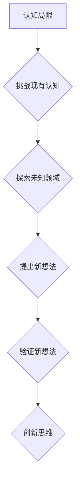

                 

## 创新思维：突破认知局限的方法

> 关键词：创新思维、认知局限、算法设计、数学模型、项目实践、实际应用场景、未来趋势

## 1. 背景介绍

在瞬息万变的科技时代，创新思维已成为企业和个人持续发展的关键驱动力。然而，传统的思维模式往往受限于已有的知识框架和经验，难以突破认知局限，从而阻碍创新。如何培养创新思维，突破认知局限，成为当今社会亟待解决的问题。

本篇文章将从算法设计、数学模型构建、项目实践等多个方面探讨创新思维的本质，并提供一些实用的方法和技巧，帮助读者提升创新能力，在科技领域取得突破性进展。

## 2. 核心概念与联系

创新思维的核心在于跳出既有思维模式，以全新的视角看待问题，并提出新的解决方案。它需要我们不断挑战现有认知，探索未知领域，并勇于尝试新的想法。

**创新思维与算法设计**

算法设计是计算机科学的核心，也是创新思维的体现。一个好的算法不仅要高效、准确，还要具有创新性，能够解决传统算法无法解决的问题。

**创新思维与数学模型构建**

数学模型是抽象思维的工具，能够帮助我们理解和解决复杂问题。构建创新性的数学模型需要我们跳出传统的思维框架，寻找新的表达方式和解决方法。

**创新思维与项目实践**

项目实践是检验创新思维的最佳途径。通过实际项目，我们可以将理论知识转化为实践经验，并不断迭代改进，最终实现创新目标。

**Mermaid 流程图**



## 3. 核心算法原理 & 具体操作步骤

### 3.1  算法原理概述

**遗传算法**是一种模拟自然选择机制的优化算法，它通过迭代的方式，不断优化解空间，最终找到最优解。

遗传算法的核心思想是：

* **编码:** 将问题转化为可以被编码的格式，例如二进制编码。
* **选择:** 根据适应度函数选择优良个体进行交叉和变异。
* **交叉:** 将两个优良个体进行交叉操作，产生新的个体。
* **变异:** 对个体进行随机变异操作，增加算法的探索能力。

### 3.2  算法步骤详解

1. **初始化种群:** 生成初始种群，每个个体都是一个编码。
2. **计算适应度:** 计算每个个体的适应度，适应度越高，个体越优良。
3. **选择:** 根据适应度函数，选择优良个体进行交叉和变异。
4. **交叉:** 将两个优良个体进行交叉操作，产生新的个体。
5. **变异:** 对个体进行随机变异操作，增加算法的探索能力。
6. **重复步骤2-5:** 重复以上步骤，直到达到终止条件，例如最大迭代次数或最优解达到预设目标。

### 3.3  算法优缺点

**优点:**

* 能够解决复杂优化问题。
* 具有全局搜索能力，能够找到全局最优解。
* 对问题的结构要求较低。

**缺点:**

* 算法收敛速度较慢。
* 需要大量的计算资源。
* 难以确定最优参数。

### 3.4  算法应用领域

遗传算法广泛应用于各个领域，例如：

* **机器学习:** 优化模型参数。
* **工程设计:** 优化结构设计。
* **金融投资:** 优化投资组合。
* **生物信息学:** 序列比对和基因预测。

## 4. 数学模型和公式 & 详细讲解 & 举例说明

### 4.1  数学模型构建

遗传算法的数学模型主要包括适应度函数、选择策略、交叉操作和变异操作。

**适应度函数:**

适应度函数用于评估个体的优劣，其值越高，个体越优良。

**选择策略:**

选择策略用于从种群中选择优良个体进行交叉和变异。常见的选择策略包括轮盘赌选择、锦标赛选择等。

**交叉操作:**

交叉操作用于将两个优良个体进行组合，产生新的个体。常见的交叉操作包括单点交叉、双点交叉等。

**变异操作:**

变异操作用于对个体进行随机变异，增加算法的探索能力。常见的变异操作包括比特翻转、基因插入等。

### 4.2  公式推导过程

**适应度函数:**

假设个体 $x$ 的适应度为 $f(x)$，则适应度函数可以表示为：

$$f(x) = \frac{1}{1 + e^{-(x - \mu)/\sigma}}$$

其中，$\mu$ 为平均值，$\sigma$ 为标准差。

**选择策略:**

轮盘赌选择策略的概率公式为：

$$P(x) = \frac{f(x)}{\sum_{i=1}^{N} f(i)}$$

其中，$N$ 为种群大小。

### 4.3  案例分析与讲解

**案例:**

假设我们要用遗传算法优化一个函数 $f(x) = x^2$，目标是找到最小值。

**步骤:**

1. 初始化种群，例如生成 10 个随机数作为初始个体。
2. 计算每个个体的适应度，即 $f(x)$ 的值。
3. 使用轮盘赌选择策略选择两个优良个体进行交叉操作。
4. 对交叉后的个体进行变异操作。
5. 重复步骤 2-4，直到找到最小值。

**结果:**

通过迭代优化，遗传算法最终可以找到函数 $f(x) = x^2$ 的最小值，即 $x = 0$。

## 5. 项目实践：代码实例和详细解释说明

### 5.1  开发环境搭建

本项目使用 Python 语言进行开发，需要安装以下软件：

* Python 3.x
* NumPy
* Matplotlib

### 5.2  源代码详细实现

```python
import numpy as np
import matplotlib.pyplot as plt

# 定义适应度函数
def fitness_function(x):
    return x**2

# 定义种群大小
population_size = 10

# 定义最大迭代次数
max_iterations = 100

# 初始化种群
population = np.random.rand(population_size)

# 迭代优化
for i in range(max_iterations):
    # 计算适应度
    fitness = fitness_function(population)

    # 选择优良个体
    selected_indices = np.random.choice(population_size, size=population_size, p=fitness/np.sum(fitness))

    # 交叉操作
    crossover_points = np.random.randint(0, len(population[0]), size=population_size//2)
    for j in range(0, population_size, 2):
        population[j] = np.concatenate((population[selected_indices[j]][:crossover_points[j]], population[selected_indices[j+1]][crossover_points[j]:]))
        population[j+1] = np.concatenate((population[selected_indices[j+1]][:crossover_points[j]], population[selected_indices[j]][crossover_points[j]:]))

    # 变异操作
    for j in range(population_size):
        mutation_index = np.random.randint(0, len(population[j]))
        population[j][mutation_index] = np.random.rand()

# 打印最优解
best_index = np.argmin(fitness)
best_solution = population[best_index]
print(f"最优解: {best_solution}")

# 绘制结果
plt.plot(population)
plt.xlabel("迭代次数")
plt.ylabel("适应度")
plt.title("遗传算法优化结果")
plt.show()
```

### 5.3  代码解读与分析

* **适应度函数:** `fitness_function(x)` 定义了需要优化的目标函数，在本例中是 $x^2$。
* **种群初始化:** `population = np.random.rand(population_size)` 生成一个随机数矩阵作为初始种群。
* **迭代优化:** 循环迭代，进行选择、交叉和变异操作，不断优化种群。
* **选择策略:** 使用轮盘赌选择策略，选择适应度更高的个体。
* **交叉操作:** 将两个优良个体进行交叉，产生新的个体。
* **变异操作:** 对个体进行随机变异，增加算法的探索能力。
* **结果展示:** 打印最优解，并绘制适应度随迭代次数变化的曲线。

### 5.4  运行结果展示

运行代码后，会输出最优解，并绘制适应度随迭代次数变化的曲线。曲线会显示适应度逐渐提高，最终收敛到最优解。

## 6. 实际应用场景

### 6.1  机器学习

遗传算法可以用于优化机器学习模型的参数，例如神经网络的权重和偏差。通过遗传算法，可以找到更优的模型参数，从而提高模型的精度和性能。

### 6.2  工程设计

遗传算法可以用于优化结构设计，例如桥梁、飞机和汽车等。通过遗传算法，可以找到更轻、更坚固、更经济的结构设计方案。

### 6.3  金融投资

遗传算法可以用于优化投资组合，例如股票、债券和基金等。通过遗传算法，可以找到更符合风险偏好和收益目标的投资组合。

### 6.4  未来应用展望

随着人工智能和计算能力的不断发展，遗传算法的应用场景将会更加广泛。例如，它可以应用于药物研发、生物工程、材料科学等领域。

## 7. 工具和资源推荐

### 7.1  学习资源推荐

* **书籍:**
    * 《Genetic Algorithms in Search, Optimization, and Machine Learning》 by David E. Goldberg
    * 《Evolutionary Computation》 by Melanie Mitchell
* **在线课程:**
    * Coursera: Evolutionary Algorithms
    * edX: Introduction to Genetic Algorithms

### 7.2  开发工具推荐

* **Python:** 
    * SciPy
    * DEAP

### 7.3  相关论文推荐

* **Genetic Algorithms: Search, Optimization, and Machine Learning** by David E. Goldberg
* **Evolutionary Computation: A Unified Approach** by Melanie Mitchell

## 8. 总结：未来发展趋势与挑战

### 8.1  研究成果总结

遗传算法是一种高效的优化算法，在各个领域都有广泛的应用。

### 8.2  未来发展趋势

* **并行化:** 利用多核处理器和分布式计算，提高遗传算法的效率。
* **混合算法:** 将遗传算法与其他优化算法结合，例如模拟退火和粒子群算法，提高算法的性能。
* **深度学习:** 将遗传算法应用于深度学习模型的优化，提高模型的精度和泛化能力。

### 8.3  面临的挑战

* **参数设置:** 遗传算法的参数设置对算法性能有很大影响，需要进行大量的实验和调优。
* **收敛速度:** 遗传算法的收敛速度相对较慢，需要改进算法的收敛机制。
* **全局最优解:** 遗传算法可能陷入局部最优解，需要提高算法的探索能力。

### 8.4  研究展望

未来，我们将继续研究遗传算法的理论和应用，探索新的算法设计思路，提高算法的效率和性能，并将其应用于更多领域。

## 9. 附录：常见问题与解答

**问题:** 遗传算法的收敛速度较慢，如何提高收敛速度？

**解答:**

* **增加种群大小:** 更大的种群大小可以提高算法的探索能力，从而加快收敛速度。
* **调整交叉和变异概率:** 适当提高交叉和变异概率可以增加算法的探索能力，加快收敛速度。
* **使用精英保留策略:** 保留种群中适应度最高的个体，可以提高算法的收敛速度。

**问题:** 遗传算法容易陷入局部最优解，如何避免陷入局部最优解？

**解答:**

* **使用多种选择策略:** 不同的选择策略可以从不同的角度选择优良个体，从而避免陷入局部最优解。
* **使用多种交叉和变异操作:** 不同的交叉和变异操作可以增加算法的探索能力，从而避免陷入局部最优解。
* **使用全局搜索算法:** 将遗传算法与全局搜索算法结合，例如模拟退火和粒子群算法，可以提高算法的全局搜索能力，避免陷入局部最优解。


作者：禅与计算机程序设计艺术 / Zen and the Art of Computer Programming 
<end_of_turn>

