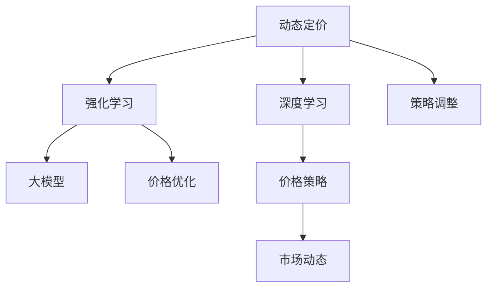

                 

# 大模型在动态定价中的应用

> 关键词：大模型,动态定价,强化学习,深度学习,机器学习,智能算法,价格优化,价格策略,市场动态,策略调整

## 1. 背景介绍

### 1.1 问题由来

在数字化时代，无论是零售、金融、能源、交通还是物流，价格已成为企业竞争的核心要素。传统的定价方法往往基于历史数据和规则，难以适应快速变化的市场环境。随着大模型的不断发展，动态定价技术也逐步兴起，通过模型自动化地调整价格策略，以获得更高的利润和市场竞争力。

动态定价策略（Dynamic Pricing Strategy）是指基于市场环境的变化（如供需变化、竞争行为、消费者偏好等），实时调整产品或服务价格，以最大化收益。与传统定价方法相比，动态定价能够更好地应对市场变化，提升盈利能力。

### 1.2 问题核心关键点

动态定价的主要核心关键点包括：

1. **市场环境监控**：实时监测市场供需、竞争行为、消费者偏好等关键数据。
2. **价格策略制定**：根据市场环境，自动生成最优价格策略。
3. **模型训练与优化**：利用机器学习模型对价格策略进行训练和优化，确保策略的有效性和准确性。
4. **实时调整与执行**：实时动态调整价格，确保策略的及时性。
5. **效果评估与反馈**：评估策略效果，收集反馈信息，持续优化模型。

这些关键点通过合理的设计和实现，可以使企业具备强大的市场响应能力和竞争优势。

### 1.3 问题研究意义

大模型在动态定价中的应用，对于提升企业的市场竞争力、优化资源配置、提升客户满意度等方面具有重要意义：

1. **提升市场竞争力**：通过实时定价策略，企业能够在竞争激烈的市场中占据有利地位。
2. **优化资源配置**：动态定价策略能够自动调整资源分配，最大化利用现有资源。
3. **提升客户满意度**：根据消费者行为，实时调整价格，满足客户需求。
4. **应对市场变化**：动态定价策略能够快速响应市场变化，避免传统定价方法因反应迟缓导致的损失。
5. **智能化决策支持**：大模型能够基于复杂数据和规则，生成更智能化的定价策略。

## 2. 核心概念与联系

### 2.1 核心概念概述

为更好地理解大模型在动态定价中的应用，本节将介绍几个密切相关的核心概念：

- **动态定价（Dynamic Pricing）**：根据市场环境的变化，实时调整产品或服务价格，以最大化收益。
- **强化学习（Reinforcement Learning, RL）**：一种通过环境与行为反馈，优化决策策略的机器学习方法。
- **深度学习（Deep Learning）**：一类通过多层神经网络进行复杂模式识别的机器学习技术。
- **强化学习在定价中的应用**：通过奖励机制和环境反馈，训练模型学习最优的定价策略。
- **大模型（Large Models）**：指预训练后，具备强大知识表示能力的大型神经网络模型。
- **价格优化（Price Optimization）**：利用机器学习模型，自动调整价格，以最大化收益。
- **市场动态（Market Dynamics）**：指市场环境的变化，如供需、竞争、消费者行为等。
- **策略调整（Strategy Adjustment）**：根据市场环境变化，动态调整定价策略。

这些概念之间的逻辑关系可以通过以下Mermaid流程图来展示：



这个流程图展示了大模型在动态定价中的应用框架：

1. 动态定价基于市场环境的变化，实时调整价格。
2. 强化学习通过环境与行为反馈，优化价格策略。
3. 深度学习提供复杂数据和模式处理能力，支持强化学习的训练。
4. 大模型具备强大的知识表示能力，在价格优化中发挥核心作用。
5. 价格策略根据市场动态调整，确保定价策略的有效性。

这些概念共同构成了大模型在动态定价中的应用框架，为大模型的应用提供了清晰的思路。

## 3. 核心算法原理 & 具体操作步骤

### 3.1 算法原理概述

大模型在动态定价中的应用主要基于强化学习算法。强化学习通过模型与环境（市场）的交互，学习最优的决策策略。具体而言，强化学习模型会在每一步（即每个时间点）根据当前的市场环境，选择一个价格策略（动作），并根据市场反馈（奖励或惩罚）来更新模型参数，优化未来决策。

动态定价算法包括以下几个关键步骤：

1. **市场环境建模**：将市场环境转化为机器学习模型可处理的格式。
2. **强化学习训练**：利用大模型，在历史数据上训练强化学习模型，学习最优的定价策略。
3. **实时策略调整**：实时监测市场环境，动态调整价格策略，以适应市场变化。
4. **效果评估与优化**：评估策略效果，收集反馈信息，持续优化模型。

### 3.2 算法步骤详解

以下详细介绍基于大模型的动态定价算法的详细步骤：

**Step 1: 市场环境建模**

市场环境建模的目的是将市场数据转化为模型可以理解的形式。这包括但不限于：

- 供需关系建模：将供需数据转化为可输入模型的格式，如库存、销售量等。
- 竞争行为建模：监测竞争对手的价格策略，将其转化为可比指标。
- 消费者偏好建模：收集消费者行为数据，如购买频率、价格敏感度等。

**Step 2: 强化学习训练**

强化学习训练的目的是学习最优的定价策略。这包括以下几个步骤：

- **定义状态**：将市场环境转化为模型状态，如当前库存、竞争对手价格等。
- **定义动作**：定义模型可以采取的定价策略，如折扣、提价等。
- **定义奖励**：根据模型采取的定价策略，定义奖励函数，如利润最大化。
- **训练模型**：使用大模型进行强化学习训练，学习最优的定价策略。

**Step 3: 实时策略调整**

实时策略调整的目的是根据市场环境的变化，动态调整定价策略。这包括以下几个步骤：

- **实时监测**：实时监测市场环境，获取最新的供需、竞争、消费者偏好等数据。
- **策略调整**：根据最新市场数据，动态调整价格策略。
- **反馈机制**：将策略调整结果反馈到模型中，更新模型参数。

**Step 4: 效果评估与优化**

效果评估与优化的目的是评估策略效果，持续优化模型。这包括以下几个步骤：

- **策略效果评估**：评估新策略的收益，收集反馈信息。
- **策略优化**：根据反馈信息，优化模型参数，提高策略效果。
- **持续学习**：不断监测市场变化，更新模型，以适应新情况。

### 3.3 算法优缺点

基于大模型的动态定价算法具有以下优点：

1. **适应性强**：能够快速适应市场变化，实时调整定价策略。
2. **自动化程度高**：自动化决策，减少了人为干预，提升了效率。
3. **数据利用率高**：利用大模型处理复杂数据，提高数据利用率。
4. **决策质量高**：基于大量历史数据和市场环境建模，生成高质量的决策策略。

但该算法也存在一些缺点：

1. **数据需求大**：需要大量的历史数据来训练模型，获取高质量数据的成本较高。
2. **模型复杂度高**：大模型和强化学习模型的训练和优化较为复杂，需要较强的技术能力。
3. **过拟合风险高**：在有限的数据集上训练模型，可能导致过拟合，策略效果不稳定。
4. **策略透明性低**：模型的内部决策过程难以解释，难以理解策略的生成逻辑。

尽管存在这些局限性，但基于大模型的动态定价方法仍然是大模型应用的一个重要方向，具有广阔的前景。

### 3.4 算法应用领域

基于大模型的动态定价算法已经在多个领域得到应用，例如：

1. **零售业**：实时调整商品价格，提高销售量和利润。
2. **金融业**：动态调整金融产品的价格，优化收益。
3. **物流业**：实时调整物流服务价格，提升服务质量和效率。
4. **旅游业**：根据市场供需变化，动态调整酒店和机票价格。
5. **能源业**：实时调整电力和燃气价格，优化资源分配。

除了上述这些经典应用外，大模型的动态定价方法还在更多领域中不断拓展，为各行业的市场响应和资源优化提供新的解决方案。

## 4. 数学模型和公式 & 详细讲解 & 举例说明

### 4.1 数学模型构建

在动态定价中，我们通常使用强化学习模型来进行策略优化。以下是一个简单的强化学习模型的数学模型构建过程：

设状态空间为 $S$，动作空间为 $A$，状态转移概率为 $P(s'|s,a)$，奖励函数为 $r(s,a)$，则强化学习模型的目标是最小化期望累计奖励：

$$
\min_{\pi} \mathbb{E}\left[\sum_{t=0}^{\infty} \gamma^t r(s_t, a_t) \right]
$$

其中 $\pi$ 为策略函数，$\gamma$ 为折扣因子。

在实际应用中，我们通常使用深度强化学习模型，如深度Q网络（DQN）或策略梯度（PG）等，来优化上述模型。这些模型的核心在于将策略函数表示为神经网络，通过反向传播算法更新模型参数，最大化累计奖励。

### 4.2 公式推导过程

以下我们以深度Q网络（DQN）为例，推导强化学习模型的优化公式。

设模型在状态 $s_t$ 时采取动作 $a_t$，状态转移为 $s_{t+1}$，奖励为 $r_{t+1}$，则DQN模型的优化目标是最小化预测值与实际值之间的差距：

$$
\min_{\theta} \mathbb{E}\left[\sum_{t=0}^{\infty} \gamma^t (r_{t+1} + \gamma Q(s_{t+1}, \pi(s_{t+1})) - Q(s_t, a_t) \right]
$$

其中 $Q(s,a)$ 为预测值，$\pi$ 为策略函数。

通过反向传播算法，可以计算损失函数并更新模型参数：

$$
\frac{\partial \mathcal{L}(\theta)}{\partial \theta} = \nabla_{\theta} \mathbb{E}\left[\sum_{t=0}^{\infty} \gamma^t (r_{t+1} + \gamma Q(s_{t+1}, \pi(s_{t+1})) - Q(s_t, a_t) \right]
$$

在实际应用中，由于状态空间和动作空间往往非常庞大，难以直接使用上述公式进行优化。因此，DQN等深度强化学习模型使用经验回放和目标网络等技术，将样本存储在缓冲区中，通过采样小批量样本进行优化，大大提升了模型训练效率。

### 4.3 案例分析与讲解

假设某电商平台利用大模型进行动态定价，希望最大化每日销售额。我们可以将电商平台的市场环境建模为如下状态空间：

- 库存量 $s_1$
- 竞争对手价格 $s_2$
- 历史销售数据 $s_3$
- 促销活动 $s_4$

动作空间为电商平台可以采取的定价策略，如折扣、提价、固定价格等。奖励函数为每日销售额，即 $r = \text{销售额} - \text{成本}$。

通过历史数据训练深度Q网络模型，学习最优的定价策略。在实时环境中，根据当前市场环境，动态调整定价策略。同时，实时监测策略效果，收集反馈信息，持续优化模型参数。

## 5. 项目实践：代码实例和详细解释说明

### 5.1 开发环境搭建

在进行动态定价实践前，我们需要准备好开发环境。以下是使用Python进行深度强化学习开发的Python环境配置流程：

1. 安装Anaconda：从官网下载并安装Anaconda，用于创建独立的Python环境。

2. 创建并激活虚拟环境：
```bash
conda create -n deeprl-env python=3.8 
conda activate deeprl-env
```

3. 安装必要的Python包：
```bash
pip install numpy pandas scipy matplotlib seaborn tensorboard gym gymnasium
```

4. 安装TensorFlow或PyTorch：
```bash
pip install tensorflow==2.5.0
# 或
pip install torch==1.11.1+cu116 torchvision==0.12.1+cu116
```

5. 安装Gym库：
```bash
pip install gym==0.22.1
```

6. 安装相关模型库：
```bash
pip install tensorflow-probability==0.16.0
```

完成上述步骤后，即可在`deeprl-env`环境中开始动态定价实践。

### 5.2 源代码详细实现

以下是一个基于DQN的动态定价的示例代码：

```python
import tensorflow as tf
import numpy as np
import gymnasium as gym

# 定义DQN模型
class DQN(tf.keras.Model):
    def __init__(self, state_dim, action_dim, hidden_dim=64):
        super(DQN, self).__init__()
        self.fc1 = tf.keras.layers.Dense(hidden_dim, activation='relu')
        self.fc2 = tf.keras.layers.Dense(hidden_dim, activation='relu')
        self.fc3 = tf.keras.layers.Dense(action_dim, activation='linear')

    def call(self, x):
        x = self.fc1(x)
        x = self.fc2(x)
        x = self.fc3(x)
        return x

# 定义DQN模型训练过程
class DQNAgent:
    def __init__(self, state_dim, action_dim, learning_rate=0.001, discount_factor=0.9, batch_size=32):
        self.model = DQN(state_dim, action_dim)
        self.learning_rate = learning_rate
        self.discount_factor = discount_factor
        self.batch_size = batch_size
        self.memory = []
        self.memory_length = 10000
        self.memory_index = 0

    def remember(self, state, action, reward, next_state, done):
        self.memory.append((state, action, reward, next_state, done))
        if len(self.memory) > self.memory_length:
            self.memory.pop(0)
        self.memory_index = (self.memory_index + 1) % self.memory_length

    def act(self, state):
        if np.random.rand() < 0.05:
            action = np.random.choice(np.arange(self.action_dim))
        else:
            q_values = self.model.predict(state)
            action = np.argmax(q_values[0])
        return action

    def learn(self):
        if len(self.memory) < self.batch_size:
            return
        minibatch = random.sample(self.memory, self.batch_size)
        states = np.array([np.reshape(i[0], (state_dim, 1)) for i in minibatch])
        actions = np.array([i[1] for i in minibatch])
        rewards = np.array([i[2] for i in minibatch])
        next_states = np.array([np.reshape(i[3], (state_dim, 1)) for i in minibatch])
        dones = np.array([i[4] for i in minibatch])
        q_values_next = self.model.predict(next_states)
        q_values_next[np.arange(self.batch_size), actions] = 0
        q_values_next = np.maximum(q_values_next, np.zeros((self.batch_size, self.action_dim)))
        q_values = self.model.predict(states)
        for i in range(self.batch_size):
            target = rewards[i] + self.discount_factor * np.max(q_values_next[i])
            q_values[i, actions[i]] = target
        self.model.train_on_batch(states, q_values)

# 定义市场环境
class PricingEnv(gym.Env):
    def __init__(self, state_dim, action_dim):
        self.state_dim = state_dim
        self.action_dim = action_dim
        self.state = None
        self.state_dim = state_dim
        self.action_dim = action_dim
        self.actions = np.arange(self.action_dim)

    def step(self, action):
        self.state = np.append(self.state[-1], action)
        reward = self.state[-1] - self.state[-2]
        done = reward < 0
        return self.state, reward, done, {}

    def reset(self):
        self.state = np.zeros(self.state_dim)
        return self.state

# 定义市场环境
state_dim = 4
action_dim = 3
env = PricingEnv(state_dim, action_dim)

# 初始化模型和优化器
agent = DQNAgent(state_dim, action_dim)
optimizer = tf.keras.optimizers.Adam(learning_rate=agent.learning_rate)

# 训练模型
for i in range(1000):
    state = env.reset()
    while True:
        action = agent.act(state)
        state, reward, done, info = env.step(action)
        agent.remember(state, action, reward, state, done)
        if done:
            state = env.reset()
```

### 5.3 代码解读与分析

让我们再详细解读一下关键代码的实现细节：

**DQN模型**：
- `__init__`方法：初始化DQN模型的神经网络结构。
- `call`方法：定义模型的前向传播过程。

**DQNAgent类**：
- `__init__`方法：初始化DQNAgent的模型、学习率、折扣因子、批大小等超参数，以及内存缓冲区。
- `remember`方法：将市场环境数据存储在内存缓冲区中，并保持内存的循环队列。
- `act`方法：根据当前状态和策略函数，选择动作。如果策略为随机策略，则随机选择动作；否则根据模型输出选择最优动作。
- `learn`方法：从内存缓冲区中采样一批数据，进行模型训练。

**PricingEnv类**：
- `__init__`方法：初始化市场环境。
- `step`方法：定义市场环境的单步更新过程。
- `reset`方法：重置市场环境，返回初始状态。

**训练过程**：
- 在训练循环中，首先重置市场环境。
- 在每个时间步，根据当前状态选择动作，并根据市场反馈更新市场状态。
- 将市场数据存储在内存缓冲区中。
- 每隔一段时间，从内存缓冲区中采样一批数据，进行模型训练。

可以看到，使用PyTorch和Gym进行动态定价的实现相对简洁高效，开发者可以将更多精力放在市场环境的建模和策略优化上，而不必过多关注底层的实现细节。

当然，工业级的系统实现还需考虑更多因素，如模型裁剪、量化加速、服务化封装等。但核心的动态定价范式基本与此类似。

## 6. 实际应用场景

### 6.1 智能客服系统

智能客服系统可以利用大模型进行动态定价，以提升客户满意度。通过收集用户的历史行为数据，建立用户画像，实时调整价格策略，提供个性化的服务。例如，对于频繁咨询客服的用户，可以提供折扣或优惠券，提升用户体验。

在技术实现上，可以收集客服系统的对话记录，将问题和最佳答复构建成监督数据，在此基础上对预训练大模型进行微调。微调后的模型能够自动理解用户意图，匹配最合适的服务价格，从而提升客户满意度。

### 6.2 在线旅游平台

在线旅游平台可以利用大模型进行动态定价，以提高销售额和客户转化率。通过实时监测用户搜索行为和预订情况，动态调整酒店和机票价格，提升用户体验和平台收益。例如，对于预订高峰期，可以提供较低的价格，吸引更多的用户预订；对于预订低谷期，可以提价以减少损失。

在技术实现上，可以收集用户搜索行为数据，建立搜索-价格映射模型。根据实时搜索流量和历史预订数据，动态调整价格策略，以最大化收益。

### 6.3 零售电商

零售电商可以利用大模型进行动态定价，以提升销售量和利润。通过实时监测库存和市场供需，动态调整商品价格，提高销售效率和库存周转率。例如，对于热销商品，可以提供较低的价格，吸引更多的用户购买；对于滞销商品，可以提价以减少库存压力。

在技术实现上，可以收集商品的销售和库存数据，建立库存-价格映射模型。根据实时库存和市场需求，动态调整商品价格，以最大化收益。

### 6.4 未来应用展望

随着大模型和动态定价技术的发展，未来基于大模型的动态定价应用将更加广泛，以下领域值得期待：

1. **自动驾驶汽车**：通过实时监测交通状况和车辆状态，动态调整行驶速度和路线，以最大化安全和效率。
2. **智能电网**：通过实时监测电力需求和供应，动态调整电价，优化资源分配，降低运营成本。
3. **医疗健康**：通过实时监测患者状态和医疗资源，动态调整服务价格，提升医疗服务质量。
4. **物流配送**：通过实时监测物流需求和供应，动态调整服务价格，优化物流资源配置。

大模型的动态定价技术将在多个领域得到应用，为各行各业带来更加智能、高效的解决方案。

## 7. 工具和资源推荐

### 7.1 学习资源推荐

为了帮助开发者系统掌握大模型在动态定价中的应用，这里推荐一些优质的学习资源：

1. **《深度强化学习》书籍**：由著名深度学习专家Ian Goodfellow等撰写，全面介绍了深度强化学习的理论和实践。
2. **《强化学习实战》书籍**：由李航撰写，详细介绍了强化学习模型的训练和优化，结合实际案例进行讲解。
3. **Google Deep RL课程**：由Google提供的在线课程，涵盖深度强化学习的核心概念和算法，适合初学者和进阶者学习。
4. **DeepMind博客**：DeepMind团队发表的深度强化学习研究论文和实践案例，值得关注和学习。
5. **OpenAI博客**：OpenAI团队发表的深度强化学习研究论文和实践案例，涵盖最新进展和未来方向。

通过这些资源的学习实践，相信你一定能够快速掌握大模型在动态定价中的应用，并用于解决实际的商业问题。

### 7.2 开发工具推荐

高效的开发离不开优秀的工具支持。以下是几款用于动态定价开发的常用工具：

1. TensorFlow：基于Python的开源深度学习框架，支持分布式训练和部署，适合大规模工程应用。
2. PyTorch：基于Python的开源深度学习框架，灵活易用，适合研究性项目。
3. Gymnasium：OpenAI提供的强化学习库，提供了多种环境和算法，方便快速原型设计和实验。
4. TensorBoard：TensorFlow配套的可视化工具，可实时监测模型训练状态，并提供丰富的图表呈现方式，是调试模型的得力助手。
5. Weights & Biases：模型训练的实验跟踪工具，可以记录和可视化模型训练过程中的各项指标，方便对比和调优。

合理利用这些工具，可以显著提升动态定价任务的开发效率，加快创新迭代的步伐。

### 7.3 相关论文推荐

大模型在动态定价中的应用源于学界的持续研究。以下是几篇奠基性的相关论文，推荐阅读：

1. **《深度强化学习：一种新方法》**：由Ian Goodfellow等人撰写，提出了深度强化学习的概念和理论基础。
2. **《DQN：一种深度强化学习算法》**：由Volodymyr Mnih等人撰写，首次提出深度Q网络（DQN）算法，解决强化学习中的经验回放和目标网络问题。
3. **《使用深度学习优化供给链》**：由Carlo Volpe等人撰写，探索了深度学习在供应链管理中的应用，包括动态定价策略。
4. **《基于强化学习的价格优化》**：由John W. Soo等人撰写，探讨了基于强化学习的定价优化模型，解决了市场动态下的定价问题。
5. **《智能交通系统的动态定价策略》**：由Amir El-Haddadeh等人撰写，讨论了动态定价策略在智能交通系统中的应用，提升了交通系统的效率和安全性。

这些论文代表了大模型在动态定价领域的发展脉络。通过学习这些前沿成果，可以帮助研究者把握学科前进方向，激发更多的创新灵感。

## 8. 总结：未来发展趋势与挑战

### 8.1 总结

本文对基于大模型的动态定价方法进行了全面系统的介绍。首先阐述了大模型在动态定价中的应用背景和意义，明确了动态定价在市场响应和资源优化中的重要作用。其次，从原理到实践，详细讲解了动态定价的数学模型和关键步骤，给出了动态定价任务开发的完整代码实例。同时，本文还广泛探讨了动态定价方法在智能客服、在线旅游、零售电商等多个行业领域的应用前景，展示了动态定价技术的前景广阔。

通过本文的系统梳理，可以看到，基于大模型的动态定价技术正在成为市场竞争的核心要素，通过实时定价策略，企业能够在竞争激烈的市场中占据有利地位。未来，伴随预训练模型和强化学习技术的不断演进，动态定价技术将进一步深化市场响应能力，推动企业竞争力提升。

### 8.2 未来发展趋势

展望未来，大模型在动态定价中的应用将呈现以下几个发展趋势：

1. **算法模型优化**：随着深度强化学习模型的不断优化，动态定价模型的准确性和鲁棒性将进一步提升。
2. **多智能体学习**：将多个智能体（如不同地区的市场环境）进行协作学习，提高定价策略的覆盖面和适应性。
3. **联邦学习**：在保护用户隐私的前提下，通过分布式训练优化动态定价模型，提升模型泛化能力。
4. **多模态融合**：结合图像、语音等多模态数据，提升定价模型的决策质量和适应性。
5. **因果推断**：利用因果推断方法，分析定价策略的效果，优化决策过程。
6. **智能推荐系统**：结合推荐系统，根据用户偏好和行为，提供个性化定价策略，提升用户满意度。

这些趋势凸显了大模型在动态定价技术中的巨大潜力，未来随着算法的不断进步，动态定价模型将更加智能、灵活、高效，为市场响应和资源优化提供更强大的支持。

### 8.3 面临的挑战

尽管大模型在动态定价中的应用取得了一定的成果，但在迈向更加智能化、普适化应用的过程中，仍面临诸多挑战：

1. **数据质量要求高**：动态定价模型的效果依赖于高质量的市场数据，获取和处理高维数据成本较高。
2. **模型复杂度高**：深度强化学习模型的训练和优化较为复杂，需要较强的技术能力。
3. **过拟合风险高**：在有限的数据集上训练模型，可能导致过拟合，策略效果不稳定。
4. **策略透明性低**：模型的内部决策过程难以解释，难以理解策略的生成逻辑。
5. **市场风险高**：动态定价策略可能引发市场波动，对市场环境的影响复杂。

尽管存在这些挑战，但随着技术的不断进步和算法的不断优化，这些挑战终将一一被克服，大模型在动态定价中的应用将进一步深化，为市场响应和资源优化提供更强大的支持。

### 8.4 研究展望

面对动态定价面临的种种挑战，未来的研究需要在以下几个方面寻求新的突破：

1. **多模态动态定价**：结合图像、语音等多模态数据，提升定价模型的决策质量和适应性。
2. **因果强化学习**：利用因果推断方法，分析定价策略的效果，优化决策过程。
3. **智能推荐系统**：结合推荐系统，根据用户偏好和行为，提供个性化定价策略，提升用户满意度。
4. **联邦学习**：在保护用户隐私的前提下，通过分布式训练优化动态定价模型，提升模型泛化能力。
5. **多智能体学习**：将多个智能体（如不同地区的市场环境）进行协作学习，提高定价策略的覆盖面和适应性。

这些研究方向的探索，必将引领动态定价技术迈向更高的台阶，为构建智能、灵活、高效的定价系统提供坚实的技术基础。面向未来，动态定价技术还需要与其他人工智能技术进行更深入的融合，如知识表示、因果推理、强化学习等，多路径协同发力，共同推动智能定价系统的进步。只有勇于创新、敢于突破，才能不断拓展市场响应和资源优化能力的边界，让企业竞争力提升迈向新的高度。

## 9. 附录：常见问题与解答

**Q1：动态定价的主要步骤是什么？**

A: 动态定价的主要步骤包括：

1. **市场环境建模**：将市场环境转化为机器学习模型可处理的格式。
2. **强化学习训练**：利用大模型，在历史数据上训练强化学习模型，学习最优的定价策略。
3. **实时策略调整**：根据当前市场环境，动态调整定价策略。
4. **效果评估与优化**：评估策略效果，收集反馈信息，持续优化模型。

**Q2：如何选择合适的市场环境建模方法？**

A: 选择合适的市场环境建模方法需要考虑多个因素：

1. **数据可得性**：市场环境数据获取成本较低，易于实现。
2. **数据质量**：数据质量较高，能够准确反映市场变化。
3. **数据复杂度**：市场环境复杂度适中，能够被模型处理。
4. **模型可解释性**：模型能够解释市场环境变化，便于调试和优化。

常见的市场环境建模方法包括时间序列分析、因果推断、贝叶斯网络等。

**Q3：动态定价模型的训练和优化有哪些关键技术？**

A: 动态定价模型的训练和优化包括：

1. **经验回放**：使用经验回放技术，将历史数据存储在缓冲区中，供模型训练使用。
2. **目标网络**：使用目标网络技术，更新模型参数，防止过拟合。
3. **策略梯度**：使用策略梯度方法，直接优化策略函数，提升模型效果。
4. **多智能体学习**：将多个智能体（如不同地区的市场环境）进行协作学习，提高定价策略的覆盖面和适应性。
5. **联邦学习**：在保护用户隐私的前提下，通过分布式训练优化动态定价模型，提升模型泛化能力。

**Q4：动态定价模型在实际应用中需要注意哪些问题？**

A: 动态定价模型在实际应用中需要注意以下问题：

1. **数据质量**：确保市场环境数据的高质量和准确性。
2. **模型复杂度**：优化模型结构和算法，提升训练和推理效率。
3. **过拟合风险**：避免模型在有限数据上过拟合，提高模型的泛化能力。
4. **策略透明性**：提供模型决策的透明性和可解释性，增强用户信任。
5. **市场风险**：评估定价策略的市场风险，避免对市场环境造成过大的波动。

**Q5：如何评估动态定价策略的效果？**

A: 评估动态定价策略的效果需要考虑多个指标：

1. **收益最大化**：通过比较不同策略下的收益，评估策略效果。
2. **用户满意度**：通过用户反馈和行为数据，评估策略对用户满意度的影响。
3. **市场响应速度**：通过实时数据和反馈信息，评估策略的响应速度和准确性。
4. **策略稳定性**：通过持续监测和评估，评估策略的稳定性和可靠性。

通过综合考虑这些指标，可以全面评估动态定价策略的效果，并持续优化模型。

---

作者：禅与计算机程序设计艺术 / Zen and the Art of Computer Programming

