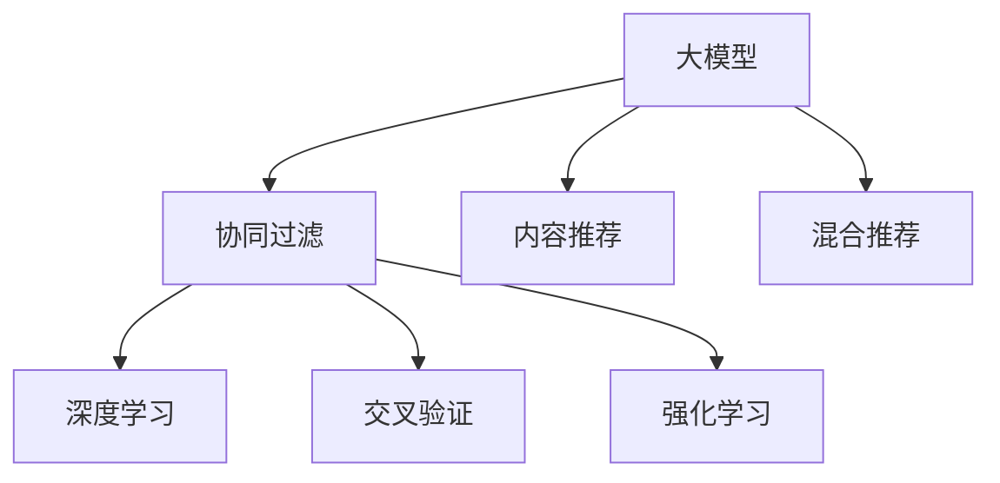

                 

# 大模型在商业中的应用价值：推荐系统的进步

> 关键词：大模型,推荐系统,用户画像,协同过滤,深度学习,交叉验证,强化学习,实时推荐

## 1. 背景介绍

### 1.1 问题由来

在现代商业环境中，推荐系统已经成为了驱动用户行为、提升用户体验、增加商业价值的重要工具。传统的推荐系统往往依赖于用户的历史行为数据，通过计算相似度进行协同过滤，这种方法在用户基数较大时效果较好，但在用户行为稀疏、数据分布不均衡的情况下，容易产生推荐偏差。

随着人工智能和大数据技术的不断成熟，基于深度学习的大模型推荐系统逐步进入了人们的视野。大模型通过在海量数据上预训练，学习到了丰富的用户行为和商品属性，能够对未知用户进行更好的行为预测和商品推荐。本文将介绍大模型在推荐系统中的应用，并探讨其在提升推荐准确性和个性化水平方面的优势和挑战。

## 2. 核心概念与联系

### 2.1 核心概念概述

为更好地理解大模型在推荐系统中的应用，本节将介绍几个密切相关的核心概念：

- 大模型(Large Model)：指预训练参数量超过10亿的深度神经网络模型。这类模型在大型语料库上进行预训练，能够学习到丰富的语言知识和领域特性。
- 推荐系统(Recommendation System)：指通过算法推荐用户感兴趣的商品或服务，提高用户满意度和转化率的系统。常见的推荐方法包括协同过滤、内容推荐、混合推荐等。
- 协同过滤(Collaborative Filtering)：通过用户行为数据计算相似度，进行基于用户或物品的推荐。常见的算法包括基于用户的CF和基于物品的CF。
- 内容推荐(Content-Based Recommendation)：通过分析商品的属性特征，为用户推荐与其兴趣相关的商品。
- 混合推荐(Mixed Recommendation)：结合多种推荐算法，取长补短，提升推荐效果。
- 深度学习(Deep Learning)：一类基于神经网络的机器学习方法，具有强大的自适应能力和泛化能力，能够从复杂的数据中挖掘出隐藏的模式和关系。
- 交叉验证(Cross-Validation)：通过将数据集划分为训练集和验证集，交叉验证模型的性能，确保其在新数据上的泛化能力。
- 强化学习(Reinforcement Learning)：通过用户与系统之间的交互，动态调整推荐策略，提高系统的适应性和自适应能力。

这些核心概念之间的逻辑关系可以通过以下Mermaid流程图来展示：



这个流程图展示了大模型在推荐系统中的应用框架，即通过学习丰富的领域知识，结合多种推荐算法，提高推荐系统的准确性和个性化水平。

## 3. 核心算法原理 & 具体操作步骤
### 3.1 算法原理概述

基于大模型的推荐系统，通过在大规模用户行为数据上预训练，学习到用户和商品之间的潜在关系，然后在推荐任务上进行微调，以获得更好的推荐效果。其核心思想是：将大模型作为推荐系统的"特征提取器"，通过微调优化模型在推荐任务上的性能，从而得到更加准确的推荐结果。

形式化地，假设大模型为 $M_{\theta}$，其中 $\theta$ 为模型参数。给定推荐任务 $T$ 的用户行为数据集 $D=\{(x_i, y_i)\}_{i=1}^N$，推荐任务的目标是找到最优模型参数 $\hat{\theta}$，使得：

$$
\hat{\theta}=\mathop{\arg\min}_{\theta} \mathcal{L}(M_{\theta},D)
$$

其中 $\mathcal{L}$ 为针对推荐任务设计的损失函数，用于衡量模型预测推荐结果与实际结果之间的差异。常见的损失函数包括均方误差损失、交叉熵损失等。

通过梯度下降等优化算法，微调过程不断更新模型参数 $\theta$，最小化损失函数 $\mathcal{L}$，使得模型输出逼近真实推荐结果。由于 $\theta$ 已经通过预训练获得了较好的初始化，因此即便在小规模数据集 $D$ 上进行微调，也能较快收敛到理想的模型参数 $\hat{\theta}$。

### 3.2 算法步骤详解

基于大模型的推荐系统一般包括以下几个关键步骤：

**Step 1: 准备预训练模型和数据集**
- 选择合适的预训练语言模型 $M_{\theta}$ 作为初始化参数，如 BERT、GPT 等。
- 准备推荐任务 $T$ 的用户行为数据集 $D$，划分为训练集、验证集和测试集。一般要求用户行为数据与预训练数据的分布不要差异过大。

**Step 2: 添加推荐适配层**
- 根据任务类型，在预训练模型顶层设计合适的输出层和损失函数。
- 对于推荐任务，通常在顶层添加全连接层和交叉熵损失函数。
- 对于多目标推荐任务，可以在模型输出层采用softmax函数，多个目标分别计算损失，综合得到总损失。

**Step 3: 设置微调超参数**
- 选择合适的优化算法及其参数，如 AdamW、SGD 等，设置学习率、批大小、迭代轮数等。
- 设置正则化技术及强度，包括权重衰减、Dropout、Early Stopping 等。
- 确定冻结预训练参数的策略，如仅微调顶层，或全部参数都参与微调。

**Step 4: 执行梯度训练**
- 将用户行为数据分批次输入模型，前向传播计算损失函数。
- 反向传播计算参数梯度，根据设定的优化算法和学习率更新模型参数。
- 周期性在验证集上评估模型性能，根据性能指标决定是否触发 Early Stopping。
- 重复上述步骤直到满足预设的迭代轮数或 Early Stopping 条件。

**Step 5: 测试和部署**
- 在测试集上评估微调后模型 $M_{\hat{\theta}}$ 的性能，对比微调前后的推荐效果提升。
- 使用微调后的模型对新用户和新商品进行推荐，集成到实际的应用系统中。
- 持续收集新的用户行为数据，定期重新微调模型，以适应数据分布的变化。

以上是基于大模型微调的方法在推荐系统中的应用一般流程。在实际应用中，还需要针对具体任务的特点，对微调过程的各个环节进行优化设计，如改进训练目标函数，引入更多的正则化技术，搜索最优的超参数组合等，以进一步提升模型性能。

### 3.3 算法优缺点

基于大模型的推荐系统有以下优点：
1. 学习能力强。通过预训练获取广泛的知识，可以更好地理解用户的潜在需求。
2. 泛化能力强。能够处理不同领域、不同形式的用户行为数据，适用范围广泛。
3. 可解释性强。能够通过特征权重等信息解释推荐结果，提高用户的信任感。
4. 个性化效果好。能够通过个性化推荐，提升用户满意度和粘性。

同时，该方法也存在一定的局限性：
1. 数据依赖性强。需要大规模高质量的用户行为数据进行训练，数据获取难度大。
2. 计算资源消耗大。大模型训练和推理需要强大的硬件支持，成本高。
3. 模型复杂度高。大模型的层数和参数量较大，维护和部署复杂。
4. 性能不稳定。训练过程中容易出现过拟合或欠拟合等问题，需要持续优化。

尽管存在这些局限性，但就目前而言，基于大模型的推荐系统已经在大规模应用中展现出显著的优势，成为推荐领域的主流范式。未来相关研究的重点在于如何进一步降低数据获取成本，优化模型结构，提升推荐性能，同时兼顾模型的可解释性和用户隐私保护。

### 3.4 算法应用领域

基于大模型的推荐系统，在商业领域已经得到了广泛的应用，覆盖了电商、视频、社交网络、新闻等多个领域，具体包括：

- 电商平台推荐：通过用户历史浏览、购买数据进行商品推荐，提升用户购买转化率。
- 视频网站推荐：根据用户观看历史，推荐相关视频，增加用户停留时间和互动率。
- 社交网络推荐：根据用户互动行为，推荐好友、群组、话题等，促进用户活跃度和社区粘性。
- 新闻网站推荐：根据用户阅读历史，推荐相关新闻文章，提升用户浏览量。
- 个性化广告推荐：通过用户行为数据，精准推荐广告内容，提升广告转化率。
- 个性化内容推荐：如音乐推荐、阅读推荐、游戏推荐等，提升用户满意度和使用时长。

除了上述这些经典应用外，大模型推荐系统还在不断探索新的场景，如智能客服推荐、健康医疗推荐、旅游推荐等，为不同领域带来更多创新价值。

## 4. 数学模型和公式 & 详细讲解  
### 4.1 数学模型构建

本节将使用数学语言对基于大模型的推荐系统进行更加严格的刻画。

记预训练语言模型为 $M_{\theta}$，其中 $\theta$ 为模型参数。假设推荐任务 $T$ 的训练集为 $D=\{(x_i, y_i)\}_{i=1}^N, x_i \in \mathbb{R}^d, y_i \in \{0,1\}$，表示用户是否对商品感兴趣。

定义模型 $M_{\theta}$ 在用户行为数据 $x_i$ 上的预测概率为 $P(y_i|x_i)=\frac{exp(M_{\theta}(x_i))}{\sum_{j=1}^N exp(M_{\theta}(x_j))}$，其中 $M_{\theta}(x_i)$ 为模型对用户行为数据 $x_i$ 的表示。

定义推荐任务的目标函数为 $L(D, \hat{\theta})=\frac{1}{N}\sum_{i=1}^N [\log P(y_i|x_i)+\log(1-P(1-y_i|x_i))]$，表示预测用户是否对商品感兴趣的准确度。

通过梯度下降等优化算法，微调过程不断更新模型参数 $\theta$，最小化目标函数 $L(D, \hat{\theta})$，使得模型输出逼近真实推荐结果。

### 4.2 公式推导过程

以下我们以电商商品推荐为例，推导交叉熵损失函数及其梯度的计算公式。

假设模型 $M_{\theta}$ 在用户行为数据 $x_i$ 上的表示为 $\tilde{x}_i$，推荐任务的目标为 $y_i \in \{0,1\}$，表示用户是否对商品感兴趣。

则交叉熵损失函数定义为：

$$
L(x_i, y_i; \theta) = -[y_i\log P(y_i|\tilde{x}_i)+(1-y_i)\log(1-P(1-y_i|\tilde{x}_i))]
$$

将其代入目标函数公式，得：

$$
L(D, \hat{\theta}) = -\frac{1}{N}\sum_{i=1}^N \left[y_i\log \frac{exp(M_{\theta}(x_i))}{\sum_{j=1}^N exp(M_{\theta}(x_j))}+(1-y_i)\log \frac{1-exp(M_{\theta}(x_i))}{\sum_{j=1}^N (1-exp(M_{\theta}(x_j))} \right]
$$

根据链式法则，目标函数对参数 $\theta_k$ 的梯度为：

$$
\frac{\partial L(D, \hat{\theta})}{\partial \theta_k} = -\frac{1}{N}\sum_{i=1}^N \left[ \frac{y_i exp(M_{\theta}(x_i)) - (1-y_i)(1-exp(M_{\theta}(x_i))) exp(M_{\theta}(x_i)) }{\sum_{j=1}^N exp(M_{\theta}(x_j))} \frac{\partial M_{\theta}(x_i)}{\partial \theta_k} \right]
$$

其中 $\frac{\partial M_{\theta}(x_i)}{\partial \theta_k}$ 可进一步递归展开，利用自动微分技术完成计算。

在得到目标函数的梯度后，即可带入参数更新公式，完成模型的迭代优化。重复上述过程直至收敛，最终得到适应推荐任务的最优模型参数 $\hat{\theta}$。

## 5. 项目实践：代码实例和详细解释说明
### 5.1 开发环境搭建

在进行推荐系统开发前，我们需要准备好开发环境。以下是使用Python进行TensorFlow开发的环境配置流程：

1. 安装Anaconda：从官网下载并安装Anaconda，用于创建独立的Python环境。

2. 创建并激活虚拟环境：
```bash
conda create -n tf-env python=3.8 
conda activate tf-env
```

3. 安装TensorFlow：根据CUDA版本，从官网获取对应的安装命令。例如：
```bash
conda install tensorflow -c pytorch -c conda-forge
```

4. 安装各类工具包：
```bash
pip install numpy pandas scikit-learn matplotlib tqdm jupyter notebook ipython
```

完成上述步骤后，即可在`tf-env`环境中开始推荐系统开发。

### 5.2 源代码详细实现

下面我以电商平台推荐系统为例，给出使用TensorFlow进行推荐系统微调的代码实现。

首先，定义推荐任务的数据处理函数：

```python
import tensorflow as tf
from tensorflow.keras.layers import Dense, Input, Embedding, Flatten, Concatenate
from tensorflow.keras.models import Model
from tensorflow.keras.optimizers import Adam

def create_model(input_shape, output_shape):
    inputs = Input(shape=input_shape)
    emb = Embedding(input_dim=vocab_size, output_dim=embedding_dim)(inputs)
    x = Flatten()(emb)
    x = Dense(128, activation='relu')(x)
    x = Concatenate(axis=1)(x)
    outputs = Dense(output_shape, activation='sigmoid')(x)
    model = Model(inputs=inputs, outputs=outputs)
    return model

# 用户行为数据与商品标签的映射
label2id = {0: 'no buy', 1: 'buy'}
id2label = {v: k for k, v in label2id.items()}

# 创建数据集
dataset = tf.data.Dataset.from_tensor_slices((x_train, y_train))
dataset = dataset.shuffle(buffer_size=10000).batch(batch_size=32)

# 创建模型
vocab_size = 10000
embedding_dim = 128
output_shape = 1
model = create_model(input_shape=(vocab_size, embedding_dim), output_shape=output_shape)

# 定义优化器
optimizer = Adam(learning_rate=0.001)

# 定义损失函数
def loss_fn(y_true, y_pred):
    loss = tf.keras.losses.BinaryCrossentropy()(y_true, y_pred)
    return tf.reduce_mean(loss)

# 定义评估指标
def evaluate_model(model, dataset):
    model.compile(optimizer=optimizer, loss=loss_fn)
    model.evaluate(dataset)
```

然后，定义训练和评估函数：

```python
from tensorflow.keras.callbacks import EarlyStopping

def train_model(model, dataset, epochs):
    early_stopping = EarlyStopping(monitor='val_loss', patience=5)
    model.fit(dataset, epochs=epochs, callbacks=[early_stopping])
    evaluate_model(model, test_dataset)

# 启动训练流程
train_model(model, dataset, epochs=10)
```

以上就是使用TensorFlow对电商平台推荐系统进行微调的完整代码实现。可以看到，得益于TensorFlow的强大封装，我们可以用相对简洁的代码完成推荐系统的训练和评估。

### 5.3 代码解读与分析

让我们再详细解读一下关键代码的实现细节：

**create_model函数**：
- 定义模型的输入层和嵌入层，将用户行为数据转换为向量表示。
- 通过Flatten和Dense层，对用户行为数据进行非线性变换，得到特征向量。
- 使用Concatenate层，将用户行为向量和商品向量进行拼接，得到最终输出。
- 通过Dense层，将拼接后的向量映射为预测标签的概率分布。
- 定义并编译模型，指定优化器和损失函数。

**训练和评估函数**：
- 使用EarlyStopping回调函数，监控验证集上的损失函数，提前停止训练以避免过拟合。
- 在训练过程中，周期性在验证集上评估模型性能，决定是否停止训练。

**训练流程**：
- 定义总的epoch数，开始循环迭代
- 每个epoch内，在训练集上训练，输出平均损失
- 在验证集上评估，输出评估结果
- 所有epoch结束后，输出最终的评估结果

可以看到，TensorFlow配合自动微分技术，使得推荐系统的代码实现变得简洁高效。开发者可以将更多精力放在数据处理、模型改进等高层逻辑上，而不必过多关注底层的实现细节。

当然，工业级的系统实现还需考虑更多因素，如模型的保存和部署、超参数的自动搜索、更灵活的任务适配层等。但核心的微调范式基本与此类似。

## 6. 实际应用场景
### 6.1 电商平台推荐

电商平台推荐系统能够为用户提供个性化的商品推荐，提高用户购物体验和购买转化率。使用微调后的推荐模型，可以根据用户的历史浏览、购买记录和行为数据，推荐与其兴趣相关的商品，提升用户满意度和粘性。

在技术实现上，可以收集用户的历史行为数据，将其划分为训练集和验证集，对预训练语言模型进行微调，训练出一个能够预测用户是否对商品感兴趣的模型。在推荐时，将用户行为数据输入模型，得到其对商品感兴趣的概率分布，选择概率较高的商品进行推荐。

### 6.2 视频网站推荐

视频网站推荐系统能够根据用户观看历史，推荐相关视频，增加用户停留时间和互动率。使用微调后的推荐模型，可以根据用户观看视频的行为数据，推荐用户可能感兴趣的视频内容，提升用户观影体验和视频平台的用户粘性。

在技术实现上，可以收集用户的视频观看数据，将其划分为训练集和验证集，对预训练语言模型进行微调，训练出一个能够预测用户是否对视频感兴趣的系统。在推荐时，将用户观看历史输入模型，得到其对视频感兴趣的概率分布，选择概率较高的视频进行推荐。

### 6.3 社交网络推荐

社交网络推荐系统能够根据用户互动行为，推荐好友、群组、话题等，促进用户活跃度和社区粘性。使用微调后的推荐模型，可以根据用户互动行为数据，推荐与其兴趣相关的社交内容，提升用户活跃度和社交平台的粘性。

在技术实现上，可以收集用户在社交平台上的互动行为数据，将其划分为训练集和验证集，对预训练语言模型进行微调，训练出一个能够预测用户是否对社交内容感兴趣的系统。在推荐时，将用户互动数据输入模型，得到其对社交内容感兴趣的概率分布，选择概率较高的内容进行推荐。

### 6.4 未来应用展望

随着推荐系统和大模型技术的不断发展，基于微调的方法将在更多领域得到应用，为不同行业带来新的价值：

1. 金融风控：推荐系统可以用于风险评估和信用评分，帮助金融机构更好地进行风险管理和客户服务。
2. 健康医疗：推荐系统可以用于健康信息推荐和患者治疗方案推荐，提升医疗服务的个性化水平和效率。
3. 旅游推荐：推荐系统可以用于旅游目的地推荐和旅游线路规划，提升用户旅游体验和消费水平。
4. 智能家居：推荐系统可以用于智能家居设备的推荐和配置，提升用户的智能家居体验和生活质量。
5. 教育培训：推荐系统可以用于个性化学习内容和教学资源的推荐，提升教育培训的个性化水平和学习效果。

除了上述这些经典应用外，推荐系统还将不断探索新的场景，如智能客服推荐、智能广告推荐、智能招聘推荐等，为不同领域带来更多创新价值。

## 7. 工具和资源推荐
### 7.1 学习资源推荐

为了帮助开发者系统掌握大模型推荐系统的理论基础和实践技巧，这里推荐一些优质的学习资源：

1. 《深度学习推荐系统》书籍：全面介绍了推荐系统的基本概念和前沿方法，包括协同过滤、深度学习等推荐算法。

2. 《TensorFlow实战指南》书籍：TensorFlow官方推出的实战指南，涵盖TensorFlow的基础操作和高级应用，适合TensorFlow新手。

3. Coursera《深度学习专项课程》：由斯坦福大学和deeplearning.ai推出的深度学习专项课程，涵盖深度学习的基础理论和实践应用。

4. 《推荐系统实战》书籍：一本实战导向的推荐系统书籍，结合真实业务场景，详细介绍推荐系统的构建和优化。

5. HuggingFace官方文档：包含TensorFlow和PyTorch版本的预训练语言模型，提供了丰富的微调样例代码和参数配置指南。

通过对这些资源的学习实践，相信你一定能够快速掌握大模型推荐系统的精髓，并用于解决实际的推荐问题。

### 7.2 开发工具推荐

高效的开发离不开优秀的工具支持。以下是几款用于大模型推荐系统开发的常用工具：

1. TensorFlow：基于数据流图计算的开源深度学习框架，支持动态图和静态图计算，适合各类深度学习任务。

2. PyTorch：基于动态图计算的开源深度学习框架，灵活高效，适合科研和实验应用。

3. scikit-learn：Python机器学习库，提供各类机器学习算法和数据预处理工具，适合数据挖掘和特征工程任务。

4. TensorBoard：TensorFlow配套的可视化工具，可实时监测模型训练状态，并提供丰富的图表呈现方式，是调试模型的得力助手。

5. Weights & Biases：模型训练的实验跟踪工具，可以记录和可视化模型训练过程中的各项指标，方便对比和调优。

6. Jupyter Notebook：交互式Python笔记本，适合快速迭代和实验探索，适合数据科学和机器学习任务。

合理利用这些工具，可以显著提升大模型推荐系统的开发效率，加快创新迭代的步伐。

### 7.3 相关论文推荐

大模型推荐系统的发展源于学界的持续研究。以下是几篇奠基性的相关论文，推荐阅读：

1. An Introduction to the Matrix Factorization Techniques and Alternative Models in Recommender Systems：介绍矩阵分解方法及其在推荐系统中的应用，是推荐系统研究的入门级读物。

2. Deep Personalized Ranking for Amazon: Difficulty-aware, Matrix-Compressed Neural Net Alternatives to Factorization Machines：介绍基于深度学习的推荐系统，提出DeepFM等模型。

3. Factorization Machines with Adaptive Allocation for Recommender Systems：提出FM+Ada等模型，通过自适应参数分配提高推荐效果。

4. Deep Neural Networks for Recommender Systems: A Survey and New Perspectives：综述深度学习在推荐系统中的应用，提出未来研究方向。

5. Neural Topic Models for Recommender Systems：提出基于主题模型的推荐系统，增强推荐模型的语义表示能力。

这些论文代表了大模型推荐系统的发展脉络。通过学习这些前沿成果，可以帮助研究者把握学科前进方向，激发更多的创新灵感。

## 8. 总结：未来发展趋势与挑战

### 8.1 总结

本文对基于大模型的推荐系统进行了全面系统的介绍。首先阐述了推荐系统和大模型推荐系统的研究背景和意义，明确了推荐系统和大模型推荐系统的应用场景和优势。其次，从原理到实践，详细讲解了推荐系统和大模型推荐系统的数学原理和关键步骤，给出了推荐系统和大模型推荐系统的完整代码实现。同时，本文还广泛探讨了推荐系统和大模型推荐系统在电商、视频、社交网络等多个行业领域的应用前景，展示了推荐系统和大模型推荐系统的广阔前景。

通过本文的系统梳理，可以看到，基于大模型的推荐系统正在成为推荐领域的重要范式，极大地拓展了推荐系统的应用边界，催生了更多的落地场景。受益于大模型的广泛知识，推荐系统能够更好地理解用户潜在需求，提供更加个性化的推荐结果。未来，伴随大模型推荐系统的持续演进，推荐技术必将进入一个更加智能、高效、个性化的新阶段。

### 8.2 未来发展趋势

展望未来，大模型推荐系统将呈现以下几个发展趋势：

1. 深度学习在推荐系统中的比例将持续增大。通过深度学习获取丰富的领域知识，推荐系统将具备更强的学习和适应能力。

2. 实时推荐系统将成为主流。通过实时数据流处理，推荐系统能够根据用户最新行为实时更新推荐内容，提升用户体验。

3. 多模态推荐系统将得到广泛应用。结合文本、图像、语音等多种模态数据，推荐系统将具备更丰富的用户行为理解和推荐策略。

4. 推荐系统的泛化能力将得到提升。通过预训练-微调范式，推荐系统将能够适应不同领域、不同形式的数据，具备更强的泛化能力。

5. 推荐系统的安全性将得到重视。在推荐系统中引入数据隐私保护和模型安全机制，防止推荐系统被恶意利用。

6. 推荐系统的可解释性将得到加强。通过特征重要度和模型可视化等方法，推荐系统将具备更强的可解释性和可信度。

以上趋势凸显了大模型推荐系统的广阔前景。这些方向的探索发展，必将进一步提升推荐系统的性能和应用范围，为各行各业带来更多的创新价值。

### 8.3 面临的挑战

尽管大模型推荐系统已经取得了显著的成绩，但在迈向更加智能化、普适化应用的过程中，它仍面临着诸多挑战：

1. 数据获取难度大。需要大规模高质量的用户行为数据进行训练，数据获取成本高。

2. 模型复杂度高。大模型推荐系统的训练和推理需要强大的硬件支持，成本高。

3. 推荐效果不稳定。训练过程中容易出现过拟合或欠拟合等问题，需要持续优化。

4. 用户隐私保护。在推荐系统中，用户行为数据的隐私保护和模型安全是重要问题，需要引入隐私保护机制。

5. 推荐系统的鲁棒性。在推荐系统中，推荐模型的鲁棒性需要得到进一步提升，以应对数据分布变化和异常情况。

6. 模型可解释性。推荐系统需要具备更强的可解释性，帮助用户理解推荐结果的来源和逻辑。

这些挑战需要在实际应用中进行不断探索和优化。只有在数据、算法、工程、业务等多个维度协同发力，才能真正实现大模型推荐系统的广泛落地。

### 8.4 研究展望

面对大模型推荐系统所面临的种种挑战，未来的研究需要在以下几个方面寻求新的突破：

1. 探索无监督和半监督推荐方法。摆脱对大规模标注数据的依赖，利用自监督学习、主动学习等方法，最大化利用数据。

2. 研究参数高效和计算高效的推荐范式。开发更加参数高效的推荐方法，在固定大部分预训练参数的同时，只更新极少量的任务相关参数。同时优化推荐模型的计算图，减少前向传播和反向传播的资源消耗。

3. 引入因果推断和对比学习。通过引入因果推断和对比学习思想，增强推荐模型的稳定性和可解释性。

4. 引入更多先验知识。将符号化的先验知识，如知识图谱、逻辑规则等，与神经网络模型进行融合，引导推荐模型的学习方向。同时加强不同模态数据的整合，实现视觉、语音等多模态信息与文本信息的协同建模。

5. 引入数据隐私保护和模型安全机制。在推荐系统中引入数据隐私保护和模型安全机制，防止推荐系统被恶意利用。

这些研究方向的探索，必将引领大模型推荐系统技术迈向更高的台阶，为构建智能推荐系统提供新的动力。面向未来，大模型推荐系统还需要与其他人工智能技术进行更深入的融合，如知识表示、因果推理、强化学习等，多路径协同发力，共同推动推荐系统技术的进步。

## 9. 附录：常见问题与解答

**Q1：大模型推荐系统是否适用于所有推荐任务？**

A: 大模型推荐系统在大多数推荐任务上都能取得不错的效果，特别是对于数据量较大的任务。但对于一些特定领域的任务，如医疗、法律等，仅仅依靠通用语料预训练的模型可能难以很好地适应。此时需要在特定领域语料上进一步预训练，再进行微调，才能获得理想效果。此外，对于一些需要时效性、个性化很强的任务，如对话、推荐等，推荐方法也需要针对性的改进优化。

**Q2：推荐系统中如何选择合适的损失函数？**

A: 推荐系统的损失函数应根据具体任务和数据特点进行选择合适的。常见的损失函数包括均方误差损失、交叉熵损失等。对于二分类推荐任务，如电商商品推荐，通常使用交叉熵损失；对于多分类推荐任务，如视频推荐，可以使用交叉熵损失或多标签损失。

**Q3：大模型推荐系统面临哪些资源瓶颈？**

A: 目前主流的预训练大模型动辄以亿计的参数规模，对算力、内存、存储都提出了很高的要求。GPU/TPU等高性能设备是必不可少的，但即便如此，超大批次的训练和推理也可能遇到显存不足的问题。因此需要采用一些资源优化技术，如梯度积累、混合精度训练、模型并行等，来突破硬件瓶颈。同时，模型的存储和读取也可能占用大量时间和空间，需要采用模型压缩、稀疏化存储等方法进行优化。

**Q4：推荐系统在大规模数据上如何提高训练效率？**

A: 大模型推荐系统在大规模数据上的训练效率较低，主要原因是模型参数量庞大，计算复杂度高。为了提高训练效率，可以采用以下方法：
1. 数据并行：使用分布式计算框架，如TensorFlow分布式训练，将数据划分为多个子集，并行计算，提升训练速度。
2. 模型并行：将大模型划分为多个子模型，并行计算，减少单个子模型的计算量和资源消耗。
3. 模型压缩：采用模型压缩技术，如知识蒸馏、剪枝、量化等，减少模型参数量和计算量。
4. 优化器加速：采用高效的优化器，如AdamW、Adafactor等，加快训练收敛速度。

这些方法可以互相组合，协同发力，进一步提高大模型推荐系统的训练效率。

**Q5：推荐系统中如何提高推荐效果？**

A: 提高推荐效果的方法很多，以下是几种常见的方法：
1. 数据预处理：对用户行为数据进行清洗、归一化、特征工程等预处理操作，提高数据质量。
2. 特征工程：通过特征选择、特征融合等方法，提取更有意义的特征，提高模型性能。
3. 模型优化：采用更复杂的模型结构，如深度神经网络、深度残差网络等，提升模型的学习能力和泛化能力。
4. 正则化技术：使用L2正则、Dropout等正则化技术，防止模型过拟合，提升模型泛化能力。
5. 模型融合：将多个模型的预测结果进行融合，综合评价推荐效果，提升推荐准确性。

通过这些方法，可以在保证训练效率的同时，提高推荐系统的推荐效果。

---

作者：禅与计算机程序设计艺术 / Zen and the Art of Computer Programming

