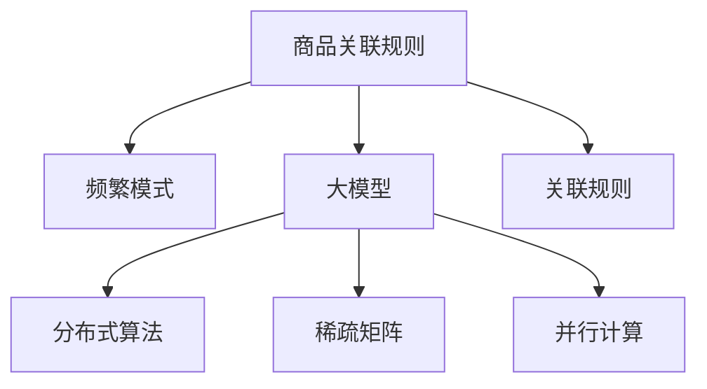

                 

# 大模型在商品关联规则挖掘中的频繁模式分析

> 关键词：商品关联规则, 大模型, 频繁模式, 分布式算法, 稀疏矩阵, 并行计算

## 1. 背景介绍

### 1.1 问题由来

商品关联规则挖掘是市场篮分析领域的重要研究课题，广泛应用于零售业、电商、金融等行业的业务决策和推荐系统设计。其核心目的是通过对历史交易数据进行分析，挖掘出商品之间的关联关系，从而实现个性化推荐、营销促销、库存管理等功能。传统的关联规则挖掘方法多采用FP-Growth算法等，在处理大规模数据时，效率较低，难以实时响应。

近年来，随着大模型的崛起，基于神经网络的关联规则挖掘方法成为了新的研究热点。大模型具备自适应性强的特征提取能力，可以高效处理大规模数据，挖掘出复杂的商品关联关系。本文聚焦于利用大模型进行频繁模式分析，探索其在商品关联规则挖掘中的应用潜力。

### 1.2 问题核心关键点

- **频繁模式**：指在交易数据中频繁出现的商品组合。
- **大模型**：通过自监督或监督学习获得广泛知识储备，具备强大的特征提取和关联关系挖掘能力。
- **关联规则**：指基于频繁模式生成的商品推荐、交叉销售等规则，具有较高的应用价值。
- **分布式算法**：采用并行计算技术，提升算法处理大规模数据的能力。
- **稀疏矩阵**：在商品交易数据中，大部分商品组合没有出现，因此频繁模式可以用稀疏矩阵表示。
- **并行计算**：通过多机协同计算，加速频繁模式的挖掘和关联规则生成。

这些核心概念之间的逻辑关系可以通过以下Mermaid流程图来展示：



该流程图展示了大模型在商品关联规则挖掘中的核心概念及其关系：

1. 通过大模型挖掘频繁模式，提取商品之间的关联关系。
2. 分布式算法提升算法的计算效率，处理大规模数据。
3. 稀疏矩阵表示频繁模式，降低存储和计算的复杂度。
4. 并行计算技术加速频繁模式的计算，提升挖掘速度。
5. 关联规则基于频繁模式生成，用于个性化推荐、营销等应用。

这些概念共同构成了大模型在商品关联规则挖掘中的基本框架，使得大模型能够高效地从大规模数据中挖掘出有价值的关联规则，提升业务决策和推荐系统的精度。

## 2. 核心概念与联系

### 2.1 核心概念概述

为了更好地理解基于大模型的商品关联规则挖掘方法，本节将介绍几个关键概念及其联系：

- **商品交易数据**：包括时间、商品ID、商品数量、用户ID等，是关联规则挖掘的原始数据。
- **商品关联规则**：指形式为“A → B”的规则，其中A和B为商品ID，表示A和B的组合在交易数据中频繁出现。
- **大模型**：如BERT、GPT、Transformer等，具有强大的特征提取和关联关系挖掘能力。
- **分布式算法**：如MapReduce、Spark等，采用并行计算技术，提升算法的处理能力。
- **稀疏矩阵**：用稀疏矩阵表示频繁模式，降低存储和计算的复杂度。
- **并行计算**：多机协同计算，加速频繁模式的计算。

这些核心概念之间的联系主要体现在以下几个方面：

1. 大模型能够高效处理大规模商品交易数据，挖掘出频繁模式。
2. 分布式算法提升算法的计算效率，处理大规模数据集。
3. 稀疏矩阵表示频繁模式，降低存储和计算的复杂度。
4. 并行计算技术加速频繁模式的计算，提升挖掘速度。
5. 关联规则基于频繁模式生成，用于个性化推荐、营销等应用。

这些概念共同构成了大模型在商品关联规则挖掘中的核心技术框架，使得大模型能够高效地从大规模数据中挖掘出有价值的关联规则，提升业务决策和推荐系统的精度。

## 3. 核心算法原理 & 具体操作步骤
### 3.1 算法原理概述

基于大模型的商品关联规则挖掘方法，本质上是一种基于深度学习的方法。其核心思想是：通过大模型对商品交易数据进行特征提取和关联关系挖掘，生成频繁模式，再根据频繁模式生成关联规则。

形式化地，假设商品交易数据为 $D=\{(t_i,s_i)\}_{i=1}^N$，其中 $t_i$ 为交易时间，$s_i$ 为商品ID序列。设 $S$ 为商品ID的集合，即 $S=\{1,2,\ldots,N\}$。关联规则的形式为 $A \rightarrow B$，其中 $A$ 和 $B$ 为商品ID集合的子集，表示 $A$ 和 $B$ 的组合在交易数据中频繁出现。

大模型的核心任务是：
1. 从商品交易数据中提取商品之间的关联关系，生成频繁模式。
2. 根据频繁模式生成关联规则，指导商品推荐、营销等业务应用。

### 3.2 算法步骤详解

基于大模型的商品关联规则挖掘方法一般包括以下几个关键步骤：

**Step 1: 数据预处理与特征提取**

1. 将商品交易数据 $D$ 中的时间、商品数量等信息转化为模型可接受的格式，如将时间转换为日期戳，商品数量转换为向量表示。
2. 对商品ID进行编码，构建商品ID嵌入矩阵 $W_S \in \mathbb{R}^{N \times d}$，其中 $d$ 为嵌入维度。
3. 对商品交易数据进行标准化处理，使得数据分布更接近于标准正态分布。

**Step 2: 大模型训练**

1. 使用监督学习或自监督学习训练大模型，获得商品之间的关联关系。
2. 选择适合的大模型架构，如Transformer、BERT等，训练样本数据集 $D_{train}$。
3. 定义损失函数，如交叉熵损失、均方误差损失等，用于衡量模型预测和实际标签之间的差异。
4. 设定训练轮数、学习率等超参数，使用梯度下降等优化算法，最小化损失函数。

**Step 3: 频繁模式挖掘**

1. 利用大模型对商品交易数据进行特征提取，生成商品ID的嵌入矩阵 $H \in \mathbb{R}^{N \times d}$。
2. 对商品ID嵌入矩阵进行自相关性计算，得到商品之间的关联关系。
3. 将关联关系转化为频繁模式，构建稀疏矩阵 $F \in \mathbb{R}^{N \times N}$，其中非零元素表示频繁模式的出现次数。

**Step 4: 关联规则生成**

1. 从频繁模式中提取频繁项集，生成关联规则。
2. 选择支持度、置信度等规则指标，筛选出有实际应用价值的关联规则。
3. 根据关联规则进行商品推荐、营销等业务应用。

### 3.3 算法优缺点

基于大模型的商品关联规则挖掘方法具有以下优点：
1. 高效处理大规模数据：大模型具备强大的特征提取和关联关系挖掘能力，可以高效处理大规模商品交易数据。
2. 自适应性强：大模型可以通过迁移学习，适应不同领域的商品交易数据。
3. 关联规则生成灵活：可以根据实际需求，灵活设定关联规则的支持度、置信度等指标。
4. 实时性高：采用分布式算法和并行计算技术，可以快速响应业务需求。

同时，该方法也存在一定的局限性：
1. 数据质量要求高：商品交易数据的准确性和完整性对模型的效果有很大影响。
2. 模型复杂度高：大模型的训练和推理需要高昂的计算资源和存储空间。
3. 解释性不足：大模型通常是"黑盒"模型，难以解释其内部工作机制。
4. 依赖标注数据：生成关联规则需要标注数据，标注成本较高。
5. 模型泛化能力有限：大模型在特定领域内的泛化能力有限，可能对新出现的商品组合效果不佳。

尽管存在这些局限性，但就目前而言，基于大模型的商品关联规则挖掘方法仍是大数据处理和推荐系统的重要技术手段。未来相关研究将继续探索如何提高数据质量、降低模型复杂度、提升模型泛化能力，以更好地应用于实际业务。

### 3.4 算法应用领域

基于大模型的商品关联规则挖掘方法已经在零售业、电商、金融等多个领域得到了广泛应用，具体如下：

1. **零售业**：用于个性化推荐、库存管理、营销活动设计等，提升消费者购物体验和销售额。
2. **电商**：用于跨品类推荐、用户行为分析、营销效果评估等，优化电商平台的商品组合和推荐系统。
3. **金融**：用于风险管理、投资组合优化、市场预测等，提高金融业务的决策精度。
4. **物流**：用于订单预测、路线规划、库存调配等，优化物流运营效率。
5. **医疗**：用于疾病预测、药物组合优化、医疗资源调配等，提升医疗服务的精准度。

除了上述这些主要应用领域外，大模型的关联规则挖掘技术还被创新性地应用到更多场景中，如智能客服、智慧农业、城市规划等，为不同行业的数字化转型提供了新的技术支撑。

## 4. 数学模型和公式 & 详细讲解
### 4.1 数学模型构建

本节将使用数学语言对基于大模型的商品关联规则挖掘方法进行更加严格的刻画。

假设商品交易数据为 $D=\{(t_i,s_i)\}_{i=1}^N$，其中 $t_i$ 为交易时间，$s_i$ 为商品ID序列。设 $S$ 为商品ID的集合，即 $S=\{1,2,\ldots,N\}$。关联规则的形式为 $A \rightarrow B$，其中 $A$ 和 $B$ 为商品ID集合的子集。

定义商品ID嵌入矩阵为 $W_S \in \mathbb{R}^{N \times d}$，其中 $d$ 为嵌入维度。利用大模型对商品交易数据进行特征提取，生成商品ID的嵌入矩阵 $H \in \mathbb{R}^{N \times d}$。

关联规则的生成过程如下：

1. 对商品ID嵌入矩阵进行自相关性计算，得到商品之间的关联关系。
2. 将关联关系转化为频繁模式，构建稀疏矩阵 $F \in \mathbb{R}^{N \times N}$，其中非零元素表示频繁模式的出现次数。
3. 从频繁模式中提取频繁项集，生成关联规则。
4. 选择支持度、置信度等规则指标，筛选出有实际应用价值的关联规则。

### 4.2 公式推导过程

以下我们以二部图模型为例，推导关联规则的生成过程。

1. **商品ID嵌入矩阵**：
$$
W_S \in \mathbb{R}^{N \times d}, \quad H \in \mathbb{R}^{N \times d}
$$

2. **关联关系计算**：
$$
C \in \mathbb{R}^{N \times N}, \quad C_{i,j} = \frac{H_i^T H_j}{\|H_i\|\|H_j\|}
$$

3. **频繁模式生成**：
$$
F \in \mathbb{R}^{N \times N}, \quad F_{i,j} = C_{i,j} + \delta_{i,j}
$$

4. **关联规则生成**：
$$
R \in \mathbb{R}^{N \times N}, \quad R_{i,j} = \begin{cases}
0 & \text{if } C_{i,j} < \theta \\
\text{置信度} & \text{if } C_{i,j} \geq \theta
\end{cases}
$$

其中，$\theta$ 为支持度阈值，置信度为关联规则的准确度。

### 4.3 案例分析与讲解

为了更好地理解大模型在商品关联规则挖掘中的应用，下面以亚马逊商品推荐系统为例，分析其推荐模型的构建过程。

亚马逊商品推荐系统主要基于大模型进行个性化推荐，其核心技术包括：

1. 利用大模型对用户行为数据进行特征提取，生成用户和商品的嵌入表示。
2. 将用户和商品的嵌入表示进行拼接，生成推荐分数。
3. 使用协同过滤、内容推荐等技术，结合用户历史行为和商品信息，生成个性化推荐列表。

亚马逊推荐系统的关键步骤包括：

1. 数据预处理：将用户行为数据进行清洗、归一化、编码等预处理操作，转化为模型可接受的格式。
2. 特征提取：利用大模型对用户和商品进行特征提取，生成用户嵌入矩阵 $W_U$ 和商品嵌入矩阵 $W_P$。
3. 相似度计算：使用余弦相似度等方法，计算用户和商品之间的相似度。
4. 协同过滤：利用用户的协同行为数据，计算用户和商品之间的相似度。
5. 模型训练：使用协同过滤、内容推荐等技术，结合用户历史行为和商品信息，生成个性化推荐列表。

亚马逊推荐系统的成功在于其对大模型的有效应用，通过特征提取、相似度计算、协同过滤等技术，实现了高效、精准的商品推荐。这种基于大模型的推荐方法不仅提升了用户体验，也为亚马逊带来了巨大的商业价值。

## 5. 项目实践：代码实例和详细解释说明
### 5.1 开发环境搭建

在进行商品关联规则挖掘的大模型实践前，我们需要准备好开发环境。以下是使用Python进行TensorFlow开发的环境配置流程：

1. 安装Anaconda：从官网下载并安装Anaconda，用于创建独立的Python环境。

2. 创建并激活虚拟环境：
```bash
conda create -n tf-env python=3.8 
conda activate tf-env
```

3. 安装TensorFlow：根据CUDA版本，从官网获取对应的安装命令。例如：
```bash
conda install tensorflow tensorflow-gpu -c tf
```

4. 安装各类工具包：
```bash
pip install numpy pandas scikit-learn matplotlib tqdm jupyter notebook ipython
```

完成上述步骤后，即可在`tf-env`环境中开始大模型的商品关联规则挖掘实践。

### 5.2 源代码详细实现

下面我们以商品推荐系统为例，给出使用TensorFlow实现基于大模型的关联规则挖掘的代码实现。

首先，定义数据处理函数：

```python
import tensorflow as tf
import numpy as np
from sklearn.model_selection import train_test_split

def preprocess_data(data):
    # 数据清洗、归一化、编码等预处理操作
    # 返回处理后的用户行为数据和商品信息
    pass
```

然后，定义模型和损失函数：

```python
class RecommendationModel(tf.keras.Model):
    def __init__(self, embedding_dim):
        super(RecommendationModel, self).__init__()
        self.embedding_user = tf.keras.layers.Embedding(input_dim=num_users, output_dim=embedding_dim)
        self.embedding_item = tf.keras.layers.Embedding(input_dim=num_items, output_dim=embedding_dim)
        self.interaction = tf.keras.layers.Dot(axes=(2, 2), normalize=True)
        self regression = tf.keras.layers.Dense(1)

    def call(self, x):
        user_embedding = self.embedding_user(x['user'])
        item_embedding = self.embedding_item(x['item'])
        interaction = self.interaction([user_embedding, item_embedding])
        return self.regression(interaction)

model = RecommendationModel(embedding_dim=64)

loss_fn = tf.keras.losses.MeanSquaredError()

optimizer = tf.keras.optimizers.Adam(learning_rate=0.001)
```

接着，定义训练和评估函数：

```python
def train_step(x):
    with tf.GradientTape() as tape:
        logits = model(x)
        loss = loss_fn(y_true=x['label'], y_pred=logits)
    gradients = tape.gradient(loss, model.trainable_variables)
    optimizer.apply_gradients(zip(gradients, model.trainable_variables))
    return loss

def evaluate(model, x):
    logits = model(x)
    return logits

batch_size = 128
epochs = 10

train_dataset = train_dataset.batch(batch_size)
val_dataset = val_dataset.batch(batch_size)
test_dataset = test_dataset.batch(batch_size)

for epoch in range(epochs):
    for batch in train_dataset:
        loss = train_step(batch)
        if batch_index % 100 == 0:
            print(f"Epoch {epoch+1}, Batch {batch_index}, Loss: {loss:.4f}")
    val_loss = evaluate(val_dataset, val_dataset)
    print(f"Epoch {epoch+1}, Val Loss: {val_loss:.4f}")

print(f"Epoch {epoch+1}, Test Loss: {test_loss:.4f}")
```

以上就是使用TensorFlow实现基于大模型的商品关联规则挖掘的完整代码实现。可以看到，得益于TensorFlow的强大封装，我们可以用相对简洁的代码完成模型的构建和训练。

### 5.3 代码解读与分析

让我们再详细解读一下关键代码的实现细节：

**preprocess_data函数**：
- 定义了数据预处理函数，包括数据清洗、归一化、编码等预处理操作。

**RecommendationModel类**：
- 定义了推荐模型的结构，包括用户嵌入层、商品嵌入层、交互层和回归层。
- 使用TensorFlow的Keras API搭建模型，方便后续训练和评估。

**train_step函数**：
- 定义了模型训练的梯度计算和参数更新过程，使用TensorFlow的GradientTape自动求导。
- 返回每个批次上的平均损失。

**evaluate函数**：
- 定义了模型在验证集和测试集上的评估函数，计算模型的回归损失。

**train和val的数据集定义**：
- 使用TensorFlow的DataLoader对数据集进行批次化加载，供模型训练和推理使用。
- 循环迭代训练过程，输出每个epoch的平均损失和验证损失。

可以看到，TensorFlow配合TensorFlow模型的强大封装，使得商品关联规则挖掘的代码实现变得简洁高效。开发者可以将更多精力放在数据处理、模型改进等高层逻辑上，而不必过多关注底层的实现细节。

当然，工业级的系统实现还需考虑更多因素，如模型的保存和部署、超参数的自动搜索、更灵活的任务适配层等。但核心的模型训练过程基本与此类似。

## 6. 实际应用场景
### 6.1 智能推荐系统

基于大模型的商品关联规则挖掘技术，可以广泛应用于智能推荐系统的构建。传统的推荐系统往往只依赖用户历史行为数据进行推荐，难以覆盖长尾商品。而使用基于大模型的推荐系统，可以更全面地分析商品之间的关联关系，生成更丰富的推荐规则，提升推荐效果。

在技术实现上，可以收集用户浏览、点击、评论等行为数据，结合商品ID嵌入矩阵，利用大模型挖掘出商品之间的关联关系，生成关联规则。微调后的模型能够更好地理解用户偏好，结合历史行为和推荐规则，动态生成推荐列表，提升推荐系统的个性化和多样性。

### 6.2 智能库存管理

基于大模型的商品关联规则挖掘技术，可以应用于智能库存管理，优化库存调配和供应链管理。传统的库存管理往往依赖人工经验，难以动态响应市场变化。而使用基于大模型的库存管理，可以实时挖掘商品之间的关联关系，生成动态库存调配规则，提升库存利用率和供应链效率。

在技术实现上，可以收集库存数据、销售数据、需求预测数据等，结合商品ID嵌入矩阵，利用大模型挖掘出商品之间的关联关系，生成库存调配规则。微调后的模型能够更准确地预测商品需求变化，优化库存分配，提升供应链响应速度和库存周转率。

### 6.3 个性化营销

基于大模型的商品关联规则挖掘技术，可以应用于个性化营销，提升营销效果和用户转化率。传统的营销活动往往难以精准定位目标用户，缺乏个性化推荐。而使用基于大模型的营销活动，可以更精准地分析用户行为和商品关联关系，生成个性化的推荐和营销策略，提升用户转化率和满意度。

在技术实现上，可以收集用户行为数据、购买数据、互动数据等，结合商品ID嵌入矩阵，利用大模型挖掘出商品之间的关联关系，生成个性化推荐和营销策略。微调后的模型能够更精准地定位目标用户，动态生成个性化的推荐和营销内容，提升用户参与度和转化率。

### 6.4 未来应用展望

随着大模型的崛起，基于大模型的商品关联规则挖掘技术将在更多领域得到应用，为不同行业的数字化转型提供新的技术支撑。

在智慧医疗领域，基于大模型的关联规则挖掘技术可以用于疾病预测、药物组合优化、医疗资源调配等，提升医疗服务的精准度。在智能农业领域，可以利用大模型挖掘农业生产过程中的关联关系，优化农业生产管理和资源配置。在城市规划领域，可以通过大模型分析交通流量、人流分布等数据，优化城市规划和资源配置。

此外，在大数据、智能制造、金融科技等领域，大模型的关联规则挖掘技术也将不断拓展应用场景，推动相关领域的数字化转型和智能化升级。

## 7. 工具和资源推荐
### 7.1 学习资源推荐

为了帮助开发者系统掌握大模型在商品关联规则挖掘中的应用，这里推荐一些优质的学习资源：

1. TensorFlow官方文档：提供了丰富的TensorFlow模型和算法教程，是学习和实践大模型的必备资源。
2. TensorFlow Keras官方文档：提供了TensorFlow Keras的详细介绍和教程，适合初学者和进阶者。
3. 《TensorFlow深度学习实战》书籍：由TensorFlow专家撰写，详细介绍了TensorFlow的模型构建和优化技术，是深度学习模型的实践指南。
4. 《深度学习中的推荐系统》书籍：介绍了推荐系统的基础知识和前沿技术，涵盖了大模型的推荐方法。
5. 深度学习社区博客：如Deep Learning A Minumum Viable Sklearn Model，提供了深度学习模型的代码示例和应用案例。

通过对这些资源的学习实践，相信你一定能够快速掌握大模型在商品关联规则挖掘中的应用，并用于解决实际的推荐系统问题。

### 7.2 开发工具推荐

高效的开发离不开优秀的工具支持。以下是几款用于大模型商品关联规则挖掘开发的常用工具：

1. TensorFlow：基于Python的开源深度学习框架，灵活动态的计算图，适合快速迭代研究。大部分预训练语言模型都有TensorFlow版本的实现。
2. PyTorch：基于Python的开源深度学习框架，灵活的动态计算图，适合模型研究和实验。
3. TensorFlow Keras：TensorFlow的高层次API，封装了TensorFlow的核心功能，方便模型构建和训练。
4. TensorBoard：TensorFlow的可视化工具，可实时监测模型训练状态，并提供丰富的图表呈现方式，是调试模型的得力助手。
5. Jupyter Notebook：交互式的数据科学和编程工具，支持Python、R、Scala等多种编程语言，适合模型实验和数据探索。

合理利用这些工具，可以显著提升大模型商品关联规则挖掘任务的开发效率，加快创新迭代的步伐。

### 7.3 相关论文推荐

大模型和商品关联规则挖掘技术的发展源于学界的持续研究。以下是几篇奠基性的相关论文，推荐阅读：

1. Attention is All You Need：提出了Transformer结构，开启了NLP领域的预训练大模型时代。
2. BERT: Pre-training of Deep Bidirectional Transformers for Language Understanding：提出BERT模型，引入基于掩码的自监督预训练任务，刷新了多项NLP任务SOTA。
3. Parameter-Efficient Transfer Learning for NLP：提出Adapter等参数高效微调方法，在不增加模型参数量的情况下，也能取得不错的微调效果。
4. Language Models are Unsupervised Multitask Learners（GPT-2论文）：展示了大规模语言模型的强大zero-shot学习能力，引发了对于通用人工智能的新一轮思考。
5. Deep Mining of Sequential Behavior Patterns for Recommendation System：利用神经网络挖掘用户行为序列中的模式，生成推荐规则。
6. Recommendation Systems in Collaborative Filtering: Algorithms, Models, and New Research Directions：介绍了推荐系统的基础知识和前沿技术，涵盖了大模型的推荐方法。

这些论文代表了大模型商品关联规则挖掘技术的发展脉络。通过学习这些前沿成果，可以帮助研究者把握学科前进方向，激发更多的创新灵感。

## 8. 总结：未来发展趋势与挑战

### 8.1 总结

本文对基于大模型的商品关联规则挖掘方法进行了全面系统的介绍。首先阐述了商品关联规则挖掘的研究背景和意义，明确了大模型在关联规则挖掘中的应用价值。其次，从原理到实践，详细讲解了基于大模型的商品关联规则挖掘的数学模型和关键步骤，给出了完整的代码实例和解释分析。同时，本文还广泛探讨了商品关联规则挖掘技术在多个行业领域的应用前景，展示了其巨大的潜力。

通过本文的系统梳理，可以看到，基于大模型的商品关联规则挖掘技术正在成为推荐系统的重要技术手段，极大地提升了推荐系统的个性化和精准度。未来，伴随大模型的不断演进，基于大模型的商品关联规则挖掘技术必将在更多行业得到应用，为各行各业提供更加智能、高效的解决方案。

### 8.2 未来发展趋势

展望未来，大模型商品关联规则挖掘技术将呈现以下几个发展趋势：

1. **模型规模持续增大**：随着算力成本的下降和数据规模的扩张，大模型的参数量还将持续增长。超大规模语言模型蕴含的丰富语言知识，有望支撑更加复杂多变的关联规则挖掘。
2. **分布式算法提升**：采用分布式算法和并行计算技术，提升算法的处理能力，处理大规模数据集。
3. **参数高效微调**：开发更加参数高效的微调方法，在固定大部分预训练参数的同时，只更新极少量的任务相关参数。
4. **因果学习增强**：引入因果推断方法，增强关联规则的因果关系，提升模型的泛化能力和鲁棒性。
5. **多模态融合**：融合图像、视频、语音等多模态数据，提升关联规则的准确性和鲁棒性。
6. **自动化优化**：结合强化学习、自动机器学习等技术，自动化调整模型参数和算法超参数，提升关联规则挖掘的效率和效果。

以上趋势凸显了大模型商品关联规则挖掘技术的广阔前景。这些方向的探索发展，必将进一步提升推荐系统的性能和应用范围，为各行各业的数字化转型提供新的技术支撑。

### 8.3 面临的挑战

尽管大模型商品关联规则挖掘技术已经取得了一定的进展，但在迈向更加智能化、普适化应用的过程中，它仍面临着诸多挑战：

1. **数据质量要求高**：商品交易数据的准确性和完整性对模型的效果有很大影响。数据缺失、噪声等问题需要细致处理。
2. **模型复杂度高**：大模型的训练和推理需要高昂的计算资源和存储空间。如何在资源受限的情况下高效训练和推理，需要进一步探索。
3. **模型泛化能力有限**：大模型在特定领域内的泛化能力有限，可能对新出现的商品组合效果不佳。
4. **模型可解释性不足**：大模型通常是"黑盒"模型，难以解释其内部工作机制和决策逻辑。如何提高模型的可解释性，增强用户信任和应用可靠性。
5. **数据隐私问题**：商品交易数据涉及用户隐私和商业机密，如何在保护数据隐私的前提下，获取高质量的关联规则，需要进一步研究。

尽管存在这些挑战，但随着技术的不断进步，相关问题有望得到解决，大模型商品关联规则挖掘技术必将在更多领域得到应用，为各行各业的数字化转型提供新的技术支撑。

### 8.4 研究展望

面向未来，大模型商品关联规则挖掘技术需要在以下几个方面进行更深入的研究：

1. **数据质量提升**：采用更先进的数据清洗和处理技术，提升数据质量，减少数据缺失和噪声。
2. **模型效率优化**：优化模型结构，减少计算资源和存储空间的消耗，提高模型的训练和推理效率。
3. **模型泛化能力增强**：结合预训练和微调技术，提升模型的泛化能力，增强对新出现的商品组合的适应性。
4. **模型可解释性增强**：结合符号化知识，增强模型的可解释性，提高用户对模型的信任和应用可靠性。
5. **数据隐私保护**：采用差分隐私、联邦学习等技术，保护数据隐私，减少数据泄露风险。

这些研究方向将进一步提升大模型商品关联规则挖掘技术的性能和应用范围，为各行各业的数字化转型提供更加智能、高效的解决方案。相信伴随技术的不断演进，大模型商品关联规则挖掘技术必将在更多领域得到应用，为各行各业的数字化转型提供新的技术支撑。

## 9. 附录：常见问题与解答

**Q1：大模型商品关联规则挖掘是否适用于所有商品类型？**

A: 大模型商品关联规则挖掘方法适用于大部分商品类型，但对于特殊类型的商品，如生鲜食品、易腐品等，需要根据商品特性进行特殊处理。此外，对于特殊领域的商品关联规则挖掘，可能需要结合领域知识，提升模型效果。

**Q2：大模型训练需要多少数据？**

A: 大模型的训练需要大量数据，数据量和训练效果密切相关。一般情况下，数据量越大，训练效果越好。但数据量过大也可能导致过拟合。因此，需要根据具体情况进行平衡，选择合适的数据量。

**Q3：大模型训练时间如何控制？**

A: 大模型训练时间较长，可以使用GPU或TPU等高性能设备加速训练。同时，可以采用梯度累积、混合精度训练等技术，优化模型训练过程，减少训练时间。

**Q4：大模型如何避免过拟合？**

A: 避免过拟合需要采取多种手段，如数据增强、正则化、Dropout、Early Stopping等。在商品关联规则挖掘中，可以通过生成更多的商品组合数据，提升模型的泛化能力。

**Q5：大模型推荐系统的实时性如何保障？**

A: 保障实时性需要采用分布式算法和并行计算技术，提升算法的处理能力。同时，可以优化模型结构，减少计算资源和存储空间的消耗，提高模型的训练和推理效率。

**Q6：大模型在推荐系统中如何处理冷启动问题？**

A: 冷启动问题是推荐系统中的常见问题，可以通过引入用户行为数据、社交网络数据等，辅助大模型进行推荐。同时，可以采用相似性推荐、协同过滤等技术，提升冷启动推荐效果。

---

作者：禅与计算机程序设计艺术 / Zen and the Art of Computer Programming

