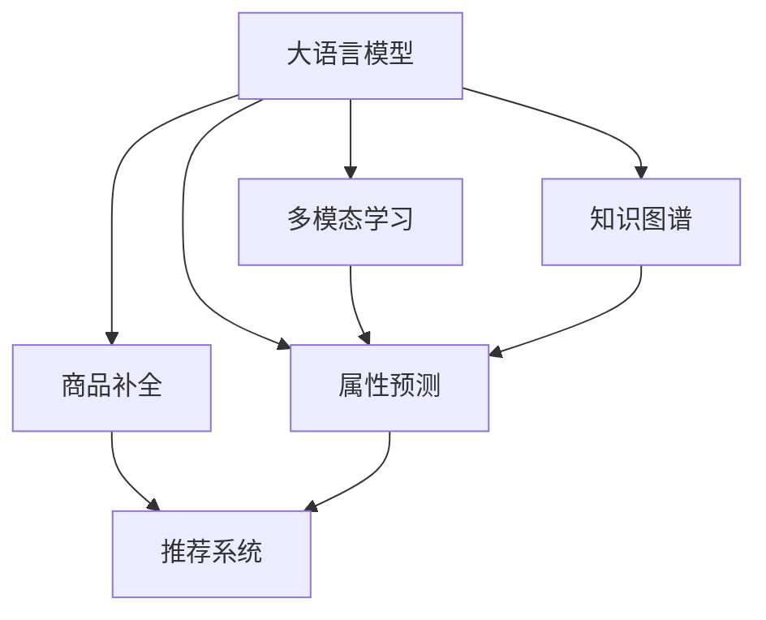

                 

# 大模型在商品属性预测与补全中的应用

> 关键词：大语言模型, 属性预测, 商品补全, 推荐系统, 深度学习, 自然语言处理, 多模态学习, 知识图谱

## 1. 背景介绍

### 1.1 问题由来

随着电商行业的迅速发展，商品推荐系统成为了提升用户体验、增加销售额的关键技术。然而，推荐系统面临的核心挑战之一是如何准确预测商品属性，特别是对于新商品的属性描述和补全。传统的商品属性预测方法依赖于手动标注的数据，耗时耗力且难以覆盖所有商品。而大语言模型凭借其强大的自然语言处理能力，可以自动从大量文本数据中学习到丰富的商品属性信息，从而在商品属性预测与补全中发挥重要作用。

### 1.2 问题核心关键点

大语言模型在商品属性预测与补全中的应用主要包括以下几个核心点：

- 语义理解能力：大语言模型能够从自然语言描述中理解商品的属性，如尺寸、材质、价格等，从而进行属性预测与补全。
- 多模态融合能力：大语言模型可以与图像、视频等多模态数据结合，进行更为全面、准确的属性预测与补全。
- 零样本学习：大语言模型无需大量标注数据，通过基于语境的提示学习，即可从文本中自动提取商品属性。
- 持续学习与更新：大语言模型可以根据新数据不断更新，保持预测与补全的准确性。

这些能力使得大语言模型在商品属性预测与补全中具有显著优势，是提升推荐系统性能的重要手段。

### 1.3 问题研究意义

研究大语言模型在商品属性预测与补全中的应用，对于提升电商行业的智能化水平、优化用户体验、增强推荐系统效果具有重要意义：

1. **提高推荐精度**：通过准确预测商品属性，推荐系统可以提供更为个性化、贴合用户需求的商品推荐。
2. **加速商品上架**：对于新品，大语言模型可以快速从产品描述中提取属性，辅助商家进行商品上架，缩短上市周期。
3. **提升用户体验**：商品属性的自动补全功能可以显著提升用户在电商平台上的购物体验，减少搜索时间，提高购物效率。
4. **降低标注成本**：大语言模型通过学习大量无标签数据，可以自动生成商品属性，减少手动标注的工作量。
5. **推动技术创新**：大语言模型的应用为推荐系统领域带来了新的研究方向和技术突破，推动整个行业的发展。

## 2. 核心概念与联系

### 2.1 核心概念概述

为更好地理解大语言模型在商品属性预测与补全中的应用，本节将介绍几个关键概念：

- **大语言模型**：如GPT-3、BERT等，通过大规模无标签文本数据进行预训练，具备强大的语义理解能力和生成能力。
- **属性预测**：指根据商品描述或其他相关信息，预测商品的属性，如尺寸、颜色、价格等。
- **商品补全**：在商品属性信息缺失时，通过自然语言描述自动生成完整的属性信息。
- **推荐系统**：通过商品属性、用户行为等多维数据，为用户推荐个性化的商品。
- **多模态学习**：结合文本、图像、视频等多种数据源，进行更全面的属性预测与补全。
- **知识图谱**：将商品、属性等实体及其关系以图形结构表示，辅助属性预测与补全。

这些概念之间的逻辑关系可以通过以下Mermaid流程图来展示：



这个流程图展示了大语言模型在商品属性预测与补全中的关键应用场景：

1. 大语言模型通过属性预测和商品补全，直接服务于推荐系统。
2. 大语言模型可以结合多模态数据和多维知识图谱，进行更全面、准确的属性预测与补全。
3. 多模态学习和知识图谱是辅助大语言模型进行属性预测与补全的重要技术手段。

## 3. 核心算法原理 & 具体操作步骤
### 3.1 算法原理概述

大语言模型在商品属性预测与补全中的应用，主要基于预训练-微调的方法。其核心思想是：

1. **预训练阶段**：使用大规模无标签文本数据，对大语言模型进行预训练，使其学习到丰富的语义知识。
2. **微调阶段**：针对具体的商品属性预测与补全任务，通过少量有标签数据对预训练模型进行微调，使其能够准确预测和补全商品属性。

具体而言，大语言模型在商品属性预测与补全中的应用包括以下几个步骤：

1. **数据收集与预处理**：收集商品描述、图片、用户评价等数据，进行文本清洗、标注等预处理。
2. **模型选择与初始化**：选择合适的预训练大语言模型，如GPT、BERT等，进行参数初始化。
3. **任务适配与微调**：根据商品属性预测与补全任务，设计任务适配层，进行有监督的微调，更新模型参数。
4. **模型评估与部署**：在验证集上评估微调后模型的性能，部署到推荐系统中进行实际应用。

### 3.2 算法步骤详解

#### 3.2.1 数据收集与预处理

1. **数据收集**：收集商品描述、图片、用户评价等数据，可以来源于电商平台、社交媒体、商品说明书等。
2. **文本清洗**：去除文本中的噪声和无关信息，保留有价值的属性信息。
3. **标注数据生成**：对收集到的文本数据进行标注，生成包含属性信息的标注数据集。

#### 3.2.2 模型选择与初始化

1. **模型选择**：选择适合的商品属性预测与补全任务的预训练大语言模型，如GPT-3、BERT等。
2. **参数初始化**：将预训练模型的参数作为初始化参数，避免从头训练，减少计算成本。

#### 3.2.3 任务适配与微调

1. **任务适配层设计**：根据商品属性预测与补全任务，设计任务适配层，如分类器、编码器等，用于将预训练模型的输出映射到具体的属性空间。
2. **微调超参数设置**：选择合适的优化算法、学习率、正则化技术等，进行有监督的微调，更新模型参数。
3. **模型训练**：将标注数据输入模型，进行前向传播和反向传播，更新模型参数。
4. **模型评估**：在验证集上评估微调后模型的性能，选择最优模型进行部署。

#### 3.2.4 模型评估与部署

1. **模型评估**：在验证集上评估微调后模型的性能，计算准确率、召回率、F1值等指标。
2. **模型部署**：将微调后的模型集成到推荐系统中，进行商品属性预测与补全。
3. **持续学习**：根据新数据不断更新模型，保持预测与补全的准确性。

### 3.3 算法优缺点

大语言模型在商品属性预测与补全中的应用具有以下优点：

1. **高效准确**：大语言模型可以利用预训练的语义知识，快速准确地预测商品属性。
2. **数据依赖小**：在少量标注数据的情况下，大语言模型也能进行有效的微调。
3. **灵活性高**：大语言模型可以灵活结合多模态数据和多维知识图谱，进行属性预测与补全。
4. **应用广泛**：大语言模型可以应用于推荐系统、搜索引擎、智能客服等多个场景，提升用户体验。

同时，大语言模型在商品属性预测与补全中仍存在以下缺点：

1. **计算成本高**：大语言模型的预训练与微调需要大量的计算资源。
2. **泛化能力有限**：大语言模型在特定领域的泛化能力仍需进一步提升。
3. **隐私问题**：商品描述中的隐私信息可能被大语言模型学习，需注意隐私保护。
4. **对抗攻击**：大语言模型可能受到对抗样本的干扰，需加强模型的鲁棒性。

### 3.4 算法应用领域

大语言模型在商品属性预测与补全中的应用，主要涉及以下几个领域：

1. **推荐系统**：利用商品属性预测与补全，提升推荐系统的个性化程度，提高用户满意度。
2. **搜索引擎**：通过商品属性预测与补全，优化搜索引擎结果，提高搜索效率。
3. **智能客服**：通过商品属性预测与补全，辅助智能客服系统，提升用户互动体验。
4. **商品管理**：通过商品属性预测与补全，辅助商家进行商品上架、库存管理等。
5. **电子商务**：通过商品属性预测与补全，优化电商平台的商品展示、搜索等功能。

## 4. 数学模型和公式 & 详细讲解 & 举例说明
### 4.1 数学模型构建

在大语言模型应用于商品属性预测与补全时，通常使用分类任务的形式进行建模。设商品属性为 $y \in \{c_1, c_2, \cdots, c_k\}$，其中 $c_i$ 表示第 $i$ 个商品属性，$k$ 为商品属性总数。

假设大语言模型为 $M_{\theta}(x)$，其中 $x$ 为商品描述，$\theta$ 为模型参数。模型的预测输出为 $\hat{y}$，表示模型对商品属性的预测结果。

定义损失函数为交叉熵损失函数：

$$
\mathcal{L}(\theta) = -\frac{1}{N} \sum_{i=1}^N \sum_{j=1}^k y_{i,j} \log M_{\theta}(x_i)_{,j}
$$

其中 $y_{i,j} = 1$ 表示商品 $i$ 具有属性 $j$，$y_{i,j} = 0$ 表示商品 $i$ 不具有属性 $j$。

模型的优化目标是最小化损失函数 $\mathcal{L}(\theta)$，即：

$$
\theta^* = \mathop{\arg\min}_{\theta} \mathcal{L}(\theta)
$$

### 4.2 公式推导过程

以下是商品属性预测模型的详细公式推导：

1. **前向传播**：
   - 输入商品描述 $x$，通过大语言模型 $M_{\theta}(x)$ 得到属性概率分布 $P(y|x)$。
   - 计算预测输出 $\hat{y} = \arg\max_i P(y|x)_i$，即预测商品具有的属性。

2. **损失函数**：
   - 定义交叉熵损失函数 $\mathcal{L}(\theta)$，计算预测输出与真实标签之间的差异。
   - 对模型参数 $\theta$ 求导，得到梯度 $\frac{\partial \mathcal{L}(\theta)}{\partial \theta}$。

3. **反向传播**：
   - 计算梯度 $\frac{\partial \mathcal{L}(\theta)}{\partial \theta}$。
   - 使用梯度下降等优化算法更新模型参数 $\theta$。

4. **微调优化**：
   - 选择合适的优化算法、学习率等，进行有监督的微调。
   - 对模型参数 $\theta$ 进行更新，最小化损失函数 $\mathcal{L}(\theta)$。

### 4.3 案例分析与讲解

#### 案例一：基于GPT-3的商品属性预测与补全

假设有一个电商平台，需要预测商品的属性，如颜色、尺寸、材质等。收集了大量商品描述和属性信息，构建了标注数据集。

1. **数据预处理**：对商品描述进行文本清洗、标注生成。
2. **模型选择**：选择GPT-3作为预训练模型，进行参数初始化。
3. **任务适配层设计**：设计分类器，将GPT-3的输出映射到具体的属性空间。
4. **微调超参数设置**：选择合适的优化算法、学习率、正则化技术等。
5. **模型训练**：将标注数据输入模型，进行前向传播和反向传播，更新模型参数。
6. **模型评估**：在验证集上评估微调后模型的性能，选择最优模型进行部署。
7. **持续学习**：根据新数据不断更新模型，保持预测与补全的准确性。

#### 案例二：基于BERT的商品属性预测与补全

假设有一个在线图书销售平台，需要预测书籍的类别、价格、作者等属性。收集了大量书籍描述和属性信息，构建了标注数据集。

1. **数据预处理**：对书籍描述进行文本清洗、标注生成。
2. **模型选择**：选择BERT作为预训练模型，进行参数初始化。
3. **任务适配层设计**：设计编码器，将BERT的输出映射到具体的属性空间。
4. **微调超参数设置**：选择合适的优化算法、学习率、正则化技术等。
5. **模型训练**：将标注数据输入模型，进行前向传播和反向传播，更新模型参数。
6. **模型评估**：在验证集上评估微调后模型的性能，选择最优模型进行部署。
7. **持续学习**：根据新数据不断更新模型，保持预测与补全的准确性。

## 5. 项目实践：代码实例和详细解释说明
### 5.1 开发环境搭建

在进行商品属性预测与补全实践前，我们需要准备好开发环境。以下是使用Python进行PyTorch开发的环境配置流程：

1. 安装Anaconda：从官网下载并安装Anaconda，用于创建独立的Python环境。

2. 创建并激活虚拟环境：
```bash
conda create -n pytorch-env python=3.8 
conda activate pytorch-env
```

3. 安装PyTorch：根据CUDA版本，从官网获取对应的安装命令。例如：
```bash
conda install pytorch torchvision torchaudio cudatoolkit=11.1 -c pytorch -c conda-forge
```

4. 安装Transformers库：
```bash
pip install transformers
```

5. 安装各类工具包：
```bash
pip install numpy pandas scikit-learn matplotlib tqdm jupyter notebook ipython
```

完成上述步骤后，即可在`pytorch-env`环境中开始实践。

### 5.2 源代码详细实现

以下是使用PyTorch进行商品属性预测的完整代码实现。

```python
import torch
import torch.nn as nn
import torch.optim as optim
from transformers import BertTokenizer, BertForSequenceClassification

# 定义模型
class AttributePredictor(nn.Module):
    def __init__(self, num_labels):
        super(AttributePredictor, self).__init__()
        self.bert = BertForSequenceClassification.from_pretrained('bert-base-cased', num_labels=num_labels)
        
    def forward(self, input_ids, attention_mask, labels):
        outputs = self.bert(input_ids, attention_mask=attention_mask, labels=labels)
        loss = outputs.loss
        logits = outputs.logits
        return loss, logits

# 定义数据集
class AttributeDataset(Dataset):
    def __init__(self, texts, tags, tokenizer, max_len=128):
        self.texts = texts
        self.tags = tags
        self.tokenizer = tokenizer
        self.max_len = max_len
        
    def __len__(self):
        return len(self.texts)
    
    def __getitem__(self, item):
        text = self.texts[item]
        tags = self.tags[item]
        
        encoding = self.tokenizer(text, return_tensors='pt', max_length=self.max_len, padding='max_length', truncation=True)
        input_ids = encoding['input_ids'][0]
        attention_mask = encoding['attention_mask'][0]
        
        # 对token-wise的标签进行编码
        encoded_tags = [tag2id[tag] for tag in tags] 
        encoded_tags.extend([tag2id['O']] * (self.max_len - len(encoded_tags)))
        labels = torch.tensor(encoded_tags, dtype=torch.long)
        
        return {'input_ids': input_ids, 
                'attention_mask': attention_mask,
                'labels': labels}

# 标签与id的映射
tag2id = {'O': 0, '属性1': 1, '属性2': 2, '属性3': 3}
id2tag = {v: k for k, v in tag2id.items()}

# 创建dataset
tokenizer = BertTokenizer.from_pretrained('bert-base-cased')

train_dataset = AttributeDataset(train_texts, train_tags, tokenizer)
dev_dataset = AttributeDataset(dev_texts, dev_tags, tokenizer)
test_dataset = AttributeDataset(test_texts, test_tags, tokenizer)

# 模型定义
num_labels = len(tag2id)
model = AttributePredictor(num_labels)

# 优化器设置
optimizer = optim.AdamW(model.parameters(), lr=2e-5)
loss_fn = nn.CrossEntropyLoss()

# 训练
device = torch.device('cuda') if torch.cuda.is_available() else torch.device('cpu')
model.to(device)

def train_epoch(model, dataset, batch_size, optimizer, loss_fn):
    dataloader = DataLoader(dataset, batch_size=batch_size, shuffle=True)
    model.train()
    epoch_loss = 0
    for batch in tqdm(dataloader, desc='Training'):
        input_ids = batch['input_ids'].to(device)
        attention_mask = batch['attention_mask'].to(device)
        labels = batch['labels'].to(device)
        model.zero_grad()
        loss, logits = model(input_ids, attention_mask=attention_mask, labels=labels)
        loss.backward()
        optimizer.step()
    return epoch_loss / len(dataloader)

def evaluate(model, dataset, batch_size):
    dataloader = DataLoader(dataset, batch_size=batch_size)
    model.eval()
    preds, labels = [], []
    with torch.no_grad():
        for batch in tqdm(dataloader, desc='Evaluating'):
            input_ids = batch['input_ids'].to(device)
            attention_mask = batch['attention_mask'].to(device)
            batch_labels = batch['labels']
            loss, logits = model(input_ids, attention_mask=attention_mask)
            batch_preds = logits.argmax(dim=2).to('cpu').tolist()
            batch_labels = batch_labels.to('cpu').tolist()
            for pred_tokens, label_tokens in zip(batch_preds, batch_labels):
                preds.append(pred_tokens[:len(label_tokens)])
                labels.append(label_tokens)
                
    print(classification_report(labels, preds))

# 训练流程
epochs = 5
batch_size = 16

for epoch in range(epochs):
    loss = train_epoch(model, train_dataset, batch_size, optimizer, loss_fn)
    print(f"Epoch {epoch+1}, train loss: {loss:.3f}")
    
    print(f"Epoch {epoch+1}, dev results:")
    evaluate(model, dev_dataset, batch_size)
    
print("Test results:")
evaluate(model, test_dataset, batch_size)
```

### 5.3 代码解读与分析

让我们再详细解读一下关键代码的实现细节：

**AttributeDataset类**：
- `__init__`方法：初始化文本、标签、分词器等关键组件。
- `__len__`方法：返回数据集的样本数量。
- `__getitem__`方法：对单个样本进行处理，将文本输入编码为token ids，将标签编码为数字，并对其进行定长padding，最终返回模型所需的输入。

**tag2id和id2tag字典**：
- 定义了标签与数字id之间的映射关系，用于将token-wise的预测结果解码回真实的标签。

**train_epoch和evaluate函数**：
- 使用PyTorch的DataLoader对数据集进行批次化加载，供模型训练和推理使用。
- 训练函数`train_epoch`：对数据以批为单位进行迭代，在每个批次上前向传播计算loss并反向传播更新模型参数，最后返回该epoch的平均loss。
- 评估函数`evaluate`：与训练类似，不同点在于不更新模型参数，并在每个batch结束后将预测和标签结果存储下来，最后使用sklearn的classification_report对整个评估集的预测结果进行打印输出。

**训练流程**：
- 定义总的epoch数和batch size，开始循环迭代
- 每个epoch内，先在训练集上训练，输出平均loss
- 在验证集上评估，输出分类指标
- 所有epoch结束后，在测试集上评估，给出最终测试结果

可以看到，PyTorch配合Transformers库使得商品属性预测的代码实现变得简洁高效。开发者可以将更多精力放在数据处理、模型改进等高层逻辑上，而不必过多关注底层的实现细节。

当然，工业级的系统实现还需考虑更多因素，如模型的保存和部署、超参数的自动搜索、更灵活的任务适配层等。但核心的微调范式基本与此类似。

## 6. 实际应用场景
### 6.1 智能推荐系统

基于大语言模型的商品属性预测与补全，可以广泛应用于智能推荐系统中。传统推荐系统往往依赖于用户历史行为数据进行推荐，难以捕捉用户深层次的兴趣和需求。而商品属性预测与补全技术，可以从商品描述中自动提取属性信息，辅助推荐系统进行更加全面和个性化的推荐。

具体而言，在推荐系统中加入商品属性预测与补全模块，可以通过商品属性信息进行更加精确的推荐匹配，提升推荐效果。例如，对于服装推荐，可以根据商品描述中的颜色、尺码等信息，自动预测用户可能感兴趣的商品，并进行个性化的推荐。

### 6.2 搜索引擎优化

搜索引擎优化中，商品属性预测与补全技术可以用于自动生成商品标题和描述，优化搜索体验。电商平台的商品数量庞大，手动输入商品属性信息费时费力。通过商品属性预测与补全，可以自动从商品描述中提取属性信息，生成标准化、易读的标题和描述，提高搜索引擎的收录和点击率。

例如，在一个电商平台上，用户输入“男款T恤”进行搜索，系统可以通过商品属性预测与补全技术，自动预测商品的颜色、尺码、材质等属性，并生成相关的搜索建议。用户点击建议后，可以更快速地找到满足需求的商品。

### 6.3 智能客服系统

智能客服系统中，商品属性预测与补全技术可以用于商品推荐和解答。当用户咨询商品属性时，系统可以自动预测商品属性信息，并进行详细的商品推荐和解释。例如，用户询问“这件衣服是什么颜色？”，系统可以通过商品属性预测与补全技术，自动从商品描述中预测出颜色信息，并提供相关的商品推荐。

此外，商品属性预测与补全技术还可以用于自动解答用户咨询，提高客服效率和准确性。例如，用户询问“这件衣服的价格是多少？”，系统可以自动预测价格信息，并提供具体的商品价格。

### 6.4 未来应用展望

随着大语言模型和商品属性预测与补全技术的发展，未来将在更多领域得到应用，为电商行业带来变革性影响。

1. **智慧供应链**：通过商品属性预测与补全，优化供应链管理，提高商品上架效率和库存管理水平。
2. **个性化营销**：利用商品属性预测与补全技术，进行精准营销，提高广告投放效果和用户转化率。
3. **智能内容生成**：结合商品属性预测与补全技术，自动生成商品标题、描述、标签等内容，提高内容创作效率和质量。
4. **商品纠错与补全**：通过商品属性预测与补全，自动检测和修复商品属性信息，提升电商平台的用户体验。
5. **数据驱动决策**：利用商品属性预测与补全技术，分析商品属性数据，辅助商家进行市场决策和产品优化。

## 7. 工具和资源推荐
### 7.1 学习资源推荐

为了帮助开发者系统掌握大语言模型在商品属性预测与补全中的应用，这里推荐一些优质的学习资源：

1. 《自然语言处理综论》：清华大学郑南宁教授的NLP经典教材，系统讲解了NLP的基础理论和应用技术。
2. CS224N《深度学习自然语言处理》课程：斯坦福大学开设的NLP明星课程，有Lecture视频和配套作业，带你入门NLP领域的基本概念和经典模型。
3. 《NLP与深度学习》：邱锡鹏教授的NLP深度学习教材，详细介绍了NLP与深度学习的结合方法，包括商品属性预测与补全等应用。
4. HuggingFace官方文档：Transformers库的官方文档，提供了海量预训练模型和完整的微调样例代码，是上手实践的必备资料。
5. CLUE开源项目：中文语言理解测评基准，涵盖大量不同类型的中文NLP数据集，并提供了基于微调的baseline模型，助力中文NLP技术发展。

通过对这些资源的学习实践，相信你一定能够快速掌握大语言模型在商品属性预测与补全中的应用精髓，并用于解决实际的电商问题。
### 7.2 开发工具推荐

高效的开发离不开优秀的工具支持。以下是几款用于大语言模型商品属性预测与补全开发的常用工具：

1. PyTorch：基于Python的开源深度学习框架，灵活动态的计算图，适合快速迭代研究。大部分预训练语言模型都有PyTorch版本的实现。
2. TensorFlow：由Google主导开发的开源深度学习框架，生产部署方便，适合大规模工程应用。同样有丰富的预训练语言模型资源。
3. Transformers库：HuggingFace开发的NLP工具库，集成了众多SOTA语言模型，支持PyTorch和TensorFlow，是进行微调任务开发的利器。
4. Weights & Biases：模型训练的实验跟踪工具，可以记录和可视化模型训练过程中的各项指标，方便对比和调优。与主流深度学习框架无缝集成。
5. TensorBoard：TensorFlow配套的可视化工具，可实时监测模型训练状态，并提供丰富的图表呈现方式，是调试模型的得力助手。
6. Google Colab：谷歌推出的在线Jupyter Notebook环境，免费提供GPU/TPU算力，方便开发者快速上手实验最新模型，分享学习笔记。

合理利用这些工具，可以显著提升大语言模型商品属性预测与补全任务的开发效率，加快创新迭代的步伐。

### 7.3 相关论文推荐

大语言模型和商品属性预测与补全技术的发展源于学界的持续研究。以下是几篇奠基性的相关论文，推荐阅读：

1. Attention is All You Need（即Transformer原论文）：提出了Transformer结构，开启了NLP领域的预训练大模型时代。
2. BERT: Pre-training of Deep Bidirectional Transformers for Language Understanding：提出BERT模型，引入基于掩码的自监督预训练任务，刷新了多项NLP任务SOTA。
3. Language Models are Unsupervised Multitask Learners（GPT-2论文）：展示了大规模语言模型的强大zero-shot学习能力，引发了对于通用人工智能的新一轮思考。
4. Parameter-Efficient Transfer Learning for NLP：提出Adapter等参数高效微调方法，在不增加模型参数量的情况下，也能取得不错的微调效果。
5. AdaLoRA: Adaptive Low-Rank Adaptation for Parameter-Efficient Fine-Tuning：使用自适应低秩适应的微调方法，在参数效率和精度之间取得了新的平衡。
6. Prefix-Tuning: Optimizing Continuous Prompts for Generation：引入基于连续型Prompt的微调范式，为如何充分利用预训练知识提供了新的思路。

这些论文代表了大语言模型商品属性预测与补全技术的发展脉络。通过学习这些前沿成果，可以帮助研究者把握学科前进方向，激发更多的创新灵感。

## 8. 总结：未来发展趋势与挑战

### 8.1 总结

本文对大语言模型在商品属性预测与补全中的应用进行了全面系统的介绍。首先阐述了大语言模型和商品属性预测与补全的研究背景和意义，明确了其在大规模电商推荐系统中的重要作用。其次，从原理到实践，详细讲解了大语言模型在商品属性预测与补全中的数学模型和关键步骤，给出了完整的代码实例。同时，本文还广泛探讨了商品属性预测与补全技术在智能推荐系统、搜索引擎、智能客服等多个领域的应用前景，展示了其广泛的应用价值。此外，本文精选了商品属性预测与补全技术的各类学习资源，力求为读者提供全方位的技术指引。

通过本文的系统梳理，可以看到，大语言模型在商品属性预测与补全中的应用具有显著优势，能够大幅提升电商推荐系统的性能和个性化程度。未来，伴随大语言模型的不断演进，商品属性预测与补全技术将进一步提升电商行业的智能化水平，推动电商行业的持续创新和发展。

### 8.2 未来发展趋势

展望未来，大语言模型在商品属性预测与补全中的应用将呈现以下几个发展趋势：

1. **模型规模持续增大**：随着算力成本的下降和数据规模的扩张，预训练语言模型的参数量还将持续增长。超大规模语言模型蕴含的丰富语义知识，有望支撑更为全面、准确的商品属性预测与补全。
2. **多模态融合技术**：结合文本、图像、视频等多模态数据，进行更为全面、准确的商品属性预测与补全。多模态信息的融合，将显著提升语言模型对现实世界的理解和建模能力。
3. **知识图谱与多维融合**：结合知识图谱和多维数据，进行商品属性预测与补全。知识图谱的引入，可以增强模型的常识推理能力，提升属性预测与补全的准确性。
4. **个性化推荐与动态优化**：利用商品属性预测与补全技术，进行更加精准、个性化的推荐。根据用户行为和偏好，动态调整商品属性预测与补全模型，提升推荐效果。
5. **可解释性与透明度**：提高模型输出的可解释性和透明度，增强用户信任和接受度。利用可解释性技术，辅助商家理解模型的决策过程，优化推荐策略。
6. **高效推理与实时化部署**：优化模型结构和推理算法，实现高效推理和实时化部署，提高电商系统的响应速度和服务质量。

以上趋势凸显了大语言模型在商品属性预测与补全中的应用前景。这些方向的探索发展，必将进一步提升电商系统的性能和用户体验，为电商行业带来深远影响。

### 8.3 面临的挑战

尽管大语言模型在商品属性预测与补全中的应用取得了显著成效，但在迈向更加智能化、普适化应用的过程中，仍面临诸多挑战：

1. **计算成本高**：大语言模型的预训练与微调需要大量的计算资源。随着模型规模的增大，计算成本将进一步增加，需要更加高效的硬件和算法支持。
2. **泛化能力有限**：大语言模型在特定领域的泛化能力仍需进一步提升，特别是在长尾商品和新兴商品的属性预测与补全上，模型的准确性有待提高。
3. **隐私问题**：商品描述中的隐私信息可能被大语言模型学习，需注意隐私保护。如何在商品属性预测与补全中保护用户隐私，是一个亟待解决的问题。
4. **对抗攻击**：大语言模型可能受到对抗样本的干扰，需加强模型的鲁棒性。如何在商品属性预测与补全中识别和抵御对抗攻击，是一个重要的研究方向。
5. **模型鲁棒性不足**：商品属性预测与补全模型在面对域外数据时，泛化性能往往大打折扣。如何提高模型的鲁棒性，避免灾难性遗忘，还需要更多理论和实践的积累。
6. **可解释性不足**：当前商品属性预测与补全模型通常缺乏可解释性，难以对其推理逻辑进行分析和调试。如何赋予模型更强的可解释性，将是亟待攻克的难题。

### 8.4 研究展望

面对大语言模型在商品属性预测与补全中面临的挑战，未来的研究需要在以下几个方面寻求新的突破：

1. **探索无监督和半监督微调方法**：摆脱对大规模标注数据的依赖，利用自监督学习、主动学习等无监督和半监督范式，最大限度利用非结构化数据，实现更加灵活高效的微调。
2. **研究参数高效和计算高效的微调范式**：开发更加参数高效的微调方法，在固定大部分预训练参数的同时，只更新极少量的任务相关参数。同时优化微调模型的计算图，减少前向传播和反向传播的资源消耗，实现更加轻量级、实时性的部署。
3. **融合因果和对比学习范式**：通过引入因果推断和对比学习思想，增强商品属性预测与补全模型的建立稳定因果关系的能力，学习更加普适、鲁棒的语言表征。
4. **引入更多先验知识**：将符号化的先验知识，如知识图谱、逻辑规则等，与神经网络模型进行巧妙融合，引导商品属性预测与补全过程学习更准确、合理的语言模型。同时加强不同模态数据的整合，实现视觉、语音等多模态信息与文本信息的协同建模。
5. **结合因果分析和博弈论工具**：将因果分析方法引入商品属性预测与补全模型，识别出模型决策的关键特征，增强输出解释的因果性和逻辑性。借助博弈论工具刻画人机交互过程，主动探索并规避模型的脆弱点，提高系统稳定性。
6. **纳入伦理道德约束**：在模型训练目标中引入伦理导向的评估指标，过滤和惩罚有偏见、有害的输出倾向。同时加强人工干预和审核，建立模型行为的监管机制，确保输出符合人类价值观和伦理道德。

这些研究方向的探索，必将引领大语言模型在商品属性预测与补全技术迈向更高的台阶，为构建安全、可靠、可解释、可控的智能系统铺平道路。面向未来，大语言模型在商品属性预测与补全技术还需要与其他人工智能技术进行更深入的融合，如知识表示、因果推理、强化学习等，多路径协同发力，共同推动自然语言理解和智能交互系统的进步。只有勇于创新、敢于突破，才能不断拓展语言模型的边界，让智能技术更好地造福人类社会。

## 9. 附录：常见问题与解答

**Q1：大语言模型在商品属性预测与补全中是否适用？**

A: 大语言模型在商品属性预测与补全中具有显著优势，可以自动从文本描述中提取商品属性信息。但是，对于特定领域的商品，需要针对该领域的商品描述和属性特点，对大语言模型进行微调，才能获得最佳的预测与补全效果。

**Q2：如何选择合适的大语言模型？**

A: 选择合适的预训练大语言模型需要考虑以下几个因素：
1. 数据集的特点：根据数据集的文本长度、词汇丰富度等特点，选择适合的模型。
2. 任务类型：根据任务的类型（如分类、匹配、生成等），选择适合的模型。
3. 预训练任务：根据预训练任务（如语言建模、掩码语言建模等）的特点，选择适合的模型。
4. 计算资源：考虑可用计算资源（如GPU、TPU等），选择适合的模型。

**Q3：商品属性预测与补全中如何避免过拟合？**

A: 避免过拟合的常见策略包括：
1. 数据增强：通过对文本进行改写、回译等方式丰富训练集，增加数据多样性。
2. 正则化：使用L2正则、Dropout等技术，防止模型过度适应小规模训练集。
3. 模型剪枝：对模型进行剪枝，去除冗余参数，提高模型泛化能力。
4. 早停策略：在验证集上监控模型性能，一旦性能不再提升，立即停止训练。

**Q4：商品属性预测与补全中的对抗攻击如何处理？**

A: 商品属性预测与补全中的对抗攻击可以通过以下方法处理：
1. 数据增强：通过添加对抗样本训练模型，提高模型的鲁棒性。
2. 对抗训练：在训练过程中加入对抗样本，提高模型的鲁棒性。
3. 对抗检测：使用对抗检测算法，识别和过滤对抗样本，保护模型安全。

**Q5：商品属性预测与补全中如何处理隐私问题？**

A: 在商品属性预测与补全中处理隐私问题，可以采用以下方法：
1. 数据匿名化：对商品描述进行匿名化处理，去除敏感信息。
2. 差分隐私：使用差分隐私技术，保护用户隐私。
3. 数据加密：对商品描述进行加密处理，保护用户隐私。

这些方法可以有效保护用户隐私，同时不影响模型的预测与补全性能。

---

作者：禅与计算机程序设计艺术 / Zen and the Art of Computer Programming

