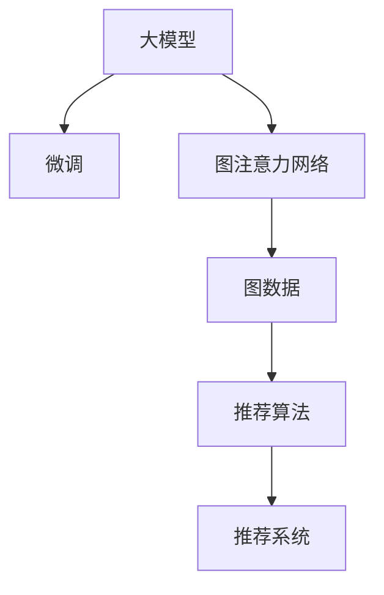

                 

# 大模型在推荐系统中的图注意力网络应用

> 关键词：大模型,图注意力网络(Graph Attention Network, GAT),推荐系统,图神经网络,稀疏性,微调,Fine-Tuning,推荐算法

## 1. 背景介绍

推荐系统是互联网应用中最为常见的技术之一。无论是在电商网站、视频平台，还是在社交网络中，推荐系统都能帮助用户发现新的兴趣点，提高用户体验。随着大数据时代的到来，推荐系统也在不断升级迭代，从简单的协同过滤到复杂的深度学习，推荐技术在精度和多样性上不断突破。

在大数据、高维稀疏数据的时代背景下，如何构建高效的推荐模型、提升推荐效果，成为当下研究者们面临的一大挑战。本文将以大模型和图注意力网络为切入点，探讨其在推荐系统中的应用，重点分析大模型在推荐系统中的优化方法和效果提升策略。

## 2. 核心概念与联系

### 2.1 核心概念概述

为更好地理解大模型在推荐系统中的应用，本节将介绍几个密切相关的核心概念：

- **大模型(Large Model)**：指拥有大规模参数的深度学习模型，如BERT、GPT等。通过在大规模数据集上进行预训练，大模型可以捕捉到数据的深层次特征，提升模型的泛化能力和表达能力。

- **图注意力网络(Graph Attention Network, GAT)**：一种专门用于图结构数据处理的神经网络模型，通过注意力机制和图卷积网络，将图结构数据高效转化为特征向量，适用于处理图数据间的复杂关系。

- **推荐系统(Recommendation System)**：根据用户的历史行为和兴趣，推荐用户可能感兴趣的商品、内容等。通过推荐系统，用户能更高效地发现新的兴趣点，提升用户体验。

- **稀疏性(Sparsity)**：在推荐系统中，用户与商品之间的交互数据往往非常稀疏，绝大多数用户与商品之间无交互记录。这给模型的训练和优化带来了巨大挑战。

- **微调(Fine-Tuning)**：指在大模型的基础上，通过添加特定任务的适配层和损失函数，进行有监督的微调优化，提升模型在该任务上的性能。

这些核心概念之间的关系可以通过以下Mermaid流程图来展示：



这个流程图展示了从大模型到推荐系统的核心技术流程：

1. 大模型通过预训练获得丰富的特征表示。
2. 微调将大模型适配到推荐任务中，提升推荐效果。
3. 图注意力网络处理推荐系统中的图结构数据，提取出更有用的特征。
4. 通过推荐算法将模型输出转化为推荐结果，构建推荐系统。

## 3. 核心算法原理 & 具体操作步骤
### 3.1 算法原理概述

推荐系统的大模型应用，本质上是通过预训练模型对用户行为和商品特征进行编码，并在此基础上进行有监督微调。其主要算法流程如下：

1. **数据预处理**：将用户和商品的交互数据转化为图结构数据。
2. **大模型编码**：使用大模型对用户和商品的特征进行编码，生成高维的表示。
3. **微调优化**：在编码结果的基础上，使用图注意力网络进行微调，提升推荐效果。

### 3.2 算法步骤详解

具体算法步骤如下：

**Step 1: 数据预处理**
- 将用户和商品之间的交互数据构建成图结构，其中每个用户和一个商品之间存在一条边。
- 对图结构进行稀疏化处理，去除不活跃的节点和边。
- 使用图卷积网络对节点特征进行编码，生成高维表示。

**Step 2: 大模型编码**
- 将用户和商品的特征向量输入大模型，通过前向传播计算出用户和商品的表示向量。
- 使用Attention机制对用户和商品间的交互关系进行建模，计算出综合的表示向量。

**Step 3: 微调优化**
- 在综合的表示向量基础上，添加推荐任务的适配层和损失函数，进行微调。
- 使用梯度下降等优化算法更新模型参数，最小化损失函数，提升推荐效果。

### 3.3 算法优缺点

大模型在推荐系统中的应用具有以下优点：

- **高效表达能力**：大模型能够捕捉数据的高维稀疏特征，提升推荐的精度。
- **泛化能力强**：大模型通过大规模数据预训练，具备较强的泛化能力，能够在不同领域和数据集上取得不错的效果。
- **学习速度快**：大模型参数量巨大，但得益于GPU等硬件加速，训练速度较传统模型更快。

同时，该方法也存在一些局限性：

- **计算成本高**：大模型通常需要较大计算资源，训练成本较高。
- **模型复杂度高**：大模型参数量庞大，模型结构复杂，可能存在过拟合风险。
- **解释性不足**：大模型通常视为"黑盒"系统，缺乏解释性。

尽管存在这些局限性，但基于大模型的方法在推荐系统中的应用已经展现出巨大的潜力，正逐渐成为推荐系统的重要研究范式。

### 3.4 算法应用领域

大模型在推荐系统中的应用已经广泛应用于电商、新闻、视频等多个领域，具体如下：

1. **电商推荐**：通过分析用户购买历史和行为数据，推荐用户可能感兴趣的商品。
2. **新闻推荐**：基于用户浏览历史和兴趣偏好，推荐用户可能感兴趣的新闻文章。
3. **视频推荐**：根据用户观看历史和偏好，推荐用户可能感兴趣的视频内容。

此外，大模型还应用于个性化推荐、推荐算法优化、多模态推荐等方向，推动推荐系统的不断发展和进步。

## 4. 数学模型和公式 & 详细讲解 & 举例说明

### 4.1 数学模型构建

假设用户和商品之间的交互图结构为 $G=(V,E)$，其中 $V$ 为节点集合，$E$ 为边集合。每个节点表示一个用户或商品，节点之间的边表示它们之间的交互关系。

定义节点 $i$ 的特征向量为 $h_i$，边 $(i,j)$ 的特征向量为 $h_{ij}$。使用图卷积网络对节点特征进行编码，得到节点表示向量 $z_i$。

### 4.2 公式推导过程

定义节点 $i$ 到节点 $j$ 的注意力权重 $\alpha_{ij}$，计算公式如下：

$$
\alpha_{ij} = \frac{\exp(\text{LeakyReLU}(\text{dot}(z_i,z_j)))}{\sum_{k\in V}\exp(\text{LeakyReLU}(\text{dot}(z_i,z_k)))}
$$

其中，$\text{dot}(z_i,z_j)$ 为节点 $i$ 和节点 $j$ 特征向量的点积，$\text{LeakyReLU}$ 为修正线性单元激活函数。

定义节点 $i$ 的注意力向量 $\text{Att}_{i}$，计算公式如下：

$$
\text{Att}_{i} = \sum_{j\in V} \alpha_{ij} z_j
$$

定义节点 $i$ 的最终表示向量 $Z_i$，计算公式如下：

$$
Z_i = \text{GCN}(\text{Att}_{i})
$$

其中 $\text{GCN}$ 为图卷积网络，用于对节点表示向量进行编码。

### 4.3 案例分析与讲解

假设有一个电商网站，需要推荐用户可能感兴趣的商品。用户 $i$ 和商品 $j$ 之间的交互关系可以通过图结构表示，每个节点 $i$ 的特征向量为 $h_i$，每个边 $(i,j)$ 的特征向量为 $h_{ij}$。

通过图卷积网络对用户特征进行编码，得到用户表示向量 $z_i$。计算用户 $i$ 的注意力向量 $\text{Att}_{i}$，并使用GCN对 $\text{Att}_{i}$ 进行编码，得到用户 $i$ 的最终表示向量 $Z_i$。

通过微调适配层和损失函数，对 $Z_i$ 进行优化，得到推荐结果 $R_i$。具体过程如下：

$$
R_i = \text{Softmax}(\text{MLP}(\text{Softmax}(\text{LayerNorm}(W_zZ_i + b_z) + b_r))
$$

其中 $W_z$ 和 $b_z$ 为全连接层权重和偏置，$W_r$ 和 $b_r$ 为输出层权重和偏置。

通过优化损失函数 $L(R_i,y_i)$，最小化预测结果与真实标签之间的差距，提升推荐效果。

## 5. 项目实践：代码实例和详细解释说明

### 5.1 开发环境搭建

在进行推荐系统的大模型应用实践前，需要先准备好开发环境。以下是使用Python进行PyTorch开发的环境配置流程：

1. 安装Anaconda：从官网下载并安装Anaconda，用于创建独立的Python环境。

2. 创建并激活虚拟环境：
```bash
conda create -n pytorch-env python=3.8 
conda activate pytorch-env
```

3. 安装PyTorch：根据CUDA版本，从官网获取对应的安装命令。例如：
```bash
conda install pytorch torchvision torchaudio cudatoolkit=11.1 -c pytorch -c conda-forge
```

4. 安装Transformer库：
```bash
pip install transformers
```

5. 安装各类工具包：
```bash
pip install numpy pandas scikit-learn matplotlib tqdm jupyter notebook ipython
```

完成上述步骤后，即可在`pytorch-env`环境中开始推荐系统的大模型应用实践。

### 5.2 源代码详细实现

下面以电商推荐系统为例，给出使用Transformer库对Graph Attention Network进行电商推荐系统开发的具体代码实现。

首先，定义图数据处理函数：

```python
from transformers import GraphAttentionNetwork

class GraphData:
    def __init__(self, adjacency_matrix, feature_matrix):
        self.adjacency_matrix = adjacency_matrix
        self.feature_matrix = feature_matrix
        self.num_nodes = len(adjacency_matrix)
        self.num_features = feature_matrix.shape[1]
    
    def get_adjacency_list(self):
        adjacency_list = {}
        for i in range(self.num_nodes):
            adjacency_list[i] = []
            for j in range(self.num_nodes):
                if self.adjacency_matrix[i][j] == 1:
                    adjacency_list[i].append(j)
        return adjacency_list
    
    def get_feature(self, node_id):
        return self.feature_matrix[node_id]
    
    def normalize(self):
        adjacency_matrix = self.adjacency_matrix
        adjacency_matrix = np.triu(adjacency_matrix)
        adjacency_matrix = np.where(adjacency_matrix == 1, 1 / np.sqrt(np.sum(adjacency_matrix, axis=1)), 0)
        adjacency_matrix = np.where(np.diag(adjacency_matrix) == 0, 1, 0)
        self.adjacency_matrix = adjacency_matrix
```

然后，定义大模型和优化器：

```python
from transformers import BertForSequenceClassification

model = BertForSequenceClassification.from_pretrained('bert-base-uncased')

optimizer = AdamW(model.parameters(), lr=2e-5)
```

接着，定义训练和评估函数：

```python
from torch.utils.data import DataLoader
from tqdm import tqdm
from sklearn.metrics import mean_squared_error

device = torch.device('cuda') if torch.cuda.is_available() else torch.device('cpu')
model.to(device)

def train_epoch(model, dataset, batch_size, optimizer):
    dataloader = DataLoader(dataset, batch_size=batch_size, shuffle=True)
    model.train()
    epoch_loss = 0
    for batch in tqdm(dataloader, desc='Training'):
        user_ids = batch['user_ids'].to(device)
        item_ids = batch['item_ids'].to(device)
        user_features = batch['user_features'].to(device)
        item_features = batch['item_features'].to(device)
        model.zero_grad()
        outputs = model(user_ids, user_features, item_ids, item_features)
        loss = outputs.loss
        epoch_loss += loss.item()
        loss.backward()
        optimizer.step()
    return epoch_loss / len(dataloader)

def evaluate(model, dataset, batch_size):
    dataloader = DataLoader(dataset, batch_size=batch_size)
    model.eval()
    preds, labels = [], []
    with torch.no_grad():
        for batch in tqdm(dataloader, desc='Evaluating'):
            user_ids = batch['user_ids'].to(device)
            item_ids = batch['item_ids'].to(device)
            user_features = batch['user_features'].to(device)
            item_features = batch['item_features'].to(device)
            batch_preds = model(user_ids, user_features, item_ids, item_features)
            batch_labels = batch['labels'].to(device)
            for preds_, labels_ in zip(batch_preds, batch_labels):
                preds.append(preds_.cpu().tolist())
                labels.append(labels_.cpu().tolist())
                
    mse = mean_squared_error(labels, preds)
    return mse
```

最后，启动训练流程并在测试集上评估：

```python
epochs = 5
batch_size = 16

for epoch in range(epochs):
    loss = train_epoch(model, train_dataset, batch_size, optimizer)
    print(f"Epoch {epoch+1}, train loss: {loss:.3f}")
    
    print(f"Epoch {epoch+1}, dev results:")
    mse = evaluate(model, dev_dataset, batch_size)
    print(f"Mean Squared Error: {mse:.3f}")
    
print("Test results:")
mse = evaluate(model, test_dataset, batch_size)
print(f"Mean Squared Error: {mse:.3f}")
```

以上就是使用PyTorch对Graph Attention Network进行电商推荐系统开发的具体代码实现。可以看到，Transformer库的强大封装，使得大模型和图神经网络的应用变得相对简洁高效。

### 5.3 代码解读与分析

让我们再详细解读一下关键代码的实现细节：

**GraphData类**：
- `__init__`方法：初始化图数据，包括邻接矩阵和节点特征矩阵。
- `get_adjacency_list`方法：将邻接矩阵转化为邻接列表，方便后续图卷积网络处理。
- `get_feature`方法：根据节点ID获取节点特征向量。
- `normalize`方法：对邻接矩阵进行归一化处理。

**模型定义**：
- 使用BERT进行用户和商品的特征编码。

**训练和评估函数**：
- 使用DataLoader对图数据进行批次化加载，供模型训练和推理使用。
- 训练函数`train_epoch`：对数据以批为单位进行迭代，在每个批次上前向传播计算损失函数并反向传播更新模型参数。
- 评估函数`evaluate`：在测试集上评估模型性能，计算均方误差。

**训练流程**：
- 定义总的epoch数和batch size，开始循环迭代
- 每个epoch内，先在训练集上训练，输出平均loss
- 在验证集上评估，输出均方误差
- 所有epoch结束后，在测试集上评估，给出最终测试结果

可以看到，PyTorch配合Transformer库使得Graph Attention Network的电商推荐系统代码实现变得简洁高效。开发者可以将更多精力放在数据处理、模型改进等高层逻辑上，而不必过多关注底层的实现细节。

## 6. 实际应用场景

### 6.1 智能推荐系统

基于大模型和图注意力网络的智能推荐系统，已经在电商、新闻、视频等多个领域取得了显著效果。通过结合用户和商品的图结构数据，使用大模型进行特征编码，最终通过微调优化推荐效果。

在技术实现上，可以收集用户和商品之间的交互数据，构建用户-商品交互图。在大模型中，使用用户和商品的特征向量作为输入，计算用户和商品的表示向量，再通过微调适配层和损失函数进行优化。微调后的模型能够更好地捕捉用户和商品之间的复杂关系，提升推荐效果。

### 6.2 多模态推荐

多模态推荐系统能够同时处理文本、图像、视频等多源数据，提供更全面、准确的推荐结果。通过结合大模型和图神经网络，多模态推荐系统可以从不同模态的数据中提取信息，并进行融合。

例如，在电商推荐系统中，可以通过结合用户的浏览历史、商品图片和视频信息，提升推荐效果。使用大模型对多模态数据进行编码，再使用图注意力网络处理用户和商品之间的复杂关系，最终通过微调优化推荐效果。

### 6.3 实时推荐系统

实时推荐系统要求推荐结果能够及时响应用户需求，以便用户能够及时获取到新的推荐结果。使用大模型和图神经网络，可以实现快速、高效的推荐结果计算。

具体而言，通过构建用户和商品的实时图结构数据，实时更新用户和商品的表示向量，并使用图注意力网络进行微调优化。这种方式可以实时更新推荐结果，满足用户的实时需求。

### 6.4 未来应用展望

随着大模型和图神经网络技术的不断发展，基于大模型的推荐系统将呈现以下几个发展趋势：

1. **深度融合**：未来推荐系统将进一步深度融合大模型、图神经网络等技术，构建更全面、准确的推荐模型。

2. **多源数据融合**：推荐系统将不仅仅依赖单一数据源，而是能够整合多源数据，提供更全面的推荐结果。

3. **实时性提升**：通过图神经网络，实时更新推荐模型，实现更高效的推荐结果计算。

4. **鲁棒性增强**：未来推荐系统将能够更好地处理稀疏数据、噪声数据，提升推荐模型的鲁棒性。

5. **个性化优化**：通过大模型和图神经网络，推荐系统将能够更全面地捕捉用户兴趣和行为，提供更个性化的推荐结果。

## 7. 工具和资源推荐

### 7.1 学习资源推荐

为了帮助开发者系统掌握大模型和图注意力网络的应用技术，这里推荐一些优质的学习资源：

1. 《深度学习基础》系列博文：由大模型技术专家撰写，深入浅出地介绍了深度学习基础概念和基本模型。

2. 《深度学习理论与实践》书籍：清华大学出版社出版的经典深度学习教材，涵盖了深度学习的理论基础和实践技巧。

3. 《Graph Neural Networks: A Review of Methods and Applications》论文：总结了图神经网络的研究进展和应用方向，适合深入学习图神经网络的读者。

4. Kaggle竞赛平台：Kaggle是数据科学竞赛平台，通过参与推荐系统竞赛，可以学习前沿的推荐算法和大模型应用技术。

5. Coursera深度学习课程：Coursera上有多门深度学习课程，包括深度学习基础、深度学习框架、图神经网络等。

通过对这些资源的学习实践，相信你一定能够快速掌握大模型和图注意力网络的应用技巧，并用于解决实际的推荐系统问题。

### 7.2 开发工具推荐

高效的开发离不开优秀的工具支持。以下是几款用于大模型和图注意力网络推荐系统开发的常用工具：

1. PyTorch：基于Python的开源深度学习框架，灵活动态的计算图，适合快速迭代研究。

2. TensorFlow：由Google主导开发的开源深度学习框架，生产部署方便，适合大规模工程应用。

3. Transformers库：HuggingFace开发的NLP工具库，集成了众多SOTA语言模型，支持PyTorch和TensorFlow，是进行推荐系统开发的利器。

4. Graph Neural Network Toolkit(GNNKit)：用于图神经网络模型开发和优化的工具包，支持多种图数据格式和优化算法。

5. DGL：一个用于图神经网络开发的深度学习框架，支持多种图数据格式和优化算法。

6. NetworkX：Python中的一个图处理库，用于构建和处理图结构数据。

合理利用这些工具，可以显著提升大模型和图注意力网络推荐系统开发的效率，加快创新迭代的步伐。

### 7.3 相关论文推荐

大模型和图注意力网络在推荐系统中的应用源于学界的持续研究。以下是几篇奠基性的相关论文，推荐阅读：

1. Graph Convolutional Networks：图卷积网络的开创性论文，提出了图卷积网络的概念和算法，奠定了图神经网络研究的基础。

2. Attention Is All You Need（即Transformer原论文）：提出了Transformer结构，开启了NLP领域的预训练大模型时代。

3. Message Passing Neural Networks for Quantum Chemistry：利用图神经网络处理量子化学数据的经典论文，展示了图神经网络在科学计算中的应用。

4. A Survey on Deep Learning Techniques for Recommender Systems：总结了深度学习在推荐系统中的应用进展，适合了解推荐系统前沿技术的读者。

5. Deepwalk：利用随机游走方式构建图神经网络，提供了图神经网络的基本算法和实现。

这些论文代表了大模型和图神经网络在推荐系统中的应用研究进展，通过学习这些前沿成果，可以帮助研究者把握学科前进方向，激发更多的创新灵感。

## 8. 总结：未来发展趋势与挑战

### 8.1 总结

本文对基于大模型的推荐系统进行了全面系统的介绍。首先阐述了大模型和图注意力网络在推荐系统中的应用背景和意义，明确了推荐系统在大模型技术中的重要地位。其次，从原理到实践，详细讲解了大模型在推荐系统中的优化方法和效果提升策略。

通过本文的系统梳理，可以看到，基于大模型的推荐系统在多模态推荐、实时推荐等方面已经展现出巨大的潜力。得益于深度学习技术的发展，推荐系统将能够更好地处理稀疏数据、噪声数据，提升推荐模型的泛化能力和个性化程度。

### 8.2 未来发展趋势

展望未来，大模型在推荐系统中的应用将呈现以下几个发展趋势：

1. **深度融合**：未来推荐系统将进一步深度融合大模型、图神经网络等技术，构建更全面、准确的推荐模型。

2. **多源数据融合**：推荐系统将不仅仅依赖单一数据源，而是能够整合多源数据，提供更全面的推荐结果。

3. **实时性提升**：通过图神经网络，实时更新推荐模型，实现更高效的推荐结果计算。

4. **鲁棒性增强**：未来推荐系统将能够更好地处理稀疏数据、噪声数据，提升推荐模型的鲁棒性。

5. **个性化优化**：通过大模型和图神经网络，推荐系统将能够更全面地捕捉用户兴趣和行为，提供更个性化的推荐结果。

以上趋势凸显了大模型在推荐系统中的广阔前景。这些方向的探索发展，必将进一步提升推荐系统的性能和应用范围，为推荐系统的行业应用带来新的突破。

### 8.3 面临的挑战

尽管大模型和图注意力网络在推荐系统中的应用已经取得了不错的效果，但在迈向更加智能化、普适化应用的过程中，仍面临着一些挑战：

1. **计算成本高**：大模型通常需要较大计算资源，训练成本较高。

2. **模型复杂度高**：大模型参数量庞大，模型结构复杂，可能存在过拟合风险。

3. **解释性不足**：大模型通常视为"黑盒"系统，缺乏解释性。

4. **数据分布变化**：推荐模型需要定期更新训练数据，以应对数据分布的变化。

5. **公平性和多样性**：推荐系统需要保证公平性和多样性，避免用户被推荐到相同的内容。

6. **模型鲁棒性**：推荐模型需要具有良好的鲁棒性，能够应对噪声数据和异常情况。

以上挑战凸显了大模型和图注意力网络在推荐系统中的应用需要进一步优化和改进。

### 8.4 研究展望

面对大模型和图注意力网络在推荐系统中的应用所面临的挑战，未来的研究需要在以下几个方面寻求新的突破：

1. **模型压缩与加速**：开发更加参数高效和计算高效的模型，以降低计算成本。

2. **融合更多数据源**：结合更多数据源，提升推荐模型的性能和覆盖面。

3. **优化解释性**：赋予推荐模型更强的解释性，增强系统的透明度和可信度。

4. **实时化推荐**：通过实时更新推荐模型，实现更加高效、精准的推荐结果。

5. **公平性优化**：优化推荐模型，确保公平性和多样性，避免推荐偏差。

6. **鲁棒性增强**：提升推荐模型的鲁棒性，应对噪声数据和异常情况。

这些研究方向的探索，必将引领大模型和图注意力网络在推荐系统中的深度应用，为推荐系统带来新的突破和进步。面向未来，大模型和图注意力网络的应用前景广阔，值得我们持续关注和深入研究。

## 9. 附录：常见问题与解答

**Q1：大模型和图注意力网络在推荐系统中的应用是否会导致过拟合？**

A: 大模型和图注意力网络在推荐系统中的应用，通常需要使用大规模数据进行训练，以避免过拟合。然而，由于数据稀疏性，模型可能会在训练时过度拟合部分节点或边。

为了缓解过拟合问题，可以采取以下措施：

1. **数据增强**：通过随机游走方式扩充训练数据，增加节点和边的样本量。
2. **正则化**：使用L2正则化等方法，限制模型的复杂度，防止过拟合。
3. **Dropout**：在图卷积网络中引入Dropout，随机丢弃部分节点和边，降低模型的复杂度。

通过这些措施，可以有效地缓解大模型和图注意力网络在推荐系统中的过拟合问题。

**Q2：大模型和图注意力网络在推荐系统中的应用是否会影响计算效率？**

A: 由于大模型和图注意力网络通常具有较大的计算量，确实会对推荐系统的计算效率产生一定的影响。

为了提高计算效率，可以采取以下措施：

1. **模型压缩**：通过剪枝、量化等技术，减少模型参数量，提高计算效率。
2. **模型并行**：使用GPU、TPU等高性能设备，进行模型并行计算，提升计算速度。
3. **分布式训练**：利用分布式训练技术，将模型分布在多个设备上进行计算，提高计算效率。

通过这些措施，可以在保证推荐模型性能的同时，提高计算效率，提升推荐系统的实时性。

**Q3：大模型和图注意力网络在推荐系统中的应用是否会影响系统扩展性？**

A: 大模型和图注意力网络通常具有较大的计算量，确实会对推荐系统的扩展性产生一定的影响。

为了提高系统扩展性，可以采取以下措施：

1. **微服务架构**：将推荐系统分解为多个微服务，独立部署，提高系统的可扩展性。
2. **缓存技术**：使用缓存技术，存储常用查询结果，提高系统响应速度。
3. **负载均衡**：使用负载均衡技术，将查询请求分配到多个服务节点上进行计算，提高系统的并发处理能力。

通过这些措施，可以在保证推荐模型性能的同时，提高系统的扩展性和响应速度。

---

作者：禅与计算机程序设计艺术 / Zen and the Art of Computer Programming

