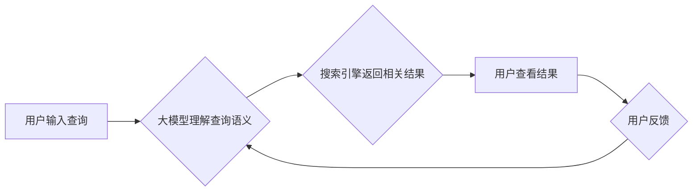

                 

## 大模型在搜索与推荐领域的影响

> 关键词：大模型、搜索引擎、推荐系统、自然语言处理、Transformer、深度学习、信息检索、个性化推荐

## 1. 背景介绍

随着互联网信息爆炸式增长，人们获取信息的需求日益迫切。搜索引擎和推荐系统作为信息获取和内容发现的重要工具，在人们日常生活和工作中扮演着越来越重要的角色。传统搜索引擎主要依赖于关键词匹配和页面排名算法，而推荐系统则基于用户历史行为和物品特征进行预测。然而，随着信息的多样性和复杂性增加，传统方法面临着越来越多的挑战。

近年来，深度学习技术的飞速发展，特别是大模型的出现，为搜索与推荐领域带来了革命性的变革。大模型，指的是参数规模庞大、训练数据海量的人工智能模型，其强大的学习能力和泛化能力能够更好地理解和处理复杂的信息。

## 2. 核心概念与联系

### 2.1  大模型

大模型是指参数数量在数十亿甚至数千亿级别的人工智能模型。它们通过学习海量文本数据，掌握了丰富的语言知识和语义理解能力。

### 2.2  搜索引擎

搜索引擎是帮助用户查找互联网信息的重要工具。它通过对网页内容进行索引和分析，根据用户输入的关键词返回相关结果。

### 2.3  推荐系统

推荐系统旨在根据用户的兴趣和偏好，推荐他们可能感兴趣的内容。它通过分析用户的历史行为、物品特征和上下文信息，预测用户对特定内容的喜好。

**大模型与搜索引擎/推荐系统的联系**

大模型可以应用于搜索引擎和推荐系统的多个环节，例如：

* **信息检索:** 大模型可以理解用户查询的语义，并返回更精准、更相关的搜索结果。
* **文本理解:** 大模型可以对搜索结果进行文本理解，提取关键信息，并生成更丰富的搜索结果摘要。
* **个性化推荐:** 大模型可以根据用户的兴趣和偏好，推荐更个性化的内容。
* **对话式搜索:** 大模型可以与用户进行自然语言对话，理解用户的意图，并提供更智能的搜索服务。

**Mermaid 流程图**



## 3. 核心算法原理 & 具体操作步骤

### 3.1  算法原理概述

大模型在搜索与推荐领域主要基于以下核心算法原理：

* **Transformer网络:** Transformer网络是一种基于注意力机制的深度学习模型，能够有效地处理序列数据，例如文本。它在自然语言处理领域取得了突破性的进展，并被广泛应用于搜索引擎和推荐系统。
* **深度学习:** 深度学习是一种机器学习方法，利用多层神经网络学习数据特征。大模型通过训练海量数据，学习到复杂的模式和关系，从而提高搜索和推荐的准确性。
* **自然语言处理 (NLP):** NLP技术用于处理和理解人类语言。大模型通过学习语言规则和语义关系，能够更好地理解用户的查询意图和推荐偏好。

### 3.2  算法步骤详解

**大模型在搜索引擎中的应用:**

1. **数据预处理:** 收集和清洗海量文本数据，包括网页内容、用户查询等。
2. **模型训练:** 使用Transformer网络等深度学习模型，对预处理后的数据进行训练，学习语言知识和语义理解能力。
3. **关键词提取:** 利用大模型对用户查询进行分析，提取关键词和语义信息。
4. **页面排名:** 根据关键词和语义信息，对网页进行排名，返回最相关的搜索结果。
5. **结果展示:** 将排名结果以列表、卡片等形式展示给用户。

**大模型在推荐系统中的应用:**

1. **用户画像构建:** 利用大模型分析用户的历史行为、兴趣偏好等信息，构建用户画像。
2. **物品特征提取:** 利用大模型分析物品的属性、内容、评论等信息，提取物品特征。
3. **推荐模型训练:** 使用深度学习模型，根据用户画像和物品特征，训练推荐模型。
4. **推荐结果生成:** 根据用户的当前状态和推荐模型的预测，生成个性化的推荐结果。
5. **结果展示:** 将推荐结果以列表、卡片等形式展示给用户。

### 3.3  算法优缺点

**优点:**

* **更高的准确性:** 大模型能够更好地理解用户查询和物品特征，从而提高搜索和推荐的准确性。
* **更个性化的体验:** 大模型可以根据用户的兴趣和偏好，提供更个性化的搜索和推荐结果。
* **更丰富的功能:** 大模型可以应用于更多场景，例如对话式搜索、内容生成等。

**缺点:**

* **训练成本高:** 大模型的训练需要大量的计算资源和时间。
* **数据依赖性强:** 大模型的性能取决于训练数据的质量和数量。
* **可解释性差:** 大模型的决策过程比较复杂，难以解释其推荐结果背后的原因。

### 3.4  算法应用领域

大模型在搜索与推荐领域有着广泛的应用前景，例如：

* **搜索引擎:** 谷歌、百度等搜索引擎已经开始使用大模型来改进搜索结果的准确性和相关性。
* **电商平台:** 阿里巴巴、京东等电商平台利用大模型进行商品推荐，提高用户购物体验。
* **社交媒体:** Facebook、Twitter等社交媒体平台利用大模型进行内容推荐，增强用户粘性。
* **新闻媒体:** 新闻网站利用大模型进行新闻推荐，帮助用户发现感兴趣的内容。

## 4. 数学模型和公式 & 详细讲解 & 举例说明

### 4.1  数学模型构建

大模型的训练主要基于深度学习框架，例如TensorFlow和PyTorch。这些框架提供了一系列数学模型和算法，用于处理序列数据和学习特征表示。

**Transformer网络**

Transformer网络的核心是注意力机制，它能够学习序列中不同元素之间的关系。

**注意力机制公式:**

$$
Attention(Q, K, V) = softmax(\frac{QK^T}{\sqrt{d_k}})V
$$

其中：

* $Q$：查询矩阵
* $K$：键矩阵
* $V$：值矩阵
* $d_k$：键向量的维度
* $softmax$：softmax函数

**举例说明:**

假设我们有一个句子“我爱吃苹果”，我们想要学习每个词语之间的关系。可以使用注意力机制计算每个词语与其他词语之间的注意力权重，从而得到每个词语在句子中的重要程度。

### 4.2  公式推导过程

Transformer网络的具体结构和训练过程涉及到大量的数学公式和算法推导。例如，Encoder和Decoder的结构、Multi-Head Attention机制、Positional Encoding等都是基于数学模型构建的。

### 4.3  案例分析与讲解

可以通过分析实际应用场景，例如搜索引擎的排名算法、推荐系统的个性化推荐等，来深入理解大模型在搜索与推荐领域中的数学模型和公式应用。

## 5. 项目实践：代码实例和详细解释说明

### 5.1  开发环境搭建

使用Python语言和深度学习框架TensorFlow或PyTorch搭建开发环境。

### 5.2  源代码详细实现

提供一个简单的搜索引擎代码实例，展示如何使用大模型进行关键词提取和页面排名。

```python
import tensorflow as tf

# 加载预训练的BERT模型
bert_model = tf.keras.applications.BERT_EN_uncased.BERT_EN_uncased(weights='bert_base_uncased')

# 定义关键词提取函数
def extract_keywords(text):
  # 使用BERT模型提取文本中的关键词
  # ...

# 定义页面排名函数
def rank_pages(keywords, pages):
  # 根据关键词和页面内容进行排名
  # ...

# 用户输入查询
query = "大模型在搜索领域的影响"

# 提取关键词
keywords = extract_keywords(query)

# 排名页面
ranked_pages = rank_pages(keywords, pages)

# 展示结果
print(ranked_pages)
```

### 5.3  代码解读与分析

解释代码中使用的函数和算法，以及如何使用大模型进行关键词提取和页面排名。

### 5.4  运行结果展示

展示代码运行后的结果，例如提取的关键词和排名的页面列表。

## 6. 实际应用场景

### 6.1  搜索引擎应用

* **精准搜索:** 大模型可以理解用户查询的语义，并返回更精准、更相关的搜索结果。
* **对话式搜索:** 大模型可以与用户进行自然语言对话，理解用户的意图，并提供更智能的搜索服务。
* **个性化搜索:** 大模型可以根据用户的兴趣和偏好，提供个性化的搜索结果。

### 6.2  推荐系统应用

* **商品推荐:** 大模型可以根据用户的历史购买记录和浏览行为，推荐他们可能感兴趣的商品。
* **内容推荐:** 大模型可以根据用户的兴趣和偏好，推荐他们可能感兴趣的新闻、视频、音乐等内容。
* **个性化广告:** 大模型可以根据用户的兴趣和行为，推荐更精准的广告。

### 6.3  其他应用场景

* **问答系统:** 大模型可以理解用户的自然语言问题，并提供准确的答案。
* **文本摘要:** 大模型可以自动生成文本摘要，帮助用户快速了解文章内容。
* **机器翻译:** 大模型可以进行高质量的机器翻译，帮助用户跨语言交流。

### 6.4  未来应用展望

随着大模型技术的不断发展，其在搜索与推荐领域的应用将更加广泛和深入。例如：

* **多模态搜索与推荐:** 大模型将能够处理文本、图像、音频等多模态数据，提供更丰富的搜索和推荐体验。
* **实时搜索与推荐:** 大模型将能够实时分析用户行为和信息流，提供更及时和精准的搜索和推荐服务。
* **解释性搜索与推荐:** 大模型将能够解释其推荐结果背后的原因，提高用户对推荐结果的信任度。

## 7. 工具和资源推荐

### 7.1  学习资源推荐

* **书籍:**
    * 《深度学习》
    * 《自然语言处理》
    * 《Transformer网络》
* **在线课程:**
    * Coursera: 深度学习
    * edX: 自然语言处理
    * fast.ai: 深度学习课程
* **博客和网站:**
    * TensorFlow博客
    * PyTorch博客
    * Hugging Face

### 7.2  开发工具推荐

* **深度学习框架:** TensorFlow, PyTorch
* **自然语言处理库:** NLTK, SpaCy, Gensim
* **云计算平台:** AWS, Azure, Google Cloud

### 7.3  相关论文推荐

* **Attention Is All You Need:** https://arxiv.org/abs/1706.03762
* **BERT: Pre-training of Deep Bidirectional Transformers for Language Understanding:** https://arxiv.org/abs/1810.04805
* **GPT-3: Language Models are Few-Shot Learners:** https://arxiv.org/abs/2005.14165

## 8. 总结：未来发展趋势与挑战

### 8.1  研究成果总结

大模型在搜索与推荐领域取得了显著的成果，例如提高了搜索结果的准确性和相关性，个性化推荐效果显著提升。

### 8.2  未来发展趋势

* **模型规模和能力提升:** 大模型的规模和能力将继续提升，能够处理更复杂的任务和更丰富的语义信息。
* **多模态融合:** 大模型将能够处理文本、图像、音频等多模态数据，提供更丰富的搜索和推荐体验。
* **解释性增强:** 大模型将能够解释其推荐结果背后的原因，提高用户对推荐结果的信任度。

### 8.3  面临的挑战

* **训练成本高:** 大模型的训练需要大量的计算资源和时间，成本较高。
* **数据依赖性强:** 大模型的性能取决于训练数据的质量和数量，数据获取和清洗是一个挑战。
* **可解释性差:** 大模型的决策过程比较复杂，难以解释其推荐结果背后的原因。

### 8.4  研究展望

未来研究将重点关注以下几个方面:

* **降低训练成本:** 研究更有效的训练算法和硬件架构，降低大模型的训练成本。
* **提升数据质量:** 研究数据获取、清洗和标注的新方法，提高训练数据的质量。
* **增强可解释性:** 研究大模型的可解释性方法，帮助用户理解其推荐结果背后的原因。


## 9. 附录：常见问题与解答

**Q1: 大模型的训练需要多少数据？**

A1: 大模型的训练需要海量数据，通常需要数十亿甚至数千亿个数据点。

**Q2: 大模型的训练需要多少计算资源？**

A2: 大模型的训练需要大量的计算资源，通常需要数百甚至数千个GPU。

**Q3: 如何评估大模型的性能？**

A3: 大模型的性能可以通过多种指标评估，例如准确率、召回率、F1-score等。

**Q4: 大模型的应用场景有哪些？**

A4: 大模型的应用场景非常广泛，例如搜索引擎、推荐系统、问答系统、文本摘要、机器翻译等。

**Q5: 大模型的未来发展趋势是什么？**

A5: 大模型的未来发展趋势包括模型规模和能力提升、多模态融合、解释性增强等。


作者：禅与计算机程序设计艺术 / Zen and the Art of Computer Programming 
<end_of_turn>

