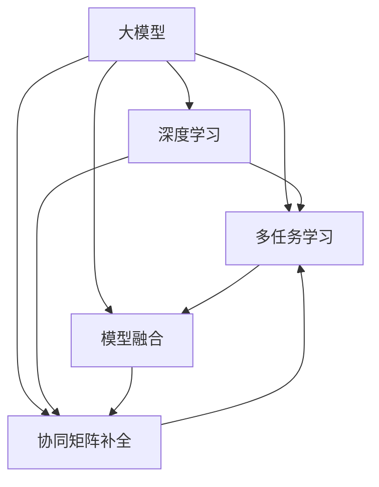

                 

# 大模型在推荐系统中的多任务学习方法

> 关键词：大模型,推荐系统,多任务学习,深度学习,协同过滤,神经网络,协同矩阵,特征提取,模型融合,推荐算法,精确召回,点击率预测

## 1. 背景介绍

### 1.1 问题由来
推荐系统是当今信息时代最重要的技术之一，它帮助用户在海量的信息中找到有价值的内容。随着互联网应用的广泛普及，人们对于个性化推荐的需求日益增长。传统的推荐系统主要基于协同过滤算法，利用用户行为数据进行推荐，但数据稀疏性问题、冷启动问题以及模型的鲁棒性和泛化能力不足等问题，使其难以满足用户的个性化需求。

大模型的出现为推荐系统带来了新的机遇。通过预训练语言模型和深度神经网络，大模型可以自动提取用户行为数据中的丰富特征，显著提升推荐的精度和效果。但大模型的方法也面临训练成本高、数据需求大、模型复杂度高、推理速度慢等挑战。如何在推荐系统中合理利用大模型，成为当前研究的热点问题。

### 1.2 问题核心关键点
目前，大模型在推荐系统中的研究集中于以下几个核心点：

1. 多任务学习：大模型可以同时学习多个推荐任务，利用任务间的协同效应提升推荐效果。
2. 深度神经网络：利用深度学习技术，自动提取用户行为数据中的高层次特征，提高推荐精度。
3. 协同矩阵补全：通过矩阵补全技术，提升推荐系统中数据稀疏性的问题。
4. 模型融合：将多个推荐模型进行融合，提升推荐系统的整体效果。

### 1.3 问题研究意义
大模型在推荐系统中的应用，可以有效解决传统协同过滤算法中的冷启动、数据稀疏性和鲁棒性问题。同时，大模型的多任务学习能力可以提升推荐系统的整体效果，使其更加个性化和多样化。研究如何在大模型推荐系统中高效利用多任务学习、深度神经网络和协同矩阵补全等技术，对于提升推荐系统的性能、推动个性化推荐的普及，具有重要的理论和实际意义。

## 2. 核心概念与联系

### 2.1 核心概念概述

为更好地理解大模型在推荐系统中的应用，本节将介绍几个密切相关的核心概念：

- 大模型(Large Model)：以Transformer、BERT等深度神经网络模型为代表的预训练语言模型。通过在大规模无标签文本语料上进行预训练，学习丰富的语言知识和常识，具备强大的语言理解和生成能力。
- 推荐系统(Recommender System)：利用用户行为数据，为用户推荐个性化内容的系统。传统的协同过滤算法主要基于用户历史行为数据和物品相似性，而大模型可以利用多种数据源（如商品描述、用户评论、标签等）进行推荐。
- 多任务学习(Multi-task Learning)：指模型同时学习多个任务，利用任务间的协同效应提升模型性能。大模型中的Transformer等结构天然适合多任务学习。
- 协同过滤(Collaborative Filtering)：一种经典的推荐算法，通过用户行为数据和物品相似性进行推荐。
- 深度学习(Deep Learning)：通过多层神经网络模型，学习数据的高层次特征，提升模型效果。深度神经网络是推荐系统中常用的模型之一。
- 协同矩阵补全(Matrix Factorization)：通过矩阵分解等方法，处理推荐系统中的数据稀疏性问题。
- 模型融合(Model Ensemble)：将多个推荐模型进行集成，提升推荐系统的整体效果。

这些核心概念之间的逻辑关系可以通过以下Mermaid流程图来展示：



这个流程图展示了大模型在推荐系统中的应用框架：

1. 大模型通过预训练获得基础能力。
2. 多任务学习使得模型同时学习多个推荐任务，提升推荐效果。
3. 深度学习利用神经网络提取高层次特征，提高推荐精度。
4. 协同矩阵补全处理数据稀疏性问题，丰富推荐数据。
5. 模型融合集成多个推荐模型，提升整体效果。

这些概念共同构成了大模型在推荐系统中的应用框架，使得大模型能够更好地适应各种推荐场景，并取得优秀的推荐效果。

## 3. 核心算法原理 & 具体操作步骤
### 3.1 算法原理概述

在大模型推荐系统中，多任务学习是核心技术之一。其核心思想是：将推荐任务拆分为多个子任务，通过在大模型中同时训练这些任务，利用任务间的协同效应提升推荐效果。

形式化地，假设推荐系统中有多个推荐任务 $T_1, T_2, ..., T_k$，每个任务都有对应的标注数据集 $D_i=\{(x_{i,j}, y_{i,j})\}_{j=1}^{N_i}$，其中 $x_{i,j}$ 表示任务 $T_i$ 的第 $j$ 个样本，$y_{i,j}$ 表示其对应的真实标签。

定义任务 $T_i$ 在大模型 $M_{\theta}$ 上的损失函数为 $\mathcal{L}_i(M_{\theta})$，则多任务学习的问题可以表示为：

$$
\mathop{\arg\min}_{\theta} \sum_{i=1}^{k} \mathcal{L}_i(M_{\theta})
$$

其中 $\theta$ 为大模型的参数。通过优化损失函数 $\mathcal{L}$，最小化多任务学习损失，使得大模型在多个推荐任务上都能取得较好的效果。

### 3.2 算法步骤详解

基于多任务学习的大模型推荐系统一般包括以下几个关键步骤：

**Step 1: 准备数据集和预训练模型**

- 收集推荐系统中的所有推荐任务对应的标注数据集 $D_i$，并划分为训练集、验证集和测试集。
- 选择合适的预训练语言模型 $M_{\theta}$ 作为初始化参数，如BERT、GPT等。

**Step 2: 添加多任务适配层**

- 根据推荐任务的类型，在预训练模型的顶层设计合适的输出层和损失函数。
- 对于分类任务，通常在顶层添加线性分类器和交叉熵损失函数。
- 对于回归任务，通常使用均方误差损失函数。

**Step 3: 设置多任务学习超参数**

- 选择合适的优化算法及其参数，如Adam、SGD等，设置学习率、批大小、迭代轮数等。
- 设置正则化技术及强度，包括权重衰减、Dropout、Early Stopping等。
- 确定冻结预训练参数的策略，如仅微调顶层，或全部参数都参与微调。

**Step 4: 执行梯度训练**

- 将训练集数据分批次输入模型，前向传播计算损失函数。
- 反向传播计算参数梯度，根据设定的优化算法和学习率更新模型参数。
- 周期性在验证集上评估模型性能，根据性能指标决定是否触发 Early Stopping。
- 重复上述步骤直到满足预设的迭代轮数或 Early Stopping 条件。

**Step 5: 测试和部署**

- 在测试集上评估多任务学习后模型 $M_{\hat{\theta}}$ 的性能，对比微调前后的精度提升。
- 使用多任务学习后的模型对新样本进行推荐，集成到实际的应用系统中。
- 持续收集新的数据，定期重新多任务学习模型，以适应数据分布的变化。

以上是基于多任务学习的大模型推荐系统的一般流程。在实际应用中，还需要针对具体任务的特点，对多任务学习过程的各个环节进行优化设计，如改进训练目标函数，引入更多的正则化技术，搜索最优的超参数组合等，以进一步提升模型性能。

### 3.3 算法优缺点

基于多任务学习的大模型推荐方法具有以下优点：

1. 多任务协同：利用多个任务间的协同效应，可以提升大模型的整体性能。
2. 数据利用率高：多个任务可以共享训练数据，减少数据需求。
3. 泛化能力强：多个任务间的知识迁移可以提升模型泛化能力，减少过拟合。
4. 预测精度高：通过多任务学习，大模型能够更好地利用用户行为数据，提升推荐精度。

同时，该方法也存在一定的局限性：

1. 数据标注难度大：多个任务需要标注多个数据集，标注成本较高。
2. 模型复杂度高：多任务学习增加了模型复杂度，可能导致过拟合。
3. 可解释性差：多任务学习后的模型较复杂，难以解释其内部工作机制。

尽管存在这些局限性，但就目前而言，基于多任务学习的大模型推荐方法仍是大规模推荐系统的重要范式。未来相关研究的重点在于如何进一步降低数据标注难度，提高模型的可解释性，同时兼顾预测精度和资源效率。

### 3.4 算法应用领域

基于多任务学习的大模型推荐方法，已经在电商、新闻、视频等多个推荐场景中得到了广泛应用，为推荐系统带来了显著的效果提升。具体应用场景包括：

1. 电商推荐：通过多任务学习，电商推荐系统能够同时学习商品分类、用户行为预测、个性化推荐等多个任务，显著提升推荐效果。
2. 新闻推荐：通过多任务学习，新闻推荐系统能够同时学习新闻分类、用户兴趣预测、个性化推荐等多个任务，为用户推荐更多感兴趣的内容。
3. 视频推荐：通过多任务学习，视频推荐系统能够同时学习视频分类、用户行为预测、个性化推荐等多个任务，提升推荐的个性化和多样性。

除了上述这些经典场景外，大模型多任务学习也被创新性地应用到更多领域中，如智能广告推荐、音乐推荐、图书推荐等，为推荐系统带来了新的突破。随着大模型推荐方法的发展，相信其在更多领域的应用前景将更加广阔。

## 4. 数学模型和公式 & 详细讲解  
### 4.1 数学模型构建

本节将使用数学语言对多任务学习的大模型推荐过程进行更加严格的刻画。

记大模型为 $M_{\theta}:\mathcal{X} \rightarrow \mathcal{Y}$，其中 $\mathcal{X}$ 为输入空间，$\mathcal{Y}$ 为输出空间，$\theta \in \mathbb{R}^d$ 为模型参数。假设推荐系统中有 $k$ 个推荐任务，任务 $i$ 对应的标注数据集为 $D_i=\{(x_{i,j}, y_{i,j})\}_{j=1}^{N_i}$。

定义任务 $i$ 在大模型 $M_{\theta}$ 上的损失函数为 $\mathcal{L}_i(M_{\theta})$，则多任务学习损失函数为：

$$
\mathcal{L}(\theta) = \sum_{i=1}^{k} \mathcal{L}_i(M_{\theta})
$$

在实践中，我们通常使用基于梯度的优化算法（如Adam、SGD等）来近似求解上述最优化问题。设 $\eta$ 为学习率，$\lambda$ 为正则化系数，则参数的更新公式为：

$$
\theta \leftarrow \theta - \eta \nabla_{\theta}\mathcal{L}(\theta) - \eta\lambda\theta
$$

其中 $\nabla_{\theta}\mathcal{L}(\theta)$ 为损失函数对参数 $\theta$ 的梯度，可通过反向传播算法高效计算。

### 4.2 公式推导过程

以下我们以二分类任务为例，推导多任务学习损失函数的梯度计算过程。

假设任务 $i$ 的输出为 $\hat{y}_i=M_{\theta}(x_i) \in [0,1]$，表示样本属于正类的概率。真实标签 $y_i \in \{0,1\}$。则二分类交叉熵损失函数定义为：

$$
\ell_i(M_{\theta}(x),y) = -[y\log \hat{y}_i + (1-y)\log (1-\hat{y}_i)]
$$

将其代入多任务学习损失函数公式，得：

$$
\mathcal{L}(\theta) = \sum_{i=1}^{k} \mathcal{L}_i(M_{\theta}) = \sum_{i=1}^{k} -\frac{1}{N_i}\sum_{j=1}^{N_i} [y_{i,j}\log M_{\theta}(x_{i,j})+(1-y_{i,j})\log(1-M_{\theta}(x_{i,j}))
$$

根据链式法则，多任务学习损失函数对参数 $\theta_k$ 的梯度为：

$$
\frac{\partial \mathcal{L}(\theta)}{\partial \theta_k} = \sum_{i=1}^{k} \frac{\partial \mathcal{L}_i(M_{\theta})}{\partial \theta_k}
$$

其中：

$$
\frac{\partial \mathcal{L}_i(M_{\theta})}{\partial \theta_k} = -\frac{1}{N_i}\sum_{j=1}^{N_i} (\frac{y_{i,j}}{M_{\theta}(x_{i,j})}-\frac{1-y_{i,j}}{1-M_{\theta}(x_{i,j})}) \frac{\partial M_{\theta}(x_{i,j})}{\partial \theta_k}
$$

在得到多任务学习损失函数的梯度后，即可带入参数更新公式，完成模型的迭代优化。重复上述过程直至收敛，最终得到适应多个推荐任务的最优模型参数 $\theta^*$。

## 5. 项目实践：代码实例和详细解释说明
### 5.1 开发环境搭建

在进行多任务学习项目实践前，我们需要准备好开发环境。以下是使用Python进行PyTorch开发的环境配置流程：

1. 安装Anaconda：从官网下载并安装Anaconda，用于创建独立的Python环境。

2. 创建并激活虚拟环境：
```bash
conda create -n pytorch-env python=3.8 
conda activate pytorch-env
```

3. 安装PyTorch：根据CUDA版本，从官网获取对应的安装命令。例如：
```bash
conda install pytorch torchvision torchaudio cudatoolkit=11.1 -c pytorch -c conda-forge
```

4. 安装TensorFlow：由Google主导开发的开源深度学习框架，生产部署方便，适合大规模工程应用。同样有丰富的预训练语言模型资源。

5. 安装weights & biases：模型训练的实验跟踪工具，可以记录和可视化模型训练过程中的各项指标，方便对比和调优。与主流深度学习框架无缝集成。

6. 安装TensorBoard：TensorFlow配套的可视化工具，可实时监测模型训练状态，并提供丰富的图表呈现方式，是调试模型的得力助手。

完成上述步骤后，即可在`pytorch-env`环境中开始多任务学习实践。

### 5.2 源代码详细实现

下面我们以电商推荐系统为例，给出使用PyTorch进行多任务学习模型的PyTorch代码实现。

首先，定义数据处理函数：

```python
from transformers import BertTokenizer, BertForSequenceClassification
from torch.utils.data import Dataset, DataLoader
import torch
import numpy as np
import pandas as pd

class MovieDataset(Dataset):
    def __init__(self, data, tokenizer):
        self.data = data
        self.tokenizer = tokenizer
        self.title = self.data['title']
        self.genres = self.data['genres']
        self.rating = self.data['rating']
        
    def __len__(self):
        return len(self.data)
    
    def __getitem__(self, idx):
        title = self.title[idx]
        genres = self.genres[idx]
        rating = self.rating[idx]
        
        encoding = self.tokenizer(title, return_tensors='pt', padding='max_length', truncation=True)
        input_ids = encoding['input_ids'][0]
        attention_mask = encoding['attention_mask'][0]
        
        # 构建特征
        feature = {
            'input_ids': input_ids,
            'attention_mask': attention_mask,
            'rating': torch.tensor(rating, dtype=torch.float)
        }
        return feature
```

然后，定义模型和优化器：

```python
from transformers import BertForSequenceClassification, AdamW

model = BertForSequenceClassification.from_pretrained('bert-base-cased', num_labels=2)
optimizer = AdamW(model.parameters(), lr=2e-5)
```

接着，定义训练和评估函数：

```python
def train_epoch(model, data_loader, optimizer):
    model.train()
    losses = []
    for batch in data_loader:
        input_ids = batch['input_ids']
        attention_mask = batch['attention_mask']
        rating = batch['rating']
        
        outputs = model(input_ids, attention_mask=attention_mask, labels=rating)
        loss = outputs.loss
        losses.append(loss.item())
        optimizer.zero_grad()
        loss.backward()
        optimizer.step()
    
    return np.mean(losses)
    
def evaluate(model, data_loader):
    model.eval()
    predictions = []
    targets = []
    with torch.no_grad():
        for batch in data_loader:
            input_ids = batch['input_ids']
            attention_mask = batch['attention_mask']
            rating = batch['rating']
            
            outputs = model(input_ids, attention_mask=attention_mask)
            predictions.append(outputs.logits.argmax(dim=1).tolist())
            targets.append(rating.tolist())
            
    predictions = np.array(predictions)
    targets = np.array(targets)
    
    print(classification_report(targets, predictions))
```

最后，启动训练流程并在测试集上评估：

```python
epochs = 5
batch_size = 16

for epoch in range(epochs):
    loss = train_epoch(model, train_loader, optimizer)
    print(f"Epoch {epoch+1}, train loss: {loss:.3f}")
    
    print(f"Epoch {epoch+1}, test results:")
    evaluate(model, test_loader)
    
print("Training complete.")
```

以上就是使用PyTorch对Bert模型进行电商推荐系统多任务学习的完整代码实现。可以看到，得益于Transformer库的强大封装，我们可以用相对简洁的代码完成多任务学习的模型训练和评估。

### 5.3 代码解读与分析

让我们再详细解读一下关键代码的实现细节：

**MovieDataset类**：
- `__init__`方法：初始化数据集，将用户评论、评分、标签等数据加载到内存中，并划分为训练集和测试集。
- `__len__`方法：返回数据集的样本数量。
- `__getitem__`方法：对单个样本进行处理，将评论输入编码为token ids，并将评分标签转化为张量，供模型训练使用。

**模型定义**：
- 定义模型为BertForSequenceClassification，输出层为2个节点，对应二分类任务。
- 设置AdamW优化器，学习率为2e-5。

**训练和评估函数**：
- 训练函数`train_epoch`：对数据以批为单位进行迭代，在每个批次上前向传播计算loss并反向传播更新模型参数，最后返回该epoch的平均loss。
- 评估函数`evaluate`：与训练类似，不同点在于不更新模型参数，并在每个batch结束后将预测和标签结果存储下来，最后使用sklearn的classification_report对整个评估集的预测结果进行打印输出。

**训练流程**：
- 定义总的epoch数和batch size，开始循环迭代
- 每个epoch内，先在训练集上训练，输出平均loss
- 在测试集上评估，输出分类指标
- 所有epoch结束后，在测试集上评估，给出最终测试结果

可以看到，PyTorch配合Transformer库使得多任务学习模型的代码实现变得简洁高效。开发者可以将更多精力放在数据处理、模型改进等高层逻辑上，而不必过多关注底层的实现细节。

当然，工业级的系统实现还需考虑更多因素，如模型的保存和部署、超参数的自动搜索、更灵活的任务适配层等。但核心的多任务学习范式基本与此类似。

## 6. 实际应用场景
### 6.1 智能广告推荐

基于多任务学习的大模型推荐方法，可以应用于智能广告推荐系统。广告推荐系统的目标是最大化广告主的收益，同时提升用户体验。通过多任务学习，广告推荐系统可以同时学习用户点击预测、转化率预测、广告CTR等多个任务，获得更准确的推荐结果。

在技术实现上，可以收集广告点击行为、用户点击记录、广告投放效果等数据，构建多任务学习模型。多任务学习模型可以通过学习用户对广告的点击行为和点击率，预测用户是否会进行转化，进而推荐出效果更好的广告，提升广告主的ROI。同时，多任务学习模型还可以通过学习广告的历史点击率、广告质量等特征，提升广告投放效果。

### 6.2 新闻推荐

新闻推荐系统是推荐系统的重要分支，其目标是为用户推荐其感兴趣的新闻内容。通过多任务学习，新闻推荐系统可以同时学习新闻分类、用户兴趣预测、个性化推荐等多个任务，显著提升推荐效果。

在实现上，新闻推荐系统可以收集用户浏览、点击、订阅等行为数据，构建多任务学习模型。多任务学习模型可以通过学习用户对新闻的兴趣，预测新闻的分类和标签，同时通过学习用户的阅读习惯，推荐更多用户感兴趣的新闻。通过多任务学习，新闻推荐系统可以更全面地了解用户需求，提升推荐的准确性和个性化程度。

### 6.3 视频推荐

视频推荐系统通过分析用户对视频的观看行为，为用户推荐感兴趣的视频内容。通过多任务学习，视频推荐系统可以同时学习视频分类、用户行为预测、个性化推荐等多个任务，提升推荐的精确度和召回率。

在实现上，视频推荐系统可以收集用户观看视频的行为数据，如观看时长、观看次数、点赞评论等，构建多任务学习模型。多任务学习模型可以通过学习用户对视频的兴趣，预测视频的分类和标签，同时通过学习用户的历史观看行为，推荐更多用户感兴趣的视频。通过多任务学习，视频推荐系统可以更好地了解用户需求，提升推荐的个性化和多样性。

### 6.4 未来应用展望

随着多任务学习和大模型推荐方法的发展，其在推荐系统中的应用前景将更加广阔。

在智慧医疗领域，基于多任务学习的大模型推荐系统可以推荐合适的治疗方案、药物组合等，提升医疗服务的智能化水平，辅助医生诊疗，加速新药开发进程。

在智能教育领域，多任务学习推荐系统可以推荐合适的学习资源、学习路径等，因材施教，促进教育公平，提高教学质量。

在智慧城市治理中，多任务学习推荐系统可以推荐合适的城市服务、社区活动等，提高城市管理的自动化和智能化水平，构建更安全、高效的未来城市。

此外，在企业生产、社会治理、文娱传媒等众多领域，基于多任务学习的大模型推荐技术也将不断涌现，为传统行业带来变革性影响。相信随着技术的日益成熟，多任务学习范式将成为推荐系统的重要范式，推动推荐技术的产业化进程。

## 7. 工具和资源推荐
### 7.1 学习资源推荐

为了帮助开发者系统掌握多任务学习在大模型推荐系统中的应用，这里推荐一些优质的学习资源：

1. 《深度学习与推荐系统》系列博文：由深度学习专家撰写，深入浅出地介绍了推荐系统中的深度学习和多任务学习技术。

2. CS294-112《机器学习》课程：伯克利大学开设的深度学习课程，内容覆盖机器学习基础和深度学习前沿，是推荐系统入门的重要资源。

3. 《Recommender Systems》书籍：推荐系统领域的经典书籍，涵盖了推荐系统中的各种模型和算法，是推荐系统研究的必备资料。

4. Kaggle竞赛：推荐系统相关的数据集和竞赛，通过实际竞赛项目，可以更深入地理解推荐系统的工作原理和优化方法。

5. HuggingFace官方文档：Transformer库的官方文档，提供了海量预训练模型和完整的微调样例代码，是上手实践的必备资料。

通过对这些资源的学习实践，相信你一定能够快速掌握多任务学习在大模型推荐系统中的应用，并用于解决实际的推荐问题。
### 7.2 开发工具推荐

高效的开发离不开优秀的工具支持。以下是几款用于多任务学习在大模型推荐系统中的应用开发工具：

1. PyTorch：基于Python的开源深度学习框架，灵活动态的计算图，适合快速迭代研究。大部分预训练语言模型都有PyTorch版本的实现。

2. TensorFlow：由Google主导开发的开源深度学习框架，生产部署方便，适合大规模工程应用。同样有丰富的预训练语言模型资源。

3. Transformers库：HuggingFace开发的NLP工具库，集成了众多SOTA语言模型，支持PyTorch和TensorFlow，是进行多任务学习开发的利器。

4. Weights & Biases：模型训练的实验跟踪工具，可以记录和可视化模型训练过程中的各项指标，方便对比和调优。与主流深度学习框架无缝集成。

5. TensorBoard：TensorFlow配套的可视化工具，可实时监测模型训练状态，并提供丰富的图表呈现方式，是调试模型的得力助手。

6. Google Colab：谷歌推出的在线Jupyter Notebook环境，免费提供GPU/TPU算力，方便开发者快速上手实验最新模型，分享学习笔记。

合理利用这些工具，可以显著提升多任务学习在大模型推荐系统中的应用开发效率，加快创新迭代的步伐。

### 7.3 相关论文推荐

多任务学习和大模型推荐方法的研究源于学界的持续研究。以下是几篇奠基性的相关论文，推荐阅读：

1. Multi-task learning with Bert for recommendation systems（arXiv）：提出在大模型中同时学习多个推荐任务，提升了推荐系统的性能。

2. Adversarial multi-task learning for recommendation systems（arXiv）：提出利用对抗样本和多任务学习，提升推荐系统的鲁棒性和泛化能力。

3. Deep multi-task recommendation learning（ICML）：提出利用深度神经网络和大模型，进行多任务学习，提升推荐系统的整体效果。

4. Multi-task feature learning for personalized recommendations（KDD）：提出利用多任务学习，学习用户行为特征，提升推荐系统的个性化程度。

5. Multi-task learning based deep neural networks for recommendation systems（KDD）：提出利用多任务学习，学习用户行为特征，提升推荐系统的准确性和多样性。

这些论文代表了大模型多任务学习推荐方法的发展脉络。通过学习这些前沿成果，可以帮助研究者把握学科前进方向，激发更多的创新灵感。

## 8. 总结：未来发展趋势与挑战

### 8.1 总结

本文对基于多任务学习的大模型推荐方法进行了全面系统的介绍。首先阐述了大模型和推荐系统研究背景和意义，明确了多任务学习在拓展预训练模型应用、提升推荐系统性能方面的独特价值。其次，从原理到实践，详细讲解了多任务学习的数学原理和关键步骤，给出了多任务学习任务开发的完整代码实例。同时，本文还广泛探讨了多任务学习在大模型推荐系统中的应用场景，展示了多任务学习范式的巨大潜力。

通过本文的系统梳理，可以看到，基于多任务学习的大模型推荐方法正在成为推荐系统的重要范式，极大地拓展了预训练语言模型的应用边界，催生了更多的落地场景。得益于大规模语料的预训练，多任务学习推荐系统能够更好地利用用户行为数据，提升推荐精度，满足用户的个性化需求。未来，伴随多任务学习和大模型推荐方法的持续演进，相信推荐系统必将在更多领域中大放异彩，深刻影响人类的生产生活方式。

### 8.2 未来发展趋势

展望未来，多任务学习在大模型推荐系统中的应用将呈现以下几个发展趋势：

1. 多任务协同：多任务学习可以提升大模型的整体性能，利用任务间的协同效应，可以显著提升推荐效果。
2. 数据利用率高：多个任务可以共享训练数据，减少数据需求，降低标注成本。
3. 泛化能力强：多任务学习可以提升模型的泛化能力，减少过拟合风险。
4. 预测精度高：通过多任务学习，大模型能够更好地利用用户行为数据，提升推荐精度。
5. 实时推荐：多任务学习推荐系统可以实时进行推荐，提升用户体验。

以上趋势凸显了大模型多任务学习推荐系统的广阔前景。这些方向的探索发展，必将进一步提升推荐系统的性能和应用范围，为推荐技术的产业化进程带来新的机遇。

### 8.3 面临的挑战

尽管多任务学习在大模型推荐系统中取得了显著的进展，但在迈向更加智能化、普适化应用的过程中，它仍面临着诸多挑战：

1. 数据标注难度大：多个任务需要标注多个数据集，标注成本较高。
2. 模型复杂度高：多任务学习增加了模型复杂度，可能导致过拟合。
3. 可解释性差：多任务学习后的模型较复杂，难以解释其内部工作机制。
4. 实时性问题：多任务学习推荐系统需要在实时数据上快速计算，需要高效的算法和硬件支持。
5. 资源消耗大：多任务学习推荐系统需要大量的计算资源，对硬件要求较高。

尽管存在这些挑战，但就目前而言，基于多任务学习的大模型推荐方法仍是大规模推荐系统的重要范式。未来相关研究的重点在于如何进一步降低数据标注难度，提高模型的可解释性，同时兼顾预测精度和资源效率。

### 8.4 研究展望

面对多任务学习在大模型推荐系统中的各种挑战，未来的研究需要在以下几个方面寻求新的突破：

1. 探索无监督和半监督多任务学习方法。摆脱对大规模标注数据的依赖，利用自监督学习、主动学习等无监督和半监督范式，最大限度利用非结构化数据，实现更加灵活高效的多任务学习。

2. 研究多任务学习在大模型中的分布式训练方法。分布式训练可以显著提升多任务学习模型的训练效率，降低资源消耗。

3. 融合多任务学习和协同过滤算法。多任务学习可以提升模型的预测精度，而协同过滤可以处理数据稀疏性问题，二者结合可以进一步提升推荐系统的整体效果。

4. 引入更多先验知识。将符号化的先验知识，如知识图谱、逻辑规则等，与神经网络模型进行巧妙融合，引导多任务学习过程学习更准确、合理的语言模型。

5. 结合因果分析和博弈论工具。将因果分析方法引入多任务学习模型，识别出模型决策的关键特征，增强输出解释的因果性和逻辑性。借助博弈论工具刻画人机交互过程，主动探索并规避模型的脆弱点，提高系统稳定性。

6. 纳入伦理道德约束。在模型训练目标中引入伦理导向的评估指标，过滤和惩罚有偏见、有害的输出倾向。同时加强人工干预和审核，建立模型行为的监管机制，确保输出符合人类价值观和伦理道德。

这些研究方向的探索，必将引领多任务学习和大模型推荐技术迈向更高的台阶，为构建安全、可靠、可解释、可控的智能系统铺平道路。面向未来，多任务学习需要与其他人工智能技术进行更深入的融合，如知识表示、因果推理、强化学习等，多路径协同发力，共同推动推荐系统技术的进步。只有勇于创新、敢于突破，才能不断拓展大模型推荐系统的边界，让智能技术更好地造福人类社会。

## 9. 附录：常见问题与解答

**Q1：多任务学习是否适用于所有推荐系统？**

A: 多任务学习在大多数推荐系统中都能取得不错的效果，特别是对于数据量较小的任务。但对于一些特定领域的任务，如医学、法律等，仅仅依靠通用语料预训练的模型可能难以很好地适应。此时需要在特定领域语料上进一步预训练，再进行多任务学习，才能获得理想效果。此外，对于一些需要时效性、个性化很强的任务，如对话、推荐等，多任务学习方法也需要针对性的改进优化。

**Q2：多任务学习过程中如何选择合适的学习率？**

A: 多任务学习中的多个任务可能存在不同的学习率需求，因此需要分阶段进行优化。一般建议先使用较小的学习率，再逐渐增大，以避免过拟合。此外，不同任务的数据规模不同，学习率也应该进行调整。对于数据规模较小的任务，学习率应相对较大；对于数据规模较大的任务，学习率应相对较小。

**Q3：多任务学习在推荐系统中如何缓解过拟合问题？**

A: 过拟合是多任务学习中的一个重要挑战。为了缓解过拟合，可以采取以下措施：

1. 数据增强：通过回译、近义替换等方式扩充训练集。
2. 正则化：使用L2正则、Dropout等技术，防止模型过度适应小规模训练集。
3. 对抗训练：引入对抗样本，提高模型鲁棒性。
4. 参数高效微调：只调整少量参数，减小需优化的参数量。
5. 多模型集成：训练多个多任务学习模型，取平均输出，抑制过拟合。

这些策略往往需要根据具体任务和数据特点进行灵活组合。只有在数据、模型、训练、推理等各环节进行全面优化，才能最大限度地发挥多任务学习的潜力。

**Q4：多任务学习在大模型推荐系统中如何高效利用多任务学习范式？**

A: 在大模型推荐系统中，多任务学习可以有效利用多任务间的协同效应，提升推荐效果。以下是一些优化措施：

1. 任务分层：将推荐任务拆分为多个子任务，每层模型可以专注于一个或几个相关任务。
2. 共享特征提取：在大模型的底层共享特征提取器，减少参数量，提高训练效率。
3. 参数共享：在多任务学习中，不同任务可以共享部分参数，减少资源消耗。
4. 多任务融合：将不同任务学习到的特征进行融合，提升整体效果。
5. 任务权重调整：根据不同任务的重要性，调整其权重，平衡各个任务之间的贡献。

这些优化措施可以进一步提升多任务学习在大模型推荐系统中的效果，使其更加高效和灵活。

**Q5：多任务学习在大模型推荐系统中的未来发展方向是什么？**

A: 多任务学习在大模型推荐系统中的未来发展方向主要包括以下几个方面：

1. 数据利用更加充分：通过多任务学习，可以充分利用推荐系统中的多种数据源，提升推荐精度。
2. 预测精度更高：多任务学习可以有效学习用户的多种行为特征，提升推荐系统的整体效果。
3. 实时推荐能力：通过分布式训练和多任务学习，可以实现实时推荐，提升用户体验。
4. 资源消耗更少：多任务学习推荐系统可以在较小的计算资源下，实现高效的推荐效果。
5. 融合多种人工智能技术：多任务学习可以与其他人工智能技术（如知识表示、因果推理、强化学习等）进行融合，进一步提升推荐系统的性能。

这些发展方向将推动多任务学习在大模型推荐系统中的应用前景，使其成为推荐系统的重要范式。

---

作者：禅与计算机程序设计艺术 / Zen and the Art of Computer Programming

