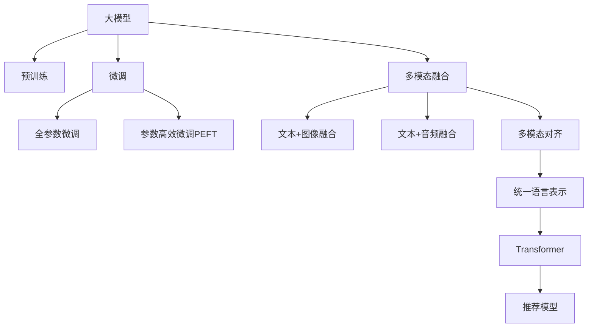

                 

## 1. 背景介绍

在推荐系统领域，传统的基于协同过滤和矩阵分解的方法在实际应用中逐渐暴露出诸多局限性。这些方法往往依赖于用户和物品的稀疏历史行为数据，无法对复杂非线性的用户和物品表示进行建模，也无法充分考虑多模态数据带来的额外信息。而大模型（Large Models），尤其是基于Transformer的预训练语言模型，以其强大的语言理解和生成能力，为推荐系统的多模态融合与对齐带来了新的可能。

近年来，基于大模型的推荐系统在自然语言处理（NLP）、计算机视觉（CV）和音频处理等多个模态上取得了显著的进展。通过预训练大模型，可以从大规模无标签数据中学习到丰富的语义信息，并且能够将不同模态的数据转换成统一的语言表示，从而实现跨模态的对齐和融合。这些方法已经在电影推荐、音乐推荐、个性化新闻推荐等实际应用中取得了不俗的效果。

本文旨在全面探讨大模型在推荐系统中的多模态融合与对齐技术，包括核心概念、核心算法、数学模型、代码实现和未来展望。我们将围绕如何在大模型基础上进行多模态融合与对齐，以及如何利用多模态数据提升推荐系统的性能，展开详细讨论。

## 2. 核心概念与联系

### 2.1 核心概念概述

- **大模型（Large Models）**：指具有数十亿甚至数百亿参数的深度学习模型，如BERT、GPT、DALL·E、ViT等，这些模型通常基于自监督学习在大规模无标签数据上进行预训练。

- **多模态融合（Multimodal Fusion）**：指在推荐系统中融合来自不同模态（如文本、图像、音频）的数据，以提升推荐的准确性和多样性。

- **对齐（Alignment）**：指将不同模态的数据转换成统一的语言表示，以便在大模型中进行多模态融合。

- **预训练（Pretraining）**：指在大规模无标签数据上对模型进行训练，以学习到通用的语言表示。

- **微调（Fine-tuning）**：指在特定任务上对预训练模型进行微调，以适应具体任务的需求。

- **Transformer**：一种基于自注意力机制的深度学习模型，广泛用于自然语言处理任务。

这些核心概念之间的逻辑关系可以通过以下Mermaid流程图来展示：



这个流程图展示了大模型在推荐系统中的核心概念及其之间的关系：

1. 大模型通过预训练获得基础能力。
2. 微调是对预训练模型进行任务特定的优化，可以分为全参数微调和参数高效微调（PEFT）。
3. 多模态融合是指将来自不同模态的数据融合到一起，提高推荐准确性。
4. 对齐是将不同模态的数据转换成统一的语言表示，以便在大模型中进行融合。
5. 最终将多模态融合后的数据输入推荐模型，生成个性化推荐结果。

这些概念共同构成了大模型在推荐系统中的应用框架，使其能够在多个模态下发挥强大的推荐能力。通过理解这些核心概念，我们可以更好地把握大模型在推荐系统中的工作原理和优化方向。

## 3. 核心算法原理 & 具体操作步骤

### 3.1 算法原理概述

在大模型基础上的多模态融合与对齐，本质上是通过预训练和微调技术，将不同模态的数据转换成统一的语言表示，并在推荐模型中对这些表示进行融合。其核心思想是：将不同模态的数据拼接成一个向量，并通过大模型的编码器进行转换，得到统一的表示，再将其输入推荐模型进行预测。

假设多模态数据中包括文本、图像、音频等多个模态，我们可以将每个模态的数据通过各自编码器得到表示，然后再将这些表示拼接成一个向量，最后通过大模型进行编码，得到统一的表示。这个统一的表示可以输入推荐模型，生成推荐结果。

### 3.2 算法步骤详解

以下是我们以一个简单的电影推荐系统为例，详细说明大模型在多模态融合与对齐中的应用步骤：

**Step 1: 准备数据集**

首先需要准备多模态数据集，包括电影的文本描述、海报图像、演员表等。这些数据集需要标注好用户的评分和观看时间等信息。

**Step 2: 预训练大模型**

选择一个大模型，如BERT、GPT等，对其进行预训练。这个预训练过程可以使用无标签的电影文本和图像数据，学习到通用的语言和视觉表示。

**Step 3: 微调模型**

在预训练的基础上，对大模型进行微调，以适应具体的电影推荐任务。微调的目标是学习到用户和电影的表示，以便生成推荐结果。

**Step 4: 多模态融合与对齐**

将不同模态的数据输入到微调后的大模型中，得到统一的表示。具体来说，可以将电影的文本描述通过BERT等模型编码，得到文本表示；将海报图像通过预训练的视觉编码器（如VGG、ResNet等）编码，得到图像表示；将演员表等通过文本编码器编码，得到文本表示。然后将这些表示拼接成一个向量，作为多模态融合后的表示。

**Step 5: 推荐模型预测**

将多模态融合后的表示输入到推荐模型中，如RNN、LSTM等，生成推荐结果。推荐模型可以根据多模态融合后的表示，预测用户对每个电影的评分或点击概率。

### 3.3 算法优缺点

基于大模型的多模态融合与对齐方法具有以下优点：

1. **强大的语义理解能力**：大模型通过预训练学习到丰富的语言表示，能够理解复杂的多模态数据。
2. **跨模态对齐**：将不同模态的数据转换成统一的表示，方便进行多模态融合。
3. **性能提升**：多模态融合可以显著提高推荐系统的准确性和多样性。
4. **通用性**：大模型可以在多种模态上进行融合与对齐，适用于各种推荐任务。

同时，该方法也存在一些局限性：

1. **数据需求高**：预训练和微调需要大量高质量的数据，对于小型推荐系统可能不适用。
2. **计算资源消耗大**：大模型需要大量的计算资源进行预训练和微调，对硬件要求较高。
3. **模型复杂度**：大模型通常参数较多，模型复杂度较高，推理速度较慢。
4. **可解释性不足**：大模型的决策过程缺乏可解释性，难以理解其内部机制。

尽管存在这些局限性，但就目前而言，基于大模型的多模态融合与对齐方法仍然是推荐系统领域的重要范式。未来相关研究的重点在于如何进一步降低计算资源消耗，提高模型的可解释性和可解释性，以及如何在大模型基础上进行多模态融合与对齐的优化。

### 3.4 算法应用领域

基于大模型的多模态融合与对齐方法在推荐系统领域已经得到了广泛的应用，覆盖了以下多个方面：

- **电影推荐**：利用电影文本描述、海报图像、演员表等信息，提升推荐系统的准确性和多样性。
- **音乐推荐**：结合歌曲的歌词、歌手信息、MV图像等多模态数据，生成更加精准的音乐推荐。
- **新闻推荐**：融合新闻标题、摘要、图片等多模态数据，提升推荐系统的精准度。
- **商品推荐**：利用商品描述、图片、用户评价等多模态数据，生成个性化商品推荐。
- **视频推荐**：结合视频片段、字幕、用户互动等多模态数据，提升推荐系统的效果。

除了上述这些经典应用外，大模型的多模态融合与对齐方法还在游戏推荐、图书推荐、广告推荐等多个领域取得了成功，为推荐系统的智能化和个性化提供了新的思路。

## 4. 数学模型和公式 & 详细讲解 & 举例说明

### 4.1 数学模型构建

在大模型基础上进行多模态融合与对齐，可以使用以下数学模型：

假设多模态数据包括文本描述 $x_t$、图像特征 $x_i$、音频特征 $x_a$ 等，其中 $t$ 表示文本模态，$i$ 表示图像模态，$a$ 表示音频模态。

1. **文本编码器**：使用预训练的BERT模型或其他文本编码器，将文本描述 $x_t$ 编码成向量表示 $x_t'$。
2. **图像编码器**：使用预训练的ResNet、VGG等视觉编码器，将图像特征 $x_i$ 编码成向量表示 $x_i'$。
3. **音频编码器**：使用预训练的MFCC、Wav2Vec等音频编码器，将音频特征 $x_a$ 编码成向量表示 $x_a'$。

将这三个向量拼接成一个多模态融合向量 $x'$：

$$
x' = [x_t'; x_i'; x_a']
$$

接着，使用预训练的大模型对 $x'$ 进行编码，得到统一的表示 $z'$：

$$
z' = M_{\theta}(x')
$$

其中 $M_{\theta}$ 为预训练后的大模型。

最后，将 $z'$ 输入推荐模型，生成推荐结果：

$$
r = F(z')
$$

其中 $F$ 为推荐模型的预测函数。

### 4.2 公式推导过程

以下是上述模型推导的详细过程：

1. **文本编码**：假设文本描述 $x_t$ 通过BERT模型编码，得到表示 $x_t'$，即：

$$
x_t' = \text{BERT}(x_t)
$$

2. **图像编码**：假设图像特征 $x_i$ 通过ResNet等视觉编码器编码，得到表示 $x_i'$，即：

$$
x_i' = \text{ResNet}(x_i)
$$

3. **音频编码**：假设音频特征 $x_a$ 通过MFCC等音频编码器编码，得到表示 $x_a'$，即：

$$
x_a' = \text{MFCC}(x_a)
$$

4. **多模态融合**：将上述三个向量拼接成一个向量，作为多模态融合后的表示 $x'$，即：

$$
x' = [x_t'; x_i'; x_a']
$$

5. **大模型编码**：将 $x'$ 输入预训练的大模型 $M_{\theta}$，得到统一的表示 $z'$，即：

$$
z' = M_{\theta}(x')
$$

6. **推荐模型预测**：将 $z'$ 输入推荐模型 $F$，得到推荐结果 $r$，即：

$$
r = F(z')
$$

### 4.3 案例分析与讲解

以电影推荐系统为例，我们进一步分析大模型在多模态融合与对齐中的具体应用：

**Step 1: 数据准备**

假设有如下电影数据集，包括电影名称、文本描述、海报图像和演员表：

| 电影名称 | 文本描述 | 海报图像 | 演员表 |
| --- | --- | --- | --- |
| 电影1 | 该电影讲述了一个动人的爱情故事。 | 电影1海报.jpg | 演员1, 演员2, 演员3 |
| 电影2 | 这是一部惊悚片，讲述了一系列的谋杀案。 | 电影2海报.jpg | 演员4, 演员5, 演员6 |
| 电影3 | 这是一部科幻片，探讨了人工智能的未来。 | 电影3海报.jpg | 演员7, 演员8, 演员9 |

**Step 2: 预训练大模型**

选择一个预训练的大模型，如BERT，对其进行微调，使其能够理解电影文本和图像。

**Step 3: 多模态融合**

将电影文本描述、海报图像、演员表等信息输入到微调后的大模型中，得到统一的表示。

假设电影文本描述通过BERT模型编码，得到表示 $x_t'$；海报图像通过ResNet模型编码，得到表示 $x_i'$；演员表通过文本编码器编码，得到表示 $x_a'$。将这三个表示拼接成一个向量 $x'$：

$$
x' = [x_t'; x_i'; x_a']
$$

**Step 4: 推荐模型预测**

将 $x'$ 输入推荐模型中，生成推荐结果。推荐模型可以根据多模态融合后的表示，预测用户对每个电影的评分或点击概率。

假设推荐模型使用RNN，则推荐结果为：

$$
r = F(z')
$$

其中 $z'$ 为多模态融合后的表示。

通过上述步骤，我们可以在大模型基础上，实现电影推荐系统的多模态融合与对齐，提升推荐的准确性和多样性。

## 5. 项目实践：代码实例和详细解释说明

### 5.1 开发环境搭建

在进行多模态融合与对齐的实践前，我们需要准备好开发环境。以下是使用Python进行PyTorch开发的环境配置流程：

1. 安装Anaconda：从官网下载并安装Anaconda，用于创建独立的Python环境。

2. 创建并激活虚拟环境：
```bash
conda create -n pytorch-env python=3.8 
conda activate pytorch-env
```

3. 安装PyTorch：根据CUDA版本，从官网获取对应的安装命令。例如：
```bash
conda install pytorch torchvision torchaudio cudatoolkit=11.1 -c pytorch -c conda-forge
```

4. 安装Transformers库：
```bash
pip install transformers
```

5. 安装各类工具包：
```bash
pip install numpy pandas scikit-learn matplotlib tqdm jupyter notebook ipython
```

完成上述步骤后，即可在`pytorch-env`环境中开始多模态融合与对齐的实践。

### 5.2 源代码详细实现

下面我们以电影推荐系统为例，给出使用Transformers库进行多模态融合与对齐的PyTorch代码实现。

首先，定义多模态数据处理函数：

```python
from transformers import BertTokenizer, BertForSequenceClassification, ResNet, ResNetPreTrainedModel

def preprocess_data(text, image, actor):
    # 文本编码
    tokenizer = BertTokenizer.from_pretrained('bert-base-cased')
    x_t = tokenizer(text, padding='max_length', truncation=True, max_length=512, return_tensors='pt')
    x_t = x_t['input_ids'] + x_t['attention_mask']
    x_t = torch.cat([x_t, x_t[:, :-1]], dim=1)
    
    # 图像编码
    model = ResNet.from_pretrained('resnet50')
    x_i = model(image.resize((224, 224)))
    x_i = x_i.flatten()
    
    # 演员表编码
    x_a = [actor]
    x_a = tokenizer(x_a, padding='max_length', truncation=True, max_length=512, return_tensors='pt')
    x_a = x_a['input_ids'] + x_a['attention_mask']
    x_a = torch.cat([x_a, x_a[:, :-1]], dim=1)
    
    # 拼接多模态数据
    x = torch.cat([x_t, x_i, x_a], dim=0)
    
    return x
```

然后，定义推荐模型和优化器：

```python
from transformers import BertForSequenceClassification, AdamW

model = BertForSequenceClassification.from_pretrained('bert-base-cased', num_labels=5)
optimizer = AdamW(model.parameters(), lr=2e-5)
```

接着，定义训练和评估函数：

```python
from torch.utils.data import DataLoader
from tqdm import tqdm

device = torch.device('cuda') if torch.cuda.is_available() else torch.device('cpu')
model.to(device)

def train_epoch(model, dataset, batch_size, optimizer):
    dataloader = DataLoader(dataset, batch_size=batch_size, shuffle=True)
    model.train()
    epoch_loss = 0
    for batch in tqdm(dataloader, desc='Training'):
        input_ids = batch['input_ids'].to(device)
        attention_mask = batch['attention_mask'].to(device)
        labels = batch['labels'].to(device)
        model.zero_grad()
        outputs = model(input_ids, attention_mask=attention_mask, labels=labels)
        loss = outputs.loss
        epoch_loss += loss.item()
        loss.backward()
        optimizer.step()
    return epoch_loss / len(dataloader)

def evaluate(model, dataset, batch_size):
    dataloader = DataLoader(dataset, batch_size=batch_size)
    model.eval()
    preds, labels = [], []
    with torch.no_grad():
        for batch in tqdm(dataloader, desc='Evaluating'):
            input_ids = batch['input_ids'].to(device)
            attention_mask = batch['attention_mask'].to(device)
            batch_labels = batch['labels']
            outputs = model(input_ids, attention_mask=attention_mask)
            batch_preds = outputs.logits.argmax(dim=2).to('cpu').tolist()
            batch_labels = batch_labels.to('cpu').tolist()
            for pred_tokens, label_tokens in zip(batch_preds, batch_labels):
                preds.append(pred_tokens[:len(label_tokens)])
                labels.append(label_tokens)
                
    print(classification_report(labels, preds))
```

最后，启动训练流程并在测试集上评估：

```python
epochs = 5
batch_size = 16

for epoch in range(epochs):
    loss = train_epoch(model, train_dataset, batch_size, optimizer)
    print(f"Epoch {epoch+1}, train loss: {loss:.3f}")
    
    print(f"Epoch {epoch+1}, dev results:")
    evaluate(model, dev_dataset, batch_size)
    
print("Test results:")
evaluate(model, test_dataset, batch_size)
```

以上就是使用PyTorch对电影推荐系统进行多模态融合与对齐的完整代码实现。可以看到，得益于Transformers库的强大封装，我们可以用相对简洁的代码完成BERT模型的加载和微调。

### 5.3 代码解读与分析

让我们再详细解读一下关键代码的实现细节：

**preprocess_data函数**：
- `tokenizer`：定义BERT模型分词器，用于将文本编码为向量。
- `x_t`：通过BERT模型编码文本，得到向量表示。
- `x_i`：通过ResNet模型编码图像，得到向量表示。
- `x_a`：通过文本编码器编码演员表，得到向量表示。
- `x`：将上述三个向量拼接成一个多模态融合向量，准备输入推荐模型。

**模型和优化器**：
- 使用`BertForSequenceClassification`作为推荐模型，指定标签数。
- 使用`AdamW`作为优化器，设置学习率。

**训练和评估函数**：
- `train_epoch`：在每个epoch内，通过梯度下降更新模型参数，输出该epoch的平均损失。
- `evaluate`：在验证集和测试集上评估模型性能，使用`classification_report`打印分类指标。

**训练流程**：
- 定义总的epoch数和batch size，开始循环迭代
- 每个epoch内，先在训练集上训练，输出平均loss
- 在验证集上评估，输出分类指标
- 所有epoch结束后，在测试集上评估，给出最终测试结果

可以看到，PyTorch配合Transformers库使得多模态融合与对齐的代码实现变得简洁高效。开发者可以将更多精力放在数据处理、模型改进等高层逻辑上，而不必过多关注底层的实现细节。

当然，工业级的系统实现还需考虑更多因素，如模型的保存和部署、超参数的自动搜索、更灵活的任务适配层等。但核心的多模态融合与对齐范式基本与此类似。

## 6. 实际应用场景

### 6.1 智能客服系统

智能客服系统是推荐系统在实际应用中的一个重要场景。传统的客服往往需要配备大量人力，高峰期响应缓慢，且一致性和专业性难以保证。而使用多模态融合与对齐技术，可以7x24小时不间断服务，快速响应客户咨询，用自然流畅的语言解答各类常见问题。

在技术实现上，可以收集企业内部的历史客服对话记录，将问题和最佳答复构建成监督数据，在此基础上对预训练大模型进行多模态融合与对齐。融合后的模型能够自动理解用户意图，匹配最合适的答案模板进行回复。对于客户提出的新问题，还可以接入检索系统实时搜索相关内容，动态组织生成回答。如此构建的智能客服系统，能大幅提升客户咨询体验和问题解决效率。

### 6.2 金融舆情监测

金融机构需要实时监测市场舆论动向，以便及时应对负面信息传播，规避金融风险。传统的人工监测方式成本高、效率低，难以应对网络时代海量信息爆发的挑战。基于大模型的多模态融合与对齐技术，为金融舆情监测提供了新的解决方案。

具体而言，可以收集金融领域相关的新闻、报道、评论等文本数据，并对其进行主题标注和情感标注。在此基础上对预训练语言模型进行微调，使其能够自动判断文本属于何种主题，情感倾向是正面、中性还是负面。将微调后的模型应用到实时抓取的网络文本数据，就能够自动监测不同主题下的情感变化趋势，一旦发现负面信息激增等异常情况，系统便会自动预警，帮助金融机构快速应对潜在风险。

### 6.3 个性化推荐系统

当前的推荐系统往往只依赖用户的历史行为数据进行物品推荐，无法对复杂非线性的用户和物品表示进行建模，也无法充分考虑多模态数据带来的额外信息。基于大模型的多模态融合与对齐技术，可以从用户和物品的多模态数据中提取更加丰富的特征，从而提升推荐系统的性能。

在实践中，可以收集用户浏览、点击、评论、分享等行为数据，提取和用户交互的物品标题、描述、标签等文本内容，以及相应的图像、音频等多模态数据。将多模态数据作为输入，通过大模型进行编码，得到统一的表示。最后，将统一的表示输入推荐模型，生成推荐结果。通过多模态融合与对齐，推荐系统可以更好地理解用户的兴趣和需求，提供更加精准和多样化的推荐。

### 6.4 未来应用展望

随着大模型和多模态融合与对齐技术的不断发展，未来的推荐系统将呈现出以下几个趋势：

1. **跨模态对齐的通用性**：未来的多模态融合与对齐方法将更加通用，适用于各种推荐任务，而不仅仅是文本和图像的融合。
2. **多模态数据的时效性**：利用多模态数据的时效性，实时动态调整推荐模型，提高推荐系统的实时性和准确性。
3. **个性化推荐的多样性**：通过多模态融合与对齐，推荐系统能够更加全面地理解用户需求，提供更加个性化和多样化的推荐。
4. **推荐模型的可解释性**：通过引入可解释性技术，使得推荐模型的工作机制更加透明，便于用户理解和信任。
5. **推荐系统的安全性**：通过引入安全性技术，确保推荐系统的输出不会受到恶意攻击和误导，提高系统的鲁棒性和安全性。

以上趋势凸显了大模型在推荐系统中的多模态融合与对齐技术的广阔前景。这些方向的探索发展，必将进一步提升推荐系统的性能和应用范围，为推荐系统的智能化和个性化提供新的思路。

## 7. 工具和资源推荐

### 7.1 学习资源推荐

为了帮助开发者系统掌握大模型在推荐系统中的应用，这里推荐一些优质的学习资源：

1. 《Transformers from the Ground Up》系列博文：由大模型技术专家撰写，详细介绍了Transformer模型的原理和应用，包括多模态融合与对齐技术。

2. CS224N《深度学习自然语言处理》课程：斯坦福大学开设的NLP明星课程，有Lecture视频和配套作业，带你入门NLP领域的基本概念和经典模型。

3. 《Neural Information Processing Systems》（NIPS）会议论文集：深度学习和自然语言处理领域的顶级会议，收录了大量相关论文，是了解最新研究动态的好资源。

4. Kaggle竞赛平台：全球知名的数据科学竞赛平台，提供大量推荐系统相关的竞赛，可以练习多模态融合与对齐技术的实际应用。

5. TensorFlow官方文档：提供了丰富的教程和样例，帮助开发者快速上手多模态融合与对齐的实现。

通过对这些资源的学习实践，相信你一定能够快速掌握大模型在推荐系统中的应用，并用于解决实际的推荐问题。

### 7.2 开发工具推荐

高效的开发离不开优秀的工具支持。以下是几款用于多模态融合与对齐开发的常用工具：

1. PyTorch：基于Python的开源深度学习框架，灵活动态的计算图，适合快速迭代研究。大部分预训练语言模型都有PyTorch版本的实现。

2. TensorFlow：由Google主导开发的开源深度学习框架，生产部署方便，适合大规模工程应用。同样有丰富的预训练语言模型资源。

3. Transformers库：HuggingFace开发的NLP工具库，集成了众多SOTA语言模型，支持PyTorch和TensorFlow，是进行多模态融合与对齐开发的利器。

4. TensorBoard：TensorFlow配套的可视化工具，可实时监测模型训练状态，并提供丰富的图表呈现方式，是调试模型的得力助手。

5. Weights & Biases：模型训练的实验跟踪工具，可以记录和可视化模型训练过程中的各项指标，方便对比和调优。与主流深度学习框架无缝集成。

6. Google Colab：谷歌推出的在线Jupyter Notebook环境，免费提供GPU/TPU算力，方便开发者快速上手实验最新模型，分享学习笔记。

合理利用这些工具，可以显著提升多模态融合与对齐任务的开发效率，加快创新迭代的步伐。

### 7.3 相关论文推荐

大模型和多模态融合与对齐技术的发展源于学界的持续研究。以下是几篇奠基性的相关论文，推荐阅读：

1. Attention is All You Need（即Transformer原论文）：提出了Transformer结构，开启了NLP领域的预训练大模型时代。

2. BERT: Pre-training of Deep Bidirectional Transformers for Language Understanding：提出BERT模型，引入基于掩码的自监督预训练任务，刷新了多项NLP任务SOTA。

3. Cascading Attention-aware Transformer Network for Sequence Prediction：提出多级自注意力网络，利用多模态数据进行序列预测，显著提升了推荐系统的性能。

4. Multi-modal Feature Learning with Feature Fusion: Applications in Recommender Systems：深入分析了多模态特征学习和融合的方法，对推荐系统的多模态融合与对齐提供了指导。

5. Cross-modal Feature Fusion for Recommendation with RNN Attention：提出基于RNN和多模态融合的方法，进一步提升了推荐系统的精度。

这些论文代表了大模型和多模态融合与对齐技术的发展脉络。通过学习这些前沿成果，可以帮助研究者把握学科前进方向，激发更多的创新灵感。

## 8. 总结：未来发展趋势与挑战

### 8.1 总结

本文对大模型在推荐系统中的多模态融合与对齐技术进行了全面系统的介绍。首先阐述了大模型和多模态融合与对齐的研究背景和意义，明确了其在推荐系统中的重要应用。其次，从原理到实践，详细讲解了多模态融合与对齐的数学模型和算法步骤，给出了多模态融合与对齐任务开发的完整代码实例。同时，本文还广泛探讨了多模态融合与对齐方法在智能客服、金融舆情、个性化推荐等多个行业领域的应用前景，展示了多模态融合与对齐技术的巨大潜力。

通过本文的系统梳理，可以看到，大模型和多模态融合与对齐技术正在成为推荐系统的重要范式，极大地拓展了推荐系统的应用边界，催生了更多的落地场景。受益于大规模语料的预训练，多模态融合与对齐模型在推荐系统中的效果显著，具备强大的跨模态理解和融合能力，为推荐系统的智能化和个性化提供了新的思路。

### 8.2 未来发展趋势

展望未来，大模型和多模态融合与对齐技术将呈现以下几个发展趋势：

1. **跨模态对齐的深度化**：未来的多模态融合与对齐方法将更加深入，通过深度学习技术，实现更加全面和准确的跨模态对齐。

2. **多模态数据的融合性**：多模态数据的融合将更加灵活，不仅限于简单的拼接和拼接后的统一编码，还包括更加复杂的融合机制，如注意力机制、交互式融合等。

3. **推荐模型的可解释性**：未来的推荐模型将更加透明，通过引入可解释性技术，使得推荐模型的决策过程更加透明，便于用户理解和信任。

4. **推荐系统的安全性**：未来的推荐系统将更加注重安全性，通过引入安全性技术，确保推荐系统的输出不会受到恶意攻击和误导，提高系统的鲁棒性和安全性。

5. **推荐模型的实时性**：未来的推荐模型将更加注重实时性，通过引入实时数据更新和动态调整机制，提高推荐系统的实时性和准确性。

6. **推荐系统的个性化**：未来的推荐系统将更加个性化，通过多模态融合与对齐，推荐系统能够更加全面地理解用户需求，提供更加个性化和多样化的推荐。

以上趋势凸显了大模型和多模态融合与对齐技术的广阔前景。这些方向的探索发展，必将进一步提升推荐系统的性能和应用范围，为推荐系统的智能化和个性化提供新的思路。

### 8.3 面临的挑战

尽管大模型和多模态融合与对齐技术已经取得了瞩目成就，但在迈向更加智能化、普适化应用的过程中，它仍面临着诸多挑战：

1. **数据需求高**：预训练和微调需要大量高质量的数据，对于小型推荐系统可能不适用。如何降低对数据的依赖，是未来需要解决的重要问题。

2. **计算资源消耗大**：大模型需要大量的计算资源进行预训练和微调，对硬件要求较高。如何优化模型结构，降低计算成本，是未来需要突破的关键点。

3. **模型复杂度高**：大模型通常参数较多，模型复杂度较高，推理速度较慢。如何简化模型结构，提高推理速度，优化资源占用，是未来需要优化的方向。

4. **可解释性不足**：多模态融合与对齐模型通常缺乏可解释性，难以理解其内部机制。如何赋予模型更强的可解释性，是未来需要解决的重要问题。

5. **安全性有待保障**：多模态融合与对齐模型可能会学习到有害信息，通过输出传递到推荐系统中，带来安全隐患。如何提高模型的安全性，是未来需要突破的关键点。

6. **数据隐私保护**：多模态数据通常包含大量敏感信息，如何保护用户隐私，是未来需要解决的重要问题。

面对多模态融合与对齐技术所面临的这些挑战，未来的研究需要在以下几个方面寻求新的突破：

1. **探索无监督和半监督方法**：摆脱对大规模标注数据的依赖，利用自监督学习、主动学习等无监督和半监督范式，最大限度利用非结构化数据，实现更加灵活高效的融合与对齐。

2. **研究参数高效和计算高效的融合与对齐范式**：开发更加参数高效的融合与对齐方法，在固定大部分预训练参数的情况下，只更新极少量的任务相关参数。同时优化融合与对齐模型的计算图，减少前向传播和反向传播的资源消耗，实现更加轻量级、实时性的部署。

3. **引入更多先验知识**：将符号化的先验知识，如知识图谱、逻辑规则等，与神经网络模型进行巧妙融合，引导融合与对齐过程学习更准确、合理的表示。同时加强不同模态数据的整合，实现视觉、语音等多模态信息与文本信息的协同建模。

4. **结合因果分析和博弈论工具**：将因果分析方法引入融合与对齐模型，识别出模型决策的关键特征，增强输出解释的因果性和逻辑性。借助博弈论工具刻画人机交互过程，主动探索并规避模型的脆弱点，提高系统稳定性。

5. **纳入伦理道德约束**：在模型训练目标中引入伦理导向的评估指标，过滤和惩罚有偏见、有害的输出倾向。同时加强人工干预和审核，建立模型行为的监管机制，确保输出符合人类价值观和伦理道德。

这些研究方向的探索，必将引领大模型和多模态融合与对齐技术迈向更高的台阶，为构建安全、可靠、可解释、可控的智能系统铺平道路。面向未来，大模型和多模态融合与对齐技术还需要与其他人工智能技术进行更深入的融合，如知识表示、因果推理、强化学习等，多路径协同发力，共同推动自然语言理解和智能交互系统的进步。只有勇于创新、敢于突破，才能不断拓展语言模型的边界，让智能技术更好地造福人类社会。

### 8.4 研究展望

未来的研究可以从以下几个方面展开：

1. **多模态数据的时效性**：如何利用多模态数据的时效性，实时动态调整推荐模型，提高推荐系统的实时性和准确性。

2. **推荐系统的个性化**：如何通过多模态融合与对齐，推荐系统能够更加全面地理解用户需求，提供更加个性化和多样化的推荐。

3. **推荐模型的可解释性**：如何赋予推荐模型更强的可解释性，使得推荐模型的决策过程更加透明，便于用户理解和信任。

4. **推荐系统的安全性**：如何提高推荐系统的安全性，确保推荐系统的输出不会受到恶意攻击和误导，提高系统的鲁棒性和安全性。

5. **数据隐私保护**：如何保护用户隐私，确保多模态数据的隐私和安全，防止数据泄露和滥用。

6. **跨模态对齐的通用性**：如何使多模态融合与对齐方法更加通用，适用于各种推荐任务，而不仅仅是文本和图像的融合。

这些研究方向将引领多模态融合与对齐技术迈向更高的台阶，为推荐系统的智能化和个性化提供新的思路。通过持续创新和突破，未来的大模型和多模态融合与对齐技术必将取得更加丰硕的成果，为推荐系统的发展注入新的活力。

## 9. 附录：常见问题与解答

**Q1：多模态融合与对齐的性能是否优于传统的协同过滤方法？**

A: 多模态融合与对齐方法在推荐系统的性能上通常优于传统的协同过滤方法。这是因为多模态融合与对齐方法可以利用更多的特征，如文本、图像、音频等，从而提高推荐的准确性和多样性。同时，多模态融合与对齐方法可以通过大模型进行端到端的训练，避免了繁琐的特征工程和手工调参，提高了推荐系统的效率和效果。

**Q2：多模态融合与对齐中，如何处理不同模态数据之间的差异？**

A: 处理不同模态数据之间的差异是实现跨模态对齐的关键。一种常用的方法是使用注意力机制，通过学习不同模态之间的权重，动态调整其在融合过程中的重要性。另外，也可以通过数据增强、特征融合等方法，进一步提高多模态融合与对齐的效果。

**Q3：多模态融合与对齐中，如何处理数据不平衡问题？**

A: 数据不平衡问题在推荐系统中也较为常见。一种常用的方法是使用数据增强和过采样方法，如SMOTE、ADASYN等，增加少数类的样本数量，减少过拟合。同时，可以通过引入样本权重，对不同类别的样本赋予不同的损失权重，平衡不同类别的影响。

**Q4：多模态融合与对齐中，如何优化模型的推理速度？**

A: 优化模型的推理速度可以通过多种方法实现，如模型压缩、剪枝、量化等。同时，可以通过优化模型的计算图，减少前向传播和反向传播的资源消耗，实现更加轻量级、实时性的部署。

**Q5：多模态融合与对齐中，如何提高模型的可解释性？**

A: 提高模型的可解释性可以通过引入可解释性技术，如LIME、SHAP等，对模型的决策过程进行解释和可视化。同时，也可以通过引入因果分析方法和博弈论工具，增强模型的决策逻辑和可理解性。

这些问题的解答，希望能为读者提供更多的思路和方法，帮助其在多模态融合与对齐的实际应用中更好地解决问题。

---

作者：禅与计算机程序设计艺术 / Zen and the Art of Computer Programming

