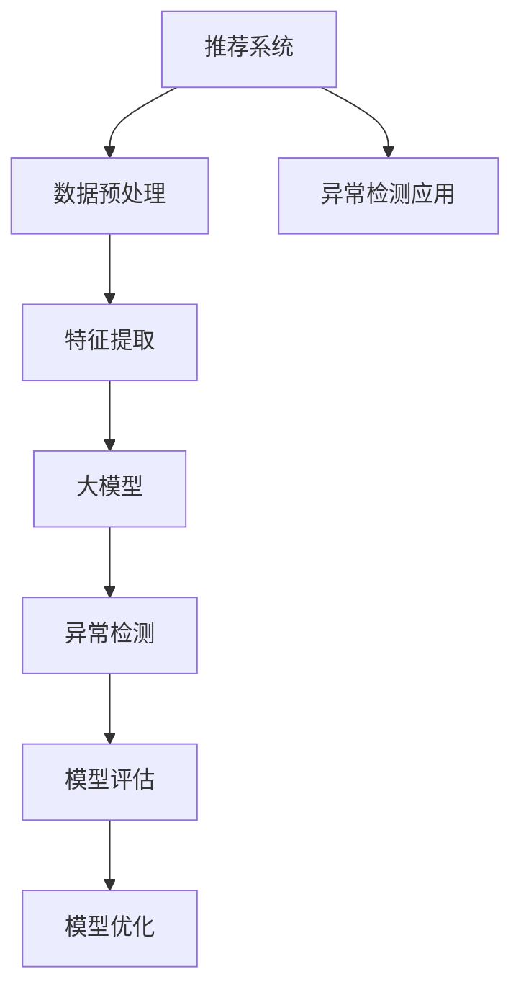

                 

# 大模型在推荐系统中的异常检测应用

> 关键词：推荐系统, 异常检测, 大模型, 深度学习, 自然语言处理(NLP), 数据挖掘, 特征工程, 数据可视化, 模型评估

## 1. 背景介绍

### 1.1 问题由来

推荐系统在电商平台、内容平台等应用场景中扮演着越来越重要的角色。用户需求的多样性和动态性，使得推荐系统需要不断调整优化，以更好地满足用户需求。传统的基于规则和统计学的推荐方法，难以应对复杂多变的用户行为和数据分布。

随着深度学习和大模型的兴起，基于协同过滤、神经网络等模型，推荐系统实现了质的飞跃。然而，在推荐过程中，往往忽略了异常行为和潜在风险，未能及时发现并应对虚假交易、恶意刷单、违规内容等异常情况。异常检测的缺失，导致推荐系统的质量和用户体验大打折扣。

大语言模型在自然语言处理领域取得了突破性进展，可以自动分析和生成文本数据。本文探索将大语言模型引入推荐系统，通过异常检测提升推荐系统的鲁棒性和安全性。

### 1.2 问题核心关键点

大模型在推荐系统中的异常检测，涉及以下几个核心关键点：

1. **数据预处理**：如何将推荐系统产生的海量数据进行清洗和预处理，以便于大模型进行异常检测。
2. **特征提取**：如何从原始数据中提取出有意义的特征，作为大模型的输入。
3. **模型选择与训练**：选择适合的大模型进行训练，并对训练过程进行调优，以提高检测效果。
4. **评估与优化**：通过模型评估指标和可视化方法，评估异常检测效果，并进行优化。
5. **应用与部署**：将异常检测模型应用到推荐系统中，实现对异常行为的有效识别和应对。

## 2. 核心概念与联系

### 2.1 核心概念概述

为更好地理解大模型在推荐系统中异常检测的应用，本节将介绍几个密切相关的核心概念：

- **推荐系统**：通过分析用户历史行为数据和物品属性，推荐给用户最符合其兴趣的商品或内容。常见的推荐算法包括协同过滤、基于内容的推荐、基于矩阵分解的推荐等。

- **异常检测**：在数据集中发现不符合正常模式的数据点，通常用于识别欺诈、恶意行为、数据错误等异常情况。异常检测方法包括基于统计学的方法、基于机器学习的方法和基于深度学习的方法。

- **大语言模型**：以自回归或自编码模型为代表的大规模预训练语言模型。通过在大规模无标签文本语料上进行预训练，学习通用的语言表示，具备强大的语言理解和生成能力。

- **特征工程**：从原始数据中提取和构造有意义的特征，供模型训练和分析使用。特征工程是机器学习和深度学习中不可或缺的一环。

- **模型评估**：通过设定评价指标和评估方法，对模型的预测性能进行衡量和分析。常见评估指标包括准确率、召回率、F1分数、AUC等。

- **模型优化**：在模型训练和部署过程中，通过调整超参数、增加训练数据、改进算法等手段，提升模型效果和泛化能力。

这些核心概念之间的逻辑关系可以通过以下Mermaid流程图来展示：



这个流程图展示了大语言模型在推荐系统中的异常检测核心概念及其之间的关系：

1. 推荐系统生成数据集。
2. 数据预处理和特征提取后，输入大模型进行异常检测。
3. 异常检测结果反馈到推荐系统中，优化推荐算法。
4. 模型评估指导模型优化，提高异常检测准确度。

## 3. 核心算法原理 & 具体操作步骤
### 3.1 算法原理概述

大语言模型在推荐系统中的异常检测，通过学习数据中的正常模式和异常模式，识别不符合正常模式的数据点。其核心思想是：

1. **正常模式建模**：使用大语言模型学习推荐数据中的正常模式。
2. **异常点识别**：基于正常模式，识别和评估数据集中的异常点。
3. **异常反馈**：将异常检测结果反馈到推荐系统中，优化推荐策略。

### 3.2 算法步骤详解

大语言模型在推荐系统中的异常检测主要包括以下几个关键步骤：

**Step 1: 数据预处理**

推荐系统生成的原始数据，可能包含大量噪声和异常值。需要进行数据清洗和预处理，以提高异常检测的效果。

1. **去重**：删除重复的数据记录。
2. **缺失值处理**：补充缺失值，确保数据完整性。
3. **异常值检测**：使用统计学方法或聚类算法检测和处理异常值。
4. **数据归一化**：将数据进行标准化或归一化处理，确保数据分布一致。

**Step 2: 特征提取**

从预处理后的数据中提取有意义的特征，供大语言模型进行训练。

1. **特征选择**：通过相关性分析、特征重要性评估等方法，选择对异常检测有用的特征。
2. **特征编码**：将选择的特征进行编码，转换为模型可接受的数据格式。
3. **特征归一化**：对特征进行归一化处理，确保特征值在相似量级。

**Step 3: 模型选择与训练**

选择合适的预训练大语言模型，并进行微调训练。

1. **模型选择**：根据数据特点和任务需求，选择合适的预训练模型，如BERT、GPT等。
2. **微调训练**：在微调过程中，加入异常检测任务，使用标注数据进行训练。
3. **参数调优**：通过调整学习率、批量大小、迭代轮数等超参数，优化模型效果。

**Step 4: 异常检测与反馈**

利用训练好的模型进行异常检测，并将检测结果反馈到推荐系统中。

1. **异常检测**：输入异常检测模型，获取异常检测结果。
2. **异常反馈**：根据异常检测结果，对推荐系统进行调整优化。
3. **异常预警**：当检测到异常时，及时发出预警信号，防止系统受影响。

**Step 5: 模型评估与优化**

对异常检测模型的效果进行评估和优化。

1. **评估指标**：使用准确率、召回率、F1分数、AUC等指标评估模型效果。
2. **可视化分析**：使用数据可视化工具分析异常检测结果，进行可视化展示。
3. **模型优化**：根据评估结果和可视化分析，对模型进行优化和调参，提升检测效果。

### 3.3 算法优缺点

大语言模型在推荐系统中的异常检测方法具有以下优点：

1. **自适应性强**：大模型能够自动学习数据的正常模式和异常模式，适应不同类型和规模的数据集。
2. **泛化能力强**：模型在大规模无标签数据上预训练后，可以泛化到推荐数据集，提高检测准确度。
3. **实时性好**：通过在线学习，大模型能够实时监测异常行为，快速响应异常变化。
4. **自动化程度高**：自动化处理数据预处理和特征提取，降低人工干预成本。

同时，该方法也存在一些缺点：

1. **数据依赖性强**：模型的检测效果依赖于标注数据的质量和数量，数据不足时效果可能下降。
2. **模型复杂度高**：大语言模型的训练和调优过程较为复杂，需要较高的计算资源。
3. **解释性不足**：模型决策过程缺乏可解释性，难以进行调试和优化。
4. **高误报率**：模型可能误报正常行为为异常行为，影响用户体验。

## 4. 数学模型和公式 & 详细讲解 & 举例说明
### 4.1 数学模型构建

在推荐系统中，假设推荐数据集为 $D=\{(x_i, y_i)\}_{i=1}^N$，其中 $x_i$ 为特征向量，$y_i$ 为标签（正常或异常）。

定义异常检测模型的损失函数为：

$$
\mathcal{L}(\theta) = \frac{1}{N}\sum_{i=1}^N L(y_i, \hat{y}_i)
$$

其中 $L$ 为损失函数，$\hat{y}_i$ 为模型对数据点 $x_i$ 的预测标签。

在训练过程中，目标是最小化损失函数，优化模型参数 $\theta$。

### 4.2 公式推导过程

以BERT为例，推导异常检测模型的损失函数和梯度公式。

1. **输入特征编码**：
   - 将特征向量 $x_i$ 输入BERT模型，得到隐藏层表示 $\mathbf{H}_i$。
   - 对 $\mathbf{H}_i$ 进行线性变换，得到预测向量 $\mathbf{V}_i$。
   - 通过softmax函数，将 $\mathbf{V}_i$ 转换为预测概率向量 $\mathbf{P}_i$。

2. **异常检测任务**：
   - 定义标签 $y_i$ 为二分类标签，其中正常数据为1，异常数据为0。
   - 定义交叉熵损失函数 $L(y_i, \hat{y}_i)$，用于衡量预测概率与真实标签之间的差异。

3. **损失函数**：
   - 将损失函数 $L$ 扩展为交叉熵损失函数：
   $$
   L(y_i, \hat{y}_i) = -(y_i\log \hat{y}_i + (1-y_i)\log(1-\hat{y}_i))
   $$

4. **梯度计算**：
   - 根据链式法则，计算模型参数 $\theta$ 的梯度：
   $$
   \frac{\partial \mathcal{L}(\theta)}{\partial \theta_k} = -\frac{1}{N}\sum_{i=1}^N \frac{\partial L(y_i, \hat{y}_i)}{\partial \mathbf{H}_i} \frac{\partial \mathbf{H}_i}{\partial \theta_k}
   $$
   - 其中 $\frac{\partial L(y_i, \hat{y}_i)}{\partial \mathbf{H}_i}$ 可以通过自动微分工具自动计算。

通过上述公式，可以使用反向传播算法更新模型参数，最小化损失函数，实现异常检测模型的训练。

### 4.3 案例分析与讲解

以电商平台为例，分析大语言模型在推荐系统中的异常检测应用。

**电商推荐异常数据示例**：

- 虚假交易：用户通过刷子或自动化脚本生成大量交易行为。
- 恶意刷单：用户通过恶意手段虚增交易量，以获得平台补贴或优惠。
- 违规内容：用户发布违法违规的文本或图片，扰乱平台秩序。

**异常检测流程**：

1. **数据预处理**：
   - 对原始交易数据进行去重、缺失值处理、异常值检测。
   - 将处理后的数据标准化，归一化至0到1之间。

2. **特征提取**：
   - 选择交易金额、下单时间、用户行为等特征。
   - 对特征进行编码，转换为模型可接受的数据格式。
   - 对编码后的特征进行归一化。

3. **模型训练**：
   - 使用BERT模型进行预训练，加入异常检测任务进行微调训练。
   - 调整学习率、批量大小等超参数，优化模型效果。

4. **异常检测**：
   - 将交易数据输入异常检测模型，得到异常检测结果。
   - 根据异常检测结果，标记为正常或异常。

5. **异常反馈**：
   - 对标记为异常的数据进行进一步调查，确认是否为真实异常。
   - 根据异常类型，对推荐系统进行调整优化。

6. **模型评估**：
   - 使用准确率、召回率、F1分数、AUC等指标评估异常检测效果。
   - 使用数据可视化工具分析异常检测结果，进行可视化展示。
   - 根据评估结果，对模型进行优化和调参，提升检测效果。

## 5. 项目实践：代码实例和详细解释说明
### 5.1 开发环境搭建

在进行异常检测实践前，我们需要准备好开发环境。以下是使用Python进行TensorFlow开发的环境配置流程：

1. 安装Anaconda：从官网下载并安装Anaconda，用于创建独立的Python环境。

2. 创建并激活虚拟环境：
```bash
conda create -n tf-env python=3.8 
conda activate tf-env
```

3. 安装TensorFlow：根据CUDA版本，从官网获取对应的安装命令。例如：
```bash
pip install tensorflow==2.3
```

4. 安装相关库：
```bash
pip install pandas scikit-learn numpy matplotlib jupyter notebook ipython
```

完成上述步骤后，即可在`tf-env`环境中开始异常检测实践。

### 5.2 源代码详细实现

这里以一个简单的电商交易数据为例，给出使用TensorFlow对BERT模型进行异常检测的PyTorch代码实现。

首先，定义数据处理函数：

```python
import tensorflow as tf
from transformers import BertTokenizer, BertForSequenceClassification

def preprocess_data(data, max_len=128):
    tokenizer = BertTokenizer.from_pretrained('bert-base-cased')
    encoded = tokenizer.encode_plus(
        data,
        max_length=max_len,
        pad_to_max_length=True,
        truncation=True,
        return_attention_mask=True,
        return_tensors='tf',
    )
    return encoded['input_ids'], encoded['attention_mask']
```

然后，定义模型和优化器：

```python
model = BertForSequenceClassification.from_pretrained('bert-base-cased', num_labels=2)

optimizer = tf.keras.optimizers.Adam(learning_rate=2e-5)
```

接着，定义训练和评估函数：

```python
@tf.function
def train_epoch(model, dataset, optimizer):
    for x, y in dataset:
        with tf.GradientTape() as tape:
            logits = model(x, attention_mask=y)
            loss = tf.keras.losses.BinaryCrossentropy(from_logits=True)(tf.cast(y, tf.float32), logits)
        gradients = tape.gradient(loss, model.trainable_variables)
        optimizer.apply_gradients(zip(gradients, model.trainable_variables))
        loss = loss.numpy()

    return loss

@tf.function
def evaluate(model, dataset):
    correct = 0
    total = 0
    for x, y in dataset:
        logits = model(x, attention_mask=y)
        predictions = tf.round(logits)
        correct += tf.reduce_sum(predictions == y)
        total += y.size
    return correct / total

def train(model, train_data, val_data, epochs, batch_size):
    for epoch in range(epochs):
        loss = train_epoch(model, train_data, batch_size)
        print(f'Epoch {epoch+1}, train loss: {loss:.3f}')
        
        accuracy = evaluate(model, val_data)
        print(f'Epoch {epoch+1}, val accuracy: {accuracy:.3f}')
```

最后，启动训练流程：

```python
train(model, train_dataset, val_dataset, epochs=5, batch_size=16)
```

以上就是使用TensorFlow对BERT模型进行异常检测的完整代码实现。可以看到，TensorFlow的自动微分功能，大大简化了模型的训练过程。开发者可以将更多精力放在数据处理和模型优化上，而不必过多关注底层实现细节。

### 5.3 代码解读与分析

让我们再详细解读一下关键代码的实现细节：

**preprocess_data函数**：
- 对输入数据进行分词、编码和padding，返回模型所需的input_ids和attention_mask。

**模型和优化器定义**：
- 使用BertForSequenceClassification模型作为异常检测模型，num_labels设置为2，代表正常和异常两种标签。
- 使用Adam优化器进行训练，设置合适的学习率。

**训练和评估函数**：
- 使用tf.function装饰训练和评估函数，使其变为TensorFlow函数，方便进行自动微分和图优化。
- 训练函数`train_epoch`：在每个epoch内，对数据集进行迭代，计算损失并反向传播更新模型参数。
- 评估函数`evaluate`：在验证集上评估模型效果，计算准确率。

**训练流程**：
- 定义总epoch数和批量大小，开始循环迭代。
- 在每个epoch内，先进行训练，输出平均loss。
- 在验证集上评估，输出准确率。
- 所有epoch结束后，进行最终评估，输出最终结果。

可以看出，TensorFlow提供了便捷的API和自动微分功能，使得异常检测模型的开发和训练变得更加高效和便捷。

## 6. 实际应用场景

### 6.1 电商平台

在电商平台中，异常检测可以应用于以下几个方面：

1. **虚假交易检测**：识别虚假交易行为，减少平台损失。
2. **恶意刷单检测**：识别恶意刷单行为，维护平台秩序。
3. **违规内容检测**：识别违规内容，确保平台健康发展。

**具体应用**：
- 对用户的交易行为进行监控，实时检测异常交易行为。
- 对用户的评论和评分进行监控，检测恶意刷单行为。
- 对用户发布的内容进行监控，检测违规内容。

### 6.2 内容平台

在内容平台中，异常检测可以应用于以下几个方面：

1. **恶意内容检测**：识别恶意内容，如暴力、色情等。
2. **垃圾信息检测**：识别垃圾信息，如广告、垃圾评论等。
3. **版权侵权检测**：识别版权侵权内容，保护知识产权。

**具体应用**：
- 对用户发布的内容进行审核，识别和删除恶意内容。
- 对用户评论和反馈进行监控，识别和过滤垃圾信息。
- 对版权内容进行检测，识别和打击侵权行为。

### 6.3 金融交易

在金融交易中，异常检测可以应用于以下几个方面：

1. **欺诈交易检测**：识别欺诈交易行为，保护用户资金安全。
2. **异常交易检测**：识别异常交易行为，降低平台风险。
3. **恶意行为检测**：识别恶意行为，防止金融风险。

**具体应用**：
- 对用户交易行为进行监控，实时检测欺诈交易行为。
- 对异常交易行为进行监控，防止交易异常。
- 对用户行为进行监控，防止恶意行为。

## 7. 工具和资源推荐
### 7.1 学习资源推荐

为了帮助开发者系统掌握大语言模型在推荐系统中的异常检测理论基础和实践技巧，这里推荐一些优质的学习资源：

1. 《深度学习与推荐系统》课程：由斯坦福大学开设的推荐系统明星课程，涵盖推荐系统的基本原理和前沿技术。
2. 《异常检测技术与应用》书籍：全面介绍异常检测的原理、方法和应用场景，适合入门和进阶学习。
3. 《自然语言处理与深度学习》书籍：系统介绍自然语言处理和大语言模型，适合深入学习自然语言处理相关知识。
4. HuggingFace官方文档：提供丰富的预训练语言模型资源和异常检测相关样例代码，是学习推荐系统异常检测的必备资料。
5. TensorFlow官方文档：详细介绍了TensorFlow的API和自动微分功能，适合了解异常检测模型的开发和训练。

通过对这些资源的学习实践，相信你一定能够快速掌握大语言模型在推荐系统中的异常检测精髓，并用于解决实际的推荐问题。

### 7.2 开发工具推荐

高效的开发离不开优秀的工具支持。以下是几款用于大语言模型在推荐系统中异常检测开发的常用工具：

1. TensorFlow：基于Python的开源深度学习框架，支持分布式计算，适合大规模数据训练。
2. PyTorch：基于Python的开源深度学习框架，动态计算图，适合快速迭代研究。
3. HuggingFace Transformers库：提供丰富的预训练语言模型和异常检测工具，适合快速开发和部署。
4. Weights & Biases：模型训练的实验跟踪工具，可以记录和可视化模型训练过程中的各项指标，方便对比和调优。
5. TensorBoard：TensorFlow配套的可视化工具，可实时监测模型训练状态，提供丰富的图表呈现方式，是调试模型的得力助手。

合理利用这些工具，可以显著提升大语言模型在推荐系统中异常检测的开发效率，加快创新迭代的步伐。

### 7.3 相关论文推荐

大语言模型在推荐系统中的异常检测研究，涉及到多个前沿领域。以下是几篇奠基性的相关论文，推荐阅读：

1. Large Language Models for Anomaly Detection（CLIP模型）：利用大语言模型进行异常检测，取得显著的效果。
2. Anomaly Detection Using Transformers（VaRT模型）：使用Transformer模型进行异常检测，引入VAE生成模型提高检测效果。
3. Semi-supervised Anomaly Detection using Pretrained BERT（BERT-AD）：在大规模无标签数据上进行预训练，然后通过少量标注数据进行异常检测。
4. Novelty Detection using BERT and Self-Supervised Pretraining（BERT-ND）：在大规模无标签数据上进行预训练，然后通过自监督学习进行异常检测。
5. Multi-task Anomaly Detection with BERT（BERT-MTAD）：利用多任务学习，同时进行异常检测和分类任务，提升检测效果。

这些论文代表了大语言模型在推荐系统中的异常检测的发展脉络。通过学习这些前沿成果，可以帮助研究者把握学科前进方向，激发更多的创新灵感。

## 8. 总结：未来发展趋势与挑战

### 8.1 总结

本文对大语言模型在推荐系统中的异常检测方法进行了全面系统的介绍。首先阐述了推荐系统和异常检测的基本原理，明确了异常检测在推荐系统中的重要性和应用场景。其次，从原理到实践，详细讲解了大语言模型在推荐系统中的异常检测流程和方法，给出了具体的代码实现和效果评估。最后，总结了异常检测在大模型推荐系统中的实际应用和未来发展趋势，探讨了其面临的挑战和应对策略。

通过本文的系统梳理，可以看到，大语言模型在推荐系统中的异常检测技术，正逐渐成为推荐系统领域的重要研究方向。该技术通过自动学习和模式识别，能够有效识别和应对推荐系统中的异常行为，提升推荐系统的鲁棒性和安全性，为推荐系统的稳定运行和优化提供了有力保障。

### 8.2 未来发展趋势

展望未来，大语言模型在推荐系统中的异常检测技术将呈现以下几个发展趋势：

1. **自动化程度提高**：异常检测自动化程度不断提高，实现无需人工干预的实时检测和响应。
2. **多模态融合**：结合文本、图像、语音等多模态信息，提升异常检测的准确性和鲁棒性。
3. **领域适配性增强**：针对特定领域，训练特定领域的异常检测模型，提高检测效果。
4. **在线学习与增量学习**：引入在线学习和增量学习，动态更新异常检测模型，适应数据分布变化。
5. **解释性和可控性增强**：通过解释性分析，增强异常检测模型的可解释性和可控性，提高系统透明度和可信度。

以上趋势凸显了大语言模型在推荐系统中的异常检测技术的广阔前景。这些方向的探索发展，必将进一步提升推荐系统的性能和安全性，为智能交互系统的稳定运行提供有力保障。

### 8.3 面临的挑战

尽管大语言模型在推荐系统中的异常检测技术已经取得了一定进展，但在迈向更加智能化、普适化应用的过程中，它仍面临诸多挑战：

1. **数据依赖性强**：异常检测模型的效果依赖于标注数据的质量和数量，数据不足时效果可能下降。
2. **模型复杂度高**：大语言模型的训练和调优过程较为复杂，需要较高的计算资源。
3. **解释性不足**：模型决策过程缺乏可解释性，难以进行调试和优化。
4. **高误报率**：模型可能误报正常行为为异常行为，影响用户体验。
5. **安全性有待保障**：异常检测模型的鲁棒性和安全性还需进一步提升，防止恶意攻击和数据泄漏。

正视异常检测面临的这些挑战，积极应对并寻求突破，将是大语言模型在推荐系统中的异常检测技术走向成熟的必由之路。相信随着学界和产业界的共同努力，这些挑战终将一一被克服，异常检测技术必将在推荐系统中发挥更加重要的作用。

### 8.4 研究展望

面对大语言模型在推荐系统中的异常检测技术所面临的种种挑战，未来的研究需要在以下几个方面寻求新的突破：

1. **无监督和半监督异常检测**：摆脱对大规模标注数据的依赖，利用自监督学习、主动学习等无监督和半监督范式，最大限度利用非结构化数据，实现更加灵活高效的异常检测。
2. **多任务学习与跨模态融合**：利用多任务学习，同时进行异常检测和分类任务，提升检测效果。结合文本、图像、语音等多模态信息，提升异常检测的准确性和鲁棒性。
3. **动态更新与在线学习**：引入在线学习和增量学习，动态更新异常检测模型，适应数据分布变化。
4. **可解释性与可控性增强**：通过解释性分析，增强异常检测模型的可解释性和可控性，提高系统透明度和可信度。
5. **模型鲁棒性与安全性提升**：通过鲁棒性分析和安全性检测，提升异常检测模型的鲁棒性和安全性，防止恶意攻击和数据泄漏。

这些研究方向的探索，必将引领大语言模型在推荐系统中的异常检测技术迈向更高的台阶，为推荐系统的稳定运行和优化提供有力保障。面向未来，异常检测技术还需要与其他人工智能技术进行更深入的融合，如知识表示、因果推理、强化学习等，多路径协同发力，共同推动推荐系统的进步。只有勇于创新、敢于突破，才能不断拓展异常检测的边界，让推荐系统更好地服务于智能交互系统的发展。

## 9. 附录：常见问题与解答

**Q1：大语言模型在推荐系统中的异常检测是否适用于所有应用场景？**

A: 大语言模型在推荐系统中的异常检测，适用于数据量较大、标注数据较充分的应用场景。对于一些数据量较小、标注数据不足的场景，可能需要结合其他异常检测方法进行优化。同时，对于一些需要实时性和高效率的场景，大语言模型也需进行一定的优化和改进。

**Q2：异常检测模型如何进行训练？**

A: 异常检测模型的训练一般分为以下几个步骤：
1. 数据预处理：对原始数据进行清洗和预处理，确保数据质量。
2. 特征提取：从预处理后的数据中提取有意义的特征，供模型训练和分析使用。
3. 模型选择与训练：选择合适的预训练大语言模型，并进行微调训练。
4. 异常检测与反馈：利用训练好的模型进行异常检测，并将检测结果反馈到推荐系统中。

**Q3：异常检测模型如何进行评估？**

A: 异常检测模型的评估一般包括以下几个方面：
1. 使用准确率、召回率、F1分数、AUC等指标评估模型效果。
2. 使用数据可视化工具分析异常检测结果，进行可视化展示。
3. 根据评估结果，对模型进行优化和调参，提升检测效果。

**Q4：异常检测模型在落地部署时需要注意哪些问题？**

A: 将异常检测模型转化为实际应用，还需要考虑以下因素：
1. 模型裁剪：去除不必要的层和参数，减小模型尺寸，加快推理速度。
2. 量化加速：将浮点模型转为定点模型，压缩存储空间，提高计算效率。
3. 服务化封装：将模型封装为标准化服务接口，便于集成调用。
4. 弹性伸缩：根据请求流量动态调整资源配置，平衡服务质量和成本。
5. 监控告警：实时采集系统指标，设置异常告警阈值，确保服务稳定性。

大语言模型在推荐系统中的异常检测为推荐系统提供了有效的异常检测手段，为推荐系统的稳定运行和优化提供了有力保障。通过本文的系统梳理，可以看到，大语言模型在推荐系统中的异常检测技术正逐渐成为推荐系统领域的重要研究方向，其自动化程度、鲁棒性、解释性和安全性还有很大的提升空间。面向未来，异常检测技术还需要与其他人工智能技术进行更深入的融合，共同推动推荐系统的进步。

---

作者：禅与计算机程序设计艺术 / Zen and the Art of Computer Programming

