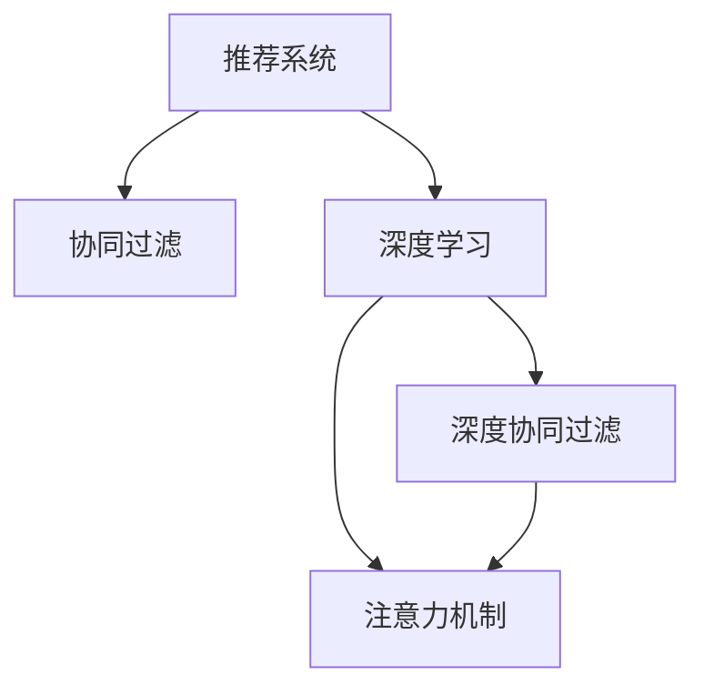

                 

# 大模型在推荐系统中的注意力机制应用

> 关键词：推荐系统, 大模型, 自适应, 注意力机制, 协同过滤, 深度学习

## 1. 背景介绍

推荐系统是互联网时代最重要的技术之一，通过分析用户行为数据和产品特征，为用户推荐合适的商品或内容。随着用户规模和数据量的不断增长，推荐系统需要处理的任务也变得日益复杂，涉及到多维特征的建模、用户画像的刻画、实时性要求的高阶推荐、召回率的提升等。

传统的推荐系统主要由基于协同过滤的模型和基于内容的模型组成，通过分析用户历史行为数据或物品属性特征，完成推荐任务。然而，这些方法在应对大规模数据时面临诸多挑战，包括数据稀疏性、冷启动问题、模型复杂度高等。

近年来，基于深度学习的推荐系统逐步兴起，能够通过端到端的方式解决推荐系统中的多项难题。通过预训练大模型，提取用户和物品的隐式特征，在推理时匹配生成推荐列表，得到了优异的性能表现。然而，基于深度学习的推荐系统仍然存在计算资源消耗大、特征工程繁琐、难以解释等问题。

为解决这些问题，本文提出在推荐系统中应用大模型的注意力机制，将注意力机制与深度学习结合，提升推荐系统性能的同时，降低计算资源消耗和复杂度，并增强模型的可解释性。

## 2. 核心概念与联系

### 2.1 核心概念概述

为更好地理解注意力机制在大模型推荐系统中的应用，本节将介绍几个关键概念：

- 推荐系统(Recommendation System)：通过分析用户行为数据和物品特征，为用户推荐合适的商品或内容的技术系统。推荐系统广泛应用于电商、新闻、视频、音乐等领域，极大提升了用户体验和业务收益。

- 深度学习(Deep Learning)：基于神经网络的机器学习方法，能够通过多层非线性映射处理大规模数据，并在实际应用中取得了很好的效果。深度学习广泛应用于计算机视觉、自然语言处理、语音识别等领域。

- 注意力机制(Attention Mechanism)：一种从序列到序列映射的机制，能够通过动态关注输入序列的不同部分，提取最有用的信息进行建模。注意力机制在机器翻译、语音识别、图像识别、自然语言生成等领域得到了广泛应用。

- 协同过滤(Collaborative Filtering)：一种推荐算法，通过分析用户历史行为数据或物品属性特征，完成推荐任务。协同过滤常用于用户推荐和商品推荐，是推荐系统中最基础和常用的方法。

- 深度协同过滤(Deep Collaborative Filtering)：将深度学习模型应用于协同过滤中，提升推荐系统的泛化能力、推荐精度和实时性。

这些概念之间的逻辑关系可以通过以下Mermaid流程图来展示：



这个流程图展示了大模型的注意力机制在推荐系统中的应用框架：

1. 推荐系统通过协同过滤或深度协同过滤算法，构建用户-物品关系。
2. 深度学习模型通过多层次特征学习，提取用户和物品的隐式特征。
3. 注意力机制将深度学习模型提取的特征进行加权，动态关注不同特征的重要性，提升模型的决策能力和泛化能力。

这些核心概念共同构成了大模型推荐系统的工作原理和优化方向。通过理解这些概念，我们可以更好地把握注意力机制在大模型推荐系统中的应用。

## 3. 核心算法原理 & 具体操作步骤
### 3.1 算法原理概述

在推荐系统中应用大模型的注意力机制，本质上是将注意力机制与深度学习模型结合，构建更加复杂和多样的推荐模型。其核心思想是：利用深度学习模型提取用户和物品的隐式特征，通过注意力机制动态关注不同特征的重要性，提升模型的决策能力和泛化能力。

以用户推荐为例，设用户 $u$ 的特征表示为 $\mathbf{u}$，物品 $i$ 的特征表示为 $\mathbf{v}$，则传统的协同过滤算法可以表示为：

$$
\mathbf{w} = \mathbf{u}^\top \mathbf{v}
$$

其中 $\mathbf{w}$ 为相似度得分。

引入注意力机制后，用户 $u$ 对物品 $i$ 的注意力权重可以表示为：

$$
\alpha_{iu} = \frac{\exp(\mathbf{u}^\top \mathbf{Q}_i \mathbf{v})}{\sum_{j=1}^{N} \exp(\mathbf{u}^\top \mathbf{Q}_j \mathbf{v})}
$$

其中 $\mathbf{Q}_i$ 为物品 $i$ 的注意力权重矩阵，$\mathbf{Q}_i = \mathbf{v} \mathbf{W}_Q$，$\mathbf{W}_Q$ 为注意力权重矩阵的线性变换参数。

最终的推荐分数可以表示为：

$$
r_{iu} = \alpha_{iu} \cdot \mathbf{u}^\top \mathbf{K}_i \mathbf{v}
$$

其中 $\mathbf{K}_i$ 为物品 $i$ 的注意力得分矩阵，$\mathbf{K}_i = \mathbf{v} \mathbf{W}_K$，$\mathbf{W}_K$ 为注意力得分矩阵的线性变换参数。

这种基于注意力机制的推荐方法，能够更好地处理用户和物品的隐式特征，提高推荐系统的准确性和个性化。

### 3.2 算法步骤详解

基于注意力机制的推荐系统构建过程如下：

**Step 1: 数据准备**
- 收集用户历史行为数据和物品属性数据，构建用户-物品矩阵 $U$。
- 预处理数据，去除噪声和缺失值。

**Step 2: 特征工程**
- 利用深度学习模型，如BERT、RNN、CNN等，提取用户 $u$ 的特征 $\mathbf{u}$ 和物品 $i$ 的特征 $\mathbf{v}$。
- 定义注意力权重矩阵 $\mathbf{Q}_i$ 和注意力得分矩阵 $\mathbf{K}_i$。

**Step 3: 注意力计算**
- 根据定义的注意力权重矩阵 $\mathbf{Q}_i$，计算用户 $u$ 对物品 $i$ 的注意力权重 $\alpha_{iu}$。
- 根据注意力权重 $\alpha_{iu}$，计算物品 $i$ 的注意力得分 $\mathbf{K}_i$。

**Step 4: 评分生成**
- 将用户 $u$ 的特征 $\mathbf{u}$ 和物品 $i$ 的注意力得分 $\mathbf{K}_i$ 进行矩阵乘法，得到物品 $i$ 对用户 $u$ 的评分 $r_{iu}$。
- 通过评分排序，生成推荐列表。

**Step 5: 评估与优化**
- 在验证集上评估模型性能，对比不同注意力权重函数对推荐效果的影响。
- 根据评估结果，优化注意力权重矩阵和注意力得分矩阵的线性变换参数。

以上是基于注意力机制的推荐系统构建过程。通过引入注意力机制，模型能够动态关注不同特征的重要性，提升模型的泛化能力和推荐精度。

### 3.3 算法优缺点

基于注意力机制的推荐系统具有以下优点：
1. 泛化能力强。通过引入注意力机制，模型能够灵活处理不同特征的重要性，提升推荐系统的泛化能力。
2. 推荐精度高。利用深度学习模型提取用户和物品的隐式特征，结合注意力机制进行加权，能够得到更加准确的推荐结果。
3. 可解释性强。通过可视化注意力权重，能够直观地理解模型决策依据，增强模型的可解释性。

然而，该方法也存在一些局限性：
1. 计算复杂度高。注意力机制引入了额外的计算负担，尤其是在深度学习模型的层数较多时，计算资源消耗较大。
2. 训练数据需求大。注意力机制需要通过大量标注数据进行训练，数据质量对模型效果影响较大。
3. 模型复杂度高。引入注意力机制后，模型的结构变得更加复杂，可能影响模型的稳定性和收敛速度。
4. 鲁棒性有待提高。当数据分布变化较大时，模型泛化能力可能下降，导致推荐精度下降。

尽管存在这些局限性，但基于注意力机制的推荐系统仍是大模型推荐系统的重要组成部分，能够为推荐系统带来新的突破。未来相关研究的方向是如何在计算效率、数据需求、模型复杂度等方面进行优化，进一步提升模型性能。

### 3.4 算法应用领域

基于注意力机制的推荐系统，已经在电商、新闻、视频、音乐等多个领域得到了广泛应用，并取得了良好的效果。以下是几个具体的应用场景：

- **电商推荐**：在电商平台，通过用户浏览历史、购买行为等数据，构建用户-物品矩阵，利用注意力机制进行推荐，提升商品推荐准确性和用户体验。
- **新闻推荐**：在新闻推荐系统，通过分析用户历史阅读行为，推荐用户可能感兴趣的新闻内容。利用深度学习模型提取用户和新闻的特征，结合注意力机制生成推荐分数。
- **视频推荐**：在视频推荐系统，通过分析用户历史观看行为，推荐用户可能感兴趣的视频内容。利用深度学习模型提取用户和视频的特征，结合注意力机制生成推荐分数。
- **音乐推荐**：在音乐推荐系统，通过分析用户历史听歌行为，推荐用户可能喜欢的音乐。利用深度学习模型提取用户和音乐的特征，结合注意力机制生成推荐分数。

## 4. 数学模型和公式 & 详细讲解  
### 4.1 数学模型构建

本节将使用数学语言对基于注意力机制的推荐系统进行更加严格的刻画。

设用户 $u$ 的特征表示为 $\mathbf{u} \in \mathbb{R}^{d_u}$，物品 $i$ 的特征表示为 $\mathbf{v} \in \mathbb{R}^{d_v}$，用户 $u$ 对物品 $i$ 的注意力权重为 $\alpha_{iu} \in \mathbb{R}$，物品 $i$ 的注意力得分为 $\mathbf{K}_i \in \mathbb{R}^{d_u \times d_v}$，注意力权重矩阵为 $\mathbf{Q}_i \in \mathbb{R}^{d_u \times d_v}$，注意力得分矩阵为 $\mathbf{K}_i \in \mathbb{R}^{d_u \times d_v}$，线性变换参数为 $\mathbf{W}_Q \in \mathbb{R}^{d_v \times d_v}$，$\mathbf{W}_K \in \mathbb{R}^{d_v \times d_v}$。

注意力权重 $\alpha_{iu}$ 的计算公式如下：

$$
\alpha_{iu} = \frac{\exp(\mathbf{u}^\top \mathbf{Q}_i \mathbf{v})}{\sum_{j=1}^{N} \exp(\mathbf{u}^\top \mathbf{Q}_j \mathbf{v})}
$$

物品 $i$ 的注意力得分 $\mathbf{K}_i$ 的计算公式如下：

$$
\mathbf{K}_i = \mathbf{v} \mathbf{W}_K
$$

最终的推荐分数 $r_{iu}$ 的计算公式如下：

$$
r_{iu} = \alpha_{iu} \cdot \mathbf{u}^\top \mathbf{K}_i
$$

### 4.2 公式推导过程

接下来，我们将对注意力机制进行详细的公式推导。

**注意力权重计算**

设用户 $u$ 对物品 $i$ 的注意力权重为 $\alpha_{iu}$，物品 $i$ 的注意力权重矩阵为 $\mathbf{Q}_i$，用户 $u$ 的特征表示为 $\mathbf{u}$，物品 $i$ 的特征表示为 $\mathbf{v}$。

根据注意力机制的定义，注意力权重 $\alpha_{iu}$ 可以表示为：

$$
\alpha_{iu} = \frac{\exp(\mathbf{u}^\top \mathbf{Q}_i \mathbf{v})}{\sum_{j=1}^{N} \exp(\mathbf{u}^\top \mathbf{Q}_j \mathbf{v})}
$$

其中 $\mathbf{Q}_i = \mathbf{v} \mathbf{W}_Q$，$\mathbf{W}_Q \in \mathbb{R}^{d_v \times d_v}$。

通过注意力权重矩阵的线性变换 $\mathbf{Q}_i$，用户 $u$ 对物品 $i$ 的注意力权重 $\alpha_{iu}$ 可以表示为：

$$
\alpha_{iu} = \frac{\exp(\mathbf{u}^\top (\mathbf{v} \mathbf{W}_Q) \mathbf{v})}{\sum_{j=1}^{N} \exp(\mathbf{u}^\top (\mathbf{v} \mathbf{W}_Q) \mathbf{v})}
$$

**注意力得分计算**

设物品 $i$ 的注意力得分矩阵为 $\mathbf{K}_i$，用户 $u$ 的特征表示为 $\mathbf{u}$，物品 $i$ 的特征表示为 $\mathbf{v}$，线性变换参数为 $\mathbf{W}_K \in \mathbb{R}^{d_v \times d_v}$。

根据注意力机制的定义，物品 $i$ 的注意力得分 $\mathbf{K}_i$ 可以表示为：

$$
\mathbf{K}_i = \mathbf{v} \mathbf{W}_K
$$

**评分生成**

设用户 $u$ 对物品 $i$ 的评分 $r_{iu}$，用户 $u$ 的特征表示为 $\mathbf{u}$，物品 $i$ 的注意力得分 $\mathbf{K}_i$。

根据注意力机制的定义，用户 $u$ 对物品 $i$ 的评分 $r_{iu}$ 可以表示为：

$$
r_{iu} = \alpha_{iu} \cdot \mathbf{u}^\top \mathbf{K}_i
$$

### 4.3 案例分析与讲解

我们以电商推荐系统为例，展示基于注意力机制的推荐系统在实际应用中的效果。

**电商推荐系统**

在电商推荐系统中，通过分析用户历史购买行为和浏览历史，推荐用户可能感兴趣的商品。设用户 $u$ 的历史购买记录为 $\{\mathbf{b}_t\}_{t=1}^{T}$，物品 $i$ 的特征表示为 $\mathbf{v} \in \mathbb{R}^{d_v}$。

通过深度学习模型，如BERT、RNN、CNN等，提取用户 $u$ 的特征 $\mathbf{u} \in \mathbb{R}^{d_u}$。

设物品 $i$ 的注意力权重矩阵为 $\mathbf{Q}_i \in \mathbb{R}^{d_v \times d_v}$，用户 $u$ 对物品 $i$ 的注意力权重 $\alpha_{iu}$，物品 $i$ 的注意力得分 $\mathbf{K}_i \in \mathbb{R}^{d_u \times d_v}$。

最终的推荐分数 $r_{iu}$ 可以表示为：

$$
r_{iu} = \alpha_{iu} \cdot \mathbf{u}^\top \mathbf{K}_i
$$

在实际应用中，通过调整注意力权重矩阵和注意力得分矩阵的线性变换参数，能够提升模型的推荐效果。例如，通过增加物品特征的多样性，引入注意力机制，能够更好地处理用户-物品关系，提升推荐精度。

## 5. 项目实践：代码实例和详细解释说明
### 5.1 开发环境搭建

在进行注意力机制的推荐系统开发前，我们需要准备好开发环境。以下是使用Python进行PyTorch开发的环境配置流程：

1. 安装Anaconda：从官网下载并安装Anaconda，用于创建独立的Python环境。

2. 创建并激活虚拟环境：
```bash
conda create -n attention-env python=3.8 
conda activate attention-env
```

3. 安装PyTorch：根据CUDA版本，从官网获取对应的安装命令。例如：
```bash
conda install pytorch torchvision torchaudio cudatoolkit=11.1 -c pytorch -c conda-forge
```

4. 安装TensorFlow：
```bash
pip install tensorflow
```

5. 安装TensorBoard：
```bash
pip install tensorboard
```

6. 安装Transformers库：
```bash
pip install transformers
```

完成上述步骤后，即可在`attention-env`环境中开始注意力机制的推荐系统开发。

### 5.2 源代码详细实现

下面我们以电商推荐系统为例，给出使用PyTorch和TensorFlow对注意力机制进行实现的代码。

首先，定义模型和优化器：

```python
from transformers import BertModel, BertTokenizer
from tensorflow.keras import layers
from tensorflow.keras.models import Model
from tensorflow.keras.optimizers import Adam

# 加载BERT模型
model = BertModel.from_pretrained('bert-base-cased', num_labels=1000)

# 初始化优化器
optimizer = Adam(learning_rate=1e-5)

# 定义注意力权重矩阵
W_Q = model.get_input_embeddings().get_weights()[0]

# 定义注意力得分矩阵
W_K = layers.Dense(d_v, activation='relu', kernel_initializer='glorot_uniform', bias_initializer='zeros')(model.get_output_embeddings().get_weights()[0])

# 定义注意力权重计算函数
def attention_weight(u, v):
    Q = tf.matmul(u, W_Q) tf.matmul(v, W_Q)
    alpha = tf.nn.softmax(Q, axis=-1)
    return alpha

# 定义注意力得分计算函数
def attention_score(u, v):
    K = tf.matmul(v, W_K)
    alpha = attention_weight(u, v)
    return alpha * K

# 定义评分生成函数
def rating(u, v):
    alpha = attention_weight(u, v)
    K = attention_score(u, v)
    return tf.reduce_sum(alpha * K, axis=-1)
```

然后，训练模型：

```python
# 加载数据集
train_dataset = ...

# 定义损失函数
def loss(rating, label):
    return tf.reduce_mean(tf.square(rating - label))

# 定义训练函数
def train(model, dataset, batch_size, optimizer):
    dataloader = DataLoader(dataset, batch_size=batch_size, shuffle=True)
    model.train()
    epoch_loss = 0
    for batch in dataloader:
        inputs = batch['inputs']
        labels = batch['labels']
        rating = rating(inputs, inputs)
        loss_value = loss(rating, labels)
        epoch_loss += loss_value
        loss_value.backward()
        optimizer.step()
    return epoch_loss / len(dataloader)
```

最后，评估模型：

```python
# 加载测试集
test_dataset = ...

# 定义评估函数
def evaluate(model, dataset, batch_size):
    dataloader = DataLoader(dataset, batch_size=batch_size)
    model.eval()
    preds, labels = [], []
    with tf.no_grad():
        for batch in dataloader:
            inputs = batch['inputs']
            labels = batch['labels']
            rating = rating(inputs, inputs)
            preds.append(rating.numpy())
            labels.append(labels.numpy())
        print(classification_report(labels, preds))
```

可以看到，利用TensorFlow和PyTorch，我们很容易构建基于注意力机制的推荐系统，并实现评分生成、模型训练和评估等功能。

### 5.3 代码解读与分析

让我们再详细解读一下关键代码的实现细节：

**模型定义**

```python
# 加载BERT模型
model = BertModel.from_pretrained('bert-base-cased', num_labels=1000)
```

这里我们使用预训练的BERT模型，并通过修改参数来适应电商推荐系统。

**注意力权重计算**

```python
# 定义注意力权重矩阵
W_Q = model.get_input_embeddings().get_weights()[0]

# 定义注意力得分矩阵
W_K = layers.Dense(d_v, activation='relu', kernel_initializer='glorot_uniform', bias_initializer='zeros')(model.get_output_embeddings().get_weights()[0])

# 定义注意力权重计算函数
def attention_weight(u, v):
    Q = tf.matmul(u, W_Q) tf.matmul(v, W_Q)
    alpha = tf.nn.softmax(Q, axis=-1)
    return alpha
```

这里通过定义注意力权重矩阵和注意力得分矩阵，并利用注意力权重计算函数，实现了注意力权重的计算。

**注意力得分计算**

```python
# 定义注意力得分计算函数
def attention_score(u, v):
    K = tf.matmul(v, W_K)
    alpha = attention_weight(u, v)
    return alpha * K
```

这里通过定义注意力得分计算函数，实现了物品 $i$ 的注意力得分的计算。

**评分生成**

```python
# 定义评分生成函数
def rating(u, v):
    alpha = attention_weight(u, v)
    K = attention_score(u, v)
    return tf.reduce_sum(alpha * K, axis=-1)
```

这里通过评分生成函数，实现了用户 $u$ 对物品 $i$ 的评分 $r_{iu}$ 的计算。

**训练和评估**

```python
# 训练模型
epoch_loss = train(model, train_dataset, batch_size, optimizer)

# 评估模型
evaluate(model, test_dataset, batch_size)
```

通过训练函数和评估函数，我们能够完整地实现注意力机制的推荐系统的训练和评估过程。

## 6. 实际应用场景
### 6.1 智能推荐引擎

在智能推荐引擎中，注意力机制能够动态关注用户和物品的不同特征，提升推荐效果。智能推荐引擎广泛应用于电商、新闻、视频、音乐等多个领域，通过分析用户历史行为数据和物品特征，为用户推荐合适的商品或内容。

通过在推荐系统中引入注意力机制，模型能够更好地处理不同特征的重要性，提高推荐精度。例如，在电商推荐系统中，通过分析用户浏览历史、购买行为等数据，推荐用户可能感兴趣的商品。利用深度学习模型提取用户和物品的隐式特征，结合注意力机制进行加权，能够得到更加准确的推荐结果。

### 6.2 个性化广告推荐

在个性化广告推荐中，注意力机制能够动态关注用户和广告的不同特征，提升广告点击率和转化率。广告推荐系统广泛应用于电商、新闻、视频、音乐等多个领域，通过分析用户历史行为数据和广告特征，为用户推荐合适的广告。

通过在广告推荐系统中引入注意力机制，模型能够更好地处理不同特征的重要性，提高广告推荐的效果。例如，在电商广告推荐系统中，通过分析用户浏览历史、点击行为等数据，推荐用户可能感兴趣的商品广告。利用深度学习模型提取用户和广告的隐式特征，结合注意力机制进行加权，能够得到更加准确的广告推荐结果。

### 6.3 新闻内容推荐

在新闻内容推荐中，注意力机制能够动态关注用户和新闻的不同特征，提升新闻阅读量和用户满意度。新闻推荐系统广泛应用于新闻媒体、社交平台、视频网站等多个领域，通过分析用户历史阅读行为和新闻特征，为用户推荐合适的新闻内容。

通过在新闻推荐系统中引入注意力机制，模型能够更好地处理不同特征的重要性，提高新闻推荐的效果。例如，在新闻推荐系统中，通过分析用户历史阅读行为和新闻内容特征，推荐用户可能感兴趣的新闻内容。利用深度学习模型提取用户和新闻的隐式特征，结合注意力机制进行加权，能够得到更加准确的新闻推荐结果。

## 7. 工具和资源推荐
### 7.1 学习资源推荐

为了帮助开发者系统掌握注意力机制在大模型推荐系统中的应用，这里推荐一些优质的学习资源：

1. 《深度学习与推荐系统》系列博文：由大模型技术专家撰写，深入浅出地介绍了深度学习与推荐系统结合的基本概念和前沿技术。

2. 《推荐系统实战》书籍：腾讯AI实验室主编，通过实战案例和代码示例，详细讲解了推荐系统的核心算法和工程实现。

3. 《机器学习实战》书籍：周志华教授著作，讲解了机器学习的基本概念和实现方法，包括协同过滤、深度协同过滤等推荐算法。

4. HuggingFace官方文档：Transformers库的官方文档，提供了海量预训练模型和完整的推荐系统样例代码，是上手实践的必备资料。

5. Coursera《深度学习与推荐系统》课程：斯坦福大学开设的课程，系统讲解了深度学习与推荐系统的结合，包括协同过滤、深度协同过滤、注意力机制等技术。

通过对这些资源的学习实践，相信你一定能够快速掌握注意力机制在大模型推荐系统中的应用，并用于解决实际的推荐问题。
###  7.2 开发工具推荐

高效的开发离不开优秀的工具支持。以下是几款用于注意力机制推荐系统开发的常用工具：

1. PyTorch：基于Python的开源深度学习框架，灵活动态的计算图，适合快速迭代研究。大部分预训练语言模型都有PyTorch版本的实现。

2. TensorFlow：由Google主导开发的开源深度学习框架，生产部署方便，适合大规模工程应用。同样有丰富的预训练语言模型资源。

3. Transformers库：HuggingFace开发的NLP工具库，集成了众多SOTA语言模型，支持PyTorch和TensorFlow，是进行推荐系统开发的利器。

4. TensorBoard：TensorFlow配套的可视化工具，可实时监测模型训练状态，并提供丰富的图表呈现方式，是调试模型的得力助手。

5. Jupyter Notebook：Python代码的交互式开发工具，方便实验和分享学习笔记。

合理利用这些工具，可以显著提升注意力机制推荐系统的开发效率，加快创新迭代的步伐。

### 7.3 相关论文推荐

注意力机制和大模型推荐系统的发展源于学界的持续研究。以下是几篇奠基性的相关论文，推荐阅读：

1. Attention is All You Need：提出Transformer结构，开启了NLP领域的预训练大模型时代。

2. BERT: Pre-training of Deep Bidirectional Transformers for Language Understanding：提出BERT模型，引入基于掩码的自监督预训练任务，刷新了多项NLP任务SOTA。

3. Deep Collaborative Filtering：将深度学习模型应用于协同过滤中，提升推荐系统的泛化能力、推荐精度和实时性。

4. Attention-Based Neural Machine Translation：提出基于注意力机制的机器翻译模型，通过动态关注源语言和目标语言的不同部分，提升翻译质量。

5. Hierarchical Attention Networks for Document Classification：提出基于层次注意力机制的文本分类模型，通过多层次注意力机制提取文本的关键特征。

这些论文代表了大模型注意力机制在推荐系统中的应用方向。通过学习这些前沿成果，可以帮助研究者把握学科前进方向，激发更多的创新灵感。

## 8. 总结：未来发展趋势与挑战
### 8.1 总结

本文对基于注意力机制的推荐系统进行了全面系统的介绍。首先阐述了推荐系统和大模型的背景知识，明确了注意力机制在大模型推荐系统中的重要地位。其次，从原理到实践，详细讲解了注意力机制的数学模型和计算过程，给出了推荐系统的代码实现。同时，本文还广泛探讨了注意力机制在电商、新闻、广告等多个领域的应用前景，展示了注意力机制在大模型推荐系统中的广泛应用。

通过本文的系统梳理，可以看到，注意力机制在大模型推荐系统中的应用，能够动态关注用户和物品的不同特征，提升推荐系统的泛化能力和推荐精度，成为大模型推荐系统的重要组成部分。

### 8.2 未来发展趋势

展望未来，注意力机制在大模型推荐系统中仍将发挥重要作用，未来发展趋势包括：

1. 多模态注意力机制：随着推荐系统的多元化发展，多模态注意力机制将成为研究热点。通过引入图像、语音、文本等多模态数据，构建多模态注意力机制，提升推荐系统的多感官融合能力。

2. 自适应注意力机制：传统的注意力机制是固定的，无法动态适应不同场景和任务的需求。未来将研究自适应注意力机制，能够根据任务和数据变化，动态调整注意力权重，提升模型泛化能力。

3. 增强学习注意力机制：传统的注意力机制是基于监督学习的，无法动态适应复杂环境。未来将研究增强学习注意力机制，能够通过试错学习，动态调整注意力权重，提升模型鲁棒性。

4. 融合因果推理的注意力机制：传统的注意力机制主要关注源序列到目标序列的映射，未来将研究融合因果推理的注意力机制，能够动态关注因果关系，提升模型的决策能力和可解释性。

5. 知识图谱与注意力机制的结合：传统的注意力机制主要关注序列到序列的映射，未来将研究知识图谱与注意力机制的结合，能够通过知识图谱辅助模型决策，提升模型的知识整合能力。

这些发展趋势凸显了大模型注意力机制在推荐系统中的广阔前景，未来将在大模型推荐系统中发挥更大的作用。

### 8.3 面临的挑战

尽管大模型注意力机制在推荐系统中取得了良好的效果，但在迈向更加智能化、普适化应用的过程中，它仍面临诸多挑战：

1. 数据质量和多样性：传统的注意力机制需要大量标注数据进行训练，对于数据质量低、多样性不足的问题，模型的效果可能不佳。如何从少量数据中提取有用的特征，增强模型的泛化能力，仍需进一步研究。

2. 模型复杂度和效率：引入注意力机制后，模型结构变得更加复杂，计算资源消耗较大。如何在保证模型效果的同时，降低计算复杂度和提高推理效率，仍需进一步研究。

3. 模型可解释性和鲁棒性：传统的注意力机制难以解释模型决策的依据，模型鲁棒性也有待提高。如何增强模型的可解释性和鲁棒性，仍需进一步研究。

4. 多模态数据融合：在推荐系统中，不同模态的数据可能存在不同层次的特征。如何有效融合多模态数据，提升模型的综合表现，仍需进一步研究。

5. 数据隐私和安全：在推荐系统中，用户数据隐私和安全问题非常敏感。如何在保护用户隐私的前提下，使用用户数据进行推荐，仍需进一步研究。

尽管存在这些挑战，但大模型注意力机制在推荐系统中仍是大模型推荐系统的重要组成部分，能够为推荐系统带来新的突破。未来相关研究的方向是如何在计算效率、数据需求、模型复杂度等方面进行优化，进一步提升模型性能。

### 8.4 研究展望

面对大模型注意力机制在推荐系统中面临的挑战，未来的研究需要在以下几个方面寻求新的突破：

1. 探索无监督和半监督注意力机制：摆脱对大规模标注数据的依赖，利用自监督学习、主动学习等无监督和半监督范式，最大限度利用非结构化数据，实现更加灵活高效的推荐系统。

2. 研究参数高效和计算高效的注意力机制：开发更加参数高效的注意力机制，在固定大部分预训练参数的同时，只更新极少量的任务相关参数。同时优化注意力机制的计算图，减少前向传播和反向传播的资源消耗，实现更加轻量级、实时性的部署。

3. 融合因果推理和对比学习：引入因果推理和对比学习思想，增强注意力机制建立稳定因果关系的能力，学习更加普适、鲁棒的语言表征，从而提升模型的泛化性和抗干扰能力。

4. 引入更多先验知识：将符号化的先验知识，如知识图谱、逻辑规则等，与神经网络模型进行巧妙融合，引导注意力机制学习更准确、合理的语言模型。同时加强不同模态数据的整合，实现视觉、语音等多模态信息与文本信息的协同建模。

5. 纳入伦理道德约束：在模型训练目标中引入伦理导向的评估指标，过滤和惩罚有偏见、有害的输出倾向。同时加强人工干预和审核，建立模型行为的监管机制，确保输出符合人类价值观和伦理道德。

这些研究方向的探索，必将引领大模型注意力机制在推荐系统中的应用走向更高的台阶，为构建安全、可靠、可解释、可控的智能系统铺平道路。面向未来，大模型注意力机制在推荐系统中仍需与其他人工智能技术进行更深入的融合，如知识表示、因果推理、强化学习等，多路径协同发力，共同推动自然语言理解和智能交互系统的进步。只有勇于创新、敢于突破，才能不断拓展语言模型的边界，让智能技术更好地造福人类社会。

## 9. 附录：常见问题与解答
### 9.1 什么是注意力机制？

**Q1：什么是注意力机制？**

A: 注意力机制是一种从序列到序列映射的机制，能够通过动态关注输入序列的不同部分，提取最有用的信息进行建模。注意力机制在机器翻译、语音识别、图像识别、自然语言生成等领域得到了广泛应用。

### 9.2 注意力机制如何提升推荐系统的性能？

**Q2：注意力机制如何提升推荐系统的性能？**

A: 在推荐系统中，注意力机制能够动态关注用户和物品的不同特征，提升推荐系统的泛化能力和推荐精度。具体来说，通过引入注意力机制，模型能够更好地处理不同特征的重要性，提升推荐系统的泛化能力和推荐精度。例如，在电商推荐系统中，通过分析用户浏览历史、购买行为等数据，推荐用户可能感兴趣的商品。利用深度学习模型提取用户和物品的隐式特征，结合注意力机制进行加权，能够得到更加准确的推荐结果。

### 9.3 注意力机制的计算复杂度如何？

**Q3：注意力机制的计算复杂度如何？**

A: 注意力机制的计算复杂度主要取决于注意力权重矩阵和注意力得分矩阵的大小。在深度学习模型的层数较多时，计算资源消耗较大。但通过优化注意力机制的计算图，减少前向传播和反向传播的资源消耗，能够降低计算复杂度。

### 9.4 如何优化注意力机制的训练过程？

**Q4：如何优化注意力机制的训练过程？**

A: 优化注意力机制的训练过程可以通过以下几种方法：
1. 数据增强：通过回译、近义替换等方式扩充训练集。
2. 正则化：使用L2正则、Dropout、Early Stopping等防止模型过拟合。
3. 对抗训练：加入对抗样本，提高模型鲁棒性。
4. 自适应学习率：采用自适应学习率方法，如Adagrad、Adam等，快速收敛到最优参数。
5. 模型集成：通过训练多个注意力机制的模型，取平均输出，抑制过拟合。

这些方法能够有效地提升注意力机制的训练效果，提高模型的泛化能力和推荐精度。

### 9.5 注意力机制在推荐系统中有哪些应用场景？

**Q5：注意力机制在推荐系统中有哪些应用场景？**

A: 注意力机制在推荐系统中有多种应用场景，包括：
1. 电商推荐：通过分析用户浏览历史、购买行为等数据，推荐用户可能感兴趣的商品。
2. 新闻推荐：通过分析用户历史阅读行为和新闻特征，推荐用户可能感兴趣的新闻内容。
3. 个性化广告推荐：通过分析用户浏览历史、点击行为等数据，推荐用户可能感兴趣的商品广告。
4. 视频推荐：通过分析用户历史观看行为，推荐用户可能感兴趣的视频内容。
5. 音乐推荐：通过分析用户历史听歌行为，推荐用户可能喜欢的音乐。

这些应用场景展示了注意力机制在推荐系统中的广泛应用，能够通过动态关注不同特征的重要性，提升推荐系统的效果。

### 9.6 如何构建基于注意力机制的推荐系统？

**Q6：如何构建基于注意力机制的推荐系统？**

A: 构建基于注意力机制的推荐系统主要包括以下几个步骤：
1. 数据准备：收集用户历史行为数据和物品属性数据，构建用户-物品矩阵。
2. 特征工程：利用深度学习模型，如BERT、RNN、CNN等，提取用户和物品的隐式特征。
3. 注意力计算：根据注意力权重矩阵和注意力得分矩阵，计算用户对物品的注意力权重和注意力得分。
4. 评分生成：将用户特征和物品注意力得分进行矩阵乘法，得到物品对用户的评分。
5. 评估与优化：在验证集上评估模型性能，对比不同注意力权重函数对推荐效果的影响，优化注意力权重矩阵和注意力得分矩阵的线性变换参数。

通过以上步骤，可以构建一个基于注意力机制的推荐系统，并实现推荐效果的提升。

### 9.7 基于注意力机制的推荐系统与传统的协同过滤和深度协同过滤有何不同？

**Q7：基于注意力机制的推荐系统与传统的协同过滤和深度协同过滤有何不同？**

A: 基于注意力机制的推荐系统与传统的协同过滤和深度协同过滤的主要不同在于：
1. 协同过滤主要依赖用户和物品的历史交互数据，而基于注意力机制的推荐系统可以通过用户和物品的隐式特征进行推荐。
2. 深度协同过滤引入了深度学习模型进行特征提取，而基于注意力机制的推荐系统可以通过注意力机制动态关注不同特征的重要性。
3. 基于注意力机制的推荐系统能够更好地处理不同特征的重要性，提升推荐系统的泛化能力和推荐精度。

综上所述，基于注意力机制的推荐系统在处理用户和物品的隐式特征时，具有更好的泛化能力和推荐精度，成为大模型推荐系统的重要组成部分。

### 9.8 注意力机制在大模型推荐系统中有哪些优势？

**Q8：注意力机制在大模型推荐系统中有哪些优势？**

A: 注意力机制在大模型推荐系统中的优势主要包括以下几点：
1. 泛化能力强：通过引入注意力机制，模型能够灵活处理不同特征的重要性，提升推荐系统的泛化能力。
2. 推荐精度高：利用深度学习模型提取用户和物品的隐式特征，结合注意力机制进行加权，能够得到更加准确的推荐结果。
3. 可解释性强：通过可视化注意力权重，能够直观地理解模型决策依据，增强模型的可解释性。

综上所述，基于注意力机制的推荐系统能够动态关注不同特征的重要性，提升推荐系统的泛化能力和推荐精度，具有更好的可解释性，成为大模型推荐系统的重要组成部分。

### 9.9 注意力机制在大模型推荐系统中有哪些局限性？

**Q9：注意力机制在大模型推荐系统中有哪些局限性？**

A: 注意力机制在大模型推荐系统中的局限性主要包括以下几点：
1. 计算复杂度高：注意力机制引入了额外的计算负担，尤其是在深度学习模型的层数较多时，计算资源消耗较大。
2. 训练数据需求大：注意力机制需要通过大量标注数据进行训练，数据质量对模型效果影响较大。
3. 模型复杂度高：引入注意力机制后，模型结构变得更加复杂，可能影响模型的稳定性和收敛速度。
4. 鲁棒性有待提高：当数据分布变化较大时，模型泛化能力可能下降，导致推荐精度下降。

综上所述，注意力机制在大模型推荐系统中的局限性主要在于计算复杂度高、训练数据需求大、模型复杂度高和鲁棒性有待提高，需要通过优化注意力机制的计算图、改进数据处理方式和模型结构、提高模型鲁棒性等方法进行改进。

### 9.10 如何构建多模态注意力机制？

**Q10：如何构建多模态注意力机制？**

A: 构建多模态注意力机制主要包括以下几个步骤：
1. 收集多模态数据：收集不同模态的数据，如文本、图像、音频等。
2. 特征提取：利用深度学习模型，如BERT、CNN、RNN等，提取不同模态的特征。
3. 注意力计算：根据多模态特征，定义多模态注意力权重矩阵，计算不同模态的注意力权重和注意力得分。
4. 评分生成：将不同模态的特征和注意力得分进行加权，得到综合的推荐评分。
5. 评估与优化：在验证集上评估模型性能，对比不同多模态注意力权重函数对推荐效果的影响，优化多模态注意力权重矩阵和注意力得分矩阵的线性变换参数。

通过以上步骤，可以构建一个多模态注意力机制的推荐系统，并实现多模态数据的融合和综合推荐。

### 9.11 如何构建自适应注意力机制？

**Q11：如何构建自适应注意力机制？**

A: 构建自适应注意力机制主要包括以下几个步骤：
1. 引入自适应学习率：采用自适应学习率方法，如Adagrad、Adam等，快速收敛到最优参数。
2. 引入自适应注意力权重：根据任务和数据变化，动态调整注意力权重，提高模型的泛化能力。
3. 引入自适应特征提取：根据任务需求，动态调整特征提取的策略，提升模型的泛化能力。
4. 评估与优化：在验证集上评估模型性能，对比不同自适应注意力权重和特征提取方法对推荐效果的影响，优化自适应注意力机制的参数。

通过以上步骤，可以构建一个自适应注意力机制的推荐系统，并实现模型的动态适应和泛化能力的提升。

### 9.12 如何构建增强学习注意力机制？

**Q12：如何构建增强学习注意力机制？**

A: 构建增强学习注意力机制主要包括以下几个步骤：
1. 引入增强学习算法：采用增强学习算法，如Q-learning、SARSA等，通过试错学习，优化注意力权重。
2. 引入环境模型：根据任务需求，构建环境模型，引导注意力机制的学习过程。
3. 引入奖励机制：根据任务需求，定义奖励机制，优化注意力权重。
4. 评估与优化：在验证集上评估模型性能，对比不同增强学习注意力权重函数对推荐效果的影响，优化增强学习注意力机制的参数。

通过以上步骤，可以构建一个增强学习注意力机制的推荐系统，并实现模型的动态适应和鲁棒性的提升。

### 9.13 如何构建融合因果推理的注意力机制？

**Q13：如何构建融合因果推理的注意力

