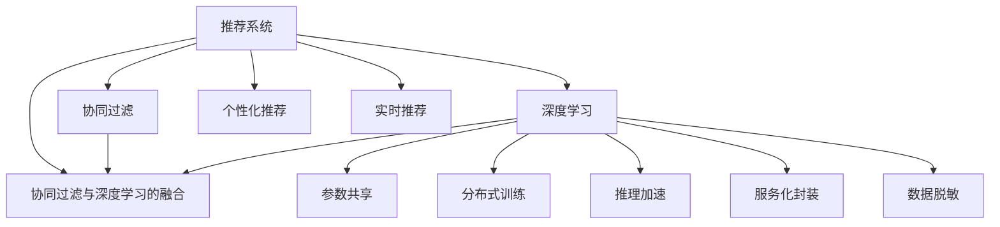
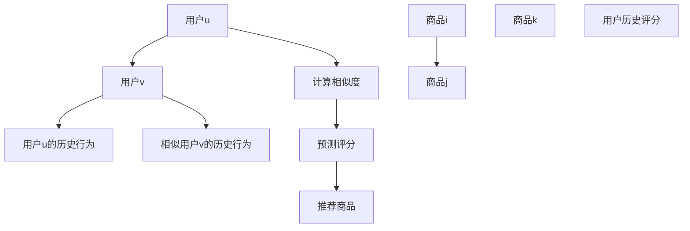
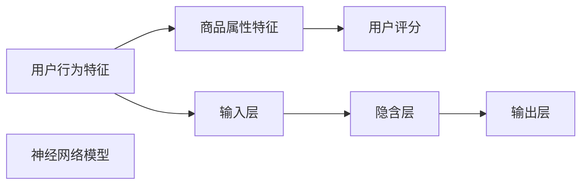

                 

# 大模型在推荐系统多场景适配中的应用

> 关键词：推荐系统,大模型,多场景适配,协同过滤,深度学习,参数共享,分布式训练,推理加速,服务化封装,数据脱敏

## 1. 背景介绍

推荐系统是信息时代的重要基础设施，帮助用户在海量数据中发现兴趣内容，提升信息获取效率。随着数据规模和应用场景的不断扩展，推荐系统面临着新的挑战：

1. **用户需求多样化**：不同用户群体和场景下的个性化需求不同，推荐系统需要针对不同用户画像提供量身定制的服务。
2. **数据复杂性**：推荐数据包括用户行为数据、商品属性数据、社交关系数据等，数据类型繁多且多源异构。
3. **系统可扩展性**：大规模推荐系统需要处理海量数据，支撑千万级的用户和商品，系统可扩展性和性能要求极高。

## 2. 核心概念与联系

### 2.1 核心概念概述

为更好地理解大模型在推荐系统中的应用，本节将介绍几个关键概念：

- **推荐系统(Recommendation System)**：通过算法模型推荐用户可能感兴趣的商品、内容、活动等，提升用户满意度。
- **协同过滤(Collaborative Filtering)**：基于用户行为和相似性进行推荐，包括用户-商品协同、商品-商品协同、时间-时间协同等。
- **深度学习(Deep Learning)**：使用多层神经网络模型进行复杂特征表示和模式学习，提升推荐准确性和泛化能力。
- **参数共享(Parameter Sharing)**：在多场景模型之间共享部分参数，减少资源浪费和提升模型泛化能力。
- **分布式训练(Distributed Training)**：在多台计算机上并行训练模型，加速模型收敛和提升系统扩展性。
- **推理加速(Inference Acceleration)**：通过优化模型结构和算法，加速模型的推理计算。
- **服务化封装(Service Orchestration)**：将推荐模型封装为标准化的服务接口，方便业务集成和使用。
- **数据脱敏(Data Obfuscation)**：对用户隐私数据进行加密或匿名处理，保障数据安全和用户隐私。

这些概念之间通过以下Mermaid流程图进行联系：



### 2.2 核心概念原理和架构

推荐系统的核心目标是利用用户历史行为数据和商品属性数据，为用户推荐可能感兴趣的内容。协同过滤和深度学习是推荐系统中常用的方法。

**协同过滤**基于用户行为或商品属性，找到相似用户或商品，利用其历史行为进行推荐。基本思路包括：

1. **用户-用户协同**：找到与当前用户兴趣相似的用户，推荐该用户喜欢的商品。
2. **商品-商品协同**：找到与当前商品相似的其它商品，推荐给喜欢该商品的用户。
3. **时间-时间协同**：考虑用户在不同时间点的行为变化，推荐最近或未来的商品。

协同过滤算法主要包括基于用户的协同过滤和基于商品的协同过滤两种。其中，基于用户的协同过滤算法流程如下：

1. **计算用户相似度**：计算用户u和用户v的相似度。
2. **预测用户行为**：根据用户u的历史行为和相似用户v的历史行为，预测用户u对商品i的评分。
3. **推荐商品**：根据预测评分从高到低排序，推荐评分高的商品给用户u。



**深度学习**方法则利用神经网络模型进行复杂的特征提取和表示学习。深度学习模型包括：

1. **基于用户的神经网络模型**：输入用户行为特征和商品属性特征，预测用户对商品的评分。
2. **基于商品的神经网络模型**：输入商品属性特征和用户行为特征，预测商品间的相似度。

深度学习模型包括因子分解机、多层感知机、循环神经网络、图神经网络等。这里以用户神经网络模型为例，展示其基本结构：



通过多隐含层的神经网络模型，可以提取高层次的特征表示，从而提升推荐效果。

## 3. 核心算法原理 & 具体操作步骤

### 3.1 算法原理概述

大模型在推荐系统中的应用，通常分为以下几步：

1. **预训练大模型**：在大量无标签数据上预训练大语言模型，学习丰富的语言知识。
2. **微调模型**：在标注数据上微调大模型，学习特定任务的知识。
3. **融合模型**：将微调模型与预训练模型进行融合，提升模型的泛化能力和推荐精度。
4. **推荐引擎**：基于融合后的模型，构建推荐引擎，为用户实时推荐商品。

### 3.2 算法步骤详解

#### 3.2.1 预训练大模型

预训练大模型通常使用大规模无标签数据进行预训练。例如，使用大规模自然语言语料进行预训练，学习语言的语法、语义、风格等知识。预训练过程包括自监督学习任务，如掩码语言模型(Masked Language Modeling, MLM)、下一位预测(Next Sentence Prediction, NSP)等。

以BERT模型的预训练为例，其基本流程如下：

1. **输入句子**：将句子输入模型，进行分词和编码。
2. **掩码标记**：随机选择一部分词进行掩码，作为掩码标记。
3. **预测下一句**：根据前一句话预测下一句话，进行自监督学习。
4. **掩码位置预测**：预测掩码标记的位置，进行自监督学习。
5. **优化模型**：根据预测结果和真实标签计算损失，使用梯度下降等优化算法更新模型参数。

#### 3.2.2 微调模型

微调模型通常使用少量标注数据进行训练。微调过程包括以下几个关键步骤：

1. **任务适配**：根据推荐任务，适配模型的输入和输出，例如设计适合的损失函数和输出层。
2. **设置超参数**：设置学习率、批大小、迭代轮数等超参数。
3. **训练模型**：在标注数据上训练模型，最小化损失函数。
4. **评估模型**：在验证集上评估模型性能，防止过拟合。
5. **更新模型**：根据评估结果调整模型参数，继续训练。
6. **测试模型**：在测试集上测试模型性能，最终选择最优模型。

以用户-商品评分预测为例，其微调过程如下：

1. **输入用户行为特征**：输入用户的历史行为数据，包括浏览、点击、购买等。
2. **输入商品属性特征**：输入商品的特征数据，如商品名称、分类、价格等。
3. **输出评分预测**：模型预测用户对商品的评分，使用交叉熵损失函数。
4. **训练模型**：在标注数据上训练模型，最小化交叉熵损失。
5. **评估模型**：在验证集上评估模型性能，例如均方误差。
6. **测试模型**：在测试集上测试模型性能，输出评分预测结果。

#### 3.2.3 融合模型

融合模型将微调模型与预训练模型结合，利用预训练模型的通用特征表示和微调模型的特定任务学习，提升推荐精度。

以用户-商品评分预测为例，其融合过程如下：

1. **输入用户行为特征**：输入用户的历史行为数据。
2. **输入商品属性特征**：输入商品的特征数据。
3. **预训练特征表示**：使用预训练模型提取用户和商品的特征表示。
4. **微调特征表示**：使用微调模型进一步提取特征表示。
5. **融合特征表示**：将预训练特征和微调特征进行融合，得到综合特征表示。
6. **预测评分**：根据综合特征表示预测用户对商品的评分。

#### 3.2.4 推荐引擎

推荐引擎利用融合后的模型，构建推荐系统，为用户实时推荐商品。推荐引擎包括以下几个关键组件：

1. **召回层**：根据用户行为数据和商品特征数据，召回候选商品。
2. **排序层**：根据用户特征和商品特征，计算用户对候选商品的评分，排序推荐商品。
3. **缓存层**：缓存热门商品和个性化推荐商品，提高推荐速度。
4. **反馈层**：收集用户对推荐商品的反馈，用于后续模型的微调和优化。

推荐引擎流程如下：

1. **召回候选商品**：根据用户行为和商品特征，从商品库中召回候选商品。
2. **计算评分**：根据用户特征和商品特征，计算用户对候选商品的评分。
3. **排序推荐**：根据评分排序，推荐评分高的商品给用户。
4. **缓存热门商品**：缓存热门商品和个性化推荐商品，提高推荐速度。
5. **收集反馈**：收集用户对推荐商品的反馈，用于后续模型的微调和优化。

## 4. 数学模型和公式 & 详细讲解

### 4.1 数学模型构建

推荐系统通常使用多维向量表示用户和商品特征，模型预测用户对商品的评分。以下是推荐系统常用的数学模型：

1. **用户-商品协同过滤**：假设用户u对商品i的评分为$r_{ui}$，模型为：

$$
r_{ui} = \text{dot}(x_u, y_i)
$$

其中，$x_u$为用户u的特征向量，$y_i$为商品i的特征向量，$\text{dot}(\cdot,\cdot)$为向量内积。

2. **基于用户的深度学习模型**：假设用户u对商品i的评分为$r_{ui}$，模型为：

$$
r_{ui} = \text{dot}(x_u, W_1) \times W_2^T + b
$$

其中，$x_u$为输入用户行为特征，$W_1$为隐含层权重矩阵，$W_2$为输出层权重矩阵，$b$为偏置项。

3. **基于商品的深度学习模型**：假设用户u对商品i的评分为$r_{ui}$，模型为：

$$
r_{ui} = \text{dot}(y_i, W_1) \times W_2^T + b
$$

其中，$y_i$为输入商品属性特征，$W_1$为隐含层权重矩阵，$W_2$为输出层权重矩阵，$b$为偏置项。

### 4.2 公式推导过程

以基于用户的深度学习模型为例，推导其评分预测公式。

假设用户u对商品i的评分为$r_{ui}$，模型为：

$$
r_{ui} = \text{dot}(x_u, W_1) \times W_2^T + b
$$

其中，$x_u$为输入用户行为特征，$W_1$为隐含层权重矩阵，$W_2$为输出层权重矩阵，$b$为偏置项。

设$x_u$为$m$维向量，$W_1$为$m\times k$矩阵，$W_2$为$k\times 1$矩阵，则评分预测公式为：

$$
r_{ui} = \text{dot}(x_u, W_1) \times W_2^T + b
$$

进一步展开，得：

$$
r_{ui} = x_u^T \times W_1 \times W_2^T + b
$$

其中，$x_u^T$为$x_u$的转置矩阵，$W_1 \times W_2^T$为$k\times 1$向量，$b$为标量。

因此，评分预测公式为：

$$
r_{ui} = \text{dot}(x_u, W_1) \times W_2^T + b
$$

### 4.3 案例分析与讲解

以在线电商平台的商品推荐为例，分析大模型在推荐系统中的应用。

假设电商平台有$m$个用户，$n$个商品，$d$个用户行为特征，$e$个商品属性特征，$k$个隐含层节点。模型使用基于用户的深度学习模型进行评分预测。

1. **用户行为特征**：每个用户的行为特征包括浏览时间、点击次数、购买金额等，共有$d$个特征。
2. **商品属性特征**：每个商品的属性特征包括商品名称、分类、价格等，共有$e$个特征。
3. **隐含层特征表示**：每个用户和商品的特征向量经过$m$维到$k$维的映射，得到$m\times k$的用户特征矩阵$X_u$和$n\times k$的商品特征矩阵$Y_i$。
4. **评分预测**：使用$X_u$和$Y_i$计算评分预测值$r_{ui}$。
5. **推荐商品**：根据$r_{ui}$对商品进行排序，推荐评分高的商品给用户。

## 5. 项目实践：代码实例和详细解释说明

### 5.1 开发环境搭建

在进行推荐系统开发前，需要准备好开发环境。以下是使用Python进行TensorFlow开发的环境配置流程：

1. 安装Anaconda：从官网下载并安装Anaconda，用于创建独立的Python环境。

2. 创建并激活虚拟环境：
```bash
conda create -n tf-env python=3.8 
conda activate tf-env
```

3. 安装TensorFlow：根据CUDA版本，从官网获取对应的安装命令。例如：
```bash
conda install tensorflow-gpu=cuda11.1 cudatoolkit=11.1 -c conda-forge
```

4. 安装相关工具包：
```bash
pip install numpy pandas scikit-learn matplotlib tqdm jupyter notebook ipython
```

完成上述步骤后，即可在`tf-env`环境中开始推荐系统开发。

### 5.2 源代码详细实现

这里以用户-商品评分预测为例，给出使用TensorFlow实现推荐系统的PyTorch代码实现。

首先，定义推荐系统的输入和输出：

```python
import tensorflow as tf

# 定义输入数据占位符
user_features = tf.placeholder(tf.float32, shape=[None, d])
item_features = tf.placeholder(tf.float32, shape=[None, e])
user_ratings = tf.placeholder(tf.float32, shape=[None, 1])
item_ratings = tf.placeholder(tf.float32, shape=[None, 1])

# 定义输出评分预测模型
W1 = tf.Variable(tf.random_normal([d, k]))
W2 = tf.Variable(tf.random_normal([k, 1]))
b = tf.Variable(tf.zeros([1]))

# 评分预测模型
scores = tf.matmul(user_features, W1) * tf.matmul(item_features, tf.transpose(W2)) + b
```

然后，定义损失函数和优化器：

```python
# 定义交叉熵损失函数
loss = tf.reduce_mean(tf.nn.sigmoid_cross_entropy_with_logits(logits=scores, labels=user_ratings))

# 定义Adam优化器
optimizer = tf.train.AdamOptimizer(learning_rate=0.001)

# 定义训练操作
train_op = optimizer.minimize(loss)
```

接着，定义评估函数：

```python
# 定义评估函数
def evaluate(model, test_data):
    # 计算评分预测值
    predicted_ratings = tf.sigmoid(scores)
    # 计算均方误差
    mse = tf.reduce_mean(tf.square(predicted_ratings - test_data['actual_ratings']))
    # 返回均方误差
    return mse.eval(session=tf.Session())
```

最后，启动训练流程并在测试集上评估：

```python
# 训练模型
with tf.Session() as sess:
    sess.run(tf.global_variables_initializer())
    for epoch in range(100):
        # 获取一个批次数据
        batch_data = get_batch_data(batch_size)
        # 训练模型
        sess.run(train_op, feed_dict={user_features: batch_data['user_features'], 
                                      item_features: batch_data['item_features'], 
                                      user_ratings: batch_data['user_ratings']})
        # 评估模型
        mse = evaluate(model, test_data)
        if epoch % 10 == 0:
            print("Epoch {}: MSE = {}".format(epoch, mse))
    
    # 在测试集上评估模型
    mse = evaluate(model, test_data)
    print("Final MSE = {}".format(mse))
```

以上就是使用TensorFlow对推荐系统进行开发的完整代码实现。可以看到，得益于TensorFlow的强大封装，我们可以用相对简洁的代码完成推荐系统的开发。

### 5.3 代码解读与分析

让我们再详细解读一下关键代码的实现细节：

**Placeholder**：
- `user_features`、`item_features`、`user_ratings`、`item_ratings`：定义输入数据的占位符，用于在训练过程中动态输入数据。

**Variable**：
- `W1`、`W2`、`b`：定义模型的权重矩阵和偏置项。

**Score**：
- 使用`tf.matmul`计算矩阵乘法，得到评分预测值$r_{ui}$。

**Loss**：
- 使用`tf.nn.sigmoid_cross_entropy_with_logits`计算交叉熵损失函数。

**Optimizer**：
- 使用`tf.train.AdamOptimizer`定义Adam优化器，用于更新模型参数。

**Train**：
- 使用`tf.Session`启动会话，运行训练操作。

**Evaluate**：
- 使用`tf.sigmoid`计算评分预测值，计算均方误差，评估模型性能。

**Batch Data**：
- `get_batch_data(batch_size)`：定义获取批次数据的函数，用于分批次训练模型。

**Training Loop**：
- 在每个epoch中，先获取一个批次数据，进行前向传播和反向传播，更新模型参数，再评估模型性能。

**Final Evaluation**：
- 在训练结束后，在测试集上评估模型性能。

可以看到，TensorFlow结合了高阶API和底层计算图，使得推荐系统的开发和调试变得简便高效。开发者可以将更多精力放在模型选择、超参数调优等高层逻辑上，而不必过多关注底层实现细节。

当然，工业级的系统实现还需考虑更多因素，如模型的保存和部署、超参数的自动搜索、更灵活的任务适配层等。但核心的推荐范式基本与此类似。

## 6. 实际应用场景

### 6.1 在线电商推荐

在线电商推荐系统是推荐系统的重要应用场景之一。电商平台的推荐任务包括商品推荐、用户画像推荐、跨品类推荐等。

在商品推荐方面，电商平台的推荐系统可以根据用户历史行为数据和商品属性数据，实时推荐用户可能感兴趣的商品。例如，在用户浏览某商品时，推荐与其相似的其他商品。

在用户画像推荐方面，电商平台可以通过分析用户历史行为数据和商品购买记录，推荐符合用户兴趣的商品。例如，在用户购买某商品时，推荐与其购买记录相似的其他商品。

在跨品类推荐方面，电商平台可以通过分析用户在不同品类下的购买行为，推荐不同品类的商品。例如，在用户购买食品类商品时，推荐与其购买行为相似的其他品类商品。

### 6.2 社交网络推荐

社交网络推荐系统根据用户社交关系和行为数据，推荐符合用户兴趣的内容。例如，在用户浏览某内容时，推荐其朋友点赞的内容。

在社交网络推荐中，推荐系统可以基于用户关注关系和行为数据，推荐符合用户兴趣的社交内容。例如，在用户关注某博主时，推荐该博主发布的内容。

社交网络推荐还可以基于用户互动数据，推荐相似用户和内容。例如，在用户点赞某内容时，推荐点赞该内容的其他用户和内容。

### 6.3 新闻推荐

新闻推荐系统根据用户历史阅读数据和新闻属性数据，推荐符合用户兴趣的新闻内容。例如，在用户阅读某新闻时，推荐与该新闻相似的新闻。

在新闻推荐中，推荐系统可以基于用户阅读历史和新闻属性，推荐符合用户兴趣的新闻内容。例如，在用户阅读某新闻时，推荐与其阅读记录相似的其他新闻。

新闻推荐还可以基于新闻标签和用户兴趣标签，推荐相关新闻。例如，在用户阅读某新闻时，推荐与之相关标签的新闻。

## 7. 工具和资源推荐

### 7.1 学习资源推荐

为了帮助开发者系统掌握推荐系统的理论基础和实践技巧，这里推荐一些优质的学习资源：

1. 《推荐系统实战》书籍：实战派推荐系统书籍，详细介绍推荐系统的理论基础和实践技巧，包含协同过滤、深度学习等多个方面。

2. Coursera《推荐系统》课程：斯坦福大学开设的推荐系统课程，由吴恩达主讲，系统介绍推荐系统的主要方法和应用。

3 《Deep Learning for Recommendations》论文：介绍深度学习在推荐系统中的应用，包括深度协同过滤、深度神经网络推荐等。

4 《Collaborative Filtering for Implicit Feedback Datasets》论文：介绍协同过滤算法的理论基础和实践方法，包含用户-商品协同、商品-商品协同等。

5 《Scikit-Learn Notebooks》：Scikit-Learn官方提供的推荐系统示例，包含协同过滤、深度学习等多个推荐算法实现。

通过对这些资源的学习实践，相信你一定能够快速掌握推荐系统的精髓，并用于解决实际的推荐问题。

### 7.2 开发工具推荐

推荐的开发离不开优秀的工具支持。以下是几款用于推荐系统开发的常用工具：

1. TensorFlow：由Google主导开发的深度学习框架，生产部署方便，适合大规模工程应用。提供丰富的推荐系统实现和工具。

2. PyTorch：基于Python的开源深度学习框架，灵活动态，适合快速迭代研究。适用于多种推荐系统算法实现。

3. H2O.ai：支持自动机器学习的开源平台，提供多种推荐系统实现和工具。

4. Spark MLlib：Apache Spark的机器学习库，提供分布式推荐系统实现和工具。

5. LightGBM：开源的梯度提升决策树库，支持高效推荐系统实现和工具。

合理利用这些工具，可以显著提升推荐系统的开发效率，加快创新迭代的步伐。

### 7.3 相关论文推荐

推荐系统的发展源于学界的持续研究。以下是几篇奠基性的相关论文，推荐阅读：

1. 《Collaborative Filtering Techniques》论文：详细介绍协同过滤算法的理论基础和实现方法。

2. 《Factorization Machines》论文：介绍因子分解机模型，适用于大规模推荐系统实现。

3 《Deep Neural Networks for Recommendation》论文：介绍深度神经网络在推荐系统中的应用。

4 《Neural Recommendations with Missing Features》论文：介绍基于深度学习的推荐系统实现。

5 《RNN based Recommendations for Streaming User Profiles》论文：介绍基于循环神经网络的推荐系统实现。

这些论文代表推荐系统的理论发展脉络，通过学习这些前沿成果，可以帮助研究者把握学科前进方向，激发更多的创新灵感。

## 8. 总结：未来发展趋势与挑战

### 8.1 总结

本文对基于大模型的推荐系统多场景适配方法进行了全面系统的介绍。首先阐述了推荐系统和大模型微调的研究背景和意义，明确了微调在拓展预训练模型应用、提升下游任务性能方面的独特价值。其次，从原理到实践，详细讲解了微调模型的数学模型和关键步骤，给出了推荐系统开发的完整代码实例。同时，本文还广泛探讨了推荐系统在电商、社交、新闻等多个行业领域的应用前景，展示了微调范式的巨大潜力。此外，本文精选了推荐系统的各类学习资源，力求为读者提供全方位的技术指引。

通过本文的系统梳理，可以看到，基于大模型的推荐系统微调方法在电商、社交、新闻等多个场景中展示了强大的生命力，能够有效提升推荐精度和用户满意度。未来，伴随大模型和微调方法的持续演进，基于微调范式的推荐系统必将在更多领域得到应用，为各行各业带来变革性影响。

### 8.2 未来发展趋势

展望未来，推荐系统将在以下几个方向上不断发展：

1. **多场景适配**：推荐系统将在更多垂直领域得到应用，如金融、医疗、教育等。通过微调模型，提升推荐的个性化和场景适配能力。
2. **实时推荐**：推荐系统将实时处理用户行为数据，动态生成推荐结果，提升推荐的时效性和个性化。
3. **跨模态推荐**：推荐系统将融合视觉、语音、文本等多种模态数据，提升推荐的多维度和准确性。
4. **自适应推荐**：推荐系统将根据用户行为和反馈，动态调整推荐策略，提升推荐的适应性和灵活性。
5. **分布式推荐**：推荐系统将基于分布式计算和存储，处理海量数据，支持大规模用户和商品推荐。
6. **联邦推荐**：推荐系统将利用联邦学习技术，保护用户隐私，同时提升推荐效果。

以上趋势凸显了推荐系统的广阔前景。这些方向的探索发展，必将进一步提升推荐系统的性能和应用范围，为各行各业带来新的发展机遇。

### 8.3 面临的挑战

尽管推荐系统已经取得了显著成效，但在迈向更加智能化、普适化应用的过程中，它仍面临着诸多挑战：

1. **数据复杂性**：推荐系统需要处理多种数据类型和数据源，数据质量和管理复杂。
2. **推荐效果**：推荐系统需要高效处理海量数据，提升推荐精度和速度。
3. **系统扩展性**：推荐系统需要支持大规模用户和商品，系统可扩展性和性能要求极高。
4. **用户隐私**：推荐系统需要保护用户隐私和数据安全，防止数据泄露和滥用。
5. **公平性**：推荐系统需要避免数据偏见和算法歧视，确保推荐结果的公平性和公正性。

这些挑战需要在算法、技术、工程等方面进行全面优化，才能真正实现推荐系统的智能化和普适化。

### 8.4 研究展望

面对推荐系统面临的诸多挑战，未来的研究需要在以下几个方面寻求新的突破：

1. **多模态融合**：推荐系统需要融合视觉、语音、文本等多种模态数据，提升推荐的多维度和准确性。
2. **自适应推荐**：推荐系统需要根据用户行为和反馈，动态调整推荐策略，提升推荐的适应性和灵活性。
3. **联邦推荐**：推荐系统需要利用联邦学习技术，保护用户隐私，同时提升推荐效果。
4. **分布式推荐**：推荐系统需要基于分布式计算和存储，处理海量数据，支持大规模用户和商品推荐。
5. **实时推荐**：推荐系统需要实时处理用户行为数据，动态生成推荐结果，提升推荐的时效性和个性化。

这些研究方向的探索，必将引领推荐系统向更高的台阶发展，为各行各业带来新的发展机遇。面向未来，推荐系统需要在算法、技术、工程等多个维度协同发力，共同推动推荐系统的进步。只有勇于创新、敢于突破，才能不断拓展推荐系统的边界，让人工智能技术更好地造福人类社会。

## 9. 附录：常见问题与解答

**Q1：推荐系统是否适用于所有NLP任务？**

A: 推荐系统通常在推荐领域应用，通过模型学习用户行为和商品属性，为用户推荐可能感兴趣的商品。对于其他NLP任务，如问答、摘要等，推荐系统的思路和算法有所不同。因此，推荐系统不适用于所有NLP任务，但可以借鉴其算法和思想。

**Q2：推荐系统中如何处理冷启动问题？**

A: 冷启动问题是指新用户或新商品的推荐，由于缺乏历史数据，推荐系统难以给出准确的推荐结果。常见的处理方式包括：

1. **基于内容的推荐**：利用商品属性和用户画像，推荐符合用户兴趣的商品。
2. **基于协同过滤的推荐**：利用相似用户和商品的推荐，推荐用户可能感兴趣的商品。
3. **基于深度学习的推荐**：利用深度神经网络，根据用户行为和商品属性，生成推荐结果。

**Q3：推荐系统中的数据隐私问题如何解决？**

A: 推荐系统需要处理大量用户数据，保护用户隐私和数据安全尤为重要。常见的处理方式包括：

1. **数据匿名化**：对用户数据进行匿名处理，去除用户标识信息，保护用户隐私。
2. **差分隐私**：在推荐模型训练过程中，添加噪声，防止模型泄露用户隐私。
3. **联邦学习**：利用分布式计算技术，保护用户隐私，同时提升推荐效果。

这些方法可以在推荐系统设计中综合应用，提升系统安全性。

**Q4：推荐系统中如何避免推荐偏差？**

A: 推荐系统需要避免数据偏见和算法歧视，确保推荐结果的公平性和公正性。常见的处理方式包括：

1. **数据预处理**：对数据进行清洗和处理，去除偏见和歧视性数据。
2. **公平性算法**：在推荐算法中引入公平性约束，确保推荐结果的公平性。
3. **多样性推荐**：在推荐结果中引入多样性，避免过度集中于某类商品。

这些方法可以在推荐系统设计中综合应用，提升系统公平性。

**Q5：推荐系统中如何提升推荐效果？**

A: 提升推荐效果是推荐系统的核心目标，常见的处理方式包括：

1. **多场景适配**：根据不同场景和需求，设计适合的推荐策略，提升推荐效果。
2. **实时推荐**：实时处理用户行为数据，动态生成推荐结果，提升推荐的时效性和个性化。
3. **多模态融合**：融合视觉、语音、文本等多种模态数据，提升推荐的多维度和准确性。
4. **自适应推荐**：根据用户行为和反馈，动态调整推荐策略，提升推荐的适应性和灵活性。

这些方法可以在推荐系统设计中综合应用，提升系统推荐效果。

---

作者：禅与计算机程序设计艺术 / Zen and the Art of Computer Programming

