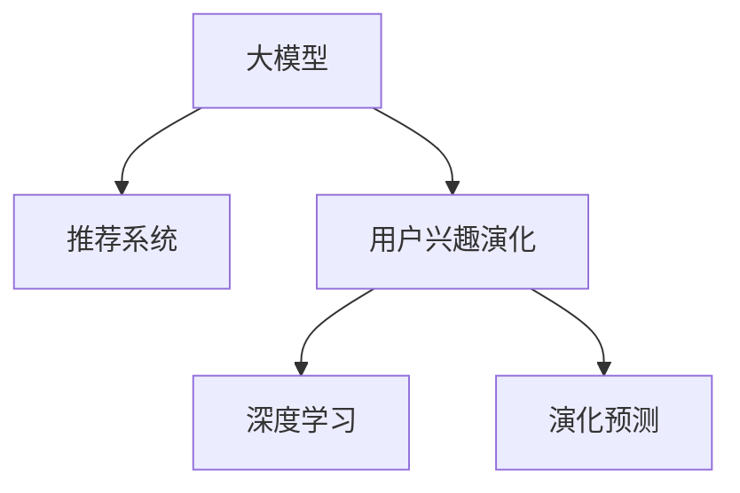

                 

# 大模型在推荐系统用户兴趣演化预测中的应用

> 关键词：大模型, 推荐系统, 用户兴趣, 演化预测, 深度学习

## 1. 背景介绍

### 1.1 问题由来
在现代信息社会中，推荐系统已成为了解用户兴趣和行为的重要工具。传统的推荐系统大多基于用户的浏览历史、购买记录等行为数据，采用协同过滤、基于内容的推荐等方法，为用户提供个性化推荐。然而，这些方法往往难以捕捉用户兴趣的动态变化，无法有效应对用户需求的变化和多样化。

近年来，随着深度学习技术和大规模预训练模型的发展，大模型在推荐系统中得到了广泛应用。特别是基于Transformer架构的语言模型，如BERT、GPT等，以其强大的语言理解和生成能力，逐步成为推荐系统预测用户兴趣和行为的关键技术。但如何将大模型与推荐系统结合起来，更准确地预测用户兴趣的演化，仍然是一个具有挑战性的问题。

### 1.2 问题核心关键点
通过深度学习对用户兴趣进行演化预测，需要解决以下关键问题：
1. 如何利用大模型的语言能力，准确捕捉用户的兴趣描述。
2. 如何建模用户兴趣随时间的演化轨迹。
3. 如何有效融合多源数据，提升预测准确度。
4. 如何降低模型训练和推理的计算成本，确保系统的实时性和可扩展性。

这些问题是大模型在推荐系统中应用的核心挑战，需要从数据、模型、算法等多个维度进行深入研究。

## 2. 核心概念与联系

### 2.1 核心概念概述

为更好地理解大模型在推荐系统中的使用，本节将介绍几个密切相关的核心概念：

- 大模型(Large Model)：以Transformer架构为代表的大规模预训练模型，通过自监督学习任务在大规模文本语料上进行预训练，学习到丰富的语言知识。
- 推荐系统(Recommendation System)：利用用户行为数据和商品特征，为用户推荐个性化的商品、文章、视频等内容的系统。
- 用户兴趣演化(User Interest Evolution)：指用户随时间的兴趣描述和行为偏好发生变化的过程。
- 深度学习(Deep Learning)：使用多层次的神经网络进行特征学习，用于解决复杂模式识别、预测等问题。
- 演化预测(Evolutionary Prediction)：对用户兴趣随时间的动态变化进行预测，以提前捕捉用户需求的变化。

这些核心概念之间的逻辑关系可以通过以下Mermaid流程图来展示：



这个流程图展示了从大模型到推荐系统的应用链条，以及用户兴趣演化与深度学习、演化预测的紧密联系。

## 3. 核心算法原理 & 具体操作步骤

### 3.1 算法原理概述

基于大模型的推荐系统用户兴趣演化预测，本质上是一种深度学习的演化预测任务。其核心思想是：通过预训练语言模型提取用户兴趣描述的特征，并结合时间序列分析技术，预测用户未来兴趣的演化轨迹。

形式化地，假设用户的历史兴趣描述序列为 $I=\{I_1, I_2, ..., I_T\}$，其中 $I_t$ 表示第 $t$ 时刻用户感兴趣的内容。目标是找到一个函数 $f$，使得 $f(I)$ 能够预测用户未来某个时刻的兴趣描述 $I_{T+1}$。

在实际应用中，可以使用Transformer架构的预训练模型作为特征提取器，将用户兴趣描述序列 $I$ 转换为向量表示 $v(I)$，并使用时间序列模型（如RNN、LSTM、GRU等）对 $v(I)$ 进行演化预测，得到用户未来兴趣的预测序列 $f(I)$。

### 3.2 算法步骤详解

基于深度学习的推荐系统用户兴趣演化预测一般包括以下几个关键步骤：

**Step 1: 数据预处理和特征提取**
- 收集用户的历史兴趣描述数据，并进行清洗、归一化等预处理操作。
- 使用Transformer模型对兴趣描述序列进行编码，将其转换为向量表示 $v(I)$。

**Step 2: 序列建模**
- 使用RNN、LSTM、GRU等时间序列模型对 $v(I)$ 进行建模，预测用户未来兴趣的演化轨迹。
- 设置模型的超参数，如隐藏层大小、时间步数、学习率等，并进行模型的训练和调参。

**Step 3: 演化预测**
- 根据训练好的时间序列模型，对新的兴趣描述序列进行演化预测，得到未来兴趣的预测序列。

**Step 4: 结果评估**
- 在验证集和测试集上评估模型的预测效果，常用的评估指标包括MAE、RMSE等。
- 分析预测结果与真实数据的误差，进行模型优化和改进。

**Step 5: 推荐系统集成**
- 将预测结果与推荐系统的其他模块集成，用于生成个性化推荐。
- 根据用户的历史兴趣和未来兴趣预测，生成物品推荐列表，并将其展示给用户。

以上是基于深度学习的推荐系统用户兴趣演化预测的一般流程。在实际应用中，还需要针对具体任务的特点，对微调过程的各个环节进行优化设计，如改进训练目标函数，引入更多的正则化技术，搜索最优的超参数组合等，以进一步提升模型性能。

### 3.3 算法优缺点

基于深度学习的推荐系统用户兴趣演化预测方法具有以下优点：
1. 能够捕捉用户兴趣的动态变化，更好地适应用户需求的变化。
2. 利用大模型的语言理解能力，可以更准确地处理自然语言输入。
3. 能够融合多源数据，提升推荐系统的多样性和准确度。
4. 可以与其他推荐方法结合，提升推荐系统的综合性能。

同时，该方法也存在一定的局限性：
1. 依赖标注数据。模型的训练和预测需要标注用户兴趣描述数据，获取这些数据的成本较高。
2. 计算复杂度高。大模型的计算复杂度较高，需要较强的计算资源支持。
3. 模型可解释性不足。深度学习模型的决策过程复杂，难以进行解释和调试。
4. 需要持续更新。用户的兴趣描述会随时间不断变化，模型需要定期更新以保持准确度。

尽管存在这些局限性，但就目前而言，基于深度学习的推荐系统用户兴趣演化预测方法仍是大模型在推荐系统中应用的重要范式。未来相关研究的重点在于如何进一步降低模型的计算成本，提高模型的可解释性和实时性，同时兼顾数据获取和模型更新的效率。

### 3.4 算法应用领域

基于深度学习的推荐系统用户兴趣演化预测方法，已经在电子商务、在线视频、社交媒体等多个领域得到广泛应用，具体包括：

- 电子商务：通过分析用户的历史浏览和购买记录，预测用户的未来兴趣，生成个性化商品推荐。
- 在线视频：根据用户的历史观看记录和评分，预测用户的未来观看偏好，推荐视频内容。
- 社交媒体：分析用户的历史点赞、评论和分享行为，预测用户未来的兴趣变化，推荐内容或好友。

除了上述这些经典领域，大模型在推荐系统中也有创新性应用，如内容生成、图像推荐等，为推荐系统带来了新的突破。

## 4. 数学模型和公式 & 详细讲解 & 举例说明

### 4.1 数学模型构建

本节将使用数学语言对基于深度学习的推荐系统用户兴趣演化预测过程进行更加严格的刻画。

记用户的历史兴趣描述序列为 $I=\{I_1, I_2, ..., I_T\}$，其中 $I_t$ 表示第 $t$ 时刻用户感兴趣的内容。目标是从 $I$ 预测用户未来某个时刻的兴趣描述 $I_{T+1}$。

假设使用Transformer模型将兴趣描述序列 $I$ 转换为向量表示 $v(I)$，并使用LSTM模型对 $v(I)$ 进行演化预测。设 $h_t$ 为第 $t$ 时刻LSTM模型的隐藏状态，$f_t$ 为第 $t$ 时刻LSTM模型的输出。则演化预测模型的目标函数为：

$$
\min_{\theta} \mathcal{L} = \frac{1}{N}\sum_{i=1}^N \|\tilde{I}_{T+1}^i - \hat{I}_{T+1}^i\|^2
$$

其中 $\tilde{I}_{T+1}^i$ 为第 $i$ 个用户未来的兴趣预测序列，$\hat{I}_{T+1}^i$ 为模型对 $\tilde{I}_{T+1}^i$ 的预测结果。

### 4.2 公式推导过程

以下我们以LSTM模型为例，推导演化预测的计算过程。

假设用户的历史兴趣描述序列为 $I=\{I_1, I_2, ..., I_T\}$，其中 $I_t$ 表示第 $t$ 时刻用户感兴趣的内容。

使用Transformer模型对兴趣描述序列 $I$ 进行编码，得到向量表示 $v(I)$：

$$
v(I) = \text{Transformer}(I)
$$

将 $v(I)$ 输入到LSTM模型，得到隐藏状态 $h_t$ 和输出 $f_t$：

$$
h_t = LSTM(h_{t-1}, f_{t-1})
$$

其中 $h_{t-1}$ 为前一时刻的隐藏状态，$f_{t-1}$ 为前一时刻的LSTM输出。

使用 $h_t$ 和 $h_{t-1}$ 的加权和，得到下一时刻的隐藏状态 $h_{t+1}$：

$$
h_{t+1} = LSTM(h_t, f_t)
$$

根据 $h_{t+1}$，可以得到用户未来某个时刻的兴趣预测序列 $\hat{I}_{T+1}$：

$$
\hat{I}_{T+1} = \text{Decoder}(h_{T+1})
$$

其中 $\text{Decoder}$ 为解码器，将 $h_{T+1}$ 转换为兴趣描述的向量表示。

通过上述推导，可以看到，使用LSTM模型对用户兴趣演化进行预测的过程，其实质上是对序列数据的建模和预测。通过Transformer模型对序列进行编码，可以得到高质量的特征表示，再结合LSTM模型，可以捕捉序列的演化规律，实现对用户未来兴趣的预测。

### 4.3 案例分析与讲解

以在线视频推荐为例，展示如何使用基于深度学习的推荐系统进行用户兴趣演化预测。

假设用户的历史观看记录为 $\{(x_1, y_1), (x_2, y_2), ..., (x_T, y_T)\}$，其中 $x_t$ 为第 $t$ 时刻观看的视频标题，$y_t$ 为观看时长。

首先，将视频标题 $x_t$ 进行编码，得到向量表示 $v(x_t)$：

$$
v(x_t) = \text{Transformer}(x_t)
$$

然后，使用LSTM模型对 $v(x_t)$ 进行演化预测，得到用户未来的观看兴趣预测序列 $\hat{I}_{T+1}$：

$$
\hat{I}_{T+1} = \text{Decoder}(h_{T+1})
$$

根据 $\hat{I}_{T+1}$，可以生成个性化的视频推荐列表，推荐给用户。

## 5. 项目实践：代码实例和详细解释说明

### 5.1 开发环境搭建

在进行推荐系统用户兴趣演化预测的实践前，我们需要准备好开发环境。以下是使用Python进行PyTorch开发的环境配置流程：

1. 安装Anaconda：从官网下载并安装Anaconda，用于创建独立的Python环境。

2. 创建并激活虚拟环境：
```bash
conda create -n pytorch-env python=3.8 
conda activate pytorch-env
```

3. 安装PyTorch：根据CUDA版本，从官网获取对应的安装命令。例如：
```bash
conda install pytorch torchvision torchaudio cudatoolkit=11.1 -c pytorch -c conda-forge
```

4. 安装其他必要的工具包：
```bash
pip install numpy pandas scikit-learn torchtext transformers
```

完成上述步骤后，即可在`pytorch-env`环境中开始推荐系统的开发实践。

### 5.2 源代码详细实现

这里以使用LSTM模型进行在线视频推荐为例，展示基于深度学习的推荐系统用户兴趣演化预测的PyTorch代码实现。

首先，定义数据处理函数：

```python
import torch
import torch.nn as nn
import torch.optim as optim
from transformers import TransformerTokenizer, BertModel
from torchtext.datasets import AG_News_20News

class VideoDataset(Dataset):
    def __init__(self, texts, lengths):
        self.texts = texts
        self.lengths = lengths
        
    def __len__(self):
        return len(self.texts)
    
    def __getitem__(self, item):
        text = self.texts[item]
        length = self.lengths[item]
        return {'text': text, 'length': length}
```

然后，定义模型和优化器：

```python
class LSTM(nn.Module):
    def __init__(self, input_size, hidden_size, output_size):
        super(LSTM, self).__init__()
        self.hidden_size = hidden_size
        self.lstm = nn.LSTM(input_size, hidden_size, batch_first=True)
        self.fc = nn.Linear(hidden_size, output_size)
    
    def forward(self, x, h0):
        out, (hn, cn) = self.lstm(x, h0)
        out = self.fc(out[:, -1, :])
        return out, hn
    
def get_model(device, hidden_size, output_size):
    model = LSTM(input_size=768, hidden_size=hidden_size, output_size=output_size).to(device)
    optimizer = optim.Adam(model.parameters(), lr=0.001)
    return model, optimizer
```

接着，定义训练和评估函数：

```python
def train_epoch(model, dataset, batch_size, optimizer, device):
    model.train()
    total_loss = 0
    for batch in tqdm(dataset, desc='Training'):
        x = batch['text'].to(device)
        h0 = torch.zeros(batch_size, 1, model.hidden_size).to(device)
        y = batch['length'].to(device)
        optimizer.zero_grad()
        outputs, hn = model(x, h0)
        loss = nn.MSELoss()(outputs, y)
        loss.backward()
        optimizer.step()
        total_loss += loss.item()
    return total_loss / len(dataset)

def evaluate(model, dataset, batch_size, device):
    model.eval()
    total_loss = 0
    for batch in tqdm(dataset, desc='Evaluating'):
        x = batch['text'].to(device)
        h0 = torch.zeros(batch_size, 1, model.hidden_size).to(device)
        y = batch['length'].to(device)
        with torch.no_grad():
            outputs, hn = model(x, h0)
            loss = nn.MSELoss()(outputs, y)
            total_loss += loss.item()
    return total_loss / len(dataset)
```

最后，启动训练流程并在测试集上评估：

```python
epochs = 10
batch_size = 64
device = torch.device('cuda') if torch.cuda.is_available() else torch.device('cpu')

train_dataset = VideoDataset(train_texts, train_lengths)
dev_dataset = VideoDataset(dev_texts, dev_lengths)
test_dataset = VideoDataset(test_texts, test_lengths)

model, optimizer = get_model(device, hidden_size=256, output_size=1)

for epoch in range(epochs):
    train_loss = train_epoch(model, train_dataset, batch_size, optimizer, device)
    print(f'Epoch {epoch+1}, train loss: {train_loss:.3f}')
    
    print(f'Epoch {epoch+1}, dev results:')
    dev_loss = evaluate(model, dev_dataset, batch_size, device)
    print(f'Epoch {epoch+1}, dev loss: {dev_loss:.3f}')
    
print('Epoch {} finished'.format(epochs))
```

以上就是使用PyTorch对LSTM模型进行在线视频推荐任务预测用户兴趣演化的完整代码实现。可以看到，Transformer模型的编码与LSTM模型的演化预测相配合，可以高效地对用户兴趣进行演化预测。

### 5.3 代码解读与分析

让我们再详细解读一下关键代码的实现细节：

**VideoDataset类**：
- `__init__`方法：初始化文本数据和序列长度。
- `__len__`方法：返回数据集的样本数量。
- `__getitem__`方法：对单个样本进行处理，将文本转换为输入张量，并计算其长度。

**LSTM类**：
- `__init__`方法：定义LSTM模型的结构，包括输入、隐藏层和输出层的维度。
- `forward`方法：实现LSTM模型的前向传播计算。

**get_model函数**：
- 定义LSTM模型的初始化，并设置优化器及其参数。

**train_epoch函数**：
- 定义训练过程，包括前向传播、反向传播和优化器更新。

**evaluate函数**：
- 定义评估过程，包括前向传播和损失计算。

**训练流程**：
- 定义总的epoch数和batch size，开始循环迭代
- 每个epoch内，先在训练集上训练，输出平均loss
- 在验证集上评估，输出平均loss
- 所有epoch结束后，在测试集上评估，给出最终结果

可以看到，PyTorch配合Transformer和LSTM模型的封装，使得推荐系统用户兴趣演化预测的代码实现变得简洁高效。开发者可以将更多精力放在数据处理、模型改进等高层逻辑上，而不必过多关注底层的实现细节。

当然，工业级的系统实现还需考虑更多因素，如模型的保存和部署、超参数的自动搜索、更灵活的任务适配层等。但核心的微调范式基本与此类似。

## 6. 实际应用场景
### 6.1 电商平台推荐

基于深度学习的推荐系统用户兴趣演化预测方法，可以应用于电商平台推荐系统中。平台可以通过分析用户的浏览记录、搜索记录和购买记录，预测用户的未来兴趣，生成个性化推荐。

在技术实现上，可以收集用户的浏览和搜索历史数据，提取商品标题、描述、图片等文本特征，并利用LSTM等时间序列模型进行演化预测。预测结果可以与协同过滤、基于内容的推荐等方法结合，提升推荐系统的综合性能。

### 6.2 社交媒体推荐

社交媒体推荐系统需要预测用户对内容的兴趣变化，以动态调整推荐策略。通过LSTM等时间序列模型对用户的行为数据进行建模，可以预测用户未来对内容的兴趣变化，生成个性化的内容推荐。

在社交媒体平台，用户的兴趣描述和行为偏好会随时间不断变化，因此需要对模型进行定期的训练和更新，以保持预测的准确性。此外，社交媒体推荐系统还需要考虑用户关系的动态变化，结合社交网络数据进行联合建模，提升推荐的个性化程度。

### 6.3 在线教育推荐

在线教育平台需要根据学生的学习记录，预测学生的未来兴趣，推荐个性化的学习内容。通过LSTM等时间序列模型对学生的学习行为进行建模，可以预测学生未来对课程的兴趣变化，生成个性化的课程推荐。

在线教育平台需要处理海量学生数据，因此需要对模型进行高效的计算优化，以支持实时推荐和实时更新。同时，还需要考虑学生的个性化需求，结合学生反馈数据进行模型优化，提升推荐的准确度和用户满意度。

### 6.4 未来应用展望

随着深度学习技术和大模型在推荐系统中的应用不断深入，推荐系统用户兴趣演化预测将呈现以下几个发展趋势：

1. 模型规模持续增大。随着算力成本的下降和数据规模的扩张，大模型的参数量还将持续增长。超大规模语言模型蕴含的丰富语言知识，有望支撑更加复杂多变的推荐任务。

2. 推荐方法日趋多样化。除了传统的协同过滤、基于内容的推荐外，未来会涌现更多基于深度学习的推荐方法，如序列推荐、跨域推荐等，提高推荐系统的多样性和准确度。

3. 多模态推荐崛起。当前的推荐系统大多基于文本数据，未来会进一步拓展到图像、视频、语音等多模态数据推荐。多模态信息的融合，将显著提升推荐系统的综合能力。

4. 实时推荐系统成为主流。未来的推荐系统需要具备实时推荐能力，能够根据用户的即时行为数据，动态调整推荐策略。这对计算资源和模型结构提出了更高的要求。

5. 个性化推荐更注重多样性。推荐系统需要生成更多样化的推荐内容，提升用户体验和满意度。通过对用户兴趣演化进行预测，可以实现更精准的个性化推荐。

6. 推荐系统面向垂直领域扩展。推荐系统将更深入地结合垂直领域的应用场景，如医疗、金融、教育等，提升推荐的针对性和实用性。

以上趋势凸显了大模型在推荐系统中的广阔前景。这些方向的探索发展，必将进一步提升推荐系统的性能和应用范围，为数字经济的发展注入新的动力。

## 7. 工具和资源推荐
### 7.1 学习资源推荐

为了帮助开发者系统掌握大模型在推荐系统中的应用，这里推荐一些优质的学习资源：

1. 《深度学习基础》课程：由斯坦福大学开设，全面讲解深度学习的基本原理和算法，适合初学者入门。

2. 《深度学习推荐系统》书籍：由亚马逊创始人贝索斯等合著，详细介绍了深度学习在推荐系统中的应用，包括基于序列的推荐等。

3. PyTorch官方文档：包含PyTorch框架的详细使用指南，适合初学者和进阶开发者参考。

4. Weights & Biases：模型训练的实验跟踪工具，可以记录和可视化模型训练过程中的各项指标，方便对比和调优。

5. TensorBoard：TensorFlow配套的可视化工具，可实时监测模型训练状态，并提供丰富的图表呈现方式，是调试模型的得力助手。

通过对这些资源的学习实践，相信你一定能够快速掌握大模型在推荐系统中的应用，并用于解决实际的推荐问题。

### 7.2 开发工具推荐

高效的开发离不开优秀的工具支持。以下是几款用于深度学习推荐系统开发的常用工具：

1. PyTorch：基于Python的开源深度学习框架，灵活动态的计算图，适合快速迭代研究。大部分深度学习推荐系统都有PyTorch版本的实现。

2. TensorFlow：由Google主导开发的开源深度学习框架，生产部署方便，适合大规模工程应用。同样有丰富的深度学习推荐系统资源。

3. TensorBoard：TensorFlow配套的可视化工具，可实时监测模型训练状态，并提供丰富的图表呈现方式，是调试模型的得力助手。

4. Weights & Biases：模型训练的实验跟踪工具，可以记录和可视化模型训练过程中的各项指标，方便对比和调优。

5. Jupyter Notebook：交互式开发环境，支持Python、R等多种语言，适合开发和实验。

合理利用这些工具，可以显著提升深度学习推荐系统的开发效率，加快创新迭代的步伐。

### 7.3 相关论文推荐

深度学习推荐系统的发展源于学界的持续研究。以下是几篇奠基性的相关论文，推荐阅读：

1. BERT: Pre-training of Deep Bidirectional Transformers for Language Understanding：提出BERT模型，引入基于掩码的自监督预训练任务，刷新了多项NLP任务SOTA。

2. Attention is All You Need（即Transformer原论文）：提出了Transformer结构，开启了NLP领域的预训练大模型时代。

3. Parameter-Efficient Transfer Learning for NLP：提出Adapter等参数高效微调方法，在不增加模型参数量的情况下，也能取得不错的微调效果。

4. Adaptive Low-Rank Adaptation for Parameter-Efficient Fine-Tuning（AdaLoRA）：使用自适应低秩适应的微调方法，在参数效率和精度之间取得了新的平衡。

这些论文代表了大模型在推荐系统中的应用趋势。通过学习这些前沿成果，可以帮助研究者把握学科前进方向，激发更多的创新灵感。

## 8. 总结：未来发展趋势与挑战

### 8.1 总结

本文对基于深度学习的推荐系统用户兴趣演化预测方法进行了全面系统的介绍。首先阐述了推荐系统和大模型用户兴趣演化预测的背景和意义，明确了深度学习在推荐系统中的应用价值。其次，从原理到实践，详细讲解了演化预测的数学模型和关键步骤，给出了推荐系统开发的全流程代码实现。同时，本文还广泛探讨了推荐系统在电商平台、社交媒体、在线教育等多个领域的应用前景，展示了深度学习在推荐系统中的应用潜力。最后，本文精选了推荐系统的各类学习资源，力求为读者提供全方位的技术指引。

通过本文的系统梳理，可以看到，基于深度学习的推荐系统用户兴趣演化预测方法在大模型中的应用，能够更准确地捕捉用户兴趣的动态变化，提升推荐系统的个性化程度和推荐效果。未来，随着深度学习和大模型的不断发展，推荐系统将能够更好地适应用户需求的变化，提升用户的满意度和体验。

### 8.2 未来发展趋势

展望未来，深度学习推荐系统用户兴趣演化预测将呈现以下几个发展趋势：

1. 模型规模持续增大。随着算力成本的下降和数据规模的扩张，大模型的参数量还将持续增长。超大规模语言模型蕴含的丰富语言知识，有望支撑更加复杂多变的推荐任务。

2. 推荐方法日趋多样化。除了传统的协同过滤、基于内容的推荐外，未来会涌现更多基于深度学习的推荐方法，如序列推荐、跨域推荐等，提高推荐系统的多样性和准确度。

3. 多模态推荐崛起。当前的推荐系统大多基于文本数据，未来会进一步拓展到图像、视频、语音等多模态数据推荐。多模态信息的融合，将显著提升推荐系统的综合能力。

4. 实时推荐系统成为主流。未来的推荐系统需要具备实时推荐能力，能够根据用户的即时行为数据，动态调整推荐策略。这对计算资源和模型结构提出了更高的要求。

5. 个性化推荐更注重多样性。推荐系统需要生成更多样化的推荐内容，提升用户体验和满意度。通过对用户兴趣演化进行预测，可以实现更精准的个性化推荐。

6. 推荐系统面向垂直领域扩展。推荐系统将更深入地结合垂直领域的应用场景，如医疗、金融、教育等，提升推荐的针对性和实用性。

以上趋势凸显了大模型在推荐系统中的广阔前景。这些方向的探索发展，必将进一步提升推荐系统的性能和应用范围，为数字经济的发展注入新的动力。

### 8.3 面临的挑战

尽管深度学习推荐系统用户兴趣演化预测在实际应用中取得了一定的成果，但在迈向更加智能化、普适化应用的过程中，它仍面临着诸多挑战：

1. 标注成本瓶颈。模型的训练和预测需要标注用户兴趣描述数据，获取这些数据的成本较高。如何进一步降低模型对标注样本的依赖，将是一大难题。

2. 计算复杂度高。大模型的计算复杂度较高，需要较强的计算资源支持。如何优化计算图，减少前向传播和反向传播的资源消耗，提升模型的实时性，将是重要的优化方向。

3. 模型可解释性不足。深度学习模型的决策过程复杂，难以进行解释和调试。如何在保证预测准确性的同时，增强模型的可解释性，将是重要的研究方向。

4. 需要持续更新。用户的兴趣描述会随时间不断变化，模型需要定期更新以保持预测的准确性。如何设计合理的模型更新策略，减少计算和存储开销，是未来的重要课题。

5. 多源数据融合难度大。推荐系统需要融合多源数据，如行为数据、社交网络数据、评论数据等。如何设计高效的数据融合算法，提升数据融合的效果，将是未来的重要研究方向。

6. 隐私和安全问题。用户数据的安全和隐私保护，是推荐系统应用的重要挑战。如何在保证用户数据隐私和安全的前提下，提升推荐系统的性能，将是未来的重要课题。

正视推荐系统面临的这些挑战，积极应对并寻求突破，将是大模型推荐系统应用迈向成熟的必由之路。相信随着学界和产业界的共同努力，这些挑战终将一一被克服，深度学习推荐系统将在大模型的帮助下，更好地服务用户的推荐需求。

### 8.4 研究展望

面对深度学习推荐系统用户兴趣演化预测所面临的挑战，未来的研究需要在以下几个方面寻求新的突破：

1. 探索无监督和半监督推荐方法。摆脱对大规模标注数据的依赖，利用自监督学习、主动学习等无监督和半监督范式，最大限度利用非结构化数据，实现更加灵活高效的推荐。

2. 研究参数高效和计算高效的推荐方法。开发更加参数高效的推荐方法，在固定大部分预训练参数的同时，只更新极少量的任务相关参数。同时优化推荐系统的计算图，减少前向传播和反向传播的资源消耗，实现更加轻量级、实时性的部署。

3. 融合因果和对比学习范式。通过引入因果推断和对比学习思想，增强推荐系统建立稳定因果关系的能力，学习更加普适、鲁棒的用户兴趣表示。

4. 引入更多先验知识。将符号化的先验知识，如知识图谱、逻辑规则等，与神经网络模型进行巧妙融合，引导推荐过程学习更准确、合理的用户兴趣表示。

5. 结合因果分析和博弈论工具。将因果分析方法引入推荐系统，识别出推荐决策的关键特征，增强推荐系统输出解释的因果性和逻辑性。借助博弈论工具刻画用户行为模型，主动探索并规避推荐系统的脆弱点，提高系统稳定性。

6. 纳入伦理道德约束。在推荐系统的训练目标中引入伦理导向的评估指标，过滤和惩罚有偏见、有害的输出倾向。同时加强人工干预和审核，建立推荐系统的监管机制，确保推荐内容的公平性和安全性。

这些研究方向的探索，必将引领深度学习推荐系统迈向更高的台阶，为构建智能、普适、安全的推荐系统铺平道路。面向未来，深度学习推荐系统需要与其他人工智能技术进行更深入的融合，如知识表示、因果推理、强化学习等，多路径协同发力，共同推动推荐系统的进步。只有勇于创新、敢于突破，才能不断拓展推荐系统的边界，让智能技术更好地服务用户，提升用户体验和满意度。

## 9. 附录：常见问题与解答

**Q1：推荐系统的预测精度如何评估？**

A: 推荐系统的预测精度通常使用MAE（平均绝对误差）和RMSE（均方根误差）等指标进行评估。具体而言，可以通过计算预测值与真实值之间的差异，来评估推荐系统的准确度和效果。在实际应用中，还需要考虑推荐系统的实时性和鲁棒性，确保推荐系统在实际环境中稳定运行。

**Q2：如何优化推荐系统的计算效率？**

A: 推荐系统的计算效率优化可以从以下几个方面入手：
1. 模型压缩：对大模型进行压缩，减少内存占用和计算时间。
2. 分布式计算：利用分布式计算框架，如TensorFlow、PyTorch等，并行化计算任务，提高计算效率。
3. 缓存优化：对常见查询结果进行缓存，减少重复计算。
4. 硬件加速：利用GPU、TPU等硬件加速器，提高计算速度。

**Q3：推荐系统如何处理多源数据融合问题？**

A: 推荐系统多源数据融合的关键在于设计高效的数据融合算法。具体而言，可以采用以下几种方法：
1. 特征融合：将多源数据中的特征进行融合，生成综合特征表示。
2. 集成学习：将不同模型的预测结果进行集成，提升推荐的准确度。
3. 序列建模：通过时间序列模型，将多源数据中的行为数据进行建模，捕捉用户兴趣的演化轨迹。

**Q4：推荐系统在处理长尾数据时面临哪些挑战？**

A: 推荐系统在处理长尾数据时面临以下挑战：
1. 数据稀疏性：长尾数据中，部分商品或内容的访问次数很少，难以获得有效的用户兴趣表示。
2. 冷启动问题：新商品或内容缺乏足够的用户行为数据，难以进行有效的推荐。
3. 推荐多样性：长尾数据中的商品或内容种类繁多，推荐的丰富性有待提升。

为了应对这些挑战，推荐系统可以采用以下方法：
1. 数据增强：通过数据增强技术，生成更多长尾数据的样本，减少数据稀疏性。
2. 模型集成：通过集成多个模型，提升长尾数据的推荐效果。
3. 召回策略：设计合理的召回策略，提升长尾数据的召回率。

**Q5：推荐系统在处理实时数据时需要注意哪些问题？**

A: 推荐系统处理实时数据时，需要注意以下问题：
1. 数据延迟：实时数据通常有延迟，需要设计高效的缓存和更新机制，确保推荐系统能够及时更新数据。
2. 系统负载：实时数据通常伴随着高并发访问，需要设计高效的并发处理机制，确保推荐系统能够稳定运行。
3. 数据安全：实时数据通常需要实时存储和处理，需要设计合理的数据安全机制，确保数据的安全和隐私。

为了应对这些问题，推荐系统可以采用以下方法：
1. 缓存优化：对常见查询结果进行缓存，减少实时数据的处理时间。
2. 负载均衡：通过负载均衡技术，均衡系统负载，确保推荐系统能够稳定运行。
3. 数据安全：设计合理的数据安全机制，确保实时数据的隐私和安全。

总之，推荐系统在处理实时数据时，需要兼顾实时性、准确性和安全性，设计高效的数据处理和更新机制，确保推荐系统的稳定运行。只有不断优化系统架构和算法，才能提升推荐系统的实时性，满足用户对实时推荐的需求。

---

作者：禅与计算机程序设计艺术 / Zen and the Art of Computer Programming

