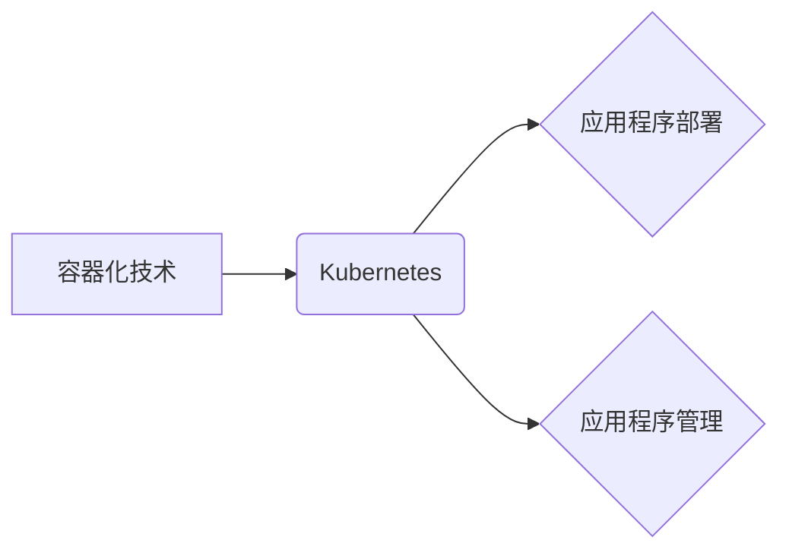

                 

## 容器化和 Kubernetes：管理应用程序部署

> 关键词：容器化、Kubernetes、Docker、容器编排、微服务、云原生、应用程序部署、自动化、弹性伸缩

## 1. 背景介绍

随着软件开发模式的演变，应用程序的规模和复杂度不断增加。传统的应用程序部署方式已经难以满足现代软件开发的需求。容器化技术应运而生，为应用程序的打包、部署和管理提供了一种全新的解决方案。

容器化技术将应用程序及其所有依赖项（库、框架、配置等）打包成一个独立的单元，称为容器。容器可以像软件包一样被共享和部署，无论是在开发环境、测试环境还是生产环境中。

Kubernetes 作为一种开源的容器编排平台，为容器化技术提供了强大的管理和调度能力。它可以自动部署、更新、扩展和管理容器化应用程序，提高应用程序的可用性、可靠性和弹性。

## 2. 核心概念与联系

### 2.1 容器化

容器化技术将应用程序及其依赖项打包成一个独立的单元，称为容器。容器可以像软件包一样被共享和部署，无论是在开发环境、测试环境还是生产环境中。

**容器化技术的主要优势：**

* **隔离性:** 每个容器都是独立的，不会相互影响。
* **可移植性:** 容器可以跨平台运行，不受操作系统和硬件环境的限制。
* **资源利用率:** 容器共享主机操作系统内核，可以有效利用资源。
* **部署简化:** 容器化应用程序可以快速、轻松地部署到任何环境中。

### 2.2 Kubernetes

Kubernetes 是一种开源的容器编排平台，用于自动化部署、更新、扩展和管理容器化应用程序。

**Kubernetes 的主要功能：**

* **容器部署:** Kubernetes 可以自动部署容器化应用程序到集群中。
* **容器调度:** Kubernetes 可以根据应用程序的需求，将容器分配到不同的节点上。
* **服务发现和负载均衡:** Kubernetes 可以帮助应用程序之间发现服务，并实现负载均衡。
* **自动伸缩:** Kubernetes 可以根据应用程序的负载情况，自动调整容器的数量。
* **健康检查:** Kubernetes 可以定期检查容器的健康状态，并自动重启不健康的容器。

**容器化与 Kubernetes 的关系:**

容器化技术为 Kubernetes 提供了基础，Kubernetes 则为容器化技术提供了强大的管理和调度能力。



## 3. 核心算法原理 & 具体操作步骤

### 3.1 算法原理概述

Kubernetes 的核心算法原理包括：

* **Master-Worker 架构:** Kubernetes 集群由 Master 节点和 Worker 节点组成。Master 节点负责管理整个集群，包括调度容器、维护状态等。Worker 节点负责运行容器。
* **Pod:** Pod 是 Kubernetes 最小的可调度单元，包含一个或多个容器。
* **Service:** Service 是一个抽象的网络入口，用于暴露 Pod 的服务。
* **Deployment:** Deployment 是用于管理 Pod 的对象，可以定义 Pod 的数量、更新策略等。

### 3.2 算法步骤详解

Kubernetes 的核心算法步骤包括：

1. **应用程序打包成容器:** 应用程序及其依赖项打包成一个或多个容器。
2. **创建 Kubernetes 资源:** 创建 Pod、Service、Deployment 等 Kubernetes 资源，定义应用程序的部署和管理策略。
3. **部署应用程序到集群:** Kubernetes Master 节点接收资源定义，并调度容器到 Worker 节点上运行。
4. **服务发现和负载均衡:** Kubernetes 提供服务发现和负载均衡机制，使应用程序之间可以相互发现和通信。
5. **自动伸缩:** Kubernetes 可以根据应用程序的负载情况，自动调整容器的数量。
6. **健康检查:** Kubernetes 可以定期检查容器的健康状态，并自动重启不健康的容器。

### 3.3 算法优缺点

**优点:**

* **自动化:** Kubernetes 自动化了应用程序的部署、更新、扩展和管理。
* **弹性伸缩:** Kubernetes 可以根据应用程序的负载情况，自动调整容器的数量。
* **高可用性:** Kubernetes 可以确保应用程序的高可用性，即使部分节点发生故障。
* **跨平台:** Kubernetes 可以运行在多种平台上，包括 Linux、Windows 和云平台。

**缺点:**

* **复杂性:** Kubernetes 的架构和功能比较复杂，需要一定的学习成本。
* **资源消耗:** Kubernetes 集群需要一定的资源，包括 CPU、内存和存储。
* **安全风险:** Kubernetes 集群需要进行安全配置，以防止攻击和数据泄露。

### 3.4 算法应用领域

Kubernetes 的应用领域非常广泛，包括：

* **Web 应用程序:** 部署和管理 Web 应用程序，例如电商平台、社交媒体平台等。
* **微服务架构:** 部署和管理微服务架构的应用程序，例如支付系统、推荐系统等。
* **数据处理:** 部署和管理数据处理应用程序，例如数据分析、机器学习等。
* **云原生应用:** 部署和管理云原生应用程序，例如 Serverless 应用、容器化应用等。

## 4. 数学模型和公式 & 详细讲解 & 举例说明

### 4.1 数学模型构建

Kubernetes 的核心算法可以抽象为一个状态机模型，其中每个状态代表应用程序的部署状态，例如：

* **Pending:** 应用程序正在等待部署。
* **Running:** 应用程序正在运行。
* **Failed:** 应用程序部署失败。

状态机模型可以描述应用程序的部署流程，以及状态之间的转换规则。

### 4.2 公式推导过程

Kubernetes 的自动伸缩算法可以基于以下公式推导：

$$
\text{DesiredReplicas} = \text{CurrentReplicas} + \frac{\text{CPUUtilization} - \text{TargetCPUUtilization}}{\text{CPUUtilizationThreshold}}
$$

其中：

* **DesiredReplicas:** 目标副本数
* **CurrentReplicas:** 当前副本数
* **CPUUtilization:** 当前 CPU 使用率
* **TargetCPUUtilization:** 目标 CPU 使用率
* **CPUUtilizationThreshold:** CPU 使用率阈值

该公式表示，当 CPU 使用率超过目标 CPU 使用率时，Kubernetes 会增加应用程序的副本数。

### 4.3 案例分析与讲解

假设一个应用程序的目标 CPU 使用率为 70%，CPU 使用率阈值为 10%。当应用程序的 CPU 使用率达到 80% 时，Kubernetes 会根据公式计算出目标副本数为当前副本数 + 1。

## 5. 项目实践：代码实例和详细解释说明

### 5.1 开发环境搭建

为了演示 Kubernetes 的使用，我们可以使用 Minikube 工具搭建一个本地 Kubernetes 集群。Minikube 是一个用于在本地计算机上运行单节点 Kubernetes 集群的工具。

### 5.2 源代码详细实现

我们可以使用 Docker 构建一个简单的应用程序镜像，然后使用 Kubernetes 部署该镜像到集群中。

```yaml
apiVersion: apps/v1
kind: Deployment
metadata:
  name: my-app
spec:
  replicas: 3
  selector:
    matchLabels:
      app: my-app
  template:
    metadata:
      labels:
        app: my-app
    spec:
      containers:
      - name: my-app
        image: my-app:latest
```

### 5.3 代码解读与分析

该代码定义了一个名为 `my-app` 的 Deployment 对象，该对象指定了应用程序的部署策略。

* `replicas: 3` 指定了应用程序的副本数为 3。
* `selector: matchLabels: app: my-app` 指定了应用程序的标签，用于标识应用程序的 Pod。
* `template:` 定义了 Pod 的模板，包括容器的名称、镜像名称等。

### 5.4 运行结果展示

使用 `kubectl apply -f deployment.yaml` 命令部署应用程序到集群中。

## 6. 实际应用场景

### 6.1 电商平台

电商平台可以利用 Kubernetes 部署和管理其各种微服务，例如商品展示服务、购物车服务、订单服务等。Kubernetes 可以帮助电商平台实现高可用性、弹性伸缩和快速部署。

### 6.2 社交媒体平台

社交媒体平台可以利用 Kubernetes 部署和管理其各种微服务，例如用户服务、消息服务、内容推荐服务等。Kubernetes 可以帮助社交媒体平台实现高并发、低延迟和快速响应。

### 6.3 数据处理平台

数据处理平台可以利用 Kubernetes 部署和管理其各种数据处理应用程序，例如数据分析、机器学习等。Kubernetes 可以帮助数据处理平台实现高效的资源利用和自动伸缩。

### 6.4 未来应用展望

随着云计算和容器技术的不断发展，Kubernetes 的应用场景将会更加广泛。未来，Kubernetes 将在以下领域发挥越来越重要的作用：

* **Serverless 应用:** Kubernetes 可以帮助部署和管理 Serverless 应用，实现更灵活的资源利用和成本控制。
* **边缘计算:** Kubernetes 可以扩展到边缘计算环境，帮助部署和管理边缘计算应用程序。
* **混合云:** Kubernetes 可以帮助管理混合云环境，实现不同云平台之间的资源共享和互操作性。

## 7. 工具和资源推荐

### 7.1 学习资源推荐

* **Kubernetes 官方文档:** https://kubernetes.io/docs/home/
* **Kubernetes 中文社区:** https://kubernetes.io/zh/
* **Kubernetes 入门教程:** https://kubernetes.io/docs/tutorials/

### 7.2 开发工具推荐

* **Minikube:** https://minikube.sigs.k8s.io/
* **kubectl:** https://kubernetes.io/docs/reference/kubectl/
* **Docker:** https://www.docker.com/

### 7.3 相关论文推荐

* **Kubernetes: Container Orchestration at Scale:** https://arxiv.org/abs/1408.5833
* **Kubernetes: A Platform for Distributed Applications:** https://www.usenix.org/system/files/conference/osdi16/osdi16-paper-keller.pdf

## 8. 总结：未来发展趋势与挑战

### 8.1 研究成果总结

Kubernetes 作为一种开源的容器编排平台，已经取得了巨大的成功。它为应用程序的部署、管理和扩展提供了强大的工具和机制，帮助企业构建更可靠、更弹性的应用程序。

### 8.2 未来发展趋势

Kubernetes 的未来发展趋势包括：

* **更强大的自动化:** Kubernetes 将更加自动化，例如自动配置、自动部署、自动故障恢复等。
* **更完善的安全性:** Kubernetes 将更加注重安全性，例如身份验证、授权、网络隔离等。
* **更广泛的应用场景:** Kubernetes 将应用于更多领域，例如边缘计算、Serverless 应用等。

### 8.3 面临的挑战

Kubernetes 仍然面临一些挑战，例如：

* **复杂性:** Kubernetes 的架构和功能比较复杂，需要一定的学习成本。
* **安全风险:** Kubernetes 集群需要进行安全配置，以防止攻击和数据泄露。
* **生态系统发展:** Kubernetes 的生态系统还在不断发展，一些工具和资源仍然不够完善。

### 8.4 研究展望

未来，Kubernetes 的研究方向包括：

* **简化 Kubernetes 的使用:** 开发更易于使用的 Kubernetes 工具和平台。
* **提高 Kubernetes 的安全性:** 研究和开发更完善的 Kubernetes 安全机制。
* **扩展 Kubernetes 的应用场景:** 将 Kubernetes 应用于更多领域，例如边缘计算、Serverless 应用等。

## 9. 附录：常见问题与解答

### 9.1 什么是 Pod?

Pod 是 Kubernetes 最小的可调度单元，包含一个或多个容器。

### 9.2 什么是 Deployment?

Deployment 是用于管理 Pod 的对象，可以定义 Pod 的数量、更新策略等。

### 9.3 如何部署应用程序到 Kubernetes 集群中?

可以使用 `kubectl apply -f deployment.yaml` 命令部署应用程序到集群中。


作者：禅与计算机程序设计艺术 / Zen and the Art of Computer Programming 
<end_of_turn>

