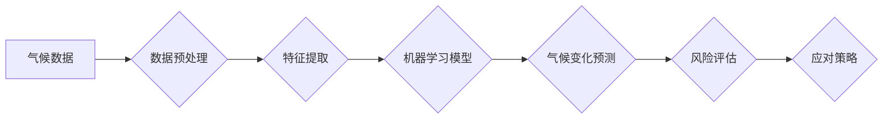

                 

## 2050年的全球变暖：从适应到缓解的气候治理

> 关键词：气候变化、人工智能、机器学习、预测模型、可持续发展、气候治理、碳减排、气候适应

### 1. 背景介绍

2050年，全球变暖已成为不可忽视的现实。海平面上升、极端天气事件频发、生态系统失衡，这些问题深刻地威胁着人类社会和地球的未来。面对这一严峻挑战，全球各国必须采取更加积极、有效的措施，从适应到缓解，实现可持续发展。

人工智能（AI）作为一项前沿技术，在应对气候变化方面展现出巨大的潜力。其强大的数据处理能力、模式识别能力和预测能力，为我们提供了全新的视角和工具，可以帮助我们更好地理解气候变化的复杂机制，预测未来气候趋势，制定更精准的应对策略。

### 2. 核心概念与联系

**2.1 气候变化与人工智能**

气候变化是指全球气候系统长期变化的趋势，主要表现为全球平均气温升高、极端天气事件增加等现象。人工智能可以帮助我们：

* **收集和分析气候数据：** 从卫星遥感、地面观测、气象模型等多种数据源收集大量气候数据，并利用机器学习算法进行分析，识别气候变化的趋势和模式。
* **预测未来气候变化：** 基于历史气候数据和物理模型，利用人工智能算法构建气候预测模型，预测未来气候变化的趋势和影响。
* **评估气候变化的影响：** 利用人工智能模拟不同气候情景下的社会经济影响，评估气候变化对人类社会和生态系统的潜在风险。

**2.2 核心概念架构**



**2.3 关键技术**

* **机器学习：** 用于识别气候数据中的模式和趋势，构建气候预测模型。
* **深度学习：** 用于处理复杂的气候数据，提高预测精度。
* **自然语言处理：** 用于分析气候相关文本数据，提取关键信息。
* **云计算：** 提供强大的计算资源，支持大规模气候数据处理和模型训练。

### 3. 核心算法原理 & 具体操作步骤

**3.1 算法原理概述**

气候变化预测模型通常基于物理模型和统计模型相结合的框架。物理模型模拟地球气候系统中的物理过程，例如大气环流、海洋热力学、冰川融化等。统计模型利用历史气候数据和机器学习算法，识别气候变化的趋势和模式。

**3.2 算法步骤详解**

1. **数据收集和预处理：** 从各种数据源收集气候数据，包括气温、降水、海平面、冰川厚度等，并进行清洗、格式转换、缺失值处理等预处理工作。
2. **特征提取：** 从预处理后的气候数据中提取关键特征，例如时间序列、空间分布、气候指数等，这些特征可以反映气候变化的本质特征。
3. **模型构建：** 选择合适的机器学习算法，例如回归模型、分类模型、时间序列模型等，构建气候变化预测模型。
4. **模型训练和评估：** 利用历史气候数据训练模型，并使用测试数据评估模型的预测精度。
5. **预测未来气候变化：** 将训练好的模型应用于未来气候情景下，预测未来气候变化的趋势和影响。

**3.3 算法优缺点**

* **优点：**
    * 能够处理大规模气候数据，识别复杂的气候模式。
    * 预测精度不断提高，可以提供更精准的未来气候趋势预测。
    * 可以模拟不同气候情景下的社会经济影响，评估气候变化的风险。
* **缺点：**
    * 依赖于历史气候数据，对未来气候变化的预测存在不确定性。
    * 模型的复杂性可能导致解释性降低，难以理解模型的预测结果。
    * 需要大量的计算资源和专业知识进行模型训练和评估。

**3.4 算法应用领域**

* **气候变化研究：** 了解气候变化的趋势和模式，预测未来气候变化的影响。
* **灾害预警：** 预警极端天气事件，例如洪水、干旱、热浪等，减少灾害损失。
* **农业生产：** 预测未来气候变化对农业生产的影响，帮助农民制定合理的种植计划。
* **城市规划：** 评估气候变化对城市的影响，制定适应气候变化的城市规划方案。

### 4. 数学模型和公式 & 详细讲解 & 举例说明

**4.1 数学模型构建**

气候变化预测模型通常基于物理模型和统计模型相结合的框架。物理模型模拟地球气候系统中的物理过程，例如大气环流、海洋热力学、冰川融化等。统计模型利用历史气候数据和机器学习算法，识别气候变化的趋势和模式。

**4.2 公式推导过程**

物理模型的公式推导过程通常比较复杂，涉及到气象学、海洋学、地球物理学等多个学科的知识。例如，大气环流模型的公式推导需要考虑大气压、温度、湿度、风速等多个变量之间的相互作用。

**4.3 案例分析与讲解**

一个常见的例子是气温预测模型。该模型可以利用历史气温数据、地理位置、季节变化等因素，构建一个回归模型来预测未来气温。

$$T_{future} = a + b * X_1 + c * X_2 + ... + d * X_n$$

其中：

* $T_{future}$ 是未来气温的预测值。
* $a$ 是模型的截距项。
* $b, c, ..., d$ 是模型的系数，代表不同变量对气温的影响程度。
* $X_1, X_2, ..., X_n$ 是历史气温数据、地理位置、季节变化等因素的数值表示。

通过训练模型，可以确定每个系数的值，从而构建一个能够预测未来气温的模型。

### 5. 项目实践：代码实例和详细解释说明

**5.1 开发环境搭建**

* 操作系统：Linux/macOS/Windows
* Python 版本：3.7+
* 必要的库：NumPy、Pandas、Scikit-learn、TensorFlow/PyTorch

**5.2 源代码详细实现**

```python
import numpy as np
from sklearn.linear_model import LinearRegression

# 加载气候数据
data = pd.read_csv('climate_data.csv')

# 选择特征变量和目标变量
X = data[['temperature', 'precipitation', 'humidity']]
y = data['temperature_future']

# 创建线性回归模型
model = LinearRegression()

# 训练模型
model.fit(X, y)

# 预测未来气温
future_data = np.array([[25, 100, 60]])
predicted_temperature = model.predict(future_data)

# 打印预测结果
print(f'预测未来气温: {predicted_temperature[0]}')
```

**5.3 代码解读与分析**

* 代码首先加载气候数据，并选择特征变量和目标变量。
* 然后创建线性回归模型，并使用训练数据训练模型。
* 最后使用训练好的模型预测未来气温，并打印预测结果。

**5.4 运行结果展示**

运行代码后，会输出预测未来气温的值。

### 6. 实际应用场景

**6.1 气候变化监测与预警**

利用人工智能技术，可以构建实时监测气候变化的系统，例如监测海平面上升、极端天气事件等，并及时发出预警，帮助人们做好应对准备。

**6.2 碳排放管理与减排**

人工智能可以帮助企业和政府监测和管理碳排放，识别碳排放的来源和热点，并制定有效的减排策略。

**6.3 可持续农业发展**

人工智能可以帮助农民优化种植方案，提高农业生产效率，减少农业对环境的影响。

**6.4 城市气候韧性建设**

人工智能可以帮助城市规划者评估气候变化对城市的影响，制定适应气候变化的城市规划方案，提高城市的气候韧性。

**6.5 未来应用展望**

随着人工智能技术的不断发展，其在应对气候变化方面的应用将更加广泛和深入。例如，可以利用人工智能技术开发更加精准的气候预测模型，预测未来气候变化的细微变化，帮助人们更好地应对气候变化带来的挑战。

### 7. 工具和资源推荐

**7.1 学习资源推荐**

* **在线课程：** Coursera、edX、Udacity 等平台提供人工智能、机器学习等方面的在线课程。
* **书籍：** 《深度学习》、《机器学习实战》等书籍可以帮助你深入了解人工智能技术。
* **开源项目：** TensorFlow、PyTorch 等开源项目可以帮助你实践人工智能技术。

**7.2 开发工具推荐**

* **Python：** 作为人工智能领域的编程语言，Python拥有丰富的库和工具，例如 NumPy、Pandas、Scikit-learn 等。
* **Jupyter Notebook：** 用于编写和运行 Python 代码，并可视化数据和模型结果。
* **云计算平台：** AWS、Azure、Google Cloud 等云计算平台提供强大的计算资源和工具，支持大规模数据处理和模型训练。

**7.3 相关论文推荐**

* **Climate Change Prediction Using Machine Learning:** https://arxiv.org/abs/1906.08197
* **Deep Learning for Climate Modeling:** https://arxiv.org/abs/2003.09393
* **Artificial Intelligence for Climate Change Mitigation and Adaptation:** https://www.nature.com/articles/s41586-020-2802-z

### 8. 总结：未来发展趋势与挑战

**8.1 研究成果总结**

人工智能技术在气候变化领域取得了显著的进展，例如：

* 构建更加精准的气候预测模型。
* 识别气候变化的风险和影响。
* 开发有效的应对气候变化的策略。

**8.2 未来发展趋势**

* **模型精度提升：** 利用更先进的机器学习算法和更丰富的训练数据，提高气候变化预测模型的精度。
* **多学科融合：** 将人工智能技术与气象学、海洋学、地球物理学等学科融合，构建更加全面的气候变化模型。
* **可解释性增强：** 提高人工智能模型的可解释性，帮助人们更好地理解模型的预测结果。

**8.3 面临的挑战**

* **数据获取和质量：** 气候数据往往分散、不完整、质量参差不齐，需要开发更加有效的获取和处理数据的方法。
* **模型复杂度：** 气候变化模型往往非常复杂，需要强大的计算资源和专业知识进行训练和评估。
* **伦理和社会影响：** 人工智能技术在气候变化领域的应用可能带来伦理和社会影响，需要进行深入的讨论和研究。

**8.4 研究展望**

未来，人工智能技术将继续在应对气候变化方面发挥重要作用。我们需要加强人工智能技术的研究和应用，并与其他学科紧密合作，共同构建更加可持续的未来。

### 9. 附录：常见问题与解答

**9.1 如何获取气候数据？**

* **国家气象局：** 许多国家的气象局提供公开的气候数据。
* **国际组织：** 世界气象组织（WMO）、联合国环境规划署（UNEP）等国际组织也提供气候数据。
* **开源平台：** Kaggle、UCI Machine Learning Repository 等平台提供一些开源的气候数据。

**9.2 如何选择合适的机器学习算法？**

* **数据类型：** 不同的机器学习算法适用于不同的数据类型。例如，回归模型适用于预测连续变量，分类模型适用于预测类别变量。
* **问题类型：** 不同的机器学习算法适用于不同的问题类型。例如，预测未来气温可以使用回归模型，识别气候变化的风险可以使用分类模型。
* **模型复杂度：** 模型的复杂度需要根据数据的规模和任务的复杂度进行选择。

**9.3 如何评估机器学习模型的性能？**

* **准确率：** 对于分类问题，准确率是指模型正确分类的样本比例。
* **均方误差：** 对于回归问题，均方误差是指模型预测值与真实值之间的平方差的平均值。
* **R-squared：** R-squared 是回归模型的解释力指标，表示模型能够解释数据的比例。


作者：禅与计算机程序设计艺术 / Zen and the Art of Computer Programming 
<end_of_turn>

