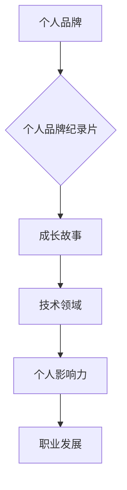

                 

## 打造个人品牌纪录片：讲述你的成长故事

> 关键词：个人品牌、纪录片、成长故事、技术领域、品牌建设

### 1. 背景介绍

在当今信息爆炸的时代，个人品牌已成为个人在专业领域获得认可和成功的关键。对于技术领域从业者而言，打造个人品牌尤为重要。 

技术领域瞬息万变，新技术层出不穷，竞争日益激烈。仅仅依靠技术技能已经无法保证个人在职场中的竞争力。个人品牌能够帮助技术人员建立专业形象，提升个人影响力，拓展职业发展机会。

纪录片作为一种具有深度和感染力的叙事形式，能够生动地展现个人成长历程、技术积累和职业发展轨迹，从而更加有效地构建个人品牌。

### 2. 核心概念与联系

#### 2.1 个人品牌

个人品牌是指个人在特定领域内所建立的独特形象和声誉，它包含个人价值观、技能、经验、成就以及与他人建立的关系等多方面因素。

#### 2.2 纪录片

纪录片是一种以真实事件为基础，通过影像和声音等手段进行记录和呈现的电影形式。它能够以客观、真实的方式展现人物、事件和社会现象，并引发观众的思考和共鸣。

#### 2.3 个人品牌纪录片

个人品牌纪录片是指以个人成长故事为主题，通过纪录片的形式展现个人在技术领域内的发展历程，构建个人品牌的一种新型营销方式。

**核心概念与联系流程图**

### 3. 核心算法原理 & 具体操作步骤

#### 3.1 算法原理概述

个人品牌纪录片的制作是一个系统工程，需要遵循一定的算法原理和操作步骤，才能有效地构建个人品牌。

#### 3.2 算法步骤详解

1. **目标定位:** 明确个人品牌的目标受众和品牌定位，例如，是面向企业客户、技术社区还是个人用户。
2. **故事挖掘:** 挖掘个人成长故事中的亮点和感人之处，例如，技术突破、项目成功、个人经历等。
3. **剧本创作:** 根据故事内容，撰写一个引人入胜的剧本，并确定纪录片的风格和节奏。
4. **拍摄制作:** 采用专业的拍摄设备和技术，拍摄高质量的影像素材，并进行后期剪辑和制作。
5. **推广发布:** 通过线上线下渠道，推广和发布纪录片，并与目标受众进行互动。
6. **品牌维护:** 持之以恒地维护个人品牌形象，持续输出优质内容，并与粉丝建立良好的关系。

#### 3.3 算法优缺点

**优点:**

* **真实感强:** 纪录片以真实事件为基础，能够更加真实地展现个人形象和故事。
* **感染力强:** 好的纪录片能够引发观众的共鸣和情感，从而增强个人品牌的影响力。
* **传播广度大:** 纪录片可以通过线上线下多种渠道进行传播，覆盖更广泛的受众群体。

**缺点:**

* **制作成本高:** 纪录片的制作需要投入大量的资金和人力资源。
* **时间成本长:** 纪录片的制作周期较长，需要花费大量的时间进行前期准备、拍摄和后期制作。
* **受众定位有限:** 纪录片的受众群体相对有限，需要根据目标受众进行内容创作和推广。

#### 3.4 算法应用领域

个人品牌纪录片可以应用于各个技术领域，例如：

* **软件开发:** 展示软件开发者的技术能力、项目经验和个人成长故事。
* **数据科学:** 展示数据科学家对数据分析、机器学习等领域的贡献和研究成果。
* **人工智能:** 展示人工智能研究者对人工智能技术的理解和应用，以及对未来发展趋势的展望。
* **网络安全:** 展示网络安全专家的技术能力和安全意识，以及对网络安全威胁的应对策略。

### 4. 数学模型和公式 & 详细讲解 & 举例说明

#### 4.1 数学模型构建

个人品牌的影响力可以看作是一个动态的系统，其影响力大小可以由以下公式表示：

$$
I = f(C, E, R, T)
$$

其中：

* $I$ 代表个人品牌的影响力
* $C$ 代表个人品牌的认知度
* $E$ 代表个人品牌的信任度
* $R$ 代表个人品牌的推荐度
* $T$ 代表个人品牌的时效性

#### 4.2 公式推导过程

* **认知度 (C):** 指的是目标受众对个人品牌的了解程度。认知度越高，个人品牌的影响力越大。
* **信任度 (E):** 指的是目标受众对个人品牌的信任程度。信任度越高，个人品牌的影响力越大。
* **推荐度 (R):** 指的是目标受众对个人品牌的推荐意愿。推荐度越高，个人品牌的影响力越大。
* **时效性 (T):** 指的是个人品牌信息的新鲜度和相关性。时效性越高，个人品牌的影响力越大。

#### 4.3 案例分析与讲解

假设一位技术专家发布了一篇关于人工智能技术的博客文章，该文章获得了大量的阅读量和点赞，并被多个技术社区转载。

* **认知度 (C):** 博客文章的阅读量和转载次数表明，该技术专家的认知度在技术领域得到了提升。
* **信任度 (E):** 博客文章的内容质量和技术深度表明，该技术专家的专业能力和技术水平得到了认可，从而提升了其信任度。
* **推荐度 (R):** 博客文章的点赞和评论表明，该技术专家的文章内容得到了用户的认可和推荐。
* **时效性 (T):** 博客文章的内容与人工智能技术的最新发展趋势相符，保持了时效性。

通过以上分析，可以看出，该技术专家的个人品牌影响力得到了显著提升。

### 5. 项目实践：代码实例和详细解释说明

#### 5.1 开发环境搭建

个人品牌纪录片的制作需要搭建一个专业的开发环境，包括：

* **硬件设备:** 高性能电脑、专业摄像机、录音设备等。
* **软件工具:** 视频剪辑软件、音频编辑软件、特效软件等。
* **网络环境:** 高速网络连接、云存储服务等。

#### 5.2 源代码详细实现

由于个人品牌纪录片的制作涉及多个技术领域，其源代码实现较为复杂，无法在此处详细展示。

#### 5.3 代码解读与分析

个人品牌纪录片的源代码主要包括以下几个模块：

* **视频采集和处理模块:** 负责视频的录制、剪辑、特效处理等操作。
* **音频处理模块:** 负责音频的录制、编辑、混音等操作。
* **字幕和图形设计模块:** 负责字幕的制作、图形的绘制等操作。
* **视频编码和输出模块:** 负责视频的编码和输出，使其能够在不同的平台上播放。

#### 5.4 运行结果展示

个人品牌纪录片的最终运行结果是一个高质量的视频作品，能够生动地展现个人成长故事和技术积累，从而有效地构建个人品牌。

### 6. 实际应用场景

#### 6.1 技术社区分享

技术人员可以通过制作个人品牌纪录片，分享自己的技术经验和项目成果，提升在技术社区中的影响力。

#### 6.2 职业发展平台

个人品牌纪录片可以作为职业发展平台的素材，展示个人技能和经验，吸引潜在雇主或合作伙伴。

#### 6.3 个人网站推广

个人品牌纪录片可以嵌入个人网站，提升网站的吸引力和用户粘性，从而促进个人品牌的推广。

#### 6.4 未来应用展望

随着技术的不断发展，个人品牌纪录片的应用场景将会更加广泛，例如：

* **虚拟现实 (VR) 和增强现实 (AR) 纪录片:** 利用 VR 和 AR 技术，打造更加沉浸式的个人品牌体验。
* **人工智能 (AI) 辅助制作:** 利用 AI 技术，自动生成字幕、特效等，降低个人品牌纪录片的制作成本。
* **区块链技术应用:** 利用区块链技术，保障个人品牌纪录片的版权和真实性。

### 7. 工具和资源推荐

#### 7.1 学习资源推荐

* **在线课程:** Coursera、Udemy 等平台提供有关纪录片制作的在线课程。
* **书籍:** 《纪录片制作手册》、《电影剪辑艺术》等书籍可以帮助学习纪录片制作的理论知识和实践技巧。
* **技术博客:** 关注一些技术领域的博客，了解最新的纪录片制作工具和技术。

#### 7.2 开发工具推荐

* **视频剪辑软件:** Adobe Premiere Pro、Final Cut Pro、DaVinci Resolve 等。
* **音频编辑软件:** Adobe Audition、Audacity、Logic Pro X 等。
* **特效软件:** After Effects、Nuke、Blender 等。

#### 7.3 相关论文推荐

* **纪录片制作的理论研究:** 可以搜索相关学术数据库，例如 IEEE Xplore、ACM Digital Library 等。
* **人工智能技术应用于纪录片制作:** 可以关注一些人工智能领域的学术期刊和会议论文。

### 8. 总结：未来发展趋势与挑战

#### 8.1 研究成果总结

个人品牌纪录片作为一种新型的品牌营销方式，具有独特的优势和潜力。

#### 8.2 未来发展趋势

未来，个人品牌纪录片的制作将会更加专业化、个性化和智能化。

#### 8.3 面临的挑战

个人品牌纪录片的制作也面临着一些挑战，例如：

* **制作成本高:** 纪录片的制作需要投入大量的资金和人力资源。
* **受众定位有限:** 纪录片的受众群体相对有限，需要根据目标受众进行内容创作和推广。
* **版权和知识产权保护:** 纪录片的版权和知识产权保护是一个重要的课题。

#### 8.4 研究展望

未来，需要进一步研究个人品牌纪录片的制作技术、传播策略和商业模式，以推动其更加健康和可持续的发展。

### 9. 附录：常见问题与解答

#### 9.1 如何选择合适的拍摄设备？

选择合适的拍摄设备需要根据个人品牌纪录片的拍摄场景、预算和技术要求进行综合考虑。

#### 9.2 如何进行视频剪辑和特效处理？

视频剪辑和特效处理需要掌握专业的软件工具和技术技巧，可以参考相关教程和书籍进行学习。

#### 9.3 如何推广和发布个人品牌纪录片？

个人品牌纪录片的推广和发布可以采用线上线下多种渠道，例如：

* **社交媒体平台:** 发布纪录片片段和预告片，吸引用户关注。
* **技术社区平台:** 分享纪录片内容，与技术社区用户互动。
* **视频网站平台:** 将纪录片上传到 YouTube、Vimeo 等视频网站平台。
* **线下活动:** 在技术会议、展会等线下活动中播放纪录片。

作者：禅与计算机程序设计艺术 / Zen and the Art of Computer Programming 
<end_of_turn>

