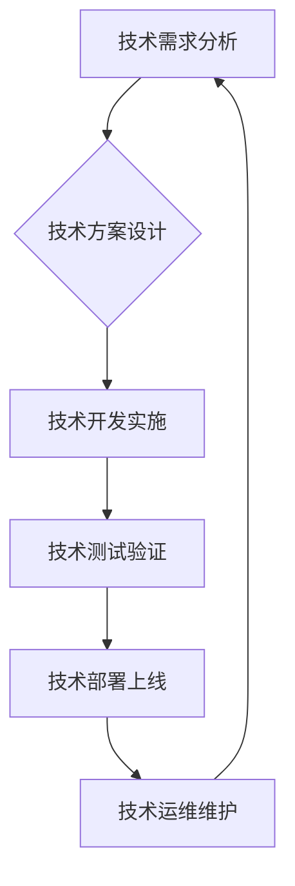

                 

## 技术管理：在数字化时代保持竞争力

> 关键词：数字化转型、技术领导力、敏捷开发、DevOps、云计算、数据驱动、人工智能、技术风险管理

### 1. 背景介绍

当今世界正处于数字化转型浪潮的中心。互联网、移动互联网、大数据、云计算、人工智能等技术的快速发展，深刻地改变着人们的生活方式、商业模式和社会结构。对于企业而言，拥抱数字化转型，提升技术管理水平，是保持竞争力和持续发展的关键。

然而，数字化转型并非易事。它需要企业在技术、组织、文化等方面进行全面的变革。技术管理作为数字化转型的核心驱动力，肩负着重大的责任。它需要企业建立健全的技术战略、流程、制度和人才体系，才能有效地应对数字化时代的挑战。

### 2. 核心概念与联系

**2.1 技术管理概述**

技术管理是指企业在技术创新、技术开发、技术应用、技术维护等全生命周期中，运用科学的方法和手段，有效地规划、组织、控制和优化技术资源，以实现企业战略目标。

**2.2 技术管理与数字化转型的关系**

数字化转型是企业利用数字化技术重构业务模式、运营流程和组织架构的过程。技术管理是数字化转型的基石，它为数字化转型提供技术支撑、保障和驱动。

**2.3 技术管理的核心要素**

* **技术战略:** 明确企业在数字化时代的技术方向和目标，制定相应的技术路线图和实施计划。
* **技术架构:** 建立企业级技术平台和基础设施，支撑数字化转型业务的运行和发展。
* **技术开发:** 持续进行技术创新和研发，开发满足企业需求的新技术和产品。
* **技术应用:** 将新技术应用到实际业务中，提升业务效率和用户体验。
* **技术维护:** 保证技术系统的稳定运行和安全可靠，及时修复技术问题。
* **技术人才:** 培养和引进技术人才，构建一支高素质的技术团队。

**2.4 技术管理的流程**

### 3. 核心算法原理 & 具体操作步骤

**3.1 算法原理概述**

在技术管理中，算法扮演着至关重要的角色。算法可以帮助企业优化资源分配、提高工作效率、降低成本、提升决策质量等。

**3.2 算法步骤详解**

* **需求分析:** 明确算法需要解决的问题，并定义算法的输入和输出。
* **算法设计:** 根据需求分析结果，设计出满足需求的算法方案。
* **算法实现:** 将算法方案转化为具体的代码实现。
* **算法测试:** 对算法进行测试，验证算法的正确性和效率。
* **算法优化:** 根据测试结果，对算法进行优化，提高算法的性能。

**3.3 算法优缺点**

* **优点:** 算法可以自动化执行任务，提高效率和准确性。
* **缺点:** 算法的开发和维护需要专业知识和技术能力。

**3.4 算法应用领域**

* **资源优化:** 算法可以帮助企业优化资源分配，例如服务器资源、网络带宽等。
* **流程自动化:** 算法可以自动化执行重复性任务，例如代码构建、测试、部署等。
* **数据分析:** 算法可以帮助企业分析海量数据，发现隐藏的规律和趋势。
* **决策支持:** 算法可以提供数据驱动的决策支持，帮助企业做出更明智的决策。

### 4. 数学模型和公式 & 详细讲解 & 举例说明

**4.1 数学模型构建**

在技术管理中，数学模型可以用来描述和分析复杂系统，例如软件开发流程、网络流量、用户行为等。

**4.2 公式推导过程**

例如，我们可以用数学模型来描述软件开发的迭代周期。假设一个软件项目需要进行n个迭代，每个迭代的开发时间为t，则总的开发时间可以表示为：

$$T = n * t$$

**4.3 案例分析与讲解**

我们可以用数学模型来分析网络流量的峰值和谷值。假设网络流量的峰值流量为P，谷值流量为V，则网络流量的平均流量可以表示为：

$$A = (P + V) / 2$$

### 5. 项目实践：代码实例和详细解释说明

**5.1 开发环境搭建**

在进行技术管理项目实践时，需要搭建相应的开发环境。例如，我们可以使用虚拟机、容器技术等工具来搭建开发环境。

**5.2 源代码详细实现**

我们可以使用编程语言来实现技术管理相关的代码，例如Python、Java等。

**5.3 代码解读与分析**

我们需要对代码进行解读和分析，理解代码的功能和逻辑。

**5.4 运行结果展示**

我们可以运行代码，观察代码的运行结果，并进行测试和验证。

### 6. 实际应用场景

**6.1 技术管理在软件开发中的应用**

技术管理可以帮助软件开发团队提高开发效率、降低开发成本、提升软件质量。例如，我们可以使用敏捷开发方法、DevOps流程等技术管理工具来提高软件开发效率。

**6.2 技术管理在云计算中的应用**

技术管理可以帮助企业更好地管理云计算资源，例如虚拟机、存储、网络等。例如，我们可以使用云平台提供的监控、管理工具来监控和管理云计算资源。

**6.3 技术管理在数据分析中的应用**

技术管理可以帮助企业更好地管理和分析数据，例如数据采集、存储、处理、分析等。例如，我们可以使用数据分析平台、工具来进行数据分析。

**6.4 未来应用展望**

随着数字化转型的深入发展，技术管理将发挥更加重要的作用。例如，人工智能、机器学习等新技术将被更加广泛地应用于技术管理领域，例如自动化的代码生成、测试、部署等。

### 7. 工具和资源推荐

**7.1 学习资源推荐**

* **书籍:** 《技术管理：在数字化时代保持竞争力》
* **在线课程:** Coursera、edX等平台提供技术管理相关的在线课程。
* **技术博客:** 关注技术领域的博客，例如TechCrunch、VentureBeat等。

**7.2 开发工具推荐**

* **版本控制系统:** Git、SVN等
* **项目管理工具:** Jira、Trello等
* **代码构建工具:** Jenkins、Maven等

**7.3 相关论文推荐**

* **ACM Digital Library:** https://dl.acm.org/
* **IEEE Xplore:** https://ieeexplore.ieee.org/

### 8. 总结：未来发展趋势与挑战

**8.1 研究成果总结**

技术管理在数字化时代发挥着越来越重要的作用。通过算法、数学模型、工具和资源的应用，企业可以有效地提升技术管理水平，实现数字化转型目标。

**8.2 未来发展趋势**

* **人工智能驱动的技术管理:** 人工智能将被更加广泛地应用于技术管理领域，例如自动化的代码生成、测试、部署等。
* **数据驱动技术管理:** 数据分析将成为技术管理的重要手段，企业将更加注重数据收集、分析和利用。
* **敏捷化技术管理:** 敏捷开发方法将更加深入地应用于技术管理领域，企业将更加注重快速迭代、持续改进。

**8.3 面临的挑战**

* **技术人才短缺:** 技术管理领域需要大量高素质的技术人才，而目前技术人才短缺是一个普遍问题。
* **技术风险管理:** 数字化转型过程中，企业面临着各种技术风险，例如数据安全、系统故障等，需要加强技术风险管理。
* **文化变革:** 技术管理需要企业进行文化变革，例如打破部门壁垒、鼓励创新等。

**8.4 研究展望**

未来，技术管理研究将更加注重人工智能、数据驱动、敏捷化等方面的研究，以更好地应对数字化时代的挑战。

### 9. 附录：常见问题与解答

**9.1 如何建立有效的技术管理体系？**

建立有效的技术管理体系需要企业进行全面的规划和实施，包括技术战略制定、技术架构设计、技术流程优化、技术人才培养等方面。

**9.2 如何应对技术人才短缺问题？**

企业可以采取多种措施应对技术人才短缺问题，例如加强高校合作、开展技术培训、提供良好的薪酬福利等。

**9.3 如何加强技术风险管理？**

企业需要建立完善的技术风险管理体系，包括风险识别、风险评估、风险控制、风险监控等环节。

**9.4 如何促进技术管理与业务发展的融合？**

技术管理需要与业务发展紧密结合，才能更好地服务于企业战略目标。企业需要建立技术与业务的沟通机制，确保技术管理与业务发展相互促进。

作者：禅与计算机程序设计艺术 / Zen and the Art of Computer Programming 
<end_of_turn>

