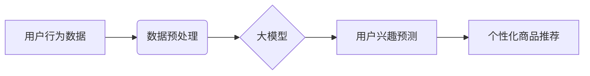

                 

##  探讨大模型在电商平台用户兴趣短期预测中的潜力

> 关键词：大模型、用户兴趣预测、电商平台、短期预测、推荐系统、Transformer、BERT、深度学习

## 1. 背景介绍

在当今数据爆炸的时代，电商平台面临着巨大的挑战，如何精准地了解用户兴趣，并提供个性化的商品推荐，是提升用户体验和促进商业增长的关键。传统的用户兴趣预测方法主要依赖于用户的历史行为数据，例如浏览记录、购买记录、评价记录等。然而，这些方法往往难以捕捉用户兴趣的动态变化和复杂性，尤其是在短期内预测用户兴趣方面存在局限性。

近年来，大模型技术的发展为用户兴趣预测带来了新的机遇。大模型，例如GPT-3、BERT等，拥有强大的语义理解和文本生成能力，能够从海量文本数据中学习到用户兴趣的深层特征，并进行更精准的短期预测。

## 2. 核心概念与联系

### 2.1 用户兴趣短期预测

用户兴趣短期预测是指在短时间内（例如几分钟、几小时）预测用户的兴趣偏好，并根据预测结果提供个性化的商品推荐。

### 2.2 大模型

大模型是指参数量巨大、训练数据海量的人工智能模型。大模型通常基于深度学习技术，例如Transformer架构，能够学习到复杂的语义关系和模式。

### 2.3  电商平台推荐系统

电商平台推荐系统是根据用户的兴趣偏好，推荐相关商品的系统。推荐系统通常包括以下几个模块：

* 数据采集模块：收集用户的行为数据，例如浏览记录、购买记录、评价记录等。
* 数据预处理模块：对收集到的数据进行清洗、转换和特征提取。
* 模型训练模块：训练推荐模型，例如基于协同过滤的模型、基于内容过滤的模型、基于深度学习的模型等。
* 推荐结果展示模块：将推荐结果展示给用户。

**大模型与电商平台推荐系统的关系**

大模型可以作为电商平台推荐系统的核心组件，用于提升用户兴趣短期预测的准确性。大模型可以学习到用户的深层兴趣特征，并根据这些特征进行更精准的商品推荐。



## 3. 核心算法原理 & 具体操作步骤

### 3.1  算法原理概述

大模型在用户兴趣短期预测中的应用主要基于以下算法原理：

* **Transformer架构**: Transformer是一种新型的神经网络架构，能够有效地处理序列数据，例如文本数据。Transformer的注意力机制能够捕捉文本中的长距离依赖关系，从而更好地理解用户的兴趣偏好。
* **BERT模型**: BERT（Bidirectional Encoder Representations from Transformers）是一种基于Transformer架构的预训练语言模型，能够学习到丰富的文本语义表示。BERT可以用于提取用户的兴趣特征，例如用户喜欢的商品类别、品牌、风格等。

### 3.2  算法步骤详解

1. **数据收集和预处理**: 收集用户的行为数据，例如浏览记录、购买记录、评价记录等，并进行清洗、转换和特征提取。
2. **大模型预训练**: 使用BERT等预训练语言模型对海量文本数据进行预训练，学习到丰富的文本语义表示。
3. **模型微调**: 将预训练的BERT模型微调到电商平台的用户兴趣预测任务上，使用用户行为数据进行训练。
4. **用户兴趣预测**: 将用户的最新行为数据输入到微调后的BERT模型中，预测用户的短期兴趣偏好。
5. **个性化商品推荐**: 根据预测结果，推荐相关商品给用户。

### 3.3  算法优缺点

**优点**:

* 能够捕捉用户的深层兴趣特征，提升预测准确性。
* 能够处理海量文本数据，学习到更丰富的语义知识。
* 能够进行个性化的商品推荐，提升用户体验。

**缺点**:

* 训练成本较高，需要大量的计算资源和数据。
* 模型解释性较差，难以理解模型的决策过程。

### 3.4  算法应用领域

大模型在用户兴趣短期预测的应用领域广泛，例如：

* 电商平台商品推荐
* 内容平台个性化推荐
* 社交媒体用户兴趣分析
* 搜索引擎结果排序

## 4. 数学模型和公式 & 详细讲解 & 举例说明

### 4.1  数学模型构建

大模型在用户兴趣短期预测中的应用通常基于以下数学模型：

* **用户兴趣表示**: 使用BERT模型将用户的行为数据转换为用户兴趣向量，该向量表示用户的兴趣特征。

* **商品兴趣表示**: 使用BERT模型将商品信息转换为商品兴趣向量，该向量表示商品的特征。

* **相似度计算**: 使用余弦相似度等方法计算用户兴趣向量和商品兴趣向量的相似度，作为预测用户对商品的兴趣的指标。

### 4.2  公式推导过程

**余弦相似度公式**:

$$
\text{相似度} = \frac{\mathbf{u} \cdot \mathbf{v}}{\|\mathbf{u}\| \|\mathbf{v}\|}
$$

其中：

* $\mathbf{u}$ 是用户兴趣向量
* $\mathbf{v}$ 是商品兴趣向量
* $\cdot$ 表示向量点积
* $\|\mathbf{u}\|$ 和 $\|\mathbf{v}\|$ 分别表示用户兴趣向量和商品兴趣向量的模长

### 4.3  案例分析与讲解

假设用户A的兴趣向量为 [0.2, 0.5, 0.3, 0.1]，商品B的兴趣向量为 [0.1, 0.4, 0.6, 0.2]，则它们的余弦相似度为：

$$
\text{相似度} = \frac{(0.2 \times 0.1) + (0.5 \times 0.4) + (0.3 \times 0.6) + (0.1 \times 0.2)}{\sqrt{0.2^2 + 0.5^2 + 0.3^2 + 0.1^2} \times \sqrt{0.1^2 + 0.4^2 + 0.6^2 + 0.2^2}}
$$

$$
\text{相似度} \approx 0.6
$$

该结果表明用户A对商品B的兴趣程度较高。

## 5. 项目实践：代码实例和详细解释说明

### 5.1  开发环境搭建

* Python 3.7+
* TensorFlow 2.0+
* PyTorch 1.0+
* CUDA 10.0+ (可选)

### 5.2  源代码详细实现

```python
import tensorflow as tf
from tensorflow.keras.layers import Embedding, LSTM, Dense

# 定义用户兴趣嵌入层
user_embedding = Embedding(input_dim=vocab_size, output_dim=embedding_dim)

# 定义商品兴趣嵌入层
item_embedding = Embedding(input_dim=vocab_size, output_dim=embedding_dim)

# 定义LSTM层
lstm_layer = LSTM(units=hidden_units)

# 定义全连接层
dense_layer = Dense(units=1, activation='sigmoid')

# 定义模型
model = tf.keras.Sequential([
    user_embedding,
    item_embedding,
    lstm_layer,
    dense_layer
])

# 编译模型
model.compile(optimizer='adam', loss='binary_crossentropy', metrics=['accuracy'])

# 训练模型
model.fit(x_train, y_train, epochs=10, batch_size=32)

# 预测用户对商品的兴趣
predictions = model.predict(user_input, item_input)
```

### 5.3  代码解读与分析

* **用户兴趣嵌入层和商品兴趣嵌入层**: 将用户和商品的ID转换为向量表示，用于模型训练。
* **LSTM层**: 用于处理用户行为序列数据，捕捉用户的兴趣变化趋势。
* **全连接层**: 用于将LSTM层的输出映射到用户对商品的兴趣预测结果。
* **模型编译**: 使用Adam优化器、二元交叉熵损失函数和准确率作为评估指标。
* **模型训练**: 使用训练数据训练模型，并进行多次迭代。
* **模型预测**: 使用训练好的模型预测用户对商品的兴趣。

### 5.4  运行结果展示

训练完成后，可以使用测试数据评估模型的性能，例如计算准确率、召回率等指标。

## 6. 实际应用场景

### 6.1  电商平台商品推荐

大模型可以用于电商平台的个性化商品推荐，例如：

* **首页推荐**: 根据用户的兴趣偏好，推荐热门商品、新品上市等。
* **搜索结果推荐**: 根据用户的搜索关键词，推荐相关商品。
* **浏览历史推荐**: 根据用户的浏览历史，推荐用户可能感兴趣的商品。

### 6.2  内容平台个性化推荐

大模型可以用于内容平台的个性化推荐，例如：

* **新闻推荐**: 根据用户的阅读习惯，推荐相关新闻资讯。
* **视频推荐**: 根据用户的观看历史，推荐相关视频内容。
* **音乐推荐**: 根据用户的听歌习惯，推荐相关音乐作品。

### 6.3  社交媒体用户兴趣分析

大模型可以用于社交媒体的用户兴趣分析，例如：

* **用户画像**: 根据用户的社交行为，构建用户画像，了解用户的兴趣爱好、生活方式等。
* **兴趣群组**: 根据用户的兴趣偏好，将用户聚类到不同的兴趣群组中。
* **内容创作**: 根据用户的兴趣趋势，为内容创作者提供创作灵感。

### 6.4  未来应用展望

大模型在用户兴趣短期预测领域的应用前景广阔，未来可能在以下方面得到进一步发展：

* **更精准的预测**: 通过更复杂的模型架构和更丰富的训练数据，提升用户兴趣预测的准确性。
* **更个性化的推荐**: 基于用户的实时行为数据，提供更个性化的商品推荐。
* **更丰富的应用场景**: 将大模型应用到更多领域，例如教育、医疗、金融等。

## 7. 工具和资源推荐

### 7.1  学习资源推荐

* **书籍**:
    * 《深度学习》
    * 《自然语言处理》
    * 《Transformer模型》
* **在线课程**:
    * Coursera
    * edX
    * Udacity

### 7.2  开发工具推荐

* **TensorFlow**: 开源深度学习框架
* **PyTorch**: 开源深度学习框架
* **HuggingFace**: 提供预训练模型和工具

### 7.3  相关论文推荐

* BERT: Pre-training of Deep Bidirectional Transformers for Language Understanding
* Transformer: Attention Is All You Need
* XLNet: Generalized Autoregressive Pretraining for Language Understanding

## 8. 总结：未来发展趋势与挑战

### 8.1  研究成果总结

大模型在用户兴趣短期预测领域取得了显著的成果，能够提升预测准确性，提供更个性化的商品推荐。

### 8.2  未来发展趋势

未来大模型在用户兴趣短期预测领域将朝着以下方向发展：

* **模型架构**: 探索更复杂的模型架构，例如多模态模型，能够处理文本、图像、音频等多种数据类型。
* **训练数据**: 收集更丰富、更准确的用户行为数据，提升模型的训练效果。
* **解释性**: 研究大模型的决策过程，提高模型的解释性。

### 8.3  面临的挑战

大模型在用户兴趣短期预测领域也面临一些挑战：

* **计算资源**: 训练大模型需要大量的计算资源，成本较高。
* **数据隐私**: 用户行为数据涉及隐私问题，需要采取措施保护用户隐私。
* **模型可解释性**: 大模型的决策过程难以理解，需要提高模型的可解释性。

### 8.4  研究展望

未来研究将重点关注以下方面：

* 开发更轻量级的模型，降低训练成本。
* 研究隐私保护技术，保障用户数据安全。
* 提升模型的可解释性，帮助用户理解模型的决策过程。


## 9. 附录：常见问题与解答

### 9.1  Q1: 大模型的训练成本很高，如何降低成本？

**A1:** 

* 使用预训练模型，避免从头训练。
* 使用云计算平台，共享计算资源。
* 优化模型架构，减少模型参数量。

### 9.2  Q2: 大模型的解释性差，如何提高解释性？

**A2:** 

* 使用可解释机器学习模型，例如LIME、SHAP等。
* 分析模型的权重，了解模型对哪些特征更敏感。
* 使用注意力机制，可视化模型对输入数据的关注点。


作者：禅与计算机程序设计艺术 / Zen and the Art of Computer Programming 
<end_of_turn>

