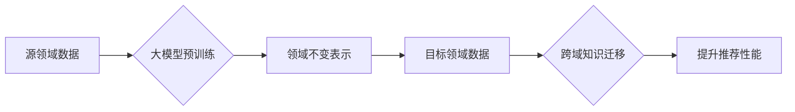

                 

## 1. 背景介绍

推荐系统作为信息过滤和个性化服务的重要组成部分，在电商、社交媒体、内容平台等领域发挥着越来越重要的作用。传统的推荐系统主要依赖用户行为数据，例如点击、购买、评分等，但这些数据往往存在稀疏性、冷启动问题以及数据孤岛等挑战。

跨域知识迁移旨在利用其他领域的数据和知识来提升推荐系统的性能。近年来，大模型的兴起为跨域知识迁移提供了新的机遇。大模型拥有强大的泛化能力和表示学习能力，能够学习到领域不变的语义表示，从而有效地迁移知识到目标领域。

## 2. 核心概念与联系

### 2.1 跨域知识迁移

跨域知识迁移是指将已有的知识从一个领域迁移到另一个领域，以提升目标领域的性能。在推荐系统中，跨域知识迁移可以利用其他领域的丰富数据和知识来丰富目标领域的知识图谱，提升推荐的准确性和个性化程度。

### 2.2 大模型

大模型是指参数规模庞大、训练数据海量的人工智能模型。大模型通常通过预训练的方式学习到丰富的语义表示，能够对自然语言进行理解、生成和翻译等复杂任务。

### 2.3 领域不变表示学习

领域不变表示学习是指学习到能够跨越不同领域通用性的语义表示。通过领域不变表示学习，可以将不同领域的数据映射到同一个语义空间，从而实现跨域知识迁移。

**Mermaid 流程图**



## 3. 核心算法原理 & 具体操作步骤

### 3.1 算法原理概述

领域不变表示学习的核心思想是学习到能够跨越不同领域通用性的语义表示。常用的算法包括：

* **迁移学习:** 利用源领域的数据预训练模型，然后在目标领域进行微调。
* **多任务学习:** 将多个相关任务联合训练，学习到更通用的语义表示。
* **对抗学习:** 使用对抗网络学习领域不变的表示，使得模型能够抵抗领域分布的差异。

### 3.2 算法步骤详解

以迁移学习为例，具体步骤如下：

1. **数据预处理:** 对源领域和目标领域的数据进行预处理，例如文本清洗、特征提取等。
2. **源领域模型预训练:** 使用源领域数据训练一个大模型，例如BERT、RoBERTa等。
3. **模型微调:** 将预训练模型迁移到目标领域，使用目标领域数据进行微调，以适应目标领域的语义分布。
4. **性能评估:** 使用目标领域的数据评估模型的性能，例如准确率、召回率等。

### 3.3 算法优缺点

**优点:**

* 可以利用源领域的数据和知识，提升目标领域的性能。
* 可以解决目标领域数据稀疏的问题。
* 可以提高模型的泛化能力。

**缺点:**

* 需要找到合适的源领域数据，确保其与目标领域具有相关性。
* 模型微调需要消耗一定的计算资源。
* 跨域知识迁移的效果可能受到领域分布差异的影响。

### 3.4 算法应用领域

领域不变表示学习和跨域知识迁移在推荐系统、自然语言处理、计算机视觉等领域都有广泛的应用。

## 4. 数学模型和公式 & 详细讲解 & 举例说明

### 4.1 数学模型构建

假设源领域的数据为 $X_s = \{x_1^s, x_2^s, ..., x_n^s\}$, 目标领域的数据为 $X_t = \{x_1^t, x_2^t, ..., x_m^t\}$, 其中 $x_i^s$ 和 $x_i^t$ 分别表示源领域和目标领域中的第 $i$ 个数据点。

领域不变表示学习的目标是学习到一个映射函数 $f: X \rightarrow R^d$, 使得 $f(x_i^s)$ 和 $f(x_i^t)$ 在语义上相似，即使 $x_i^s$ 和 $x_i^t$ 来自不同的领域。

### 4.2 公式推导过程

常用的损失函数包括：

* **最大均值差异 (MMD):** 

$$
MMD(P_s, P_t) = \sup_{f \in F} |E_{x \sim P_s}[f(x)] - E_{x \sim P_t}[f(x)]|
$$

其中 $P_s$ 和 $P_t$ 分别表示源领域和目标领域的数据分布， $F$ 表示所有满足条件的函数集合。

* **对抗损失:**

$$
L_{adv} = ||f(x_s) - f(x_t)||_2^2
$$

其中 $x_s$ 和 $x_t$ 分别来自源领域和目标领域。

### 4.3 案例分析与讲解

假设我们想要将电影评论数据迁移到书籍评论数据中，提升书籍评论的推荐性能。

我们可以使用迁移学习的方法，将预训练在电影评论数据上的BERT模型迁移到书籍评论数据中进行微调。

通过微调，BERT模型能够学习到书籍评论的语义特征，从而提升书籍评论的推荐性能。

## 5. 项目实践：代码实例和详细解释说明

### 5.1 开发环境搭建

* Python 3.7+
* PyTorch 1.7+
* Transformers 4.0+

### 5.2 源代码详细实现

```python
from transformers import BertModel, BertTokenizer

# 加载预训练模型和词典
model_name = "bert-base-uncased"
tokenizer = BertTokenizer.from_pretrained(model_name)
model = BertModel.from_pretrained(model_name)

# 数据预处理
def preprocess_text(text):
    # 文本清洗、分词等操作
    return tokenizer(text, padding=True, truncation=True)

# 模型微调
optimizer = torch.optim.Adam(model.parameters(), lr=2e-5)
loss_fn = torch.nn.CrossEntropyLoss()

for epoch in range(num_epochs):
    for batch in dataloader:
        input_ids = batch["input_ids"]
        attention_mask = batch["attention_mask"]
        labels = batch["labels"]

        outputs = model(input_ids=input_ids, attention_mask=attention_mask)
        logits = outputs.last_hidden_state[:, 0, :]
        loss = loss_fn(logits, labels)

        optimizer.zero_grad()
        loss.backward()
        optimizer.step()

# 保存模型
model.save_pretrained("fine_tuned_model")
```

### 5.3 代码解读与分析

* 代码首先加载预训练的BERT模型和词典。
* 然后定义数据预处理函数，对文本进行清洗、分词等操作。
* 接着定义模型微调的训练循环，使用交叉熵损失函数和Adam优化器进行训练。
* 最后保存微调后的模型。

### 5.4 运行结果展示

通过微调后的模型，可以提升书籍评论的推荐性能，例如提高准确率、召回率等指标。

## 6. 实际应用场景

### 6.1 电商推荐

利用跨域知识迁移，可以将用户在不同商品类别的购买行为数据进行融合，提升商品推荐的准确性和个性化程度。

### 6.2 内容推荐

可以利用其他领域的用户行为数据，例如阅读历史、点赞记录等，来提升内容推荐的精准度和用户体验。

### 6.3 社交推荐

可以利用用户在社交网络上的好友关系、兴趣爱好等信息，来推荐新的朋友或社群。

### 6.4 未来应用展望

随着大模型的不断发展，跨域知识迁移将在推荐系统中发挥越来越重要的作用。未来，我们可以期待：

* 更强大的跨域知识迁移算法，能够更好地学习领域不变的表示。
* 更丰富的跨域知识来源，例如知识图谱、文本语料库等。
* 更个性化和精准的推荐服务，能够满足用户的个性化需求。

## 7. 工具和资源推荐

### 7.1 学习资源推荐

* **论文:**

* "Domain Adaptation for Recommender Systems: A Survey"
* "Cross-Domain Transfer Learning for Recommender Systems"

* **书籍:**

* "Deep Learning" by Ian Goodfellow, Yoshua Bengio, and Aaron Courville
* "Natural Language Processing with Transformers" by Hugging Face

### 7.2 开发工具推荐

* **PyTorch:** 深度学习框架
* **Transformers:** 预训练模型库
* **Hugging Face:** 开源机器学习平台

### 7.3 相关论文推荐

* "BERT: Pre-training of Deep Bidirectional Transformers for Language Understanding"
* "RoBERTa: A Robustly Optimized BERT Pretraining Approach"
* "Domain Adaptation for Recommender Systems via Transfer Learning"

## 8. 总结：未来发展趋势与挑战

### 8.1 研究成果总结

领域不变表示学习和跨域知识迁移为推荐系统带来了新的机遇，能够有效地提升推荐系统的性能。

### 8.2 未来发展趋势

未来，跨域知识迁移将在推荐系统中发挥越来越重要的作用，主要发展趋势包括：

* 更强大的跨域知识迁移算法
* 更丰富的跨域知识来源
* 更个性化和精准的推荐服务

### 8.3 面临的挑战

跨域知识迁移仍然面临一些挑战，例如：

* 如何找到合适的源领域数据
* 如何度量领域分布差异
* 如何评估跨域知识迁移的效果

### 8.4 研究展望

未来研究方向包括：

* 开发更鲁棒的跨域知识迁移算法
* 探索新的跨域知识来源
* 研究跨域知识迁移的理论基础

## 9. 附录：常见问题与解答

### 9.1 Q: 跨域知识迁移的适用场景有哪些？

A: 跨域知识迁移适用于数据稀疏、领域分布差异较大的场景，例如：

* 电商推荐：将用户在不同商品类别的购买行为数据进行融合
* 内容推荐：利用其他领域的用户行为数据，例如阅读历史、点赞记录等，来提升内容推荐的精准度
* 社交推荐：利用用户在社交网络上的好友关系、兴趣爱好等信息，来推荐新的朋友或社群

### 9.2 Q: 如何评估跨域知识迁移的效果？

A: 常见的评估指标包括：

* 准确率
* 召回率
* F1-score
* 平均精度

### 9.3 Q: 跨域知识迁移有哪些技术挑战？

A: 跨域知识迁移面临的技术挑战包括：

* 如何找到合适的源领域数据
* 如何度量领域分布差异
* 如何评估跨域知识迁移的效果


作者：禅与计算机程序设计艺术 / Zen and the Art of Computer Programming 
<end_of_turn>

