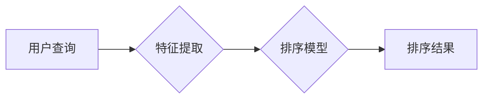

                 

## 搜索结果排序：从规则到AI的进化

> 关键词：搜索引擎、排序算法、机器学习、深度学习、自然语言处理、信息检索、用户体验

### 1. 背景介绍

在信息爆炸的时代，搜索引擎已成为人们获取信息的主要途径。然而，海量数据的涌现也带来了新的挑战：如何从海量数据中快速、准确地找到用户真正需要的信息？搜索结果排序正是解决这一问题的关键技术。

传统的搜索引擎主要依靠规则引擎来对搜索结果进行排序。规则引擎基于预先定义的规则和权重，对网页进行评分，并将评分高的网页排在前面。这种方法简单易行，但缺乏灵活性，难以适应用户需求的多样性和搜索语境的复杂性。

随着机器学习和深度学习技术的快速发展，搜索结果排序也迎来了新的变革。基于机器学习的排序算法能够从海量数据中学习用户行为模式和搜索意图，并根据这些模式对搜索结果进行个性化排序。这种方法能够更好地满足用户需求，提升用户体验。

### 2. 核心概念与联系

搜索结果排序的核心概念包括：

* **信息检索 (Information Retrieval):**  是指从一个集合中找到与用户查询相关的文档的过程。
* **排序算法 (Ranking Algorithm):**  是指根据一定的规则或模型，对搜索结果进行排名和排序的算法。
* **特征工程 (Feature Engineering):**  是指从原始数据中提取和构建能够反映网页质量和相关性的特征的过程。
* **机器学习 (Machine Learning):**  是指通过算法学习数据模式，并根据这些模式进行预测或分类的过程。

**排序算法架构**



### 3. 核心算法原理 & 具体操作步骤

#### 3.1 算法原理概述

传统的搜索结果排序算法主要包括：

* **TF-IDF (Term Frequency-Inverse Document Frequency):**  基于词频和逆向文档频率来衡量网页的权重。
* **BM25 (Best Matching 25):**  改进的TF-IDF算法，考虑了文档长度和查询词的权重。
* **PageRank:**  基于网页之间的链接关系来衡量网页的重要性。

机器学习时代的排序算法则更加复杂，通常采用以下几种方法：

* **基于特征的机器学习:**  使用特征工程提取网页特征，并训练机器学习模型进行排序。
* **深度学习:**  使用深度神经网络学习用户行为模式和搜索意图，并进行排序。

#### 3.2 算法步骤详解

**基于特征的机器学习排序算法步骤:**

1. **数据收集:**  收集用户点击、搜索历史、网页内容等数据。
2. **特征工程:**  从原始数据中提取网页特征，例如关键词密度、网页长度、链接数量等。
3. **模型训练:**  使用训练数据训练机器学习模型，例如逻辑回归、支持向量机等。
4. **模型评估:**  使用测试数据评估模型的性能，例如准确率、召回率等。
5. **模型部署:**  将训练好的模型部署到生产环境中，用于对搜索结果进行排序。

**深度学习排序算法步骤:**

1. **数据预处理:**  对数据进行清洗、转换和编码。
2. **网络结构设计:**  设计深度神经网络结构，例如CNN、RNN、Transformer等。
3. **模型训练:**  使用训练数据训练深度神经网络模型。
4. **模型评估:**  使用测试数据评估模型的性能。
5. **模型部署:**  将训练好的模型部署到生产环境中。

#### 3.3 算法优缺点

**传统算法:**

* **优点:**  简单易实现，计算量较小。
* **缺点:**  缺乏灵活性，难以适应复杂搜索场景。

**机器学习算法:**

* **优点:**  能够学习用户行为模式，提高排序准确率。
* **缺点:**  需要大量训练数据，训练过程复杂，模型解释性较差。

**深度学习算法:**

* **优点:**  能够学习更复杂的特征，排序效果更优。
* **缺点:**  需要更多计算资源，训练过程更复杂，模型解释性更差。

#### 3.4 算法应用领域

搜索结果排序算法广泛应用于：

* **搜索引擎:**  Google、Bing、Baidu等搜索引擎都使用排序算法来对搜索结果进行排名。
* **电商平台:**  淘宝、京东等电商平台使用排序算法来推荐商品。
* **社交媒体:**  Facebook、Twitter等社交媒体平台使用排序算法来推荐内容。
* **新闻聚合:**  Google News、Apple News等新闻聚合平台使用排序算法来推荐新闻。

### 4. 数学模型和公式 & 详细讲解 & 举例说明

#### 4.1 数学模型构建

**TF-IDF 模型:**

TF-IDF 模型将网页的权重表示为两个部分的乘积：

* **Term Frequency (TF):**  词在网页中出现的频率。
* **Inverse Document Frequency (IDF):**  词在整个文档集合中出现的频率的倒数。

**公式:**

$$TF(t, d) = \frac{f(t, d)}{\sum_{t' \in d} f(t', d)}$$

$$IDF(t) = log_e \frac{N}{df(t)}$$

$$TF-IDF(t, d) = TF(t, d) * IDF(t)$$

其中：

* $t$ 是一个词
* $d$ 是一个网页
* $f(t, d)$ 是词 $t$ 在网页 $d$ 中出现的频率
* $N$ 是文档集合的大小
* $df(t)$ 是词 $t$ 在文档集合中出现的文档数量

**举例说明:**

假设有一个文档集合包含 1000 个网页，其中一个网页包含 5 次出现 "人工智能" 这个词，而 "人工智能" 这个词在整个文档集合中出现的网页数量为 100 个。

那么，这个网页中 "人工智能" 的 TF 值为：

$$TF("人工智能", d) = \frac{5}{\sum_{t' \in d} f(t', d)}$$

假设网页中其他词的频率之和为 100，则：

$$TF("人工智能", d) = \frac{5}{100} = 0.05$$

这个词的 IDF 值为：

$$IDF("人工智能") = log_e \frac{1000}{100} = log_e 10 = 2.303$$

因此，这个网页中 "人工智能" 的 TF-IDF 值为：

$$TF-IDF("人工智能", d) = 0.05 * 2.303 = 0.115$$

#### 4.2 公式推导过程

TF-IDF 模型的公式推导过程如下：

1. **TF:**  词在网页中出现的频率越高，该词对该网页的 relevance 越高，因此使用词频作为网页权重的基础。
2. **IDF:**  词在整个文档集合中出现的频率越低，该词对网页的 relevance 越高，因为稀有的词通常更能区分网页的内容。因此使用词在文档集合中出现的文档数量的倒数作为 IDF 值。
3. **TF-IDF:**  将 TF 和 IDF 相乘，得到网页的最终权重。

#### 4.3 案例分析与讲解

**案例:**

假设有两个网页，网页 A 包含 "人工智能" 这个词 5 次，网页 B 包含 "人工智能" 这个词 1 次。

**分析:**

网页 A 的 TF 值比网页 B 高，因为 "人工智能" 在网页 A 中出现的频率更高。

网页 A 的 IDF 值也可能比网页 B 高，因为 "人工智能" 在整个文档集合中出现的网页数量可能更少。

因此，网页 A 的 TF-IDF 值可能比网页 B 高，这意味着网页 A 对 "人工智能" 这个词的 relevance 更高。

### 5. 项目实践：代码实例和详细解释说明

#### 5.1 开发环境搭建

* **操作系统:**  Linux/macOS/Windows
* **编程语言:**  Python
* **库依赖:**  scikit-learn、numpy、pandas

#### 5.2 源代码详细实现

```python
from sklearn.linear_model import LogisticRegression
from sklearn.model_selection import train_test_split
from sklearn.metrics import accuracy_score

# 数据加载和预处理
# ...

# 特征工程
# ...

# 数据分割
X_train, X_test, y_train, y_test = train_test_split(X, y, test_size=0.2, random_state=42)

# 模型训练
model = LogisticRegression()
model.fit(X_train, y_train)

# 模型评估
y_pred = model.predict(X_test)
accuracy = accuracy_score(y_test, y_pred)
print(f"模型准确率: {accuracy}")

# 模型部署
# ...
```

#### 5.3 代码解读与分析

* **数据加载和预处理:**  根据实际情况加载数据，并进行清洗、转换和编码等预处理操作。
* **特征工程:**  提取网页特征，例如关键词密度、网页长度、链接数量等。
* **数据分割:**  将数据分为训练集和测试集，用于模型训练和评估。
* **模型训练:**  使用训练数据训练机器学习模型，例如逻辑回归。
* **模型评估:**  使用测试数据评估模型的性能，例如准确率。
* **模型部署:**  将训练好的模型部署到生产环境中，用于对搜索结果进行排序。

#### 5.4 运行结果展示

运行代码后，会输出模型的准确率。

### 6. 实际应用场景

#### 6.1 搜索引擎结果排序

搜索引擎使用排序算法来对搜索结果进行排名，以便用户能够快速找到相关信息。

#### 6.2 电子商务平台商品推荐

电商平台使用排序算法来推荐商品，例如根据用户的浏览历史、购买记录等信息，推荐用户可能感兴趣的商品。

#### 6.3 社交媒体内容推荐

社交媒体平台使用排序算法来推荐内容，例如根据用户的兴趣爱好、好友互动等信息，推荐用户可能感兴趣的内容。

#### 6.4 新闻聚合平台新闻推荐

新闻聚合平台使用排序算法来推荐新闻，例如根据用户的阅读习惯、新闻来源等信息，推荐用户可能感兴趣的新闻。

#### 6.5 未来应用展望

随着人工智能技术的不断发展，搜索结果排序算法将更加智能化、个性化和精准化。

### 7. 工具和资源推荐

#### 7.1 学习资源推荐

* **书籍:**
    * "Information Retrieval: Implementing and Evaluating Search Engines" by Manning, Raghavan, and Schütze
    * "Introduction to Information Retrieval" by Manning, Raghavan, and Schütze
* **在线课程:**
    * Coursera: "Information Retrieval" by University of Washington
    * edX: "Introduction to Information Retrieval" by University of California, Berkeley

#### 7.2 开发工具推荐

* **Python:**  Python 是机器学习和深度学习领域最常用的编程语言。
* **scikit-learn:**  scikit-learn 是 Python 的一个机器学习库，提供各种机器学习算法和工具。
* **TensorFlow:**  TensorFlow 是 Google 开发的深度学习框架。
* **PyTorch:**  PyTorch 是 Facebook 开发的深度学习框架。

#### 7.3 相关论文推荐

* "Learning to Rank for Information Retrieval" by Andrew Y. Ng
* "RankNet: Learning to Rank Using Boltzman Machines" by Yehuda Freund and Robert E. Schapire
* "LambdaRank: Web Search Ranking Optimization Using LambdaMART" by  Steffen Rendle, Lars B. Larson, and  Michael D. Ekstrand

### 8. 总结：未来发展趋势与挑战

#### 8.1 研究成果总结

搜索结果排序算法已经取得了显著的进展，从传统的规则引擎到基于机器学习和深度学习的智能排序算法，排序效果不断提升。

#### 8.2 未来发展趋势

* **更个性化的排序:**  根据用户的兴趣爱好、行为模式等信息，提供更加个性化的排序结果。
* **更精准的排序:**  利用更先进的机器学习和深度学习算法，提高排序的准确率和精准度。
* **更透明的排序:**  解释排序算法的决策过程，提高用户的信任度和理解度。

#### 8.3 面临的挑战

* **数据质量:**  排序算法的性能依赖于数据质量，如何获取高质量的数据仍然是一个挑战。
* **算法解释性:**  深度学习算法的决策过程难以解释，如何提高算法的透明度和可解释性是一个重要的研究方向。
* **公平性:**  排序算法可能会存在偏见，如何确保排序结果的公平性和公正性是一个重要的伦理问题。

#### 8.4 研究展望

未来，搜索结果排序算法将继续朝着更智能化、个性化、精准化和透明化的方向发展。

### 9. 附录：常见问题与解答

* **Q:  为什么我的搜索结果排序不准确？**

* **A:**  排序算法的准确性取决于多种因素，例如数据质量、特征工程、模型选择等。

* **Q:  如何提高排序算法的准确率？**

* **A:**  可以通过以下方式提高排序算法的准确率：
    * 提高数据质量
    * 优化特征工程
    * 选择合适的机器学习模型
    * 调整模型参数
    * 使用更先进的深度学习算法

* **Q:  如何评估排序算法的性能？**

* **A:**  常用的排序算法性能评估指标包括：
    * 准确率
    * 召回率
    * NDCG (Normalized Discounted Cumulative Gain)
    * MAP (Mean Average Precision)


作者：禅与计算机程序设计艺术 / Zen and the Art of Computer Programming 
<end_of_turn>

