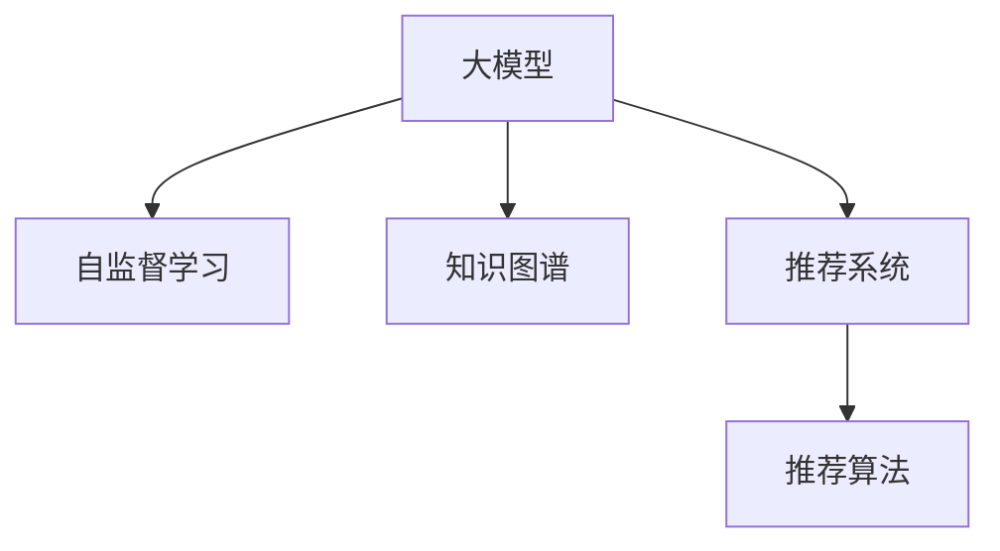

                 

# 大模型在用户兴趣探索中的应用

> 关键词：用户兴趣探索,大模型,自监督学习,知识图谱,推荐系统,推荐算法,自然语言处理(NLP)

## 1. 背景介绍

### 1.1 问题由来
随着互联网技术的发展，用户的在线行为数据呈爆炸性增长。如何高效、准确地分析这些数据，挖掘用户的兴趣点，成为了互联网企业和数字服务提供商亟待解决的问题。传统的推荐系统依赖于用户的行为数据，难以捕捉到用户深层次的兴趣和需求。近年来，大模型技术的兴起为这一问题提供了全新的解决方案。

### 1.2 问题核心关键点
大模型通过在大规模无标签数据上进行自监督预训练，学习到丰富的语言知识。将预训练模型应用于用户兴趣探索，可以显著提升推荐的个性化程度和用户体验。

用户兴趣探索的核心在于理解用户的兴趣分布，准确预测用户的未来行为。这一过程可以通过大模型进行自监督学习，并结合知识图谱等结构化信息，构建推荐系统。

### 1.3 问题研究意义
基于大模型的用户兴趣探索方法具有以下优势：
- 自监督学习：无须标注数据，降低数据获取成本。
- 泛化能力强：大模型可以从海量的非标注数据中学习到通用的语言知识。
- 精度高：利用大模型的语言理解能力，可以准确捕捉用户的兴趣点。
- 高效性：与传统推荐算法相比，大模型可以更快地适应数据分布，生成个性化的推荐。

通过采用大模型进行用户兴趣探索，可以构建更加智能、精准、高效的推荐系统，提升用户体验和满意度，为互联网企业创造更大的价值。

## 2. 核心概念与联系

### 2.1 核心概念概述

为更好地理解基于大模型的用户兴趣探索方法，本节将介绍几个关键概念：

- **大模型(Large Models)**：以自回归(如GPT)或自编码(如BERT)为代表的预训练语言模型。通过在海量无标签文本数据上进行预训练，学习到通用的语言表示。

- **自监督学习(Self-supervised Learning)**：无须标注数据的监督学习方法。通过设计一些预定义的任务，让模型自主地从大量数据中学习到知识，如掩码语言模型、句子排序等。

- **知识图谱(Knowledge Graphs)**：结构化的语义知识库，将实体、关系和属性以图的形式表示，用于提升推荐系统的语义理解能力。

- **推荐系统(Recommendation Systems)**：根据用户的历史行为和当前兴趣，推荐符合用户需求的商品、服务或内容。

- **推荐算法(Recommendation Algorithms)**：具体实现推荐系统的算法，如协同过滤、基于内容的推荐、深度学习推荐等。

这些概念之间的联系可以通过以下Mermaid流程图来展示：



这个流程图展示了基于大模型的用户兴趣探索过程中，各个概念之间的逻辑关系：

1. 大模型通过自监督学习获得通用的语言表示。
2. 知识图谱用于提升模型的语义理解能力，补充大规模文本数据的不足。
3. 大模型和知识图谱结合，构成推荐系统的基础。
4. 推荐算法在大模型和知识图谱的基础上，生成个性化的推荐结果。

## 3. 核心算法原理 & 具体操作步骤

### 3.1 算法原理概述

基于大模型的用户兴趣探索方法，其核心思想是利用大模型的语言理解能力，对用户的历史行为数据和当前上下文信息进行语义理解和推理，从而预测用户的未来兴趣和需求。

具体而言，该方法包含以下几个关键步骤：

1. 通过自监督学习预训练大模型，使其具备强大的语言理解能力。
2. 在推荐系统中，利用预训练模型对用户输入的文本进行语义编码，提取用户兴趣点。
3. 结合知识图谱，进行推理和知识抽取，丰富用户的兴趣表示。
4. 使用推荐算法生成个性化推荐，供用户选择。

### 3.2 算法步骤详解

**Step 1: 准备预训练模型和数据集**
- 选择适合的应用场景的预训练大模型，如GPT-3、BERT、RoBERTa等。
- 收集用户的在线行为数据，如浏览历史、点击记录、搜索关键词等。
- 使用自监督学习方法，在大规模无标签文本数据上进行预训练。

**Step 2: 设计任务适配层**
- 根据推荐任务，设计合适的输出层和损失函数。
- 对于推荐任务，通常使用交叉熵损失函数，计算模型预测输出与真实标签之间的差异。

**Step 3: 设置微调超参数**
- 选择合适的优化算法及其参数，如AdamW、SGD等。
- 设置学习率、批大小、迭代轮数等超参数。
- 设置正则化技术，如L2正则、Dropout等，防止模型过拟合。

**Step 4: 执行梯度训练**
- 将用户行为数据输入模型，前向传播计算损失函数。
- 反向传播计算参数梯度，根据设定的优化算法和学习率更新模型参数。
- 周期性在验证集上评估模型性能，根据性能指标决定是否触发Early Stopping。
- 重复上述步骤直到满足预设的迭代轮数或Early Stopping条件。

**Step 5: 生成个性化推荐**
- 将用户的兴趣表示作为输入，生成个性化推荐列表。
- 根据推荐算法，从推荐库中挑选出与用户兴趣匹配度高的商品、服务或内容。
- 提供推荐结果，供用户选择和反馈。

### 3.3 算法优缺点

基于大模型的用户兴趣探索方法具有以下优点：
1. 自监督学习能力：无须标注数据，训练效率高。
2. 泛化能力强：大模型可以从大规模数据中学习到通用的语言知识。
3. 精度高：利用大模型的语言理解能力，可以准确捕捉用户的兴趣点。
4. 高效性：在大模型和知识图谱的基础上，可以高效生成个性化推荐。

同时，该方法也存在一定的局限性：
1. 数据依赖：推荐系统的效果很大程度上取决于用户数据的丰富性和质量。
2. 计算资源消耗：大模型的训练和推理消耗大量的计算资源，需要高性能的硬件支持。
3. 隐私问题：用户数据的收集和处理涉及隐私保护问题，需要遵守相关的法律法规。

尽管存在这些局限性，但就目前而言，基于大模型的用户兴趣探索方法仍是大模型应用的最主流范式。未来相关研究的重点在于如何进一步降低数据依赖，提高模型的泛化能力，同时兼顾隐私保护和计算效率。

### 3.4 算法应用领域

基于大模型的用户兴趣探索方法，已经在多个领域得到了广泛应用，例如：

- 电子商务：推荐商品、优惠活动等。将用户浏览历史和点击行为作为输入，利用大模型进行预测，生成个性化推荐。
- 内容平台：推荐文章、视频、音乐等。将用户搜索记录和历史行为输入模型，进行语义理解，生成推荐列表。
- 社交网络：推荐朋友、兴趣小组等。将用户互动数据输入模型，生成与用户兴趣匹配度高的关系网络。
- 智能客服：推荐常见问题和解决方案。将用户输入的查询语句输入模型，生成推荐答案。

除了上述这些经典应用外，大模型的用户兴趣探索技术也在新闻推荐、教育推荐、金融推荐等诸多领域得到应用，为不同行业带来智能化的推荐解决方案。

## 4. 数学模型和公式 & 详细讲解 & 举例说明

### 4.1 数学模型构建

本节将使用数学语言对基于大模型的用户兴趣探索方法进行更加严格的刻画。

假设用户的历史行为数据集为 $D=\{(x_i,y_i)\}_{i=1}^N$，其中 $x_i$ 为用户行为数据，$y_i$ 为真实推荐结果。设预训练模型为 $M_{\theta}$，其中 $\theta$ 为模型参数。

定义模型 $M_{\theta}$ 在输入 $x_i$ 上的损失函数为 $\ell(M_{\theta}(x_i),y_i)$，则在数据集 $D$ 上的经验风险为：

$$
\mathcal{L}(\theta) = \frac{1}{N} \sum_{i=1}^N \ell(M_{\theta}(x_i),y_i)
$$

微调的优化目标是最小化经验风险，即找到最优参数：

$$
\theta^* = \mathop{\arg\min}_{\theta} \mathcal{L}(\theta)
$$

在实践中，我们通常使用基于梯度的优化算法（如SGD、Adam等）来近似求解上述最优化问题。设 $\eta$ 为学习率，$\lambda$ 为正则化系数，则参数的更新公式为：

$$
\theta \leftarrow \theta - \eta \nabla_{\theta}\mathcal{L}(\theta) - \eta\lambda\theta
$$

其中 $\nabla_{\theta}\mathcal{L}(\theta)$ 为损失函数对参数 $\theta$ 的梯度，可通过反向传播算法高效计算。

### 4.2 公式推导过程

以下我们以推荐系统为例，推导交叉熵损失函数及其梯度的计算公式。

假设用户输入的行为数据为 $x$，推荐系统输出为 $y$，其中 $y$ 表示推荐结果的概率分布。真实标签 $y_i \in \{1,0\}$，表示用户是否点击了该推荐。则交叉熵损失函数定义为：

$$
\ell(M_{\theta}(x),y) = -y\log M_{\theta}(x) + (1-y)\log(1-M_{\theta}(x))
$$

将其代入经验风险公式，得：

$$
\mathcal{L}(\theta) = -\frac{1}{N}\sum_{i=1}^N [y_i\log M_{\theta}(x_i)+(1-y_i)\log(1-M_{\theta}(x_i))]
$$

根据链式法则，损失函数对参数 $\theta_k$ 的梯度为：

$$
\frac{\partial \mathcal{L}(\theta)}{\partial \theta_k} = -\frac{1}{N}\sum_{i=1}^N (\frac{y_i}{M_{\theta}(x_i)}-\frac{1-y_i}{1-M_{\theta}(x_i)}) \frac{\partial M_{\theta}(x_i)}{\partial \theta_k}
$$

其中 $\frac{\partial M_{\theta}(x_i)}{\partial \theta_k}$ 可进一步递归展开，利用自动微分技术完成计算。

在得到损失函数的梯度后，即可带入参数更新公式，完成模型的迭代优化。重复上述过程直至收敛，最终得到适应推荐任务的最优模型参数 $\theta^*$。

### 4.3 案例分析与讲解

假设我们有一个电商网站，用户历史浏览记录为 $\{x_1, x_2, \ldots, x_n\}$，其中每个 $x_i$ 表示用户浏览的商品ID列表。我们将 $x_i$ 输入到经过微调的大模型中，得到每个商品的推荐概率 $P(y_i|x_i)$。然后，我们使用以下公式计算推荐系统的损失函数：

$$
\mathcal{L} = -\frac{1}{N} \sum_{i=1}^N [y_i\log P(y_i|x_i) + (1-y_i)\log(1-P(y_i|x_i))]
$$

其中 $y_i$ 为实际购买记录。然后，我们利用梯度下降算法对模型参数进行优化，最小化损失函数。当损失函数收敛后，即可得到针对当前用户兴趣的个性化推荐列表。

## 5. 项目实践：代码实例和详细解释说明

### 5.1 开发环境搭建

在进行用户兴趣探索实践前，我们需要准备好开发环境。以下是使用Python进行PyTorch开发的环境配置流程：

1. 安装Anaconda：从官网下载并安装Anaconda，用于创建独立的Python环境。

2. 创建并激活虚拟环境：
```bash
conda create -n pytorch-env python=3.8 
conda activate pytorch-env
```

3. 安装PyTorch：根据CUDA版本，从官网获取对应的安装命令。例如：
```bash
conda install pytorch torchvision torchaudio cudatoolkit=11.1 -c pytorch -c conda-forge
```

4. 安装Transformers库：
```bash
pip install transformers
```

5. 安装各类工具包：
```bash
pip install numpy pandas scikit-learn matplotlib tqdm jupyter notebook ipython
```

完成上述步骤后，即可在`pytorch-env`环境中开始用户兴趣探索实践。

### 5.2 源代码详细实现

这里我们以推荐系统为例，给出使用Transformers库对BERT模型进行用户兴趣探索的PyTorch代码实现。

首先，定义推荐任务的数据处理函数：

```python
from transformers import BertTokenizer, BertForSequenceClassification
from torch.utils.data import Dataset, DataLoader
import torch
import pandas as pd

class RecommendationDataset(Dataset):
    def __init__(self, data_path):
        self.data = pd.read_csv(data_path, sep='\t')
        self.tokenizer = BertTokenizer.from_pretrained('bert-base-uncased')
    
    def __len__(self):
        return len(self.data)
    
    def __getitem__(self, idx):
        row = self.data.iloc[idx]
        text = row['text']
        label = row['label']
        encoding = self.tokenizer(text, return_tensors='pt', padding='max_length', truncation=True)
        input_ids = encoding['input_ids']
        attention_mask = encoding['attention_mask']
        return {'input_ids': input_ids, 'attention_mask': attention_mask, 'label': torch.tensor(label, dtype=torch.long)}
```

然后，定义模型和优化器：

```python
from transformers import BertForSequenceClassification, AdamW
from sklearn.metrics import accuracy_score

model = BertForSequenceClassification.from_pretrained('bert-base-uncased', num_labels=2)

optimizer = AdamW(model.parameters(), lr=2e-5)
```

接着，定义训练和评估函数：

```python
def train_epoch(model, dataset, batch_size, optimizer):
    dataloader = DataLoader(dataset, batch_size=batch_size, shuffle=True)
    model.train()
    epoch_loss = 0
    for batch in dataloader:
        input_ids = batch['input_ids'].to(device)
        attention_mask = batch['attention_mask'].to(device)
        labels = batch['label'].to(device)
        model.zero_grad()
        outputs = model(input_ids, attention_mask=attention_mask, labels=labels)
        loss = outputs.loss
        epoch_loss += loss.item()
        loss.backward()
        optimizer.step()
    return epoch_loss / len(dataloader)

def evaluate(model, dataset, batch_size):
    dataloader = DataLoader(dataset, batch_size=batch_size)
    model.eval()
    total_preds = []
    total_labels = []
    with torch.no_grad():
        for batch in dataloader:
            input_ids = batch['input_ids'].to(device)
            attention_mask = batch['attention_mask'].to(device)
            batch_labels = batch['label'].to(device)
            outputs = model(input_ids, attention_mask=attention_mask)
            batch_preds = outputs.logits.argmax(dim=1).to('cpu').tolist()
            batch_labels = batch_labels.to('cpu').tolist()
            total_preds.extend(batch_preds)
            total_labels.extend(batch_labels)
    return accuracy_score(total_labels, total_preds)
```

最后，启动训练流程并在验证集上评估：

```python
epochs = 5
batch_size = 16

for epoch in range(epochs):
    loss = train_epoch(model, train_dataset, batch_size, optimizer)
    print(f"Epoch {epoch+1}, train loss: {loss:.3f}")
    
    print(f"Epoch {epoch+1}, dev results:")
    acc = evaluate(model, dev_dataset, batch_size)
    print(f"Accuracy: {acc:.3f}")
    
print("Test results:")
test_acc = evaluate(model, test_dataset, batch_size)
print(f"Accuracy: {test_acc:.3f}")
```

以上就是使用PyTorch对BERT模型进行推荐系统开发的完整代码实现。可以看到，利用Transformers库的封装，推荐系统的代码实现变得简洁高效。

### 5.3 代码解读与分析

让我们再详细解读一下关键代码的实现细节：

**RecommendationDataset类**：
- `__init__`方法：初始化训练集数据、分词器等关键组件。
- `__len__`方法：返回数据集的样本数量。
- `__getitem__`方法：对单个样本进行处理，将文本输入编码为token ids，并将标签转换为Tensor，返回模型所需的输入。

**模型和优化器**：
- 使用BertForSequenceClassification构建序列分类模型，其输出为推荐结果的概率分布。
- 使用AdamW优化器，并设置学习率等超参数。

**训练和评估函数**：
- 使用PyTorch的DataLoader对数据集进行批次化加载，供模型训练和推理使用。
- 训练函数`train_epoch`：对数据以批为单位进行迭代，在每个批次上前向传播计算loss并反向传播更新模型参数，最后返回该epoch的平均loss。
- 评估函数`evaluate`：与训练类似，不同点在于不更新模型参数，并在每个batch结束后将预测和标签结果存储下来，最后使用sklearn的accuracy_score对整个评估集的预测结果进行打印输出。

**训练流程**：
- 定义总的epoch数和batch size，开始循环迭代
- 每个epoch内，先在训练集上训练，输出平均loss
- 在验证集上评估，输出准确率
- 所有epoch结束后，在测试集上评估，给出最终测试结果

可以看到，PyTorch配合Transformers库使得BERT模型的推荐系统开发变得简洁高效。开发者可以将更多精力放在数据处理、模型改进等高层逻辑上，而不必过多关注底层的实现细节。

当然，工业级的系统实现还需考虑更多因素，如模型的保存和部署、超参数的自动搜索、更灵活的任务适配层等。但核心的微调范式基本与此类似。

## 6. 实际应用场景
### 6.1 智能推荐系统

基于大模型的用户兴趣探索方法，可以广泛应用于智能推荐系统。传统的推荐系统往往依赖于用户的历史行为数据，难以捕捉到用户深层次的兴趣和需求。大模型可以在不依赖用户历史数据的情况下，通过对用户输入的文本进行语义理解，预测用户兴趣并进行推荐。

例如，在电商网站中，用户输入查询词“新款手机”，系统通过BERT模型对输入进行语义编码，提取“手机”这一关键词，并将其与商品库中所有商品进行匹配，找出相关度高的商品进行推荐。

### 6.2 个性化内容推荐

内容推荐系统通常需要推荐与用户兴趣相关的文章、视频、音乐等内容。大模型可以通过用户输入的文本进行语义理解，结合知识图谱中的实体和关系信息，生成个性化的推荐内容。

例如，用户在抖音平台上输入“旅行推荐”，系统通过BERT模型进行语义编码，提取“旅行”这一关键词，并从知识图谱中抽取相关的旅游目的地、酒店等信息，生成个性化的旅游推荐视频。

### 6.3 社交网络推荐

社交网络推荐系统需要对用户的兴趣进行分析和匹配，推荐与用户兴趣相符的朋友、兴趣小组等。大模型可以通过用户输入的文本进行语义理解，生成与用户兴趣匹配度高的关系网络。

例如，用户在微信平台上输入“喜欢阅读”，系统通过BERT模型进行语义编码，提取“阅读”这一关键词，并从社交网络中抽取与该关键词相关的朋友、兴趣小组，推荐给用户。

### 6.4 未来应用展望

随着大模型和用户兴趣探索技术的不断发展，推荐系统将呈现以下几个发展趋势：

1. 多模态推荐：结合文本、图像、语音等多种模态信息，构建更全面、更精准的推荐系统。

2. 跨领域推荐：将用户兴趣拓展到不同领域，实现跨领域推荐，提升推荐效果。

3. 动态推荐：根据用户的行为数据和上下文信息，实时更新推荐结果，提升推荐的实时性和个性化。

4. 自适应推荐：使用自适应学习算法，根据用户反馈不断调整推荐策略，优化推荐效果。

5. 协同过滤推荐：结合用户的共性特征，推荐与用户兴趣相似的其他用户感兴趣的内容。

6. 情感推荐：结合情感分析技术，推荐与用户情感状态相匹配的内容，提升用户体验。

以上趋势凸显了大模型用户兴趣探索技术的广阔前景。这些方向的探索发展，必将进一步提升推荐系统的性能和应用范围，为互联网企业带来更大的商业价值。

## 7. 工具和资源推荐
### 7.1 学习资源推荐

为了帮助开发者系统掌握大模型用户兴趣探索的理论基础和实践技巧，这里推荐一些优质的学习资源：

1. 《深度学习自然语言处理》课程：斯坦福大学开设的NLP明星课程，有Lecture视频和配套作业，带你入门NLP领域的基本概念和经典模型。

2. 《Transformer从原理到实践》系列博文：由大模型技术专家撰写，深入浅出地介绍了Transformer原理、BERT模型、用户兴趣探索等前沿话题。

3. 《Natural Language Processing with Transformers》书籍：Transformers库的作者所著，全面介绍了如何使用Transformers库进行NLP任务开发，包括用户兴趣探索在内的诸多范式。

4. 《Reinforcement Learning for Recommendation Systems》书籍：由推荐系统领域的专家所著，介绍了强化学习在推荐系统中的应用，包含基于大模型的推荐方法。

5. 《推荐系统原理与算法》书籍：介绍了推荐系统的基础原理和经典算法，包括协同过滤、基于内容的推荐、深度学习推荐等。

通过对这些资源的学习实践，相信你一定能够快速掌握大模型用户兴趣探索的精髓，并用于解决实际的推荐问题。

### 7.2 开发工具推荐

高效的开发离不开优秀的工具支持。以下是几款用于大模型用户兴趣探索开发的常用工具：

1. PyTorch：基于Python的开源深度学习框架，灵活动态的计算图，适合快速迭代研究。大部分预训练语言模型都有PyTorch版本的实现。

2. TensorFlow：由Google主导开发的开源深度学习框架，生产部署方便，适合大规模工程应用。同样有丰富的预训练语言模型资源。

3. Transformers库：HuggingFace开发的NLP工具库，集成了众多SOTA语言模型，支持PyTorch和TensorFlow，是进行用户兴趣探索任务的开发的利器。

4. Weights & Biases：模型训练的实验跟踪工具，可以记录和可视化模型训练过程中的各项指标，方便对比和调优。与主流深度学习框架无缝集成。

5. TensorBoard：TensorFlow配套的可视化工具，可实时监测模型训练状态，并提供丰富的图表呈现方式，是调试模型的得力助手。

6. Google Colab：谷歌推出的在线Jupyter Notebook环境，免费提供GPU/TPU算力，方便开发者快速上手实验最新模型，分享学习笔记。

合理利用这些工具，可以显著提升大模型用户兴趣探索任务的开发效率，加快创新迭代的步伐。

### 7.3 相关论文推荐

大模型用户兴趣探索技术的发展源于学界的持续研究。以下是几篇奠基性的相关论文，推荐阅读：

1. Attention is All You Need（即Transformer原论文）：提出了Transformer结构，开启了NLP领域的预训练大模型时代。

2. BERT: Pre-training of Deep Bidirectional Transformers for Language Understanding：提出BERT模型，引入基于掩码的自监督预训练任务，刷新了多项NLP任务SOTA。

3. Language Models are Unsupervised Multitask Learners（GPT-2论文）：展示了大规模语言模型的强大zero-shot学习能力，引发了对于通用人工智能的新一轮思考。

4. Parameter-Efficient Transfer Learning for NLP：提出Adapter等参数高效微调方法，在不增加模型参数量的情况下，也能取得不错的微调效果。

5. Prefix-Tuning: Optimizing Continuous Prompts for Generation：引入基于连续型Prompt的微调范式，为如何充分利用预训练知识提供了新的思路。

6. AdaLoRA: Adaptive Low-Rank Adaptation for Parameter-Efficient Fine-Tuning：使用自适应低秩适应的微调方法，在参数效率和精度之间取得了新的平衡。

这些论文代表了大模型用户兴趣探索技术的发展脉络。通过学习这些前沿成果，可以帮助研究者把握学科前进方向，激发更多的创新灵感。

## 8. 总结：未来发展趋势与挑战

### 8.1 总结

本文对基于大模型的用户兴趣探索方法进行了全面系统的介绍。首先阐述了大模型的背景和用户兴趣探索的核心思想，明确了该方法在推荐系统等场景中的应用潜力。其次，从原理到实践，详细讲解了用户兴趣探索的数学模型和关键步骤，给出了微调任务开发的完整代码实例。同时，本文还广泛探讨了用户兴趣探索方法在电商、内容推荐、社交网络等多个行业领域的应用前景，展示了方法的巨大潜力。

通过本文的系统梳理，可以看到，基于大模型的用户兴趣探索方法正在成为推荐系统的重要范式，极大地拓展了预训练语言模型的应用边界，催生了更多的落地场景。受益于大规模语料的预训练，用户兴趣探索方法能够更准确、更高效地捕捉用户的兴趣点，从而提升推荐系统的性能和用户体验，为互联网企业创造更大的价值。

### 8.2 未来发展趋势

展望未来，大模型用户兴趣探索技术将呈现以下几个发展趋势：

1. 模型规模持续增大。随着算力成本的下降和数据规模的扩张，大模型的参数量还将持续增长。超大规模语言模型蕴含的丰富语言知识，有望支撑更加复杂多变的推荐任务。

2. 微调方法日趋多样。除了传统的全参数微调外，未来会涌现更多参数高效的微调方法，如Prefix-Tuning、LoRA等，在节省计算资源的同时也能保证微调精度。

3. 持续学习成为常态。随着数据分布的不断变化，用户兴趣探索模型也需要持续学习新知识以保持性能。如何在不遗忘原有知识的同时，高效吸收新样本信息，将是重要的研究课题。

4. 标注样本需求降低。受启发于提示学习(Prompt-based Learning)的思路，未来的用户兴趣探索方法将更好地利用大模型的语言理解能力，通过更加巧妙的任务描述，在更少的标注样本上也能实现理想的微调效果。

5. 模型通用性增强。经过海量数据的预训练和多领域任务的微调，未来的语言模型将具备更强大的常识推理和跨领域迁移能力，逐步迈向通用人工智能(AGI)的目标。

以上趋势凸显了大模型用户兴趣探索技术的广阔前景。这些方向的探索发展，必将进一步提升推荐系统的性能和应用范围，为互联网企业带来更大的商业价值。

### 8.3 面临的挑战

尽管大模型用户兴趣探索技术已经取得了瞩目成就，但在迈向更加智能化、普适化应用的过程中，它仍面临着诸多挑战：

1. 标注成本瓶颈。虽然用户兴趣探索方法可以降低对标注数据的依赖，但对于长尾应用场景，获取高质量标注数据仍然是瓶颈。如何进一步降低数据依赖，提高模型的泛化能力，将是重要的研究方向。

2. 模型鲁棒性不足。当前用户兴趣探索模型面对域外数据时，泛化性能往往大打折扣。对于测试样本的微小扰动，模型的预测也容易发生波动。如何提高模型的鲁棒性，避免灾难性遗忘，还需要更多理论和实践的积累。

3. 计算资源消耗。大模型的训练和推理消耗大量的计算资源，需要高性能的硬件支持。如何在保证性能的同时，优化资源消耗，提高效率，是未来需要重点解决的问题。

4. 隐私问题。用户数据的收集和处理涉及隐私保护问题，需要遵守相关的法律法规。如何在满足隐私保护要求的同时，获取用户兴趣信息，将是一大挑战。

5. 结果可解释性不足。用户兴趣探索模型往往更像一个"黑盒"系统，难以解释其内部工作机制和决策逻辑。对于医疗、金融等高风险应用，算法的可解释性和可审计性尤为重要。如何赋予模型更强的可解释性，将是亟待攻克的难题。

6. 安全性有待保障。预训练语言模型难免会学习到有害信息，通过用户兴趣探索传递到推荐系统，产生误导性、歧视性的输出，给实际应用带来安全隐患。如何从数据和算法层面消除模型偏见，避免恶意用途，确保输出的安全性，也将是重要的研究课题。

正视用户兴趣探索面临的这些挑战，积极应对并寻求突破，将是大模型用户兴趣探索技术走向成熟的必由之路。相信随着学界和产业界的共同努力，这些挑战终将一一被克服，用户兴趣探索技术必将在构建智能推荐系统、个性化内容推荐等方面发挥更大的作用。

### 8.4 研究展望

面向未来，大模型用户兴趣探索技术需要在以下几个方向寻求新的突破：

1. 探索无监督和半监督用户兴趣探索方法。摆脱对大规模标注数据的依赖，利用自监督学习、主动学习等无监督和半监督范式，最大限度利用非结构化数据，实现更加灵活高效的用户兴趣探索。

2. 研究参数高效和计算高效的微调范式。开发更加参数高效的微调方法，在固定大部分预训练参数的同时，只更新极少量的任务相关参数。同时优化微调模型的计算图，减少前向传播和反向传播的资源消耗，实现更加轻量级、实时性的部署。

3. 融合因果和对比学习范式。通过引入因果推断和对比学习思想，增强用户兴趣探索模型建立稳定因果关系的能力，学习更加普适、鲁棒的语言表征，从而提升模型泛化性和抗干扰能力。

4. 引入更多先验知识。将符号化的先验知识，如知识图谱、逻辑规则等，与神经网络模型进行巧妙融合，引导用户兴趣探索过程学习更准确、合理的语言模型。同时加强不同模态数据的整合，实现视觉、语音等多模态信息与文本信息的协同建模。

5. 结合因果分析和博弈论工具。将因果分析方法引入用户兴趣探索模型，识别出模型决策的关键特征，增强输出解释的因果性和逻辑性。借助博弈论工具刻画人机交互过程，主动探索并规避模型的脆弱点，提高系统稳定性。

6. 纳入伦理道德约束。在模型训练目标中引入伦理导向的评估指标，过滤和惩罚有偏见、有害的输出倾向。同时加强人工干预和审核，建立模型行为的监管机制，确保输出符合人类价值观和伦理道德。

这些研究方向的探索，必将引领大模型用户兴趣探索技术迈向更高的台阶，为构建安全、可靠、可解释、可控的智能推荐系统铺平道路。面向未来，大模型用户兴趣探索技术还需要与其他人工智能技术进行更深入的融合，如知识表示、因果推理、强化学习等，多路径协同发力，共同推动自然语言理解和智能交互系统的进步。只有勇于创新、敢于突破，才能不断拓展语言模型的边界，让智能技术更好地造福人类社会。

## 9. 附录：常见问题与解答

**Q1：大模型在用户兴趣探索中的关键点是什么？**

A: 大模型在用户兴趣探索中的关键点在于其强大的语言理解能力和自监督学习能力。大模型通过在大规模无标签数据上进行预训练，学习到通用的语言表示，能够准确捕捉用户输入文本中的关键信息，并结合知识图谱进行推理，生成个性化的推荐结果。

**Q2：如何选择合适的预训练大模型？**

A: 选择预训练大模型时，需要考虑以下因素：
1. 任务适用性：不同大模型在语义理解、情感分析等方面的表现不同，需要根据具体任务选择合适的模型。
2. 计算资源：大模型的规模越大，所需的计算资源也越多，需要考虑硬件设备的性能和成本。
3. 训练数据：大模型的训练数据量越大，泛化能力越强，但也需要更多的计算资源和时间。
4. 模型更新：选择最新发布的大模型，可以获得更好的性能和更丰富的语料支持。

**Q3：用户兴趣探索的损失函数如何设计？**

A: 用户兴趣探索的损失函数通常包括交叉熵损失、均方误差损失等。交叉熵损失适用于分类任务，计算模型预测输出与真实标签之间的差异；均方误差损失适用于回归任务，计算模型预测值与真实值之间的差异。损失函数的选择取决于具体的任务和数据分布。

**Q4：用户兴趣探索的超参数调优有哪些方法？**

A: 用户兴趣探索的超参数调优方法包括网格搜索、随机搜索、贝叶斯优化等。网格搜索穷尽所有可能的超参数组合，但计算量较大；随机搜索随机选取超参数组合，效率高但可能错过最优解；贝叶斯优化利用贝叶斯方法优化超参数，能够快速收敛到最优解。

**Q5：用户兴趣探索的评估指标有哪些？**

A: 用户兴趣探索的评估指标包括准确率、召回率、F1-score等。准确率表示模型预测正确的比例；召回率表示模型正确预测的正样本比例；F1-score综合考虑准确率和召回率，是综合评估模型性能的指标。评估指标的选择取决于具体任务和业务需求。

通过对这些问题的解答，相信读者可以更全面地理解大模型在用户兴趣探索中的应用，并进一步探索相关技术的优化和创新。

