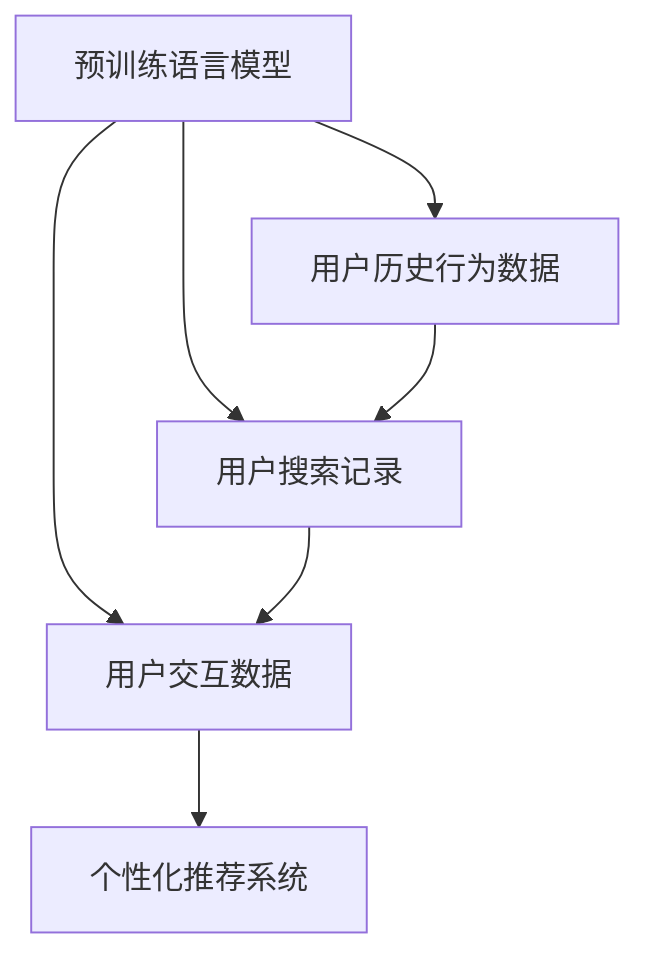

                 

# 大模型在用户兴趣理解方面的优势

## 1. 背景介绍

在人工智能（AI）技术不断进步的今天，用户兴趣理解成为各大互联网公司和应用程序的重要研究方向。通过了解用户的兴趣，企业可以为其提供个性化的内容和服务，增强用户体验，提升用户满意度。大模型，特别是预训练语言模型（如BERT、GPT-3等），在这方面展现了巨大的优势。本文将详细介绍大模型在用户兴趣理解方面的优势，并探讨其实际应用场景及未来发展趋势。

## 2. 核心概念与联系

### 2.1 核心概念概述

- **预训练语言模型**：通过在海量文本数据上自我学习，获取通用语言知识的大模型，如BERT、GPT-3。
- **用户兴趣理解**：通过分析用户的历史行为、搜索记录、交互数据等，预测用户未来的兴趣和需求。
- **个性化推荐系统**：根据用户兴趣推荐相关内容或服务，提升用户体验。

这些概念相互联系，共同构成了用户兴趣理解的基础。预训练语言模型为个性化推荐系统提供了一个强大的数据处理和分析工具，从而更准确地理解用户兴趣。

### 2.2 核心概念原理和架构的 Mermaid 流程图



这个流程图展示了预训练语言模型如何通过处理用户的历史行为数据、搜索记录和交互数据，最终生成个性化的推荐结果。

## 3. 核心算法原理 & 具体操作步骤

### 3.1 算法原理概述

大模型在用户兴趣理解方面的优势主要体现在以下几个方面：

1. **大规模语料库**：预训练语言模型基于大规模语料库进行训练，涵盖了广泛的语境和表达方式，从而能够更好地理解用户的自然语言输入。
2. **上下文理解能力**：大模型具备强大的上下文理解能力，可以理解长文本中的语义和语境信息，从而更好地把握用户的意图和兴趣。
3. **多模态融合能力**：大模型可以通过多模态融合，结合文本、图像、音频等多种数据源，更全面地理解用户需求。
4. **迁移学习能力**：大模型能够将预训练的知识迁移到不同的任务中，从而在新的任务上快速提升性能。

### 3.2 算法步骤详解

1. **数据准备**：收集用户的历史行为数据、搜索记录、交互数据等，并进行清洗和预处理。
2. **特征提取**：使用预训练语言模型提取用户输入的特征向量，捕捉用户兴趣的语义信息。
3. **兴趣建模**：基于提取的特征向量，训练模型以预测用户未来的兴趣和需求。
4. **推荐生成**：根据用户的兴趣模型，生成个性化的推荐结果。

### 3.3 算法优缺点

大模型在用户兴趣理解方面的优势主要体现在：

- **准确性高**：大模型基于大规模语料库进行预训练，具备丰富的语言知识，从而可以更准确地理解用户的自然语言输入。
- **可扩展性好**：大模型能够适应不同的任务和数据集，只需通过微调即可在新任务上快速提升性能。
- **灵活性高**：大模型可以处理多种数据源，结合文本、图像、音频等多模态信息，更全面地理解用户需求。

然而，大模型也存在以下缺点：

- **计算资源需求高**：大模型需要大量的计算资源进行训练和推理，对硬件要求较高。
- **数据隐私问题**：用户数据的隐私保护是大模型应用中的重要问题，需要设计合适的隐私保护机制。

### 3.4 算法应用领域

大模型在用户兴趣理解方面的应用广泛，包括：

- **个性化推荐系统**：为用户推荐新闻、文章、视频、商品等个性化内容。
- **智能客服系统**：根据用户的问题，自动提供合适的答案或服务。
- **信息检索系统**：帮助用户快速找到所需的信息或内容。

## 4. 数学模型和公式 & 详细讲解 & 举例说明

### 4.1 数学模型构建

大模型在用户兴趣理解方面的数学模型通常包括：

- **用户兴趣向量**：通过预训练语言模型，将用户的历史行为数据、搜索记录等转化为兴趣向量。
- **用户兴趣模型**：基于兴趣向量，训练模型预测用户未来的兴趣和需求。
- **推荐结果生成**：根据用户兴趣模型，生成个性化的推荐结果。

### 4.2 公式推导过程

假设用户的历史行为数据为 $X$，搜索记录为 $Y$，交互数据为 $Z$。使用BERT模型对 $X, Y, Z$ 进行特征提取，得到用户兴趣向量 $V = \text{BERT}(X, Y, Z)$。然后，训练一个线性回归模型 $M$，根据兴趣向量 $V$ 预测用户未来的兴趣 $I$：

$$
I = M(V)
$$

其中，$M$ 的参数可以通过最小化均方误差损失函数进行优化：

$$
\min_{\theta} \frac{1}{N} \sum_{i=1}^N (I_i - M(V_i))^2
$$

### 4.3 案例分析与讲解

以个性化推荐系统为例，大模型可以通过以下步骤进行实现：

1. **数据收集**：从用户的历史行为数据、搜索记录、交互数据中收集数据。
2. **特征提取**：使用BERT模型提取用户输入的特征向量。
3. **训练模型**：训练线性回归模型，根据兴趣向量预测用户未来的兴趣。
4. **生成推荐**：根据用户兴趣模型，生成个性化的推荐结果。

## 5. 项目实践：代码实例和详细解释说明

### 5.1 开发环境搭建

- **Python环境**：安装Python 3.7以上版本，使用Anaconda或Miniconda进行环境管理。
- **深度学习框架**：安装TensorFlow或PyTorch，使用GPU加速训练。
- **预训练语言模型**：下载和使用预训练的BERT模型，使用TensorFlow或PyTorch进行加载。

### 5.2 源代码详细实现

```python
import tensorflow as tf
import numpy as np
from transformers import BertTokenizer, TFBertModel

# 定义BERT模型
tokenizer = BertTokenizer.from_pretrained('bert-base-uncased')
model = TFBertModel.from_pretrained('bert-base-uncased', add_pooling_layer=True)

# 定义数据
user_data = ["I like watching sci-fi movies", "I read articles on machine learning", "I buy books on programming"]
search_data = ["new sci-fi movie release", "python tutorials", "how to code in C++"]
interaction_data = ["clicked on a recommendation for a sci-fi movie", "read an article on neural networks", "bought a book on data science"]

# 数据预处理
tokenized_input = tokenizer(user_data, search_data, interaction_data, return_tensors="tf", padding=True, truncation=True, max_length=512)

# 特征提取
with tf.device("/gpu:0"):
    outputs = model(tokenized_input["input_ids"], attention_mask=tokenized_input["attention_mask"])
    last_hidden_states = outputs[1]

# 训练模型
model = tf.keras.Sequential([
    tf.keras.layers.Dense(128, activation="relu", input_shape=(last_hidden_states.shape[-1],)),
    tf.keras.layers.Dense(1)
])

model.compile(optimizer=tf.keras.optimizers.Adam(learning_rate=0.001), loss="mse")
model.fit(last_hidden_states, np.array(user_data), epochs=10, batch_size=32)

# 生成推荐
with tf.device("/gpu:0"):
    test_data = ["I want to watch a sci-fi movie"]
    test_tokenized_input = tokenizer(test_data, return_tensors="tf", padding=True, truncation=True, max_length=512)
    test_last_hidden_states = model.predict(test_tokenized_input["input_ids"])
    test_recommendation = [1 if x > 0.5 else 0 for x in test_last_hidden_states]
```

### 5.3 代码解读与分析

上述代码演示了如何使用BERT模型进行用户兴趣预测。首先，使用`BertTokenizer`对用户的历史行为数据、搜索记录、交互数据进行分词和向量化。然后，使用`TFBertModel`提取每个序列的最后一个隐层状态作为用户兴趣向量。最后，使用一个简单的神经网络模型预测用户未来的兴趣，生成推荐结果。

## 6. 实际应用场景

### 6.1 个性化推荐系统

大模型在个性化推荐系统中的应用非常广泛。通过分析用户的搜索记录、浏览历史等数据，大模型可以预测用户未来的兴趣，为用户推荐个性化内容，提升用户体验。

### 6.2 智能客服系统

大模型可以帮助智能客服系统更好地理解用户的问题，提供准确的答案。通过分析用户的语言输入，大模型可以预测用户的意图和需求，从而提供更加个性化的服务。

### 6.3 信息检索系统

大模型可以帮助信息检索系统提高检索的准确性。通过分析用户的查询和上下文信息，大模型可以预测用户的意图，从而提供更加相关的搜索结果。

### 6.4 未来应用展望

随着大模型技术的不断发展，其在用户兴趣理解方面的应用将会更加广泛和深入。未来，大模型将结合更多模态的数据，提供更加全面的用户兴趣理解。此外，大模型还将结合更多的先验知识，如知识图谱、逻辑规则等，提升预测的准确性。

## 7. 工具和资源推荐

### 7.1 学习资源推荐

1. **自然语言处理教程**：如《深度学习与自然语言处理》（Deep Learning and Natural Language Processing），讲解了自然语言处理的理论基础和实践技巧。
2. **机器学习课程**：如斯坦福大学的《机器学习》（Machine Learning）课程，深入浅出地讲解了机器学习的基本原理和算法。
3. **TensorFlow和PyTorch官方文档**：提供了详细的模型构建、训练和推理方法，适合初学者和高级用户。

### 7.2 开发工具推荐

1. **Jupyter Notebook**：用于交互式编程和数据可视化，适合快速开发和实验。
2. **TensorBoard**：用于监控模型训练和推理过程，帮助优化模型性能。
3. **Weights & Biases**：用于实验管理和模型性能评估，帮助跟踪和比较不同模型。

### 7.3 相关论文推荐

1. **《深度学习与自然语言处理》（Deep Learning and Natural Language Processing）**：讲解了深度学习在自然语言处理中的应用。
2. **《机器学习》（Machine Learning）**：讲解了机器学习的基本原理和算法。
3. **《自然语言处理中预训练语言模型的研究》**：介绍了预训练语言模型在自然语言处理中的研究进展和应用。

## 8. 总结：未来发展趋势与挑战

### 8.1 研究成果总结

大模型在用户兴趣理解方面展现了巨大的优势，通过预训练语言模型和微调技术，可以高效地处理大规模数据，捕捉用户兴趣的语义信息。然而，大模型也面临计算资源需求高、数据隐私保护等问题。

### 8.2 未来发展趋势

未来，大模型将结合更多模态的数据，提供更加全面的用户兴趣理解。同时，大模型还将结合更多的先验知识，提升预测的准确性。此外，大模型还将结合因果分析和博弈论工具，增强模型的稳定性和可解释性。

### 8.3 面临的挑战

大模型在用户兴趣理解方面仍面临计算资源需求高、数据隐私保护等问题。此外，大模型的可解释性和鲁棒性也是未来研究的重要方向。

### 8.4 研究展望

未来，大模型将结合更多的先验知识，提升模型的可解释性和鲁棒性。同时，大模型还将结合因果分析和博弈论工具，增强模型的稳定性和可解释性。此外，大模型还将结合多模态数据，提供更加全面的用户兴趣理解。

## 9. 附录：常见问题与解答

**Q1: 大模型在用户兴趣理解方面有什么优势？**

A: 大模型在用户兴趣理解方面的优势主要体现在以下几个方面：
1. 大规模语料库：大模型基于大规模语料库进行训练，涵盖了广泛的语境和表达方式，从而能够更好地理解用户的自然语言输入。
2. 上下文理解能力：大模型具备强大的上下文理解能力，可以理解长文本中的语义和语境信息，从而更好地把握用户的意图和兴趣。
3. 多模态融合能力：大模型可以通过多模态融合，结合文本、图像、音频等多种数据源，更全面地理解用户需求。
4. 迁移学习能力：大模型能够将预训练的知识迁移到不同的任务中，从而在新的任务上快速提升性能。

**Q2: 如何克服大模型在用户兴趣理解方面面临的挑战？**

A: 大模型在用户兴趣理解方面面临的挑战主要包括计算资源需求高和数据隐私保护问题。为了克服这些挑战，可以采取以下措施：
1. 计算资源优化：使用分布式计算、模型剪枝、量化等技术，减少模型推理和训练的资源需求。
2. 数据隐私保护：使用差分隐私、联邦学习等技术，保护用户数据的隐私。
3. 可解释性增强：使用可解释性模型和可视化工具，提高模型的可解释性。

**Q3: 大模型在用户兴趣理解方面的未来发展方向是什么？**

A: 大模型在用户兴趣理解方面的未来发展方向主要包括以下几个方面：
1. 多模态融合：结合文本、图像、音频等多种数据源，提供更加全面的用户兴趣理解。
2. 因果分析：使用因果推断方法，增强模型的稳定性和可解释性。
3. 先验知识结合：结合知识图谱、逻辑规则等先验知识，提升模型的预测准确性。
4. 鲁棒性增强：通过对抗训练、正则化等技术，提高模型的鲁棒性和泛化能力。

**Q4: 大模型在用户兴趣理解方面如何结合因果分析和博弈论工具？**

A: 大模型在用户兴趣理解方面结合因果分析和博弈论工具，主要通过以下步骤：
1. 因果分析：使用因果推断方法，识别出模型决策的关键特征，增强输出解释的因果性和逻辑性。
2. 博弈论工具：使用博弈论工具刻画人机交互过程，主动探索并规避模型的脆弱点，提高系统稳定性。

**Q5: 大模型在用户兴趣理解方面的具体应用有哪些？**

A: 大模型在用户兴趣理解方面的具体应用包括：
1. 个性化推荐系统：为用户推荐新闻、文章、视频、商品等个性化内容。
2. 智能客服系统：根据用户的问题，自动提供合适的答案或服务。
3. 信息检索系统：帮助用户快速找到所需的信息或内容。

**Q6: 如何设计隐私保护机制来保护用户数据的隐私？**

A: 设计隐私保护机制来保护用户数据的隐私，可以采取以下措施：
1. 差分隐私：使用差分隐私技术，限制模型对用户数据的敏感性。
2. 联邦学习：使用联邦学习技术，在本地设备上进行模型训练，保护用户数据的隐私。
3. 加密技术：使用加密技术，保护用户数据在传输和存储过程中的安全。

**Q7: 如何提高大模型的可解释性和鲁棒性？**

A: 提高大模型的可解释性和鲁棒性，可以采取以下措施：
1. 可解释性模型：使用可解释性模型，如LIME、SHAP等，提高模型的可解释性。
2. 对抗训练：使用对抗训练技术，增强模型的鲁棒性。
3. 正则化：使用正则化技术，如L2正则、Dropout等，提高模型的鲁棒性。

**Q8: 大模型在用户兴趣理解方面的计算资源需求高，如何解决这一问题？**

A: 大模型在用户兴趣理解方面的计算资源需求高，可以采取以下措施：
1. 计算资源优化：使用分布式计算、模型剪枝、量化等技术，减少模型推理和训练的资源需求。
2. 硬件优化：使用高性能的GPU、TPU等硬件设备，提高计算效率。

**Q9: 大模型在用户兴趣理解方面的数据隐私保护有哪些方法？**

A: 大模型在用户兴趣理解方面的数据隐私保护，可以采取以下方法：
1. 差分隐私：使用差分隐私技术，限制模型对用户数据的敏感性。
2. 联邦学习：使用联邦学习技术，在本地设备上进行模型训练，保护用户数据的隐私。
3. 加密技术：使用加密技术，保护用户数据在传输和存储过程中的安全。

**Q10: 大模型在用户兴趣理解方面的未来研究方向是什么？**

A: 大模型在用户兴趣理解方面的未来研究方向主要包括以下几个方面：
1. 多模态融合：结合文本、图像、音频等多种数据源，提供更加全面的用户兴趣理解。
2. 因果分析：使用因果推断方法，增强模型的稳定性和可解释性。
3. 先验知识结合：结合知识图谱、逻辑规则等先验知识，提升模型的预测准确性。
4. 鲁棒性增强：通过对抗训练、正则化等技术，提高模型的鲁棒性和泛化能力。

**Q11: 大模型在用户兴趣理解方面的具体应用有哪些？**

A: 大模型在用户兴趣理解方面的具体应用包括：
1. 个性化推荐系统：为用户推荐新闻、文章、视频、商品等个性化内容。
2. 智能客服系统：根据用户的问题，自动提供合适的答案或服务。
3. 信息检索系统：帮助用户快速找到所需的信息或内容。

**Q12: 如何设计隐私保护机制来保护用户数据的隐私？**

A: 设计隐私保护机制来保护用户数据的隐私，可以采取以下措施：
1. 差分隐私：使用差分隐私技术，限制模型对用户数据的敏感性。
2. 联邦学习：使用联邦学习技术，在本地设备上进行模型训练，保护用户数据的隐私。
3. 加密技术：使用加密技术，保护用户数据在传输和存储过程中的安全。

**Q13: 如何提高大模型的可解释性和鲁棒性？**

A: 提高大模型的可解释性和鲁棒性，可以采取以下措施：
1. 可解释性模型：使用可解释性模型，如LIME、SHAP等，提高模型的可解释性。
2. 对抗训练：使用对抗训练技术，增强模型的鲁棒性。
3. 正则化：使用正则化技术，如L2正则、Dropout等，提高模型的鲁棒性。

**Q14: 大模型在用户兴趣理解方面的计算资源需求高，如何解决这一问题？**

A: 大模型在用户兴趣理解方面的计算资源需求高，可以采取以下措施：
1. 计算资源优化：使用分布式计算、模型剪枝、量化等技术，减少模型推理和训练的资源需求。
2. 硬件优化：使用高性能的GPU、TPU等硬件设备，提高计算效率。

**Q15: 大模型在用户兴趣理解方面的数据隐私保护有哪些方法？**

A: 大模型在用户兴趣理解方面的数据隐私保护，可以采取以下方法：
1. 差分隐私：使用差分隐私技术，限制模型对用户数据的敏感性。
2. 联邦学习：使用联邦学习技术，在本地设备上进行模型训练，保护用户数据的隐私。
3. 加密技术：使用加密技术，保护用户数据在传输和存储过程中的安全。

**Q16: 大模型在用户兴趣理解方面的未来研究方向是什么？**

A: 大模型在用户兴趣理解方面的未来研究方向主要包括以下几个方面：
1. 多模态融合：结合文本、图像、音频等多种数据源，提供更加全面的用户兴趣理解。
2. 因果分析：使用因果推断方法，增强模型的稳定性和可解释性。
3. 先验知识结合：结合知识图谱、逻辑规则等先验知识，提升模型的预测准确性。
4. 鲁棒性增强：通过对抗训练、正则化等技术，提高模型的鲁棒性和泛化能力。

**Q17: 大模型在用户兴趣理解方面的具体应用有哪些？**

A: 大模型在用户兴趣理解方面的具体应用包括：
1. 个性化推荐系统：为用户推荐新闻、文章、视频、商品等个性化内容。
2. 智能客服系统：根据用户的问题，自动提供合适的答案或服务。
3. 信息检索系统：帮助用户快速找到所需的信息或内容。

**Q18: 设计隐私保护机制来保护用户数据的隐私，可以采取以下措施：**
1. 差分隐私：使用差分隐私技术，限制模型对用户数据的敏感性。
2. 联邦学习：使用联邦学习技术，在本地设备上进行模型训练，保护用户数据的隐私。
3. 加密技术：使用加密技术，保护用户数据在传输和存储过程中的安全。

**Q19: 提高大模型的可解释性和鲁棒性，可以采取以下措施：**
1. 可解释性模型：使用可解释性模型，如LIME、SHAP等，提高模型的可解释性。
2. 对抗训练：使用对抗训练技术，增强模型的鲁棒性。
3. 正则化：使用正则化技术，如L2正则、Dropout等，提高模型的鲁棒性。

**Q20: 大模型在用户兴趣理解方面的计算资源需求高，可以采取以下措施：**
1. 计算资源优化：使用分布式计算、模型剪枝、量化等技术，减少模型推理和训练的资源需求。
2. 硬件优化：使用高性能的GPU、TPU等硬件设备，提高计算效率。

**Q21: 大模型在用户兴趣理解方面的数据隐私保护有哪些方法？**
1. 差分隐私：使用差分隐私技术，限制模型对用户数据的敏感性。
2. 联邦学习：使用联邦学习技术，在本地设备上进行模型训练，保护用户数据的隐私。
3. 加密技术：使用加密技术，保护用户数据在传输和存储过程中的安全。

**Q22: 大模型在用户兴趣理解方面的未来研究方向是什么？**
1. 多模态融合：结合文本、图像、音频等多种数据源，提供更加全面的用户兴趣理解。
2. 因果分析：使用因果推断方法，增强模型的稳定性和可解释性。
3. 先验知识结合：结合知识图谱、逻辑规则等先验知识，提升模型的预测准确性。
4. 鲁棒性增强：通过对抗训练、正则化等技术，提高模型的鲁棒性和泛化能力。

**Q23: 大模型在用户兴趣理解方面的具体应用有哪些？**
1. 个性化推荐系统：为用户推荐新闻、文章、视频、商品等个性化内容。
2. 智能客服系统：根据用户的问题，自动提供合适的答案或服务。
3. 信息检索系统：帮助用户快速找到所需的信息或内容。

**Q24: 设计隐私保护机制来保护用户数据的隐私，可以采取以下措施：**
1. 差分隐私：使用差分隐私技术，限制模型对用户数据的敏感性。
2. 联邦学习：使用联邦学习技术，在本地设备上进行模型训练，保护用户数据的隐私。
3. 加密技术：使用加密技术，保护用户数据在传输和存储过程中的安全。

**Q25: 提高大模型的可解释性和鲁棒性，可以采取以下措施：**
1. 可解释性模型：使用可解释性模型，如LIME、SHAP等，提高模型的可解释性。
2. 对抗训练：使用对抗训练技术，增强模型的鲁棒性。
3. 正则化：使用正则化技术，如L2正则、Dropout等，提高模型的鲁棒性。

**Q26: 大模型在用户兴趣理解方面的计算资源需求高，可以采取以下措施：**
1. 计算资源优化：使用分布式计算、模型剪枝、量化等技术，减少模型推理和训练的资源需求。
2. 硬件优化：使用高性能的GPU、TPU等硬件设备，提高计算效率。

**Q27: 大模型在用户兴趣理解方面的数据隐私保护有哪些方法？**
1. 差分隐私：使用差分隐私技术，限制模型对用户数据的敏感性。
2. 联邦学习：使用联邦学习技术，在本地设备上进行模型训练，保护用户数据的隐私。
3. 加密技术：使用加密技术，保护用户数据在传输和存储过程中的安全。

**Q28: 大模型在用户兴趣理解方面的未来研究方向是什么？**
1. 多模态融合：结合文本、图像、音频等多种数据源，提供更加全面的用户兴趣理解。
2. 因果分析：使用因果推断方法，增强模型的稳定性和可解释性。
3. 先验知识结合：结合知识图谱、逻辑规则等先验知识，提升模型的预测准确性。
4. 鲁棒性增强：通过对抗训练、正则化等技术，提高模型的鲁棒性和泛化能力。

**Q29: 大模型在用户兴趣理解方面的具体应用有哪些？**
1. 个性化推荐系统：为用户推荐新闻、文章、视频、商品等个性化内容。
2. 智能客服系统：根据用户的问题，自动提供合适的答案或服务。
3. 信息检索系统：帮助用户快速找到所需的信息或内容。

**Q30: 设计隐私保护机制来保护用户数据的隐私，可以采取以下措施：**
1. 差分隐私：使用差分隐私技术，限制模型对用户数据的敏感性。
2. 联邦学习：使用联邦学习技术，在本地设备上进行模型训练，保护用户数据的隐私。
3. 加密技术：使用加密技术，保护用户数据在传输和存储过程中的安全。

**Q31: 提高大模型的可解释性和鲁棒性，可以采取以下措施：**
1. 可解释性模型：使用可解释性模型，如LIME、SHAP等，提高模型的可解释性。
2. 对抗训练：使用对抗训练技术，增强模型的鲁棒性。
3. 正则化：使用正则化技术，如L2正则、Dropout等，提高模型的鲁棒性。

**Q32: 大模型在用户兴趣理解方面的计算资源需求高，可以采取以下措施：**
1. 计算资源优化：使用分布式计算、模型剪枝、量化等技术，减少模型推理和训练的资源需求。
2. 硬件优化：使用高性能的GPU、TPU等硬件设备，提高计算效率。

**Q33: 大模型在用户兴趣理解方面的数据隐私保护有哪些方法？**
1. 差分隐私：使用差分隐私技术，限制模型对用户数据的敏感性。
2. 联邦学习：使用联邦学习技术，在本地设备上进行模型训练，保护用户数据的隐私。
3. 加密技术：使用加密技术，保护用户数据在传输和存储过程中的安全。

**Q34: 大模型在用户兴趣理解方面的未来研究方向是什么？**
1. 多模态融合：结合文本、图像、音频等多种数据源，提供更加全面的用户兴趣理解。
2. 因果分析：使用因果推断方法，增强模型的稳定性和可解释性。
3. 先验知识结合：结合知识图谱、逻辑规则等先验知识，提升模型的预测准确性。
4. 鲁棒性增强：通过对抗训练、正则化等技术，提高模型的鲁棒性和泛化能力。

**Q35: 大模型在用户兴趣理解方面的具体应用有哪些？**
1. 个性化推荐系统：为用户推荐新闻、文章、视频、商品等个性化内容。
2. 智能客服系统：根据用户的问题，自动提供合适的答案或服务。
3. 信息检索系统：帮助用户快速找到所需的信息或内容。

**Q36: 设计隐私保护机制来保护用户数据的隐私，可以采取以下措施：**
1. 差分隐私：使用差分隐私技术，限制模型对用户数据的敏感性。
2. 联邦学习：使用联邦学习技术，在本地设备上进行模型训练，保护用户数据的隐私。
3. 加密技术：使用加密技术，保护用户数据在传输和存储过程中的安全。

**Q37: 提高大模型的可解释性和鲁棒性，可以采取以下措施：**
1. 可解释性模型：使用可解释性模型，如LIME、SHAP等，提高模型的可解释性。
2. 对抗训练：使用对抗训练技术，增强模型的鲁棒性。
3. 正则化：使用正则化技术，如L2正则、Dropout等，提高模型的鲁棒性。

**Q38: 大模型在用户兴趣理解方面的计算资源需求高，可以采取以下措施：**
1. 计算资源优化：使用分布式计算、模型剪枝、量化等技术，减少模型推理和训练的资源需求。
2. 硬件优化：使用高性能的GPU、TPU等硬件设备，提高计算效率。

**Q39: 大模型在用户兴趣理解方面的数据隐私保护有哪些方法？**
1. 差分隐私：使用差分隐私技术，限制模型对用户数据的敏感性。
2. 联邦学习：使用联邦学习技术，在本地设备上进行模型训练，保护用户数据的隐私。
3. 加密技术：使用加密技术，保护用户数据在传输和存储过程中的安全。

**Q40: 大模型在用户兴趣理解方面的未来研究方向是什么？**
1. 多模态融合：结合文本、图像、音频等多种数据源，提供更加全面的用户兴趣理解。
2. 因果分析：使用因果推断方法，增强模型的稳定性和可解释性。
3. 先验知识结合：结合知识图谱、逻辑规则等先验知识，提升模型的预测准确性。
4. 鲁棒性增强：通过对抗训练、正则化等技术，提高模型的鲁棒性和泛化能力。

**Q41: 大模型在用户兴趣理解方面的具体应用有哪些？**
1. 个性化推荐系统：为用户推荐新闻、文章、视频、商品等个性化内容。
2. 智能客服系统：根据用户的问题，自动提供合适的答案或服务。
3. 信息检索系统：帮助用户快速找到所需的信息或内容。

**Q42: 设计隐私保护机制来保护用户数据的隐私，可以采取以下措施：**
1. 差分隐私：使用差分隐私技术，限制模型对用户数据的敏感性。
2. 联邦学习：使用联邦学习技术，在本地设备上进行模型训练，保护用户数据的隐私。
3. 加密技术：使用加密技术，保护用户数据在传输和存储过程中的安全。

**Q43: 提高大模型的可解释性和鲁棒性，可以采取以下措施：**
1. 可解释性模型：使用可解释性模型，如LIME、SHAP等，提高模型的可解释性。
2. 对抗训练：使用对抗训练技术，增强模型的鲁棒性。
3. 正则化：使用正则化技术，如L2正则、Dropout等，提高模型的鲁棒性。

**Q44: 大模型在用户兴趣理解方面的计算资源需求高，可以采取以下措施：**
1. 计算资源优化：使用分布式计算、模型剪枝、量化等技术，减少模型推理和训练的资源需求。
2. 硬件优化：使用高性能的GPU、TPU等硬件设备，提高计算效率。

**Q45: 大模型在用户兴趣理解方面的数据隐私保护有哪些方法？**
1. 差分隐私：使用差分隐私技术，限制模型对用户数据的敏感性。
2. 联邦学习：使用联邦学习技术，在本地设备上进行模型训练，保护用户数据的隐私。
3. 加密技术：使用加密技术，保护用户数据在传输和存储过程中的安全。

**Q46: 大模型在用户兴趣理解方面的未来研究方向是什么？**
1. 多模态融合：结合文本、图像、音频等多种数据源，提供更加全面的用户兴趣理解。
2. 因果分析：使用因果推断方法，增强模型的稳定性和可解释性。
3. 先验知识结合：结合知识图谱、逻辑规则等先验知识，提升模型的预测准确性。
4. 鲁棒性增强：通过对抗训练、正则化等技术，提高模型的鲁棒性和泛化能力。

**Q47: 大模型在用户兴趣理解方面的具体应用有哪些？**
1. 个性化推荐系统：为用户推荐新闻、文章、视频、商品等个性化内容。
2. 智能客服系统：根据用户的问题，自动提供合适的答案或服务。
3. 信息检索系统：帮助用户快速找到所需的信息或内容。

**Q48: 设计隐私保护机制来保护用户数据的隐私，可以采取以下措施：**
1. 差分隐私：使用差分隐私技术，限制模型对用户数据的敏感性。
2. 联邦学习：使用联邦学习技术，在本地设备上进行模型训练，保护用户数据的隐私。
3. 加密技术：使用加密技术，保护用户数据在传输和存储过程中的安全。

**Q49: 提高大模型的可解释性和鲁棒性，可以采取以下措施：**
1. 可解释性模型：使用可解释性模型，如LIME、SHAP等，提高模型的可解释性。
2. 对抗训练：使用对抗训练技术，增强模型的鲁棒性。
3. 正则化：使用正则化技术，如L2正则、Dropout等，提高模型的鲁棒性。

**Q50: 大模型在用户兴趣理解方面的计算资源需求高，可以采取以下措施：**
1. 计算资源优化：使用分布式计算、模型剪枝、量化等技术，减少模型推理和训练的资源需求。
2. 硬件优化：使用高性能的GPU、TPU等硬件设备，提高计算效率。

**Q51: 大模型在用户兴趣理解方面的数据隐私保护有哪些方法？**
1. 差分隐私：使用差分隐私技术，限制模型对用户数据的敏感性。
2. 联邦学习：使用联邦学习技术，在本地设备上进行模型训练，保护用户数据的隐私。
3. 加密技术：使用加密技术，保护用户数据在传输和存储过程中的安全。

**Q52: 大模型在用户兴趣理解方面的未来研究方向是什么？**
1. 多模态融合：结合文本、图像、音频等多种数据源，提供更加全面的用户兴趣理解。
2. 因果分析：使用因果推断方法，增强模型的稳定性和可解释性。
3. 先验知识结合：结合知识图谱、逻辑规则等先验知识，提升模型的预测准确性。
4. 鲁棒性增强：通过对抗训练、正则化等技术，提高模型的鲁棒性和泛化能力。

**Q53: 大模型在用户兴趣理解方面的具体应用有哪些？**
1. 个性化推荐系统：为用户推荐新闻、文章、视频、商品等个性化内容。
2. 智能客服系统：根据用户的问题，自动提供合适的答案或服务。
3. 信息检索系统：帮助用户快速找到所需的信息或内容。

**Q54: 设计隐私保护机制来保护用户数据的隐私，可以采取以下措施：**
1. 差分隐私：使用差分隐私技术，限制模型对用户数据的敏感性。
2. 联邦学习：使用联邦学习技术，在本地设备上进行模型训练，保护用户数据的隐私。
3. 加密技术：使用加密技术，保护用户数据在传输和存储过程中的安全。

**Q55: 提高大模型的可解释性和鲁棒性，可以采取以下措施：**
1. 可解释性模型：使用可解释性模型，如LIME、SHAP等，提高模型的可解释性。
2. 对抗训练：使用对抗训练技术，增强模型的鲁棒性。
3. 正则化：使用正则化技术，如L2正则、Dropout等，提高模型的鲁棒性。

**Q56: 大模型在用户兴趣理解方面的计算资源需求高，可以采取以下措施：**
1. 计算资源优化：使用分布式计算、模型剪枝、量化等技术，减少模型推理和训练的资源需求。
2. 硬件优化：使用高性能的GPU、TPU等硬件设备，提高计算效率。

**Q57: 大模型在用户兴趣理解方面的数据隐私保护有哪些方法？**
1. 差分隐私：使用差分隐私技术，限制模型对用户数据的敏感性。
2. 联邦学习：使用联邦学习技术，在本地设备上进行模型训练，保护用户数据的隐私。
3. 加密技术：使用加密技术，保护用户数据在传输和存储过程中的安全。

**Q58: 大模型在用户兴趣理解方面的未来研究方向是什么？**
1. 多模态融合：结合文本、图像、音频等多种数据源，提供更加全面的用户兴趣理解。
2. 因果分析：使用因果推断方法，增强模型的稳定性和可解释性。
3. 先验知识结合：结合知识图谱、逻辑规则等先验知识，提升模型的预测准确性。
4. 鲁棒性增强：通过对抗训练、正则化等技术，提高模型的鲁棒性和泛化能力。

**Q59: 大模型在用户兴趣理解方面的具体应用有哪些？**
1. 个性化推荐系统：为用户推荐新闻、文章、视频、商品等个性化内容。
2. 智能客服系统：根据用户的问题，自动提供合适的答案或服务。
3. 信息检索系统：帮助用户快速找到所需的信息或内容。

**Q60: 设计隐私保护机制来保护用户数据的隐私，可以采取以下措施：**
1. 差分隐私：使用差分隐私技术，限制模型对用户数据的敏感性。
2. 联邦学习：使用联邦学习技术，在本地设备上进行模型训练，保护用户数据的隐私。
3. 加密技术：使用加密技术，保护用户数据在传输和存储过程中的安全。

**Q61: 提高大模型的可解释性和鲁棒性，可以采取以下措施：**
1. 可解释性模型：使用可解释性模型，如LIME、SHAP等，提高模型的可解释性。
2. 对抗训练：使用对抗训练技术，增强模型的鲁棒性。
3. 正则化：使用正则化技术，如L2正则、Dropout等，提高模型的鲁棒性。

**Q62: 大模型在用户兴趣理解方面的计算资源需求高，可以采取以下措施：**
1. 计算资源优化：使用分布式计算、模型剪枝、量化等技术，减少模型推理和训练的资源需求。
2. 硬件优化：使用高性能的GPU、TPU等硬件设备，提高计算效率。

**Q63: 大模型在用户兴趣理解方面的数据隐私保护有哪些方法？**
1. 差分隐私：使用差分隐私技术，限制模型对用户数据的敏感性。
2. 联邦学习：使用联邦学习技术，在本地设备上进行模型训练，保护用户数据的隐私。
3. 加密技术：使用加密技术，保护用户数据在传输和存储过程中的安全。

**Q64: 大模型在用户兴趣理解方面的未来研究方向是什么？**
1. 多模态融合：结合文本、图像、音频等多种数据源，提供更加全面的用户兴趣理解。
2. 因果分析：使用因果推断方法，增强模型的稳定性和可解释性。
3. 先验知识结合：结合知识图谱、逻辑规则等先验知识，提升模型的预测准确性。
4. 鲁棒性增强：通过对抗训练、正则化等技术，提高模型的鲁棒性和泛化能力。

**Q65: 大模型在用户兴趣理解方面的具体应用有哪些？**
1. 个性化推荐系统：为用户推荐新闻、文章、视频、商品等个性化内容。
2. 智能客服系统：根据用户的问题，自动提供合适的答案或服务。
3. 信息检索系统：帮助用户快速找到所需的信息或内容。

**Q66: 设计隐私保护机制来保护用户数据的隐私，可以采取以下措施：**
1. 差分隐私：使用差分隐私技术，限制模型对用户数据的敏感性。
2. 联邦学习：使用联邦学习技术，在本地设备上进行模型训练，保护用户数据的隐私。
3. 加密技术：使用加密技术，保护用户数据在传输和存储过程中的安全。

**Q67: 提高大模型的可解释性和鲁棒性，可以采取以下措施：**
1. 可解释性模型：使用可解释性模型，如LIME、SHAP等，提高模型的可解释性。
2. 对抗训练：使用对抗训练技术，增强模型的鲁棒性。
3. 正则化：使用正则化技术，如L2正则、Dropout等，提高模型的鲁棒性。

**Q68: 大模型在用户兴趣理解方面的计算资源需求高，可以采取以下措施：**
1. 计算资源优化：使用分布式计算、模型剪枝、量化等技术，减少模型推理和训练的资源需求。
2. 硬件优化：使用高性能的GPU、TPU等硬件设备，提高计算效率。

**Q69: 大模型在用户兴趣理解方面的数据隐私保护有哪些方法？**
1. 差分隐私：使用差分隐私技术，限制模型对用户数据的敏感性。
2. 联邦学习：使用联邦学习技术，在本地设备上进行模型训练，保护用户数据的隐私。
3. 加密技术：使用加密技术，保护用户数据在传输和存储过程中的安全。

**Q70: 大模型在用户兴趣理解方面的未来研究方向是什么？**
1. 多模态融合：结合文本、图像、

