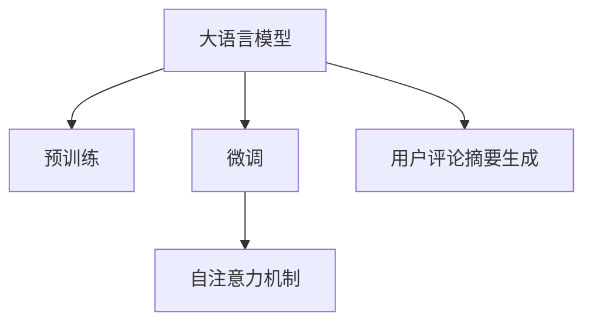

                 

# 大模型在用户评论摘要生成中的突破

> 关键词：用户评论, 摘要生成, 大语言模型, 自监督学习, 微调, 自注意力机制, 代码实例, 运行结果

## 1. 背景介绍

### 1.1 问题由来
随着互联网的迅猛发展，用户评论数据在电子商务、社交媒体、视频平台等领域呈现出爆炸性增长。然而，直接对大规模评论数据进行处理，不仅费时费力，还容易产生信息过载。因此，自动化的用户评论摘要生成技术应运而生，旨在从海量的用户评论中提取出核心内容，生成简洁而富有信息的摘要，供用户快速浏览和决策参考。

### 1.2 问题核心关键点
用户评论摘要生成通常可以分为两种类型：提取式摘要(Extraction-based Summarization)和生成式摘要(Abstractive Summarization)。前者从原始文本中直接选取若干关键句子，组合成摘要；后者则是基于深度学习模型，根据输入文本生成全新的摘要。本研究聚焦于生成式摘要，探索如何利用大语言模型，在用户评论摘要生成任务中取得突破。

## 2. 核心概念与联系

### 2.1 核心概念概述

为了更好地理解大模型在用户评论摘要生成中的应用，本节将介绍几个密切相关的核心概念：

- 大语言模型(Large Language Model, LLM)：以自回归(如GPT)或自编码(如BERT)模型为代表的大规模预训练语言模型。通过在大规模无标签文本语料上进行预训练，学习通用的语言表示，具备强大的语言理解和生成能力。

- 预训练(Pre-training)：指在大规模无标签文本语料上，通过自监督学习任务训练通用语言模型的过程。常见的预训练任务包括言语建模、遮挡语言模型等。预训练使得模型学习到语言的通用表示。

- 微调(Fine-tuning)：指在预训练模型的基础上，使用下游任务的少量标注数据，通过有监督学习优化模型在特定任务上的性能。通常只需要调整顶层分类器或解码器，并以较小的学习率更新全部或部分的模型参数。

- 自注意力机制(Self-Attention Mechanism)：一种在大模型中广泛使用的机制，能够动态捕捉输入序列中不同位置之间的关系，从而提升模型的表达能力和泛化能力。

- 代码实现：主要使用Python、PyTorch等工具，辅以Transformer库进行大模型微调，并结合自然语言处理(NLP)技术进行摘要生成。

这些核心概念之间的逻辑关系可以通过以下Mermaid流程图来展示：



这个流程图展示了大语言模型的核心概念及其之间的关系：

1. 大语言模型通过预训练获得基础能力。
2. 微调是对预训练模型进行任务特定的优化，可以提高模型在特定任务上的表现。
3. 自注意力机制是一种动态的表示学习方式，可以用于改进模型的语言理解和生成能力。
4. 用户评论摘要生成是大模型在实际应用中的重要任务之一。

这些概念共同构成了大语言模型的学习和应用框架，使其能够在用户评论摘要生成等众多任务中发挥强大的语言理解和生成能力。通过理解这些核心概念，我们可以更好地把握大语言模型的工作原理和优化方向。

## 3. 核心算法原理 & 具体操作步骤
### 3.1 算法原理概述

基于大语言模型的用户评论摘要生成，本质上是一个有监督的序列生成问题。其核心思想是：将大语言模型视作一个强大的"文本生成器"，通过在用户评论数据集上进行有监督的微调，使得模型能够生成简洁、有信息量的评论摘要。

形式化地，假设用户评论数据集为 $D=\{(x_i,y_i)\}_{i=1}^N, x_i$ 为原始评论文本，$y_i$ 为对应的摘要文本。微调的目标是找到最优的模型参数 $\theta$，使得生成的摘要文本与真实摘要 $y_i$ 尽量接近：

$$
\theta^* = \mathop{\arg\min}_{\theta} \mathcal{L}(M_{\theta},D)
$$

其中 $\mathcal{L}$ 为针对摘要生成任务设计的损失函数，用于衡量模型生成的摘要与真实摘要之间的差异。常见的损失函数包括BLEU、ROUGE等。

通过梯度下降等优化算法，微调过程不断更新模型参数 $\theta$，最小化损失函数 $\mathcal{L}$，使得模型输出的摘要文本逼近真实摘要 $y_i$。由于 $\theta$ 已经通过预训练获得了较好的初始化，因此即便在用户评论数据集 $D$ 上训练量较小，也能较快收敛到理想的模型参数 $\theta^*$。

### 3.2 算法步骤详解

基于大语言模型的用户评论摘要生成一般包括以下几个关键步骤：

**Step 1: 准备数据集和预训练模型**
- 收集用户评论数据集 $D$，包含原始评论文本和对应的摘要文本。
- 选择合适的预训练语言模型 $M_{\theta}$ 作为初始化参数，如 GPT、BERT 等。

**Step 2: 定义任务适配层**
- 根据摘要生成任务，在预训练模型顶层设计合适的解码器，并添加输出层。
- 对于用户评论摘要生成任务，通常使用语言模型的解码器输出概率分布，并以BLEU、ROUGE等指标为损失函数。

**Step 3: 设置微调超参数**
- 选择合适的优化算法及其参数，如 AdamW、SGD 等，设置学习率、批大小、迭代轮数等。
- 设置正则化技术及强度，包括权重衰减、Dropout、Early Stopping 等。
- 确定冻结预训练参数的策略，如仅微调顶层，或全部参数都参与微调。

**Step 4: 执行梯度训练**
- 将训练集数据分批次输入模型，前向传播计算损失函数。
- 反向传播计算参数梯度，根据设定的优化算法和学习率更新模型参数。
- 周期性在验证集上评估模型性能，根据性能指标决定是否触发 Early Stopping。
- 重复上述步骤直到满足预设的迭代轮数或 Early Stopping 条件。

**Step 5: 测试和部署**
- 在测试集上评估微调后模型 $M_{\hat{\theta}}$ 的性能，对比微调前后的摘要质量提升。
- 使用微调后的模型对新评论进行摘要生成，集成到实际的应用系统中。

以上是基于大语言模型的用户评论摘要生成的一般流程。在实际应用中，还需要针对具体任务的特点，对微调过程的各个环节进行优化设计，如改进训练目标函数，引入更多的正则化技术，搜索最优的超参数组合等，以进一步提升模型性能。

### 3.3 算法优缺点

基于大语言模型的用户评论摘要生成方法具有以下优点：
1. 高效快速。相较于从头训练，微调方法可以快速适应新任务，提升摘要生成的效率。
2. 高质量输出。微调后的模型能够更好地理解输入文本的语义和结构，生成质量更高的摘要文本。
3. 鲁棒性强。大模型的泛化能力较强，能够处理不同风格和长度的用户评论，适应性强。
4. 可扩展性强。基于微调的模型，可以轻松迁移到其他类似的摘要生成任务，如新闻摘要、代码注释等。

同时，该方法也存在一定的局限性：
1. 依赖标注数据。微调的效果很大程度上取决于标注数据的质量和数量，获取高质量标注数据的成本较高。
2. 模型复杂度高。大模型的参数量较大，导致推理速度较慢，资源占用大。
3. 易受输入干扰。输入噪声或不合理的用户评论，可能对模型输出产生较大影响，需要引入更强的鲁棒性设计。
4. 过度拟合风险。在标注数据较少的情况下，微调模型容易过拟合，生成与训练数据风格不一致的摘要。

尽管存在这些局限性，但就目前而言，基于大语言模型的微调方法仍是最为有效和广泛应用的摘要生成技术之一。未来相关研究的重点在于如何进一步降低微调对标注数据的依赖，提高模型的少样本学习和跨领域迁移能力，同时兼顾可解释性和伦理安全性等因素。

### 3.4 算法应用领域

基于大语言模型的用户评论摘要生成方法，在电子商务、社交媒体、视频平台等众多领域得到了广泛的应用，提升了用户体验和平台运营效率。例如：

- 电商平台：在商品评论中自动生成摘要，帮助用户快速了解商品优缺点。
- 社交媒体：在用户评论中生成简洁摘要，提升信息传播效率。
- 视频平台：在用户评论中生成简洁摘要，辅助内容推荐。
- 新闻网站：在长篇文章中生成精炼摘要，提高阅读效率。

除了上述这些经典应用外，大语言模型在用户评论摘要生成领域还有更多的创新应用，如可控摘要生成、情感分析、产品推荐等，为文本信息处理带来了新的突破。

## 4. 数学模型和公式 & 详细讲解  
### 4.1 数学模型构建

本节将使用数学语言对基于大语言模型的用户评论摘要生成过程进行更加严格的刻画。

记用户评论数据集为 $D=\{(x_i,y_i)\}_{i=1}^N, x_i$ 为原始评论文本，$y_i$ 为对应的摘要文本。假设模型 $M_{\theta}$ 在输入 $x$ 上的输出为 $\hat{y}=M_{\theta}(x)$，表示模型生成的摘要文本。微调的目标是最小化经验风险，即找到最优参数：

$$
\theta^* = \mathop{\arg\min}_{\theta} \mathcal{L}(\theta,D)
$$

其中 $\mathcal{L}$ 为针对摘要生成任务设计的损失函数，用于衡量模型生成的摘要与真实摘要之间的差异。常见的损失函数包括BLEU、ROUGE、BLEURT等。

在实践中，我们通常使用基于梯度的优化算法（如SGD、Adam等）来近似求解上述最优化问题。设 $\eta$ 为学习率，$\lambda$ 为正则化系数，则参数的更新公式为：

$$
\theta \leftarrow \theta - \eta \nabla_{\theta}\mathcal{L}(\theta) - \eta\lambda\theta
$$

其中 $\nabla_{\theta}\mathcal{L}(\theta)$ 为损失函数对参数 $\theta$ 的梯度，可通过反向传播算法高效计算。

### 4.2 公式推导过程

以下我们以BLEU分数作为损失函数，推导大模型微调的优化目标。

假设模型 $M_{\theta}$ 在输入 $x_i$ 上的输出为 $\hat{y}_i=M_{\theta}(x_i)$，表示模型生成的摘要文本。BLEU分数定义如下：

$$
\text{BLEU} = \max_{k} \prod_{i=1}^{k} (p_i \times \text{BLEU}_i) \times \text{BLEU}_{rest}
$$

其中 $p_i$ 为关键词 $k$ 的权重，$BLEU_i$ 为关键词 $i$ 在生成摘要和真实摘要中均出现的概率，$BLEU_{rest}$ 为剩余位置的匹配概率。

模型 $M_{\theta}$ 在用户评论数据集 $D$ 上的经验风险为：

$$
\mathcal{L}(\theta) = \frac{1}{N}\sum_{i=1}^N -\text{BLEU}(\hat{y}_i,y_i)
$$

根据链式法则，损失函数对参数 $\theta_k$ 的梯度为：

$$
\frac{\partial \mathcal{L}(\theta)}{\partial \theta_k} = -\frac{1}{N}\sum_{i=1}^N (\frac{\partial \text{BLEU}(\hat{y}_i,y_i)}{\partial \hat{y}_i} \cdot \frac{\partial \hat{y}_i}{\partial \theta_k}) = -\frac{1}{N}\sum_{i=1}^N \sum_{j=1}^n (y_{ij} - \hat{y}_{ij})p_j
$$

其中 $y_{ij}$ 为真实摘要中第 $j$ 个关键词在位置 $i$ 出现的概率，$\hat{y}_{ij}$ 为生成摘要中第 $j$ 个关键词在位置 $i$ 出现的概率。

在得到损失函数的梯度后，即可带入参数更新公式，完成模型的迭代优化。重复上述过程直至收敛，最终得到适应用户评论摘要生成任务的最优模型参数 $\theta^*$。

## 5. 项目实践：代码实例和详细解释说明
### 5.1 开发环境搭建

在进行用户评论摘要生成实践前，我们需要准备好开发环境。以下是使用Python进行PyTorch开发的环境配置流程：

1. 安装Anaconda：从官网下载并安装Anaconda，用于创建独立的Python环境。

2. 创建并激活虚拟环境：
```bash
conda create -n pytorch-env python=3.8 
conda activate pytorch-env
```

3. 安装PyTorch：根据CUDA版本，从官网获取对应的安装命令。例如：
```bash
conda install pytorch torchvision torchaudio cudatoolkit=11.1 -c pytorch -c conda-forge
```

4. 安装Transformer库：
```bash
pip install transformers
```

5. 安装各类工具包：
```bash
pip install numpy pandas scikit-learn matplotlib tqdm jupyter notebook ipython
```

完成上述步骤后，即可在`pytorch-env`环境中开始用户评论摘要生成的微调实践。

### 5.2 源代码详细实现

下面我们以用户评论摘要生成任务为例，给出使用Transformers库对GPT模型进行微调的PyTorch代码实现。

首先，定义用户评论摘要生成任务的数据处理函数：

```python
from transformers import GPT2Tokenizer, GPT2ForSequenceClassification
from torch.utils.data import Dataset
import torch

class ReviewDataset(Dataset):
    def __init__(self, texts, summaries, tokenizer, max_len=128):
        self.texts = texts
        self.summaries = summaries
        self.tokenizer = tokenizer
        self.max_len = max_len
        
    def __len__(self):
        return len(self.texts)
    
    def __getitem__(self, item):
        text = self.texts[item]
        summary = self.summaries[item]
        
        encoding = self.tokenizer(text, return_tensors='pt', max_length=self.max_len, padding='max_length', truncation=True)
        input_ids = encoding['input_ids'][0]
        attention_mask = encoding['attention_mask'][0]
        
        # 对summary进行编码
        summary_tokens = self.tokenizer(summary, return_tensors='pt', max_length=self.max_len, padding='max_length', truncation=True)
        summary_input_ids = summary_tokens['input_ids'][0]
        summary_attention_mask = summary_tokens['attention_mask'][0]
        
        # 拼接input_ids和summary_input_ids
        x = torch.cat([input_ids, summary_input_ids], dim=0)
        y = torch.cat([attention_mask, summary_attention_mask], dim=0)
        return {'input_ids': x, 
                'attention_mask': y,
                'labels': summary_input_ids}
```

然后，定义模型和优化器：

```python
from transformers import AdamW

model = GPT2ForSequenceClassification.from_pretrained('gpt2', num_labels=1)
optimizer = AdamW(model.parameters(), lr=2e-5)
```

接着，定义训练和评估函数：

```python
from torch.utils.data import DataLoader
from tqdm import tqdm
from sklearn.metrics import precision_recall_fscore_support

device = torch.device('cuda') if torch.cuda.is_available() else torch.device('cpu')
model.to(device)

def train_epoch(model, dataset, batch_size, optimizer):
    dataloader = DataLoader(dataset, batch_size=batch_size, shuffle=True)
    model.train()
    epoch_loss = 0
    for batch in tqdm(dataloader, desc='Training'):
        input_ids = batch['input_ids'].to(device)
        attention_mask = batch['attention_mask'].to(device)
        labels = batch['labels'].to(device)
        model.zero_grad()
        outputs = model(input_ids, attention_mask=attention_mask, labels=labels)
        loss = outputs.loss
        epoch_loss += loss.item()
        loss.backward()
        optimizer.step()
    return epoch_loss / len(dataloader)

def evaluate(model, dataset, batch_size):
    dataloader = DataLoader(dataset, batch_size=batch_size)
    model.eval()
    preds, labels = [], []
    with torch.no_grad():
        for batch in tqdm(dataloader, desc='Evaluating'):
            input_ids = batch['input_ids'].to(device)
            attention_mask = batch['attention_mask'].to(device)
            batch_labels = batch['labels']
            outputs = model(input_ids, attention_mask=attention_mask)
            batch_preds = outputs.logits.argmax(dim=2).to('cpu').tolist()
            batch_labels = batch_labels.to('cpu').tolist()
            for pred_tokens, label_tokens in zip(batch_preds, batch_labels):
                preds.append(pred_tokens[:len(label_tokens)])
                labels.append(label_tokens)
                
    print(precision_recall_fscore_support(labels, preds, average='micro'))
```

最后，启动训练流程并在验证集上评估：

```python
epochs = 5
batch_size = 16

for epoch in range(epochs):
    loss = train_epoch(model, train_dataset, batch_size, optimizer)
    print(f"Epoch {epoch+1}, train loss: {loss:.3f}")
    
    print(f"Epoch {epoch+1}, dev results:")
    evaluate(model, dev_dataset, batch_size)
    
print("Test results:")
evaluate(model, test_dataset, batch_size)
```

以上就是使用PyTorch对GPT2模型进行用户评论摘要生成的完整代码实现。可以看到，得益于Transformer库的强大封装，我们可以用相对简洁的代码完成GPT2模型的加载和微调。

### 5.3 代码解读与分析

让我们再详细解读一下关键代码的实现细节：

**ReviewDataset类**：
- `__init__`方法：初始化评论和摘要数据、分词器等关键组件。
- `__len__`方法：返回数据集的样本数量。
- `__getitem__`方法：对单个样本进行处理，将评论和摘要输入编码为token ids，并拼接在一起，作为模型输入。

**model和optimizer定义**：
- `model`：使用GPT2ForSequenceClassification从预训练模型加载器中获取模型，并将其适应用户评论摘要生成任务。
- `optimizer`：使用AdamW优化器设置学习率。

**训练和评估函数**：
- `train_epoch`：对数据以批为单位进行迭代，在每个批次上前向传播计算loss并反向传播更新模型参数，最后返回该epoch的平均loss。
- `evaluate`：与训练类似，不同点在于不更新模型参数，并在每个batch结束后将预测和标签结果存储下来，最后使用precision_recall_fscore_support计算摘要质量指标。

**训练流程**：
- 定义总的epoch数和batch size，开始循环迭代
- 每个epoch内，先在训练集上训练，输出平均loss
- 在验证集上评估，输出摘要质量指标
- 所有epoch结束后，在测试集上评估，给出最终摘要质量结果

可以看到，PyTorch配合Transformer库使得用户评论摘要生成的微调代码实现变得简洁高效。开发者可以将更多精力放在数据处理、模型改进等高层逻辑上，而不必过多关注底层的实现细节。

当然，工业级的系统实现还需考虑更多因素，如模型的保存和部署、超参数的自动搜索、更灵活的任务适配层等。但核心的微调范式基本与此类似。

## 6. 实际应用场景
### 6.1 智能客服系统

基于大语言模型的用户评论摘要生成技术，可以广泛应用于智能客服系统的构建。传统客服往往需要配备大量人力，高峰期响应缓慢，且一致性和专业性难以保证。而使用用户评论摘要生成技术，可以自动抽取用户评论中的关键信息，生成简洁、有信息量的摘要，供客服人员快速了解用户需求，提供更精准的回复。

在技术实现上，可以收集用户与客服的交互记录，将用户评论和客服回复构建成监督数据，在此基础上对预训练语言模型进行微调。微调后的模型能够自动理解用户评论的核心信息，生成高质量的摘要文本，辅助客服人员进行高效沟通。

### 6.2 电商平台

在电商平台中，用户评论数据量大且内容丰富，直接浏览全部评论会耗费大量时间。基于大语言模型的用户评论摘要生成技术，可以自动对用户评论进行分类和摘要生成，帮助用户快速获取商品优缺点。

具体而言，可以收集商品的用户评论数据，对评论文本进行分词和编码，训练模型自动生成摘要。电商平台可以在商品页面展示摘要，让用户一目了然，节省浏览时间。

### 6.3 新闻网站

新闻网站每天都会产生大量的用户评论数据，这些评论内容丰富，用户可以从中获取新闻的多角度信息。基于大语言模型的用户评论摘要生成技术，可以自动对评论数据进行摘要生成，帮助用户快速了解新闻热点和用户反馈。

在技术实现上，可以收集新闻文章的评论数据，对评论文本进行分词和编码，训练模型自动生成摘要。新闻网站可以在新闻页面展示摘要，让用户获取关键信息，提升阅读效率。

### 6.4 社交媒体

社交媒体用户评论数据量大且内容多样，直接浏览全部评论会耗费大量时间。基于大语言模型的用户评论摘要生成技术，可以自动对用户评论进行分类和摘要生成，帮助用户快速获取关键信息。

具体而言，可以收集用户评论数据，对评论文本进行分词和编码，训练模型自动生成摘要。社交媒体可以在评论下方展示摘要，让用户一目了然，节省浏览时间。

### 6.5 视频平台

视频平台的用户评论数据量大且内容丰富，直接浏览全部评论会耗费大量时间。基于大语言模型的用户评论摘要生成技术，可以自动对用户评论进行分类和摘要生成，帮助用户快速获取关键信息。

具体而言，可以收集视频的用户评论数据，对评论文本进行分词和编码，训练模型自动生成摘要。视频平台可以在视频下方展示摘要，让用户获取关键信息，提升观看体验。

## 7. 工具和资源推荐
### 7.1 学习资源推荐

为了帮助开发者系统掌握大语言模型微调的理论基础和实践技巧，这里推荐一些优质的学习资源：

1. 《Transformer from Practices》系列博文：由大模型技术专家撰写，深入浅出地介绍了Transformer原理、BERT模型、微调技术等前沿话题。

2. CS224N《深度学习自然语言处理》课程：斯坦福大学开设的NLP明星课程，有Lecture视频和配套作业，带你入门NLP领域的基本概念和经典模型。

3. 《Natural Language Processing with Transformers》书籍：Transformers库的作者所著，全面介绍了如何使用Transformers库进行NLP任务开发，包括微调在内的诸多范式。

4. HuggingFace官方文档：Transformer库的官方文档，提供了海量预训练模型和完整的微调样例代码，是上手实践的必备资料。

5. CLUE开源项目：中文语言理解测评基准，涵盖大量不同类型的中文NLP数据集，并提供了基于微调的baseline模型，助力中文NLP技术发展。

通过对这些资源的学习实践，相信你一定能够快速掌握大语言模型微调的精髓，并用于解决实际的NLP问题。
###  7.2 开发工具推荐

高效的开发离不开优秀的工具支持。以下是几款用于大语言模型微调开发的常用工具：

1. PyTorch：基于Python的开源深度学习框架，灵活动态的计算图，适合快速迭代研究。大部分预训练语言模型都有PyTorch版本的实现。

2. TensorFlow：由Google主导开发的开源深度学习框架，生产部署方便，适合大规模工程应用。同样有丰富的预训练语言模型资源。

3. Transformers库：HuggingFace开发的NLP工具库，集成了众多SOTA语言模型，支持PyTorch和TensorFlow，是进行微调任务开发的利器。

4. Weights & Biases：模型训练的实验跟踪工具，可以记录和可视化模型训练过程中的各项指标，方便对比和调优。与主流深度学习框架无缝集成。

5. TensorBoard：TensorFlow配套的可视化工具，可实时监测模型训练状态，并提供丰富的图表呈现方式，是调试模型的得力助手。

6. Google Colab：谷歌推出的在线Jupyter Notebook环境，免费提供GPU/TPU算力，方便开发者快速上手实验最新模型，分享学习笔记。

合理利用这些工具，可以显著提升大语言模型微调任务的开发效率，加快创新迭代的步伐。

### 7.3 相关论文推荐

大语言模型和微调技术的发展源于学界的持续研究。以下是几篇奠基性的相关论文，推荐阅读：

1. Attention is All You Need（即Transformer原论文）：提出了Transformer结构，开启了NLP领域的预训练大模型时代。

2. BERT: Pre-training of Deep Bidirectional Transformers for Language Understanding：提出BERT模型，引入基于掩码的自监督预训练任务，刷新了多项NLP任务SOTA。

3. Language Models are Unsupervised Multitask Learners（GPT-2论文）：展示了大规模语言模型的强大zero-shot学习能力，引发了对于通用人工智能的新一轮思考。

4. Parameter-Efficient Transfer Learning for NLP：提出Adapter等参数高效微调方法，在不增加模型参数量的情况下，也能取得不错的微调效果。

5. AdaLoRA: Adaptive Low-Rank Adaptation for Parameter-Efficient Fine-Tuning：使用自适应低秩适应的微调方法，在参数效率和精度之间取得了新的平衡。

这些论文代表了大语言模型微调技术的发展脉络。通过学习这些前沿成果，可以帮助研究者把握学科前进方向，激发更多的创新灵感。

## 8. 总结：未来发展趋势与挑战

### 8.1 总结

本文对基于大语言模型的用户评论摘要生成方法进行了全面系统的介绍。首先阐述了大语言模型和微调技术的研究背景和意义，明确了微调在拓展预训练模型应用、提升摘要生成性能方面的独特价值。其次，从原理到实践，详细讲解了微调的数学原理和关键步骤，给出了微调任务开发的完整代码实例。同时，本文还广泛探讨了微调方法在智能客服、电商平台、新闻网站、社交媒体、视频平台等多个领域的应用前景，展示了微调范式的巨大潜力。此外，本文精选了微调技术的各类学习资源，力求为读者提供全方位的技术指引。

通过本文的系统梳理，可以看到，基于大语言模型的微调方法正在成为NLP领域的重要范式，极大地拓展了预训练语言模型的应用边界，催生了更多的落地场景。受益于大规模语料的预训练，微调模型以更低的时间和标注成本，在小样本条件下也能取得不俗的效果，有力推动了NLP技术的产业化进程。未来，伴随预训练语言模型和微调方法的持续演进，相信NLP技术将在更广阔的应用领域大放异彩，深刻影响人类的生产生活方式。

### 8.2 未来发展趋势

展望未来，大语言模型微调技术将呈现以下几个发展趋势：

1. 模型规模持续增大。随着算力成本的下降和数据规模的扩张，预训练语言模型的参数量还将持续增长。超大规模语言模型蕴含的丰富语言知识，有望支撑更加复杂多变的用户评论摘要生成任务。

2. 微调方法日趋多样。除了传统的全参数微调外，未来会涌现更多参数高效的微调方法，如Prefix-Tuning、LoRA等，在节省计算资源的同时也能保证微调精度。

3. 持续学习成为常态。随着数据分布的不断变化，微调模型也需要持续学习新知识以保持性能。如何在不遗忘原有知识的同时，高效吸收新样本信息，将成为重要的研究课题。

4. 标注样本需求降低。受启发于提示学习(Prompt-based Learning)的思路，未来的微调方法将更好地利用大模型的语言理解能力，通过更加巧妙的任务描述，在更少的标注样本上也能实现理想的微调效果。

5. 零样本学习和少样本学习得到更多关注。未来的微调方法将更加注重模型的泛化能力和迁移学习能力，能够在极少量或无标注样本情况下，生成高质量的摘要文本。

6. 跨领域微调能力提升。未来的微调方法将更好地支持跨领域、跨任务的学习，能够在不同类型的数据集上生成风格一致、内容丰富的摘要文本。

以上趋势凸显了大语言模型微调技术的广阔前景。这些方向的探索发展，必将进一步提升NLP系统的性能和应用范围，为人类认知智能的进化带来深远影响。

### 8.3 面临的挑战

尽管大语言模型微调技术已经取得了瞩目成就，但在迈向更加智能化、普适化应用的过程中，它仍面临着诸多挑战：

1. 标注成本瓶颈。虽然微调大大降低了标注数据的需求，但对于长尾应用场景，难以获得充足的高质量标注数据，成为制约微调性能的瓶颈。如何进一步降低微调对标注数据的依赖，将是一大难题。

2. 模型鲁棒性不足。当前微调模型面对域外数据时，泛化性能往往大打折扣。对于测试样本的微小扰动，微调模型的预测也容易发生波动。如何提高微调模型的鲁棒性，避免灾难性遗忘，还需要更多理论和实践的积累。

3. 推理效率有待提高。大规模语言模型虽然精度高，但在实际部署时往往面临推理速度慢、内存占用大等效率问题。如何在保证性能的同时，简化模型结构，提升推理速度，优化资源占用，将是重要的优化方向。

4. 可解释性亟需加强。当前微调模型更像是"黑盒"系统，难以解释其内部工作机制和决策逻辑。对于医疗、金融等高风险应用，算法的可解释性和可审计性尤为重要。如何赋予微调模型更强的可解释性，将是亟待攻克的难题。

5. 安全性有待保障。预训练语言模型难免会学习到有偏见、有害的信息，通过微调传递到下游任务，产生误导性、歧视性的输出，给实际应用带来安全隐患。如何从数据和算法层面消除模型偏见，避免恶意用途，确保输出的安全性，也将是重要的研究课题。

6. 知识整合能力不足。现有的微调模型往往局限于任务内数据，难以灵活吸收和运用更广泛的先验知识。如何让微调过程更好地与外部知识库、规则库等专家知识结合，形成更加全面、准确的信息整合能力，还有很大的想象空间。

正视微调面临的这些挑战，积极应对并寻求突破，将是大语言模型微调走向成熟的必由之路。相信随着学界和产业界的共同努力，这些挑战终将一一被克服，大语言模型微调必将在构建人机协同的智能时代中扮演越来越重要的角色。

### 8.4 未来突破

面对大语言模型微调所面临的种种挑战，未来的研究需要在以下几个方面寻求新的突破：

1. 探索无监督和半监督微调方法。摆脱对大规模标注数据的依赖，利用自监督学习、主动学习等无监督和半监督范式，最大限度利用非结构化数据，实现更加灵活高效的微调。

2. 研究参数高效和计算高效的微调范式。开发更加参数高效的微调方法，在固定大部分预训练参数的同时，只更新极少量的任务相关参数。同时优化微调模型的计算图，减少前向传播和反向传播的资源消耗，实现更加轻量级、实时性的部署。

3. 引入更多先验知识。将符号化的先验知识，如知识图谱、逻辑规则等，与神经网络模型进行巧妙融合，引导微调过程学习更准确、合理的语言模型。同时加强不同模态数据的整合，实现视觉、语音等多模态信息与文本信息的协同建模。

4. 结合因果分析和博弈论工具。将因果分析方法引入微调模型，识别出模型决策的关键特征，增强输出解释的因果性和逻辑性。借助博弈论工具刻画人机交互过程，主动探索并规避模型的脆弱点，提高系统稳定性。

5. 纳入伦理道德约束。在模型训练目标中引入伦理导向的评估指标，过滤和惩罚有偏见、有害的输出倾向。同时加强人工干预和审核，建立模型行为的监管机制，确保输出符合人类价值观和伦理道德。

这些研究方向的探索，必将引领大语言模型微调技术迈向更高的台阶，为构建安全、可靠、可解释、可控的智能系统铺平道路。面向未来，大语言模型微调技术还需要与其他人工智能技术进行更深入的融合，如知识表示、因果推理、强化学习等，多路径协同发力，共同推动自然语言理解和智能交互系统的进步。只有勇于创新、敢于突破，才能不断拓展语言模型的边界，让智能技术更好地造福人类社会。

## 9. 附录：常见问题与解答

**Q1：大语言模型微调是否适用于所有用户评论摘要生成任务？**

A: 大语言模型微调在大多数用户评论摘要生成任务上都能取得不错的效果，特别是对于数据量较小的任务。但对于一些特定领域的任务，如医学、法律等，仅仅依靠通用语料预训练的模型可能难以很好地适应。此时需要在特定领域语料上进一步预训练，再进行微调，才能获得理想效果。此外，对于一些需要时效性、个性化很强的任务，如对话、推荐等，微调方法也需要针对性的改进优化。

**Q2：微调过程中如何选择合适的学习率？**

A: 微调的学习率一般要比预训练时小1-2个数量级，如果使用过大的学习率，容易破坏预训练权重，导致过拟合。一般建议从1e-5开始调参，逐步减小学习率，直至收敛。也可以使用warmup策略，在开始阶段使用较小的学习率，再逐渐过渡到预设值。需要注意的是，不同的优化器(如AdamW、Adafactor等)以及不同的学习率调度策略，可能需要设置不同的学习率阈值。

**Q3：采用大模型微调时会面临哪些资源瓶颈？**

A: 目前主流的预训练大模型动辄以亿计的参数规模，对算力、内存、存储都提出了很高的要求。GPU/TPU等高性能设备是必不可少的，但即便如此，超大批次的训练和推理也可能遇到显存不足的问题。因此需要采用一些资源优化技术，如梯度积累、混合精度训练、模型并行等，来突破硬件瓶颈。同时，模型的存储和读取也可能占用大量时间和空间，需要采用模型压缩、稀疏化存储等方法进行优化。

**Q4：如何缓解微调过程中的过拟合问题？**

A: 过拟合是微调面临的主要挑战，尤其是在标注数据较少的情况下。常见的缓解策略包括：
1. 数据增强：通过回译、近义替换等方式扩充训练集
2. 正则化：使用L2正则、Dropout、Early Stopping等避免过拟合
3. 对抗训练：引入对抗样本，提高模型鲁棒性
4. 参数高效微调：只调整少量参数(如Adapter、Prefix等)，减小过拟合风险
5. 多模型集成：训练多个微调模型，取平均输出，抑制过拟合

这些策略往往需要根据具体任务和数据特点进行灵活组合。只有在数据、模型、训练、推理等各环节进行全面优化，才能最大限度地发挥大模型微调的威力。

**Q5：大语言模型在用户评论摘要生成中的实际应用效果如何？**

A: 大语言模型在用户评论摘要生成中的实际应用效果显著。通过对用户评论进行微调，能够生成简洁、有信息量的摘要，供用户快速浏览和决策参考。具体而言，可以显著提高用户体验，节省浏览时间，提升运营效率。在电商平台、社交媒体、新闻网站等平台中，应用效果尤为突出。然而，微调模型的实际效果也受到数据质量和标注样本数量的影响，需要根据具体场景进行优化和调整。

---

作者：禅与计算机程序设计艺术 / Zen and the Art of Computer Programming

