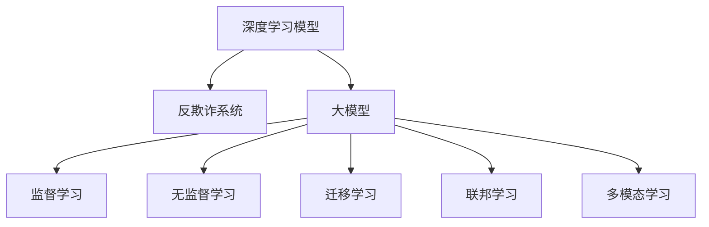

                 

# 大模型在电商平台反欺诈系统中的应用

## 1. 背景介绍

### 1.1 问题由来
随着电子商务市场的迅猛发展，电商平台的用户规模不断扩大，而与之相伴的是交易欺诈行为的日益猖獗。传统的反欺诈手段主要包括规则引擎、黑名单、设备指纹识别等，但由于其基于规则的特征依赖性，往往无法适应不断变化的欺诈手段，且误判率较高，用户体验较差。

近年来，基于深度学习的大模型在自然语言处理、计算机视觉等领域取得了显著的进展，逐渐被引入到电商平台反欺诈系统中，以解决上述问题。大模型通过在大量标注数据上进行预训练，可以学习到丰富的语义和模式，具备较强的泛化能力。利用大模型进行欺诈检测，可以提升检测的准确率和召回率，减少误判和漏判，提升用户体验，同时具有自适应性强的特点。

### 1.2 问题核心关键点
在电商平台反欺诈场景中，大模型主要发挥以下关键作用：

- 模式学习：通过在大规模交易数据上进行预训练，学习交易中的行为模式和特征。
- 特征提取：利用大模型的语言理解能力和模式识别能力，提取交易中的语义和行为特征。
- 实时检测：基于大模型训练得到的检测模型，实时分析交易数据，进行欺诈检测。
- 泛化能力：大模型在未见过的欺诈模式上仍能表现良好，具有良好的泛化能力。
- 模型自适应：通过不断地新交易数据进行微调，更新欺诈检测模型，保持其性能。

## 2. 核心概念与联系

### 2.1 核心概念概述

为更好地理解大模型在电商平台反欺诈系统中的应用，本节将介绍几个密切相关的核心概念：

- 深度学习模型：包括卷积神经网络(CNN)、循环神经网络(RNN)、Transformer等，通过多层次的特征提取和抽象，使得模型可以捕捉复杂的模式和关系。
- 反欺诈系统：利用各种技术手段，如机器学习、深度学习等，对交易数据进行分析和检测，以识别欺诈行为，保护用户和平台安全。
- 大模型：指在大量数据上进行预训练的深度学习模型，如BERT、GPT、XLNet等，能够学习到通用的语言表示和模式，具有较强的泛化能力。
- 监督学习：利用已标注的训练数据，通过学习模型参数，使其对新数据进行预测或分类。
- 无监督学习：利用未标注的数据，通过聚类、降维等方法，发现数据的内在结构和模式。
- 迁移学习：通过在源任务上的预训练，将学习到的知识迁移到目标任务上，减少在新任务上从头训练的成本。
- 联邦学习：在多边分布式环境中，多个参与者共同训练模型，而不需要共享数据，保护隐私的同时提升模型性能。
- 多模态学习：结合多种类型的数据源（如文本、图像、声音等）进行模型训练，提高模型对复杂现实世界的理解能力。

这些核心概念之间的逻辑关系可以通过以下Mermaid流程图来展示：



这个流程图展示了大模型在电商平台反欺诈系统中的应用核心概念及其之间的关系：

1. 深度学习模型通过学习交易数据中的特征和模式，为反欺诈系统提供检测能力。
2. 大模型通过大规模预训练，学习到通用的特征表示，可以更有效地提取交易中的关键信息。
3. 监督学习利用已标注的交易数据，训练反欺诈模型，以识别欺诈行为。
4. 无监督学习利用未标注的交易数据，发现欺诈行为的潜在模式和规律。
5. 迁移学习利用其他任务上的预训练模型，提升反欺诈系统的泛化能力。
6. 联邦学习保护数据隐私的同时，提升模型性能。
7. 多模态学习利用多种类型的数据，增强模型对复杂交易的理解能力。

这些概念共同构成了电商平台反欺诈系统的技术框架，使得大模型在反欺诈检测中发挥强大的作用。

## 3. 核心算法原理 & 具体操作步骤
### 3.1 算法原理概述

电商平台反欺诈系统中的大模型应用，通常基于监督学习的方法进行模型训练。其核心思想是：利用已标注的欺诈交易数据，通过深度学习模型训练得到欺诈检测模型，利用该模型实时检测新交易，以识别欺诈行为。

具体来说，假设已标注的欺诈交易数据集为 $D=\{(x_i,y_i)\}_{i=1}^N$，其中 $x_i$ 为交易数据（可能包括文本描述、商品信息、交易金额等），$y_i$ 为标签（0表示正常交易，1表示欺诈交易）。大模型的任务是训练一个预测函数 $M_{\theta}(x)$，使得 $M_{\theta}(x)$ 能够对新交易数据 $x$ 进行分类，预测其是否为欺诈交易。训练过程通过最小化经验风险来优化模型参数 $\theta$：

$$
\theta^* = \mathop{\arg\min}_{\theta} \mathcal{L}(M_{\theta},D)
$$

其中 $\mathcal{L}$ 为经验风险损失函数，一般使用交叉熵损失或平方误差损失等。

### 3.2 算法步骤详解

基于监督学习的大模型应用于电商平台反欺诈系统，一般包括以下关键步骤：

**Step 1: 准备训练数据集**
- 收集和标注大量交易数据，划分为训练集、验证集和测试集。
- 为文本描述、商品信息等数据进行预处理，如分词、去除停用词、标准化等。
- 将交易金额、商品价格等数值型数据进行归一化处理。

**Step 2: 设计模型架构**
- 选择合适的大模型作为初始化参数，如BERT、XLNet、GPT等。
- 根据交易数据的特点，设计适当的模型架构。如利用Transformer层的自注意力机制提取文本特征，使用卷积层捕捉交易金额和商品价格等数值特征。
- 添加输出层和损失函数，输出层为分类层，损失函数为交叉熵损失或平方误差损失。

**Step 3: 训练模型**
- 使用随机梯度下降等优化算法，对模型进行训练。
- 利用训练集数据，通过反向传播算法计算梯度，更新模型参数。
- 在验证集上评估模型性能，调整超参数如学习率、批大小等。
- 训练至收敛或达到预设迭代次数。

**Step 4: 实时检测**
- 收集新交易数据，输入模型进行检测。
- 根据模型输出结果，判断交易是否为欺诈行为。
- 将检测结果输出至业务系统，执行相应的安全措施。

### 3.3 算法优缺点

大模型应用于电商平台反欺诈系统的监督学习方法，具有以下优点：
1. 泛化能力强：大模型通过在大量数据上进行预训练，学习到通用的特征表示，能够适应多种欺诈模式。
2. 实时检测：利用大模型的推理速度快，能够实时分析新交易，提高检测效率。
3. 自适应性强：随着新交易数据的不断累积，通过微调更新模型，保持模型的性能。
4. 可解释性强：大模型内部的机制透明，能够较好地解释欺诈检测的决策过程。

同时，该方法也存在一定的局限性：
1. 数据需求量大：需要大量的标注数据进行训练，数据获取和标注成本较高。
2. 模型复杂度高：大模型的参数量和计算复杂度较高，对计算资源有较高要求。
3. 过拟合风险：在大规模训练过程中，模型的复杂度较高，容易发生过拟合。
4. 模型解释性差：大模型的内部结构复杂，难以解释其具体的检测逻辑。

尽管存在这些局限性，但就目前而言，基于监督学习的大模型应用于电商平台反欺诈系统的研究已取得显著进展，并广泛应用于各大电商平台。

### 3.4 算法应用领域

大模型在电商平台反欺诈系统中的应用领域非常广泛，包括但不限于：

- 交易欺诈检测：识别假冒账户、虚假交易、恶意刷单等欺诈行为。
- 用户欺诈检测：识别恶意用户、不法分子进行诈骗等行为。
- 交易异常检测：识别交易金额异常、交易时间异常等异常交易行为。
- 产品欺诈检测：识别假冒商品、低劣商品等欺诈行为。
- 物流欺诈检测：识别物流信息篡改、伪造物流记录等欺诈行为。

除了上述这些常见的应用领域，大模型还可以应用于智能风控、智能理赔、智能客服等领域，为电商平台带来更智能、更安全的交易环境。

## 4. 数学模型和公式 & 详细讲解 & 举例说明
### 4.1 数学模型构建

假设电商平台交易数据为 $x_i$，其中包含文本描述、商品信息、交易金额等特征。设 $y_i$ 为交易标签，1表示欺诈交易，0表示正常交易。则反欺诈系统的任务是训练一个分类器 $M_{\theta}(x)$，使得 $M_{\theta}(x)$ 能够对新交易数据 $x$ 进行分类，预测其是否为欺诈交易。

假设使用Transformer模型作为特征提取器，输出为 $z$。则模型预测结果为：

$$
M_{\theta}(x) = \sigma(zW^{(b)})
$$

其中 $W^{(b)}$ 为分类器权重，$\sigma$ 为激活函数，如sigmoid函数。

模型的损失函数为交叉熵损失：

$$
\mathcal{L}(M_{\theta},D) = -\frac{1}{N}\sum_{i=1}^N \sum_{k=0}^1 y_i \log(M_{\theta}(x_i)^k)
$$

其中 $y_i$ 为交易标签，$M_{\theta}(x_i)$ 为模型对交易的预测结果。

### 4.2 公式推导过程

为了推导上述模型的损失函数，我们先对模型的预测结果进行交叉熵损失的计算：

$$
\mathcal{L}_i(M_{\theta},y_i) = -(y_i\log(M_{\theta}(x_i)^1) + (1-y_i)\log(M_{\theta}(x_i)^0))
$$

将其扩展到整个数据集：

$$
\mathcal{L}(M_{\theta},D) = \frac{1}{N}\sum_{i=1}^N \mathcal{L}_i(M_{\theta},y_i)
$$

为了最小化上述损失函数，需要求出模型的梯度。首先对预测结果求偏导数：

$$
\frac{\partial \mathcal{L}_i(M_{\theta},y_i)}{\partial \theta} = -(y_i\frac{\partial M_{\theta}(x_i)^1}{\partial \theta} - (1-y_i)\frac{\partial M_{\theta}(x_i)^0}{\partial \theta})
$$

根据预测结果的公式，可以进一步展开求导：

$$
\frac{\partial M_{\theta}(x_i)^1}{\partial \theta} = \frac{\partial \sigma(zW^{(b)})^1}{\partial \theta} = \frac{\partial (W^{(b)}\sigma(z))^1}{\partial \theta} = W^{(b)}\sigma(z)
$$

$$
\frac{\partial M_{\theta}(x_i)^0}{\partial \theta} = \frac{\partial \sigma(zW^{(b)})^0}{\partial \theta} = \frac{\partial (W^{(b)}\sigma(z))^0}{\partial \theta} = W^{(b)}(1-\sigma(z))
$$

因此，梯度公式为：

$$
\frac{\partial \mathcal{L}_i(M_{\theta},y_i)}{\partial \theta} = -(y_iW^{(b)}\sigma(z) - (1-y_i)W^{(b)}(1-\sigma(z)))
$$

### 4.3 案例分析与讲解

以电商平台中的交易欺诈检测为例，假设交易数据 $x_i$ 为文本描述和商品信息，利用BERT模型提取特征 $z$，并使用分类器 $M_{\theta}(x)$ 进行预测。模型训练过程如下：

1. 数据预处理：收集大量交易数据，进行分词、去除停用词、标准化等处理。
2. 模型构建：选择BERT模型作为特征提取器，添加分类层和损失函数。
3. 模型训练：在训练集上通过梯度下降算法，更新模型参数。
4. 模型评估：在验证集上评估模型性能，调整超参数。
5. 模型部署：将训练好的模型部署到实时检测系统中，实时检测新交易数据。

在实际应用中，大模型可能需要与业务规则引擎结合使用。例如，当模型预测结果与业务规则冲突时，可以进一步引入规则引擎进行二次判断，以提高系统的准确率和召回率。

## 5. 项目实践：代码实例和详细解释说明
### 5.1 开发环境搭建

在进行反欺诈系统开发前，我们需要准备好开发环境。以下是使用Python进行PyTorch开发的环境配置流程：

1. 安装Anaconda：从官网下载并安装Anaconda，用于创建独立的Python环境。

2. 创建并激活虚拟环境：
```bash
conda create -n pytorch-env python=3.8 
conda activate pytorch-env
```

3. 安装PyTorch：根据CUDA版本，从官网获取对应的安装命令。例如：
```bash
conda install pytorch torchvision torchaudio cudatoolkit=11.1 -c pytorch -c conda-forge
```

4. 安装Transformers库：
```bash
pip install transformers
```

5. 安装各类工具包：
```bash
pip install numpy pandas scikit-learn matplotlib tqdm jupyter notebook ipython
```

完成上述步骤后，即可在`pytorch-env`环境中开始反欺诈系统开发。

### 5.2 源代码详细实现

下面我们以电商平台中的交易欺诈检测为例，给出使用Transformers库对BERT模型进行反欺诈检测的PyTorch代码实现。

首先，定义数据处理函数：

```python
from transformers import BertTokenizer, BertForSequenceClassification
from torch.utils.data import Dataset, DataLoader
import torch
from sklearn.metrics import precision_recall_fscore_support

class TransactionDataset(Dataset):
    def __init__(self, texts, labels):
        self.texts = texts
        self.labels = labels
        self.tokenizer = BertTokenizer.from_pretrained('bert-base-uncased')
        
    def __len__(self):
        return len(self.texts)
    
    def __getitem__(self, item):
        text = self.texts[item]
        label = self.labels[item]
        
        encoding = self.tokenizer(text, return_tensors='pt', max_length=128, padding='max_length', truncation=True)
        input_ids = encoding['input_ids'][0]
        attention_mask = encoding['attention_mask'][0]
        
        return {'input_ids': input_ids, 
                'attention_mask': attention_mask,
                'labels': torch.tensor(label, dtype=torch.long)}
```

然后，定义模型和优化器：

```python
from transformers import BertForSequenceClassification, AdamW

model = BertForSequenceClassification.from_pretrained('bert-base-uncased', num_labels=2)
optimizer = AdamW(model.parameters(), lr=2e-5)
```

接着，定义训练和评估函数：

```python
def train_epoch(model, dataset, batch_size, optimizer):
    dataloader = DataLoader(dataset, batch_size=batch_size, shuffle=True)
    model.train()
    epoch_loss = 0
    for batch in dataloader:
        input_ids = batch['input_ids'].to(device)
        attention_mask = batch['attention_mask'].to(device)
        labels = batch['labels'].to(device)
        model.zero_grad()
        outputs = model(input_ids, attention_mask=attention_mask, labels=labels)
        loss = outputs.loss
        epoch_loss += loss.item()
        loss.backward()
        optimizer.step()
    return epoch_loss / len(dataloader)

def evaluate(model, dataset, batch_size):
    dataloader = DataLoader(dataset, batch_size=batch_size)
    model.eval()
    preds, labels = [], []
    with torch.no_grad():
        for batch in dataloader:
            input_ids = batch['input_ids'].to(device)
            attention_mask = batch['attention_mask'].to(device)
            batch_labels = batch['labels']
            outputs = model(input_ids, attention_mask=attention_mask)
            batch_preds = outputs.logits.argmax(dim=1).to('cpu').tolist()
            batch_labels = batch_labels.to('cpu').tolist()
            for pred, label in zip(batch_preds, batch_labels):
                preds.append(pred)
                labels.append(label)
                
    return precision_recall_fscore_support(labels, preds)
```

最后，启动训练流程并在测试集上评估：

```python
epochs = 5
batch_size = 16

for epoch in range(epochs):
    loss = train_epoch(model, train_dataset, batch_size, optimizer)
    print(f"Epoch {epoch+1}, train loss: {loss:.3f}")
    
    print(f"Epoch {epoch+1}, dev results:")
    metrics = evaluate(model, dev_dataset, batch_size)
    print(f"Precision: {metrics[0]:.2f}, Recall: {metrics[1]:.2f}, F1-score: {metrics[2]:.2f}")
    
print("Test results:")
metrics = evaluate(model, test_dataset, batch_size)
print(f"Precision: {metrics[0]:.2f}, Recall: {metrics[1]:.2f}, F1-score: {metrics[2]:.2f}")
```

以上就是使用PyTorch对BERT模型进行交易欺诈检测的完整代码实现。可以看到，利用Transformers库，可以很方便地实现BERT模型的加载和训练，代码简洁高效。

### 5.3 代码解读与分析

让我们再详细解读一下关键代码的实现细节：

**TransactionDataset类**：
- `__init__`方法：初始化文本、标签、分词器等关键组件。
- `__len__`方法：返回数据集的样本数量。
- `__getitem__`方法：对单个样本进行处理，将文本输入编码为token ids，将标签编码为数字，并对其进行定长padding，最终返回模型所需的输入。

**BertForSequenceClassification类**：
- 使用Transformers库提供的预训练BERT模型，并添加分类层和损失函数。
- 分类层为全连接层，损失函数为交叉熵损失。

**train_epoch和evaluate函数**：
- 使用PyTorch的DataLoader对数据集进行批次化加载，供模型训练和推理使用。
- `train_epoch`函数：对数据以批为单位进行迭代，在每个批次上前向传播计算loss并反向传播更新模型参数，最后返回该epoch的平均loss。
- `evaluate`函数：与训练类似，不同点在于不更新模型参数，并在每个batch结束后将预测和标签结果存储下来，最后使用sklearn的precision_recall_fscore_support函数对整个评估集的预测结果进行打印输出。

**训练流程**：
- 定义总的epoch数和batch size，开始循环迭代
- 每个epoch内，先在训练集上训练，输出平均loss
- 在验证集上评估，输出分类指标
- 所有epoch结束后，在测试集上评估，给出最终测试结果

可以看到，PyTorch配合Transformers库使得交易欺诈检测的代码实现变得简洁高效。开发者可以将更多精力放在数据处理、模型改进等高层逻辑上，而不必过多关注底层的实现细节。

当然，工业级的系统实现还需考虑更多因素，如模型的保存和部署、超参数的自动搜索、更灵活的任务适配层等。但核心的训练范式基本与此类似。

## 6. 实际应用场景
### 6.1 智能客服系统

电商平台在反欺诈检测的同时，还可以利用大模型构建智能客服系统，提升客户体验和服务效率。智能客服系统通过学习大量客户咨询记录和对话历史，可以自动理解和回答客户的常见问题，减轻人工客服的负担，提升服务响应速度和质量。

在技术实现上，可以收集客服系统的历史聊天记录，将问题-答案对作为微调数据，训练模型学习匹配答案。微调后的模型能够自动理解客户意图，匹配最合适的答案模板进行回复。对于客户提出的新问题，还可以接入检索系统实时搜索相关内容，动态组织生成回答。如此构建的智能客服系统，能大幅提升客户咨询体验和问题解决效率。

### 6.2 金融舆情监测

金融市场的不稳定性使得反欺诈系统成为金融机构的重要工具，但传统规则引擎难以适应复杂的欺诈模式。利用大模型进行金融舆情监测，可以实时分析社交媒体、新闻、论坛等数据，识别潜在的欺诈风险，提供预警和应对建议。

具体而言，可以收集金融领域相关的新闻、报道、评论等文本数据，并对其进行主题标注和情感标注。在此基础上对预训练语言模型进行微调，使其能够自动判断文本属于何种主题，情感倾向是正面、中性还是负面。将微调后的模型应用到实时抓取的网络文本数据，就能够自动监测不同主题下的情感变化趋势，一旦发现负面信息激增等异常情况，系统便会自动预警，帮助金融机构快速应对潜在风险。

### 6.3 个性化推荐系统

现有的电商平台推荐系统往往只依赖用户的历史行为数据进行物品推荐，无法深入理解用户的真实兴趣偏好。基于大模型的个性化推荐系统，可以更好地挖掘用户行为背后的语义信息，从而提供更精准、多样的推荐内容。

在实践中，可以收集用户浏览、点击、评论、分享等行为数据，提取和用户交互的物品标题、描述、标签等文本内容。将文本内容作为模型输入，用户的后续行为（如是否点击、购买等）作为监督信号，在此基础上微调预训练语言模型。微调后的模型能够从文本内容中准确把握用户的兴趣点。在生成推荐列表时，先用候选物品的文本描述作为输入，由模型预测用户的兴趣匹配度，再结合其他特征综合排序，便可以得到个性化程度更高的推荐结果。

### 6.4 未来应用展望

随着大语言模型和微调方法的不断发展，基于微调范式将在更多领域得到应用，为传统行业带来变革性影响。

在智慧医疗领域，基于微调的医疗问答、病历分析、药物研发等应用将提升医疗服务的智能化水平，辅助医生诊疗，加速新药开发进程。

在智能教育领域，微调技术可应用于作业批改、学情分析、知识推荐等方面，因材施教，促进教育公平，提高教学质量。

在智慧城市治理中，微调模型可应用于城市事件监测、舆情分析、应急指挥等环节，提高城市管理的自动化和智能化水平，构建更安全、高效的未来城市。

此外，在企业生产、社会治理、文娱传媒等众多领域，基于大模型微调的人工智能应用也将不断涌现，为经济社会发展注入新的动力。相信随着技术的日益成熟，微调方法将成为人工智能落地应用的重要范式，推动人工智能技术在垂直行业的规模化落地。总之，微调需要开发者根据具体任务，不断迭代和优化模型、数据和算法，方能得到理想的效果。

## 7. 工具和资源推荐
### 7.1 学习资源推荐

为了帮助开发者系统掌握大模型在电商平台反欺诈系统中的应用，这里推荐一些优质的学习资源：

1. 《深度学习在电商平台中的应用》系列博文：由大模型技术专家撰写，介绍了深度学习在电商平台的多种应用，包括反欺诈系统、推荐系统、智能客服等。

2. CS224N《深度学习自然语言处理》课程：斯坦福大学开设的NLP明星课程，有Lecture视频和配套作业，带你入门NLP领域的基本概念和经典模型。

3. 《Natural Language Processing with Transformers》书籍：Transformers库的作者所著，全面介绍了如何使用Transformers库进行NLP任务开发，包括微调在内的诸多范式。

4. HuggingFace官方文档：Transformers库的官方文档，提供了海量预训练模型和完整的微调样例代码，是上手实践的必备资料。

5. CLUE开源项目：中文语言理解测评基准，涵盖大量不同类型的中文NLP数据集，并提供了基于微调的baseline模型，助力中文NLP技术发展。

通过对这些资源的学习实践，相信你一定能够快速掌握大模型在电商平台反欺诈系统中的应用，并用于解决实际的NLP问题。
###  7.2 开发工具推荐

高效的开发离不开优秀的工具支持。以下是几款用于大模型应用于电商平台反欺诈系统开发的常用工具：

1. PyTorch：基于Python的开源深度学习框架，灵活动态的计算图，适合快速迭代研究。大部分预训练语言模型都有PyTorch版本的实现。

2. TensorFlow：由Google主导开发的开源深度学习框架，生产部署方便，适合大规模工程应用。同样有丰富的预训练语言模型资源。

3. Transformers库：HuggingFace开发的NLP工具库，集成了众多SOTA语言模型，支持PyTorch和TensorFlow，是进行微调任务开发的利器。

4. Weights & Biases：模型训练的实验跟踪工具，可以记录和可视化模型训练过程中的各项指标，方便对比和调优。与主流深度学习框架无缝集成。

5. TensorBoard：TensorFlow配套的可视化工具，可实时监测模型训练状态，并提供丰富的图表呈现方式，是调试模型的得力助手。

6. Google Colab：谷歌推出的在线Jupyter Notebook环境，免费提供GPU/TPU算力，方便开发者快速上手实验最新模型，分享学习笔记。

合理利用这些工具，可以显著提升大模型应用于电商平台反欺诈系统的开发效率，加快创新迭代的步伐。

### 7.3 相关论文推荐

大模型和微调技术的发展源于学界的持续研究。以下是几篇奠基性的相关论文，推荐阅读：

1. Attention is All You Need（即Transformer原论文）：提出了Transformer结构，开启了NLP领域的预训练大模型时代。

2. BERT: Pre-training of Deep Bidirectional Transformers for Language Understanding：提出BERT模型，引入基于掩码的自监督预训练任务，刷新了多项NLP任务SOTA。

3. Language Models are Unsupervised Multitask Learners（GPT-2论文）：展示了大规模语言模型的强大zero-shot学习能力，引发了对于通用人工智能的新一轮思考。

4. Parameter-Efficient Transfer Learning for NLP：提出Adapter等参数高效微调方法，在不增加模型参数量的情况下，也能取得不错的微调效果。

5. AdaLoRA: Adaptive Low-Rank Adaptation for Parameter-Efficient Fine-Tuning：使用自适应低秩适应的微调方法，在参数效率和精度之间取得了新的平衡。

这些论文代表了大模型微调技术的发展脉络。通过学习这些前沿成果，可以帮助研究者把握学科前进方向，激发更多的创新灵感。

## 8. 总结：未来发展趋势与挑战
### 8.1 总结

本文对大模型在电商平台反欺诈系统中的应用进行了全面系统的介绍。首先阐述了大模型和微调技术的研究背景和意义，明确了其在反欺诈检测中的独特价值。其次，从原理到实践，详细讲解了监督学习的数学原理和关键步骤，给出了微调任务开发的完整代码实例。同时，本文还广泛探讨了微调方法在智能客服、金融舆情、个性化推荐等多个行业领域的应用前景，展示了微调范式的巨大潜力。此外，本文精选了微调技术的各类学习资源，力求为读者提供全方位的技术指引。

通过本文的系统梳理，可以看到，大模型在电商平台反欺诈系统中的应用，通过微调技术取得了显著的性能提升，有效解决了传统反欺诈系统的不足，推动了电商平台反欺诈技术的进步。未来，伴随大模型的不断演进和微调技术的持续优化，电商平台反欺诈系统必将在保障用户和平台安全方面发挥越来越重要的作用。

### 8.2 未来发展趋势

展望未来，大模型在电商平台反欺诈系统中的应用将呈现以下几个发展趋势：

1. 模型规模持续增大。随着算力成本的下降和数据规模的扩张，预训练语言模型的参数量还将持续增长。超大规模语言模型蕴含的丰富语言知识，有望支撑更加复杂多变的反欺诈检测任务。

2. 微调方法日趋多样。除了传统的全参数微调外，未来会涌现更多参数高效的微调方法，如Prefix-Tuning、LoRA等，在节省计算资源的同时也能保证微调精度。

3. 持续学习成为常态。随着新交易数据的不断累积，微调模型需要持续学习新知识以保持性能。如何在不遗忘原有知识的同时，高效吸收新样本信息，将成为重要的研究课题。

4. 标注样本需求降低。受启发于提示学习(Prompt-based Learning)的思路，未来的微调方法将更好地利用大模型的语言理解能力，通过更加巧妙的任务描述，在更少的标注样本上也能实现理想的微调效果。

5. 模型通用性增强。经过海量数据的预训练和多领域任务的微调，未来的反欺诈模型将具备更强大的常识推理和跨领域迁移能力，逐步迈向通用人工智能(AGI)的目标。

以上趋势凸显了大模型在电商平台反欺诈系统中的应用前景。这些方向的探索发展，必将进一步提升反欺诈系统的性能和应用范围，为电商平台带来更智能、更安全的交易环境。

### 8.3 面临的挑战

尽管大模型应用于电商平台反欺诈系统的研究已取得显著进展，但在迈向更加智能化、普适化应用的过程中，它仍面临着诸多挑战：

1. 数据需求量大：需要大量的标注数据进行训练，数据获取和标注成本较高。
2. 模型复杂度高：大模型的参数量和计算复杂度较高，对计算资源有较高要求。
3. 过拟合风险：在大规模训练过程中，模型的复杂度较高，容易发生过拟合。
4. 模型解释性差：大模型的内部结构复杂，难以解释其具体的检测逻辑。
5. 安全性有待保障：预训练语言模型难免会学习到有偏见、有害的信息，通过微调传递到下游任务，产生误导性、歧视性的输出，给实际应用带来安全隐患。

尽管存在这些挑战，但就目前而言，基于监督学习的大模型应用于电商平台反欺诈系统的研究已取得显著进展，并广泛应用于各大电商平台。

### 8.4 研究展望

面对大模型应用于电商平台反欺诈系统所面临的种种挑战，未来的研究需要在以下几个方面寻求新的突破：

1. 探索无监督和半监督微调方法。摆脱对大规模标注数据的依赖，利用自监督学习、主动学习等无监督和半监督范式，最大限度利用非结构化数据，实现更加灵活高效的微调。

2. 研究参数高效和计算高效的微调范式。开发更加参数高效的微调方法，在固定大部分预训练参数的同时，只更新极少量的任务相关参数。同时优化微调模型的计算图，减少前向传播和反向传播的资源消耗，实现更加轻量级、实时性的部署。

3. 引入更多先验知识。将符号化的先验知识，如知识图谱、逻辑规则等，与神经网络模型进行巧妙融合，引导微调过程学习更准确、合理的反欺诈模型。同时加强不同模态数据的整合，实现视觉、语音等多模态信息与文本信息的协同建模。

4. 结合因果分析和博弈论工具。将因果分析方法引入反欺诈检测模型，识别出模型决策的关键特征，增强输出解释的因果性和逻辑性。借助博弈论工具刻画人机交互过程，主动探索并规避模型的脆弱点，提高系统稳定性。

5. 纳入伦理道德约束。在模型训练目标中引入伦理导向的评估指标，过滤和惩罚有偏见、有害的输出倾向。同时加强人工干预和审核，建立模型行为的监管机制，确保输出符合人类价值观和伦理道德。

这些研究方向的探索，必将引领大模型应用于电商平台反欺诈系统迈向更高的台阶，为电商平台带来更智能、更安全的交易环境。面向未来，大模型应用于反欺诈系统的研究还需要与其他人工智能技术进行更深入的融合，如知识表示、因果推理、强化学习等，多路径协同发力，共同推动自然语言理解和智能交互系统的进步。只有勇于创新、敢于突破，才能不断拓展语言模型的边界，让智能技术更好地造福人类社会。

## 9. 附录：常见问题与解答

**Q1：电商平台中的交易数据如何获取和标注？**

A: 电商平台中的交易数据可以通过API接口获取，包括用户ID、商品ID、订单ID、交易金额、交易时间等。标注数据则需要人工标注，标注内容包括交易是否为欺诈行为。对于标注数据不足的场景，可以使用半监督学习方法，利用无标注数据进行预测和验证。

**Q2：大模型在训练过程中如何防止过拟合？**

A: 防止过拟合的方法包括：
1. 数据增强：通过对训练数据进行随机采样、回译等方式扩充训练集。
2. 正则化：使用L2正则、Dropout等防止模型过度拟合。
3. 早停法：在验证集上监测模型性能，达到预设阈值时停止训练。
4. 模型裁剪：去除模型中冗余的参数和层，减小模型复杂度。
5. 混合精度训练：使用混合精度技术，减小内存占用，提高计算效率。

**Q3：大模型在应用时如何兼顾推理效率和准确性？**

A: 推理效率和准确性是反欺诈系统需要兼顾的两个方面。在实际应用中，可以通过以下方法来提升推理效率：
1. 模型裁剪：去除模型中冗余的参数和层，减小模型复杂度。
2. 模型量化：将浮点模型转为定点模型，压缩存储空间，提高计算效率。
3. 推理优化：采用模型并行、分批推理等方式提高推理速度。

同时，可以通过以下方法来提升推理准确性：
1. 模型微调：定期在新的训练数据上微调模型，保持模型性能。
2. 融合规则引擎：将大模型与规则引擎结合使用，利用规则的精确性和模型的泛化能力，提升检测精度。

**Q4：大模型在电商平台中的应用是否存在隐私风险？**

A: 大模型在电商平台中的应用需要关注隐私风险。为保护用户隐私，可以采用以下方法：
1. 数据去标识化：对用户数据进行去标识化处理，保护用户隐私。
2. 联邦学习：在多边分布式环境中，多个参与者共同训练模型，而不需要共享数据，保护隐私的同时提升模型性能。
3. 模型加密：对模型进行加密保护，防止模型被恶意篡改或攻击。

合理利用这些方法，可以最大限度地保护用户隐私，同时提升大模型在电商平台中的应用效果。

---

作者：禅与计算机程序设计艺术 / Zen and the Art of Computer Programming

