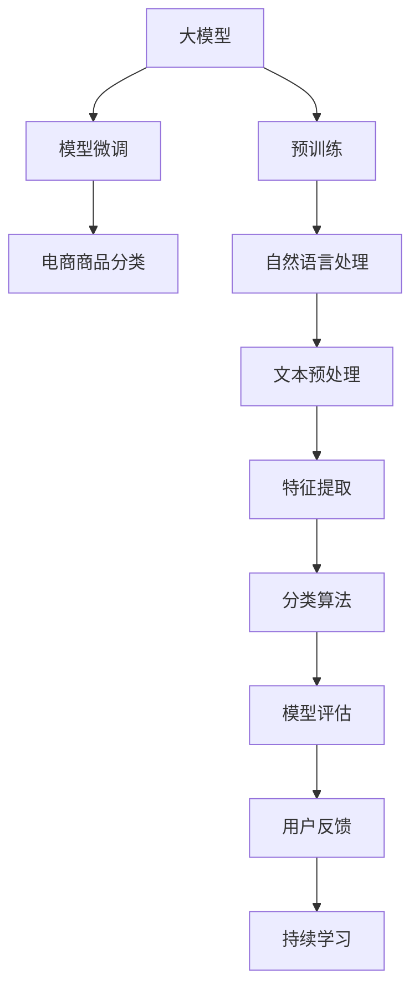

                 

# 大模型在电商平台商品分类中的应用

> 关键词：大模型,电商平台,商品分类,深度学习,自然语言处理,NLP,分类算法,模型微调

## 1. 背景介绍

### 1.1 问题由来
随着电商平台的兴起，消费者越来越多地在网上购物。电商平台需要能够高效、准确地对商品进行分类，以提升用户体验和运营效率。传统的商品分类方法基于特征工程，需要人工提取和设计大量的特征，费时费力且效果有限。近年来，随着深度学习和大模型的发展，利用预训练语言模型进行自动化的商品分类方法开始受到关注。

### 1.2 问题核心关键点
大模型在电商平台商品分类中的应用，主要关注以下几个关键点：

- **自动特征提取**：利用大模型自动提取商品描述中的有用信息，无需人工设计特征。
- **高效分类算法**：选择适用于电商平台高维度数据的分类算法，提升分类准确率。
- **模型微调与优化**：在大模型上微调，以适应电商平台上不同商品分类的需求。
- **跨领域泛化能力**：大模型应具备良好的泛化能力，能适应不同领域和种类的商品分类任务。

### 1.3 问题研究意义
大模型在电商平台商品分类中的应用，可以带来以下几方面的显著优势：

1. **提高效率**：自动化特征提取和大模型分类的速度远高于传统方法，大大提升商品分类的效率。
2. **提高准确率**：大模型通过大规模语料预训练，具备强大的语言理解和语义理解能力，可以提升分类准确率。
3. **降低成本**：利用大模型进行分类，无需人工设计特征和手工标注，降低开发和运营成本。
4. **提升用户体验**：准确的商品分类可以帮助用户更快找到所需商品，提升购物体验。

## 2. 核心概念与联系

### 2.1 核心概念概述

为更好地理解大模型在电商平台商品分类中的应用，本节将介绍几个关键概念及其相互联系：

- **大模型**：以Transformer为代表的深度学习模型，如BERT、GPT等，通过大规模无标签语料进行预训练，具备强大的语言表示和推理能力。
- **电商平台**：在线销售商品和服务的平台，如亚马逊、淘宝、京东等。
- **商品分类**：对电商平台上的商品进行自动化的分类，以便管理和推荐。
- **自然语言处理(NLP)**：利用计算机技术处理、分析、理解、生成人类语言，涉及文本预处理、语言模型、文本分类等技术。
- **分类算法**：用于将数据分成不同类别的算法，如支持向量机(SVM)、随机森林(Random Forest)、卷积神经网络(CNN)等。
- **模型微调**：在预训练模型基础上，利用少量标注数据进行微调，以适应特定任务的需求。
- **跨领域泛化能力**：模型在不同领域和数据上的泛化能力，即在不同场景下仍然能保持较高的性能。

这些概念之间的逻辑关系可以通过以下Mermaid流程图来展示：



这个流程图展示了大模型在电商平台商品分类中的核心概念及其相互联系：

1. 大模型通过大规模无标签语料进行预训练，学习通用的语言表示。
2. 自然语言处理技术对商品描述进行文本预处理和特征提取。
3. 分类算法利用提取的特征对商品进行分类。
4. 模型微调使大模型适应特定电商平台的商品分类需求。
5. 持续学习机制不断优化模型性能，提升跨领域泛化能力。
6. 用户反馈帮助进一步优化分类模型。

## 3. 核心算法原理 & 具体操作步骤
### 3.1 算法原理概述

大模型在电商平台商品分类中的应用，主要基于以下核心算法原理：

1. **预训练语言模型**：利用大规模无标签语料进行预训练，学习通用的语言表示和语言知识。
2. **自然语言处理技术**：对商品描述进行文本预处理和特征提取，提升模型输入质量。
3. **分类算法**：选择合适的分类算法，将商品分类为不同类别。
4. **模型微调**：在大模型基础上进行微调，以适应电商平台的特定分类需求。
5. **持续学习与优化**：通过不断更新模型和用户反馈，提升模型的性能和泛化能力。

### 3.2 算法步骤详解

基于上述核心算法原理，大模型在电商平台商品分类的具体操作步骤如下：

1. **数据收集与预处理**：
   - 收集电商平台上商品的标题、描述、图片等数据。
   - 对文本数据进行清洗、分词、去除停用词等预处理，提取有用的特征。
   - 对图片数据进行预处理，如尺寸调整、归一化等。

2. **选择预训练模型**：
   - 根据任务需求，选择适合的预训练语言模型，如BERT、RoBERTa、XLNet等。

3. **模型微调**：
   - 将预训练模型作为初始化参数，利用电商平台上已标注的商品数据进行微调。
   - 设置合适的超参数，如学习率、批大小、迭代轮数等。
   - 使用交叉熵损失函数，将模型预测输出与真实标签进行对比。
   - 使用Adam优化器进行参数更新，最小化损失函数。

4. **分类算法选择**：
   - 根据任务特点，选择合适的分类算法，如SVM、随机森林、深度神经网络等。
   - 对微调后的模型输出进行后处理，如得分归一化、阈值设定等。

5. **模型评估与优化**：
   - 使用验证集对模型进行评估，计算准确率、召回率、F1值等指标。
   - 根据评估结果，调整模型超参数，进行进一步微调。
   - 使用测试集对模型进行最终评估，计算各项指标，确定分类效果。

6. **持续学习与更新**：
   - 收集用户反馈和新的标注数据，持续更新模型，提升泛化能力。
   - 定期重新微调模型，适应数据分布的变化。

### 3.3 算法优缺点

大模型在电商平台商品分类中的应用，具有以下优点：

1. **高效性**：自动化特征提取和分类算法，显著提高分类效率。
2. **准确性**：大模型具备强大的语言表示能力，可以提高分类准确率。
3. **泛化能力**：大模型具备良好的泛化能力，适用于不同领域和种类的商品分类任务。
4. **可解释性**：大模型能够提供较好的可解释性，解释模型决策过程。

同时，也存在一些缺点：

1. **数据依赖性**：模型需要足够的标注数据进行微调，标注成本较高。
2. **计算资源需求高**：大模型和微调过程需要较高的计算资源，硬件要求高。
3. **模型解释性不足**：大模型往往是黑盒模型，难以解释其内部决策逻辑。

### 3.4 算法应用领域

大模型在电商平台商品分类中的应用，主要涉及以下领域：

1. **商品分类**：对商品进行自动化的分类，如服装、电子产品、家居用品等。
2. **推荐系统**：根据用户行为和商品分类，推荐相关商品，提升用户体验。
3. **智能客服**：利用大模型进行智能对话，解答用户关于商品分类的问题。
4. **广告投放**：根据商品分类进行广告定向投放，提高广告效果。

## 4. 数学模型和公式 & 详细讲解 & 举例说明
### 4.1 数学模型构建

本节将使用数学语言对大模型在电商平台商品分类中的数学模型进行详细构建和讲解。

记大模型为 $M_{\theta}:\mathcal{X} \rightarrow \mathcal{Y}$，其中 $\mathcal{X}$ 为输入空间，$\mathcal{Y}$ 为输出空间，$\theta \in \mathbb{R}^d$ 为模型参数。假设电商平台上已标注的商品数据集为 $D=\{(x_i,y_i)\}_{i=1}^N, x_i \in \mathcal{X}, y_i \in \mathcal{Y}$。

定义模型 $M_{\theta}$ 在输入 $x_i$ 上的预测概率为 $p(y_i|x_i)=\mathcal{N}(M_{\theta}(x_i),\sigma^2)$，其中 $M_{\theta}(x_i)$ 为模型输出，$\sigma^2$ 为预测方差。

假设模型 $M_{\theta}$ 在数据样本 $(x_i,y_i)$ 上的损失函数为 $\ell(M_{\theta}(x_i),y_i)$，则在数据集 $D$ 上的经验风险为：

$$
\mathcal{L}(\theta) = \frac{1}{N} \sum_{i=1}^N \ell(M_{\theta}(x_i),y_i)
$$

微调的目标是最小化经验风险，即找到最优参数：

$$
\theta^* = \mathop{\arg\min}_{\theta} \mathcal{L}(\theta)
$$

在实践中，我们通常使用基于梯度的优化算法（如Adam、SGD等）来近似求解上述最优化问题。设 $\eta$ 为学习率，$\lambda$ 为正则化系数，则参数的更新公式为：

$$
\theta \leftarrow \theta - \eta \nabla_{\theta}\mathcal{L}(\theta) - \eta\lambda\theta
$$

其中 $\nabla_{\theta}\mathcal{L}(\theta)$ 为损失函数对参数 $\theta$ 的梯度，可通过反向传播算法高效计算。

### 4.2 公式推导过程

以电商平台商品分类为例，我们将商品描述文本 $x_i$ 输入到大模型 $M_{\theta}$ 中，得到模型输出的分类概率分布 $p(y_i|x_i)$。分类器使用softmax函数将输出转化为每个类别的概率，计算公式为：

$$
p(y_i|x_i) = \frac{\exp(M_{\theta}(x_i))}{\sum_j \exp(M_{\theta}(x_j))}
$$

模型在训练集 $D$ 上的交叉熵损失函数为：

$$
\ell(M_{\theta}(x_i),y_i) = -\sum_j y_i^j \log p(y_i|x_i)^j
$$

将其代入经验风险公式，得：

$$
\mathcal{L}(\theta) = -\frac{1}{N}\sum_{i=1}^N \sum_j y_i^j \log p(y_i|x_i)^j
$$

根据链式法则，损失函数对参数 $\theta_k$ 的梯度为：

$$
\frac{\partial \mathcal{L}(\theta)}{\partial \theta_k} = -\frac{1}{N}\sum_{i=1}^N \sum_j y_i^j \frac{\partial \log p(y_i|x_i)^j}{\partial M_{\theta}(x_i)^k}
$$

其中 $\frac{\partial \log p(y_i|x_i)^j}{\partial M_{\theta}(x_i)^k}$ 可通过自动微分技术计算。

在得到损失函数的梯度后，即可带入参数更新公式，完成模型的迭代优化。重复上述过程直至收敛，最终得到适应电商商品分类需求的最优模型参数 $\theta^*$。

### 4.3 案例分析与讲解

假设电商平台上的商品分类任务是将商品分为两类：电器和家居用品。收集到一定数量的标注数据后，我们可以利用BERT模型进行微调。

首先，将商品描述文本 $x_i$ 输入BERT模型，得到模型输出的分类概率分布 $p(y_i|x_i)$。分类器使用softmax函数将输出转化为电器和家居用品的概率，计算公式为：

$$
p(y_i|x_i) = \frac{\exp(M_{\theta}(x_i))}{\sum_j \exp(M_{\theta}(x_j))}
$$

模型在训练集 $D$ 上的交叉熵损失函数为：

$$
\ell(M_{\theta}(x_i),y_i) = -y_i\log p(y_i|x_i) + (1-y_i)\log (1-p(y_i|x_i))
$$

将其代入经验风险公式，得：

$$
\mathcal{L}(\theta) = -\frac{1}{N}\sum_{i=1}^N \ell(M_{\theta}(x_i),y_i)
$$

根据链式法则，损失函数对参数 $\theta_k$ 的梯度为：

$$
\frac{\partial \mathcal{L}(\theta)}{\partial \theta_k} = -\frac{1}{N}\sum_{i=1}^N \left[ y_i \frac{\partial \log p(y_i|x_i)}{\partial M_{\theta}(x_i)} + (1-y_i) \frac{\partial \log (1-p(y_i|x_i))}{\partial M_{\theta}(x_i)} \right]
$$

其中 $\frac{\partial \log p(y_i|x_i)}{\partial M_{\theta}(x_i)}$ 和 $\frac{\partial \log (1-p(y_i|x_i))}{\partial M_{\theta}(x_i)}$ 可通过自动微分技术计算。

通过上述公式，我们可以利用优化算法（如Adam）迭代更新模型参数 $\theta$，最小化损失函数 $\mathcal{L}(\theta)$，使得模型输出逼近真实标签。重复上述过程直至收敛，最终得到适应电商商品分类需求的最优模型参数 $\theta^*$。

## 5. 项目实践：代码实例和详细解释说明
### 5.1 开发环境搭建

在进行电商平台商品分类项目实践前，我们需要准备好开发环境。以下是使用Python进行PyTorch开发的环境配置流程：

1. 安装Anaconda：从官网下载并安装Anaconda，用于创建独立的Python环境。

2. 创建并激活虚拟环境：
```bash
conda create -n pytorch-env python=3.8 
conda activate pytorch-env
```

3. 安装PyTorch：根据CUDA版本，从官网获取对应的安装命令。例如：
```bash
conda install pytorch torchvision torchaudio cudatoolkit=11.1 -c pytorch -c conda-forge
```

4. 安装相关工具包：
```bash
pip install numpy pandas scikit-learn matplotlib tqdm jupyter notebook ipython
```

完成上述步骤后，即可在`pytorch-env`环境中开始项目实践。

### 5.2 源代码详细实现

下面我们以电商平台商品分类任务为例，给出使用Transformers库对BERT模型进行微调的PyTorch代码实现。

首先，定义分类任务的数据处理函数：

```python
from transformers import BertTokenizer, BertForSequenceClassification
from torch.utils.data import Dataset
import torch

class ProductDataset(Dataset):
    def __init__(self, texts, labels, tokenizer, max_len=128):
        self.texts = texts
        self.labels = labels
        self.tokenizer = tokenizer
        self.max_len = max_len
        
    def __len__(self):
        return len(self.texts)
    
    def __getitem__(self, item):
        text = self.texts[item]
        label = self.labels[item]
        
        encoding = self.tokenizer(text, return_tensors='pt', max_length=self.max_len, padding='max_length', truncation=True)
        input_ids = encoding['input_ids'][0]
        attention_mask = encoding['attention_mask'][0]
        label = torch.tensor(label, dtype=torch.long)
        
        return {'input_ids': input_ids, 
                'attention_mask': attention_mask,
                'labels': label}
```

然后，定义模型和优化器：

```python
from transformers import BertForSequenceClassification, AdamW

model = BertForSequenceClassification.from_pretrained('bert-base-cased', num_labels=2)

optimizer = AdamW(model.parameters(), lr=2e-5)
```

接着，定义训练和评估函数：

```python
from torch.utils.data import DataLoader
from tqdm import tqdm

device = torch.device('cuda') if torch.cuda.is_available() else torch.device('cpu')
model.to(device)

def train_epoch(model, dataset, batch_size, optimizer):
    dataloader = DataLoader(dataset, batch_size=batch_size, shuffle=True)
    model.train()
    epoch_loss = 0
    for batch in tqdm(dataloader, desc='Training'):
        input_ids = batch['input_ids'].to(device)
        attention_mask = batch['attention_mask'].to(device)
        labels = batch['labels'].to(device)
        model.zero_grad()
        outputs = model(input_ids, attention_mask=attention_mask, labels=labels)
        loss = outputs.loss
        epoch_loss += loss.item()
        loss.backward()
        optimizer.step()
    return epoch_loss / len(dataloader)

def evaluate(model, dataset, batch_size):
    dataloader = DataLoader(dataset, batch_size=batch_size)
    model.eval()
    preds, labels = [], []
    with torch.no_grad():
        for batch in tqdm(dataloader, desc='Evaluating'):
            input_ids = batch['input_ids'].to(device)
            attention_mask = batch['attention_mask'].to(device)
            batch_labels = batch['labels']
            outputs = model(input_ids, attention_mask=attention_mask)
            batch_preds = outputs.logits.argmax(dim=1).to('cpu').tolist()
            batch_labels = batch_labels.to('cpu').tolist()
            for pred, label in zip(batch_preds, batch_labels):
                preds.append(pred)
                labels.append(label)
                
    print(classification_report(labels, preds))
```

最后，启动训练流程并在测试集上评估：

```python
epochs = 5
batch_size = 16

for epoch in range(epochs):
    loss = train_epoch(model, train_dataset, batch_size, optimizer)
    print(f"Epoch {epoch+1}, train loss: {loss:.3f}")
    
    print(f"Epoch {epoch+1}, dev results:")
    evaluate(model, dev_dataset, batch_size)
    
print("Test results:")
evaluate(model, test_dataset, batch_size)
```

以上就是使用PyTorch对BERT进行电商平台商品分类任务微调的完整代码实现。可以看到，得益于Transformers库的强大封装，我们可以用相对简洁的代码完成BERT模型的加载和微调。

### 5.3 代码解读与分析

让我们再详细解读一下关键代码的实现细节：

**ProductDataset类**：
- `__init__`方法：初始化文本、标签、分词器等关键组件。
- `__len__`方法：返回数据集的样本数量。
- `__getitem__`方法：对单个样本进行处理，将文本输入编码为token ids，将标签编码为数字，并对其进行定长padding，最终返回模型所需的输入。

**训练和评估函数**：
- 使用PyTorch的DataLoader对数据集进行批次化加载，供模型训练和推理使用。
- 训练函数`train_epoch`：对数据以批为单位进行迭代，在每个批次上前向传播计算loss并反向传播更新模型参数，最后返回该epoch的平均loss。
- 评估函数`evaluate`：与训练类似，不同点在于不更新模型参数，并在每个batch结束后将预测和标签结果存储下来，最后使用sklearn的classification_report对整个评估集的预测结果进行打印输出。

**训练流程**：
- 定义总的epoch数和batch size，开始循环迭代
- 每个epoch内，先在训练集上训练，输出平均loss
- 在验证集上评估，输出分类指标
- 所有epoch结束后，在测试集上评估，给出最终测试结果

可以看到，PyTorch配合Transformers库使得BERT微调的代码实现变得简洁高效。开发者可以将更多精力放在数据处理、模型改进等高层逻辑上，而不必过多关注底层的实现细节。

当然，工业级的系统实现还需考虑更多因素，如模型的保存和部署、超参数的自动搜索、更灵活的任务适配层等。但核心的微调范式基本与此类似。

## 6. 实际应用场景
### 6.1 智能推荐系统

电商平台利用大模型微调技术，可以构建智能推荐系统，提升用户体验和商品转化率。推荐系统根据用户的历史行为和商品分类，自动推荐相关商品，从而增加用户购买的概率。

具体而言，收集用户浏览、点击、购买等行为数据，提取商品分类信息，构建用户行为和商品分类的多维数据集。利用大模型对商品分类进行微调，学习商品分类与用户行为之间的关系。然后，利用微调后的模型进行推荐，根据用户行为预测其感兴趣的商品类别，推荐相关商品。

### 6.2 商品搜索

电商平台还可以利用大模型微调技术，优化商品搜索系统，提升搜索效率和准确率。商品搜索系统通过用户输入的搜索关键词，自动匹配相关商品，并返回搜索结果。

具体而言，将用户输入的搜索关键词输入到大模型中，进行特征提取和分类。然后，根据用户搜索历史和模型预测结果，生成个性化的搜索结果。通过微调大模型，可以提升模型对关键词的理解和分类能力，从而提高搜索的准确率和相关性。

### 6.3 库存管理

电商平台利用大模型微调技术，可以优化库存管理，降低库存成本。库存管理需要实时掌握商品销售情况，合理调整库存量，避免缺货或过剩。

具体而言，利用大模型对商品分类进行微调，学习商品分类与销售量之间的关系。然后，根据历史销售数据和模型预测结果，动态调整库存量。通过微调大模型，可以提升模型对销售趋势的预测能力，从而实现更准确的库存管理。

### 6.4 未来应用展望

随着大模型和微调技术的不断发展，基于大模型的电商平台应用将不断涌现，为电商运营带来新的机遇。

在智能广告投放方面，利用大模型对商品分类进行微调，学习广告投放与商品分类之间的关系。然后，根据模型预测结果，进行广告定向投放，提升广告效果和ROI。

在客户服务方面，利用大模型构建智能客服系统，自动回答用户关于商品分类的问题。通过微调大模型，可以提升客服系统的智能程度，提升用户体验和满意度。

在供应链管理方面，利用大模型对商品分类进行微调，学习供应链管理与商品分类之间的关系。然后，根据模型预测结果，优化供应链管理策略，提高供应链效率和成本控制能力。

此外，在物流管理、市场分析等电商运营的各个环节，基于大模型的微调技术都有望发挥重要作用。未来，随着大模型微调技术的不断成熟和应用场景的不断拓展，电商平台将在更多领域实现智能化、高效化的运营。

## 7. 工具和资源推荐
### 7.1 学习资源推荐

为了帮助开发者系统掌握大模型在电商平台商品分类中的应用，这里推荐一些优质的学习资源：

1. 《Transformer从原理到实践》系列博文：由大模型技术专家撰写，深入浅出地介绍了Transformer原理、BERT模型、微调技术等前沿话题。

2. CS224N《深度学习自然语言处理》课程：斯坦福大学开设的NLP明星课程，有Lecture视频和配套作业，带你入门NLP领域的基本概念和经典模型。

3. 《Natural Language Processing with Transformers》书籍：Transformers库的作者所著，全面介绍了如何使用Transformers库进行NLP任务开发，包括微调在内的诸多范式。

4. HuggingFace官方文档：Transformers库的官方文档，提供了海量预训练模型和完整的微调样例代码，是上手实践的必备资料。

5. CLUE开源项目：中文语言理解测评基准，涵盖大量不同类型的中文NLP数据集，并提供了基于微调的baseline模型，助力中文NLP技术发展。

通过对这些资源的学习实践，相信你一定能够快速掌握大模型在电商平台商品分类中的应用，并用于解决实际的NLP问题。
###  7.2 开发工具推荐

高效的开发离不开优秀的工具支持。以下是几款用于大模型在电商平台商品分类应用的常用工具：

1. PyTorch：基于Python的开源深度学习框架，灵活动态的计算图，适合快速迭代研究。大部分预训练语言模型都有PyTorch版本的实现。

2. TensorFlow：由Google主导开发的开源深度学习框架，生产部署方便，适合大规模工程应用。同样有丰富的预训练语言模型资源。

3. Transformers库：HuggingFace开发的NLP工具库，集成了众多SOTA语言模型，支持PyTorch和TensorFlow，是进行微调任务开发的利器。

4. Weights & Biases：模型训练的实验跟踪工具，可以记录和可视化模型训练过程中的各项指标，方便对比和调优。与主流深度学习框架无缝集成。

5. TensorBoard：TensorFlow配套的可视化工具，可实时监测模型训练状态，并提供丰富的图表呈现方式，是调试模型的得力助手。

6. Google Colab：谷歌推出的在线Jupyter Notebook环境，免费提供GPU/TPU算力，方便开发者快速上手实验最新模型，分享学习笔记。

合理利用这些工具，可以显著提升大模型在电商平台商品分类应用的开发效率，加快创新迭代的步伐。

### 7.3 相关论文推荐

大模型在电商平台商品分类中的应用，得益于学界的持续研究。以下是几篇奠基性的相关论文，推荐阅读：

1. Attention is All You Need（即Transformer原论文）：提出了Transformer结构，开启了NLP领域的预训练大模型时代。

2. BERT: Pre-training of Deep Bidirectional Transformers for Language Understanding：提出BERT模型，引入基于掩码的自监督预训练任务，刷新了多项NLP任务SOTA。

3. Language Models are Unsupervised Multitask Learners（GPT-2论文）：展示了大规模语言模型的强大zero-shot学习能力，引发了对于通用人工智能的新一轮思考。

4. Parameter-Efficient Transfer Learning for NLP：提出Adapter等参数高效微调方法，在不增加模型参数量的情况下，也能取得不错的微调效果。

5. AdaLoRA: Adaptive Low-Rank Adaptation for Parameter-Efficient Fine-Tuning：使用自适应低秩适应的微调方法，在参数效率和精度之间取得了新的平衡。

6. Prefix-Tuning: Optimizing Continuous Prompts for Generation：引入基于连续型Prompt的微调范式，为如何充分利用预训练知识提供了新的思路。

这些论文代表了大模型在电商平台商品分类中的应用发展脉络。通过学习这些前沿成果，可以帮助研究者把握学科前进方向，激发更多的创新灵感。

## 8. 总结：未来发展趋势与挑战
### 8.1 总结

本文对大模型在电商平台商品分类中的应用进行了全面系统的介绍。首先阐述了电商平台的背景和需求，明确了大模型在电商平台商品分类中的核心概念和关键点。其次，从原理到实践，详细讲解了大模型在电商平台商品分类中的数学模型和算法流程，给出了微调任务开发的完整代码实例。同时，本文还广泛探讨了大模型在电商平台应用的具体场景，展示了微调范式的巨大潜力。此外，本文精选了大模型在电商平台应用的各类学习资源，力求为读者提供全方位的技术指引。

通过本文的系统梳理，可以看到，大模型在电商平台商品分类中的应用，具有高效性、准确性和泛化能力等显著优势，极大地提升了电商平台的运营效率和用户体验。未来，伴随大模型微调技术的不断演进，基于大模型的电商平台应用将更加广泛和深入，为电商行业带来新的突破。

### 8.2 未来发展趋势

展望未来，大模型在电商平台商品分类中的应用将呈现以下几个发展趋势：

1. **高维度数据处理**：电商平台上的商品分类数据通常具有高维度，大模型需要处理更多维度的数据，提升分类精度。
2. **实时性要求**：电商平台需要实时处理用户输入和反馈，大模型需要具备更快的推理速度。
3. **跨领域泛化能力**：大模型需要具备更强的跨领域泛化能力，能够适应不同领域和种类的商品分类任务。
4. **个性化推荐**：大模型需要根据用户行为和偏好，生成个性化的推荐结果，提升用户体验。
5. **安全性和隐私保护**：电商平台需要关注用户数据的安全性和隐私保护，大模型需要符合相关法规要求。

以上趋势凸显了大模型在电商平台商品分类中的广阔前景。这些方向的探索发展，必将进一步提升大模型在电商平台上的应用效果，为电商行业带来更多的创新和价值。

### 8.3 面临的挑战

尽管大模型在电商平台商品分类中的应用已经取得了显著成果，但在迈向更加智能化、普适化应用的过程中，它仍面临着诸多挑战：

1. **数据依赖性**：模型需要足够的标注数据进行微调，标注成本较高，数据收集和处理复杂。
2. **计算资源需求高**：大模型和微调过程需要较高的计算资源，硬件要求高，成本较高。
3. **模型解释性不足**：大模型往往是黑盒模型，难以解释其内部决策逻辑，用户和开发者难以理解和信任。
4. **安全性和隐私保护**：电商平台需要关注用户数据的安全性和隐私保护，大模型需要符合相关法规要求，同时避免误导性和有害信息的输出。

这些挑战需要在技术、法规和伦理等多个维度进行综合应对，才能实现大模型在电商平台商品分类中的应用价值。

### 8.4 研究展望

未来，大模型在电商平台商品分类中的应用研究需要在以下几个方面寻求新的突破：

1. **数据增强技术**：利用数据增强技术提升模型泛化能力，降低数据依赖性。
2. **小样本学习**：研究小样本学习技术，在少量标注数据下也能取得良好的分类效果。
3. **模型压缩与优化**：研究模型压缩与优化技术，提高模型推理速度，降低计算资源需求。
4. **可解释性与可视化**：研究可解释性和可视化技术，提升大模型的透明性和可理解性。
5. **安全与隐私保护**：研究安全与隐私保护技术，保障用户数据安全，符合相关法规要求。

这些研究方向的探索，将为大模型在电商平台商品分类中的应用带来新的突破，推动大模型技术的不断进步。相信随着技术的发展和应用场景的拓展，大模型将在电商平台上发挥更大的作用，为电商行业带来更多的创新和发展。

## 9. 附录：常见问题与解答

**Q1：电商平台商品分类是否需要大量的标注数据？**

A: 电商平台商品分类通常需要一定量的标注数据进行微调，但与传统机器学习任务相比，标注数据的成本和需求相对较低。利用大模型，可以通过微调自动学习商品分类知识，降低标注数据的依赖。

**Q2：大模型在电商平台商品分类中是否需要很高的计算资源？**

A: 大模型在电商平台商品分类中需要较高的计算资源，特别是对于大规模数据集和深度模型结构。为了降低计算资源需求，可以采用模型压缩、剪枝等技术，或者选择参数量较小的预训练模型。

**Q3：大模型在电商平台商品分类中的可解释性不足如何改进？**

A: 大模型往往是黑盒模型，难以解释其内部决策逻辑。为了提升可解释性，可以采用模型可视化和解释技术，如注意力机制、特征重要性分析等，帮助用户和开发者理解模型的决策过程。

**Q4：电商平台商品分类中如何处理高维度数据？**

A: 电商平台上的商品分类数据通常具有高维度，可以利用大模型的多模态能力，将高维度数据进行编码和分类。同时，可以采用特征工程方法，将高维度数据转换为低维度特征向量，提升分类效果。

**Q5：电商平台商品分类中如何保护用户隐私？**

A: 电商平台需要关注用户数据的安全性和隐私保护，可以使用数据加密、隐私保护算法等技术，保障用户隐私。同时，大模型需要符合相关法规要求，确保输出结果不含有敏感信息。

---

作者：禅与计算机程序设计艺术 / Zen and the Art of Computer Programming

