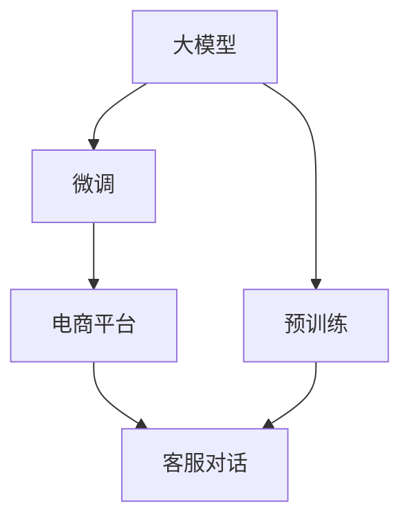

                 

# 大模型在电商平台智能客服中的应用

> 关键词：大模型,智能客服,电商,自然语言处理,NLP,深度学习,Transformer,BERT,微调,Fine-tuning

## 1. 背景介绍

### 1.1 问题由来
随着电子商务的迅猛发展，电商平台为数亿用户提供了便捷的购物体验。然而，用户在与客服进行沟通时，往往面临响应慢、效率低、互动体验差等问题，这些问题严重影响了用户体验和电商平台的用户粘性。

为了提升客服的响应速度和效率，电商平台开始引入人工智能技术，构建智能客服系统。智能客服系统能够24/7不间断服务，处理大规模用户咨询，通过理解用户意图，匹配最合适的答案，大大提升了客户咨询的响应速度和满意度。

但传统的基于规则或模板的客服系统存在扩展性差、可维护性差、知识更新慢等问题，难以满足日益复杂的用户需求。基于大模型的智能客服系统则可以有效解决这些问题，通过深度学习和大规模预训练语言模型的技术，实现高质量的客服对话生成，为用户提供更快速、更智能的咨询体验。

### 1.2 问题核心关键点
在智能客服系统中，大模型通过预训练和微调，能够学习到通用的语言知识，结合电商平台特定业务领域的数据，进一步优化模型性能，最终生成高质量的客户对话。

大模型的核心价值在于：

- 广泛的通用知识。大模型在预训练过程中，学习到了大量的语言知识，具备较强的语义理解能力，能够处理多种语义和语用特征。
- 较强的迁移学习能力。大模型可以在电商平台的特定业务场景下，快速适应新的语言模式和数据分布。
- 优秀的泛化能力。大模型通过微调，可以在小规模标注数据上进行高效学习，避免数据过拟合。
- 灵活的上下文感知能力。大模型能够理解复杂的对话语境，在客服场景中，可以灵活调整回答策略，匹配用户的实时需求。
- 自动生成的客服回复。大模型通过微调，能够根据用户输入生成高质量的客服回复，减少人工干预，提高效率。

### 1.3 问题研究意义
研究大模型在智能客服中的应用，对于提升电商平台用户体验、提高客户满意度和忠诚度具有重要意义：

1. 降低客服成本。基于大模型的智能客服系统能够自动处理大量的客户咨询，减少了人力客服的工作量。
2. 提升响应速度。智能客服系统能够快速理解用户意图，及时给出准确的回答，大大提升了客户咨询的响应速度。
3. 提高客服质量。智能客服系统生成的回答质量高，能够显著提升客户满意度和平台的用户粘性。
4. 提升客户体验。智能客服系统能够24/7不间断服务，解决了传统客服系统的工作时间和服务数量限制。
5. 拓展应用场景。大模型的智能客服系统不仅适用于电商平台的客户咨询，还可以应用于在线教育、医疗咨询等领域，具有广泛的适用性。

## 2. 核心概念与联系

### 2.1 核心概念概述

为更好地理解大模型在电商平台智能客服中的应用，本节将介绍几个密切相关的核心概念：

- 大模型(Large Model)：以Transformer架构为基础的深度学习模型，通过在大规模无标签文本语料上进行预训练，学习到丰富的语言知识和语义表征。
- 预训练(Pre-training)：指在大规模无标签文本语料上，通过自监督学习任务训练大模型的过程。常见的预训练任务包括掩码语言模型、 next sentence prediction等。
- 微调(Fine-tuning)：指在预训练模型的基础上，使用下游任务的少量标注数据，通过有监督学习优化模型在下游任务上的性能。
- 迁移学习(Transfer Learning)：指将一个领域学习到的知识，迁移应用到另一个不同但相关的领域的学习范式。大模型在电商平台的特定场景下，可以快速适应新的语言模式和数据分布。
- 自然语言处理(NLP)：使用计算机技术处理、理解和生成自然语言，是大模型在电商客服应用中的核心技术。
- 对话系统(Discourse System)：通过自然语言理解技术，自动生成回应或交互，是大模型在智能客服中的主要应用方向。

这些核心概念之间的逻辑关系可以通过以下Mermaid流程图来展示：



这个流程图展示了大模型、预训练、微调、电商平台和客服对话之间的逻辑关系：

1. 大模型通过预训练获得基础能力。
2. 在电商平台特定场景下，进行微调，优化模型性能。
3. 微调后的模型用于生成客服对话，支持电商平台智能客服系统。
4. 电商平台作为微调数据的来源，提供特定领域的标注数据。
5. 客服对话作为微调模型的应用场景，展示模型在实际应用中的效果。

## 3. 核心算法原理 & 具体操作步骤
### 3.1 算法原理概述

基于大模型的智能客服系统，其核心思想是利用预训练模型和微调技术，学习电商平台特定领域的语言模式和数据分布，生成高质量的客服对话。

形式化地，假设大模型为 $M_{\theta}$，其中 $\theta$ 为预训练得到的模型参数。给定电商平台特定领域的标注数据集 $D=\{(x_i,y_i)\}_{i=1}^N$，微调的目标是找到新的模型参数 $\hat{\theta}$，使得模型在客服对话生成任务上的性能最大化，即：

$$
\hat{\theta}=\mathop{\arg\min}_{\theta} \mathcal{L}(M_{\theta},D)
$$

其中 $\mathcal{L}$ 为针对客服对话生成任务设计的损失函数，用于衡量模型生成的对话与真实对话之间的差异。常见的损失函数包括交叉熵损失、BLEU得分、ROUGE得分等。

通过梯度下降等优化算法，微调过程不断更新模型参数 $\theta$，最小化损失函数 $\mathcal{L}$，使得模型生成对话逼近真实对话。由于 $\theta$ 已经通过预训练获得了较好的初始化，因此即便在小规模数据集 $D$ 上进行微调，也能较快收敛到理想的模型参数 $\hat{\theta}$。

### 3.2 算法步骤详解

基于大模型的智能客服系统，主要包括以下几个关键步骤：

**Step 1: 准备预训练模型和数据集**
- 选择合适的预训练语言模型 $M_{\theta}$，如BERT、GPT等。
- 准备电商平台客服对话生成任务的标注数据集 $D$，划分为训练集、验证集和测试集。一般要求标注数据与预训练数据的分布不要差异过大。

**Step 2: 添加任务适配层**
- 根据客服对话生成任务，在预训练模型顶层设计合适的输出层和损失函数。
- 对于分类任务，通常在顶层添加线性分类器和交叉熵损失函数。
- 对于生成任务，通常使用语言模型的解码器输出概率分布，并以负对数似然为损失函数。

**Step 3: 设置微调超参数**
- 选择合适的优化算法及其参数，如 AdamW、SGD 等，设置学习率、批大小、迭代轮数等。
- 设置正则化技术及强度，包括权重衰减、Dropout、Early Stopping等。
- 确定冻结预训练参数的策略，如仅微调顶层，或全部参数都参与微调。

**Step 4: 执行梯度训练**
- 将训练集数据分批次输入模型，前向传播计算损失函数。
- 反向传播计算参数梯度，根据设定的优化算法和学习率更新模型参数。
- 周期性在验证集上评估模型性能，根据性能指标决定是否触发 Early Stopping。
- 重复上述步骤直到满足预设的迭代轮数或 Early Stopping 条件。

**Step 5: 测试和部署**
- 在测试集上评估微调后模型 $M_{\hat{\theta}}$ 的性能，对比微调前后的精度提升。
- 使用微调后的模型对新样本进行推理预测，集成到实际的应用系统中。
- 持续收集新的数据，定期重新微调模型，以适应数据分布的变化。

以上是基于大模型的智能客服系统的微调范式的一般流程。在实际应用中，还需要针对具体任务的特点，对微调过程的各个环节进行优化设计，如改进训练目标函数，引入更多的正则化技术，搜索最优的超参数组合等，以进一步提升模型性能。

### 3.3 算法优缺点

基于大模型的智能客服系统具有以下优点：

- 处理复杂对话能力强。大模型通过预训练获得了强大的语义理解和生成能力，能够处理复杂的客户咨询和对话。
- 快速响应。通过微调，大模型可以很快适应新的语言模式和数据分布，实时生成客服回复，提高响应速度。
- 知识更新快。大模型可以根据实时数据进行快速微调，适应客户需求的变化，提升客服回答的准确性和时效性。
- 可扩展性强。大模型通过微调，可以轻松扩展到其他类似场景，如在线教育、医疗咨询等。

但该方法也存在一定的局限性：

- 对标注数据依赖大。微调的效果很大程度上取决于标注数据的质量和数量，获取高质量标注数据的成本较高。
- 迁移能力有限。当电商平台与其他平台的业务场景差异较大时，微调的性能提升有限。
- 可解释性不足。微调模型决策过程复杂，难以解释其内部工作机制和推理逻辑。
- 可能传递偏见。预训练模型的固有偏见、有害信息等，可能通过微调传递到客服对话中，造成负面影响。

尽管存在这些局限性，但就目前而言，基于大模型的智能客服系统在处理客户咨询和对话方面已展现出显著优势，成为了电商平台客户服务的重要工具。

### 3.4 算法应用领域

基于大模型的智能客服系统在电商平台的客服对话生成任务中得到广泛应用，具体包括：

- 自动回答客户咨询。智能客服系统能够自动识别客户输入的咨询，并自动匹配答案，生成回答。
- 处理复杂咨询。当客户提出的问题复杂时，智能客服系统可以自动进行多轮对话，逐步引导客户，最终给出满意的解答。
- 提升客户满意度。智能客服系统生成的回答质量高，能够显著提升客户满意度和平台的用户粘性。
- 减少人力成本。智能客服系统能够自动处理大量的客户咨询，减少了人力客服的工作量。
- 实时更新知识库。通过微调，智能客服系统能够快速适应新的语言模式和数据分布，保持知识库的时效性。

此外，大模型的智能客服系统还被创新性地应用到更多场景中，如在线教育、医疗咨询等领域，为这些行业的客户服务提供了新的解决方案。

## 4. 数学模型和公式 & 详细讲解
### 4.1 数学模型构建

本节将使用数学语言对基于大模型的智能客服系统的微调过程进行更加严格的刻画。

记大模型为 $M_{\theta}$，其中 $\theta$ 为预训练得到的模型参数。假设电商平台客服对话生成任务的训练集为 $D=\{(x_i,y_i)\}_{i=1}^N$，其中 $x_i$ 为输入的客户咨询，$y_i$ 为对应的客服回复。

定义模型 $M_{\theta}$ 在输入 $x$ 上的输出为 $\hat{y}=M_{\theta}(x)$，表示模型生成的回复。

则模型在数据样本 $(x,y)$ 上的损失函数为：

$$
\ell(M_{\theta}(x),y) = -y\log M_{\theta}(x) - (1-y)\log(1-M_{\theta}(x))
$$

在训练集 $D$ 上，经验风险为：

$$
\mathcal{L}(\theta) = \frac{1}{N} \sum_{i=1}^N \ell(M_{\theta}(x_i),y_i)
$$

微调的优化目标是最小化经验风险，即找到最优参数：

$$
\theta^* = \mathop{\arg\min}_{\theta} \mathcal{L}(\theta)
$$

在实践中，我们通常使用基于梯度的优化算法（如SGD、Adam等）来近似求解上述最优化问题。设 $\eta$ 为学习率，$\lambda$ 为正则化系数，则参数的更新公式为：

$$
\theta \leftarrow \theta - \eta \nabla_{\theta}\mathcal{L}(\theta) - \eta\lambda\theta
$$

其中 $\nabla_{\theta}\mathcal{L}(\theta)$ 为损失函数对参数 $\theta$ 的梯度，可通过反向传播算法高效计算。

### 4.2 公式推导过程

以下我们以二分类任务为例，推导交叉熵损失函数及其梯度的计算公式。

假设模型 $M_{\theta}$ 在输入 $x$ 上的输出为 $\hat{y}=M_{\theta}(x)$，表示模型生成的回复。真实标签 $y \in \{0,1\}$。则二分类交叉熵损失函数定义为：

$$
\ell(M_{\theta}(x),y) = -[y\log M_{\theta}(x) + (1-y)\log (1-M_{\theta}(x))]
$$

将其代入经验风险公式，得：

$$
\mathcal{L}(\theta) = -\frac{1}{N}\sum_{i=1}^N [y_i\log M_{\theta}(x_i)+(1-y_i)\log(1-M_{\theta}(x_i))]
$$

根据链式法则，损失函数对参数 $\theta_k$ 的梯度为：

$$
\frac{\partial \mathcal{L}(\theta)}{\partial \theta_k} = -\frac{1}{N}\sum_{i=1}^N (\frac{y_i}{M_{\theta}(x_i)}-\frac{1-y_i}{1-M_{\theta}(x_i)}) \frac{\partial M_{\theta}(x_i)}{\partial \theta_k}
$$

其中 $\frac{\partial M_{\theta}(x_i)}{\partial \theta_k}$ 可进一步递归展开，利用自动微分技术完成计算。

在得到损失函数的梯度后，即可带入参数更新公式，完成模型的迭代优化。重复上述过程直至收敛，最终得到适应电商平台客服对话生成任务的最优模型参数 $\theta^*$。

## 5. 项目实践：代码实例和详细解释说明
### 5.1 开发环境搭建

在进行智能客服系统开发前，我们需要准备好开发环境。以下是使用Python进行PyTorch开发的环境配置流程：

1. 安装Anaconda：从官网下载并安装Anaconda，用于创建独立的Python环境。

2. 创建并激活虚拟环境：
```bash
conda create -n pytorch-env python=3.8 
conda activate pytorch-env
```

3. 安装PyTorch：根据CUDA版本，从官网获取对应的安装命令。例如：
```bash
conda install pytorch torchvision torchaudio cudatoolkit=11.1 -c pytorch -c conda-forge
```

4. 安装Transformers库：
```bash
pip install transformers
```

5. 安装各类工具包：
```bash
pip install numpy pandas scikit-learn matplotlib tqdm jupyter notebook ipython
```

完成上述步骤后，即可在`pytorch-env`环境中开始智能客服系统开发。

### 5.2 源代码详细实现

这里我们以电商平台客服对话生成任务为例，给出使用Transformers库对BERT模型进行微调的PyTorch代码实现。

首先，定义对话数据处理函数：

```python
from transformers import BertTokenizer
from torch.utils.data import Dataset
import torch

class ConversationDataset(Dataset):
    def __init__(self, dialogs, tokenizer, max_len=128):
        self.dialogs = dialogs
        self.tokenizer = tokenizer
        self.max_len = max_len
        
    def __len__(self):
        return len(self.dialogs)
    
    def __getitem__(self, item):
        dialog = self.dialogs[item]
        conversation = [t.lower() for t in dialog]
        
        encoding = self.tokenizer(conversation, return_tensors='pt', max_length=self.max_len, padding='max_length', truncation=True)
        input_ids = encoding['input_ids'][0]
        attention_mask = encoding['attention_mask'][0]
        
        # 将对话转换为生成目标，用[CLS]标记开始，[SEP]标记结束
        targets = torch.tensor([t.strip().replace('<CLS>', '').replace('<SEP>', '') for t in dialog[1:]], dtype=torch.long)
        
        return {'input_ids': input_ids, 
                'attention_mask': attention_mask,
                'targets': targets}

# 定义对话样本格式
def convert_sample(sample):
    input_ids = sample['input_ids']
    attention_mask = sample['attention_mask']
    targets = sample['targets']
    return input_ids, attention_mask, targets

# 加载数据集
tokenizer = BertTokenizer.from_pretrained('bert-base-cased')

train_dataset = ConversationDataset(train_dialogs, tokenizer)
dev_dataset = ConversationDataset(dev_dialogs, tokenizer)
test_dataset = ConversationDataset(test_dialogs, tokenizer)
```

然后，定义模型和优化器：

```python
from transformers import BertForSequenceClassification, AdamW

model = BertForSequenceClassification.from_pretrained('bert-base-cased', num_labels=2)

optimizer = AdamW(model.parameters(), lr=2e-5)
```

接着，定义训练和评估函数：

```python
from torch.utils.data import DataLoader
from tqdm import tqdm
from sklearn.metrics import classification_report

device = torch.device('cuda') if torch.cuda.is_available() else torch.device('cpu')
model.to(device)

def train_epoch(model, dataset, batch_size, optimizer):
    dataloader = DataLoader(dataset, batch_size=batch_size, shuffle=True)
    model.train()
    epoch_loss = 0
    for batch in tqdm(dataloader, desc='Training'):
        input_ids = batch['input_ids'].to(device)
        attention_mask = batch['attention_mask'].to(device)
        targets = batch['targets'].to(device)
        model.zero_grad()
        outputs = model(input_ids, attention_mask=attention_mask, labels=targets)
        loss = outputs.loss
        epoch_loss += loss.item()
        loss.backward()
        optimizer.step()
    return epoch_loss / len(dataloader)

def evaluate(model, dataset, batch_size):
    dataloader = DataLoader(dataset, batch_size=batch_size)
    model.eval()
    preds, labels = [], []
    with torch.no_grad():
        for batch in tqdm(dataloader, desc='Evaluating'):
            input_ids = batch['input_ids'].to(device)
            attention_mask = batch['attention_mask'].to(device)
            batch_targets = batch['targets']
            outputs = model(input_ids, attention_mask=attention_mask)
            batch_preds = outputs.logits.argmax(dim=2).to('cpu').tolist()
            batch_labels = batch_targets.to('cpu').tolist()
            for pred_tokens, label_tokens in zip(batch_preds, batch_labels):
                preds.append(pred_tokens)
                labels.append(label_tokens)
                
    print(classification_report(labels, preds))
```

最后，启动训练流程并在测试集上评估：

```python
epochs = 5
batch_size = 16

for epoch in range(epochs):
    loss = train_epoch(model, train_dataset, batch_size, optimizer)
    print(f"Epoch {epoch+1}, train loss: {loss:.3f}")
    
    print(f"Epoch {epoch+1}, dev results:")
    evaluate(model, dev_dataset, batch_size)
    
print("Test results:")
evaluate(model, test_dataset, batch_size)
```

以上就是使用PyTorch对BERT进行电商平台客服对话生成任务微调的完整代码实现。可以看到，得益于Transformers库的强大封装，我们可以用相对简洁的代码完成BERT模型的加载和微调。

### 5.3 代码解读与分析

让我们再详细解读一下关键代码的实现细节：

**ConversationDataset类**：
- `__init__`方法：初始化对话数据和分词器等关键组件。
- `__len__`方法：返回数据集的样本数量。
- `__getitem__`方法：对单个对话进行处理，将对话转换为模型输入，并生成对应的目标。

**convert_sample函数**：
- 将对话样本转换为模型输入和目标，方便模型训练和推理。

**训练和评估函数**：
- 使用PyTorch的DataLoader对数据集进行批次化加载，供模型训练和推理使用。
- 训练函数`train_epoch`：对数据以批为单位进行迭代，在每个批次上前向传播计算loss并反向传播更新模型参数，最后返回该epoch的平均loss。
- 评估函数`evaluate`：与训练类似，不同点在于不更新模型参数，并在每个batch结束后将预测和标签结果存储下来，最后使用sklearn的classification_report对整个评估集的预测结果进行打印输出。

**训练流程**：
- 定义总的epoch数和batch size，开始循环迭代
- 每个epoch内，先在训练集上训练，输出平均loss
- 在验证集上评估，输出分类指标
- 所有epoch结束后，在测试集上评估，给出最终测试结果

可以看到，PyTorch配合Transformers库使得BERT微调的代码实现变得简洁高效。开发者可以将更多精力放在数据处理、模型改进等高层逻辑上，而不必过多关注底层的实现细节。

当然，工业级的系统实现还需考虑更多因素，如模型的保存和部署、超参数的自动搜索、更灵活的任务适配层等。但核心的微调范式基本与此类似。

## 6. 实际应用场景
### 6.1 智能客服系统

基于大模型的智能客服系统，已经在电商平台得到了广泛应用。传统客服往往面临响应慢、效率低、知识库更新不及时等问题，而基于大模型的智能客服系统则可以有效解决这些问题。

在技术实现上，可以收集电商平台的历史客服对话记录，将问题和最佳答复构建成监督数据，在此基础上对预训练语言模型进行微调。微调后的对话模型能够自动理解用户意图，匹配最合适的答案，生成回答。对于客户提出的新问题，还可以接入检索系统实时搜索相关内容，动态组织生成回答。如此构建的智能客服系统，能够24/7不间断服务，快速响应客户咨询，提高客户满意度，降低客服成本。

### 6.2 电商推荐系统

在电商平台上，智能客服系统不仅可以处理用户咨询，还可以与推荐系统结合，提升用户体验。通过智能客服系统，用户可以在咨询中表达自己的需求，智能客服系统可以自动推荐相应的产品，提高购物效率和满意度。

例如，当用户咨询某产品的信息时，智能客服系统可以根据用户输入的问题，自动生成回答，同时推荐类似或互补的产品。当用户对某产品表示兴趣时，智能客服系统可以将该产品推荐给其他用户，进一步提升平台的用户粘性。

### 6.3 个性化营销

基于大模型的智能客服系统可以收集用户与客服互动的记录，分析用户的购买偏好和行为特征，生成个性化的营销信息。通过智能客服系统，可以向用户推荐个性化的产品、活动和优惠信息，提升用户转化率和忠诚度。

例如，当用户咨询某产品时，智能客服系统可以根据用户的历史购买记录，推荐相关联的产品，或向用户推送相关的优惠券或促销活动。通过个性化的推荐，提升用户购买意愿，增加平台销售额。

### 6.4 未来应用展望

随着大模型和微调方法的不断发展，基于大模型的智能客服系统将在更多领域得到应用，为传统行业带来变革性影响。

在智慧医疗领域，基于大模型的智能客服系统可以用于医疗咨询、健康管理等，帮助用户快速获取医疗知识，提升医疗服务体验。

在智能教育领域，智能客服系统可以用于在线教育咨询、课程推荐、作业批改等，提升教育服务的智能化水平。

在智慧城市治理中，智能客服系统可以用于城市事件监测、舆情分析、应急指挥等环节，提高城市管理的自动化和智能化水平，构建更安全、高效的未来城市。

此外，在企业生产、社会治理、文娱传媒等众多领域，基于大模型的智能客服系统也将不断涌现，为各行各业提供智能客服解决方案，推动行业数字化转型升级。

## 7. 工具和资源推荐
### 7.1 学习资源推荐

为了帮助开发者系统掌握大模型在智能客服中的应用理论基础和实践技巧，这里推荐一些优质的学习资源：

1. 《Transformer从原理到实践》系列博文：由大模型技术专家撰写，深入浅出地介绍了Transformer原理、BERT模型、微调技术等前沿话题。

2. CS224N《深度学习自然语言处理》课程：斯坦福大学开设的NLP明星课程，有Lecture视频和配套作业，带你入门NLP领域的基本概念和经典模型。

3. 《Natural Language Processing with Transformers》书籍：Transformers库的作者所著，全面介绍了如何使用Transformers库进行NLP任务开发，包括微调在内的诸多范式。

4. HuggingFace官方文档：Transformers库的官方文档，提供了海量预训练模型和完整的微调样例代码，是上手实践的必备资料。

5. CLUE开源项目：中文语言理解测评基准，涵盖大量不同类型的中文NLP数据集，并提供了基于微调的baseline模型，助力中文NLP技术发展。

通过对这些资源的学习实践，相信你一定能够快速掌握大模型在智能客服中的应用精髓，并用于解决实际的NLP问题。
###  7.2 开发工具推荐

高效的开发离不开优秀的工具支持。以下是几款用于大模型在智能客服系统中微调开发的常用工具：

1. PyTorch：基于Python的开源深度学习框架，灵活动态的计算图，适合快速迭代研究。大部分预训练语言模型都有PyTorch版本的实现。

2. TensorFlow：由Google主导开发的开源深度学习框架，生产部署方便，适合大规模工程应用。同样有丰富的预训练语言模型资源。

3. Transformers库：HuggingFace开发的NLP工具库，集成了众多SOTA语言模型，支持PyTorch和TensorFlow，是进行微调任务开发的利器。

4. Weights & Biases：模型训练的实验跟踪工具，可以记录和可视化模型训练过程中的各项指标，方便对比和调优。与主流深度学习框架无缝集成。

5. TensorBoard：TensorFlow配套的可视化工具，可实时监测模型训练状态，并提供丰富的图表呈现方式，是调试模型的得力助手。

6. Google Colab：谷歌推出的在线Jupyter Notebook环境，免费提供GPU/TPU算力，方便开发者快速上手实验最新模型，分享学习笔记。

合理利用这些工具，可以显著提升大模型在智能客服系统中的微调任务的开发效率，加快创新迭代的步伐。

### 7.3 相关论文推荐

大模型和微调技术的发展源于学界的持续研究。以下是几篇奠基性的相关论文，推荐阅读：

1. Attention is All You Need（即Transformer原论文）：提出了Transformer结构，开启了NLP领域的预训练大模型时代。

2. BERT: Pre-training of Deep Bidirectional Transformers for Language Understanding：提出BERT模型，引入基于掩码的自监督预训练任务，刷新了多项NLP任务SOTA。

3. Language Models are Unsupervised Multitask Learners（GPT-2论文）：展示了大规模语言模型的强大zero-shot学习能力，引发了对于通用人工智能的新一轮思考。

4. Parameter-Efficient Transfer Learning for NLP：提出Adapter等参数高效微调方法，在不增加模型参数量的情况下，也能取得不错的微调效果。

5. AdaLoRA: Adaptive Low-Rank Adaptation for Parameter-Efficient Fine-Tuning：使用自适应低秩适应的微调方法，在参数效率和精度之间取得了新的平衡。

6. Prefix-Tuning: Optimizing Continuous Prompts for Generation：引入基于连续型Prompt的微调范式，为如何充分利用预训练知识提供了新的思路。

这些论文代表了大模型微调技术的发展脉络。通过学习这些前沿成果，可以帮助研究者把握学科前进方向，激发更多的创新灵感。

## 8. 总结：未来发展趋势与挑战
### 8.1 总结

本文对大模型在电商平台智能客服中的应用进行了全面系统的介绍。首先阐述了智能客服系统的问题由来和重要性，明确了基于大模型的智能客服系统在提升用户体验、降低客服成本、提高客户满意度等方面的独特价值。其次，从原理到实践，详细讲解了基于大模型的智能客服系统的数学模型和微调过程，给出了微调任务开发的完整代码实例。同时，本文还探讨了智能客服系统在电商、医疗、教育、智慧城市等领域的未来应用前景，展示了大模型微调技术的广阔应用范围。

通过本文的系统梳理，可以看到，基于大模型的智能客服系统正在成为电商平台客户服务的重要工具，通过深度学习和大规模预训练语言模型，提升了客服系统的处理能力、响应速度和智能化水平。未来，伴随预训练语言模型和微调方法的不断进步，基于大模型的智能客服系统将在更多行业得到应用，为传统行业带来变革性影响。

### 8.2 未来发展趋势

展望未来，大模型在智能客服系统中的应用将呈现以下几个发展趋势：

1. 模型规模持续增大。随着算力成本的下降和数据规模的扩张，预训练语言模型的参数量还将持续增长。超大规模语言模型蕴含的丰富语言知识，有望支撑更加复杂多变的客服对话。

2. 微调方法日趋多样。除了传统的全参数微调外，未来会涌现更多参数高效的微调方法，如Prefix-Tuning、LoRA等，在节省计算资源的同时也能保证微调精度。

3. 持续学习成为常态。随着客户需求的不断变化，智能客服系统需要持续学习新知识以保持性能。如何在不遗忘原有知识的同时，高效吸收新样本信息，将成为重要的研究课题。

4. 标注样本需求降低。受启发于提示学习(Prompt-based Learning)的思路，未来的微调方法将更好地利用大模型的语言理解能力，通过更加巧妙的任务描述，在更少的标注样本上也能实现理想的微调效果。

5. 模型通用性增强。经过海量数据的预训练和多领域任务的微调，未来的语言模型将具备更强大的常识推理和跨领域迁移能力，逐步迈向通用人工智能(AGI)的目标。

以上趋势凸显了大模型在智能客服系统中的应用前景。这些方向的探索发展，必将进一步提升客服系统的性能和应用范围，为电商平台和客户服务行业带来更深远的变革。

### 8.3 面临的挑战

尽管大模型在智能客服系统中的应用已经取得了显著成效，但在迈向更加智能化、普适化应用的过程中，它仍面临着诸多挑战：

1. 标注成本瓶颈。虽然智能客服系统通过微调可以降低标注数据的需求，但对于长尾应用场景，难以获得充足的高质量标注数据，成为制约智能客服系统性能提升的瓶颈。如何进一步降低微调对标注样本的依赖，将是一大难题。

2. 模型鲁棒性不足。当前智能客服系统面对域外数据时，泛化性能往往大打折扣。对于测试样本的微小扰动，智能客服系统也容易发生波动。如何提高智能客服系统的鲁棒性，避免灾难性遗忘，还需要更多理论和实践的积累。

3. 推理效率有待提高。大规模语言模型虽然精度高，但在实际部署时往往面临推理速度慢、内存占用大等效率问题。如何在保证性能的同时，简化模型结构，提升推理速度，优化资源占用，将是重要的优化方向。

4. 可解释性亟需加强。当前智能客服系统生成的回答往往缺乏可解释性，难以解释其内部工作机制和推理逻辑。对于医疗、金融等高风险应用，算法的可解释性和可审计性尤为重要。如何赋予智能客服系统更强的可解释性，将是亟待攻克的难题。

5. 安全性有待保障。智能客服系统生成的回答可能包含有害信息，产生误导性、歧视性的输出，给实际应用带来安全隐患。如何从数据和算法层面消除模型偏见，避免恶意用途，确保输出的安全性，也将是重要的研究课题。

6. 知识整合能力不足。现有的智能客服系统往往局限于任务内数据，难以灵活吸收和运用更广泛的先验知识。如何让智能客服系统更好地与外部知识库、规则库等专家知识结合，形成更加全面、准确的信息整合能力，还有很大的想象空间。

正视智能客服系统面临的这些挑战，积极应对并寻求突破，将是大模型在智能客服系统应用中迈向成熟的必由之路。相信随着学界和产业界的共同努力，这些挑战终将一一被克服，大模型在智能客服系统中的应用必将在构建人机协同的智能时代中扮演越来越重要的角色。

### 8.4 未来突破

面对智能客服系统所面临的种种挑战，未来的研究需要在以下几个方面寻求新的突破：

1. 探索无监督和半监督微调方法。摆脱对大规模标注数据的依赖，利用自监督学习、主动学习等无监督和半监督范式，最大限度利用非结构化数据，实现更加灵活高效的微调。

2. 研究参数高效和计算高效的微调范式。开发更加参数高效的微调方法，在固定大部分预训练参数的同时，只更新极少量的任务相关参数。同时优化微调模型的计算图，减少前向传播和反向传播的资源消耗，实现更加轻量级、实时性的部署。

3. 融合因果和对比学习范式。通过引入因果推断和对比学习思想，增强智能客服系统建立稳定因果关系的能力，学习更加普适、鲁棒的语言表征，从而提升系统泛化性和抗干扰能力。

4. 引入更多先验知识。将符号化的先验知识，如知识图谱、逻辑规则等，与神经网络模型进行巧妙融合，引导智能客服系统学习更准确、合理的语言模型。同时加强不同模态数据的整合，实现视觉、语音等多模态信息与文本信息的协同建模。

5. 结合因果分析和博弈论工具。将因果分析方法引入智能客服系统，识别出系统决策的关键特征，增强回答解释的因果性和逻辑性。借助博弈论工具刻画人机交互过程，主动探索并规避系统的脆弱点，提高系统稳定性。

6. 纳入伦理道德约束。在智能客服系统的训练目标中引入伦理导向的评估指标，过滤和惩罚有害的输出倾向。同时加强人工干预和审核，建立系统行为的监管机制，确保输出符合人类价值观和伦理道德。

这些研究方向的探索，必将引领智能客服系统迈向更高的台阶，为构建安全、可靠、可解释、可控的智能系统铺平道路。面向未来，大模型在智能客服系统中的应用还需要与其他人工智能技术进行更深入的融合，如知识表示、因果推理、强化学习等，多路径协同发力，共同推动自然语言理解和智能交互系统的进步。只有勇于创新、敢于突破，才能不断拓展语言模型的边界，让智能技术更好地造福人类社会。

## 9. 附录：常见问题与解答
**Q1：大模型在智能客服系统中如何适应特定领域？**

A: 大模型在智能客服系统中的应用，需要通过微调来适应特定领域。具体步骤如下：

1. 收集特定领域的数据，如电商平台的历史客服对话记录、用户反馈等。

2. 对数据进行预处理，如去除噪声、标注标签等，构建监督数据集。

3. 在大模型基础上进行微调，通过有监督学习优化模型在特定领域上的性能。

4. 在微调过程中，可以引入任务适配层，如BertForSequenceClassification等，针对客服对话生成任务设计合适的输出层和损失函数。

5. 调整超参数，如学习率、批大小、迭代轮数等，确保模型性能。

6. 在验证集上评估微调后的模型性能，不断调整微调策略。

通过上述步骤，大模型可以很好地适应特定领域的客服对话生成任务，生成高质量的客服回复。

**Q2：大模型在智能客服系统中如何处理复杂的用户咨询？**

A: 大模型在智能客服系统中处理复杂的用户咨询，可以采用以下策略：

1. 多轮对话机制：在用户输入复杂问题时，智能客服系统可以自动进行多轮对话，逐步引导用户，最终给出满意的解答。

2. 上下文感知能力：大模型具备较强的上下文感知能力，可以理解用户的多轮输入，并在对话过程中保持上下文一致性。

3. 知识图谱引入：在处理复杂问题时，可以引入知识图谱等先验知识，帮助智能客服系统更准确地理解用户意图和提供答案。

4. 实时检索：在用户咨询时，智能客服系统可以实时检索知识库或互联网，获取相关信息，动态生成回答。

5. 自动推荐：在用户咨询某产品时，智能客服系统可以根据用户的历史购买记录，自动推荐相关联的产品，或向用户推送相关的优惠券或促销活动。

通过这些策略，大模型可以更好地处理复杂的用户咨询，提高智能客服系统的智能化水平。

**Q3：大模型在智能客服系统中的推理效率如何提升？**

A: 大模型在智能客服系统中的推理效率可以通过以下方法提升：

1. 模型裁剪：去除不必要的层和参数，减小模型尺寸，加快推理速度。

2. 量化加速：将浮点模型转为定点模型，压缩存储空间，提高计算效率。

3. 服务化封装：将模型封装为标准化服务接口，便于集成调用。

4. 弹性伸缩：根据请求流量动态调整资源配置，平衡服务质量和成本。

5. 模型压缩：采用模型压缩技术，如剪枝、量化、蒸馏等，减小模型大小，提高推理效率。

6. 分布式训练：采用分布式训练技术，并行化计算，提升模型训练速度，缩短推理时间。

通过这些方法，可以在保证性能的同时，提高大模型在智能客服系统中的推理效率，提升用户体验。

**Q4：大模型在智能客服系统中的可解释性如何增强？**

A: 大模型在智能客服系统中的可解释性可以通过以下方法增强：

1. 引入因果分析：通过引入因果分析方法，识别出智能客服系统决策的关键特征，增强回答解释的因果性和逻辑性。

2. 使用符号化知识：将符号化的先验知识，如知识图谱、逻辑规则等，与神经网络模型进行巧妙融合，提高系统的可解释性。

3. 可视化分析：利用可视化工具，展示模型推理过程中的关键节点和决策路径，帮助用户理解系统的行为。

4. 多模态融合：结合视觉、语音等多模态信息，提升系统对用户意图的理解能力，提高可解释性。

5. 人工干预：在关键场景下，引入人工干预机制，增加用户对系统决策的信任感。

通过这些方法，可以显著增强大模型在智能客服系统中的可解释性，提升系统的透明性和可信度。

**Q5：大模型在智能客服系统中的安全性如何保障？**

A: 大模型在智能客服系统中的安全性可以通过以下方法保障：

1. 数据脱敏：在训练和推理过程中，对用户隐私数据进行脱敏处理，保护用户隐私。

2. 模型过滤：在智能客服系统中，引入过滤机制，避免有害信息输出。

3. 伦理约束：在模型训练目标中引入伦理导向的评估指标，过滤和惩罚有害的输出倾向。

4. 人工审核：在关键场景下，引入人工审核机制，对智能客服系统的输出进行监管。

5. 对抗训练：引入对抗训练技术，增强模型的鲁棒性，防止攻击者利用对抗样本攻击系统。

6. 安全防护：采用访问鉴权、数据加密等措施，保护系统安全。

通过这些方法，可以显著增强大模型在智能客服系统中的安全性，保障用户的隐私和权益。

**Q6：大模型在智能客服系统中的知识整合能力如何提升？**

A: 大模型在智能客服系统中的知识整合能力可以通过以下方法提升：

1. 知识图谱引入：在处理复杂问题时，引入知识图谱等先验知识，帮助智能客服系统更准确地理解用户意图和提供答案。

2. 规则库整合：将专家制定的规则库与智能客服系统整合，增强系统的知识储备。

3. 多模态信息融合：结合视觉、语音等多模态信息，提升系统对用户意图的理解能力。

4. 实时检索：在用户咨询时，实时检索知识库或互联网，获取相关信息，动态生成回答。

5. 用户反馈循环：通过用户反馈，不断调整智能客服系统，提升系统的知识整合能力。

通过这些方法，可以显著提升大模型在智能客服系统中的知识整合能力，增强系统的智能化水平。

---

作者：禅与计算机程序设计艺术 / Zen and the Art of Computer Programming

