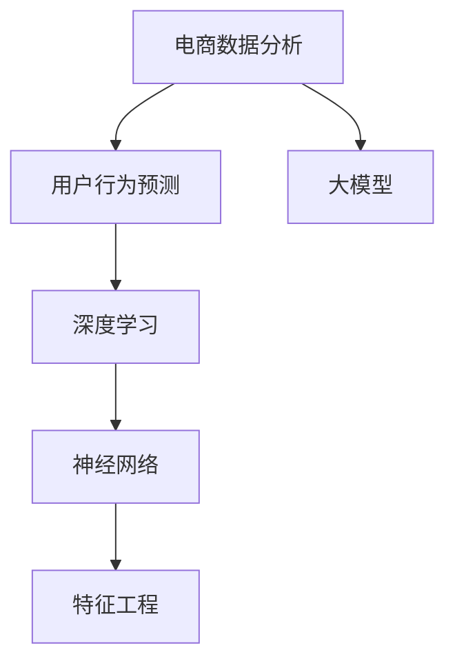

                 

# 大模型在电商用户行为预测中的应用

> 关键词：大模型,电商用户行为预测,深度学习,神经网络,特征工程,预测模型,电商数据分析,电商营销

## 1. 背景介绍

### 1.1 问题由来
电商行业正处于飞速发展阶段，如何通过数据驱动的方式提升用户转化率和销售额，成为电商企业共同面临的挑战。传统的电商数据分析方法往往依赖于手工特征工程，需要耗费大量时间和人力，且结果可能不够准确。而近年来，深度学习和神经网络技术在电商用户行为预测中的应用，逐步成为了行业热点。

用户行为预测是指通过分析用户的历史数据，预测其未来的购买行为。电商企业通过精准预测用户行为，能够有针对性地进行个性化推荐、定向广告投放、库存管理等，从而提升用户体验和销售额。

传统电商数据分析方法主要包括以下几种：

1. **规则驱动的方法**：通过建立规则引擎，结合用户行为数据，预测用户是否会购买某件商品。但规则依赖人工设计，不易扩展且容易失效。
2. **基于协同过滤的推荐系统**：通过分析用户和商品之间的协同行为，推荐用户可能感兴趣的商品。但协同过滤方法面临冷启动和数据稀疏问题。
3. **基于内容的推荐系统**：通过分析商品特征，预测用户对相似商品的兴趣。但需要人工提取和处理商品特征，效率低下。

基于大模型的用户行为预测方法，通过预训练模型学习大量的知识，直接在数据上微调得到用户行为预测模型，具有高效、灵活、准确的特点。

### 1.2 问题核心关键点
电商用户行为预测的核心在于如何高效、准确地从海量电商数据中提取出用户特征，并利用这些特征训练出高精度的预测模型。具体包括以下几个关键点：

1. **数据预处理与特征工程**：从原始电商数据中提取有价值的特征，如用户历史购买记录、浏览记录、评论记录等。
2. **模型选择与优化**：选择合适的深度学习模型，如DNN、RNN、Transformer等，并在数据上微调得到预测模型。
3. **模型评估与调优**：通过交叉验证、A/B测试等方法，评估模型性能，并根据反馈调整模型参数。
4. **模型部署与监控**：将训练好的模型集成到电商系统，实现实时预测，并监控模型效果。

本节将围绕这些关键点，系统性地介绍如何利用大模型进行电商用户行为预测。

## 2. 核心概念与联系

### 2.1 核心概念概述

为更好地理解电商用户行为预测的大模型方法，本节将介绍几个密切相关的核心概念：

- 大模型：以自回归（如GPT）或自编码（如BERT）模型为代表的深度学习模型，通过大规模无标签数据预训练学习通用语言表示。
- 电商数据分析：通过分析电商用户行为数据，提取用户特征，理解用户需求和行为规律。
- 用户行为预测：利用历史数据预测用户未来的购买行为，提升个性化推荐和广告投放的精准性。
- 深度学习：基于多层神经网络，通过反向传播算法进行训练，自动学习数据中的复杂模式。
- 神经网络：由多层神经元组成的非线性映射结构，通过参数更新实现复杂的模式识别。
- 特征工程：将原始数据转化为有意义的特征向量，用于训练预测模型。

这些核心概念之间的逻辑关系可以通过以下Mermaid流程图来展示：



这个流程图展示了大模型在电商用户行为预测过程中的关键概念及其之间的关系：

1. 电商数据分析为电商用户行为预测提供了原始数据。
2. 深度学习通过多层神经网络，自动提取数据中的复杂特征。
3. 神经网络通过参数更新，学习数据中的复杂模式。
4. 特征工程将原始数据转化为有意义的特征，用于模型训练。
5. 大模型通过预训练和微调，获取电商用户的知识表示。

这些概念共同构成了大模型在电商用户行为预测的完整框架，使其能够在电商场景下发挥强大的预测能力。

## 3. 核心算法原理 & 具体操作步骤
### 3.1 算法原理概述

基于大模型的电商用户行为预测，本质上是一个深度学习任务。其核心思想是：通过预训练大模型，学习电商用户的行为模式和偏好，然后在特定用户数据上进行微调，得到高精度的用户行为预测模型。

形式化地，假设用户数据集为 $D=\{(x_i, y_i)\}_{i=1}^N$，其中 $x_i$ 为用户行为记录，$y_i$ 为用户的未来购买行为（0或1）。预测模型的目标是找到一个函数 $f$，使得 $f(x_i)$ 接近于 $y_i$。

模型训练的目标是最小化损失函数 $\mathcal{L}$，即：

$$
\theta^* = \mathop{\arg\min}_{\theta} \mathcal{L}(f_\theta, D)
$$

其中 $f_\theta$ 为模型函数，$\theta$ 为模型参数。常见的损失函数包括交叉熵损失、均方误差损失等。

通过梯度下降等优化算法，模型函数 $f_\theta$ 不断更新，最小化损失函数 $\mathcal{L}$，使得模型输出逼近真实标签。由于大模型已经通过预训练获得了较多的电商用户知识，因此即使在小规模数据集上微调，也能较快收敛到理想的模型参数 $\theta^*$。

### 3.2 算法步骤详解

基于大模型的电商用户行为预测一般包括以下几个关键步骤：

**Step 1: 准备数据集和模型**

- 收集电商用户的历史行为数据，如浏览记录、购买记录、评价记录等。
- 将数据集划分为训练集、验证集和测试集，确保训练数据和测试数据分布一致。
- 选择合适的预训练语言模型 $M_{\theta}$ 作为初始化参数，如BERT、GPT等。

**Step 2: 特征工程**

- 从原始电商数据中提取有意义的特征，如用户ID、商品ID、浏览时长、浏览次数等。
- 对数据进行归一化、标准化、缺失值处理等预处理步骤。
- 利用深度学习模型，将原始数据转化为高维特征表示。

**Step 3: 模型构建**

- 设计深度学习模型结构，如DNN、RNN、Transformer等。
- 使用预训练模型作为初始化参数，在电商用户数据上进行微调。
- 选择合适的优化算法，如Adam、SGD等，并设置学习率、批大小、迭代轮数等。

**Step 4: 训练模型**

- 将训练集数据分批次输入模型，前向传播计算损失函数。
- 反向传播计算参数梯度，根据设定的优化算法和学习率更新模型参数。
- 周期性在验证集上评估模型性能，根据性能指标决定是否触发 Early Stopping。
- 重复上述步骤直到满足预设的迭代轮数或 Early Stopping 条件。

**Step 5: 测试和部署**

- 在测试集上评估训练好的模型，对比微调前后的精度提升。
- 使用训练好的模型对新样本进行推理预测，集成到电商系统中。
- 持续收集新数据，定期重新微调模型，以适应数据分布的变化。

以上是基于大模型电商用户行为预测的一般流程。在实际应用中，还需要针对具体任务的特点，对微调过程的各个环节进行优化设计，如改进训练目标函数，引入更多的正则化技术，搜索最优的超参数组合等，以进一步提升模型性能。

### 3.3 算法优缺点

基于大模型的电商用户行为预测方法具有以下优点：

1. 高效灵活。利用大模型的预训练知识，可以快速适应特定电商用户的数据分布，高效构建预测模型。
2. 精度高。大模型通过大规模数据预训练，能够学习到复杂的用户行为模式和偏好，预测精度高。
3. 鲁棒性好。大模型通常具有较好的泛化能力，可以较好地适应不同电商平台的业务场景。
4. 可扩展性强。可以通过增加特征工程和模型结构，提升预测效果，适应电商业务的不断发展。

同时，该方法也存在一些局限性：

1. 数据依赖。大模型需要大量的标注数据进行微调，数据获取成本较高。
2. 资源消耗。大模型的训练和推理需要较高的计算资源，成本较高。
3. 可解释性不足。大模型的决策过程缺乏可解释性，难以对其推理逻辑进行分析和调试。

尽管存在这些局限性，但就目前而言，基于大模型的电商用户行为预测方法仍然是电商领域中效果最佳、应用最广泛的预测技术。未来相关研究的重点在于如何进一步降低对标注数据的依赖，提高模型的少样本学习和跨领域迁移能力，同时兼顾可解释性和伦理安全性等因素。

### 3.4 算法应用领域

大模型的电商用户行为预测技术，已经在电商推荐、广告投放、库存管理等多个领域得到了广泛应用，成为电商技术落地的重要手段。

- 电商推荐系统：通过分析用户历史行为，预测用户可能感兴趣的商品，实现个性化推荐。
- 广告投放优化：通过预测用户对广告的兴趣，优化广告投放策略，提升广告点击率和转化率。
- 库存管理优化：预测商品未来的销售趋势，优化库存水平，减少库存积压和缺货现象。
- 用户流失预警：通过预测用户是否会流失，提前采取挽留措施，降低用户流失率。

除了上述这些经典应用外，大模型在电商领域还有更多创新性的应用场景，如价格预测、个性化评价生成、智能客服等，为电商业务带来了全新的突破。

## 4. 数学模型和公式 & 详细讲解  
### 4.1 数学模型构建

本节将使用数学语言对基于大模型的电商用户行为预测过程进行更加严格的刻画。

假设电商用户行为预测模型为 $f_{\theta}$，其中 $\theta$ 为模型参数。给定电商用户数据集 $D=\{(x_i, y_i)\}_{i=1}^N$，其中 $x_i$ 为电商用户行为记录，$y_i$ 为用户的未来购买行为（0或1）。

定义模型 $f_{\theta}$ 在数据样本 $(x,y)$ 上的损失函数为 $\ell(f_{\theta}(x),y)$，则在数据集 $D$ 上的经验风险为：

$$
\mathcal{L}(\theta) = \frac{1}{N} \sum_{i=1}^N \ell(f_{\theta}(x_i),y_i)
$$

常见的损失函数包括交叉熵损失、均方误差损失等。根据损失函数，训练目标是最小化经验风险，即找到最优参数：

$$
\theta^* = \mathop{\arg\min}_{\theta} \mathcal{L}(\theta)
$$

在实践中，我们通常使用基于梯度的优化算法（如SGD、Adam等）来近似求解上述最优化问题。设 $\eta$ 为学习率，则参数的更新公式为：

$$
\theta \leftarrow \theta - \eta \nabla_{\theta}\mathcal{L}(\theta)
$$

其中 $\nabla_{\theta}\mathcal{L}(\theta)$ 为损失函数对参数 $\theta$ 的梯度，可通过反向传播算法高效计算。

### 4.2 公式推导过程

以下我们以二分类任务为例，推导交叉熵损失函数及其梯度的计算公式。

假设模型 $f_{\theta}$ 在输入 $x$ 上的输出为 $\hat{y}=f_{\theta}(x)$，表示用户购买该商品的预测概率。真实标签 $y \in \{0,1\}$。则二分类交叉熵损失函数定义为：

$$
\ell(f_{\theta}(x),y) = -[y\log \hat{y} + (1-y)\log (1-\hat{y})]
$$

将其代入经验风险公式，得：

$$
\mathcal{L}(\theta) = -\frac{1}{N}\sum_{i=1}^N [y_i\log f_{\theta}(x_i)+(1-y_i)\log(1-f_{\theta}(x_i))]
$$

根据链式法则，损失函数对参数 $\theta_k$ 的梯度为：

$$
\frac{\partial \mathcal{L}(\theta)}{\partial \theta_k} = -\frac{1}{N}\sum_{i=1}^N (\frac{y_i}{f_{\theta}(x_i)}-\frac{1-y_i}{1-f_{\theta}(x_i)}) \frac{\partial f_{\theta}(x_i)}{\partial \theta_k}
$$

其中 $\frac{\partial f_{\theta}(x_i)}{\partial \theta_k}$ 可进一步递归展开，利用自动微分技术完成计算。

在得到损失函数的梯度后，即可带入参数更新公式，完成模型的迭代优化。重复上述过程直至收敛，最终得到适应电商用户行为预测的最优模型参数 $\theta^*$。

## 5. 项目实践：代码实例和详细解释说明
### 5.1 开发环境搭建

在进行电商用户行为预测的大模型微调实践前，我们需要准备好开发环境。以下是使用Python进行PyTorch开发的环境配置流程：

1. 安装Anaconda：从官网下载并安装Anaconda，用于创建独立的Python环境。

2. 创建并激活虚拟环境：
```bash
conda create -n pytorch-env python=3.8 
conda activate pytorch-env
```

3. 安装PyTorch：根据CUDA版本，从官网获取对应的安装命令。例如：
```bash
conda install pytorch torchvision torchaudio cudatoolkit=11.1 -c pytorch -c conda-forge
```

4. 安装Transformer库：
```bash
pip install transformers
```

5. 安装各类工具包：
```bash
pip install numpy pandas scikit-learn matplotlib tqdm jupyter notebook ipython
```

完成上述步骤后，即可在`pytorch-env`环境中开始电商用户行为预测的大模型微调实践。

### 5.2 源代码详细实现

下面我们以电商推荐系统为例，给出使用Transformers库对BERT模型进行电商用户行为预测的PyTorch代码实现。

首先，定义电商推荐任务的训练数据处理函数：

```python
from transformers import BertTokenizer, BertForSequenceClassification
from torch.utils.data import Dataset
import torch

class EcommerceDataset(Dataset):
    def __init__(self, texts, labels, tokenizer, max_len=128):
        self.texts = texts
        self.labels = labels
        self.tokenizer = tokenizer
        self.max_len = max_len
        
    def __len__(self):
        return len(self.texts)
    
    def __getitem__(self, item):
        text = self.texts[item]
        label = self.labels[item]
        
        encoding = self.tokenizer(text, return_tensors='pt', max_length=self.max_len, padding='max_length', truncation=True)
        input_ids = encoding['input_ids'][0]
        attention_mask = encoding['attention_mask'][0]
        
        # 对标签进行one-hot编码
        encoded_label = torch.tensor([label], dtype=torch.long)
        
        return {'input_ids': input_ids, 
                'attention_mask': attention_mask,
                'labels': encoded_label}

# 定义标签与id的映射
label2id = {'not_bought': 0, 'bought': 1}
id2label = {v: k for k, v in label2id.items()}

# 创建dataset
tokenizer = BertTokenizer.from_pretrained('bert-base-cased')

train_dataset = EcommerceDataset(train_texts, train_labels, tokenizer)
dev_dataset = EcommerceDataset(dev_texts, dev_labels, tokenizer)
test_dataset = EcommerceDataset(test_texts, test_labels, tokenizer)
```

然后，定义模型和优化器：

```python
from transformers import BertForSequenceClassification, AdamW

model = BertForSequenceClassification.from_pretrained('bert-base-cased', num_labels=2)

optimizer = AdamW(model.parameters(), lr=2e-5)
```

接着，定义训练和评估函数：

```python
from torch.utils.data import DataLoader
from tqdm import tqdm
from sklearn.metrics import classification_report

device = torch.device('cuda') if torch.cuda.is_available() else torch.device('cpu')
model.to(device)

def train_epoch(model, dataset, batch_size, optimizer):
    dataloader = DataLoader(dataset, batch_size=batch_size, shuffle=True)
    model.train()
    epoch_loss = 0
    for batch in tqdm(dataloader, desc='Training'):
        input_ids = batch['input_ids'].to(device)
        attention_mask = batch['attention_mask'].to(device)
        labels = batch['labels'].to(device)
        model.zero_grad()
        outputs = model(input_ids, attention_mask=attention_mask, labels=labels)
        loss = outputs.loss
        epoch_loss += loss.item()
        loss.backward()
        optimizer.step()
    return epoch_loss / len(dataloader)

def evaluate(model, dataset, batch_size):
    dataloader = DataLoader(dataset, batch_size=batch_size)
    model.eval()
    preds, labels = [], []
    with torch.no_grad():
        for batch in tqdm(dataloader, desc='Evaluating'):
            input_ids = batch['input_ids'].to(device)
            attention_mask = batch['attention_mask'].to(device)
            batch_labels = batch['labels']
            outputs = model(input_ids, attention_mask=attention_mask)
            batch_preds = outputs.logits.argmax(dim=1).to('cpu').tolist()
            batch_labels = batch_labels.to('cpu').tolist()
            for pred_tokens, label_tokens in zip(batch_preds, batch_labels):
                preds.append(pred_tokens[0])
                labels.append(label_tokens[0])
                
    print(classification_report(labels, preds))
```

最后，启动训练流程并在测试集上评估：

```python
epochs = 5
batch_size = 16

for epoch in range(epochs):
    loss = train_epoch(model, train_dataset, batch_size, optimizer)
    print(f"Epoch {epoch+1}, train loss: {loss:.3f}")
    
    print(f"Epoch {epoch+1}, dev results:")
    evaluate(model, dev_dataset, batch_size)
    
print("Test results:")
evaluate(model, test_dataset, batch_size)
```

以上就是使用PyTorch对BERT进行电商用户行为预测的完整代码实现。可以看到，得益于Transformer库的强大封装，我们可以用相对简洁的代码完成BERT模型的加载和微调。

### 5.3 代码解读与分析

让我们再详细解读一下关键代码的实现细节：

**EcommerceDataset类**：
- `__init__`方法：初始化电商用户行为记录和标签，分词器等关键组件。
- `__len__`方法：返回数据集的样本数量。
- `__getitem__`方法：对单个样本进行处理，将电商用户行为记录输入编码为token ids，将标签编码为数字，并对其进行定长padding，最终返回模型所需的输入。

**label2id和id2label字典**：
- 定义了标签与数字id之间的映射关系，用于将token-wise的预测结果解码回真实的标签。

**训练和评估函数**：
- 使用PyTorch的DataLoader对数据集进行批次化加载，供模型训练和推理使用。
- 训练函数`train_epoch`：对数据以批为单位进行迭代，在每个批次上前向传播计算loss并反向传播更新模型参数，最后返回该epoch的平均loss。
- 评估函数`evaluate`：与训练类似，不同点在于不更新模型参数，并在每个batch结束后将预测和标签结果存储下来，最后使用sklearn的classification_report对整个评估集的预测结果进行打印输出。

**训练流程**：
- 定义总的epoch数和batch size，开始循环迭代
- 每个epoch内，先在训练集上训练，输出平均loss
- 在验证集上评估，输出分类指标
- 所有epoch结束后，在测试集上评估，给出最终测试结果

可以看到，PyTorch配合Transformer库使得BERT电商用户行为预测的代码实现变得简洁高效。开发者可以将更多精力放在数据处理、模型改进等高层逻辑上，而不必过多关注底层的实现细节。

当然，工业级的系统实现还需考虑更多因素，如模型的保存和部署、超参数的自动搜索、更灵活的任务适配层等。但核心的微调范式基本与此类似。

## 6. 实际应用场景
### 6.1 智能推荐系统

基于大模型的电商推荐系统，可以实时预测用户可能感兴趣的商品，实现个性化推荐。传统的推荐系统往往依赖手工特征工程，难以扩展且易失效。而利用大模型进行电商用户行为预测，可以更高效、准确地提取用户特征，构建预测模型。

在技术实现上，可以收集用户的浏览记录、购买记录、评价记录等行为数据，将数据集作为微调数据。在微调过程中，通过选择合适的损失函数和优化算法，训练得到高精度的电商推荐模型。微调后的模型可以直接输入用户行为记录，输出用户对商品感兴趣的概率，进而实现个性化推荐。

### 6.2 广告投放优化

电商广告投放的目的是通过精准投放提升点击率和转化率，减少广告投放成本。传统的广告投放方法依赖于手工设计的广告素材和投放策略，难以动态优化。而基于大模型的电商用户行为预测，可以实时预测用户对广告的兴趣，优化广告投放策略。

具体而言，可以收集用户的浏览记录、点击记录、评价记录等行为数据，作为微调数据。在微调过程中，通过训练电商用户行为预测模型，输出用户对广告的兴趣概率。将兴趣概率与广告素材和预算结合，动态调整投放策略，可以实现最优的广告投放效果。

### 6.3 库存管理优化

电商平台的库存管理需要平衡商品数量和缺货率。传统的库存管理方法依赖于手动调度和经验判断，难以实时调整。而利用大模型的电商用户行为预测，可以实时预测商品的销售趋势，优化库存水平。

具体而言，可以收集商品的销售记录、浏览记录、评价记录等行为数据，作为微调数据。在微调过程中，训练电商用户行为预测模型，输出商品销售的概率预测。根据销售预测结果，动态调整库存水平，实现最优的库存管理。

### 6.4 用户流失预警

电商平台的用户流失问题严重，传统的流失预警方法依赖于手动设置流失阈值，难以实时预警。而基于大模型的电商用户行为预测，可以实时预测用户流失概率，提前采取挽留措施。

具体而言，可以收集用户的浏览记录、购买记录、评价记录等行为数据，作为微调数据。在微调过程中，训练电商用户行为预测模型，输出用户流失的概率预测。根据流失预测结果，提前采取挽留措施，降低用户流失率。

### 6.5 未来应用展望

随着大模型和电商用户行为预测技术的不断发展，未来在电商领域将有更多创新应用。

在智慧物流领域，基于大模型的电商用户行为预测，可以优化配送路线，提升配送效率，降低物流成本。

在智能客服领域，基于大模型的电商用户行为预测，可以预测用户需求，提供个性化的客服方案，提升用户满意度。

在智能定价领域，基于大模型的电商用户行为预测，可以预测用户对价格的敏感度，优化定价策略，提升销售额。

除了上述这些经典应用外，大模型在电商领域还有更多创新性的应用场景，如智能包装、智能库存、智能营销等，为电商业务带来了全新的突破。

## 7. 工具和资源推荐
### 7.1 学习资源推荐

为了帮助开发者系统掌握大模型电商用户行为预测的理论基础和实践技巧，这里推荐一些优质的学习资源：

1. 《深度学习与自然语言处理》系列博文：由深度学习领域专家撰写，系统介绍深度学习原理和大模型应用。

2. 斯坦福大学《深度学习与自然语言处理》课程：斯坦福大学开设的NLP明星课程，有Lecture视频和配套作业，适合入门NLP领域的基本概念和经典模型。

3. 《深度学习在NLP中的应用》书籍：全面介绍深度学习在自然语言处理中的应用，包括大模型电商用户行为预测在内的新兴技术。

4. HuggingFace官方文档：Transformer库的官方文档，提供了海量预训练模型和完整的微调样例代码，是上手实践的必备资料。

5. Kaggle开源项目：收集了大量的电商用户行为预测数据集和基线模型，助力电商数据分析技术发展。

通过对这些资源的学习实践，相信你一定能够快速掌握大模型电商用户行为预测的精髓，并用于解决实际的电商问题。

### 7.2 开发工具推荐

高效的开发离不开优秀的工具支持。以下是几款用于大模型电商用户行为预测开发的常用工具：

1. PyTorch：基于Python的开源深度学习框架，灵活动态的计算图，适合快速迭代研究。大部分预训练语言模型都有PyTorch版本的实现。

2. TensorFlow：由Google主导开发的开源深度学习框架，生产部署方便，适合大规模工程应用。同样有丰富的预训练语言模型资源。

3. Transformers库：HuggingFace开发的NLP工具库，集成了众多SOTA语言模型，支持PyTorch和TensorFlow，是进行电商用户行为预测开发的利器。

4. Weights & Biases：模型训练的实验跟踪工具，可以记录和可视化模型训练过程中的各项指标，方便对比和调优。与主流深度学习框架无缝集成。

5. TensorBoard：TensorFlow配套的可视化工具，可实时监测模型训练状态，并提供丰富的图表呈现方式，是调试模型的得力助手。

6. Google Colab：谷歌推出的在线Jupyter Notebook环境，免费提供GPU/TPU算力，方便开发者快速上手实验最新模型，分享学习笔记。

合理利用这些工具，可以显著提升大模型电商用户行为预测的开发效率，加快创新迭代的步伐。

### 7.3 相关论文推荐

大模型和电商用户行为预测技术的发展源于学界的持续研究。以下是几篇奠基性的相关论文，推荐阅读：

1. Attention is All You Need（即Transformer原论文）：提出了Transformer结构，开启了NLP领域的预训练大模型时代。

2. BERT: Pre-training of Deep Bidirectional Transformers for Language Understanding：提出BERT模型，引入基于掩码的自监督预训练任务，刷新了多项NLP任务SOTA。

3. Dive into DNN: A New Framework for Deep Learning in NLP：提出深度神经网络架构，为电商用户行为预测提供了深度学习模型基础。

4. Neural Network Methods for E-commerce Recommendation：使用深度学习模型预测电商用户行为，实现个性化推荐。

5. Predictive Analytics for E-commerce：介绍电商用户行为预测的基本方法和实现步骤。

6. E-commerce Recommendation with Deep Learning：结合电商数据，使用深度学习模型进行用户行为预测和推荐。

这些论文代表了大模型电商用户行为预测技术的发展脉络。通过学习这些前沿成果，可以帮助研究者把握学科前进方向，激发更多的创新灵感。

## 8. 总结：未来发展趋势与挑战

### 8.1 总结

本文对基于大模型的电商用户行为预测方法进行了全面系统的介绍。首先阐述了电商用户行为预测的大模型背景和重要性，明确了电商用户行为预测在电商推荐、广告投放、库存管理等多个电商业务场景中的应用价值。其次，从原理到实践，详细讲解了电商用户行为预测的数学模型和关键步骤，给出了电商用户行为预测的完整代码实例。同时，本文还广泛探讨了电商用户行为预测在智能推荐、广告投放、库存管理等多个电商业务场景中的应用前景，展示了电商用户行为预测范式的巨大潜力。此外，本文精选了电商用户行为预测技术的各类学习资源，力求为读者提供全方位的技术指引。

通过本文的系统梳理，可以看到，基于大模型的电商用户行为预测方法正在成为电商领域的重要范式，极大地拓展了电商用户行为预测的预测能力，提高了电商业务的智能化水平。未来，伴随大模型电商用户行为预测技术的不断演进，相信电商业务将迎来更加高效、精准、智能化的新时代。

### 8.2 未来发展趋势

展望未来，大模型电商用户行为预测技术将呈现以下几个发展趋势：

1. 模型规模持续增大。随着算力成本的下降和数据规模的扩张，预训练语言模型的参数量还将持续增长。超大规模语言模型蕴含的丰富电商用户知识，有望支撑更加复杂多变的电商用户行为预测。

2. 微调方法日趋多样。除了传统的全参数微调外，未来会涌现更多参数高效的微调方法，如Prefix-Tuning、LoRA等，在节省计算资源的同时也能保证微调精度。

3. 持续学习成为常态。随着电商用户行为数据不断变化，电商用户行为预测模型也需要持续学习新知识以保持性能。如何在不遗忘原有知识的同时，高效吸收新样本信息，将成为重要的研究课题。

4. 标注样本需求降低。受启发于提示学习(Prompt-based Learning)的思路，未来的电商用户行为预测方法将更好地利用大模型的语言理解能力，通过更加巧妙的任务描述，在更少的标注样本上也能实现理想的电商用户行为预测效果。

5. 多模态电商用户行为预测崛起。当前的电商用户行为预测主要聚焦于纯文本数据，未来会进一步拓展到图像、视频、语音等多模态数据电商用户行为预测。多模态信息的融合，将显著提升电商用户行为预测的准确性和鲁棒性。

6. 多领域电商用户行为预测融合。不同的电商领域，用户行为模式存在较大差异。通过跨领域的电商用户行为预测模型融合，可以实现更广泛、更泛化的电商用户行为预测。

以上趋势凸显了大模型电商用户行为预测技术的广阔前景。这些方向的探索发展，必将进一步提升电商用户行为预测的性能和应用范围，为电商业务带来全新的突破。

### 8.3 面临的挑战

尽管大模型电商用户行为预测技术已经取得了瞩目成就，但在迈向更加智能化、普适化应用的过程中，它仍面临着诸多挑战：

1. 标注成本瓶颈。尽管大模型可以较好地适应电商用户数据，但高质量的标注数据获取成本较高，数据标注工作量较大。如何进一步降低电商用户行为预测对标注数据的依赖，将是一大难题。

2. 模型鲁棒性不足。电商用户行为数据存在诸多噪声，大模型在处理这些噪声时可能出现泛化性能下降的情况。如何在电商用户行为预测模型中引入鲁棒性，提升模型的泛化能力，还需要更多理论和实践的积累。

3. 资源消耗高。大模型的训练和推理需要较高的计算资源，成本较高。如何在保证模型精度的同时，降低计算成本，优化资源使用，仍是未来需要解决的问题。

4. 可解释性不足。电商用户行为预测模型通常是一个黑盒，难以解释其内部工作机制和决策逻辑。如何赋予电商用户行为预测模型更强的可解释性，将是亟待攻克的难题。

5. 数据隐私问题。电商用户行为数据涉及用户隐私，如何在模型训练和应用中保护用户隐私，防止数据泄露，也需要重视。

6. 模型一致性问题。电商用户行为数据分布存在较大波动，电商用户行为预测模型需要保持一致性，才能在不同时间点上保持稳定的性能。如何在数据分布变化时，保持模型一致性，还需要更多研究和实践。

这些挑战凸显了大模型电商用户行为预测技术在实际应用中还需要进一步探索和优化。只有在数据、模型、训练、推理等各环节进行全面优化，才能真正实现电商用户行为预测技术的落地应用。

### 8.4 研究展望

面对电商用户行为预测技术所面临的种种挑战，未来的研究需要在以下几个方面寻求新的突破：

1. 探索无监督和半监督电商用户行为预测方法。摆脱对大规模标注数据的依赖，利用自监督学习、主动学习等无监督和半监督范式，最大限度利用非结构化数据，实现更加灵活高效的电商用户行为预测。

2. 研究参数高效和计算高效的电商用户行为预测范式。开发更加参数高效的电商用户行为预测方法，在固定大部分预训练参数的同时，只更新极少量的任务相关参数。同时优化电商用户行为预测模型的计算图，减少前向传播和反向传播的资源消耗，实现更加轻量级、实时性的部署。

3. 引入因果分析和博弈论工具。将因果分析方法引入电商用户行为预测模型，识别出模型决策的关键特征，增强输出解释的因果性和逻辑性。借助博弈论工具刻画人机交互过程，主动探索并规避模型的脆弱点，提高系统稳定性。

4. 结合符号化先验知识。将符号化的先验知识，如知识图谱、逻辑规则等，与神经网络模型进行巧妙融合，引导电商用户行为预测过程学习更准确、合理的电商用户行为模式。同时加强不同模态数据的整合，实现视觉、语音等多模态信息与电商用户行为数据的协同建模。

5. 融合多领域电商用户行为数据。通过跨领域的电商用户行为数据融合，构建更加全面、准确、泛化的电商用户行为预测模型。结合领域专家的知识，提升电商用户行为预测的精度和泛化能力。

6. 采用模型蒸馏和知识蒸馏技术。通过知识蒸馏技术，将电商用户行为预测模型的知识迁移给轻量级模型，实现高效、实时化的电商用户行为预测。

这些研究方向的探索，必将引领大模型电商用户行为预测技术迈向更高的台阶，为电商业务带来更加高效、精准、智能化的预测服务。面向未来，大模型电商用户行为预测技术还需要与其他人工智能技术进行更深入的融合，如知识表示、因果推理、强化学习等，多路径协同发力，共同推动电商业务的进步。只有勇于创新、敢于突破，才能不断拓展电商用户行为预测技术的边界，让电商业务更具智能化、自动化和人性化。

## 9. 附录：常见问题与解答

**Q1：大模型电商用户行为预测是否适用于所有电商用户行为数据？**

A: 大模型电商用户行为预测适用于大多数电商用户行为数据，特别是对于数据量较大的电商数据集。但对于一些特定领域的电商数据，如小众电商、特殊商品等，可能需要进一步预训练模型以适应领域特定数据。

**Q2：如何选择合适的电商用户行为预测模型？**

A: 电商用户行为预测模型选择应考虑以下几个因素：
1. 数据分布。电商用户行为数据分布可能存在较大差异，选择合适的模型结构以适应数据分布。
2. 计算资源。电商用户行为预测模型通常较大，需要考虑计算资源是否足够。
3. 预测精度。不同模型在电商用户行为预测上的精度存在差异，应根据具体任务选择合适的模型。
4. 训练时间。电商用户行为预测模型的训练时间较长，应综合考虑训练时间和预测精度的平衡。

常见的电商用户行为预测模型包括深度神经网络(DNN)、卷积神经网络(CNN)、循环神经网络(RNN)、Transformer等，应根据具体任务选择适当的模型。

**Q3：电商用户行为预测模型的训练和评估需要注意哪些问题？**

A: 电商用户行为预测模型的训练和评估需要注意以下几个问题：
1. 数据质量。电商用户行为数据可能存在噪声，数据预处理和特征工程是至关重要的。
2. 模型泛化能力。电商用户行为数据分布可能存在较大波动，模型需要具备良好的泛化能力。
3. 模型鲁棒性。电商用户行为数据可能存在异常值，模型需要具备一定的鲁棒性。
4. 模型可解释性。电商用户行为预测模型通常是一个黑盒，如何赋予模型更强的可解释性，是值得关注的。
5. 模型实时性。电商用户行为预测模型需要具备较高的实时性，以支持实时推荐和广告投放等应用场景。

在模型训练和评估过程中，应综合考虑这些因素，不断优化模型结构、特征工程、损失函数和优化算法，以提升模型的预测能力和应用价值。

**Q4：电商用户行为预测模型如何应对电商用户行为数据的动态变化？**

A: 电商用户行为数据分布存在动态变化，电商用户行为预测模型需要具备动态适应的能力。以下是几种应对策略：
1. 模型微调。定期对电商用户行为预测模型进行微调，以适应数据分布的变化。
2. 模型更新。使用新的电商用户行为数据，重新训练电商用户行为预测模型，以提升模型的实时性。
3. 模型融合。将不同时间段的电商用户行为数据融合，构建更加泛化的电商用户行为预测模型。
4. 模型蒸馏。通过知识蒸馏技术，将电商用户行为预测模型的知识迁移给轻量级模型，实现高效、实时化的电商用户行为预测。

这些策略可以根据具体场景和需求，灵活选择和组合，以提升电商用户行为预测模型的动态适应能力。

**Q5：电商用户行为预测模型在实际应用中需要注意哪些问题？**

A: 电商用户行为预测模型在实际应用中需要注意以下几个问题：
1. 数据隐私。电商用户行为数据涉及用户隐私，应在模型训练和应用中保护用户隐私，防止数据泄露。
2. 模型解释。电商用户行为预测模型通常是一个黑盒，难以解释其内部工作机制和决策逻辑。如何赋予电商用户行为预测模型更强的可解释性，是亟待攻克的难题。
3. 模型一致性。电商用户行为数据分布存在较大波动，电商用户行为预测模型需要保持一致性，才能在不同时间点上保持稳定的性能。
4. 模型实时性。电商用户行为预测模型需要具备较高的实时性，以支持实时推荐和广告投放等应用场景。
5. 模型鲁棒性。电商用户行为数据存在噪声，电商用户行为预测模型需要具备一定的鲁棒性。

在模型训练和应用过程中，应综合考虑这些因素，不断优化模型结构、特征工程、损失函数和优化算法，以提升模型的预测能力和应用价值。

---

作者：禅与计算机程序设计艺术 / Zen and the Art of Computer Programming

