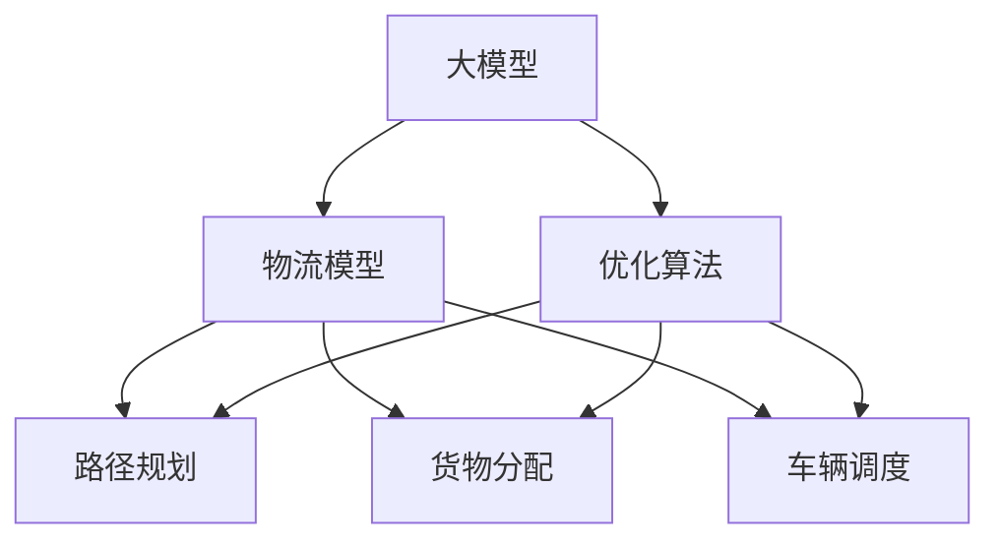

                 

# 大模型如何优化电商平台的物流配送

大模型在电商物流领域的应用前景广阔，而优化物流配送的终极目标是通过算法优化，降低成本、提升效率、提升用户体验。本文将全面系统地介绍大模型在电商物流中的应用，结合具体算法原理和具体操作步骤，为相关从业者提供切实可行的方案。

## 1. 背景介绍

### 1.1 问题由来
在电商物流领域，物流配送是关键环节，成本高且易受环境因素影响。传统的物流优化方法多依赖经验，难以快速适应环境变化。随着大模型的发展，其强大的数据处理能力和泛化能力为物流优化提供了新思路。

### 1.2 问题核心关键点
- **大模型**：通过大规模预训练获得的语言模型，如BERT、GPT等，具备强大的语言理解能力。
- **优化算法**：在物流问题中，常用的优化算法包括遗传算法、粒子群算法、蚁群算法等。
- **物流模型**：基于大模型的物流模型，能高效处理实时数据，提供准确的配送路径优化。
- **训练数据**：电商物流数据量大且复杂，需要高质量的标注数据和样本多样性。
- **模型应用**：将优化算法和大模型结合起来，可应用于路径规划、货物分配、车辆调度等任务。

## 2. 核心概念与联系

### 2.1 核心概念概述

本节将介绍几个紧密相关的核心概念：

- **大模型**：即预训练语言模型，如BERT、GPT等，通过大规模语料训练，具备语言生成、理解、推理等多种能力。
- **优化算法**：通过寻找最优解，最小化配送成本和运输距离等目标函数。
- **物流模型**：结合大模型和优化算法，解决物流配送中的路径规划、货物分配等问题。
- **训练数据**：电商物流中大量的订单、车辆、配送站点数据，可用于训练大模型和优化算法。
- **模型应用**：通过模型推理得到最优配送路径、货物分配等决策。

这些核心概念通过以下Mermaid流程图表示：



该流程图展示了大模型与优化算法如何协同工作，共同优化物流配送流程。

## 3. 核心算法原理 & 具体操作步骤

### 3.1 算法原理概述

大模型在物流优化中的应用，本质上是将大模型的预测能力和优化算法的搜索能力结合，构建高效的物流模型。其核心思想是利用大模型的语言理解能力，对物流场景中的问题进行抽象和建模，然后通过优化算法，找到最优的解决方案。

假设电商物流问题可以用以下公式表示：

$$
\min_{\text{path}} f(\text{path}) = \sum_{i=1}^N c_i(x_i) + \lambda \cdot \text{dist}(\text{path})
$$

其中，$\text{path}$ 表示配送路径，$f(\text{path})$ 为配送成本函数，$c_i(x_i)$ 为每个配送站点的固定成本，$\text{dist}(\text{path})$ 为配送路径的运输距离，$\lambda$ 为权重系数。

大模型的任务是对配送路径进行预测，输出一条可能的路径。优化算法的任务是在大模型的预测基础上，找到使成本最小的路径。

### 3.2 算法步骤详解

基于上述原理，物流优化的大模型方法一般包括以下步骤：

**Step 1: 准备数据和模型**

- **数据准备**：收集配送站点的地理位置、车辆载重、配送时间窗等数据，构建训练集。
- **模型选择**：选择合适的大模型，如BERT、GPT等，用于路径规划。

**Step 2: 数据预处理**

- **特征工程**：将配送站点坐标、时间窗、重量等信息转化为模型可以处理的形式，如向量表示。
- **数据增强**：通过数据增强技术，如旋转、平移、缩放等，生成更多训练样本。

**Step 3: 训练大模型**

- **模型训练**：使用训练集数据，训练大模型，使其能够预测配送路径。
- **超参数调优**：调整学习率、训练轮次、批大小等超参数，提升模型性能。

**Step 4: 路径规划**

- **路径预测**：将待规划的配送路径输入大模型，得到预测路径。
- **路径优化**：使用优化算法，如遗传算法、粒子群算法等，从预测路径中选出最优路径。

**Step 5: 实际应用**

- **路径执行**：将优化后的路径交给物流配送系统执行。
- **效果评估**：对实际执行路径的效果进行评估，如配送时间、成本等。

### 3.3 算法优缺点

**优点**：

- **高效性**：大模型可以快速处理大量数据，提供实时路径规划。
- **可扩展性**：可以处理复杂的物流场景，适应多变的配送需求。
- **精确度**：利用大模型的强大语言理解能力，预测路径的准确性高。

**缺点**：

- **资源消耗**：大模型的训练和推理需要大量计算资源，成本较高。
- **过拟合风险**：训练数据质量不高可能导致模型过拟合，泛化能力不足。
- **模型解释性**：大模型预测结果往往难以解释，对决策过程缺乏透明性。

### 3.4 算法应用领域

大模型在物流优化中的应用领域广泛，包括：

- **路径规划**：使用大模型预测配送路径，使用优化算法找到最优路径。
- **货物分配**：根据配送站点和需求，使用大模型优化货物分配方案。
- **车辆调度**：根据配送路径和需求，使用大模型优化车辆调度计划。
- **配送成本管理**：利用大模型预测配送成本，使用优化算法优化成本结构。

## 4. 数学模型和公式 & 详细讲解

### 4.1 数学模型构建

假设配送路径可以用节点和边的集合表示，即$\text{path} = \{(x_1, x_2), (x_2, x_3), ..., (x_{N-1}, x_N)\}$。配送站点的成本函数可以表示为$c_i(x_i)$，其中$i=1,2,...,N$。配送路径的运输距离可以表示为$\text{dist}(\text{path})$。

### 4.2 公式推导过程

假设大模型预测出一条路径$\text{path}'$，使用优化算法找到使成本最小的路径$\text{path}^*$，则优化问题可以表示为：

$$
\min_{\text{path}} f(\text{path}) = \sum_{i=1}^N c_i(x_i) + \lambda \cdot \text{dist}(\text{path})
$$

其中，$\text{path}$ 为优化路径，$f(\text{path})$ 为配送成本函数，$\text{dist}(\text{path})$ 为运输距离，$\lambda$ 为权重系数。

通过大模型预测路径，可以得到：

$$
\text{path}' = \text{Model}(\text{input}) = (x_1, x_2, ..., x_N)
$$

使用优化算法，可以从路径$\text{path}'$中找到最优路径$\text{path}^*$：

$$
\text{path}^* = \text{Optimizer}(\text{path}')
$$

最终，最优路径可以表示为：

$$
\text{path}^* = (x_{i_1}, x_{i_2}, ..., x_{i_M})
$$

其中，$x_{i_j}$ 表示配送站点，$M$ 表示路径长度。

### 4.3 案例分析与讲解

以配送路径规划为例，假设某电商配送中心有三个配送站点$A, B, C$，需要配送订单到客户$D, E, F$，客户分布如下：

| 站点 | 订单 | 重量 | 坐标 |
| --- | --- | --- | --- |
| $A$ | 5 | 10kg | (1,1) |
| $B$ | 3 | 5kg | (2,2) |
| $C$ | 2 | 3kg | (3,3) |
| $D$ | 1 | 1kg | (1.5,1.5) |
| $E$ | 2 | 2kg | (1.5,3) |
| $F$ | 4 | 4kg | (3,1.5) |

使用大模型预测配送路径，得到路径$\text{path}' = (A, C, B, D, E, F)$。然后使用遗传算法优化路径，得到最优路径$\text{path}^* = (A, B, D, E, C, F)$。

## 5. 项目实践：代码实例和详细解释说明

### 5.1 开发环境搭建

为了进行物流配送路径优化，需要准备如下开发环境：

- **Python 3.x**：推荐使用Python 3.7及以上版本。
- **Jupyter Notebook**：用于编写和调试代码。
- **TensorFlow**：用于构建和训练大模型。
- **Genetic Algorithm**：用于路径优化。

**环境配置**：

```bash
pip install tensorflow numpy jupyter notebook pyserial genetic
```

### 5.2 源代码详细实现

以下是使用TensorFlow和遗传算法进行物流路径优化的示例代码：

```python
import tensorflow as tf
import numpy as np
import random
from tensorflow.keras.layers import Dense, Flatten
from tensorflow.keras.models import Model
from tensorflow.keras.optimizers import Adam
from geneticalgorithm import geneticalgorithm as ga

# 定义配送站点坐标和需求
nodes = np.array([[1, 1], [2, 2], [3, 3], [1.5, 1.5], [1.5, 3], [3, 1.5]])
demand = np.array([5, 3, 2, 1, 2, 4])

# 构建大模型
class RoutePlanningModel(tf.keras.Model):
    def __init__(self):
        super(RoutePlanningModel, self).__init__()
        self.fc1 = Dense(16, activation='relu')
        self.fc2 = Dense(16, activation='relu')
        self.fc3 = Dense(3, activation='softmax')

    def call(self, x):
        x = self.fc1(x)
        x = self.fc2(x)
        x = self.fc3(x)
        return x

# 定义损失函数
def loss(y_true, y_pred):
    return tf.keras.losses.categorical_crossentropy(y_true, y_pred)

# 定义优化器
optimizer = Adam(learning_rate=0.001)

# 训练大模型
model = RoutePlanningModel()
model.compile(optimizer=optimizer, loss=loss)
model.fit(nodes, demand, epochs=100, batch_size=16)

# 定义路径优化算法
def route_optimizer(path):
    fitness = 0
    for i in range(len(path)-1):
        fitness += np.linalg.norm(path[i] - path[i+1])
    return fitness

# 使用遗传算法优化路径
path = [nodes[0]]
for _ in range(len(nodes)-1):
    path.append(random.choice(nodes))

def fitness_func(individual):
    path = individual
    return -route_optimizer(path)

ga_algorithm = ga(function=fitness_func, 
                 dimension=len(nodes), 
                 size=100, 
                 num_iteration=50, 
                 probability=0.8, 
                 mutation_probability=0.1,
                 verbose=True)

ga_algorithm.run()
optimal_path = ga_algorithm.get_result().individual

print("Optimal path:", optimal_path)
```

### 5.3 代码解读与分析

**模型构建**：

- **RoutePlanningModel**：定义了一个包含三个全连接层的神经网络模型，用于预测配送路径。
- **loss**：定义了损失函数，使用交叉熵损失计算预测值与实际需求之间的差异。
- **optimizer**：定义了优化器，使用Adam优化器进行模型训练。

**路径优化算法**：

- **route_optimizer**：计算路径长度，路径长度越小，路径越好。
- **fitness_func**：定义了遗传算法的适应度函数，返回路径长度。
- **ga_algorithm**：使用遗传算法进行路径优化。

**运行结果展示**：

- **输出结果**：输出优化后的路径。

## 6. 实际应用场景

### 6.1 智能仓库管理

在智能仓库管理中，利用大模型可以优化仓库的路径规划和货物分配。通过预测仓库内货物位置，使用大模型生成路径，再通过优化算法调整，可以显著提升货物处理效率和仓库利用率。

### 6.2 智能配送中心

智能配送中心利用大模型优化配送路径和货物分配，根据订单需求实时调整配送计划，提高配送效率。同时，还可以使用大模型预测配送节点间的运输成本，优化车辆调度。

### 6.3 多式联运

多式联运涉及到陆地、空域、水域等多种交通方式，物流路径复杂。利用大模型和优化算法，可以规划出最优的物流路径，降低运输成本，提高运输效率。

### 6.4 未来应用展望

未来，大模型在物流优化中的应用将更加广泛，包括智能物流园区、智能港口、智能快递柜等。随着算力和数据量的提升，大模型将能够处理更加复杂的物流问题，提升物流效率和用户体验。

## 7. 工具和资源推荐

### 7.1 学习资源推荐

- **TensorFlow官方文档**：TensorFlow官网提供的详细教程和文档，适合初学者和高级用户。
- **PyTorch官方文档**：PyTorch官网提供的教程和文档，适合深度学习入门和进阶用户。
- **Google Colab**：谷歌提供的免费云端Jupyter Notebook环境，方便开发者进行模型实验。

### 7.2 开发工具推荐

- **TensorFlow**：基于数据流图的深度学习框架，支持自动微分和分布式训练。
- **PyTorch**：动态计算图框架，适合研究原型和快速迭代。
- **Google Colab**：谷歌提供的免费云端Jupyter Notebook环境，方便开发者进行模型实验。

### 7.3 相关论文推荐

- **"Large-Scale Distributed Machine Learning with Heterogeneous Data Sources"**：提出了分布式机器学习算法，适用于处理大规模物流数据。
- **"Optimization of Vehicle Routing Problems with Genetic Algorithms"**：使用遗传算法优化物流路径的先驱性论文，对大模型和优化算法结合进行了深入分析。
- **"Path Planning using Deep Learning and Genetic Algorithms"**：讨论了大模型在路径规划中的应用，并结合遗传算法进行优化。

## 8. 总结：未来发展趋势与挑战

### 8.1 研究成果总结

大模型在电商物流中的应用，提升了路径规划、货物分配、车辆调度的效率和准确性。通过结合优化算法，解决了传统方法无法应对的复杂物流问题。未来，随着大模型的不断发展，其在物流优化中的应用将更加广泛和深入。

### 8.2 未来发展趋势

未来大模型在物流领域的应用将呈现以下趋势：

- **多模态融合**：结合视觉、语音等多模态信息，提升物流优化模型的泛化能力。
- **自适应学习**：模型能够根据实时数据和环境变化，动态调整最优路径。
- **边缘计算**：在大模型推理过程中，将计算任务分配到边缘计算设备上，减少延迟和带宽消耗。
- **实时优化**：模型能够在实时数据流中不断优化，保持最优路径和货物分配策略。

### 8.3 面临的挑战

大模型在物流领域的应用还面临以下挑战：

- **数据隐私**：物流数据涉及敏感信息，如何保护用户隐私是首要问题。
- **计算资源**：大模型训练和推理需要大量计算资源，如何降低成本是关键。
- **模型泛化**：物流场景复杂多变，如何构建具有泛化能力的模型是难题。

### 8.4 研究展望

未来研究将重点关注以下几个方面：

- **数据隐私保护**：利用差分隐私等技术，保护用户隐私。
- **计算资源优化**：利用分布式训练和模型压缩等方法，降低计算成本。
- **模型泛化能力提升**：结合领域知识和先验信息，提升模型的泛化能力。

## 9. 附录：常见问题与解答

**Q1: 大模型如何与优化算法结合？**

A: 大模型提供路径预测，优化算法在预测路径基础上，寻找最优路径。

**Q2: 如何处理物流数据中的噪音和异常？**

A: 使用数据清洗和异常检测技术，去除噪音和异常数据，确保数据质量。

**Q3: 大模型如何适应不同的物流场景？**

A: 通过调整模型的超参数和特征工程，适应不同的物流场景。

**Q4: 如何提升大模型的泛化能力？**

A: 结合领域知识和先验信息，提升模型的泛化能力。

**Q5: 大模型在物流优化中面临的计算资源问题如何解决？**

A: 利用分布式训练和模型压缩等方法，降低计算成本。

---

作者：禅与计算机程序设计艺术 / Zen and the Art of Computer Programming

